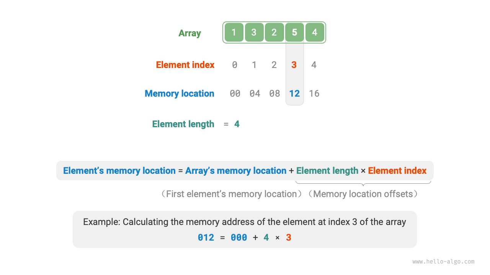

# Mảng (Array)

Một <u>mảng</u> là một cấu trúc dữ liệu tuyến tính hoạt động như một hàng các mục tương tự, được lưu trữ cùng nhau trong bộ nhớ của máy tính ở các vị trí liền kề. Nó giống như một chuỗi duy trì lưu trữ có tổ chức. Mỗi mục trong hàng này có 'vị trí' duy nhất của nó được gọi là <u>chỉ số</u> (index). Vui lòng tham khảo hình bên dưới để quan sát cách mảng hoạt động và nắm bắt các thuật ngữ chính này.


## Các thao tác phổ biến trên mảng

### Khởi tạo mảng

Mảng có thể được khởi tạo theo hai cách tùy thuộc vào nhu cầu: hoặc không có giá trị ban đầu hoặc với các giá trị ban đầu được chỉ định. Khi các giá trị ban đầu không được chỉ định, hầu hết các ngôn ngữ lập trình sẽ đặt các phần tử mảng thành $0$:

=== "Python"

    ```python title="array.py"
    # Khởi tạo mảng
    arr: list[int] = [0] * 5  # [ 0, 0, 0, 0, 0 ]
    nums: list[int] = [1, 3, 2, 5, 4]
    ```

=== "C++"

    ```cpp title="array.cpp"
    /* Khởi tạo mảng */
    // Lưu trữ trên stack
    int arr[5];
    int nums[5] = { 1, 3, 2, 5, 4 };
    // Lưu trữ trên heap (cần giải phóng bộ nhớ thủ công)
    int* arr1 = new int[5];
    int* nums1 = new int[5] { 1, 3, 2, 5, 4 };
    ```

=== "Java"

    ```java title="array.java"
    /* Khởi tạo mảng */
    int[] arr = new int[5]; // { 0, 0, 0, 0, 0 }
    int[] nums = { 1, 3, 2, 5, 4 };
    ```

=== "C#"

    ```csharp title="array.cs"
    /* Khởi tạo mảng */
    int[] arr = new int[5]; // [ 0, 0, 0, 0, 0 ]
    int[] nums = [1, 3, 2, 5, 4];
    ```

=== "Go"

    ```go title="array.go"
    /* Khởi tạo mảng */
    var arr [5]int
    // Trong Go, chỉ định độ dài ([5]int) biểu thị một mảng, trong khi không chỉ định nó ([]int) biểu thị một slice.
    // Vì mảng của Go được thiết kế để có độ dài cố định tại thời điểm biên dịch, chỉ các hằng số mới có thể được sử dụng để chỉ định độ dài.
    // Để thuận tiện cho việc triển khai phương thức extend(), Slice sẽ được coi là một Mảng ở đây.
    nums := []int{1, 3, 2, 5, 4}
    ```

=== "Swift"

    ```swift title="array.swift"
    /* Khởi tạo mảng */
    let arr = Array(repeating: 0, count: 5) // [0, 0, 0, 0, 0]
    let nums = [1, 3, 2, 5, 4]
    ```

=== "JS"

    ```javascript title="array.js"
    /* Khởi tạo mảng */
    var arr = new Array(5).fill(0);
    var nums = [1, 3, 2, 5, 4];
    ```

=== "TS"

    ```typescript title="array.ts"
    /* Khởi tạo mảng */
    let arr: number[] = new Array(5).fill(0);
    let nums: number[] = [1, 3, 2, 5, 4];
    ```

=== "Dart"

    ```dart title="array.dart"
    /* Khởi tạo mảng */
    List<int> arr = List.filled(5, 0); // [0, 0, 0, 0, 0]
    List<int> nums = [1, 3, 2, 5, 4];
    ```

=== "Rust"

    ```rust title="array.rs"
    /* Khởi tạo mảng */
    let arr: [i32; 5] = [0; 5]; // [0, 0, 0, 0, 0]
    let slice: &[i32] = &[0; 5];
    // Trong Rust, chỉ định độ dài ([i32; 5]) biểu thị một mảng, trong khi không chỉ định nó (&[i32]) biểu thị một slice.
    // Vì mảng của Rust được thiết kế để có độ dài cố định tại thời điểm biên dịch, chỉ các hằng số mới có thể được sử dụng để chỉ định độ dài.
    // Vectors thường được sử dụng làm mảng động trong Rust.
    // Để thuận tiện cho việc triển khai phương thức extend(), vector sẽ được coi là một mảng ở đây.
    let nums: Vec<i32> = vec![1, 3, 2, 5, 4];
    ```

=== "C"

    ```c title="array.c"
    /* Khởi tạo mảng */
    int arr[5] = { 0 }; // { 0, 0, 0, 0, 0 }
    int nums[5] = { 1, 3, 2, 5, 4 };
    ```

=== "Kotlin"

    ```kotlin title="array.kt"

    ```

=== "Zig"

    ```zig title="array.zig"
    // Khởi tạo mảng
    var arr = [_]i32{0} ** 5; // { 0, 0, 0, 0, 0 }
    var nums = [_]i32{ 1, 3, 2, 5, 4 };
    ```

### Truy cập các phần tử

Các phần tử trong một mảng được lưu trữ trong các không gian bộ nhớ liền kề, giúp việc tính toán địa chỉ bộ nhớ của mỗi phần tử trở nên đơn giản hơn. Công thức được hiển thị trong Hình dưới đây hỗ trợ xác định địa chỉ bộ nhớ của một phần tử, sử dụng địa chỉ bộ nhớ của mảng (cụ thể là địa chỉ của phần tử đầu tiên) và chỉ số của phần tử. Tính toán này hợp lý hóa việc truy cập trực tiếp vào phần tử mong muốn.



Như đã quan sát trong hình trên, lập chỉ mục mảng theo quy ước bắt đầu từ $0$. Mặc dù điều này có vẻ trái trực giác, vì việc đếm thường bắt đầu từ $1$, trong công thức tính địa chỉ, **một chỉ số về cơ bản là một độ lệch so với địa chỉ bộ nhớ**. Đối với địa chỉ của phần tử đầu tiên, độ lệch này là $0$, xác nhận chỉ số của nó là $0$.

Truy cập các phần tử trong một mảng là rất hiệu quả, cho phép chúng ta truy cập ngẫu nhiên bất kỳ phần tử nào trong thời gian $O(1)$.

```src
[file]{array}-[class]{}-[func]{random_access}
```

### Chèn các phần tử

Các phần tử mảng được đóng gói chặt chẽ trong bộ nhớ, không có không gian để chứa thêm dữ liệu giữa chúng. Như được minh họa trong hình dưới đây, việc chèn một phần tử vào giữa một mảng đòi hỏi phải dịch chuyển tất cả các phần tử tiếp theo lùi lại một vị trí để tạo chỗ cho phần tử mới.


Điều quan trọng cần lưu ý là do độ dài cố định của một mảng, việc chèn một phần tử chắc chắn sẽ dẫn đến việc mất phần tử cuối cùng trong mảng. Các giải pháp để giải quyết vấn đề này sẽ được khám phá trong chương "Danh sách".

```src
[file]{array}-[class]{}-[func]{insert}
```

### Xóa các phần tử

Tương tự, như được mô tả trong hình dưới đây, để xóa một phần tử tại chỉ số $i$, tất cả các phần tử sau chỉ số $i$ phải được di chuyển về phía trước một vị trí.


Xin lưu ý rằng sau khi xóa, phần tử cuối cùng trước đây trở nên "vô nghĩa", do đó không yêu cầu sửa đổi cụ thể.

```src
[file]{array}-[class]{}-[func]{remove}
```

Tóm lại, các thao tác chèn và xóa trong mảng có những nhược điểm sau:

- **Độ phức tạp thời gian cao**: Cả chèn và xóa trong một mảng đều có độ phức tạp thời gian trung bình là $O(n)$, trong đó $n$ là độ dài của mảng.
- **Mất các phần tử**: Do độ dài cố định của mảng, các phần tử vượt quá dung lượng của mảng sẽ bị mất trong quá trình chèn.
- **Lãng phí bộ nhớ**: Khởi tạo một mảng dài hơn và chỉ sử dụng phần đầu dẫn đến các phần tử cuối "vô nghĩa" trong quá trình chèn, dẫn đến lãng phí một số không gian bộ nhớ.

### Duyệt mảng

Trong hầu hết các ngôn ngữ lập trình, chúng ta có thể duyệt một mảng bằng cách sử dụng chỉ số hoặc bằng cách lặp trực tiếp qua từng phần tử:

```src
[file]{array}-[class]{}-[func]{traverse}
```

### Tìm kiếm các phần tử

Xác định vị trí một phần tử cụ thể trong một mảng bao gồm việc lặp qua mảng, kiểm tra từng phần tử để xác định xem nó có khớp với giá trị mong muốn hay không.

Vì mảng là cấu trúc dữ liệu tuyến tính, thao tác này thường được gọi là "tìm kiếm tuyến tính".

```src
[file]{array}-[class]{}-[func]{find}
```

### Mở rộng mảng

Trong môi trường hệ thống phức tạp, việc đảm bảo tính khả dụng của không gian bộ nhớ sau một mảng để mở rộng dung lượng an toàn trở nên khó khăn. Do đó, trong hầu hết các ngôn ngữ lập trình, **độ dài của một mảng là bất biến**.

Để mở rộng một mảng, cần tạo một mảng lớn hơn và sau đó sao chép các phần tử từ mảng ban đầu. Thao tác này có độ phức tạp thời gian là $O(n)$ và có thể tốn thời gian đối với các mảng lớn. Mã như sau:

```src
[file]{array}-[class]{}-[func]{extend}
```

## Ưu điểm và hạn chế của mảng

Mảng được lưu trữ trong các không gian bộ nhớ liền kề và bao gồm các phần tử cùng loại. Cách tiếp cận này cung cấp thông tin trước đáng kể mà hệ thống có thể tận dụng để tối ưu hóa hiệu quả của các thao tác cấu trúc dữ liệu.

- **Hiệu quả không gian cao**: Mảng phân bổ một khối bộ nhớ liền kề cho dữ liệu, loại bỏ nhu cầu về chi phí cấu trúc bổ sung.
- **Hỗ trợ truy cập ngẫu nhiên**: Mảng cho phép truy cập thời gian $O(1)$ vào bất kỳ phần tử nào.
- **Tính cục bộ của bộ nhớ cache**: Khi truy cập các phần tử mảng, máy tính không chỉ tải chúng mà còn lưu vào bộ nhớ cache dữ liệu xung quanh, sử dụng bộ nhớ cache tốc độ cao để nâng cao tốc độ hoạt động tiếp theo.

Tuy nhiên, lưu trữ không gian liên tục là một con dao hai lưỡi, với những hạn chế sau:

- **Hiệu quả thấp trong chèn và xóa**: Khi mảng tích lũy nhiều phần tử, việc chèn hoặc xóa các phần tử đòi hỏi phải dịch chuyển một số lượng lớn các phần tử.
- **Độ dài cố định**: Độ dài của một mảng được cố định sau khi khởi tạo. Mở rộng một mảng đòi hỏi phải sao chép tất cả dữ liệu sang một mảng mới, phát sinh chi phí đáng kể.
- **Lãng phí không gian**: Nếu kích thước mảng được phân bổ vượt quá mức cần thiết, không gian thừa sẽ bị lãng phí.

## Các ứng dụng điển hình của mảng

Mảng là cấu trúc dữ liệu cơ bản và được sử dụng rộng rãi. Chúng được ứng dụng thường xuyên trong các thuật toán khác nhau và phục vụ trong việc triển khai các cấu trúc dữ liệu phức tạp.

- **Truy cập ngẫu nhiên**: Mảng là lý tưởng để lưu trữ dữ liệu khi cần lấy mẫu ngẫu nhiên. Bằng cách tạo một chuỗi ngẫu nhiên dựa trên các chỉ số, chúng ta có thể đạt được lấy mẫu ngẫu nhiên một cách hiệu quả.
- **Sắp xếp và tìm kiếm**: Mảng là cấu trúc dữ liệu được sử dụng phổ biến nhất cho các thuật toán sắp xếp và tìm kiếm. Các kỹ thuật như sắp xếp nhanh, sắp xếp trộn, tìm kiếm nhị phân, v.v., chủ yếu hoạt động trên mảng.
- **Bảng tra cứu**: Mảng đóng vai trò là bảng tra cứu hiệu quả để truy xuất nhanh các phần tử hoặc mối quan hệ. Ví dụ: ánh xạ các ký tự với mã ASCII trở nên liền mạch bằng cách sử dụng các giá trị mã ASCII làm chỉ số và lưu trữ các phần tử tương ứng trong mảng.
- **Học máy**: Trong lĩnh vực mạng nơ-ron, mảng đóng một vai trò quan trọng trong việc thực hiện các phép toán đại số tuyến tính quan trọng liên quan đến vectơ, ma trận và tenxơ. Mảng đóng vai trò là cấu trúc dữ liệu chính và được sử dụng rộng rãi nhất trong lập trình mạng nơ-ron.
- **Triển khai cấu trúc dữ liệu**: Mảng đóng vai trò là các khối xây dựng để triển khai các cấu trúc dữ liệu khác nhau như ngăn xếp, hàng đợi, bảng băm, heap, đồ thị, v.v. Ví dụ: biểu diễn ma trận kề của một đồ thị về cơ bản là một mảng hai chiều.
