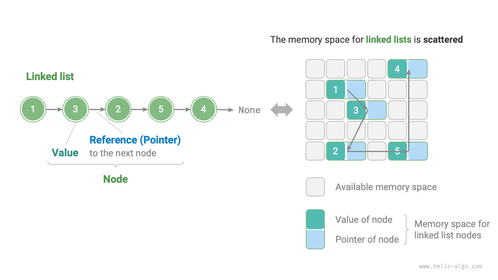

# Danh sách liên kết

Không gian bộ nhớ là một tài nguyên được chia sẻ giữa tất cả các chương trình. Trong một môi trường hệ thống phức tạp, bộ nhớ khả dụng có thể bị phân tán khắp không gian bộ nhớ. Chúng ta hiểu rằng bộ nhớ được cấp phát cho một mảng phải liên tục. Tuy nhiên, đối với các mảng rất lớn, việc tìm một không gian bộ nhớ liền kề đủ lớn có thể là một thách thức. Đây là nơi ưu điểm linh hoạt của danh sách liên kết trở nên rõ ràng.

Một <u>danh sách liên kết</u> là một cấu trúc dữ liệu tuyến tính trong đó mỗi phần tử là một đối tượng nút và các nút được kết nối với nhau thông qua "tham chiếu". Các tham chiếu này giữ địa chỉ bộ nhớ của các nút tiếp theo, cho phép điều hướng từ nút này sang nút khác.

Thiết kế của danh sách liên kết cho phép các nút của chúng được phân phối trên các vị trí bộ nhớ mà không cần địa chỉ bộ nhớ liền kề.



Như trong hình trên, chúng ta thấy rằng khối xây dựng cơ bản của một danh sách liên kết là đối tượng <u>nút</u>. Mỗi nút bao gồm hai thành phần chính: "giá trị" của nút và một "tham chiếu" đến nút tiếp theo.

- Nút đầu tiên trong một danh sách liên kết là "nút đầu", và nút cuối cùng là "nút đuôi".
- Nút đuôi trỏ đến "null", được chỉ định là `null` trong Java, `nullptr` trong C++ và `None` trong Python.
- Trong các ngôn ngữ hỗ trợ con trỏ, như C, C++, Go và Rust, "tham chiếu" này thường được triển khai như một "con trỏ".

Như đoạn code dưới đây minh họa, một `ListNode` trong một danh sách liên kết, ngoài việc giữ một giá trị, cũng phải duy trì một tham chiếu (hoặc con trỏ) bổ sung. Do đó, **một danh sách liên kết chiếm nhiều không gian bộ nhớ hơn một mảng khi lưu trữ cùng một lượng dữ liệu**.

=== "Python"

    ```python title=""
    class ListNode:
        """Lớp nút danh sách liên kết"""
        def __init__(self, val: int):
            self.val: int = val               # Giá trị nút
            self.next: ListNode | None = None # Tham chiếu đến nút tiếp theo
    ```

=== "C++"

    ```cpp title=""
    /* Cấu trúc nút danh sách liên kết */
    struct ListNode {
        int val;         // Giá trị nút
        ListNode *next;  // Con trỏ đến nút tiếp theo
        ListNode(int x) : val(x), next(nullptr) {}  // Hàm tạo
    };
    ```

=== "Java"

    ```java title=""
    /* Lớp nút danh sách liên kết */
    class ListNode {
        int val;        // Giá trị nút
        ListNode next;  // Tham chiếu đến nút tiếp theo
        ListNode(int x) { val = x; }  // Hàm tạo
    }
    ```

=== "C#"

    ```csharp title=""
    /* Lớp nút danh sách liên kết */
    class ListNode(int x) {  // Hàm tạo
        int val = x;         // Giá trị nút
        ListNode? next;      // Tham chiếu đến nút tiếp theo
    }
    ```

=== "Go"

    ```go title=""
    /* Cấu trúc nút danh sách liên kết */
    type ListNode struct {
        Val  int       // Giá trị nút
        Next *ListNode // Con trỏ đến nút tiếp theo
    }

    // NewListNode Constructor, tạo một danh sách liên kết mới
    func NewListNode(val int) *ListNode {
        return &ListNode{
            Val:  val,
            Next: nil,
        }
    }
    ```

=== "Swift"

    ```swift title=""
    /* Lớp nút danh sách liên kết */
    class ListNode {
        var val: Int // Giá trị nút
        var next: ListNode? // Tham chiếu đến nút tiếp theo

        init(x: Int) { // Hàm tạo
            val = x
        }
    }
    ```

=== "JS"

    ```javascript title=""
    /* Lớp nút danh sách liên kết */
    class ListNode {
        constructor(val, next) {
            this.val = (val === undefined ? 0 : val);       // Giá trị nút
            this.next = (next === undefined ? null : next); // Tham chiếu đến nút tiếp theo
        }
    }
    ```

=== "TS"

    ```typescript title=""
    /* Lớp nút danh sách liên kết */
    class ListNode {
        val: number;
        next: ListNode | null;
        constructor(val?: number, next?: ListNode | null) {
            this.val = val === undefined ? 0 : val;        // Giá trị nút
            this.next = next === undefined ? null : next;  // Tham chiếu đến nút tiếp theo
        }
    }
    ```

=== "Dart"

    ```dart title=""
    /* Lớp nút danh sách liên kết */
    class ListNode {
      int val; // Giá trị nút
      ListNode? next; // Tham chiếu đến nút tiếp theo
      ListNode(this.val, [this.next]); // Hàm tạo
    }
    ```

=== "Rust"

    ```rust title=""
    use std::rc::Rc;
    use std::cell::RefCell;
    /* Lớp nút danh sách liên kết */
    #[derive(Debug)]
    struct ListNode {
        val: i32, // Giá trị nút
        next: Option<Rc<RefCell<ListNode>>>, // Con trỏ đến nút tiếp theo
    }
    ```

=== "C"

    ```c title=""
    /* Cấu trúc nút danh sách liên kết */
    typedef struct ListNode {
        int val;               // Giá trị nút
        struct ListNode *next; // Con trỏ đến nút tiếp theo
    } ListNode;

    /* Hàm tạo */
    ListNode *newListNode(int val) {
        ListNode *node;
        node = (ListNode *) malloc(sizeof(ListNode));
        node->val = val;
        node->next = NULL;
        return node;
    }
    ```

=== "Kotlin"

    ```kotlin title=""

    ```

=== "Zig"

    ```zig title=""
    // Lớp nút danh sách liên kết
    pub fn ListNode(comptime T: type) type {
        return struct {
            const Self = @This();

            val: T = 0, // Giá trị nút
            next: ?*Self = null, // Con trỏ đến nút tiếp theo

            // Hàm tạo
            pub fn init(self: *Self, x: i32) void {
                self.val = x;
                self.next = null;
            }
        };
    }
    ```

## Các thao tác phổ biến trên danh sách liên kết

### Khởi tạo một danh sách liên kết

Xây dựng một danh sách liên kết là một quá trình hai bước: đầu tiên, khởi tạo mỗi đối tượng nút, và thứ hai, tạo các liên kết tham chiếu giữa các nút. Sau khi khởi tạo, chúng ta có thể duyệt qua tất cả các nút tuần tự từ nút đầu bằng cách theo tham chiếu `next`.

=== "Python"

    ```python title="linked_list.py"
    # Khởi tạo danh sách liên kết: 1 -> 3 -> 2 -> 5 -> 4
    # Khởi tạo mỗi nút
    n0 = ListNode(1)
    n1 = ListNode(3)
    n2 = ListNode(2)
    n3 = ListNode(5)
    n4 = ListNode(4)
    # Xây dựng tham chiếu giữa các nút
    n0.next = n1
    n1.next = n2
    n2.next = n3
    n3.next = n4
    ```

=== "C++"

    ```cpp title="linked_list.cpp"
    /* Khởi tạo danh sách liên kết: 1 -> 3 -> 2 -> 5 -> 4 */
    // Khởi tạo mỗi nút
    ListNode* n0 = new ListNode(1);
    ListNode* n1 = new ListNode(3);
    ListNode* n2 = new ListNode(2);
    ListNode* n3 = new ListNode(5);
    ListNode* n4 = new ListNode(4);
    // Xây dựng tham chiếu giữa các nút
    n0->next = n1;
    n1->next = n2;
    n2->next = n3;
    n3->next = n4;
    ```

=== "Java"

    ```java title="linked_list.java"
    /* Khởi tạo danh sách liên kết: 1 -> 3 -> 2 -> 5 -> 4 */
    // Khởi tạo mỗi nút
    ListNode n0 = new ListNode(1);
    ListNode n1 = new ListNode(3);
    ListNode n2 = new ListNode(2);
    ListNode n3 = new ListNode(5);
    ListNode n4 = new ListNode(4);
    // Xây dựng tham chiếu giữa các nút
    n0.next = n1;
    n1.next = n2;
    n2.next = n3;
    n3.next = n4;
    ```

=== "C#"

    ```csharp title="linked_list.cs"
    /* Khởi tạo danh sách liên kết: 1 -> 3 -> 2 -> 5 -> 4 */
    // Khởi tạo mỗi nút
    ListNode n0 = new(1);
    ListNode n1 = new(3);
    ListNode n2 = new(2);
    ListNode n3 = new(5);
    ListNode n4 = new(4);
    // Xây dựng tham chiếu giữa các nút
    n0.next = n1;
    n1.next = n2;
    n2.next = n3;
    n3.next = n4;
    ```

=== "Go"

    ```go title="linked_list.go"
    /* Khởi tạo danh sách liên kết: 1 -> 3 -> 2 -> 5 -> 4 */
    // Khởi tạo mỗi nút
    n0 := NewListNode(1)
    n1 := NewListNode(3)
    n2 := NewListNode(2)
    n3 := NewListNode(5)
    n4 := NewListNode(4)
    // Xây dựng tham chiếu giữa các nút
    n0.Next = n1
    n1.Next = n2
    n2.Next = n3
    n3.Next = n4
    ```

=== "Swift"

    ```swift title="linked_list.swift"
    /* Khởi tạo danh sách liên kết: 1 -> 3 -> 2 -> 5 -> 4 */
    // Khởi tạo mỗi nút
    let n0 = ListNode(x: 1)
    let n1 = ListNode(x: 3)
    let n2 = ListNode(x: 2)
    let n3 = ListNode(x: 5)
    let n4 = ListNode(x: 4)
    // Xây dựng tham chiếu giữa các nút
    n0.next = n1
    n1.next = n2
    n2.next = n3
    n3.next = n4
    ```

=== "JS"

    ```javascript title="linked_list.js"
    /* Khởi tạo danh sách liên kết: 1 -> 3 -> 2 -> 5 -> 4 */
    // Khởi tạo mỗi nút
    const n0 = new ListNode(1);
    const n1 = new ListNode(3);
    const n2 = new ListNode(2);
    const n3 = new ListNode(5);
    const n4 = new ListNode(4);
    // Xây dựng tham chiếu giữa các nút
    n0.next = n1;
    n1.next = n2;
    n2.next = n3;
    n3.next = n4;
    ```

=== "TS"

    ```typescript title="linked_list.ts"
    /* Khởi tạo danh sách liên kết: 1 -> 3 -> 2 -> 5 -> 4 */
    // Khởi tạo mỗi nút
    const n0 = new ListNode(1);
    const n1 = new ListNode(3);
    const n2 = new ListNode(2);
    const n3 = new ListNode(5);
    const n4 = new ListNode(4);
    // Xây dựng tham chiếu giữa các nút
    n0.next = n1;
    n1.next = n2;
    n2.next = n3;
    n3.next = n4;
    ```

=== "Dart"

    ```dart title="linked_list.dart"
    /* Khởi tạo danh sách liên kết: 1 -> 3 -> 2 -> 5 -> 4 */
    // Khởi tạo mỗi nút
    ListNode n0 = ListNode(1);
    ListNode n1 = ListNode(3);
    ListNode n2 = ListNode(2);
    ListNode n3 = ListNode(5);
    ListNode n4 = ListNode(4);
    // Xây dựng tham chiếu giữa các nút
    n0.next = n1;
    n1.next = n2;
    n2.next = n3;
    n3.next = n4;
    ```

=== "Rust"

    ```rust title="linked_list.rs"
    /* Khởi tạo danh sách liên kết: 1 -> 3 -> 2 -> 5 -> 4 */
    // Khởi tạo mỗi nút
    let n0 = Rc::new(RefCell::new(ListNode { val: 1, next: None }));
    let n1 = Rc::new(RefCell::new(ListNode { val: 3, next: None }));
    let n2 = Rc::new(RefCell::new(ListNode { val: 2, next: None }));
    let n3 = Rc::new(RefCell::new(ListNode { val: 5, next: None }));
    let n4 = Rc::new(RefCell::new(ListNode { val: 4, next: None }));

    // Xây dựng tham chiếu giữa các nút
    n0.borrow_mut().next = Some(n1.clone());
    n1.borrow_mut().next = Some(n2.clone());
    n2.borrow_mut().next = Some(n3.clone());
    n3.borrow_mut().next = Some(n4.clone());
    ```

=== "C"

    ```c title="linked_list.c"
    /* Khởi tạo danh sách liên kết: 1 -> 3 -> 2 -> 5 -> 4 */
    // Khởi tạo mỗi nút
    ListNode* n0 = newListNode(1);
    ListNode* n1 = newListNode(3);
    ListNode* n2 = newListNode(2);
    ListNode* n3 = newListNode(5);
    ListNode* n4 = newListNode(4);
    // Xây dựng tham chiếu giữa các nút
    n0->next = n1;
    n1->next = n2;
    n2->next = n3;
    n3->next = n4;
    ```

=== "Kotlin"

    ```kotlin title="linked_list.kt"

    ```

=== "Zig"

    ```zig title="linked_list.zig"
    // Khởi tạo danh sách liên kết
    // Khởi tạo mỗi nút
    var n0 = inc.ListNode(i32){.val = 1};
    var n1 = inc.ListNode(i32){.val = 3};
    var n2 = inc.ListNode(i32){.val = 2};
    var n3 = inc.ListNode(i32){.val = 5};
    var n4 = inc.ListNode(i32){.val = 4};
    // Xây dựng tham chiếu giữa các nút
    n0.next = &n1;
    n1.next = &n2;
    n2.next = &n3;
    n3.next = &n4;
    ```

Mảng nói chung là một biến, ví dụ: mảng `nums` bao gồm các phần tử như `nums[0]`, `nums[1]`, v.v., trong khi một danh sách liên kết được tạo thành từ một số đối tượng nút riêng biệt. **Chúng ta thường tham chiếu đến một danh sách liên kết bằng nút đầu của nó**, ví dụ: danh sách liên kết trong đoạn code trước được gọi là `n0`.

### Chèn nút

Chèn một nút vào một danh sách liên kết rất dễ dàng. Như trong hình dưới đây, giả sử chúng ta muốn chèn một nút mới `P` giữa hai nút liền kề `n0` và `n1`. **Điều này có thể đạt được bằng cách chỉ cần sửa đổi hai tham chiếu nút (con trỏ)**, với độ phức tạp thời gian là $O(1)$.

So sánh, việc chèn một phần tử vào một mảng có độ phức tạp thời gian là $O(n)$, điều này trở nên kém hiệu quả hơn khi xử lý khối lượng dữ liệu lớn.


```src
[file]{linked_list}-[class]{}-[func]{insert}
```

### Xóa nút

Như trong hình dưới đây, việc xóa một nút khỏi một danh sách liên kết cũng rất dễ dàng, **chỉ liên quan đến việc sửa đổi tham chiếu (con trỏ) của một nút duy nhất**.

Điều quan trọng cần lưu ý là ngay cả khi nút `P` tiếp tục trỏ đến `n1` sau khi bị xóa, nó sẽ trở nên không thể truy cập được trong quá trình duyệt danh sách liên kết. Điều này có nghĩa là `P` không còn là một phần của danh sách liên kết.


```src
[file]{linked_list}-[class]{}-[func]{remove}
```

### Truy cập nút

**Truy cập các nút trong một danh sách liên kết kém hiệu quả hơn**. Như đã đề cập trước đó, bất kỳ phần tử nào trong một mảng có thể được truy cập trong thời gian $O(1)$. Ngược lại, với một danh sách liên kết, chương trình liên quan đến việc bắt đầu từ nút đầu và tuần tự duyệt qua các nút cho đến khi tìm thấy nút mong muốn. Nói cách khác, để truy cập nút thứ $i$ trong một danh sách liên kết, chương trình phải lặp qua $i - 1$ nút, dẫn đến độ phức tạp thời gian là $O(n)$.

```src
[file]{linked_list}-[class]{}-[func]{access}
```

### Tìm kiếm nút

Duyệt danh sách liên kết để định vị một nút có giá trị khớp với `target`, và sau đó xuất chỉ mục của nút đó trong danh sách liên kết. Thủ tục này cũng là một ví dụ về tìm kiếm tuyến tính. Code tương ứng được cung cấp dưới đây:

```src
[file]{linked_list}-[class]{}-[func]{find}
```

## Mảng so với danh sách liên kết

Bảng dưới đây tóm tắt các đặc điểm của mảng và danh sách liên kết, và nó cũng so sánh hiệu quả của chúng trong các hoạt động khác nhau. Vì chúng sử dụng các chiến lược lưu trữ đối lập, các thuộc tính và hiệu quả hoạt động tương ứng của chúng thể hiện sự tương phản rõ rệt.

<p align="center"> Bảng <id> &nbsp; So sánh hiệu quả của mảng và danh sách liên kết </p>

|                    | Mảng                                           | Danh sách liên kết            |
| ------------------ | ------------------------------------------------ | ----------------------- |
| Lưu trữ            | Không gian bộ nhớ liền kề                          | Không gian bộ nhớ phân tán  |
| Mở rộng dung lượng | Độ dài cố định                                     | Mở rộng linh hoạt      |
| Hiệu quả bộ nhớ  | Ít bộ nhớ trên mỗi phần tử, lãng phí không gian tiềm năng | Nhiều bộ nhớ trên mỗi phần tử |
| Truy cập phần tử | $O(1)$                                           | $O(n)$                  |
| Thêm phần tử    | $O(n)$                                           | $O(1)$                  |
| Xóa phần tử     | $O(n)$                                           | $O(1)$                  |

## Các loại danh sách liên kết phổ biến

Như trong hình dưới đây, có ba loại danh sách liên kết phổ biến.

- **Danh sách liên kết đơn**: Đây là danh sách liên kết tiêu chuẩn được mô tả trước đó. Các nút trong một danh sách liên kết đơn bao gồm một giá trị và một tham chiếu đến nút tiếp theo. Nút đầu tiên được gọi là nút đầu và nút cuối cùng, trỏ đến null (`None`), là nút đuôi.
- **Danh sách liên kết vòng**: Điều này được hình thành khi nút đuôi của một danh sách liên kết đơn trỏ ngược lại nút đầu, tạo ra một vòng lặp. Trong một danh sách liên kết vòng, bất kỳ nút nào cũng có thể hoạt động như nút đầu.
- **Danh sách liên kết đôi**: Ngược lại với một danh sách liên kết đơn, một danh sách liên kết đôi duy trì các tham chiếu theo hai hướng. Mỗi nút chứa các tham chiếu (con trỏ) đến cả nút kế nhiệm (nút tiếp theo) và nút tiền nhiệm (nút trước đó). Mặc dù danh sách liên kết đôi cung cấp sự linh hoạt hơn để duyệt theo cả hai hướng, nhưng chúng cũng tiêu thụ nhiều không gian bộ nhớ hơn.

=== "Python"

    ```python title=""
    class ListNode:
        """Lớp nút danh sách liên kết hai chiều"""
        def __init__(self, val: int):
            self.val: int = val                # Giá trị nút
            self.next: ListNode | None = None  # Tham chiếu đến nút kế nhiệm
            self.prev: ListNode | None = None  # Tham chiếu đến nút tiền nhiệm
    ```

=== "C++"

    ```cpp title=""
    /* Cấu trúc nút danh sách liên kết hai chiều */
    struct ListNode {
        int val;         // Giá trị nút
        ListNode *next;  // Con trỏ đến nút kế nhiệm
        ListNode *prev;  // Con trỏ đến nút tiền nhiệm
        ListNode(int x) : val(x), next(nullptr), prev(nullptr) {}  // Hàm tạo
    };
    ```

=== "Java"

    ```java title=""
    /* Lớp nút danh sách liên kết hai chiều */
    class ListNode {
        int val;        // Giá trị nút
        ListNode next;  // Tham chiếu đến nút tiếp theo
        ListNode prev;  // Tham chiếu đến nút tiền nhiệm
        ListNode(int x) { val = x; }  // Hàm tạo
    }
    ```

=== "C#"

    ```csharp title=""
    /* Lớp nút danh sách liên kết hai chiều */
    class ListNode(int x) {  // Hàm tạo
        int val = x;    // Giá trị nút
        ListNode next;  // Tham chiếu đến nút tiếp theo
        ListNode prev;  // Tham chiếu đến nút tiền nhiệm
    }
    ```

=== "Go"

    ```go title=""
    /* Cấu trúc nút danh sách liên kết hai chiều */
    type DoublyListNode struct {
        Val  int             // Giá trị nút
        Next *DoublyListNode // Con trỏ đến nút kế nhiệm
        Prev *DoublyListNode // Con trỏ đến nút tiền nhiệm
    }

    // Khởi tạo NewDoublyListNode
    func NewDoublyListNode(val int) *DoublyListNode {
        return &DoublyListNode{
            Val:  val,
            Next: nil,
            Prev: nil,
        }
    }
    ```

=== "Swift"

    ```swift title=""
    /* Lớp nút danh sách liên kết hai chiều */
    class ListNode {
        var val: Int // Giá trị nút
        var next: ListNode? // Tham chiếu đến nút tiếp theo
        var prev: ListNode? // Tham chiếu đến nút tiền nhiệm

        init(x: Int) { // Hàm tạo
            val = x
        }
    }
    ```

=== "JS"

    ```javascript title=""
    /* Lớp nút danh sách liên kết hai chiều */
    class ListNode {
        constructor(val, next, prev) {
            this.val = val  ===  undefined ? 0 : val;        // Giá trị nút
            this.next = next  ===  undefined ? null : next;  // Tham chiếu đến nút kế nhiệm
            this.prev = prev  ===  undefined ? null : prev;  // Tham chiếu đến nút tiền nhiệm
        }
    }
    ```

=== "TS"

    ```typescript title=""
    /* Lớp nút danh sách liên kết hai chiều */
    class ListNode {
        val: number;
        next: ListNode | null;
        prev: ListNode | null;
        constructor(val?: number, next?: ListNode | null, prev?: ListNode | null) {
            this.val = val  ===  undefined ? 0 : val;        // Giá trị nút
            this.next = next  ===  undefined ? null : next;  // Tham chiếu đến nút kế nhiệm
            this.prev = prev  ===  undefined ? null : prev;  // Tham chiếu đến nút tiền nhiệm
        }
    }
    ```

=== "Dart"

    ```dart title=""
    /* Lớp nút danh sách liên kết hai chiều */
    class ListNode {
        int val;        // Giá trị nút
        ListNode next;  // Tham chiếu đến nút tiếp theo
        ListNode prev;  // Tham chiếu đến nút tiền nhiệm
        ListNode(this.val, [this.next, this.prev]);  // Hàm tạo
    }
    ```

=== "Rust"

    ```rust title=""
    use std::rc::Rc;
    use std::cell::RefCell;

    /* Kiểu nút danh sách liên kết hai chiều */
    #[derive(Debug)]
    struct ListNode {
        val: i32, // Giá trị nút
        next: Option<Rc<RefCell<ListNode>>>, // Con trỏ đến nút kế nhiệm
        prev: Option<Rc<RefCell<ListNode>>>, // Con trỏ đến nút tiền nhiệm
    }

    /* Hàm tạo */
    impl ListNode {
        fn new(val: i32) -> Self {
            ListNode {
                val,
                next: None,
                prev: None,
            }
        }
    }
    ```

=== "C"

    ```c title=""
    /* Cấu trúc nút danh sách liên kết hai chiều */
    typedef struct ListNode {
        int val;               // Giá trị nút
        struct ListNode *next; // Con trỏ đến nút kế nhiệm
        struct ListNode *prev; // Con trỏ đến nút tiền nhiệm
    } ListNode;

    /* Hàm tạo */
    ListNode *newListNode(int val) {
        ListNode *node, *next;
        node = (ListNode *) malloc(sizeof(ListNode));
        node->val = val;
        node->next = NULL;
        node->prev = NULL;
        return node;
    }
    ```

=== "Kotlin"

    ```kotlin title=""

    ```

=== "Zig"

    ```zig title=""
    // Lớp nút danh sách liên kết hai chiều
    pub fn ListNode(comptime T: type) type {
        return struct {
            const Self = @This();

            val: T = 0, // Giá trị nút
            next: ?*Self = null, // Con trỏ đến nút kế nhiệm
            prev: ?*Self = null, // Con trỏ đến nút tiền nhiệm

            // Hàm tạo
            pub fn init(self: *Self, x: i32) void {
                self.val = x;
                self.next = null;
                self.prev = null;
            }
        };
    }
    ```


## Các ứng dụng điển hình của danh sách liên kết

Danh sách liên kết đơn thường được sử dụng để triển khai ngăn xếp, hàng đợi, bảng băm và đồ thị.

- **Ngăn xếp và hàng đợi**: Trong danh sách liên kết đơn, nếu các thao tác chèn và xóa xảy ra ở cùng một đầu, nó hoạt động như một ngăn xếp (vào sau ra trước). Ngược lại, nếu các thao tác chèn ở một đầu và xóa ở đầu kia, nó hoạt động như một hàng đợi (vào trước ra trước).
- **Bảng băm**: Danh sách liên kết được sử dụng trong phương pháp kết nối, một phương pháp phổ biến để giải quyết xung đột băm. Ở đây, tất cả các phần tử bị xung đột được nhóm vào một danh sách liên kết.
- **Đồ thị**: Danh sách kề, một phương pháp tiêu chuẩn để biểu diễn đồ thị, liên kết mỗi đỉnh đồ thị với một danh sách liên kết. Danh sách này chứa các phần tử đại diện cho các đỉnh được kết nối với đỉnh tương ứng.

Danh sách liên kết đôi là lý tưởng cho các tình huống yêu cầu truy cập nhanh vào các phần tử trước và sau.

- **Cấu trúc dữ liệu nâng cao**: Trong các cấu trúc như cây đỏ-đen và cây B, việc truy cập vào nút cha là rất cần thiết. Điều này đạt được bằng cách kết hợp một tham chiếu đến nút cha trong mỗi nút, tương tự như một danh sách liên kết đôi.
- **Lịch sử trình duyệt**: Trong trình duyệt web, danh sách liên kết đôi tạo điều kiện điều hướng lịch sử các trang đã truy cập khi người dùng nhấp vào tiến hoặc lùi.
- **Thuật toán LRU**: Danh sách liên kết đôi phù hợp với các thuật toán loại bỏ bộ nhớ cache Ít được sử dụng gần đây nhất (LRU), cho phép xác định nhanh chóng dữ liệu ít được sử dụng gần đây nhất và tạo điều kiện thêm và xóa nút nhanh chóng.

Danh sách liên kết vòng là lý tưởng cho các ứng dụng yêu cầu các hoạt động định kỳ, chẳng hạn như lập lịch tài nguyên trong hệ điều hành.

- **Thuật toán lập lịch vòng tròn**: Trong hệ điều hành, thuật toán lập lịch vòng tròn là một phương pháp lập lịch CPU phổ biến, yêu cầu luân phiên qua một nhóm các tiến trình. Mỗi tiến trình được gán một lát thời gian và khi hết hạn, CPU sẽ xoay vòng sang tiến trình tiếp theo. Hoạt động tuần hoàn này có thể được thực hiện hiệu quả bằng cách sử dụng một danh sách liên kết vòng, cho phép một hệ thống công bằng và chia sẻ thời gian giữa tất cả các tiến trình.
- **Bộ đệm dữ liệu**: Danh sách liên kết vòng cũng được sử dụng trong bộ đệm dữ liệu, như trong trình phát âm thanh và video, nơi luồng dữ liệu được chia thành nhiều khối bộ đệm được sắp xếp theo hình tròn để phát lại liền mạch.
