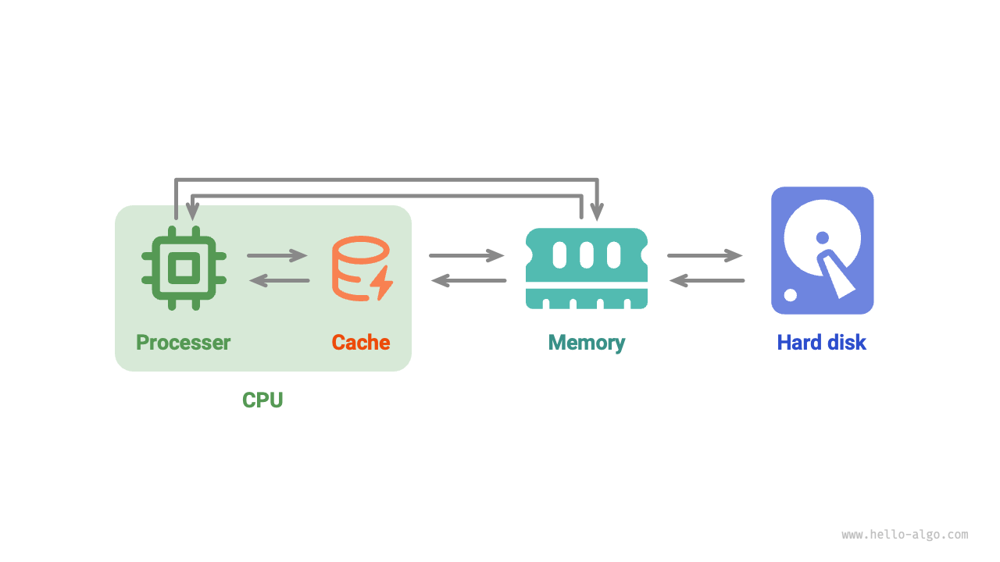

# Bộ nhớ và cache *

Trong hai phần đầu của chương này, chúng ta đã khám phá mảng và danh sách liên kết, hai cấu trúc dữ liệu cơ bản đại diện cho "lưu trữ liên tục" và "lưu trữ phân tán".

Trên thực tế, **cấu trúc vật lý phần lớn quyết định mức độ hiệu quả của chương trình trong việc sử dụng bộ nhớ và cache**, từ đó ảnh hưởng đến hiệu suất tổng thể của thuật toán.

## Thiết bị lưu trữ máy tính

Có ba loại thiết bị lưu trữ trong máy tính: <u>ổ cứng</u>, <u>bộ nhớ truy cập ngẫu nhiên (RAM)</u> và <u>bộ nhớ cache</u>. Bảng sau đây cho thấy vai trò và đặc điểm hiệu suất tương ứng của chúng trong hệ thống máy tính.

 Bảng <id> &nbsp; Thiết bị lưu trữ máy tính 

|               | Ổ cứng                                                              | Bộ nhớ                                                                   | Cache                                                                                             |
| ------------- | ------------------------------------------------------------------- | ------------------------------------------------------------------------ | ------------------------------------------------------------------------------------------------- |
| Sử dụng       | Lưu trữ dữ liệu dài hạn, bao gồm HĐH, chương trình, tệp, v.v.       | Lưu trữ tạm thời các chương trình đang chạy và dữ liệu đang được xử lý   | Lưu trữ dữ liệu và lệnh thường xuyên được truy cập, giảm số lần CPU truy cập vào bộ nhớ           |
| Tính khả biến | Dữ liệu không bị mất sau khi tắt nguồn                              | Dữ liệu bị mất sau khi tắt nguồn                                         | Dữ liệu bị mất sau khi tắt nguồn                                                                  |
| Dung lượng    | Lớn hơn, mức TB                                                     | Nhỏ hơn, mức GB                                                          | Rất nhỏ, mức MB                                                                                   |
| Tốc độ        | Chậm hơn, vài trăm đến hàng nghìn MB/s                              | Nhanh hơn, vài chục GB/s                                                 | Rất nhanh, vài chục đến hàng trăm GB/s                                                            |
| Giá (USD)     | Rẻ hơn, vài xu / GB                                                 | Đắt hơn, vài đô la / GB                                                  | Rất đắt, được định giá cùng với CPU                                                               |

Hệ thống lưu trữ máy tính có thể được hình dung như một kim tự tháp, như trong hình bên dưới. Các thiết bị lưu trữ ở đỉnh kim tự tháp nhanh hơn, có dung lượng nhỏ hơn và đắt hơn. Thiết kế đa cấp này không phải là ngẫu nhiên, mà là kết quả có chủ ý từ sự cân nhắc cẩn thận của các nhà khoa học máy tính và kỹ sư.

- **Việc thay thế ổ cứng bằng bộ nhớ là khó khăn**. Thứ nhất, dữ liệu trong bộ nhớ bị mất sau khi tắt nguồn, khiến nó không phù hợp để lưu trữ dữ liệu dài hạn; thứ hai, bộ nhớ đắt hơn đáng kể so với ổ cứng, hạn chế tính khả thi của nó để sử dụng rộng rãi trên thị trường tiêu dùng.
- **Cache phải đối mặt với sự đánh đổi giữa dung lượng lớn và tốc độ cao**. Khi dung lượng của bộ nhớ cache L1, L2 và L3 tăng lên, kích thước vật lý của chúng tăng lên, làm tăng khoảng cách từ lõi CPU. Điều này dẫn đến thời gian truyền dữ liệu dài hơn và độ trễ truy cập cao hơn. Với công nghệ hiện tại, cấu trúc bộ nhớ cache đa cấp mang lại sự cân bằng tối ưu giữa dung lượng, tốc độ và chi phí.

!!! tip

    Hệ thống phân cấp lưu trữ trong máy tính phản ánh sự cân bằng cẩn thận giữa tốc độ, dung lượng và chi phí. Loại đánh đổi này là phổ biến trong nhiều ngành công nghiệp khác nhau, nơi việc tìm kiếm sự cân bằng tối ưu giữa lợi ích và hạn chế là rất quan trọng.

Nhìn chung, **ổ cứng cung cấp bộ nhớ dài hạn cho khối lượng lớn dữ liệu, bộ nhớ đóng vai trò là bộ nhớ tạm thời cho dữ liệu đang được xử lý trong quá trình thực thi chương trình và cache lưu trữ dữ liệu và lệnh thường xuyên được truy cập để nâng cao hiệu quả thực thi**. Cùng nhau, chúng đảm bảo hoạt động hiệu quả của hệ thống máy tính.

Như trong hình bên dưới, trong quá trình thực thi chương trình, dữ liệu được đọc từ ổ cứng vào bộ nhớ để CPU tính toán. Cache, đóng vai trò là một phần mở rộng của CPU, **tự động tải trước dữ liệu từ bộ nhớ**, cho phép CPU truy cập dữ liệu nhanh hơn. Điều này cải thiện đáng kể hiệu quả thực thi chương trình đồng thời giảm sự phụ thuộc vào bộ nhớ chậm hơn.

## Hiệu quả bộ nhớ của cấu trúc dữ liệu

Về mặt sử dụng không gian bộ nhớ, mảng và danh sách liên kết có những ưu điểm và hạn chế riêng.

Một mặt, **bộ nhớ có giới hạn và không thể được chia sẻ bởi nhiều chương trình**, vì vậy việc tối ưu hóa việc sử dụng không gian trong cấu trúc dữ liệu là rất quan trọng. Mảng tiết kiệm không gian vì các phần tử của chúng được đóng gói chặt chẽ, không yêu cầu thêm bộ nhớ cho các tham chiếu (con trỏ) như trong danh sách liên kết. Tuy nhiên, mảng yêu cầu phân bổ trước một khối bộ nhớ liền kề, điều này có thể dẫn đến lãng phí nếu không gian được phân bổ vượt quá nhu cầu thực tế. Mở rộng một mảng cũng phát sinh thêm chi phí về thời gian và không gian. Ngược lại, danh sách liên kết phân bổ và giải phóng bộ nhớ động cho mỗi nút, mang lại sự linh hoạt cao hơn với chi phí thêm bộ nhớ cho con trỏ.

Mặt khác, trong quá trình thực thi chương trình, **việc phân bổ và giải phóng bộ nhớ lặp đi lặp lại làm tăng sự phân mảnh bộ nhớ**, làm giảm hiệu quả sử dụng bộ nhớ. Mảng, do phương pháp lưu trữ liên tục của chúng, ít có khả năng gây ra phân mảnh bộ nhớ hơn. Ngược lại, danh sách liên kết lưu trữ các phần tử ở các vị trí không liền kề và việc chèn và xóa thường xuyên có thể làm trầm trọng thêm sự phân mảnh bộ nhớ.

## Hiệu quả cache của cấu trúc dữ liệu

Mặc dù bộ nhớ cache có dung lượng nhỏ hơn nhiều so với bộ nhớ, nhưng chúng nhanh hơn nhiều và đóng một vai trò quan trọng trong tốc độ thực thi chương trình. Do dung lượng hạn chế, bộ nhớ cache chỉ có thể lưu trữ một tập hợp con dữ liệu thường xuyên được truy cập. Khi CPU cố gắng truy cập dữ liệu không có trong bộ nhớ cache, sẽ xảy ra <u>lỗi cache</u>, yêu cầu CPU truy xuất dữ liệu cần thiết từ bộ nhớ chậm hơn, điều này có thể ảnh hưởng đến hiệu suất.

Rõ ràng, **càng ít lỗi cache, hiệu quả đọc-ghi dữ liệu của CPU càng cao** và hiệu suất chương trình càng tốt. Tỷ lệ truy xuất dữ liệu thành công từ bộ nhớ cache của CPU được gọi là <u>tỷ lệ命中cache</u>, một số liệu thường được sử dụng để đo lường hiệu quả của bộ nhớ cache.

Để đạt được hiệu quả cao hơn, bộ nhớ cache áp dụng các cơ chế tải dữ liệu sau.

- **Cache lines**: Bộ nhớ cache hoạt động bằng cách lưu trữ và tải dữ liệu theo các đơn vị gọi là cache lines, thay vì các byte riêng lẻ. Cách tiếp cận này cải thiện hiệu quả bằng cách truyền các khối dữ liệu lớn hơn cùng một lúc.
- **Cơ chế tìm nạp trước**: Bộ xử lý dự đoán các mẫu truy cập dữ liệu (ví dụ: truy cập tuần tự hoặc bước cố định) và tải trước dữ liệu vào bộ nhớ cache dựa trên các mẫu này để tăng tỷ lệ命中cache.
- **Tính cục bộ không gian**: Khi một phần dữ liệu cụ thể được truy cập, dữ liệu lân cận có khả năng được truy cập sớm. Để tận dụng điều này, bộ nhớ cache tải dữ liệu liền kề cùng với dữ liệu được yêu cầu, cải thiện tỷ lệ命中.
- **Tính cục bộ thời gian**: Nếu dữ liệu được truy cập, nó có khả năng được truy cập lại trong tương lai gần. Bộ nhớ cache sử dụng nguyên tắc này để giữ lại dữ liệu được truy cập gần đây để cải thiện tỷ lệ命中.

Trên thực tế, **mảng và danh sách liên kết có hiệu quả sử dụng bộ nhớ cache khác nhau**, điều này chủ yếu được phản ánh trong các khía cạnh sau.

- **Không gian chiếm dụng**: Các phần tử danh sách liên kết chiếm nhiều không gian hơn các phần tử mảng, dẫn đến ít dữ liệu hiệu quả hơn được giữ trong bộ nhớ cache.
- **Cache lines**: Dữ liệu danh sách liên kết nằm rải rác trong bộ nhớ và bộ nhớ cache được "tải theo hàng", vì vậy tỷ lệ dữ liệu không hợp lệ được tải cao hơn.
- **Cơ chế tìm nạp trước**: Mẫu truy cập dữ liệu của mảng "dễ đoán" hơn so với danh sách liên kết, tức là hệ thống dễ dàng đoán dữ liệu sắp được tải hơn.
- **Tính cục bộ không gian**: Mảng được lưu trữ trong một không gian bộ nhớ liên tục, vì vậy dữ liệu gần dữ liệu đang được tải có nhiều khả năng được truy cập sớm.

Nhìn chung, **mảng có tỷ lệ命中cache cao hơn và thường hiệu quả hơn trong hoạt động so với danh sách liên kết**. Điều này làm cho các cấu trúc dữ liệu dựa trên mảng trở nên phổ biến hơn trong việc giải quyết các bài toán thuật toán.

Cần lưu ý rằng **hiệu quả cache cao không có nghĩa là mảng luôn tốt hơn danh sách liên kết**. Việc lựa chọn cấu trúc dữ liệu nên phụ thuộc vào các yêu cầu ứng dụng cụ thể. Ví dụ: cả mảng và danh sách liên kết đều có thể triển khai cấu trúc dữ liệu "stack" (sẽ được trình bày chi tiết trong chương tiếp theo), nhưng chúng phù hợp với các tình huống khác nhau.

- Trong các bài toán thuật toán, chúng ta có xu hướng chọn stack dựa trên mảng vì chúng cung cấp hiệu quả hoạt động và khả năng truy cập ngẫu nhiên cao hơn, với chi phí duy nhất là cần phân bổ trước một lượng không gian bộ nhớ nhất định cho mảng.
- Nếu khối lượng dữ liệu rất lớn, có tính động cao và kích thước dự kiến của stack khó ước tính, thì stack dựa trên danh sách liên kết là một lựa chọn tốt hơn. Danh sách liên kết có thể phân phối một lượng lớn dữ liệu ở các phần khác nhau của bộ nhớ và tránh được chi phí bổ sung của việc mở rộng mảng.
