# Thuật toán Quay lui

<u>Thuật toán quay lui</u> (Backtracking algorithm) là một phương pháp giải quyết bài toán thông qua việc tìm kiếm vét cạn. Ý tưởng cốt lõi của nó là bắt đầu từ một trạng thái ban đầu và tìm kiếm vét cạn tất cả các lời giải có thể. Khi tìm thấy một lời giải đúng, nó sẽ được ghi nhận. Quá trình này tiếp tục cho đến khi tìm thấy lời giải hoặc đã thử tất cả các lựa chọn có thể mà không tìm thấy lời giải.

Thuật toán quay lui thường sử dụng "tìm kiếm theo chiều sâu" (depth-first search - DFS) để duyệt qua không gian lời giải. Trong chương "Cây nhị phân", chúng ta đã đề cập rằng duyệt tiền thứ, trung thứ và hậu thứ đều thuộc về tìm kiếm theo chiều sâu. Tiếp theo, chúng ta sẽ xây dựng một bài toán quay lui bằng cách sử dụng duyệt tiền thứ để từng bước hiểu cách thuật toán quay lui hoạt động.

!!! question "Ví dụ 1"

    Cho một cây nhị phân, hãy tìm kiếm và ghi lại tất cả các nút có giá trị bằng $7$, và trả về một danh sách các nút này.

Đối với bài toán này, chúng ta thực hiện duyệt tiền thứ cây và kiểm tra xem giá trị của nút hiện tại có bằng $7$ hay không. Nếu có, chúng ta thêm nút đó vào danh sách kết quả `res`. Triển khai liên quan được hiển thị trong hình ảnh và mã nguồn sau:

```src
[file]{preorder_traversal_i_compact}-[class]{}-[func]{pre_order}
```

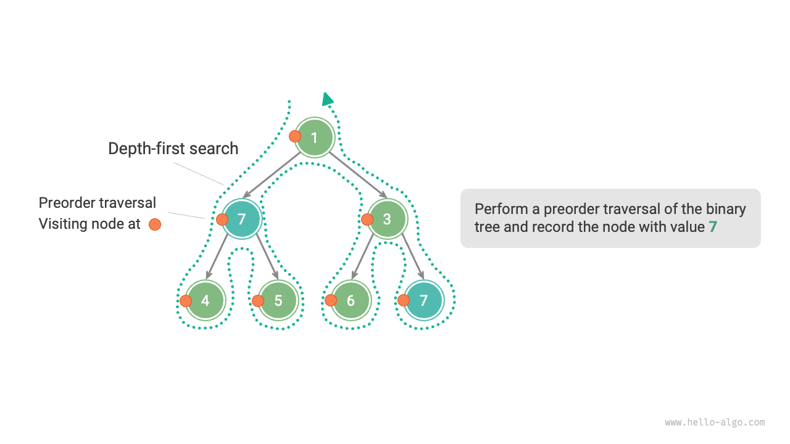

## Thử nghiệm và Quay lui

**Lý do nó được gọi là thuật toán quay lui là vì nó áp dụng chiến lược "thử nghiệm" và "quay lui" khi tìm kiếm trong không gian lời giải**. Khi thuật toán gặp phải một trạng thái mà nó không thể tiếp tục đi tiếp hoặc không thể tìm thấy lời giải thỏa mãn các ràng buộc, nó sẽ hoàn tác (undo) lựa chọn trước đó, quay trở lại trạng thái trước và thử các lựa chọn có thể khác.

Đối với Ví dụ 1, việc ghé thăm mỗi nút đại diện cho một lần "thử nghiệm", trong khi việc bỏ qua một nút lá hoặc câu lệnh `return` đưa quá trình duyệt quay trở lại nút cha đại diện cho một lần "quay lui".

Đáng chú ý là **quay lui không chỉ giới hạn ở việc hàm tự trả về (return)**. Để minh họa điều này, hãy mở rộng Ví dụ 1 một chút.

!!! question "Ví dụ 2"

    Trong một cây nhị phân, hãy tìm kiếm tất cả các nút có giá trị bằng $7$, **và trả về đường đi từ nút gốc đến các nút này**.

Dựa trên mã nguồn từ Ví dụ 1, chúng ta cần sử dụng một danh sách `path` để ghi lại đường đi của các nút đã ghé thăm. Khi đạt đến một nút có giá trị bằng $7$, chúng ta sao chép `path` và thêm nó vào danh sách kết quả `res`. Sau khi hoàn thành duyệt, `res` chứa tất cả các lời giải. Mã nguồn như sau:

```src
[file]{preorder_traversal_ii_compact}-[class]{}-[func]{pre_order}
```

Trong mỗi lần "thử nghiệm", chúng ta ghi lại đường đi bằng cách thêm nút hiện tại vào `path`; trước khi "quay lui", chúng ta cần xóa nút đó khỏi `path`, **để khôi phục lại trạng thái trước lần thử nghiệm này**.

Quan sát quá trình được hiển thị trong hình bên dưới, **chúng ta có thể hiểu thử nghiệm và quay lui như "tiến lên" và "hoàn tác"**, hai thao tác ngược nhau.

=== "<1>"
    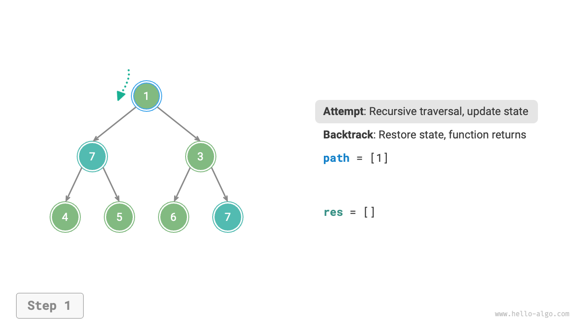

=== "<2>"
    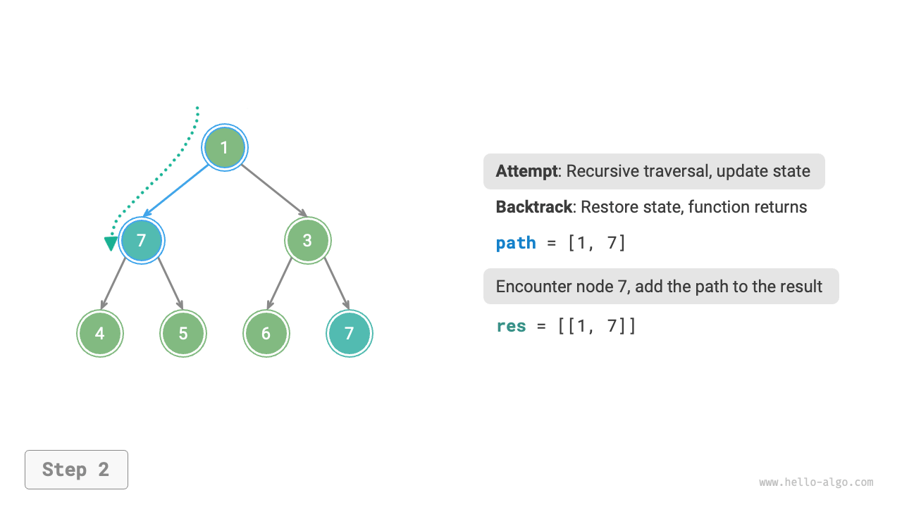

=== "<3>"
    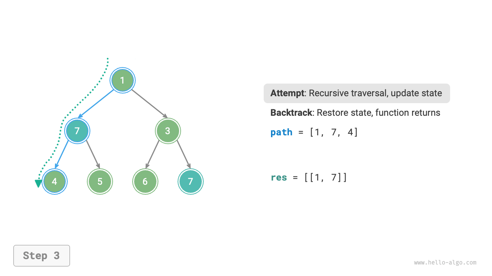

=== "<4>"
    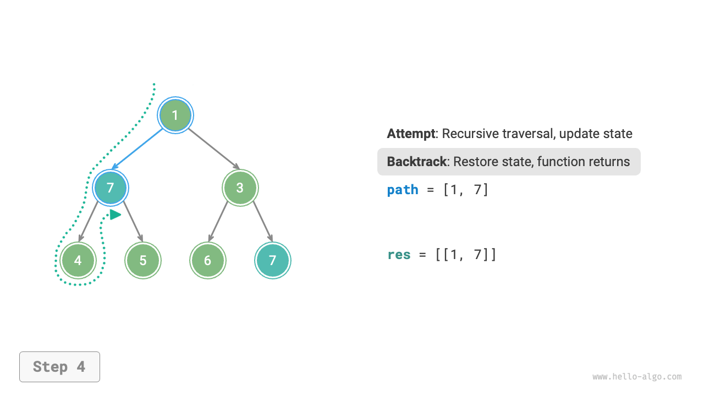

=== "<5>"
    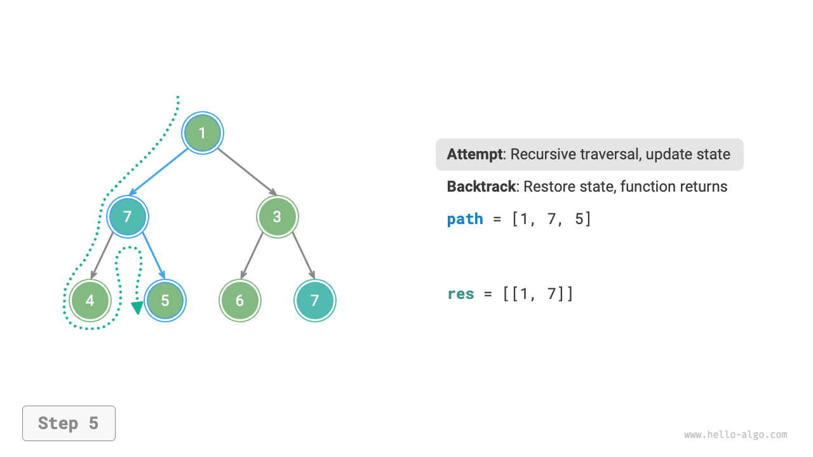

=== "<6>"
    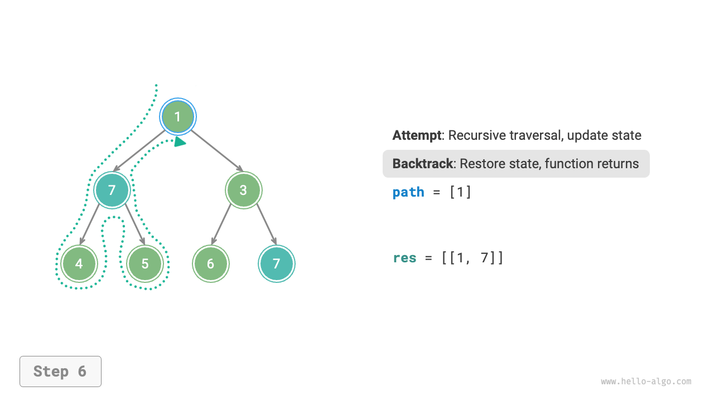

=== "<7>"
    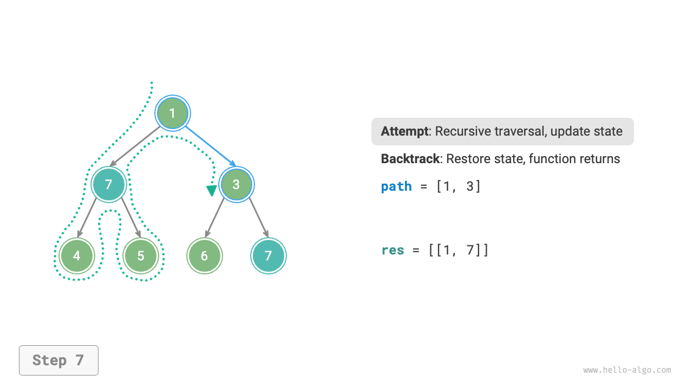

=== "<8>"
    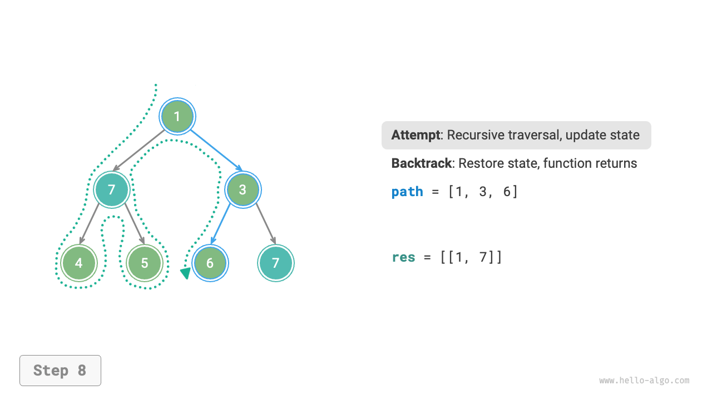

=== "<9>"
    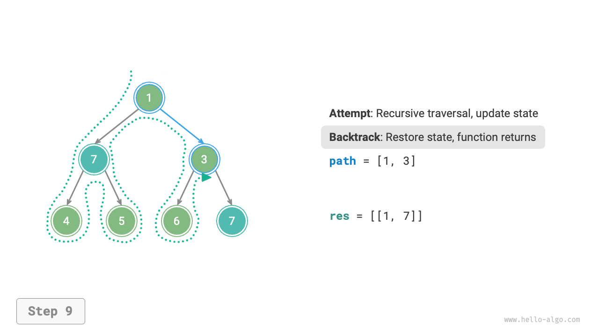

=== "<10>"
    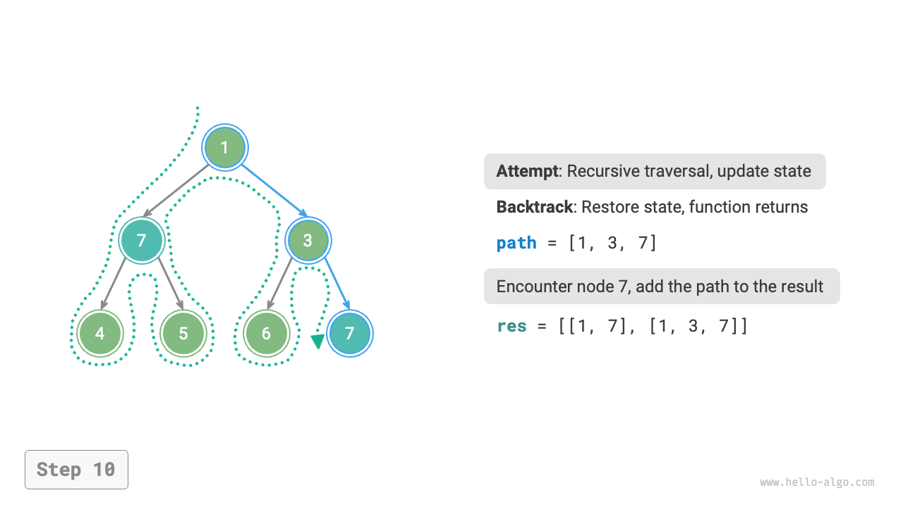

=== "<11>"
    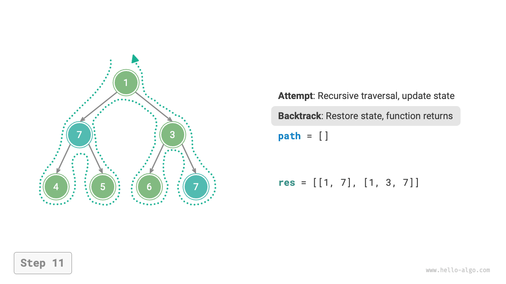

## Cắt tỉa

Các bài toán quay lui phức tạp thường chứa một hoặc nhiều ràng buộc. **Các ràng buộc thường có thể được sử dụng để "cắt tỉa" (pruning)**.

!!! question "Ví dụ 3"

    Trong một cây nhị phân, hãy tìm kiếm tất cả các nút có giá trị bằng $7$ và trả về đường đi từ nút gốc đến các nút này, **nhưng yêu cầu đường đi không được chứa các nút có giá trị bằng $3$**.

Để thỏa mãn các ràng buộc trên, **chúng ta cần thêm các thao tác cắt tỉa**: trong quá trình tìm kiếm, nếu gặp một nút có giá trị bằng $3$, chúng ta trả về sớm và không tiếp tục tìm kiếm. Mã nguồn như sau:

```src
[file]{preorder_traversal_iii_compact}-[class]{}-[func]{pre_order}
```

"Cắt tỉa" là một thuật ngữ rất hình tượng. Như hiển thị trong hình bên dưới, trong quá trình tìm kiếm, **chúng ta "cắt tỉa" các nhánh tìm kiếm không thỏa mãn ràng buộc**, tránh được nhiều lần thử nghiệm vô nghĩa và do đó cải thiện hiệu suất tìm kiếm.

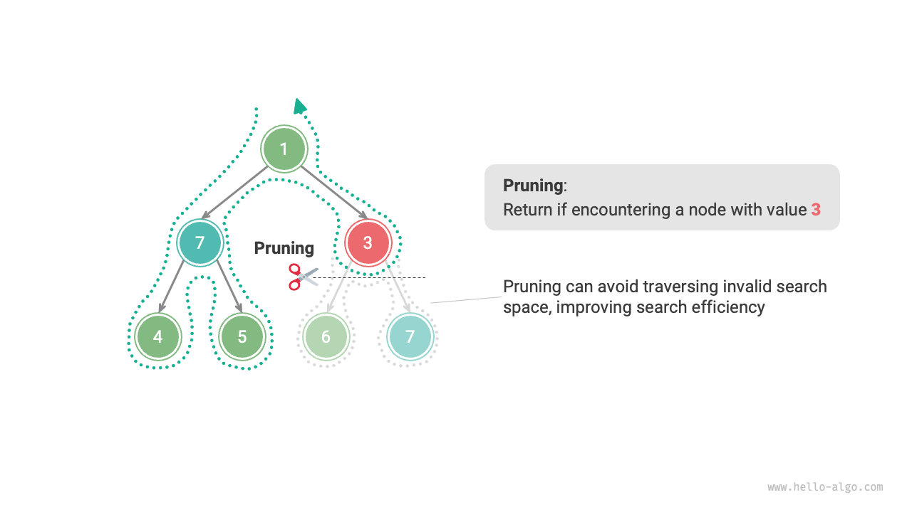

## Khung mã nguồn tổng quát

Tiếp theo, chúng ta cố gắng trích xuất một khung mã nguồn tổng quát xoay quanh "thử nghiệm, quay lui và cắt tỉa" của thuật toán quay lui để nâng cao tính tổng quát của mã nguồn.

Trong khung mã nguồn sau, `state` đại diện cho trạng thái hiện tại của bài toán, và `choices` đại diện cho các lựa chọn khả thi ở trạng thái hiện tại:

=== "Python"

    ```python title=""
    def backtrack(state: State, choices: list[choice], res: list[state]):
        """Khung thuật toán quay lui"""
        # Kiểm tra xem đây có phải là một lời giải không
        if is_solution(state):
            # Ghi nhận lời giải
            record_solution(state, res)
            # Dừng tìm kiếm
            return
        # Duyệt qua tất cả các lựa chọn
        for choice in choices:
            # Cắt tỉa: kiểm tra xem lựa chọn có hợp lệ không
            if is_valid(state, choice):
                # Thử nghiệm: thực hiện lựa chọn và cập nhật trạng thái
                make_choice(state, choice)
                backtrack(state, choices, res)
                # Quay lui: hoàn tác lựa chọn và khôi phục về trạng thái trước đó
                undo_choice(state, choice)
    ```

=== "C++"

    ```cpp title=""
    /* Khung thuật toán quay lui */
    void backtrack(State *state, vector<Choice *> &choices, vector<State *> &res) {
        // Kiểm tra xem đây có phải là một lời giải không
        if (isSolution(state)) {
            // Ghi nhận lời giải
            recordSolution(state, res);
            // Dừng tìm kiếm
            return;
        }
        // Duyệt qua tất cả các lựa chọn
        for (Choice choice : choices) {
            // Cắt tỉa: kiểm tra xem lựa chọn có hợp lệ không
            if (isValid(state, choice)) {
                // Thử nghiệm: thực hiện lựa chọn và cập nhật trạng thái
                makeChoice(state, choice);
                backtrack(state, choices, res);
                // Quay lui: hoàn tác lựa chọn và khôi phục về trạng thái trước đó
                undoChoice(state, choice);
            }
        }
    }
    ```

=== "Java"

    ```java title=""
    /* Khung thuật toán quay lui */
    void backtrack(State state, List<Choice> choices, List<State> res) {
        // Kiểm tra xem đây có phải là một lời giải không
        if (isSolution(state)) {
            // Ghi nhận lời giải
            recordSolution(state, res);
            // Dừng tìm kiếm
            return;
        }
        // Duyệt qua tất cả các lựa chọn
        for (Choice choice : choices) {
            // Cắt tỉa: kiểm tra xem lựa chọn có hợp lệ không
            if (isValid(state, choice)) {
                // Thử nghiệm: thực hiện lựa chọn và cập nhật trạng thái
                makeChoice(state, choice);
                backtrack(state, choices, res);
                // Quay lui: hoàn tác lựa chọn và khôi phục về trạng thái trước đó
                undoChoice(state, choice);
            }
        }
    }
    ```

=== "C#"

    ```csharp title=""
    /* Khung thuật toán quay lui */
    void Backtrack(State state, List<Choice> choices, List<State> res) {
        // Kiểm tra xem đây có phải là một lời giải không
        if (IsSolution(state)) {
            // Ghi nhận lời giải
            RecordSolution(state, res);
            // Dừng tìm kiếm
            return;
        }
        // Duyệt qua tất cả các lựa chọn
        foreach (Choice choice in choices) {
            // Cắt tỉa: kiểm tra xem lựa chọn có hợp lệ không
            if (IsValid(state, choice)) {
                // Thử nghiệm: thực hiện lựa chọn và cập nhật trạng thái
                MakeChoice(state, choice);
                Backtrack(state, choices, res);
                // Quay lui: hoàn tác lựa chọn và khôi phục về trạng thái trước đó
                UndoChoice(state, choice);
            }
        }
    }
    ```

=== "Go"

    ```go title=""
    /* Khung thuật toán quay lui */
    func backtrack(state *State, choices []Choice, res *[]State) {
        // Kiểm tra xem đây có phải là một lời giải không
        if isSolution(state) {
            // Ghi nhận lời giải
            recordSolution(state, res)
            // Dừng tìm kiếm
            return
        }
        // Duyệt qua tất cả các lựa chọn
        for _, choice := range choices {
            // Cắt tỉa: kiểm tra xem lựa chọn có hợp lệ không
            if isValid(state, choice) {
                // Thử nghiệm: thực hiện lựa chọn và cập nhật trạng thái
                makeChoice(state, choice)
                backtrack(state, choices, res)
                // Quay lui: hoàn tác lựa chọn và khôi phục về trạng thái trước đó
                undoChoice(state, choice)
            }
        }
    }
    ```

=== "Swift"

    ```swift title=""
    /* Khung thuật toán quay lui */
    func backtrack(state: inout State, choices: [Choice], res: inout [State]) {
        // Kiểm tra xem đây có phải là một lời giải không
        if isSolution(state: state) {
            // Ghi nhận lời giải
            recordSolution(state: state, res: &res)
            // Dừng tìm kiếm
            return
        }
        // Duyệt qua tất cả các lựa chọn
        for choice in choices {
            // Cắt tỉa: kiểm tra xem lựa chọn có hợp lệ không
            if isValid(state: state, choice: choice) {
                // Thử nghiệm: thực hiện lựa chọn và cập nhật trạng thái
                makeChoice(state: &state, choice: choice)
                backtrack(state: &state, choices: choices, res: &res)
                // Quay lui: hoàn tác lựa chọn và khôi phục về trạng thái trước đó
                undoChoice(state: &state, choice: choice)
            }
        }
    }
    ```

=== "JS"

    ```javascript title=""
    /* Khung thuật toán quay lui */
    function backtrack(state, choices, res) {
        // Kiểm tra xem đây có phải là một lời giải không
        if (isSolution(state)) {
            // Ghi nhận lời giải
            recordSolution(state, res);
            // Dừng tìm kiếm
            return;
        }
        // Duyệt qua tất cả các lựa chọn
        for (let choice of choices) {
            // Cắt tỉa: kiểm tra xem lựa chọn có hợp lệ không
            if (isValid(state, choice)) {
                // Thử nghiệm: thực hiện lựa chọn và cập nhật trạng thái
                makeChoice(state, choice);
                backtrack(state, choices, res);
                // Quay lui: hoàn tác lựa chọn và khôi phục về trạng thái trước đó
                undoChoice(state, choice);
            }
        }
    }
    ```

=== "TS"

    ```typescript title=""
    /* Khung thuật toán quay lui */
    function backtrack(state: State, choices: Choice[], res: State[]): void {
        // Kiểm tra xem đây có phải là một lời giải không
        if (isSolution(state)) {
            // Ghi nhận lời giải
            recordSolution(state, res);
            // Dừng tìm kiếm
            return;
        }
        // Duyệt qua tất cả các lựa chọn
        for (let choice of choices) {
            // Cắt tỉa: kiểm tra xem lựa chọn có hợp lệ không
            if (isValid(state, choice)) {
                // Thử nghiệm: thực hiện lựa chọn và cập nhật trạng thái
                makeChoice(state, choice);
                backtrack(state, choices, res);
                // Quay lui: hoàn tác lựa chọn và khôi phục về trạng thái trước đó
                undoChoice(state, choice);
            }
        }
    }
    ```

=== "Dart"

    ```dart title=""
    /* Khung thuật toán quay lui */
    void backtrack(State state, List<Choice>, List<State> res) {
      // Kiểm tra xem đây có phải là một lời giải không
      if (isSolution(state)) {
        // Ghi nhận lời giải
        recordSolution(state, res);
        // Dừng tìm kiếm
        return;
      }
      // Duyệt qua tất cả các lựa chọn
      for (Choice choice in choices) {
        // Cắt tỉa: kiểm tra xem lựa chọn có hợp lệ không
        if (isValid(state, choice)) {
          // Thử nghiệm: thực hiện lựa chọn và cập nhật trạng thái
          makeChoice(state, choice);
          backtrack(state, choices, res);
          // Quay lui: hoàn tác lựa chọn và khôi phục về trạng thái trước đó
          undoChoice(state, choice);
        }
      }
    }
    ```

=== "Rust"

    ```rust title=""
    /* Khung thuật toán quay lui */
    fn backtrack(state: &mut State, choices: &Vec<Choice>, res: &mut Vec<State>) {
        // Kiểm tra xem đây có phải là một lời giải không
        if is_solution(state) {
            // Ghi nhận lời giải
            record_solution(state, res);
            // Dừng tìm kiếm
            return;
        }
        // Duyệt qua tất cả các lựa chọn
        for choice in choices {
            // Cắt tỉa: kiểm tra xem lựa chọn có hợp lệ không
            if is_valid(state, choice) {
                // Thử nghiệm: thực hiện lựa chọn và cập nhật trạng thái
                make_choice(state, choice);
                backtrack(state, choices, res);
                // Quay lui: hoàn tác lựa chọn và khôi phục về trạng thái trước đó
                undo_choice(state, choice);
            }
        }
    }
    ```

=== "C"

    ```c title=""
    /* Khung thuật toán quay lui */
    void backtrack(State *state, Choice *choices, int numChoices, State *res, int numRes) {
        // Kiểm tra xem đây có phải là một lời giải không
        if (isSolution(state)) {
            // Ghi nhận lời giải
            recordSolution(state, res, numRes);
            // Dừng tìm kiếm
            return;
        }
        // Duyệt qua tất cả các lựa chọn
        for (int i = 0; i < numChoices; i++) {
            // Cắt tỉa: kiểm tra xem lựa chọn có hợp lệ không
            if (isValid(state, &choices[i])) {
                // Thử nghiệm: thực hiện lựa chọn và cập nhật trạng thái
                makeChoice(state, &choices[i]);
                backtrack(state, choices, numChoices, res, numRes);
                // Quay lui: hoàn tác lựa chọn và khôi phục về trạng thái trước đó
                undoChoice(state, &choices[i]);
            }
        }
    }
    ```

=== "Kotlin"

    ```kotlin title=""
    /* Khung thuật toán quay lui */
    fun backtrack(state: State?, choices: List<Choice?>, res: List<State?>?) {
        // Kiểm tra xem đây có phải là một lời giải không
        if (isSolution(state)) {
            // Ghi nhận lời giải
            recordSolution(state, res)
            // Dừng tìm kiếm
            return
        }
        // Duyệt qua tất cả các lựa chọn
        for (choice in choices) {
            // Cắt tỉa: kiểm tra xem lựa chọn có hợp lệ không
            if (isValid(state, choice)) {
                // Thử nghiệm: thực hiện lựa chọn và cập nhật trạng thái
                makeChoice(state, choice)
                backtrack(state, choices, res)
                // Quay lui: hoàn tác lựa chọn và khôi phục về trạng thái trước đó
                undoChoice(state, choice)
            }
        }
    }
    ```

=== "Ruby"

    ```ruby title=""
    ### Khung thuật toán quay lui ###
    def backtrack(state, choices, res)
        # Kiểm tra xem đây có phải là một lời giải không
        if is_solution?(state)
            # Ghi nhận lời giải
            record_solution(state, res)
            return
        end

        # Duyệt qua tất cả các lựa chọn
        for choice in choices
            # Cắt tỉa: kiểm tra xem lựa chọn có hợp lệ không
            if is_valid?(state, choice)
                # Thử nghiệm: thực hiện lựa chọn và cập nhật trạng thái
                make_choice(state, choice)
                backtrack(state, choices, res)
                # Quay lui: hoàn tác lựa chọn và khôi phục về trạng thái trước đó
                undo_choice(state, choice)
            end
        end
    end
    ```

Tiếp theo, chúng ta giải Ví dụ 3 dựa trên khung mã nguồn. Trạng thái `state` là đường đi duyệt qua các nút, các lựa chọn `choices` là các nút con trái và phải của nút hiện tại, và kết quả `res` là danh sách các đường đi:

```src
[file]{preorder_traversal_iii_template}-[class]{}-[func]{backtrack}
```

Theo yêu cầu của đề bài, chúng ta nên tiếp tục tìm kiếm sau khi tìm thấy một nút có giá trị bằng $7$. **Do đó, chúng ta cần xóa câu lệnh `return` sau khi ghi nhận lời giải**. Hình bên dưới so sánh quá trình tìm kiếm khi có và không có câu lệnh `return`.

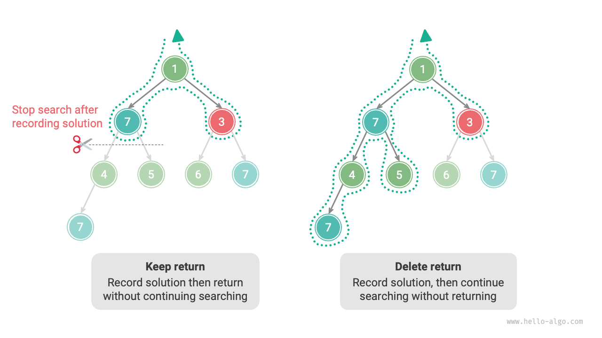

So với mã nguồn dựa trên duyệt tiền thứ, mã nguồn dựa trên khung thuật toán quay lui trông có vẻ dài dòng hơn, nhưng lại có tính tổng quát cao hơn. Trên thực tế, **nhiều bài toán quay lui có thể được giải quyết trong khung này**. Chúng ta chỉ cần xác định `state` và `choices` cho bài toán cụ thể và triển khai từng phương thức trong khung.

## Các thuật ngữ phổ biến

Để phân tích các bài toán thuật toán một cách rõ ràng hơn, chúng ta tóm tắt ý nghĩa của các thuật ngữ phổ biến được sử dụng trong thuật toán quay lui và cung cấp các ví dụ tương ứng từ Ví dụ 3, như hiển thị trong bảng dưới đây.

<p align="center"> Bảng <id> &nbsp; Các thuật ngữ phổ biến trong Thuật toán quay lui </p>

| Thuật ngữ               | Định nghĩa                                                                                                                                                                    | Ví dụ 3                                                                                                                       |
| ----------------------- | ----------------------------------------------------------------------------------------------------------------------------------------------------------------------------- | ----------------------------------------------------------------------------------------------------------------------------- |
| Lời giải (solution)     | Lời giải là một đáp án thỏa mãn các điều kiện cụ thể của bài toán; có thể có một hoặc nhiều lời giải                                                                          | Tất cả các đường đi từ gốc đến các nút có giá trị bằng $7$ thỏa mãn ràng buộc                                                 |
| Ràng buộc (constraint)  | Ràng buộc là một điều kiện trong bài toán giới hạn tính khả thi của các lời giải, thường được sử dụng để cắt tỉa                                                              | Đường đi không chứa các nút có giá trị bằng $3$                                                                               |
| Trạng thái (state)      | Trạng thái đại diện cho tình trạng của bài toán tại một thời điểm nhất định, bao gồm các lựa chọn đã thực hiện                                                                | Đường đi nút hiện đang được ghé thăm, tức là danh sách nút `path`                                                             |
| Thử nghiệm (attempt)    | Thử nghiệm là quá trình khám phá không gian lời giải theo các lựa chọn khả thi, bao gồm thực hiện lựa chọn, cập nhật trạng thái và kiểm tra xem có phải là lời giải hay không | Ghé thăm đệ quy các nút con trái (phải), thêm nút vào `path`, kiểm tra xem giá trị nút có bằng $7$ hay không                  |
| Quay lui (backtracking) | Quay lui đề cập đến việc hoàn tác các lựa chọn trước đó và quay trở lại trạng thái trước khi gặp một trạng thái không thỏa mãn ràng buộc                                      | Dừng tìm kiếm khi đi qua các nút lá, kết thúc lượt ghé thăm nút, hoặc gặp các nút có giá trị bằng $3$; hàm tự trả về (return) |
| Cắt tỉa (pruning)       | Cắt tỉa là một phương pháp loại bỏ các đường đi tìm kiếm vô nghĩa dựa trên đặc điểm bài toán và các ràng buộc, giúp cải thiện hiệu suất tìm kiếm                              | Khi gặp một nút có giá trị bằng $3$, không tiếp tục tìm kiếm nữa                                                              |

!!! tip

    Các khái niệm về bài toán, lời giải, trạng thái, v.v. là mang tính phổ quát và xuất hiện trong chia để trị, quay lui, quy hoạch động, thuật toán tham ăn và các thuật toán khác.

## Ưu điểm và Hạn chế

Thuật toán quay lui về bản chất là một thuật toán tìm kiếm theo chiều sâu (DFS), thử tất cả các lời giải có thể cho đến khi tìm thấy lời giải thỏa mãn điều kiện. Ưu điểm của cách tiếp cận này là nó có thể tìm thấy tất cả các lời giải có thể, và với các thao tác cắt tỉa hợp lý, nó đạt được hiệu suất cao.

Tuy nhiên, khi xử lý các bài toán quy mô lớn hoặc phức tạp, **hiệu suất chạy của thuật toán quay lui có thể không thể chấp nhận được**.

- **Thời gian**: Thuật toán quay lui thường cần duyệt qua tất cả các khả năng trong không gian trạng thái, và độ phức tạp thời gian có thể đạt đến cấp hàm mũ hoặc giai thừa.
- **Không gian**: Trong các lần gọi đệ quy, trạng thái hiện tại cần được lưu lại (chẳng hạn như các đường đi, biến phụ trợ được sử dụng để cắt tỉa, v.v.), và khi độ sâu lớn, yêu cầu về không gian có thể trở nên rất lớn.

Mặc dù vậy, **thuật toán quay lui vẫn là giải pháp tốt nhất cho một số bài toán tìm kiếm và bài toán thỏa mãn ràng buộc nhất định**. Đối với các bài toán này, vì chúng ta không thể dự đoán lựa chọn nào sẽ tạo ra lời giải hợp lệ, chúng ta bắt buộc phải duyệt qua tất cả các lựa chọn có thể. Trong trường hợp này, **mấu chốt là cách tối ưu hóa hiệu suất**. Có hai phương pháp tối ưu hóa hiệu suất phổ biến.

- **Cắt tỉa**: Tránh tìm kiếm các đường đi chắc chắn không tạo ra lời giải, từ đó tiết kiệm thời gian và không gian.
- **Tìm kiếm kinh nghiệm (Heuristic search)**: Đưa vào các chiến lược hoặc giá trị ước tính nhất định trong quá trình tìm kiếm để ưu tiên tìm kiếm các đường đi có khả năng tạo ra lời giải hợp lệ nhất.

## Các ví dụ điển hình về Quay lui

Thuật toán quay lui có thể được sử dụng để giải quyết nhiều bài toán tìm kiếm, bài toán thỏa mãn ràng buộc và bài toán tối ưu hóa tổ hợp.

**Bài toán tìm kiếm**: Mục tiêu của các bài toán này là tìm các lời giải thỏa mãn các điều kiện cụ thể.

- Bài toán hoán vị: Cho một tập hợp, hãy tìm tất cả các hoán vị và tổ hợp có thể.
- Bài toán tổng tập con: Cho một tập hợp và một tổng mục tiêu, hãy tìm tất cả các tập con trong tập hợp có tổng các phần tử bằng tổng mục tiêu.
- Tháp Hà Nội: Cho ba cọc và một chuỗi các đĩa có kích thước khác nhau, di chuyển tất cả các đĩa từ cọc này sang cọc khác, mỗi lần chỉ di chuyển một đĩa và không bao giờ đặt đĩa lớn hơn lên đĩa nhỏ hơn.

**Bài toán thỏa mãn ràng buộc**: Mục tiêu của các bài toán này là tìm các lời giải thỏa mãn tất cả các ràng buộc.

- N-Queens (Bài toán N quân hậu): Đặt $n$ quân hậu trên bàn cờ $n \times n$ sao cho chúng không tấn công lẫn nhau.
- Sudoku: Điền các số từ $1$ đến $9$ vào lưới $9 \times 9$ sao cho mỗi hàng, mỗi cột và mỗi lưới con $3 \times 3$ không chứa các chữ số lặp lại.
- Tô màu đồ thị: Cho một đồ thị vô hướng, tô màu mỗi đỉnh với số lượng màu tối thiểu sao cho các đỉnh kề nhau có màu khác nhau.

**Bài toán tối ưu hóa tổ hợp**: Mục tiêu của các bài toán này là tìm một lời giải tối ưu thỏa mãn các điều kiện nhất định trong không gian tổ hợp.

- 0-1 Knapsack (Cái túi 0-1): Cho một tập hợp các đồ vật và một cái túi, mỗi đồ vật có một giá trị và trọng lượng. Dưới ràng buộc dung lượng cái túi, hãy chọn các đồ vật để tối đa hóa tổng giá trị.
- Bài toán người du lịch (Traveling Salesman Problem - TSP): Bắt đầu từ một điểm trong đồ thị, ghé thăm tất cả các điểm khác đúng một lần và quay trở lại điểm xuất phát, tìm đường đi ngắn nhất.
- Tìm phe tối đại (Maximum Clique): Cho một đồ thị vô hướng, hãy tìm đồ thị con đầy đủ lớn nhất, tức là một đồ thị con mà hai đỉnh bất kỳ đều được nối với nhau bằng một cạnh.

Lưu ý rằng đối với nhiều bài toán tối ưu hóa tổ hợp, quay lui không phải là giải pháp tối ưu.

- Bài toán Cái túi 0-1 thường được giải bằng quy hoạch động để đạt hiệu suất thời gian cao hơn.
- Bài toán người du lịch là một bài toán NP-Khó nổi tiếng; các giải pháp phổ biến bao gồm thuật toán di truyền và thuật toán đàn kiến.
- Bài toán Phe tối đại là một bài toán kinh điển trong lý thuyết đồ thị và có thể giải bằng các thuật toán kinh nghiệm như thuật toán tham ăn.
