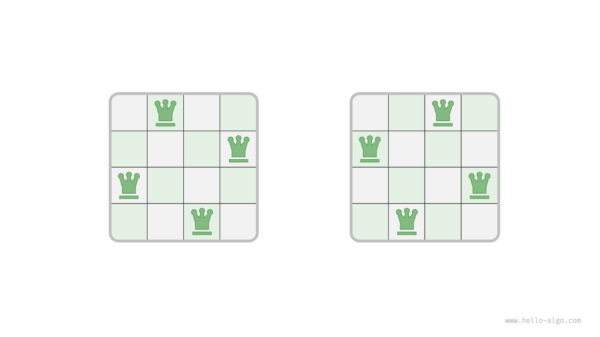
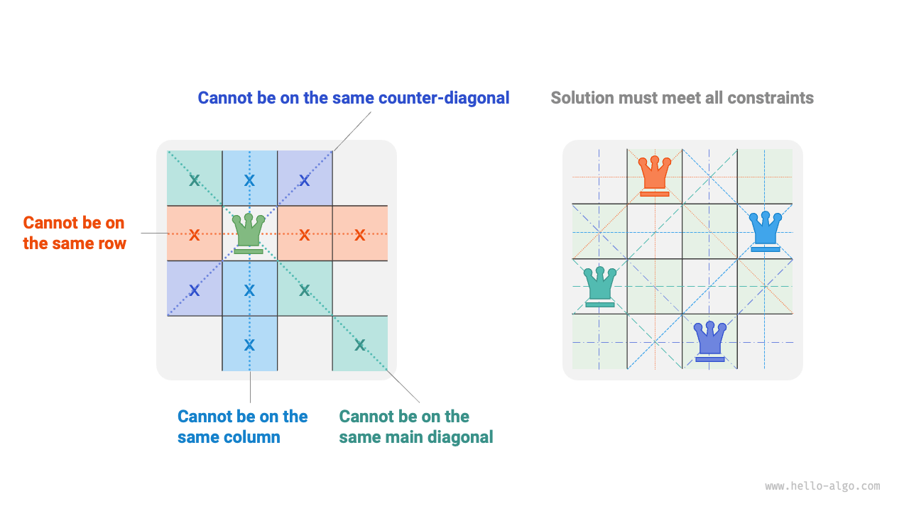
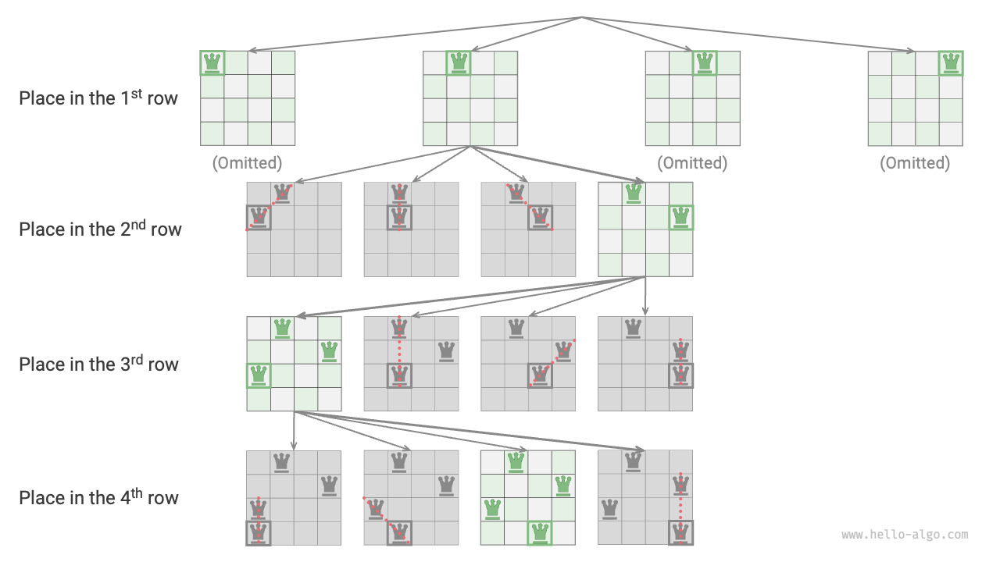
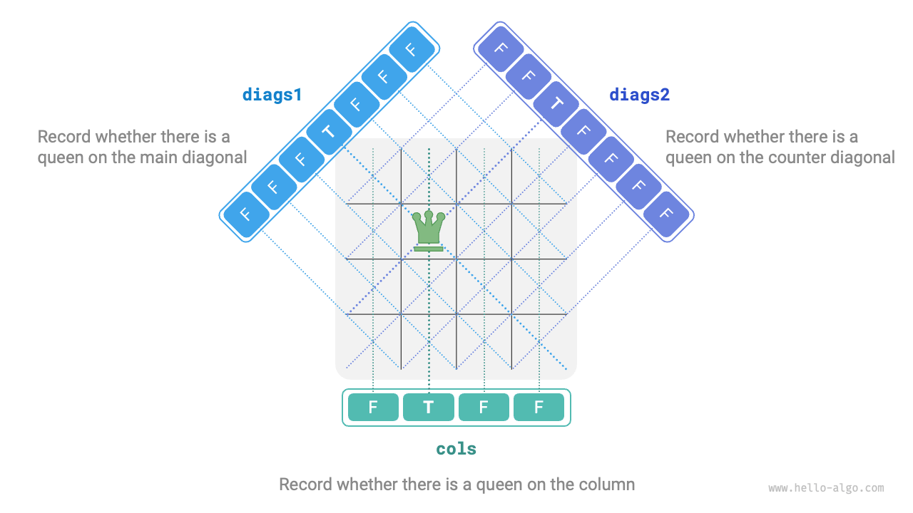

# Bài toán N Quân hậu (N-Queens)

!!! question

    Theo quy tắc của cờ vua, một quân hậu có thể tấn công bất kỳ quân cờ nào nằm trên cùng một hàng, cùng một cột hoặc cùng một đường chéo. Cho $n$ quân hậu và một bàn cờ kích thước $n \times n$, hãy tìm một cách sắp xếp sao cho không có hai quân hậu nào có thể tấn công lẫn nhau.

Như hiển thị trong hình bên dưới, khi $n = 4$, có thể tìm thấy hai lời giải. Từ góc độ của thuật toán quay lui, bàn cờ $n \times n$ có $n^2$ ô cờ, cung cấp tất cả các lựa chọn `choices`. Trong quá trình đặt từng quân hậu một, trạng thái bàn cờ liên tục thay đổi, và bàn cờ tại mỗi thời điểm đại diện cho trạng thái `state`.



Hình bên dưới minh họa ba ràng buộc của bài toán này: **nhieu quân hậu không thể nằm trên cùng một hàng, cùng một cột, hoặc trên cùng một đường chéo**. Đáng chú ý là các đường chéo được chia thành hai loại: đường chéo chính `\` và đường chéo phụ `/`.



### Chiến lược Đặt theo từng Hàng

Vì cả số lượng quân hậu và số lượng hàng trên bàn cờ đều là $n$, chúng ta có thể dễ dàng rút ra một kết luận: **mỗi hàng của bàn cờ chỉ cho phép đặt một và chỉ một quân hậu**.

Điều này có nghĩa là chúng ta có thể áp dụng chiến lược đặt theo từng hàng: bắt đầu từ hàng đầu tiên, đặt một quân hậu ở mỗi hàng cho đến khi hoàn thành hàng cuối cùng.

Hình bên dưới hiển thị quá trình đặt theo từng hàng cho bài toán 4 quân hậu. Do giới hạn về không gian, hình ảnh chỉ mở rộng một nhánh tìm kiếm của hàng đầu tiên, và tất cả các phương án vi phạm ràng buộc cột hoặc đường chéo đều bị cắt tỉa.



Về bản chất, **chiến lược đặt theo từng hàng đóng vai trò như một chức năng cắt tỉa**, vì nó tránh được tất cả các nhánh tìm kiếm mà nhiều quân hậu xuất hiện trên cùng một hàng.

### Cắt tỉa Cột và Đường chéo

Để thỏa mãn ràng buộc cột, chúng ta có thể sử dụng một mảng boolean `cols` có độ dài $n$ để ghi lại xem mỗi cột đã có quân hậu hay chưa. Trước mỗi quyết định đặt quân hậu, chúng ta sử dụng `cols` để cắt tỉa các cột đã có quân hậu, và cập nhật động trạng thái của `cols` trong quá trình quay lui.

!!! tip

    Xin lưu ý rằng gốc tọa độ của ma trận nằm ở góc trên bên trái, trong đó chỉ số hàng tăng từ trên xuống dưới, và chỉ số cột tăng từ trái sang phải.

Vậy làm thế nào để xử lý các ràng buộc đường chéo? Xét một ô trên bàn cờ có chỉ số hàng và cột là $(row, col)$. Nếu chúng ta chọn một đường chéo chính cụ thể trong ma trận, chúng ta thấy rằng tất cả các ô trên đường chéo chính đó đều có cùng hiệu giữa chỉ số hàng và chỉ số cột của chúng, **nghĩa là $row - col$ là một giá trị hằng số cho tất cả các ô trên đường chéo chính**.

Nói cách khác, nếu hai ô thỏa mãn $row_1 - col_1 = row_2 - col_2$, chúng phải nằm trên cùng một đường chéo chính. Sử dụng quy luật này, chúng ta có thể sử dụng mảng `diags1` được hiển thị trong hình bên dưới để ghi lại xem có quân hậu trên mỗi đường chéo chính hay không.

Tương tự, **đối với tất cả các ô trên một đường chéo phụ, tổng $row + col$ là một giá trị hằng số**. Chúng ta cũng có thể sử dụng mảng `diags2` tương tự để xử lý các ràng buộc đường chéo phụ.



### Triển khai Mã nguồn

Xin lưu ý rằng trong ma trận vuông $n \times n$, phạm vi của $row - col$ là $[-n + 1, n - 1]$, và phạm vi của $row + col$ là $[0, 2n - 2]$. Do đó, số lượng cả đường chéo chính và đường chéo phụ đều là $2n - 1$, nghĩa là độ dài của cả hai mảng `diags1` và `diags2` đều là $2n - 1$.

```src
[file]{n_queens}-[class]{}-[func]{n_queens}
```

Đặt $n$ quân hậu theo từng hàng, xét đến ràng buộc cột, từ hàng đầu tiên đến hàng cuối cùng có $n$, $n-1$, $\dots$, $2$, $1$ lựa chọn, tốn thời gian $O(n!)$. Khi ghi nhận một lời giải, cần phải sao chép ma trận `state` và thêm nó vào `res`, và thao tác sao chép tốn thời gian $O(n^2)$. Do đó, **độ phức tạp thời gian tổng thể là $O(n! \cdot n^2)$**. Trên thực tế, việc cắt tỉa dựa trên các ràng buộc đường chéo cũng có thể làm giảm đáng kể không gian tìm kiếm, vì vậy hiệu suất tìm kiếm thường tốt hơn độ phức tạp thời gian đề cập ở trên.

Mảng `state` sử dụng không gian $O(n^2)$, và các mảng `cols`, `diags1`, và `diags2` mỗi mảng sử dụng không gian $O(n)$. Độ sâu đệ quy tối đa là $n$, sử dụng không gian khung ngữ cảnh $O(n)$. Do đó, **độ phức tạp không gian là $O(n^2)$**.
