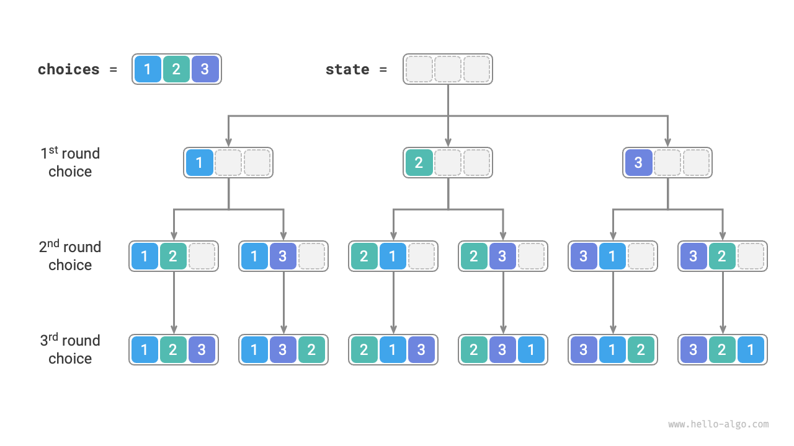
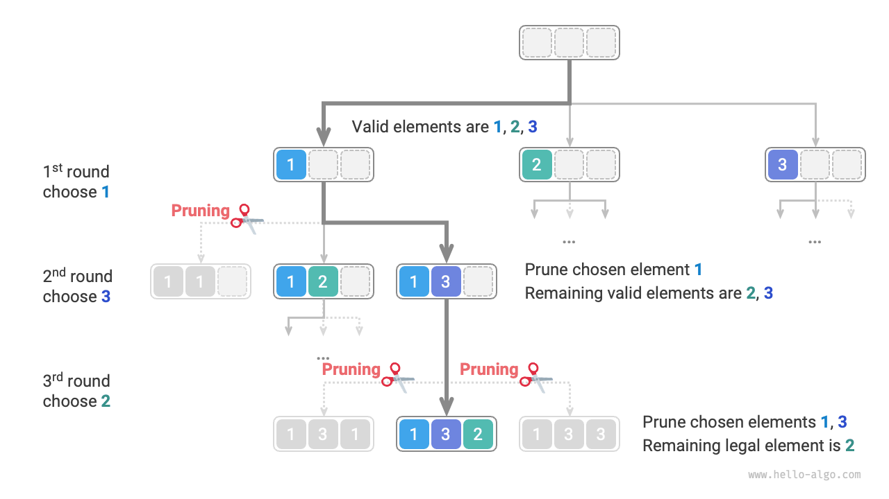
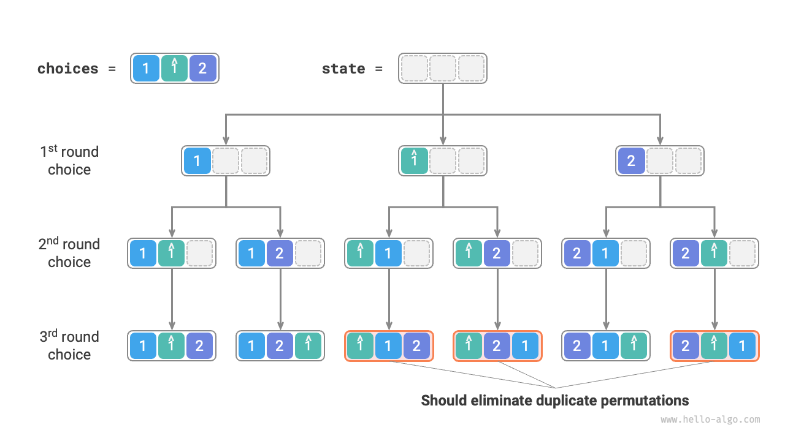
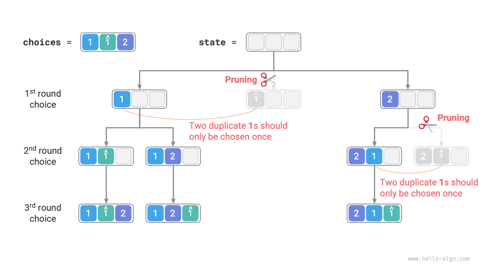
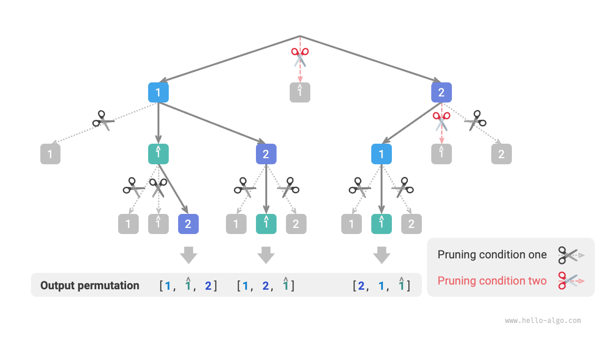

# Bài toán Hoán vị

Bài toán hoán vị là một ứng dụng kinh điển của thuật toán quay lui. Nó được định nghĩa là việc tìm tất cả các cách sắp xếp có thể có của các phần tử trong một tập hợp cho trước (chẳng hạn như một mảng hoặc một chuỗi).

Bảng dưới đây hiển thị một số tập dữ liệu ví dụ, bao gồm các mảng đầu vào và các hoán vị tương ứng của chúng.

<p align="center"> Bảng <id> &nbsp; Các ví dụ về Hoán vị </p>

| Mảng đầu vào | Tất cả các hoán vị                                                 |
| :----------- | :----------------------------------------------------------------- |
| $[1]$        | $[1]$                                                              |
| $[1, 2]$     | $[1, 2], [2, 1]$                                                   |
| $[1, 2, 3]$  | $[1, 2, 3], [1, 3, 2], [2, 1, 3], [2, 3, 1], [3, 1, 2], [3, 2, 1]$ |

## Trường hợp các phần tử Phân biệt

!!! question

    Cho một mảng số nguyên không chứa các phần tử trùng lặp, hãy trả về tất cả các hoán vị có thể có.

Từ góc độ của thuật toán quay lui, **chúng ta có thể tưởng tượng quá trình tạo ra các hoán vị như kết quả của một chuỗi các lựa chọn**. Giả sử mảng đầu vào là $[1, 2, 3]$. Nếu đầu tiên chúng ta chọn $1$, sau đó chọn $3$, và cuối cùng chọn $2$, chúng ta thu được hoán vị $[1, 3, 2]$. Quay lui có nghĩa là hoàn tác một lựa chọn và sau đó thử các lựa chọn khác.

Từ góc độ của mã nguồn quay lui, tập hợp ứng viên `choices` bao gồm tất cả các phần tử trong mảng đầu vào, và trạng thái `state` là các phần tử đã được chọn cho đến thời điểm hiện tại. Lưu ý rằng mỗi phần tử chỉ có thể được chọn một lần, **do đó tất cả các phần tử trong `state` phải là duy nhất**.

Như hiển thị trong hình bên dưới, chúng ta có thể triển khai quá trình tìm kiếm thành một cây đệ quy, trong đó mỗi nút trên cây đại diện cho trạng thái hiện tại `state`. Bắt đầu từ nút gốc, sau ba vòng lựa chọn, chúng ta đạt đến một nút lá, và mỗi nút lá tương ứng với một hoán vị.



### Cắt tỉa các Lựa chọn Trùng lặp

Để đảm bảo rằng mỗi phần tử chỉ được chọn một lần, chúng ta cân nhắc đưa vào một mảng giá trị boolean `selected`, trong đó `selected[i]` chỉ ra liệu `choices[i]` đã được chọn hay chưa. Chúng ta triển khai thao tác cắt tỉa sau dựa trên nó.

- Sau khi thực hiện một lựa chọn `choices[i]`, chúng ta đặt `selected[i]` thành $\text{True}$, chỉ ra rằng nó đã được chọn.
- Khi duyệt qua danh sách ứng viên `choices`, chúng ta bỏ qua tất cả các nút đã được chọn, đây chính là sự cắt tỉa.

Như hiển thị trong hình bên dưới, giả sử chúng ta chọn $1$ trong vòng đầu tiên, $3$ trong vòng thứ hai, và $2$ trong vòng thứ ba. Sau đó chúng ta cần cắt tỉa nhánh của phần tử $1$ trong vòng thứ hai và cắt tỉa các nhánh của các phần tử $1$ và $3$ trong vòng thứ ba.



Quan sát hình trên, chúng ta thấy rằng thao tác cắt tỉa này làm giảm kích thước không gian tìm kiếm từ $O(n^n)$ xuống $O(n!)$.

### Triển khai Mã nguồn

Sau khi hiểu các thông tin trên, chúng ta có thể điền vào các khoảng trống trong mã nguồn khung mẫu. Để rút ngắn mã nguồn tổng thể, chúng ta không triển khai từng hàm trong khung mẫu một cách riêng biệt, mà thay vào đó triển khai trực tiếp chúng bên trong hàm `backtrack()`:

```src
[file]{permutations_i}-[class]{}-[func]{permutations_i}
```

## Trường hợp có các phần tử Trùng lặp

!!! question

    Cho một mảng số nguyên **có thể chứa các phần tử trùng lặp**, hãy trả về tất cả các hoán vị duy nhất.

Giả sử mảng đầu vào là $[1, 1, 2]$. Để phân biệt hai phần tử trùng lặp $1$, chúng ta ký hiệu số $1$ thứ hai là $\hat{1}$.

Như hiển thị trong hình bên dưới, một nửa số hoán vị được tạo ra bởi phương pháp trên là trùng lặp.



Vậy làm thế nào để loại bỏ các hoán vị trùng lặp? Cách tiếp cận trực tiếp nhất là sử dụng một tập hợp băm (hash set) để trực tiếp khử trùng lặp kết quả hoán vị. Tuy nhiên, điều này không tinh tế vì **các nhánh tìm kiếm tạo ra các hoán vị trùng lặp là không cần thiết và nên được nhận diện và cắt tỉa sớm**, điều này có thể cải thiện hơn nữa hiệu suất thuật toán.

### Cắt tỉa các Phần tử Bằng nhau

Quan sát hình bên dưới. Trong vòng đầu tiên, việc chọn $1$ hoặc chọn $\hat{1}$ là tương đương nhau. Tất cả các hoán vị được tạo ra dưới hai lựa chọn này đều trùng lặp. Do đó, chúng ta nên cắt tỉa $\hat{1}$.

Tương tự, sau khi chọn $2$ trong vòng đầu tiên, các số $1$ và $\hat{1}$ trong vòng thứ hai cũng tạo ra các nhánh trùng lặp, vì vậy số $\hat{1}$ của vòng thứ hai cũng nên được cắt tỉa.

Về bản chất, **mục tiêu của chúng ta là đảm bảo rằng nhiều phần tử bằng nhau chỉ được chọn một lần trong một vòng lựa chọn nhất định**.



### Triển khai Mã nguồn

Dựa trên mã nguồn từ bài toán trước, chúng ta khởi tạo một tập hợp băm `duplicated` trong mỗi vòng lựa chọn để ghi lại những phần tử nào đã được thử trong vòng đó, và cắt tỉa các phần tử bằng nhau:

```src
[file]{permutations_ii}-[class]{}-[func]{permutations_ii}
```

Giả sử các phần tử phân biệt đôi một, có $n!$ (giai thừa) hoán vị của $n$ phần tử. Khi ghi lại kết quả, chúng ta cần sao chép một danh sách có độ dài $n$, tốn thời gian $O(n)$. **Do đó, độ phức tạp thời gian là $O(n! \cdot n)$**.

Độ sâu đệ quy tối đa là $n$, sử dụng không gian khung ngữ cảnh $O(n)$. `selected` sử dụng không gian $O(n)$. Có tối đa $n$ tập hợp `duplicated` tồn tại đồng thời, sử dụng không gian $O(n^2)$. **Do đó, độ phức tạp không gian là $O(n^2)$**.

### So sánh hai Phương pháp Cắt tỉa

Lưu ý rằng mặc dù cả `selected` và `duplicated` đều được sử dụng để cắt tỉa, chúng có các mục tiêu khác nhau.

- **Cắt tỉa các lựa chọn trùng lặp**: Chỉ có một mảng `selected` duy nhất trong suốt toàn bộ quá trình tìm kiếm. Nó ghi lại những phần tử nào đã được đưa vào trạng thái hiện tại, và mục đích của nó là ngăn một phần tử xuất hiện lặp đi lặp lại trong `state`.
- **Cắt tỉa các phần tử bằng nhau**: Mỗi vòng lựa chọn (mỗi lần gọi hàm `backtrack`) chứa một tập hợp `duplicated`. Nó ghi lại những phần tử nào đã được chọn trong vòng lặp (vòng lặp `for`) của vòng đó, và mục đích của nó là đảm bảo rằng các phần tử bằng nhau chỉ được chọn một lần.

Hình bên dưới hiển thị phạm vi có hiệu lực của hai điều kiện cắt tỉa. Lưu ý rằng mỗi nút trên cây đại diện cho một lựa chọn, và các nút trên đường đi từ gốc đến nút lá tạo thành một hoán vị.


