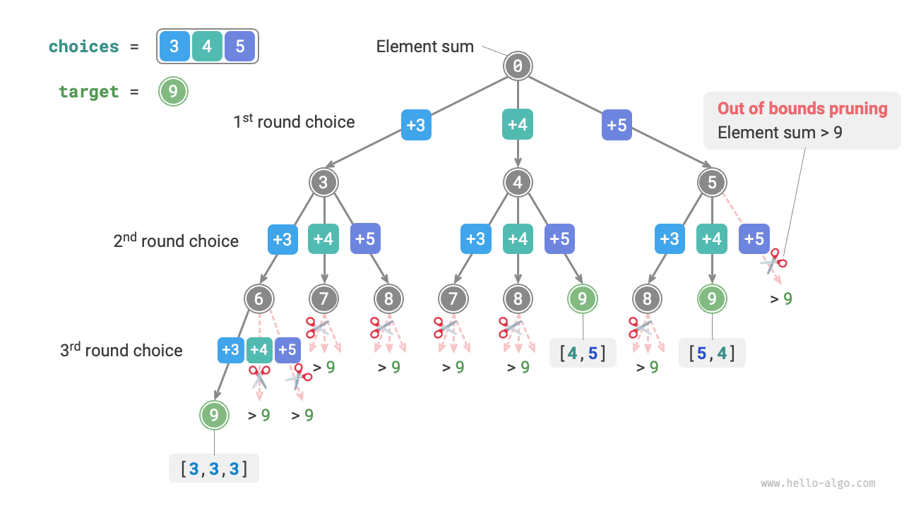
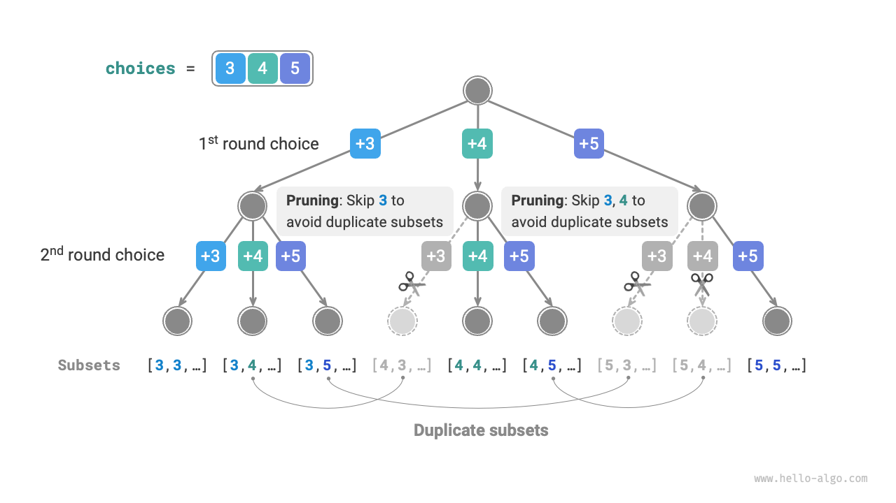
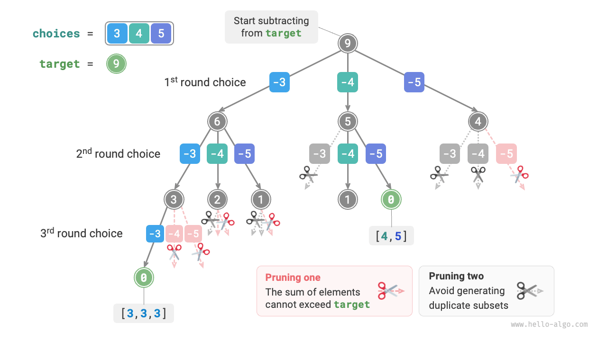
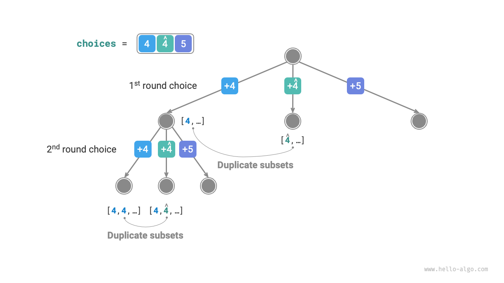
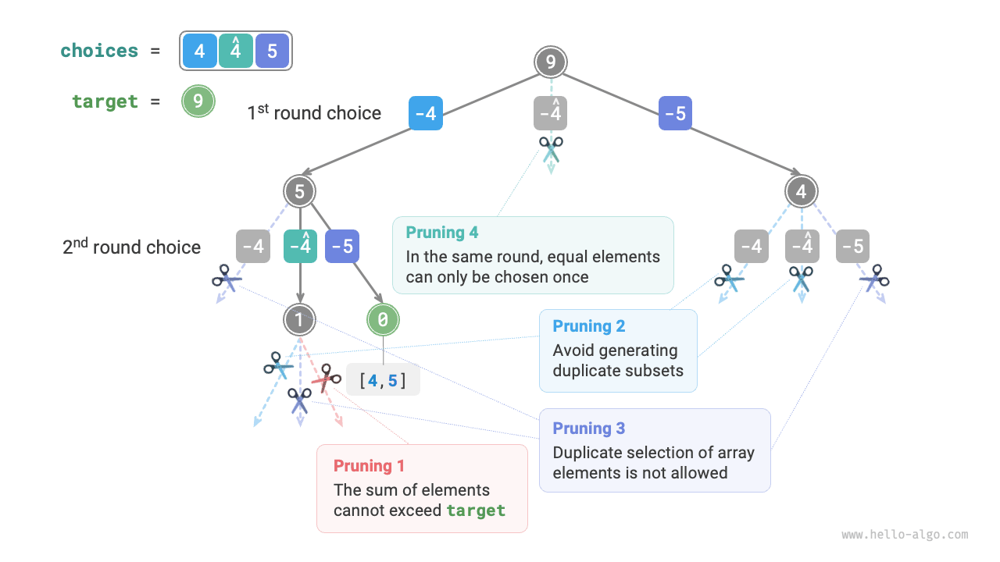

# Bài toán Tổng tập con (Subset-Sum)

## Trường hợp không có các phần tử Trùng lặp

!!! question

    Cho một mảng các số nguyên dương `nums` và một số nguyên dương mục tiêu `target`, hãy tìm tất cả các tổ hợp có thể có mà tổng các phần tử trong tổ hợp bằng `target`. Mảng đã cho không chứa các phần tử trùng lặp và mỗi phần tử có thể được chọn nhiều lần. Trả về các tổ hợp này dưới dạng danh sách, trong đó danh sách không được chứa các tổ hợp trùng lặp.

Ví dụ, cho tập hợp $\{3, 4, 5\}$ và số nguyên mục tiêu $9$, các lời giải là $\{3, 3, 3\}, \{4, 5\}$. Lưu ý hai điểm sau:

- Các phần tử trong tập hợp đầu vào có thể được chọn lặp lại không giới hạn số lần.
- Các tập con không phân biệt thứ tự phần tử; ví dụ, $\{4, 5\}$ và $\{5, 4\}$ là cùng một tập con.

### Sử dụng Lời giải Hoán vị làm Tham chiếu

Tương tự như bài toán hoán vị, chúng ta có thể xem quá trình tạo ra các tập con như kết quả của một chuỗi các lựa chọn và cập nhật tổng đang tính trong quá trình lựa chọn. Khi tổng bằng `target`, chúng ta ghi nhận tập con vào danh sách kết quả.

Khác với bài toán hoán vị, **các phần tử trong bài toán này có thể được chọn với số lần bất kỳ**, vì vậy chúng ta không cần sử dụng danh sách boolean `selected` để theo dõi xem một phần tử đã được chọn hay chưa. Với một vài thay đổi nhỏ đối với mã nguồn hoán vị, chúng ta thu được một lời giải ban đầu:

```src
[file]{subset_sum_i_naive}-[class]{}-[func]{subset_sum_i_naive}
```

Chạy mã nguồn trên với mảng $[3, 4, 5]$ và giá trị mục tiêu $9$ sẽ tạo ra $[3, 3, 3], [4, 5], [5, 4]$. **Mặc dù chúng ta đã tìm thấy thành công tất cả các tập con có tổng bằng $9$, nhưng lại xuất hiện các tập con trùng lặp $[4, 5]$ và $[5, 4]$**.

Điều này là do quá trình tìm kiếm phân biệt thứ tự lựa chọn, nhưng các tập con thì không phân biệt thứ tự lựa chọn. Như hiển thị trong hình bên dưới, chọn 4 trước rồi chọn 5 so với chọn 5 trước rồi chọn 4 là các nhánh khác nhau, nhưng chúng lại tương ứng với cùng một tập con.



Để loại bỏ các tập con trùng lặp, **một ý tưởng trực tiếp là khử trùng lặp danh sách kết quả**. Tuy nhiên, cách tiếp cận này rất kém hiệu quả vì hai lý do:

- Khi các phần tử trong mảng nhiều, đặc biệt là khi `target` lớn, quá trình tìm kiếm sẽ tạo ra rất nhiều tập con trùng lặp.
- Việc so sánh các tập con (mảng) rất tốn thời gian, đòi hỏi phải sắp xếp các mảng trước, sau đó so sánh từng phần tử trong chúng.

### Cắt tỉa các Tập con Trùng lặp

**Chúng ta cân nhắc việc khử trùng lặp thông qua cắt tỉa trong quá trình tìm kiếm**. Quan sát hình bên dưới, các tập con trùng lặp xảy ra khi các phần tử trong mảng được chọn theo các thứ tự khác nhau, như trong các trường hợp sau:

1. Khi vòng một và vòng hai lần lượt chọn $3$ và $4$, tất cả các tập con chứa hai phần tử này được tạo ra, ký hiệu là $[3, 4, \dots]$.
2. Sau đó, khi vòng một chọn $4$, **vòng thứ hai nên bỏ qua $3$**, vì tập con $[4, 3, \dots]$ được tạo ra bởi lựa chọn này trùng lặp hoàn toàn với tập con được tạo ra ở bước `1.`

Trong quá trình tìm kiếm, các lựa chọn ở mỗi tầng được thử từ trái sang phải, do đó các nhánh bên phải sẽ bị cắt tỉa nhiều hơn.

1. Hai vòng đầu tiên chọn $3$ và $5$, tạo ra tập con $[3, 5, \dots]$.
2. Hai vòng đầu tiên chọn $4$ và $5$, tạo ra tập con $[4, 5, \dots]$.
3. Nếu vòng đầu tiên chọn $5$, **vòng thứ hai nên bỏ qua $3$ và $4$**, vì các tập con $[5, 3, \dots]$ và $[5, 4, \dots]$ trùng lặp hoàn toàn với các tập con đã mô tả ở các bước `1.` và `2.`



Tóm lại, cho một mảng đầu vào $[x_1, x_2, \dots, x_n]$, giả sử chuỗi lựa chọn trong quá trình tìm kiếm là $[x_{i_1}, x_{i_2}, \dots, x_{i_m}]$. Chuỗi lựa chọn này phải thỏa mãn $i_1 \leq i_2 \leq \dots \leq i_m$; **bất kỳ chuỗi lựa chọn nào không thỏa mãn điều kiện này đều sẽ gây ra trùng lặp và nên được cắt tỉa**.

### Triển khai Mã nguồn

Để triển khai sự cắt tỉa này, chúng ta khởi tạo một biến `start` để chỉ ra điểm bắt đầu duyệt. **Sau khi thực hiện lựa chọn $x_{i}$, đặt vòng tiếp theo bắt đầu duyệt từ chỉ số $i$**. Điều này đảm bảo chuỗi lựa chọn thỏa mãn $i_1 \leq i_2 \leq \dots \leq i_m$, bảo đảm tính duy nhất của các tập con.

Ngoài ra, chúng ta đã thực hiện hai tối ưu hóa sau đối với mã nguồn:

- Trước khi bắt đầu tìm kiếm, trước tiên sắp xếp mảng `nums`. Khi duyệt qua tất cả các lựa chọn, **kết thúc vòng lặp ngay lập tức khi tổng tập con vượt quá `target`**, vì các phần tử tiếp theo lớn hơn và tổng tập con của chúng chắc chắn sẽ vượt quá `target`.
- Bỏ qua biến tổng phần tử `total` và **sử dụng phép trừ trên `target` để theo dõi tổng các phần tử**. Ghi nhận lời giải khi `target` bằng $0$.

```src
[file]{subset_sum_i}-[class]{}-[func]{subset_sum_i}
```

Hình bên dưới hiển thị quá trình quay lui hoàn chỉnh tạo ra bởi việc chạy mã nguồn trên với mảng $[3, 4, 5]$ và giá trị mục tiêu $9$.



## Trường hợp mảng có các phần tử Trùng lặp

!!! question

    Cho một mảng số nguyên dương `nums` và một số nguyên dương mục tiêu `target`, hãy tìm tất cả các tổ hợp có thể có mà tổng các phần tử trong tổ hợp bằng `target`. **Mảng đã cho có thể chứa các phần tử trùng lặp và mỗi phần tử chỉ có thể được chọn tối đa một lần**. Trả về các tổ hợp này dưới dạng danh sách, trong đó danh sách không được chứa các tổ hợp trùng lặp.

So với bài toán trước, **mảng đầu vào trong bài toán này có thể chứa các phần tử trùng lặp**, điều này tạo ra một vấn đề mới. Ví dụ, cho mảng $[4, \hat{4}, 5]$ và giá trị mục tiêu $9$, đầu ra của mã nguồn hiện tại là $[4, 5], [\hat{4}, 5]$, chứa các tập con trùng lặp.

**Lý do cho sự trùng lặp này là các phần tử bằng nhau được chọn nhiều lần trong một vòng nhất định**. Trong hình bên dưới, vòng đầu tiên có ba lựa chọn, hai trong số đó là $4$, tạo ra hai nhánh tìm kiếm trùng lặp và xuất ra các tập con trùng lặp. Tương tự, hai số $4$ trong vòng thứ hai cũng tạo ra các tập con trùng lặp.



### Cắt tỉa các Phần tử Bằng nhau

Để giải quyết bài toán này, **chúng ta cần giới hạn các phần tử bằng nhau chỉ được chọn một lần trong mỗi vòng**. Việc triển khai rất khéo léo: vì mảng đã được sắp xếp, các phần tử bằng nhau nằm kề nhau. Điều này có nghĩa là trong một vòng lựa chọn nhất định, nếu phần tử hiện tại bằng phần tử bên trái của nó, thì giá trị đó đã được chọn trong vòng này rồi, vì vậy chúng ta bỏ qua phần tử hiện tại trực tiếp.

Đồng thời, **bài toán này chỉ định rằng mỗi phần tử trong mảng chỉ có thể được chọn một lần**. May mắn thay, chúng ta cũng có thể sử dụng biến `start` để thỏa mãn ràng buộc này: sau khi thực hiện lựa chọn $x_{i}$, đặt vòng tiếp theo bắt đầu duyệt từ chỉ số $i + 1$ trở đi. Điều này vừa loại bỏ các tập con trùng lặp vừa tránh việc chọn các phần tử nhiều lần.

### Triển khai Mã nguồn

```src
[file]{subset_sum_ii}-[class]{}-[func]{subset_sum_ii}
```

Hình bên dưới hiển thị quá trình quay lui cho mảng $[4, 4, 5]$ với giá trị mục tiêu $9$, bao gồm bốn loại thao tác cắt tỉa. Hãy kết hợp hình minh họa với các chú thích mã nguồn để hiểu toàn bộ quá trình tìm kiếm và cách thức hoạt động của từng thao tác cắt tỉa.


