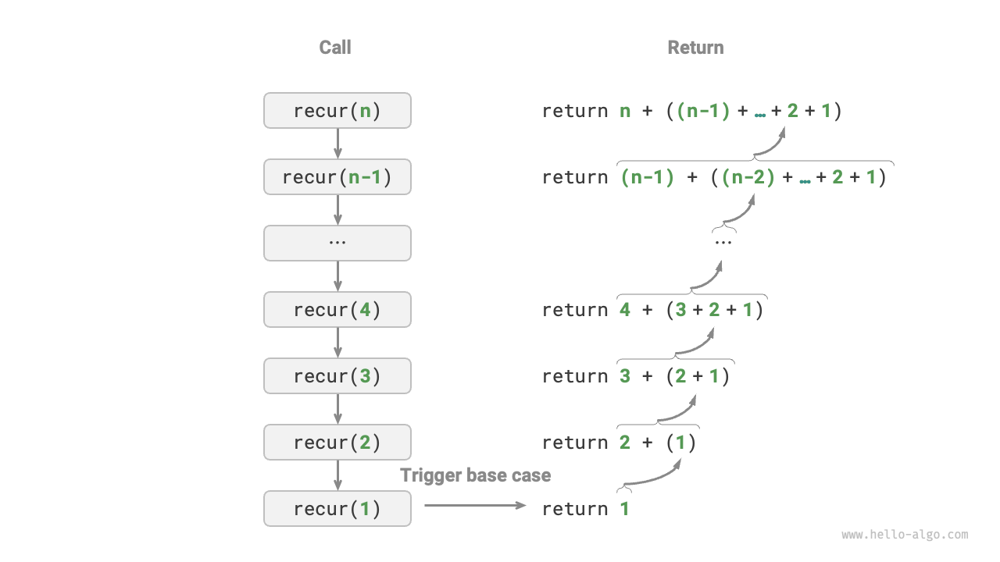

# Lặp và đệ quy (Iteration and recursion)

Trong thuật toán, việc thực hiện lặp lại một tác vụ là rất phổ biến và liên quan chặt chẽ đến phân tích độ phức tạp. Vì vậy, trước khi tìm hiểu về khái niệm độ phức tạp thời gian và độ phức tạp không gian, hãy cùng khám phá cách triển khai các tác vụ lặp lại trong lập trình. Điều này liên quan đến hai cấu trúc điều khiển cơ bản: lặp (iteration) và đệ quy (recursion).

## Iteration

<u>Iteration</u> là một cấu trúc điều khiển dùng để thực hiện một tác vụ nhiều lần. Trong iteration, chương trình sẽ lặp lại một khối mã khi điều kiện nào đó còn đúng, cho đến khi điều kiện không còn được thỏa mãn.

### Vòng lặp for

Vòng lặp `for` là một trong những dạng lặp phổ biến nhất, **đặc biệt phù hợp khi biết trước số lần lặp**.

Hàm dưới đây sử dụng vòng lặp `for` để tính tổng $1 + 2 + \dots + n$, với kết quả được lưu vào biến `res`. Lưu ý rằng trong Python, `range(a, b)` tạo ra một khoảng từ $a$ đến $b-1$, nghĩa là bao gồm $a$ nhưng không bao gồm $b$.

```src
[file]{iteration}-[class]{}-[func]{for_loop}
```

Hình dưới minh họa quá trình tính tổng này.


Số lượng phép toán trong hàm này tỷ lệ thuận với kích thước dữ liệu đầu vào $n$, hay nói cách khác, có mối quan hệ tuyến tính. **"Mối quan hệ tuyến tính" này chính là điều mà độ phức tạp thời gian mô tả**. Chủ đề này sẽ được trình bày chi tiết hơn ở phần sau.

### Vòng lặp while

Tương tự như vòng lặp `for`, vòng lặp `while` cũng là một cách để thực hiện lặp. Trong vòng lặp `while`, chương trình kiểm tra điều kiện ở đầu mỗi vòng lặp; nếu điều kiện đúng thì tiếp tục thực hiện, nếu sai thì kết thúc vòng lặp.

Dưới đây là ví dụ sử dụng vòng lặp `while` để tính tổng $1 + 2 + \dots + n$.

```src
[file]{iteration}-[class]{}-[func]{while_loop}
```

**Vòng lặp `while` linh hoạt hơn vòng lặp `for`**, đặc biệt là cho phép khởi tạo và thay đổi biến điều kiện một cách tùy ý ở mỗi bước.

Ví dụ, trong đoạn mã sau, biến điều kiện $i$ được cập nhật hai lần mỗi vòng, điều này sẽ khó thực hiện với vòng lặp `for`.

```src
[file]{iteration}-[class]{}-[func]{while_loop_ii}
```

Nhìn chung, **vòng lặp `for` ngắn gọn hơn, còn vòng lặp `while` linh hoạt hơn**. Cả hai đều có thể triển khai cấu trúc lặp. Việc lựa chọn loại vòng lặp nên dựa vào yêu cầu cụ thể của bài toán.

### Vòng lặp lồng nhau (Nested loops)

Ta có thể lồng một vòng lặp bên trong vòng lặp khác. Dưới đây là ví dụ sử dụng vòng lặp `for` lồng nhau:

```src
[file]{iteration}-[class]{}-[func]{nested_for_loop}
```

Hình dưới minh họa quá trình lặp lồng nhau.


Trong trường hợp này, số lượng phép toán tỷ lệ với $n^2$, nghĩa là thời gian chạy của thuật toán và kích thước dữ liệu đầu vào $n$ có mối quan hệ "bậc hai".

Ta có thể tăng độ phức tạp bằng cách thêm nhiều vòng lặp lồng nhau, mỗi cấp độ lồng sẽ "tăng chiều", làm độ phức tạp thời gian lên "bậc ba", "bậc bốn", v.v.

## Đệ quy (Recursion)

<u>Đệ quy</u> là chiến lược thuật toán mà một hàm giải quyết bài toán bằng cách tự gọi lại chính nó. Đệ quy chủ yếu gồm hai giai đoạn:

1. **Gọi hàm**: Chương trình liên tục gọi lại chính nó, thường với tham số nhỏ hơn hoặc đơn giản hơn, tiến dần đến "điều kiện dừng".
2. **Trả về kết quả**: Khi gặp "điều kiện dừng", chương trình bắt đầu trả về từ hàm đệ quy sâu nhất, tổng hợp kết quả của từng lớp.

Về mặt triển khai, mã đệ quy thường gồm ba yếu tố chính:

1. **Điều kiện dừng**: Xác định khi nào chuyển từ "gọi hàm" sang "trả về kết quả".
2. **Gọi đệ quy**: Tương ứng với "gọi hàm", nơi hàm tự gọi lại chính nó, thường với tham số nhỏ hơn hoặc đơn giản hơn.
3. **Trả về kết quả**: Tương ứng với "trả về kết quả", trả về kết quả của lớp đệ quy hiện tại cho lớp trước đó.

Quan sát đoạn mã sau, chỉ cần gọi hàm `recur(n)` là có thể tính tổng $1 + 2 + \dots + n$:

```src
[file]{recursion}-[class]{}-[func]{recur}
```

Hình dưới minh họa quá trình đệ quy của hàm này.



Mặc dù lặp và đệ quy đều có thể đạt được kết quả giống nhau về mặt tính toán, **nhưng chúng đại diện cho hai cách tư duy và giải quyết vấn đề hoàn toàn khác nhau**.

- **Lặp**: Giải quyết vấn đề "từ dưới lên". Bắt đầu từ bước cơ bản nhất, rồi lặp lại hoặc cộng dồn các bước này cho đến khi hoàn thành tác vụ.
- **Đệ quy**: Giải quyết vấn đề "từ trên xuống". Chia bài toán gốc thành các bài toán con nhỏ hơn, mỗi bài toán con có dạng giống bài toán gốc. Các bài toán con tiếp tục được chia nhỏ cho đến khi gặp trường hợp cơ bản có lời giải.

Lấy ví dụ hàm tính tổng $f(n) = 1 + 2 + \dots + n$:

- **Iteration**: Ta mô phỏng quá trình cộng dồn trong vòng lặp. Bắt đầu từ $1$ đến $n$, thực hiện phép cộng ở mỗi vòng để tính $f(n)$.
- **Đệ quy (Recursion)**: Bài toán được chia thành bài toán con: $f(n) = n + f(n-1)$. Quá trình này tiếp tục đệ quy cho đến khi gặp trường hợp cơ bản $f(1) = 1$, lúc này đệ quy dừng lại.

### Call stack

Mỗi lần hàm đệ quy tự gọi lại, hệ thống sẽ cấp phát bộ nhớ cho hàm mới để lưu biến cục bộ, địa chỉ trả về và các thông tin liên quan. Điều này dẫn đến hai kết quả chính:

- Dữ liệu ngữ cảnh của hàm được lưu trong vùng nhớ gọi là "khung ngăn xếp" và chỉ được giải phóng sau khi hàm trả về. Vì vậy, **đệ quy thường tiêu tốn nhiều bộ nhớ hơn lặp**.
- Việc gọi hàm đệ quy tạo ra thêm chi phí. **Do đó, đệ quy thường kém hiệu quả về thời gian hơn so với vòng lặp**.

Như hình dưới, có $n$ hàm đệ quy chưa trả về trước khi gặp điều kiện dừng, tức là **độ sâu đệ quy là $n$**.


Trong thực tế, độ sâu đệ quy mà ngôn ngữ lập trình cho phép thường bị giới hạn, và đệ quy quá sâu có thể gây lỗi tràn ngăn xếp.

### Tail recursion

Thú vị là, **nếu hàm thực hiện gọi đệ quy ở bước cuối cùng trước khi trả về**, nó có thể được trình biên dịch hoặc thông dịch tối ưu hóa để tiết kiệm bộ nhớ như lặp. Trường hợp này gọi là <u>tail recursion</u>.

- **Regular recursion**: Khi trả về cho lớp trước, vẫn còn phải thực hiện thêm mã, nên hệ thống phải lưu ngữ cảnh của lần gọi trước.
- **Tail recursion**: Gọi đệ quy là thao tác cuối cùng trước khi trả về. Khi trả về cho lớp trước, không cần thực hiện thêm gì, nên hệ thống không cần lưu ngữ cảnh của lớp trước.

Ví dụ, để tính $1 + 2 + \dots + n$, ta có thể truyền biến kết quả `res` làm tham số cho hàm, từ đó đạt được tail recursion:

```src
[file]{recursion}-[class]{}-[func]{tail_recur}
```

Quá trình thực hiện tail recursion được minh họa ở hình dưới. So sánh giữa regular recursion và tail recursion, điểm thực hiện phép cộng là khác nhau.

- **Regular recursion**: Phép cộng thực hiện ở giai đoạn "trả về", mỗi lớp trả về lại phải cộng thêm một lần nữa.
- **Tail recursion**: Phép cộng thực hiện ở giai đoạn "gọi hàm", còn giai đoạn "trả về" chỉ đơn giản là trả về qua từng lớp.


!!! tip

    Lưu ý rằng nhiều trình biên dịch hoặc thông dịch không hỗ trợ tối ưu hóa Tail recursion. Ví dụ, Python không hỗ trợ tối ưu hóa tail recursion mặc định, nên dù hàm có dạng tail recursion vẫn có thể gặp lỗi tràn ngăn xếp.

### Cây đệ quy

Khi giải các thuật toán liên quan đến "chia để trị", đệ quy thường mang lại cách tiếp cận trực quan và mã dễ đọc hơn so với lặp. Lấy ví dụ "dãy Fibonacci":

!!! question

    Cho dãy Fibonacci $0, 1, 1, 2, 3, 5, 8, 13, \dots$, hãy tìm số thứ $n$ trong dãy.

Gọi số thứ $n$ của dãy Fibonacci là $f(n)$, ta dễ dàng rút ra hai kết luận:

- Hai số đầu tiên của dãy là $f(1) = 0$ và $f(2) = 1$.
- Mỗi số trong dãy là tổng của hai số liền trước, tức là $f(n) = f(n - 1) + f(n - 2)$.

Dựa vào quan hệ đệ quy và coi hai số đầu là điều kiện dừng, ta có thể viết mã đệ quy. Gọi `fib(n)` sẽ trả về số thứ $n$ của dãy Fibonacci:

```src
[file]{recursion}-[class]{}-[func]{fib}
```

Quan sát đoạn mã trên, ta thấy hàm tự gọi lại hai lần trong chính nó, **nghĩa là một lần gọi tạo ra hai nhánh gọi**. Như hình dưới minh họa, quá trình gọi đệ quy liên tục sẽ tạo ra một <u>cây đệ quy</u> có độ sâu $n$.


Về bản chất, đệ quy thể hiện tư duy "chia nhỏ bài toán thành các bài toán con". Chiến lược chia để trị này rất quan trọng.

- Về mặt thuật toán, nhiều chiến lược quan trọng như tìm kiếm, sắp xếp, quay lui, chia để trị, lập trình động đều trực tiếp hoặc gián tiếp sử dụng tư duy này.
- Về mặt cấu trúc dữ liệu, đệ quy rất phù hợp để xử lý danh sách liên kết, cây, đồ thị, vì chúng dễ phân tích bằng phương pháp chia để trị.

## So sánh

Tóm tắt lại, bảng sau đây cho thấy sự khác biệt giữa lặp và đệ quy về cách triển khai, hiệu năng và tính ứng dụng.

<p align="center"> Bảng: So sánh đặc điểm của lặp và đệ quy </p>

|                    | Lặp                                                        | Đệ quy                                                                                                                          |
| ------------------ | ---------------------------------------------------------- | ------------------------------------------------------------------------------------------------------------------------------- |
| Cách tiếp cận      | Loop structure                                             | Function calls nó                                                                                                               |
| Hiệu năng thời gian| Thường hiệu quả hơn, không có chi phí gọi hàm              | Mỗi lần gọi hàm tạo ra chi phí                                                                                                  |
| Sử dụng bộ nhớ     | Thường dùng bộ nhớ cố định                                 | Các lần gọi hàm tích lũy có thể dùng nhiều bộ nhớ ngăn xếp                                                                      |
| Bài toán phù hợp   | Phù hợp với tác vụ lặp đơn giản, mã dễ đọc                 | Phù hợp với bài toán chia nhỏ, như cây, đồ thị, chia để trị, quay lui, v.v., mã ngắn gọn và rõ ràng                             |

!!! tip

    Nếu bạn thấy phần sau khó hiểu, hãy quay lại đọc sau khi học chương "Ngăn xếp".

Vậy, mối liên hệ nội tại giữa lặp và đệ quy là gì? Lấy ví dụ hàm đệ quy ở trên, phép cộng thực hiện ở giai đoạn "trả về" của đệ quy. Điều này nghĩa là hàm được gọi đầu tiên sẽ là hàm cuối cùng thực hiện phép cộng, **giống với nguyên tắc "vào sau ra trước" của ngăn xếp**.

Các thuật ngữ như "ngăn xếp gọi hàm" và "khung ngăn xếp" cho thấy mối liên hệ chặt chẽ giữa đệ quy và ngăn xếp.

1. **Gọi hàm**: Khi một hàm được gọi, hệ thống cấp phát một khung ngăn xếp mới trên "ngăn xếp gọi hàm" cho hàm đó, lưu biến cục bộ, tham số, địa chỉ trả về và dữ liệu khác.
2. **Trả về**: Khi hàm thực hiện xong và trả về, khung ngăn xếp tương ứng sẽ bị loại khỏi "ngăn xếp gọi hàm", khôi phục môi trường thực thi của hàm trước đó.

Vì vậy, **ta có thể dùng ngăn xếp tường minh để mô phỏng hành vi của ngăn xếp gọi hàm**, từ đó chuyển đệ quy thành dạng lặp:

```src
[file]{recursion}-[class]{}-[func]{for_loop_recur}
```

Quan sát đoạn mã trên, khi chuyển đệ quy thành lặp, mã trở nên phức tạp hơn. Dù lặp và đệ quy thường có thể chuyển đổi qua lại, nhưng không phải lúc nào cũng nên làm vậy vì hai lý do:

- Mã chuyển đổi có thể khó hiểu và kém dễ đọc hơn.
- Với một số bài toán phức tạp, mô phỏng hành vi của ngăn xếp hệ thống là rất khó.

Tóm lại, **việc chọn lặp hay đệ quy phụ thuộc vào bản chất của bài toán**. Trong thực hành lập trình, cần cân nhắc ưu nhược điểm của cả hai và chọn cách tiếp cận phù hợp nhất với tình huống cụ thể.
