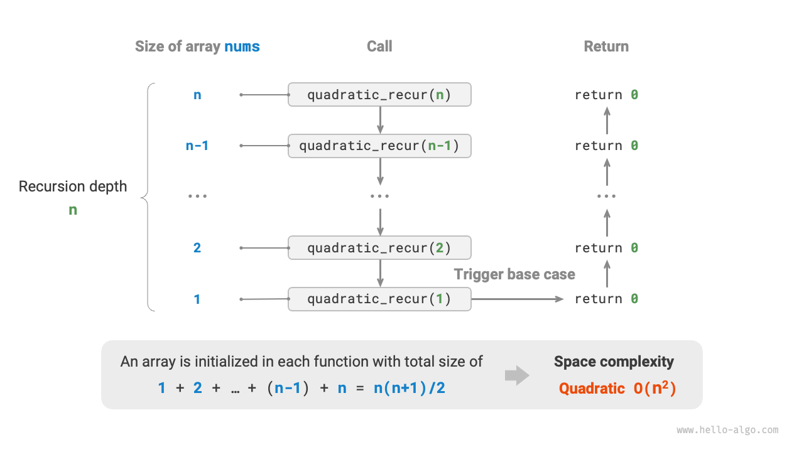
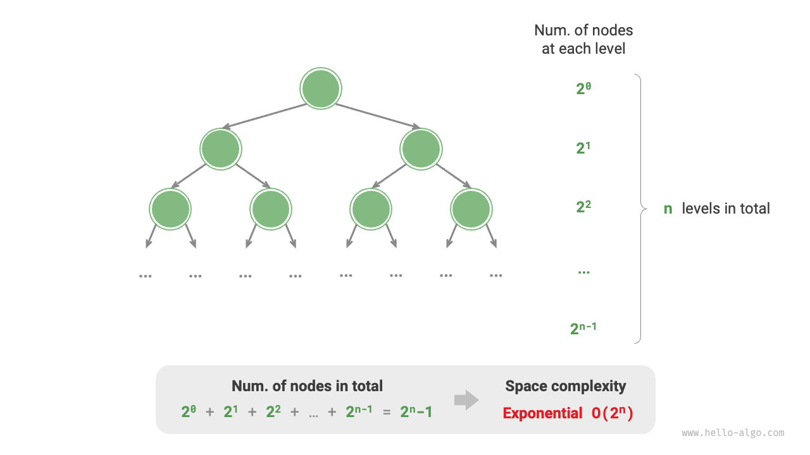

# Space complexity

<u>Độ phức tạp không gian</u> được dùng để đo xu hướng tăng của bộ nhớ chiếm dụng bởi một thuật toán khi lượng dữ liệu tăng lên. Khái niệm này rất giống với độ phức tạp thời gian, chỉ khác ở chỗ "thời gian chạy" được thay bằng "không gian bộ nhớ chiếm dụng".

## Space related to algorithms

Bộ nhớ mà một thuật toán sử dụng trong quá trình thực hiện chủ yếu bao gồm các loại sau.

- **Không gian đầu vào**: Dùng để lưu dữ liệu đầu vào của thuật toán.
- **Không gian tạm thời**: Dùng để lưu các biến, đối tượng, ngữ cảnh hàm và các dữ liệu khác trong quá trình chạy thuật toán.
- **Không gian đầu ra**: Dùng để lưu dữ liệu đầu ra của thuật toán.

Thông thường, phạm vi thống kê độ phức tạp không gian bao gồm cả "Không gian tạm thời" và "Không gian đầu ra".

Không gian tạm thời có thể được chia nhỏ hơn thành ba phần.

- **Dữ liệu tạm thời**: Dùng để lưu các hằng số, biến, đối tượng, v.v. trong quá trình thực thi thuật toán.
- **Không gian khung ngăn xếp**: Dùng để lưu dữ liệu ngữ cảnh của hàm được gọi. Hệ thống tạo một khung ngăn xếp ở đỉnh ngăn xếp mỗi khi một hàm được gọi, và không gian khung ngăn xếp được giải phóng sau khi hàm trả về.
- **Không gian lệnh**: Dùng để lưu các lệnh chương trình đã biên dịch, thường có thể coi là không đáng kể khi thống kê thực tế.

Khi phân tích độ phức tạp không gian của chương trình, **chúng ta thường tính Dữ liệu Tạm thời, Không gian Khung Ngăn xếp và Dữ liệu Đầu ra**, như hình bên dưới.


Mã liên quan như sau:

=== "Python"

    ```python title=""
    class Node:
        """Lớp"""
        def __init__(self, x: int):
            self.val: int = x               # giá trị nút
            self.next: Node | None = None   # tham chiếu tới nút tiếp theo

    def function() -> int:
        """Hàm"""
        # Thực hiện một số thao tác...
        return 0

    def algorithm(n) -> int:    # dữ liệu đầu vào
        A = 0                   # dữ liệu tạm thời (hằng, thường viết hoa)
        b = 0                   # dữ liệu tạm thời (biến)
        node = Node(0)          # dữ liệu tạm thời (đối tượng)
        c = function()          # không gian khung ngăn xếp (gọi hàm)
        return A + b + c        # dữ liệu đầu ra
    ```

=== "C++"

    ```cpp title=""
    /* Cấu trúc */
    struct Node {
        int val;
        Node *next;
        Node(int x) : val(x), next(nullptr) {}
    };

    /* Hàm */
    int func() {
        // Thực hiện một số thao tác...
        return 0;
    }

    int algorithm(int n) {          // dữ liệu đầu vào
        const int a = 0;            // dữ liệu tạm thời (hằng)
        int b = 0;                  // dữ liệu tạm thời (biến)
        Node* node = new Node(0);   // dữ liệu tạm thời (đối tượng)
        int c = func();             // không gian khung ngăn xếp (gọi hàm)
        return a + b + c;           // dữ liệu đầu ra
    }
    ```

=== "Java"

    ```java title=""
    /* Lớp */
    class Node {
        int val;
        Node next;
        Node(int x) { val = x; }
    }
   
    /* Hàm */
    int function() {
        // Thực hiện một số thao tác...
        return 0;
    }
   
    int algorithm(int n) {          // dữ liệu đầu vào
        final int a = 0;            // dữ liệu tạm thời (hằng)
        int b = 0;                  // dữ liệu tạm thời (biến)
        Node node = new Node(0);    // dữ liệu tạm thời (đối tượng)
        int c = function();         // không gian khung ngăn xếp (gọi hàm)
        return a + b + c;           // dữ liệu đầu ra
    }
    ```

=== "C#"

    ```csharp title=""
    /* Lớp */
    class Node {
        int val;
        Node next;
        Node(int x) { val = x; }
    }

    /* Hàm */
    int Function() {
        // Thực hiện một số thao tác...
        return 0;
    }

    int Algorithm(int n) {  // dữ liệu đầu vào
        const int a = 0;    // dữ liệu tạm thời (hằng)
        int b = 0;          // dữ liệu tạm thời (biến)
        Node node = new(0); // dữ liệu tạm thời (đối tượng)
        int c = Function(); // không gian khung ngăn xếp (gọi hàm)
        return a + b + c;   // dữ liệu đầu ra
    }
    ```

=== "Go"

    ```go title=""
    /* Cấu trúc */
    type node struct {
        val  int
        next *node
    }

    /* Tạo cấu trúc node */
    func newNode(val int) *node {
        return &node{val: val}
    }
   
    /* Hàm */
    func function() int {
        // Thực hiện một số thao tác...
        return 0
    }

    func algorithm(n int) int { // dữ liệu đầu vào
        const a = 0             // dữ liệu tạm thời (hằng)
        b := 0                  // dữ liệu tạm thời (biến)
        newNode(0)              // dữ liệu tạm thời (đối tượng)
        c := function()         // không gian khung ngăn xếp (gọi hàm)
        return a + b + c        // dữ liệu đầu ra
    }
    ```

=== "Swift"

    ```swift title=""
    /* Lớp */
    class Node {
        var val: Int
        var next: Node?

        init(x: Int) {
            val = x
        }
    }

    /* Hàm */
    func function() -> Int {
        // Thực hiện một số thao tác...
        return 0
    }

    func algorithm(n: Int) -> Int { // dữ liệu đầu vào
        let a = 0                   // dữ liệu tạm thời (hằng)
        var b = 0                   // dữ liệu tạm thời (biến)
        let node = Node(x: 0)       // dữ liệu tạm thời (đối tượng)
        let c = function()          // không gian khung ngăn xếp (gọi hàm)
        return a + b + c            // dữ liệu đầu ra
    }
    ```

=== "JS"

    ```javascript title=""
    /* Lớp */
    class Node {
        val;
        next;
        constructor(val) {
            this.val = val === undefined ? 0 : val; // giá trị nút
            this.next = null;                       // tham chiếu tới nút tiếp theo
        }
    }

    /* Hàm */
    function constFunc() {
        // Thực hiện một số thao tác
        return 0;
    }

    function algorithm(n) {         // dữ liệu đầu vào
        const a = 0;                // dữ liệu tạm thời (hằng)
        let b = 0;                  // dữ liệu tạm thời (biến)
        const node = new Node(0);   // dữ liệu tạm thời (đối tượng)
        const c = constFunc();      // không gian khung ngăn xếp (gọi hàm)
        return a + b + c;           // dữ liệu đầu ra
    }
    ```

=== "TS"

    ```typescript title=""
    /* Lớp */
    class Node {
        val: number;
        next: Node | null;
        constructor(val?: number) {
            this.val = val === undefined ? 0 : val; // giá trị nút
            this.next = null;                       // tham chiếu tới nút tiếp theo
        }
    }

    /* Hàm */
    function constFunc(): number {
        // Thực hiện một số thao tác
        return 0;
    }

    function algorithm(n: number): number { // dữ liệu đầu vào
        const a = 0;                        // dữ liệu tạm thời (hằng)
        let b = 0;                          // dữ liệu tạm thời (biến)
        const node = new Node(0);           // dữ liệu tạm thời (đối tượng)
        const c = constFunc();              // không gian khung ngăn xếp (gọi hàm)
        return a + b + c;                   // dữ liệu đầu ra
    }
    ```

=== "Dart"

    ```dart title=""
    /* Lớp */
    class Node {
      int val;
      Node next;
      Node(this.val, [this.next]);
    }

    /* Hàm */
    int function() {
      // Thực hiện một số thao tác...
      return 0;
    }

    int algorithm(int n) {  // dữ liệu đầu vào
      const int a = 0;      // dữ liệu tạm thời (hằng)
      int b = 0;            // dữ liệu tạm thời (biến)
      Node node = Node(0);  // dữ liệu tạm thời (đối tượng)
      int c = function();   // không gian khung ngăn xếp (gọi hàm)
      return a + b + c;     // dữ liệu đầu ra
    }
    ```

=== "Rust"

    ```rust title=""
    use std::rc::Rc;
    use std::cell::RefCell;
   
    /* Cấu trúc */
    struct Node {
        val: i32,
        next: Option<Rc<RefCell<Node>>>,
    }

    /* Constructor */
    impl Node {
        fn new(val: i32) -> Self {
            Self { val: val, next: None }
        }
    }

    /* Hàm */
    fn function() -> i32 {     
        // Thực hiện một số thao tác...
        return 0;
    }

    fn algorithm(n: i32) -> i32 {   // dữ liệu đầu vào
        const a: i32 = 0;           // dữ liệu tạm thời (hằng)
        let mut b = 0;              // dữ liệu tạm thời (biến)
        let node = Node::new(0);    // dữ liệu tạm thời (đối tượng)
        let c = function();         // không gian khung ngăn xếp (gọi hàm)
        return a + b + c;           // dữ liệu đầu ra
    }
    ```

=== "C"

    ```c title=""
    /* Hàm */
    int func() {
        // Thực hiện một số thao tác...
        return 0;
    }

    int algorithm(int n) {  // dữ liệu đầu vào
        const int a = 0;    // dữ liệu tạm thời (hằng)
        int b = 0;          // dữ liệu tạm thời (biến)
        int c = func();     // không gian khung ngăn xếp (gọi hàm)
        return a + b + c;   // dữ liệu đầu ra
    }
    ```

=== "Kotlin"

    ```kotlin title=""

    ```

=== "Zig"

    ```zig title=""

    ```

## Calculation method

Phương pháp tính độ phức tạp không gian tương tự như độ phức tạp thời gian, chỉ khác ở chỗ đối tượng thống kê chuyển từ "số phép toán" sang "kích thước không gian đã dùng".

Tuy nhiên, khác với thời gian, **chúng ta thường chỉ quan tâm đến độ phức tạp không gian trong trường hợp tệ nhất**. Lý do là bộ nhớ là một yêu cầu cứng, và ta phải đảm bảo rằng có đủ bộ nhớ được cấp cho mọi dữ liệu đầu vào.

Xem xét đoạn mã sau, thuật ngữ "tệ nhất" trong độ phức tạp không gian tệ nhất có hai ý nghĩa.

1. **Dựa trên dữ liệu đầu vào xấu nhất**: Khi $n < 10$, độ phức tạp không gian là $O(1)$; nhưng khi $n > 10$, mảng `nums` được khởi tạo chiếm không gian $O(n)$, do đó độ phức tạp không gian tệ nhất là $O(n)$.
2. **Dựa trên đỉnh sử dụng bộ nhớ trong quá trình thực thi**: Ví dụ, trước khi thực hiện dòng cuối cùng, chương trình chiếm $O(1)$ không gian; khi khởi tạo mảng `nums`, chương trình chiếm $O(n)$ không gian, nên độ phức tạp không gian tệ nhất là $O(n)$.

=== "Python"

    ```python title=""
    def algorithm(n: int):
        a = 0               # O(1)
        b = [0] * 10000     # O(1)
        if n > 10:
            nums = [0] * n  # O(n)
    ```

=== "C++"

    ```cpp title=""
    void algorithm(int n) {
        int a = 0;               // O(1)
        vector<int> b(10000);    // O(1)
        if (n > 10)
            vector<int> nums(n); // O(n)
    }
    ```

=== "Java"

    ```java title=""
    void algorithm(int n) {
        int a = 0;                   // O(1)
        int[] b = new int[10000];    // O(1)
        if (n > 10)
            int[] nums = new int[n]; // O(n)
    }
    ```

=== "C#"

    ```csharp title=""
    void Algorithm(int n) {
        int a = 0;                   // O(1)
        int[] b = new int[10000];    // O(1)
        if (n > 10) {
            int[] nums = new int[n]; // O(n)
        }
    }
    ```

=== "Go"

    ```go title=""
    func algorithm(n int) {
        a := 0                      // O(1)
        b := make([]int, 10000)     // O(1)
        var nums []int
        if n > 10 {
            nums := make([]int, n)  // O(n)
        }
        fmt.Println(a, b, nums)
    }
    ```

=== "Swift"

    ```swift title=""
    func algorithm(n: Int) {
        let a = 0 // O(1)
        let b = Array(repeating: 0, count: 10000) // O(1)
        if n > 10 {
            let nums = Array(repeating: 0, count: n) // O(n)
        }
    }
    ```

=== "JS"

    ```javascript title=""
    function algorithm(n) {
        const a = 0;                   // O(1)
        const b = new Array(10000);    // O(1)
        if (n > 10) {
            const nums = new Array(n); // O(n)
        }
    }
    ```

=== "TS"

    ```typescript title=""
    function algorithm(n: number): void {
        const a = 0;                   // O(1)
        const b = new Array(10000);    // O(1)
        if (n > 10) {
            const nums = new Array(n); // O(n)
        }
    }
    ```

=== "Dart"

    ```dart title=""
    void algorithm(int n) {
      int a = 0;                            // O(1)
      List<int> b = List.filled(10000, 0);  // O(1)
      if (n > 10) {
        List<int> nums = List.filled(n, 0); // O(n)
      }
    }
    ```

=== "Rust"

    ```rust title=""
    fn algorithm(n: i32) {
        let a = 0;                           // O(1)
        let b = [0; 10000];                  // O(1)
        if n > 10 {
            let nums = vec![0; n as usize];  // O(n)
        }
    }
    ```

=== "C"

    ```c title=""
    void algorithm(int n) {
        int a = 0;               // O(1)
        int b[10000];            // O(1)
        if (n > 10)
            int nums[n] = {0};   // O(n)
    }
    ```

=== "Kotlin"

    ```kotlin title=""

    ```

=== "Zig"

    ```zig title=""

    ```

**Trong các hàm đệ quy, cần phải tính cả không gian khung ngăn xếp**. Xem đoạn mã sau:

=== "Python"

    ```python title=""
    def function() -> int:
        # Thực hiện một số thao tác
        return 0

    def loop(n: int):
        """Vòng lặp O(1)"""
        for _ in range(n):
            function()

    def recur(n: int):
        """Đệ quy O(n)"""
        if n == 1:
            return
        return recur(n - 1)
    ```

=== "C++"

    ```cpp title=""
    int func() {
        // Thực hiện một số thao tác
        return 0;
    }
    /* Vòng lặp O(1) */
    void loop(int n) {
        for (int i = 0; i < n; i++) {
            func();
        }
    }
    /* Đệ quy O(n) */
    void recur(int n) {
        if (n == 1) return;
        recur(n - 1);
    }
    ```

=== "Java"

    ```java title=""
    int function() {
        // Thực hiện một số thao tác
        return 0;
    }
    /* Vòng lặp O(1) */
    void loop(n) {
        for (int i = 0; i < n; i++) {
            function();
        }
    }
    /* Đệ quy O(n) */
    void recur(int n) {
        if (n == 1) return;
        recur(n - 1);
    }
    ```

=== "C#"

    ```csharp title=""
    int Function() {
        // Thực hiện một số thao tác
        return 0;
    }
    /* Vòng lặp O(1) */
    void Loop(int n) {
        for (int i = 0; i < n; i++) {
            Function();
        }
    }
    /* Đệ quy O(n) */
    int Recur(int n) {
        if (n == 1) return 1;
        return Recur(n - 1);
    }
    ```

=== "Go"

    ```go title=""
    func function() int {
        // Thực hiện một số thao tác
        return 0
    }
   
    /* Vòng lặp O(1) */
    func loop(n int) {
        for i := 0; i < n; i++ {
            function()
        }
    }
   
    /* Đệ quy O(n) */
    func recur(n int) {
        if n == 1 {
            return
        }
        recur(n - 1)
    }
    ```

=== "Swift"

    ```swift title=""
    @discardableResult
    func function() -> Int {
        // Thực hiện một số thao tác
        return 0
    }

    /* Vòng lặp O(1) */
    func loop(n: Int) {
        for _ in 0 ..< n {
            function()
        }
    }

    /* Đệ quy O(n) */
    func recur(n: Int) {
        if n == 1 {
            return
        }
        recur(n: n - 1)
    }
    ```

=== "JS"

    ```javascript title=""
    function constFunc() {
        // Thực hiện một số thao tác
        return 0;
    }
    /* Vòng lặp O(1) */
    function loop(n) {
        for (let i = 0; i < n; i++) {
            constFunc();
        }
    }
    /* Đệ quy O(n) */
    function recur(n) {
        if (n === 1) return;
        return recur(n - 1);
    }
    ```

=== "TS"

    ```typescript title=""
    function constFunc(): number {
        // Thực hiện một số thao tác
        return 0;
    }
    /* Vòng lặp O(1) */
    function loop(n: number): void {
        for (let i = 0; i < n; i++) {
            constFunc();
        }
    }
    /* Đệ quy O(n) */
    function recur(n: number): void {
        if (n === 1) return;
        return recur(n - 1);
    }
    ```

=== "Dart"

    ```dart title=""
    int function() {
      // Thực hiện một số thao tác
      return 0;
    }
    /* Vòng lặp O(1) */
    void loop(int n) {
      for (int i = 0; i < n; i++) {
        function();
      }
    }
    /* Đệ quy O(n) */
    void recur(int n) {
      if (n == 1) return;
      recur(n - 1);
    }
    ```

=== "Rust"

    ```rust title=""
    fn function() -> i32 {
        // Thực hiện một số thao tác
        return 0;
    }
    /* Vòng lặp O(1) */
    fn loop(n: i32) {
        for i in 0..n {
            function();
        }
    }
    /* Đệ quy O(n) */
    void recur(n: i32) {
        if n == 1 {
            return;
        }
        recur(n - 1);
    }
    ```

=== "C"

    ```c title=""
    int func() {
        // Thực hiện một số thao tác
        return 0;
    }
    /* Vòng lặp O(1) */
    void loop(int n) {
        for (int i = 0; i < n; i++) {
            func();
        }
    }
    /* Đệ quy O(n) */
    void recur(int n) {
        if (n == 1) return;
        recur(n - 1);
    }
    ```

=== "Kotlin"

    ```kotlin title=""

    ```

=== "Zig"

    ```zig title=""

    ```

Độ phức tạp thời gian của cả hai hàm `loop()` và `recur()` đều là $O(n)$, nhưng độ phức tạp không gian của chúng khác nhau.

- Hàm `loop()` gọi `function()` $n$ lần trong một vòng lặp, mỗi lần gọi `function()` trả về và giải phóng không gian khung ngăn xếp, nên độ phức tạp không gian vẫn là $O(1)$.
- Hàm đệ quy `recur()` sẽ có $n$ thể hiện của `recur()` chưa trả về tồn tại đồng thời trong quá trình thực thi, do đó chiếm không gian khung ngăn xếp $O(n)$.

## Common types

Gọi kích thước dữ liệu đầu vào là $n$, hình dưới đây hiển thị các loại độ phức tạp không gian phổ biến (sắp xếp từ thấp đến cao).

$$
\begin{aligned}
& O(1) < O(\log n) < O(n) < O(n^2) < O(2^n) \newline
& \text{Hằng} < \text{Logarit} < \text{Tuyến tính} < \text{Bậc hai} < \text{Số mũ}
\end{aligned}
$$


### Constant order $O(1)$

Bậc hằng thường xuất hiện ở các hằng, biến, đối tượng mà kích thước không phụ thuộc vào dữ liệu đầu vào $n$.

Lưu ý rằng bộ nhớ chiếm dụng khi khởi tạo biến hoặc gọi hàm trong một vòng lặp, mà được giải phóng khi sang vòng lặp tiếp theo, sẽ không tích lũy theo không gian, do đó độ phức tạp vẫn là $O(1)$:

```src
[file]{space_complexity}-[class]{}-[func]{constant}
```

### Linear order $O(n)$

Bậc tuyến tính thường xuất hiện trong mảng, danh sách liên kết, ngăn xếp, hàng đợi, v.v., nơi số phần tử tỉ lệ với $n$:

```src
[file]{space_complexity}-[class]{}-[func]{linear}
```

Như hình bên dưới, độ sâu đệ quy của hàm này là $n$, tức là có $n$ thể hiện của hàm `linear_recur()` chưa trả về, sử dụng không gian khung ngăn xếp $O(n)$:

```src
[file]{space_complexity}-[class]{}-[func]{linear_recur}
```


### Quadratic order $O(n^2)$

Bậc bậc hai thường xuất hiện trong ma trận và đồ thị, nơi số phần tử tỉ lệ với bình phương của $n$:

```src
[file]{space_complexity}-[class]{}-[func]{quadratic}
```

Như hình bên dưới, độ sâu đệ quy của hàm này là $n$, và trong mỗi lần gọi đệ quy, một mảng được khởi tạo với độ dài lần lượt là $n$, $n-1$, $\dots$, $2$, $1$, trung bình là $n/2$, do đó tổng thể chiếm không gian $O(n^2)$:

```src
[file]{space_complexity}-[class]{}-[func]{quadratic_recur}
```



### Exponential order $O(2^n)$

Bậc số mũ thường xuất hiện trong cây nhị phân. Quan sát hình dưới, một "cây nhị phân đầy" có $n$ mức có $2^n - 1$ nút, chiếm không gian $O(2^n)$:

```src
[file]{space_complexity}-[class]{}-[func]{build_tree}
```



### Logarithmic order $O(\log n)$

Bậc logarit thường xuất hiện trong các thuật toán chia để trị. Ví dụ, trong sắp xếp trộn (merge sort), một mảng độ dài $n$ được chia đôi đệ quy mỗi lần, tạo thành một cây đệ quy có chiều cao $\log n$, sử dụng không gian khung ngăn xếp $O(\log n)$.

Một ví dụ khác là chuyển một số sang chuỗi. Cho một số nguyên dương $n$, số chữ số của nó là $\log_{10} n + 1$, tương ứng với độ dài của chuỗi, do đó độ phức tạp không gian là $O(\log_{10} n + 1) = O(\log n)$.

## Balancing time and space

Lý tưởng là chúng ta muốn cả độ phức tạp thời gian và không gian đều tối ưu. Tuy nhiên, trong thực tế, tối ưu cả hai cùng lúc thường khó.

**Giảm độ phức tạp thời gian thường đi kèm với việc tăng độ phức tạp không gian, và ngược lại**. Cách sử dụng bộ nhớ nhiều hơn để cải thiện tốc độ thuật toán được gọi là "đổi không gian lấy thời gian" (space-time tradeoff); chiều ngược lại gọi là "đổi thời gian lấy không gian" (time-space tradeoff).

Lựa chọn phụ thuộc vào khía cạnh nào chúng ta quan tâm hơn. Trong hầu hết trường hợp, thời gian quan trọng hơn không gian, nên "đổi không gian lấy thời gian" thường là chiến lược phổ biến hơn. Tất nhiên, khi xử lý khối lượng dữ liệu lớn, kiểm soát độ phức tạp không gian cũng rất quan trọng.
