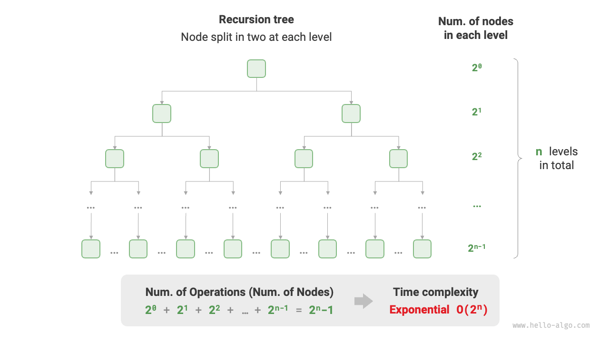

# Độ phức tạp thời gian

Thời gian chạy (runtime) có thể trực quan đánh giá hiệu suất của một thuật toán. Làm thế nào để chúng ta ước lượng chính xác thời gian chạy của một đoạn thuật toán?

1. **Xác định nền tảng chạy**: Bao gồm cấu hình phần cứng, ngôn ngữ lập trình, môi trường hệ thống, v.v., tất cả đều có thể ảnh hưởng đến hiệu suất thực thi mã.
2. **Đánh giá thời gian chạy cho từng phép toán tính toán**: Ví dụ, phép cộng `+` có thể mất 1 ns, phép nhân `*` có thể mất 10 ns, thao tác in `print()` có thể mất 5 ns, v.v.
3. **Đếm tất cả các phép toán tính toán trong mã**: Cộng thời gian thực thi của tất cả các phép toán này sẽ cho tổng thời gian chạy.

Ví dụ, xét đoạn mã sau với kích thước đầu vào là $n$:

=== "Python"

    ```python title=""
    # Dưới một nền tảng chạy
    def algorithm(n: int):
        a = 2      # 1 ns
        a = a + 1  # 1 ns
        a = a * 2  # 10 ns
        # Lặp n lần
        for _ in range(n):  # 1 ns
            print(0)        # 5 ns
    ```

=== "C++"

    ```cpp title=""
    // Dưới một nền tảng chạy cụ thể
    void algorithm(int n) {
        int a = 2;  // 1 ns
        a = a + 1;  // 1 ns
        a = a * 2;  // 10 ns
        // Vòng lặp lặp n lần
        for (int i = 0; i < n; i++) {  // 1 ns , mỗi lần vòng i++ được thực hiện
            cout << 0 << endl;         // 5 ns
        }
    }
    ```

=== "Java"

    ```java title=""
    // Dưới một nền tảng chạy cụ thể
    void algorithm(int n) {
        int a = 2;  // 1 ns
        a = a + 1;  // 1 ns
        a = a * 2;  // 10 ns
        // Vòng lặp lặp n lần
        for (int i = 0; i < n; i++) {  // 1 ns , mỗi lần vòng i++ được thực hiện
            System.out.println(0);     // 5 ns
        }
    }
    ```

=== "C#"

    ```csharp title=""
    // Dưới một nền tảng chạy cụ thể
    void Algorithm(int n) {
        int a = 2;  // 1 ns
        a = a + 1;  // 1 ns
        a = a * 2;  // 10 ns
        // Vòng lặp lặp n lần
        for (int i = 0; i < n; i++) {  // 1 ns , mỗi lần vòng i++ được thực hiện
            Console.WriteLine(0);      // 5 ns
        }
    }
    ```

=== "Go"

    ```go title=""
    // Dưới một nền tảng chạy cụ thể
    func algorithm(n int) {
        a := 2     // 1 ns
        a = a + 1  // 1 ns
        a = a * 2  // 10 ns
        // Lặp n lần
        for i := 0; i < n; i++ {  // 1 ns
            fmt.Println(a)        // 5 ns
        }
    }
    ```

=== "Swift"

    ```swift title=""
    // Dưới một nền tảng chạy cụ thể
    func algorithm(n: Int) {
        var a = 2 // 1 ns
        a = a + 1 // 1 ns
        a = a * 2 // 10 ns
        // Lặp n lần
        for _ in 0 ..< n { // 1 ns
            print(0) // 5 ns
        }
    }
    ```

=== "JS"

    ```javascript title=""
    // Dưới một nền tảng chạy cụ thể
    function algorithm(n) {
        var a = 2; // 1 ns
        a = a + 1; // 1 ns
        a = a * 2; // 10 ns
        // Lặp n lần
        for(let i = 0; i < n; i++) { // 1 ns , mỗi lần vòng i++ được thực hiện
            console.log(0); // 5 ns
        }
    }
    ```

=== "TS"

    ```typescript title=""
    // Dưới một nền tảng chạy cụ thể
    function algorithm(n: number): void {
        var a: number = 2; // 1 ns
        a = a + 1; // 1 ns
        a = a * 2; // 10 ns
        // Lặp n lần
        for(let i = 0; i < n; i++) { // 1 ns , mỗi lần vòng i++ được thực hiện
            console.log(0); // 5 ns
        }
    }
    ```

=== "Dart"

    ```dart title=""
    // Dưới một nền tảng chạy cụ thể
    void algorithm(int n) {
      int a = 2; // 1 ns
      a = a + 1; // 1 ns
      a = a * 2; // 10 ns
      // Lặp n lần
      for (int i = 0; i < n; i++) { // 1 ns , mỗi lần vòng i++ được thực hiện
        print(0); // 5 ns
      }
    }
    ```

=== "Rust"

    ```rust title=""
    // Dưới một nền tảng chạy cụ thể
    fn algorithm(n: i32) {
        let mut a = 2;      // 1 ns
        a = a + 1;          // 1 ns
        a = a * 2;          // 10 ns
        // Lặp n lần
        for _ in 0..n {     // 1 ns cho mỗi lần i++
            println!("{}", 0);  // 5 ns
        }
    }
    ```

=== "C"

    ```c title=""
    // Dưới một nền tảng chạy cụ thể
    void algorithm(int n) {
        int a = 2;  // 1 ns
        a = a + 1;  // 1 ns
        a = a * 2;  // 10 ns
        // Lặp n lần
        for (int i = 0; i < n; i++) {   // 1 ns , mỗi lần vòng i++ được thực hiện
            printf("%d", 0);            // 5 ns
        }
    }
    ```

=== "Kotlin"

    ```kotlin title=""

    ```

=== "Zig"

    ```zig title=""
    // Dưới một nền tảng chạy cụ thể
    fn algorithm(n: usize) void {
        var a: i32 = 2; // 1 ns
        a += 1; // 1 ns
        a *= 2; // 10 ns
        // Lặp n lần
        for (0..n) |_| { // 1 ns
            std.debug.print("{}\n", .{0}); // 5 ns
        }
    }
    ```

Sử dụng phương pháp trên, thời gian chạy của thuật toán có thể được tính là $(6n + 12)$ ns:

$$
1 + 1 + 10 + (1 + 5) \times n = 6n + 12
$$

Tuy nhiên, trong thực tế, **việc đếm thời gian chạy của một thuật toán là không thực tế và không hợp lý**. Thứ nhất, chúng ta không muốn gán thời gian ước lượng cho nền tảng chạy cụ thể, vì thuật toán cần chạy trên nhiều nền tảng khác nhau. Thứ hai, rất khó để biết thời gian chạy chính xác cho từng loại phép toán, làm cho quá trình ước lượng trở nên khó khăn.

## Đánh giá xu hướng tăng trưởng thời gian

Phân tích độ phức tạp thời gian không phải là đếm thời gian chạy, **mà là xu hướng tăng trưởng của thời gian chạy khi khối lượng dữ liệu tăng lên**.

Hãy hiểu khái niệm "xu hướng tăng trưởng thời gian" bằng ví dụ. Giả sử kích thước dữ liệu đầu vào là $n$, và xét ba thuật toán `A`, `B`, và `C`:

=== "Python"

    ```python title=""
    # Độ phức tạp thời gian của thuật toán A: hằng số
    def algorithm_A(n: int):
        print(0)
    # Độ phức tạp thời gian của thuật toán B: bậc tuyến tính
    def algorithm_B(n: int):
        for _ in range(n):
            print(0)
    # Độ phức tạp thời gian của thuật toán C: hằng số
    def algorithm_C(n: int):
        for _ in range(1000000):
            print(0)
    ```

=== "C++"

    ```cpp title=""
    // Độ phức tạp thời gian của thuật toán A: hằng số
    void algorithm_A(int n) {
        cout << 0 << endl;
    }
    // Độ phức tạp thời gian của thuật toán B: bậc tuyến tính
    void algorithm_B(int n) {
        for (int i = 0; i < n; i++) {
            cout << 0 << endl;
        }
    }
    // Độ phức tạp thời gian của thuật toán C: hằng số
    void algorithm_C(int n) {
        for (int i = 0; i < 1000000; i++) {
            cout << 0 << endl;
        }
    }
    ```

=== "Java"

    ```java title=""
    // Độ phức tạp thời gian của thuật toán A: hằng số
    void algorithm_A(int n) {
        System.out.println(0);
    }
    // Độ phức tạp thời gian của thuật toán B: bậc tuyến tính
    void algorithm_B(int n) {
        for (int i = 0; i < n; i++) {
            System.out.println(0);
        }
    }
    // Độ phức tạp thời gian của thuật toán C: hằng số
    void algorithm_C(int n) {
        for (int i = 0; i < 1000000; i++) {
            System.out.println(0);
        }
    }
    ```

=== "C#"

    ```csharp title=""
    // Độ phức tạp thời gian của thuật toán A: hằng số
    void AlgorithmA(int n) {
        Console.WriteLine(0);
    }
    // Độ phức tạp thời gian của thuật toán B: bậc tuyến tính
    void AlgorithmB(int n) {
        for (int i = 0; i < n; i++) {
            Console.WriteLine(0);
        }
    }
    // Độ phức tạp thời gian của thuật toán C: hằng số
    void AlgorithmC(int n) {
        for (int i = 0; i < 1000000; i++) {
            Console.WriteLine(0);
        }
    }
    ```

=== "Go"

    ```go title=""
    // Độ phức tạp thời gian của thuật toán A: hằng số
    func algorithm_A(n int) {
        fmt.Println(0)
    }
    // Độ phức tạp thời gian của thuật toán B: bậc tuyến tính
    func algorithm_B(n int) {
        for i := 0; i < n; i++ {
            fmt.Println(0)
        }
    }
    // Độ phức tạp thời gian của thuật toán C: hằng số
    func algorithm_C(n int) {
        for i := 0; i < 1000000; i++ {
            fmt.Println(0)
        }
    }
    ```

=== "Swift"

    ```swift title=""
    // Độ phức tạp thời gian của thuật toán A: hằng số
    func algorithmA(n: Int) {
        print(0)
    }

    // Độ phức tạp thời gian của thuật toán B: bậc tuyến tính
    func algorithmB(n: Int) {
        for _ in 0 ..< n {
            print(0)
        }
    }

    // Độ phức tạp thời gian của thuật toán C: hằng số
    func algorithmC(n: Int) {
        for _ in 0 ..< 1_000_000 {
            print(0)
        }
    }
    ```

=== "JS"

    ```javascript title=""
    // Độ phức tạp thời gian của thuật toán A: hằng số
    function algorithm_A(n) {
        console.log(0);
    }
    // Độ phức tạp thời gian của thuật toán B: bậc tuyến tính
    function algorithm_B(n) {
        for (let i = 0; i < n; i++) {
            console.log(0);
        }
    }
    // Độ phức tạp thời gian của thuật toán C: hằng số
    function algorithm_C(n) {
        for (let i = 0; i < 1000000; i++) {
            console.log(0);
        }
    }

    ```

=== "TS"

    ```typescript title=""
    // Độ phức tạp thời gian của thuật toán A: hằng số
    function algorithm_A(n: number): void {
        console.log(0);
    }
    // Độ phức tạp thời gian của thuật toán B: bậc tuyến tính
    function algorithm_B(n: number): void {
        for (let i = 0; i < n; i++) {
            console.log(0);
        }
    }
    // Độ phức tạp thời gian của thuật toán C: hằng số
    function algorithm_C(n: number): void {
        for (let i = 0; i < 1000000; i++) {
            console.log(0);
        }
    }
    ```

=== "Dart"

    ```dart title=""
    // Độ phức tạp thời gian của thuật toán A: hằng số
    void algorithmA(int n) {
      print(0);
    }
    // Độ phức tạp thời gian của thuật toán B: bậc tuyến tính
    void algorithmB(int n) {
      for (int i = 0; i < n; i++) {
        print(0);
      }
    }
    // Độ phức tạp thời gian của thuật toán C: hằng số
    void algorithmC(int n) {
      for (int i = 0; i < 1000000; i++) {
        print(0);
      }
    }
    ```

=== "Rust"

    ```rust title=""
    // Độ phức tạp thời gian của thuật toán A: hằng số
    fn algorithm_A(n: i32) {
        println!("{}", 0);
    }
    // Độ phức tạp thời gian của thuật toán B: bậc tuyến tính
    fn algorithm_B(n: i32) {
        for _ in 0..n {
            println!("{}", 0);
        }
    }
    // Độ phức tạp thời gian của thuật toán C: hằng số
    fn algorithm_C(n: i32) {
        for _ in 0..1000000 {
            println!("{}", 0);
        }
    }
    ```

=== "C"

    ```c title=""
    // Độ phức tạp thời gian của thuật toán A: hằng số
    void algorithm_A(int n) {
        printf("%d", 0);
    }
    // Độ phức tạp thời gian của thuật toán B: bậc tuyến tính
    void algorithm_B(int n) {
        for (int i = 0; i < n; i++) {
            printf("%d", 0);
        }
    }
    // Độ phức tạp thời gian của thuật toán C: hằng số
    void algorithm_C(int n) {
        for (int i = 0; i < 1000000; i++) {
            printf("%d", 0);
        }
    }
    ```

=== "Kotlin"

    ```kotlin title=""

    ```

=== "Zig"

    ```zig title=""
    // Độ phức tạp thời gian của thuật toán A: hằng số
    fn algorithm_A(n: usize) void {
        _ = n;
        std.debug.print("{}\n", .{0});
    }
    // Độ phức tạp thời gian của thuật toán B: bậc tuyến tính
    fn algorithm_B(n: i32) void {
        for (0..n) |_| {
            std.debug.print("{}\n", .{0});
        }
    }
    // Độ phức tạp thời gian của thuật toán C: hằng số
    fn algorithm_C(n: i32) void {
        _ = n;
        for (0..1000000) |_| {
            std.debug.print("{}\n", .{0});
        }
    }
    ```

Hình bên dưới thể hiện độ phức tạp thời gian của ba thuật toán này.

- Thuật toán `A` chỉ có một thao tác in, và thời gian chạy của nó không tăng theo $n$. Độ phức tạp thời gian được coi là "hằng số".
- Thuật toán `B` thực hiện thao tác in lặp $n$ lần, thời gian chạy tăng tuyến tính theo $n$. Độ phức tạp thời gian là "bậc tuyến tính".
- Thuật toán `C` lặp in 1.000.000 lần. Mặc dù tốn nhiều thời gian thực thi, nhưng nó độc lập với kích thước đầu vào $n$. Vì vậy, độ phức tạp thời gian của `C` giống `A`, đều là "hằng số".


So với việc đếm trực tiếp thời gian chạy của thuật toán, phân tích độ phức tạp thời gian có những đặc điểm gì?

- **Độ phức tạp thời gian đánh giá hiệu quả thuật toán một cách hiệu quả**. Ví dụ, thuật toán `B` có thời gian chạy tăng tuyến tính, chậm hơn thuật toán `A` khi $n > 1$ và chậm hơn `C` khi $n > 1{,}000{,}000$. Thực tế, khi kích thước dữ liệu đầu vào $n$ đủ lớn, thuật toán có độ phức tạp "hằng số" luôn tốt hơn thuật toán "tuyến tính", đây là bản chất của xu hướng tăng trưởng thời gian.
- **Phân tích độ phức tạp thời gian đơn giản hơn**. Rõ ràng, nền tảng chạy và loại phép toán tính toán không ảnh hưởng tới xu hướng tăng trưởng thời gian. Vì vậy, khi phân tích độ phức tạp thời gian, ta có thể coi thời gian thực thi của mọi phép toán đều là cùng một "đơn vị thời gian", đơn giản hóa việc "đếm thời gian thực thi của phép toán" thành "đếm số phép toán". Điều này giảm đáng kể độ phức tạp khi ước lượng.
- **Độ phức tạp thời gian có giới hạn của nó**. Ví dụ, mặc dù `A` và `C` có cùng độ phức tạp thời gian, thời gian chạy thực tế của chúng có thể rất khác nhau. Tương tự, mặc dù `B` có độ phức tạp cao hơn `C`, nhưng khi $n$ nhỏ thì `B` có thể tốt hơn. Trong những trường hợp này, khó đánh giá hiệu suất chỉ dựa trên độ phức tạp thời gian. Tuy nhiên, mặc dù có những vấn đề đó, phân tích độ phức tạp vẫn là phương pháp hiệu quả và phổ biến nhất để đánh giá hiệu suất thuật toán.

## Cận trên tiệm cận

Xét một hàm với kích thước đầu vào $n$:

=== "Python"

    ```python title=""
    def algorithm(n: int):
        a = 1      # +1
        a = a + 1  # +1
        a = a * 2  # +1
        # Lặp n lần
        for i in range(n):  # +1
            print(0)        # +1
    ```

=== "C++"

    ```cpp title=""
    void algorithm(int n) {
        int a = 1;  // +1
        a = a + 1;  // +1
        a = a * 2;  // +1
        // Vòng lặp lặp n lần
        for (int i = 0; i < n; i++) { // +1 (mỗi lần thực hiện i ++)
            cout << 0 << endl;    // +1
        }
    }
    ```

=== "Java"

    ```java title=""
    void algorithm(int n) {
        int a = 1;  // +1
        a = a + 1;  // +1
        a = a * 2;  // +1
        // Vòng lặp lặp n lần
        for (int i = 0; i < n; i++) { // +1 (mỗi lần thực hiện i ++)
            System.out.println(0);    // +1
        }
    }
    ```

=== "C#"

    ```csharp title=""
    void Algorithm(int n) {
        int a = 1;  // +1
        a = a + 1;  // +1
        a = a * 2;  // +1
        // Vòng lặp lặp n lần
        for (int i = 0; i < n; i++) {   // +1 (mỗi lần thực hiện i ++)
            Console.WriteLine(0);   // +1
        }
    }
    ```

=== "Go"

    ```go title=""
    func algorithm(n int) {
        a := 1      // +1
        a = a + 1   // +1
        a = a * 2   // +1
        // Lặp n lần
        for i := 0; i < n; i++ {   // +1
            fmt.Println(a)         // +1
        }
    }
    ```

=== "Swift"

    ```swift title=""
    func algorithm(n: Int) {
        var a = 1 // +1
        a = a + 1 // +1
        a = a * 2 // +1
        // Lặp n lần
        for _ in 0 ..< n { // +1
            print(0) // +1
        }
    }
    ```

=== "JS"

    ```javascript title=""
    function algorithm(n) {
        var a = 1; // +1
        a += 1; // +1
        a *= 2; // +1
        // Lặp n lần
        for(let i = 0; i < n; i++){ // +1 (mỗi lần thực hiện i ++)
            console.log(0); // +1
        }
    }
    ```

=== "TS"

    ```typescript title=""
    function algorithm(n: number): void{
        var a: number = 1; // +1
        a += 1; // +1
        a *= 2; // +1
        // Lặp n lần
        for(let i = 0; i < n; i++){ // +1 (mỗi lần thực hiện i ++)
            console.log(0); // +1
        }
    }
    ```

=== "Dart"

    ```dart title=""
    void algorithm(int n) {
      int a = 1; // +1
      a = a + 1; // +1
      a = a * 2; // +1
      // Lặp n lần
      for (int i = 0; i < n; i++) { // +1 (mỗi lần thực hiện i ++)
        print(0); // +1
      }
    }
    ```

=== "Rust"

    ```rust title=""
    fn algorithm(n: i32) {
        let mut a = 1;   // +1
        a = a + 1;      // +1
        a = a * 2;      // +1

        // Lặp n lần
        for _ in 0..n { // +1 (mỗi lần thực hiện i ++)
            println!("{}", 0); // +1
        }
    }
    ```

=== "C"

    ```c title=""
    void algorithm(int n) {
        int a = 1;  // +1
        a = a + 1;  // +1
        a = a * 2;  // +1
        // Lặp n lần
        for (int i = 0; i < n; i++) {   // +1 (mỗi lần thực hiện i ++)
            printf("%d", 0);            // +1
        }
    } 
    ```

=== "Kotlin"

    ```kotlin title=""

    ```

=== "Zig"

    ```zig title=""
    fn algorithm(n: usize) void {
        var a: i32 = 1; // +1
        a += 1; // +1
        a *= 2; // +1
        // Lặp n lần
        for(0..n) |_| { // +1 (mỗi lần thực hiện i ++)
            std.debug.print("{}\n", .{0}); // +1
        }
    }
    ```

Cho một hàm biểu diễn số phép toán của một thuật toán theo kích thước đầu vào $n$, ký hiệu là $T(n)$, xem ví dụ sau:

$$
T(n) = 3 + 2n
$$

Vì $T(n)$ là một hàm tuyến tính, xu hướng tăng trưởng của nó là tuyến tính, nên độ phức tạp thời gian là bậc tuyến tính, ký hiệu là $O(n)$. Ký hiệu toán học này, gọi là chú thích big-O (big-O notation), biểu diễn <u>cận trên tiệm cận</u> của hàm $T(n)$.

Về bản chất, phân tích độ phức tạp thời gian là tìm cận trên tiệm cận của "số phép toán $T(n)$". Nó có định nghĩa toán học chính xác.

!!! note "Cận trên tiệm cận"

    Nếu tồn tại các số thực dương $c$ và $n_0$ sao cho với mọi $n > n_0$, $T(n) \leq c \cdot f(n)$, thì $f(n)$ được coi là cận trên tiệm cận của $T(n)$, ký hiệu $T(n) = O(f(n))$.

Như minh họa trong hình dưới, việc tính cận trên tiệm cận là tìm một hàm $f(n)$ sao cho khi $n$ tiến tới vô cùng, $T(n)$ và $f(n)$ có cùng bậc tăng trưởng, chỉ khác nhau bởi một hệ số hằng $c$.


## Phương pháp tính toán

Mặc dù khái niệm cận trên tiệm cận có vẻ toán học, bạn không cần nắm vững ngay lập tức. Hãy bắt đầu hiểu phương pháp tính, bạn có thể luyện tập và hiểu dần theo thời gian.

Khi đã xác định được $f(n)$, ta có độ phức tạp thời gian $O(f(n))$. Nhưng làm thế nào để xác định cận trên tiệm cận $f(n)$? Quá trình này thường gồm hai bước: đếm số phép toán và xác định cận trên tiệm cận.

### Bước 1: đếm số phép toán

Bước này gồm duyệt mã từng dòng. Tuy nhiên, do tồn tại hệ số hằng $c$ trong $c \cdot f(n)$, **tất cả các hệ số và hằng số trong $T(n)$ có thể bị bỏ qua**. Nguyên tắc này cho phép các kỹ thuật đơn giản hóa khi đếm phép toán.

1. **Bỏ qua các hằng số trong $T(n)$**, vì chúng không phụ thuộc vào $n$ nên không ảnh hưởng đến độ phức tạp.
2. **Loại bỏ tất cả hệ số**. Ví dụ, lặp 2n, 5n + 1 lần, v.v., có thể đơn giản thành n lần vì hệ số trước n không làm thay đổi độ phức tạp.
3. **Dùng phép nhân cho vòng lặp lồng nhau**. Tổng số phép toán bằng tích số lượng phép toán ở mỗi vòng lặp, áp dụng kỹ thuật 1 và 2 cho mỗi cấp vòng lặp.

Với một đoạn mã, ta có thể dùng các kỹ thuật trên để đếm phép toán:

=== "Python"

    ```python title=""
    def algorithm(n: int):
        a = 1      # +0 (mẹo 1)
        a = a + n  # +0 (mẹo 1)
        # +n (kỹ thuật 2)
        for i in range(5 * n + 1):
            print(0)
        # +n*n (kỹ thuật 3)
        for i in range(2 * n):
            for j in range(n + 1):
                print(0)
    ```

=== "C++"

    ```cpp title=""
    void algorithm(int n) {
        int a = 1;  // +0 (mẹo 1)
        a = a + n;  // +0 (mẹo 1)
        // +n (kỹ thuật 2)
        for (int i = 0; i < 5 * n + 1; i++) {
            cout << 0 << endl;
        }
        // +n*n (kỹ thuật 3)
        for (int i = 0; i < 2 * n; i++) {
            for (int j = 0; j < n + 1; j++) {
                cout << 0 << endl;
            }
        }
    }
    ```

=== "Java"

    ```java title=""
    void algorithm(int n) {
        int a = 1;  // +0 (mẹo 1)
        a = a + n;  // +0 (mẹo 1)
        // +n (kỹ thuật 2)
        for (int i = 0; i < 5 * n + 1; i++) {
            System.out.println(0);
        }
        // +n*n (kỹ thuật 3)
        for (int i = 0; i < 2 * n; i++) {
            for (int j = 0; j < n + 1; j++) {
                System.out.println(0);
            }
        }
    }
    ```

=== "C#"

    ```csharp title=""
    void Algorithm(int n) {
        int a = 1;  // +0 (mẹo 1)
        a = a + n;  // +0 (mẹo 1)
        // +n (kỹ thuật 2)
        for (int i = 0; i < 5 * n + 1; i++) {
            Console.WriteLine(0);
        }
        // +n*n (kỹ thuật 3)
        for (int i = 0; i < 2 * n; i++) {
            for (int j = 0; j < n + 1; j++) {
                Console.WriteLine(0);
            }
        }
    }
    ```

=== "Go"

    ```go title=""
    func algorithm(n int) {
        a := 1     // +0 (mẹo 1)
        a = a + n  // +0 (mẹo 1)
        // +n (kỹ thuật 2)
        for i := 0; i < 5 * n + 1; i++ {
            fmt.Println(0)
        }
        // +n*n (kỹ thuật 3)
        for i := 0; i < 2 * n; i++ {
            for j := 0; j < n + 1; j++ {
                fmt.Println(0)
            }
        }
    }
    ```

=== "Swift"

    ```swift title=""
    func algorithm(n: Int) {
        var a = 1 // +0 (mẹo 1)
        a = a + n // +0 (mẹo 1)
        // +n (kỹ thuật 2)
        for _ in 0 ..< (5 * n + 1) {
            print(0)
        }
        // +n*n (kỹ thuật 3)
        for _ in 0 ..< (2 * n) {
            for _ in 0 ..< (n + 1) {
                print(0)
            }
        }
    }
    ```

=== "JS"

    ```javascript title=""
    function algorithm(n) {
        let a = 1;  // +0 (mẹo 1)
        a = a + n;  // +0 (mẹo 1)
        // +n (kỹ thuật 2)
        for (let i = 0; i < 5 * n + 1; i++) {
            console.log(0);
        }
        // +n*n (kỹ thuật 3)
        for (let i = 0; i < 2 * n; i++) {
            for (let j = 0; j < n + 1; j++) {
                console.log(0);
            }
        }
    }
    ```

=== "TS"

    ```typescript title=""
    function algorithm(n: number): void {
        let a = 1;  // +0 (mẹo 1)
        a = a + n;  // +0 (mẹo 1)
        // +n (kỹ thuật 2)
        for (let i = 0; i < 5 * n + 1; i++) {
            console.log(0);
        }
        // +n*n (kỹ thuật 3)
        for (let i = 0; i < 2 * n; i++) {
            for (let j = 0; j < n + 1; j++) {
                console.log(0);
            }
        }
    }
    ```

=== "Dart"

    ```dart title=""
    void algorithm(int n) {
      int a = 1; // +0 (mẹo 1)
      a = a + n; // +0 (mẹo 1)
      // +n (kỹ thuật 2)
      for (int i = 0; i < 5 * n + 1; i++) {
        print(0);
      }
      // +n*n (kỹ thuật 3)
      for (int i = 0; i < 2 * n; i++) {
        for (int j = 0; j < n + 1; j++) {
          print(0);
        }
      }
    }
    ```

=== "Rust"

    ```rust title=""
    fn algorithm(n: i32) {
        let mut a = 1;     // +0 (mẹo 1)
        a = a + n;        // +0 (mẹo 1)

        // +n (kỹ thuật 2)
        for i in 0..(5 * n + 1) {
            println!("{}", 0);
        }

        // +n*n (kỹ thuật 3)
        for i in 0..(2 * n) {
            for j in 0..(n + 1) {
                println!("{}", 0);
            }
        }
    }
    ```

=== "C"

    ```c title=""
    void algorithm(int n) {
        int a = 1;  // +0 (mẹo 1)
        a = a + n;  // +0 (mẹo 1)
        // +n (kỹ thuật 2)
        for (int i = 0; i < 5 * n + 1; i++) {
            printf("%d", 0);
        }
        // +n*n (kỹ thuật 3)
        for (int i = 0; i < 2 * n; i++) {
            for (int j = 0; j < n + 1; j++) {
                printf("%d", 0);
            }
        }
    }
    ```

=== "Kotlin"

    ```kotlin title=""

    ```

=== "Zig"

    ```zig title=""
    fn algorithm(n: usize) void {
        var a: i32 = 1;     // +0 (mẹo 1)
        a = a + @as(i32, @intCast(n));        // +0 (mẹo 1)

        // +n (kỹ thuật 2)
        for(0..(5 * n + 1)) |_| {
            std.debug.print("{}\n", .{0});
        }

        // +n*n (kỹ thuật 3)
        for(0..(2 * n)) |_| {
            for(0..(n + 1)) |_| {
                std.debug.print("{}\n", .{0});
            }
        }
    }
    ```

Công thức dưới đây cho thấy kết quả đếm trước và sau khi đơn giản hóa, đều dẫn tới độ phức tạp thời gian $O(n^2)$:

$$
\begin{aligned}
T(n) & = 2n(n + 1) + (5n + 1) + 2 & \text{Đếm đầy đủ (-.-|||)} \newline
& = 2n^2 + 7n + 3 \newline
T(n) & = n^2 + n & \text{Đếm đã đơn giản (o.O)}
\end{aligned}
$$

### Bước 2: xác định cận trên tiệm cận

**Độ phức tạp thời gian được xác định bởi hạng lớn nhất trong $T(n)$**. Bởi vì khi $n$ tiến tới vô cùng, hạng lớn nhất sẽ chi phối, làm cho ảnh hưởng của các hạng khác trở nên không đáng kể.

Bảng dưới đây minh họa ví dụ về các số phép toán khác nhau và độ phức tạp tương ứng. Một số giá trị được phóng đại để nhấn mạnh rằng hệ số không thể thay đổi cấp độ tăng trưởng. Khi $n$ rất lớn, các hằng số trở nên không đáng kể.

<p align="center"> Bảng: Độ phức tạp thời gian cho các số phép toán khác nhau </p>

| Số phép toán $T(n)$ | Độ phức tạp $O(f(n))$ |
| ---------------------- | ------------------------- |
| $100000$               | $O(1)$                    |
| $3n + 2$               | $O(n)$                    |
| $2n^2 + 3n + 2$        | $O(n^2)$                  |
| $n^3 + 10000n^2$       | $O(n^3)$                  |
| $2^n + 10000n^{10000}$ | $O(2^n)$                  |

## Các loại độ phức tạp thời gian phổ biến

Giả sử kích thước dữ liệu đầu vào là $n$. Các loại độ phức tạp thời gian phổ biến được sắp xếp từ thấp đến cao như sau:

$$
\begin{aligned}
& O(1) < O(\log n) < O(n) < O(n \log n) < O(n^2) < O(2^n) < O(n!) \newline
& \text{Hằng số} < \text{Log} < \text{Tuyến tính} < \text{Tuyến tính-Log} < \text{Bậc hai} < \text{Mũ} < \text{Giai thừa}
\end{aligned}
$$


### Bậc hằng số $O(1)$

Bậc hằng số nghĩa là số phép toán không phụ thuộc vào kích thước đầu vào $n$. Trong hàm dưới đây, mặc dù số lần in `size` có thể lớn, độ phức tạp vẫn là $O(1)$ vì không liên quan đến $n$:

```src
[file]{time_complexity}-[class]{}-[func]{constant}
```

### Bậc tuyến tính $O(n)$

Bậc tuyến tính nghĩa là số phép toán tăng theo tuyến tính với kích thước đầu vào $n$. Bậc tuyến tính thường xuất hiện ở cấu trúc vòng lặp đơn:

```src
[file]{time_complexity}-[class]{}-[func]{linear}
```

Các thao tác như duyệt mảng và duyệt danh sách liên kết có độ phức tạp là $O(n)$, với $n$ là độ dài mảng hoặc danh sách:

```src
[file]{time_complexity}-[class]{}-[func]{array_traversal}
```

Cần lưu ý rằng **kích thước dữ liệu $n$ nên được xác định dựa trên loại dữ liệu đầu vào**. Ví dụ, trong ví dụ đầu tiên, $n$ là kích thước dữ liệu đầu vào, trong ví dụ thứ hai, $n$ là độ dài mảng.

### Bậc hai $O(n^2)$

Bậc hai nghĩa là số phép toán tăng bình phương theo kích thước đầu vào $n$. Bậc hai thường xuất hiện ở vòng lặp lồng nhau, khi vòng ngoài và vòng trong đều có độ phức tạp $O(n)$, dẫn tới tổng thể $O(n^2)$:

```src
[file]{time_complexity}-[class]{}-[func]{quadratic}
```

Hình dưới so sánh bậc hằng số, tuyến tính và bậc hai.


Ví dụ, trong sắp xếp nổi bọt (bubble sort), vòng ngoài chạy $n - 1$ lần, vòng trong chạy $n-1$, $n-2$, ..., $2$, $1$ lần, trung bình $n / 2$ lần, dẫn tới độ phức tạp $O((n - 1) n / 2) = O(n^2)$:

```src
[file]{time_complexity}-[class]{}-[func]{bubble_sort}
```

### Bậc mũ $O(2^n)$

"Phân chia tế bào" trong sinh học là ví dụ kinh điển của tăng trưởng bậc mũ: bắt đầu từ một tế bào, sau một lần phân chia thành hai, sau hai lần thành bốn, và cứ thế, sau $n$ lần sẽ có $2^n$ tế bào.

Hình dưới và mã mô phỏng quá trình phân chia tế bào, có độ phức tạp $O(2^n)$:

```src
[file]{time_complexity}-[class]{}-[func]{exponential}
```



Trong thực tế, bậc mũ thường xuất hiện ở các hàm đệ quy. Ví dụ, trong mã dưới, nó đệ quy tách thành hai nhánh, dừng sau $n$ lần phân chia:

```src
[file]{time_complexity}-[class]{}-[func]{exp_recur}
```

Tăng trưởng bậc mũ rất nhanh và thường xuất hiện ở các phương pháp tìm kiếm toàn diện (brute force, backtracking, v.v.). Với bài toán quy mô lớn, bậc mũ là không chấp nhận được, thường cần dùng quy hoạch động hoặc thuật toán tham lam làm giải pháp.

### Bậc logarit $O(\log n)$

Ngược với bậc mũ, bậc logarit mô tả tình huống "kích thước giảm một nửa mỗi vòng". Với kích thước đầu vào $n$, vì mỗi vòng giảm một nửa, số vòng cần thiết là $\log_2 n$, là hàm đảo của $2^n$.

Hình dưới và mã mô phỏng quá trình "giảm một nửa mỗi vòng", có độ phức tạp $O(\log_2 n)$, thường viết tắt là $O(\log n)$:

```src
[file]{time_complexity}-[class]{}-[func]{logarithmic}
```


Giống như bậc mũ, bậc logarit cũng thường xuất hiện ở các hàm đệ quy. Mã dưới tạo một cây đệ quy có chiều cao $\log_2 n$:

```src
[file]{time_complexity}-[class]{}-[func]{log_recur}
```

Bậc logarit phổ biến trong các thuật toán chia để trị (divide-and-conquer), thể hiện ý tưởng "chia nhỏ" và "giải quyết vấn đề lớn bằng cách chia nhỏ". Đây là tốc độ tăng trưởng rất chậm và là độ phức tạp lý tưởng sau bậc hằng số.

!!! tip "Cơ số của $O(\log n)$ là gì?"

    Kỹ thuật thực tế "chia thành m phần" tương ứng với độ phức tạp $O(\log_m n)$. Dùng công thức đổi cơ số logarit, ta có thể quy mọi cơ số về nhau:

    $$
    O(\log_m n) = O(\log_k n / \log_k m) = O(\log_k n)
    $$

    Điều này nghĩa là cơ số $m$ có thể thay đổi mà không ảnh hưởng tới độ phức tạp. Vì vậy, thường ta bỏ qua cơ số và viết đơn giản là $O(\log n)$.

### Bậc tuyến tính-logarit $O(n \log n)$

Bậc tuyến tính-logarit thường xuất hiện ở vòng lặp lồng nhau mà một vòng có độ phức tạp $O(\log n)$ và vòng kia là $O(n)$. Mã liên quan như sau:

```src
[file]{time_complexity}-[class]{}-[func]{linear_log_recur}
```

Hình dưới cho thấy cách tạo ra bậc $O(n \log n)$. Mỗi cấp trong cây nhị phân có $n$ phép toán, và cây có $\log_2 n + 1$ cấp, dẫn tới tổng là $O(n \log n)$.


Các thuật toán sắp xếp phổ biến thường có độ phức tạp $O(n \log n)$, như quicksort, mergesort, và heapsort.

### Bậc giai thừa $O(n!)$

Bậc giai thừa tương ứng với bài toán "hoán vị đầy đủ". Với $n$ phần tử phân biệt, số hoán vị là:

$$
n! = n \times (n - 1) \times (n - 2) \times \dots \times 2 \times 1
$$

Giai thừa thường được cài bằng đệ quy. Như trong mã và hình dưới, cấp đầu tách thành $n$ nhánh, cấp hai thành $n - 1$ nhánh, và cứ thế, dừng sau cấp thứ $n$:

```src
[file]{time_complexity}-[class]{}-[func]{factorial_recur}
```


Lưu ý rằng bậc giai thừa tăng nhanh hơn cả bậc mũ; nó không chấp nhận được cho $n$ lớn.

## Độ phức tạp trong trường hợp xấu nhất, tốt nhất và trung bình

**Hiệu suất thời gian của một thuật toán thường không cố định mà phụ thuộc vào phân bố dữ liệu đầu vào**. Giả sử ta có một mảng `nums` độ dài $n$, gồm các số từ $1$ đến $n$, mỗi số xuất hiện đúng một lần, nhưng bị tráo ngẫu nhiên. Nhiệm vụ là trả về chỉ số của phần tử $1$. Ta có thể rút ra:

- Khi `nums = [?, ?, ..., 1]`, tức là phần tử cuối cùng là $1$, cần duyệt toàn bộ mảng, **đạt độ phức tạp trường hợp xấu nhất $O(n)$**.
- Khi `nums = [1, ?, ?, ...]`, tức là phần tử đầu tiên là $1$, không cần duyệt thêm, **đạt độ phức tạp tốt nhất $\Omega(1)$**.

"Độ phức tạp thời gian trường hợp xấu nhất" tương ứng với cận trên tiệm cận, ký hiệu bằng ký tự lớn $O$. Tương ứng, "độ phức tạp tốt nhất" tương ứng với cận dưới tiệm cận, ký hiệu bằng $\Omega$:

```src
[file]{worst_best_time_complexity}-[class]{}-[func]{find_one}
```

Cần lưu ý rằng độ phức tạp tốt nhất hiếm khi được dùng trong thực tế, vì nó thường chỉ đạt được trong các phân bố dữ liệu rất hiếm và có thể gây hiểu lầm. **Độ phức tạp trường hợp xấu nhất thực tế hơn vì nó cung cấp giá trị an toàn cho hiệu suất**, giúp ta tự tin sử dụng thuật toán.

Từ ví dụ trên, rõ ràng rằng cả trường hợp xấu nhất và tốt nhất đều xảy ra khi có "phân bố dữ liệu đặc biệt", có thể xác suất nhỏ và không phản ánh đúng hiệu suất thực tế. Ngược lại, **độ phức tạp trung bình có thể phản ánh hiệu suất thuật toán dưới dữ liệu ngẫu nhiên**, ký hiệu bằng $\Theta$.

Với một số thuật toán, ta có thể ước lượng trung bình đơn giản khi giả sử phân bố dữ liệu ngẫu nhiên. Ví dụ, trong ví dụ tìm 1 ở trên, vì mảng bị tráo đều, xác suất phần tử 1 xuất hiện ở mỗi vị trí là như nhau. Do đó, số vòng trung bình là nửa độ dài mảng $n / 2$, cho độ phức tạp trung bình $\Theta(n / 2) = \Theta(n)$.

Tuy nhiên, tính độ phức tạp trung bình cho các thuật toán phức tạp hơn có thể khó, vì khó phân tích giá trị kỳ vọng dưới phân bố dữ liệu. Trong những trường hợp này, ta thường dùng độ phức tạp trường hợp xấu nhất làm tiêu chuẩn đánh giá hiệu suất.

!!! question "Tại sao ít thấy ký hiệu $\Theta$?"

    Có thể vì chú thích $O$ được dùng phổ biến hơn trong lời nói, nên người ta hay dùng $O$ để chỉ cả độ phức tạp trung bình. Tuy nhiên, nghiêm túc mà nói, cách làm đó không chính xác. Trong sách này và các tài liệu khác, nếu bạn thấy câu "độ phức tạp trung bình $O(n)$", hãy hiểu trực tiếp là $\Theta(n)$.
