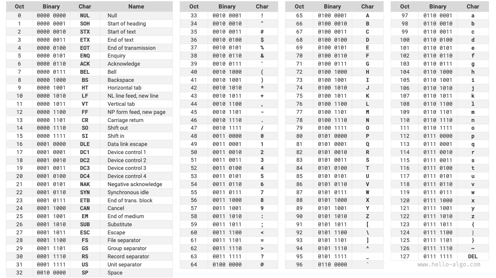
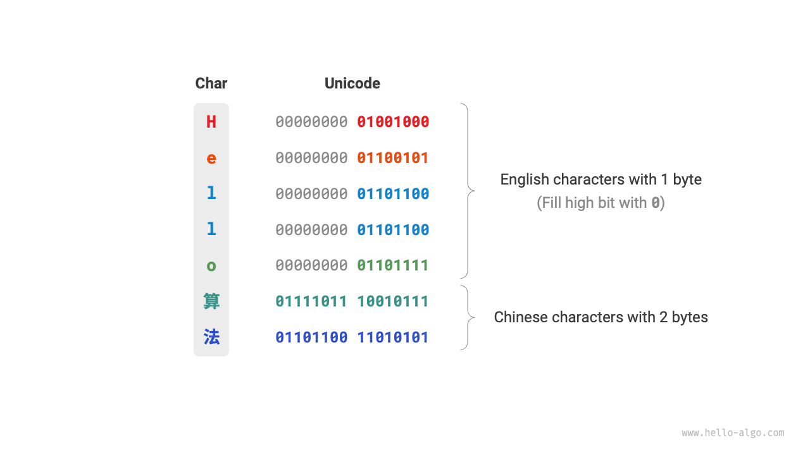

# Mã hóa ký tự *

Trong hệ thống máy tính, tất cả dữ liệu đều được lưu trữ dưới dạng nhị phân, và `char` cũng không ngoại lệ. Để biểu diễn ký tự, chúng ta cần phát triển một "bộ ký tự" định nghĩa ánh xạ một-một giữa mỗi ký tự và số nhị phân. Với bộ ký tự, máy tính có thể chuyển đổi số nhị phân thành ký tự bằng cách tra cứu bảng.

## Bộ ký tự ASCII

<u>Mã ASCII</u> là một trong những bộ ký tự sớm nhất, chính thức được gọi là American Standard Code for Information Interchange. Nó sử dụng 7 bit nhị phân (7 bit thấp hơn của một byte) để biểu diễn một ký tự, cho phép tối đa 128 ký tự khác nhau. Như hình dưới đây, ASCII bao gồm chữ cái in hoa và in thường tiếng Anh, số từ 0 đến 9, các dấu chấm câu khác nhau, và một số ký tự điều khiển (như dòng mới và tab).

Tuy nhiên, **ASCII chỉ có thể biểu diễn ký tự tiếng Anh**. Với sự toàn cầu hóa của máy tính, một bộ ký tự gọi là <u>EASCII</u> đã được phát triển để biểu diễn nhiều ngôn ngữ hơn. Nó mở rộng từ cấu trúc 7 bit của ASCII thành 8 bit, cho phép biểu diễn 256 ký tự.

Trên toàn cầu, nhiều bộ ký tự EASCII dành riêng cho từng khu vực đã được giới thiệu. 128 ký tự đầu tiên của các bộ này nhất quán với ASCII, trong khi 128 ký tự còn lại được định nghĩa khác nhau để đáp ứng yêu cầu của các ngôn ngữ khác nhau.

## Bộ ký tự GBK

Sau đó, người ta phát hiện rằng **EASCII vẫn không thể đáp ứng yêu cầu ký tự của nhiều ngôn ngữ**. Ví dụ, có gần trăm nghìn ký tự Trung Quốc, với vài nghìn ký tự được sử dụng thường xuyên. Năm 1980, Cơ quan Tiêu chuẩn hóa Trung Quốc đã phát hành bộ ký tự <u>GB2312</u>, bao gồm 6763 ký tự Trung Quốc, về cơ bản đáp ứng nhu cầu xử lý máy tính cho ngôn ngữ Trung Quốc.

Tuy nhiên, GB2312 không thể xử lý một số ký tự hiếm và truyền thống. Bộ ký tự <u>GBK</u> mở rộng GB2312 và bao gồm 21886 ký tự Trung Quốc. Trong lược đồ mã hóa GBK, ký tự ASCII được biểu diễn bằng một byte, trong khi ký tự Trung Quốc sử dụng hai byte.

## Bộ ký tự Unicode

Với sự phát triển nhanh chóng của công nghệ máy tính và vô số bộ ký tự và tiêu chuẩn mã hóa, nhiều vấn đề đã nảy sinh. Một mặt, các bộ ký tự này thường chỉ định nghĩa ký tự cho các ngôn ngữ cụ thể và không thể hoạt động đúng trong môi trường đa ngôn ngữ. Mặt khác, sự tồn tại của nhiều tiêu chuẩn bộ ký tự cho cùng một ngôn ngữ gây ra hiện tượng văn bản bị lỗi khi trao đổi thông tin giữa các máy tính sử dụng tiêu chuẩn mã hóa khác nhau.

Các nhà nghiên cứu thời đó nghĩ: **Nếu chúng ta phát triển một bộ ký tự toàn diện bao gồm tất cả ngôn ngữ và ký hiệu toàn cầu thì sao? Điều này có giải quyết các vấn đề liên quan đến môi trường đa ngôn ngữ và văn bản bị lỗi không?** Lấy cảm hứng từ ý tưởng này, bộ ký tự rộng lớn, Unicode, đã ra đời.

<u>Unicode</u> được gọi là "统一码" (Unified Code) bằng tiếng Trung, về lý thuyết có thể chứa hơn một triệu ký tự. Nó nhằm mục đích kết hợp các ký tự từ khắp nơi trên thế giới vào một bộ duy nhất, cung cấp bộ ký tự phổ quát để xử lý và hiển thị các ngôn ngữ khác nhau, giảm thiểu các vấn đề về văn bản bị lỗi do các tiêu chuẩn mã hóa khác nhau.

Kể từ khi phát hành năm 1991, Unicode đã liên tục mở rộng để bao gồm các ngôn ngữ và ký tự mới. Tính đến tháng 9 năm 2022, Unicode chứa 149.186 ký tự, bao gồm ký tự, ký hiệu, và thậm chí cả emoji từ các ngôn ngữ khác nhau. Trong bộ ký tự Unicode rộng lớn, các ký tự thường dùng chiếm 2 byte, trong khi một số ký tự hiếm có thể chiếm 3 hoặc thậm chí 4 byte.

Unicode là bộ ký tự phổ quát gán một số (gọi là "điểm mã") cho mỗi ký tự, **nhưng nó không chỉ định cách các điểm mã ký tự Unicode này nên được lưu trữ trong hệ thống máy tính**. Người ta có thể hỏi: Làm thế nào hệ thống diễn giải các điểm mã Unicode có độ dài khác nhau trong một văn bản? Ví dụ, với một mã 2 byte, làm thế nào hệ thống xác định nó biểu diễn một ký tự 2 byte đơn lẻ hay hai ký tự 1 byte?

**Một giải pháp đơn giản cho vấn đề này là lưu trữ tất cả ký tự dưới dạng mã hóa độ dài bằng nhau**. Như hình dưới đây, mỗi ký tự trong "Hello" chiếm 1 byte, trong khi mỗi ký tự trong "算法" (algorithm) chiếm 2 byte. Chúng ta có thể mã hóa tất cả ký tự trong "Hello 算法" thành 2 byte bằng cách đệm các bit cao hơn bằng số không. Phương pháp này sẽ cho phép hệ thống diễn giải một ký tự mỗi 2 byte, khôi phục nội dung của cụm từ.

Tuy nhiên, như ASCII đã cho chúng ta thấy, mã hóa tiếng Anh chỉ cần 1 byte. Sử dụng phương pháp trên sẽ làm tăng gấp đôi không gian chiếm bởi văn bản tiếng Anh so với mã hóa ASCII, điều này lãng phí không gian bộ nhớ. Do đó, cần một phương pháp mã hóa Unicode hiệu quả hơn.

## Mã hóa UTF-8

Hiện tại, UTF-8 đã trở thành phương pháp mã hóa Unicode được sử dụng rộng rãi nhất trên toàn cầu. **Nó là mã hóa độ dài biến đổi**, sử dụng 1 đến 4 byte để biểu diễn một ký tự, tùy thuộc vào độ phức tạp của ký tự. Ký tự ASCII chỉ cần 1 byte, chữ cái Latin và Hy Lạp yêu cầu 2 byte, ký tự Trung Quốc thường dùng cần 3 byte, và một số ký tự hiếm khác cần 4 byte.

Các quy tắc mã hóa cho UTF-8 không phức tạp và có thể chia thành hai trường hợp:

- Đối với ký tự 1 byte, đặt bit cao nhất thành $0$, và 7 bit còn lại thành điểm mã Unicode. Đặc biệt, ký tự ASCII chiếm 128 điểm mã đầu tiên trong bộ Unicode. Điều này có nghĩa là **mã hóa UTF-8 tương thích ngược với ASCII**. Điều này ngụ ý rằng UTF-8 có thể được sử dụng để phân tích văn bản ASCII cổ xưa.
- Đối với ký tự có độ dài $n$ byte (trong đó $n > 1$), đặt $n$ bit cao nhất của byte đầu tiên thành $1$, và bit $(n + 1)^{\text{th}}$ thành $0$; bắt đầu từ byte thứ hai, đặt 2 bit cao nhất của mỗi byte thành $10$; các bit còn lại được sử dụng để điền điểm mã Unicode.

Hình dưới đây cho thấy mã hóa UTF-8 cho "Hello算法". Có thể quan sát thấy rằng vì $n$ bit cao nhất được đặt thành $1$, hệ thống có thể xác định độ dài của ký tự là $n$ bằng cách đếm số bit cao nhất được đặt thành $1$.

Nhưng tại sao đặt 2 bit cao nhất của các byte còn lại thành $10$? Thực ra, $10$ này phục vụ như một loại kiểm tra tổng. Nếu hệ thống bắt đầu phân tích văn bản từ một byte sai, $10$ ở đầu byte có thể giúp hệ thống nhanh chóng phát hiện bất thường.

Lý do sử dụng $10$ làm kiểm tra tổng là vì, dưới quy tắc mã hóa UTF-8, không thể có 2 bit cao nhất của một ký tự là $10$. Điều này có thể được chứng minh bằng mâu thuẫn: Nếu 2 bit cao nhất của một ký tự là $10$, nó chỉ ra độ dài ký tự là $1$, tương ứng với ASCII. Tuy nhiên, bit cao nhất của ký tự ASCII nên là $0$, điều này mâu thuẫn với giả định.

Ngoài UTF-8, các phương pháp mã hóa phổ biến khác bao gồm:

- **Mã hóa UTF-16**: Sử dụng 2 hoặc 4 byte để biểu diễn một ký tự. Tất cả ký tự ASCII và ký tự không tiếng Anh thường dùng được biểu diễn bằng 2 byte; một vài ký tự yêu cầu 4 byte. Đối với ký tự 2 byte, mã hóa UTF-16 bằng điểm mã Unicode.
- **Mã hóa UTF-32**: Mỗi ký tự sử dụng 4 byte. Điều này có nghĩa là UTF-32 chiếm nhiều không gian hơn UTF-8 và UTF-16, đặc biệt đối với văn bản có tỷ lệ cao ký tự ASCII.

Từ góc độ không gian lưu trữ, sử dụng UTF-8 để biểu diễn ký tự tiếng Anh rất hiệu quả vì nó chỉ cần 1 byte; sử dụng UTF-16 để mã hóa một số ký tự không tiếng Anh (như tiếng Trung) có thể hiệu quả hơn vì nó chỉ cần 2 byte, trong khi UTF-8 có thể cần 3 byte.

Từ góc độ tương thích, UTF-8 là linh hoạt nhất, với nhiều công cụ và thư viện hỗ trợ UTF-8 là ưu tiên.

## Mã hóa ký tự trong ngôn ngữ lập trình

Lịch sử, nhiều ngôn ngữ lập trình sử dụng mã hóa độ dài cố định như UTF-16 hoặc UTF-32 để xử lý chuỗi trong quá trình thực thi chương trình. Điều này cho phép xử lý chuỗi như mảng, mang lại một số lợi thế:

- **Truy cập ngẫu nhiên**: Chuỗi mã hóa UTF-16 có thể được truy cập ngẫu nhiên dễ dàng. Đối với UTF-8, là mã hóa độ dài biến đổi, việc định vị ký tự $i^{\text{th}}$ yêu cầu duyệt chuỗi từ đầu đến vị trí $i^{\text{th}}$, mất thời gian $O(n)$.
- **Đếm ký tự**: Tương tự như truy cập ngẫu nhiên, đếm số lượng ký tự trong chuỗi mã hóa UTF-16 là thao tác $O(1)$. Tuy nhiên, đếm ký tự trong chuỗi mã hóa UTF-8 yêu cầu duyệt toàn bộ chuỗi.
- **Thao tác chuỗi**: Nhiều thao tác chuỗi như tách, nối, chèn và xóa dễ dàng hơn trên chuỗi mã hóa UTF-16. Các thao tác này thường yêu cầu tính toán bổ sung trên chuỗi mã hóa UTF-8 để đảm bảo tính hợp lệ của mã hóa UTF-8.

Thiết kế lược đồ mã hóa ký tự trong ngôn ngữ lập trình là chủ đề thú vị liên quan đến nhiều yếu tố:

- Kiểu `String` của Java sử dụng mã hóa UTF-16, với mỗi ký tự chiếm 2 byte. Điều này dựa trên niềm tin ban đầu rằng 16 bit đủ để biểu diễn tất cả ký tự có thể và sau đó chứng minh là sai. Khi tiêu chuẩn Unicode mở rộng vượt quá 16 bit, ký tự trong Java có thể được biểu diễn bằng cặp giá trị 16 bit, được gọi là "cặp thay thế."
- JavaScript và TypeScript sử dụng mã hóa UTF-16 vì lý do tương tự như Java. Khi JavaScript được giới thiệu lần đầu bởi Netscape năm 1995, Unicode vẫn ở giai đoạn đầu, và mã hóa 16 bit đủ để biểu diễn tất cả ký tự Unicode.
- C# sử dụng mã hóa UTF-16, chủ yếu vì nền tảng .NET, được thiết kế bởi Microsoft, và nhiều công nghệ Microsoft, bao gồm hệ điều hành Windows, sử dụng rộng rãi mã hóa UTF-16.

Do đánh giá thấp số lượng ký tự, các ngôn ngữ này phải sử dụng "cặp thay thế" để biểu diễn ký tự Unicode vượt quá 16 bit. Phương pháp này có nhược điểm: chuỗi chứa cặp thay thế có thể có ký tự chiếm 2 hoặc 4 byte, mất lợi thế của mã hóa độ dài cố định. Ngoài ra, xử lý cặp thay thế thêm độ phức tạp và khó khăn trong gỡ lỗi.

Giải quyết những thách thức này, một số ngôn ngữ đã áp dụng chiến lược mã hóa thay thế:

- Kiểu `str` của Python sử dụng mã hóa Unicode với biểu diễn linh hoạt nơi độ dài lưu trữ của ký tự phụ thuộc vào điểm mã Unicode lớn nhất trong chuỗi. Nếu tất cả ký tự là ASCII, mỗi ký tự chiếm 1 byte, 2 byte cho ký tự trong Mặt phẳng đa ngôn ngữ cơ bản (BMP), và 4 byte cho ký tự vượt quá BMP.
- Kiểu `string` của Go sử dụng mã hóa UTF-8 nội bộ. Go cũng cung cấp kiểu `rune` để biểu diễn điểm mã Unicode riêng lẻ.
- Kiểu `str` và `String` của Rust sử dụng mã hóa UTF-8 nội bộ. Rust cũng cung cấp kiểu `char` cho điểm mã Unicode riêng lẻ.

Quan trọng là lưu ý rằng thảo luận trên liên quan đến cách chuỗi được lưu trữ trong ngôn ngữ lập trình, **khác với cách chuỗi được lưu trữ trong tệp hoặc truyền qua mạng**. Đối với lưu trữ tệp hoặc truyền mạng, chuỗi thường được mã hóa ở định dạng UTF-8 để tối ưu tương thích và hiệu quả không gian.
