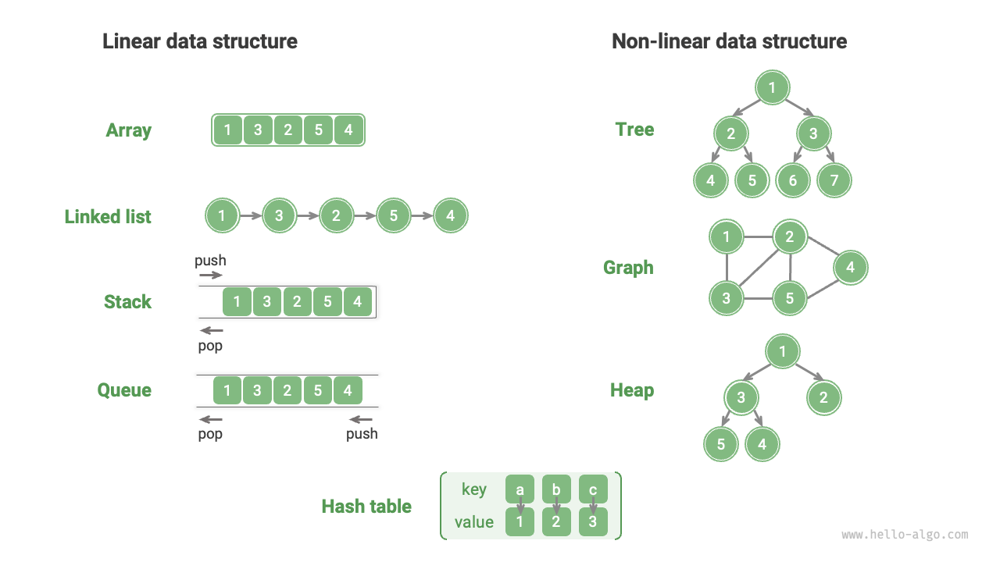
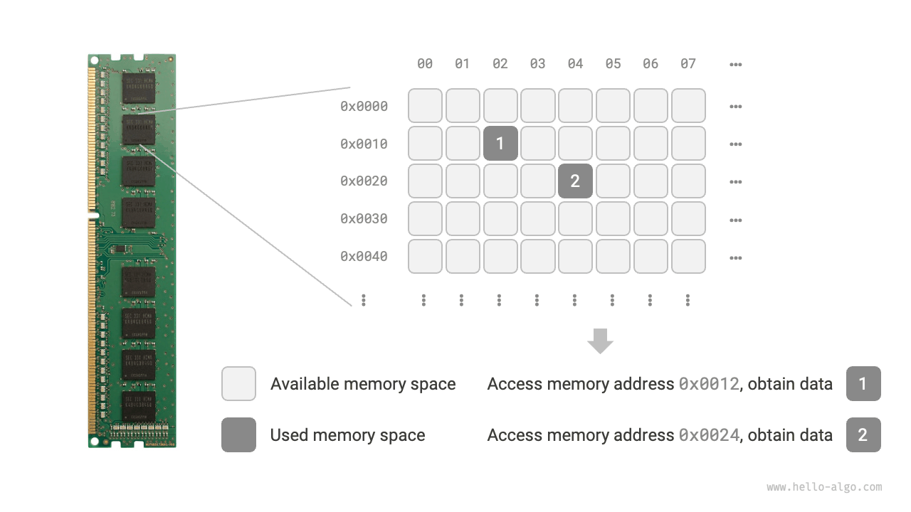
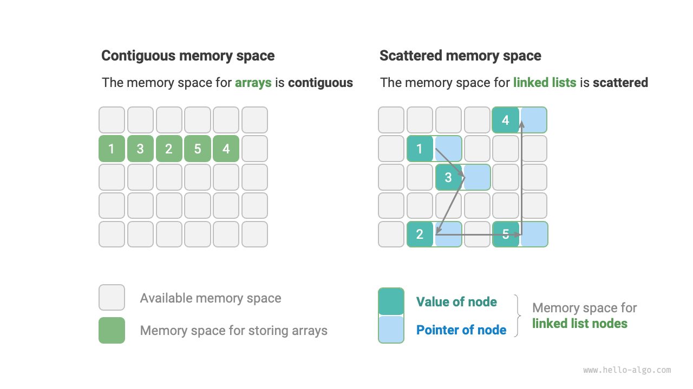

# Phân loại cấu trúc dữ liệu

Các cấu trúc dữ liệu phổ biến gồm mảng, danh sách liên kết, ngăn xếp, hàng đợi, bảng băm, cây, heap và đồ thị. Chúng có thể được phân loại thành "cấu trúc logic" và "cấu trúc vật lý".

## Cấu trúc logic: tuyến tính và phi tuyến tính

**Cấu trúc logic thể hiện mối quan hệ logic giữa các phần tử dữ liệu**. Trong mảng và danh sách liên kết, dữ liệu được sắp xếp theo một trình tự nhất định, thể hiện mối quan hệ tuyến tính giữa các phần tử; còn trong cây, dữ liệu được sắp xếp theo dạng phân cấp từ trên xuống dưới, thể hiện mối quan hệ giữa "tổ tiên" và "hậu duệ"; còn đồ thị gồm các nút và cạnh, phản ánh mối quan hệ mạng lưới phức tạp.

Như hình dưới đây, cấu trúc logic có thể chia thành hai loại lớn: "tuyến tính" và "phi tuyến tính". Cấu trúc tuyến tính dễ hình dung hơn, cho thấy dữ liệu được sắp xếp theo quan hệ tuyến tính; ngược lại, cấu trúc phi tuyến tính được sắp xếp không theo tuyến tính.

- **Cấu trúc dữ liệu tuyến tính**: Mảng, Danh sách liên kết, Ngăn xếp, Hàng đợi, Bảng băm.
- **Cấu trúc dữ liệu phi tuyến tính**: Cây, Heap, Đồ thị, Bảng băm.

Cấu trúc dữ liệu phi tuyến tính có thể chia nhỏ thành cấu trúc cây và cấu trúc mạng.

- **Cấu trúc cây**: Cây, Heap, Bảng băm, nơi các phần tử có quan hệ một-nhiều.
- **Cấu trúc mạng**: Đồ thị, nơi các phần tử có quan hệ nhiều-nhiều.

## Cấu trúc vật lý: liên tục và phân tán

**Khi thuật toán thực thi, dữ liệu được xử lý sẽ lưu trong bộ nhớ**. Hình dưới đây là một thanh RAM máy tính, mỗi ô vuông màu đen là một vùng nhớ vật lý. Bạn có thể hình dung bộ nhớ như một bảng Excel lớn, mỗi ô có thể lưu trữ một lượng dữ liệu nhất định.

**Hệ thống truy cập dữ liệu tại vị trí mục tiêu thông qua địa chỉ bộ nhớ**. Như hình dưới, máy tính gán một mã định danh duy nhất cho mỗi ô trong bảng theo quy tắc nhất định, đảm bảo mỗi vùng nhớ có một địa chỉ bộ nhớ riêng biệt. Nhờ các địa chỉ này, chương trình có thể truy cập dữ liệu lưu trong bộ nhớ.

!!! tip

    Việc so sánh bộ nhớ với bảng Excel chỉ là ví dụ đơn giản. Thực tế, cơ chế hoạt động của bộ nhớ phức tạp hơn, liên quan đến không gian địa chỉ, quản lý bộ nhớ, bộ nhớ đệm, bộ nhớ ảo và bộ nhớ vật lý.

Bộ nhớ là tài nguyên dùng chung cho mọi chương trình. Khi một vùng nhớ bị chiếm bởi một chương trình, chương trình khác không thể sử dụng vùng đó cùng lúc. **Vì vậy, việc cân nhắc tài nguyên bộ nhớ rất quan trọng khi thiết kế cấu trúc dữ liệu và thuật toán**. Ví dụ, lượng bộ nhớ tối đa thuật toán sử dụng không được vượt quá bộ nhớ còn trống của hệ thống; nếu thiếu các vùng nhớ liên tục, cấu trúc dữ liệu chọn phải có khả năng lưu trữ ở các vùng nhớ không liên tục.

Như hình dưới, **cấu trúc vật lý thể hiện cách dữ liệu được lưu trong bộ nhớ máy tính** và có thể chia thành lưu trữ ở vùng liên tục (mảng) và lưu trữ ở vùng không liên tục (danh sách liên kết). Hai kiểu cấu trúc vật lý này có đặc điểm bổ sung nhau về hiệu quả thời gian và hiệu quả không gian.

**Lưu ý rằng mọi cấu trúc dữ liệu đều được xây dựng dựa trên mảng, danh sách liên kết hoặc kết hợp cả hai**. Ví dụ, ngăn xếp và hàng đợi có thể được cài đặt bằng mảng hoặc danh sách liên kết; còn bảng băm có thể dùng cả mảng và danh sách liên kết.

- **Cài đặt dựa trên mảng**: Ngăn xếp, Hàng đợi, Bảng băm, Cây, Heap, Đồ thị, Ma trận, Tensor (mảng có số chiều $\geq 3$).
- **Cài đặt dựa trên danh sách liên kết**: Ngăn xếp, Hàng đợi, Bảng băm, Cây, Heap, Đồ thị, v.v.

Cấu trúc dữ liệu dựa trên mảng còn gọi là “Cấu trúc dữ liệu tĩnh”, nghĩa là độ dài không thay đổi sau khi khởi tạo. Ngược lại, cấu trúc dựa trên danh sách liên kết gọi là “Cấu trúc dữ liệu động”, có thể thay đổi kích thước khi chương trình chạy.

!!! tip

    Nếu bạn thấy khó hiểu về cấu trúc vật lý, hãy đọc chương tiếp theo "Mảng và Danh sách liên kết" rồi quay lại phần này sau.
