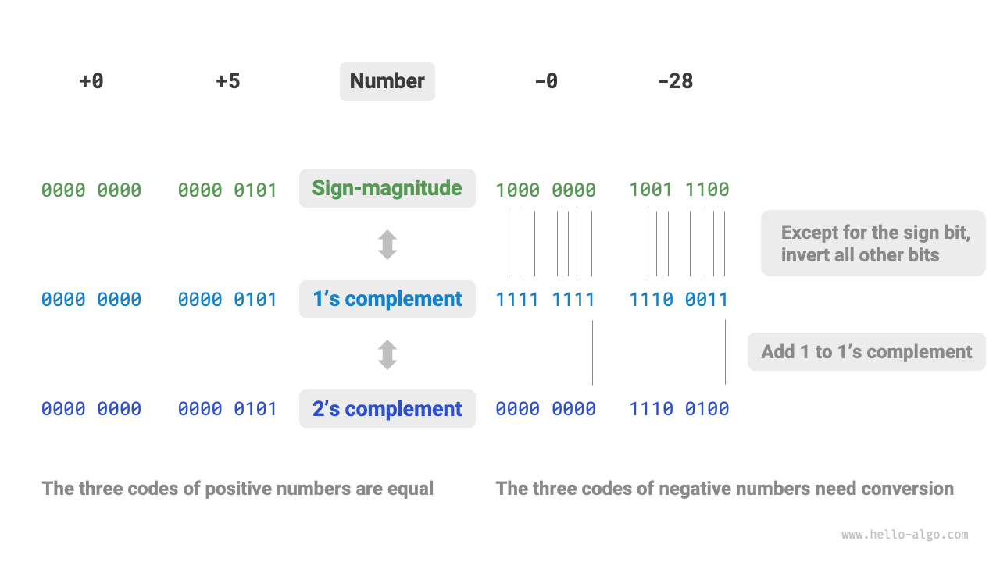

# Mã hóa số *

!!! tip

    Trong cuốn sách này, các chương được đánh dấu bằng dấu sao '*' là phần đọc thêm tùy chọn. Nếu bạn không có nhiều thời gian hoặc thấy khó hiểu, bạn có thể bỏ qua chúng lúc đầu và quay lại sau khi hoàn thành các chương quan trọng.

## Mã hóa số nguyên

Trong bảng ở phần trước, ta thấy rằng tất cả các kiểu số nguyên đều có thể biểu diễn nhiều số âm hơn số dương một đơn vị, ví dụ phạm vi của `byte` là $[-128, 127]$. Hiện tượng này có vẻ khó hiểu, và lý do đằng sau liên quan đến kiến thức về mã hóa dấu-giá trị, bù một, và bù hai.

Trước tiên, cần lưu ý rằng **các số được lưu trữ trong máy tính dưới dạng bù hai**. Trước khi phân tích lý do, hãy định nghĩa ba phương pháp mã hóa này:

- **Dấu-giá trị (Sign-magnitude)**: Bit cao nhất của số nhị phân là bit dấu, $0$ là số dương, $1$ là số âm. Các bit còn lại biểu diễn giá trị số.
- **Bù một (One's complement)**: Bù một của số dương giống dấu-giá trị. Với số âm, bù một là đảo tất cả các bit trừ bit dấu.
- **Bù hai (Two's complement)**: Bù hai của số dương giống dấu-giá trị. Với số âm, bù hai là lấy bù một rồi cộng thêm $1$.

Hình dưới minh họa cách chuyển đổi giữa dấu-giá trị, bù một và bù hai:

Mặc dù <u>dấu-giá trị</u> là trực quan nhất, nó có hạn chế. Ví dụ, **số âm ở dấu-giá trị không thể dùng trực tiếp để tính toán**. Chẳng hạn, trong dấu-giá trị, phép tính $1 + (-2)$ ra kết quả $-3$, là sai.

$$
\begin{aligned}
& 1 + (-2) \newline
& \rightarrow 0000 \; 0001 + 1000 \; 0010 \newline
& = 1000 \; 0011 \newline
& \rightarrow -3
\end{aligned}
$$

Để khắc phục, máy tính đưa ra <u>bù một</u>. Nếu chuyển sang bù một và tính $1 + (-2)$, rồi chuyển kết quả về dấu-giá trị, ta được kết quả đúng là $-1$.

$$
\begin{aligned}
& 1 + (-2) \newline
& \rightarrow 0000 \; 0001 \; \text{(Dấu-giá trị)} + 1000 \; 0010 \; \text{(Dấu-giá trị)} \newline
& = 0000 \; 0001 \; \text{(Bù một)} + 1111 \; 1101 \; \text{(Bù một)} \newline
& = 1111 \; 1110 \; \text{(Bù một)} \newline
& = 1000 \; 0001 \; \text{(Dấu-giá trị)} \newline
& \rightarrow -1
\end{aligned}
$$

Ngoài ra, **có hai cách biểu diễn số 0 trong dấu-giá trị**: $+0$ và $-0$. Điều này nghĩa là có hai mã nhị phân khác nhau cho số 0, dễ gây nhầm lẫn. Ví dụ, khi kiểm tra điều kiện, không phân biệt được 0 dương và 0 âm có thể dẫn đến kết quả sai. Để xử lý, cần kiểm tra bổ sung, làm giảm hiệu suất tính toán.

$$
\begin{aligned}
+0 & \rightarrow 0000 \; 0000 \newline
-0 & \rightarrow 1000 \; 0000
\end{aligned}
$$

Tương tự dấu-giá trị, bù một cũng gặp vấn đề 0 dương và 0 âm. Vì vậy, máy tính tiếp tục dùng <u>bù hai</u>. Hãy xem quá trình chuyển đổi số 0 âm trong dấu-giá trị, bù một và bù hai:

$$
\begin{aligned}
-0 \rightarrow \; & 1000 \; 0000 \; \text{(Dấu-giá trị)} \newline
= \; & 1111 \; 1111 \; \text{(Bù một)} \newline
= 1 \; & 0000 \; 0000 \; \text{(Bù hai)} \newline
\end{aligned}
$$

Khi cộng $1$ vào bù một của số 0 âm sẽ sinh ra số dư, nhưng với độ dài `byte` chỉ 8 bit, số dư ở bit thứ 9 bị loại bỏ. Vì vậy, **bù hai của số 0 âm là $0000 \; 0000$**, giống số 0 dương, giải quyết vấn đề nhầm lẫn.

Một điểm nữa là phạm vi $[-128, 127]$ của `byte`, có thêm số âm $-128$. Ta thấy với đoạn $[-127, +127]$, mọi số nguyên đều có dấu-giá trị, bù một và bù hai tương ứng, có thể chuyển đổi qua lại.

Tuy nhiên, **bù hai $1000 \; 0000$ là ngoại lệ, không có dấu-giá trị tương ứng**. Theo cách chuyển đổi, dấu-giá trị của nó sẽ là $0000 \; 0000$, tức là số 0. Điều này mâu thuẫn vì bù hai phải biểu diễn chính nó. Máy tính quy định bù hai đặc biệt $1000 \; 0000$ là $-128$. Thực tế, phép tính $(-1) + (-127)$ trong bù hai ra $-128$.

$$
\begin{aligned}
& (-127) + (-1) \newline
& \rightarrow 1111 \; 1111 \; \text{(Dấu-giá trị)} + 1000 \; 0001 \; \text{(Dấu-giá trị)} \newline
& = 1000 \; 0000 \; \text{(Bù một)} + 1111 \; 1110 \; \text{(Bù một)} \newline
& = 1000 \; 0001 \; \text{(Bù hai)} + 1111 \; 1111 \; \text{(Bù hai)} \newline
& = 1000 \; 0000 \; \text{(Bù hai)} \newline
& \rightarrow -128
\end{aligned}
$$

Bạn có thể nhận thấy, tất cả các phép tính trên đều là phép cộng, cho thấy một sự thật quan trọng: **các mạch phần cứng trong máy tính chủ yếu được thiết kế để thực hiện phép cộng**. Vì phép cộng dễ thực hiện hơn các phép khác như nhân, chia, trừ, giúp dễ song song hóa và tính toán nhanh hơn.

Lưu ý rằng điều này không có nghĩa máy tính chỉ cộng được. **Kết hợp phép cộng với các phép logic cơ bản, máy tính có thể thực hiện nhiều phép toán khác**. Ví dụ, phép trừ $a - b$ có thể chuyển thành $a + (-b)$; phép nhân, chia có thể chuyển thành nhiều phép cộng hoặc trừ.

Tóm lại, lý do máy tính dùng bù hai là: với bù hai, máy tính có thể dùng cùng một mạch và phép toán để xử lý cả số dương và số âm, không cần mạch đặc biệt cho phép trừ, đồng thời tránh nhầm lẫn 0 dương và 0 âm. Điều này đơn giản hóa thiết kế phần cứng và tăng hiệu suất tính toán.

Thiết kế bù hai rất thông minh, do giới hạn nội dung, chúng ta dừng lại ở đây. Nếu bạn quan tâm, hãy tìm hiểu thêm.

## Mã hóa số thực (floating-point)

Bạn có thể thấy điều thú vị: dù cùng độ dài 4 byte, tại sao `float` lại có phạm vi giá trị lớn hơn nhiều so với `int`? Điều này có vẻ lạ, vì ta nghĩ rằng phạm vi sẽ nhỏ hơn do phải biểu diễn số thập phân.

Thực ra, **điều này là do cách biểu diễn khác của số thực (`float`)**. Hãy xét một số nhị phân 32 bit:

$$
b_{31} b_{30} b_{29} \ldots b_2 b_1 b_0
$$

Theo chuẩn IEEE 754, một `float` 32 bit gồm ba phần:

- Bit dấu $\mathrm{S}$: 1 bit, là $b_{31}$.
- Bit số mũ $\mathrm{E}$: 8 bit, là $b_{30} b_{29} \ldots b_{23}$.
- Bit phần thập phân $\mathrm{N}$: 23 bit, là $b_{22} b_{21} \ldots b_0$.

Giá trị của một số `float` nhị phân được tính như sau:

$$
\text{val} = (-1)^{b_{31}} \times 2^{\left(b_{30} b_{29} \ldots b_{23}\right)_2 - 127} \times \left(1 . b_{22} b_{21} \ldots b_0\right)_2
$$

Chuyển sang công thức thập phân:

$$
\text{val} = (-1)^{\mathrm{S}} \times 2^{\mathrm{E} - 127} \times (1 + \mathrm{N})
$$

Phạm vi của từng thành phần:

$$
\begin{aligned}
\mathrm{S} \in & \{ 0, 1\}, \quad \mathrm{E} \in \{ 1, 2, \dots, 254 \} \newline
(1 + \mathrm{N}) = & (1 + \sum_{i=1}^{23} b_{23-i} \times 2^{-i}) \subset [1, 2 - 2^{-23}]
\end{aligned}
$$

Quan sát hình trên, với ví dụ $\mathrm{S} = 0$, $\mathrm{E} = 124$, $\mathrm{N} = 2^{-2} + 2^{-3} = 0.375$, ta có:

$$
\text{val} = (-1)^0 \times 2^{124 - 127} \times (1 + 0.375) = 0.171875
$$

Giờ ta có thể trả lời câu hỏi ban đầu: **Kiểu `float` có bit số mũ nên phạm vi lớn hơn nhiều so với `int`**. Theo cách tính trên, số dương lớn nhất kiểu `float` là khoảng $2^{254 - 127} \times (2 - 2^{-23}) \approx 3.4 \times 10^{38}$, số âm nhỏ nhất là đổi bit dấu.

**Tuy nhiên, đổi lại phạm vi lớn, `float` bị giảm độ chính xác**. Kiểu `int` dùng cả 32 bit để biểu diễn số, các giá trị cách đều nhau; còn `float` do có bit số mũ, giá trị càng lớn thì khoảng cách giữa hai số liền kề càng lớn.

Như bảng dưới, bit số mũ $\mathrm{E} = 0$ và $\mathrm{E} = 255$ có ý nghĩa đặc biệt, **dùng để biểu diễn số 0, vô cực, $\mathrm{NaN}$, v.v.**

 Bảng <id> &nbsp; Ý nghĩa của bit số mũ 

| Bit số mũ E        | Bit phần thập phân $\mathrm{N} = 0$ | Bit phần thập phân $\mathrm{N} \ne 0$ | Công thức tính                                                        |
| ------------------ | ----------------------------------- | ------------------------------------- | ---------------------------------------------------------------------- |
| $0$                | $\pm 0$                             | Số phụ (subnormal)                    | $(-1)^{\mathrm{S}} \times 2^{-126} \times (0.\mathrm{N})$              |
| $1, 2, \dots, 254$ | Số bình thường                      | Số bình thường                        | $(-1)^{\mathrm{S}} \times 2^{(\mathrm{E} -127)} \times (1.\mathrm{N})$ |
| $255$              | $\pm \infty$                        | $\mathrm{NaN}$                        |                                                                        |

Lưu ý rằng số phụ giúp tăng độ chính xác của số thực. Số dương nhỏ nhất kiểu bình thường là $2^{-126}$, số dương nhỏ nhất kiểu phụ là $2^{-126} \times 2^{-23}$.

Kiểu `double` (số thực độ chính xác kép) cũng dùng cách biểu diễn tương tự `float`, ở đây không trình bày chi tiết.
