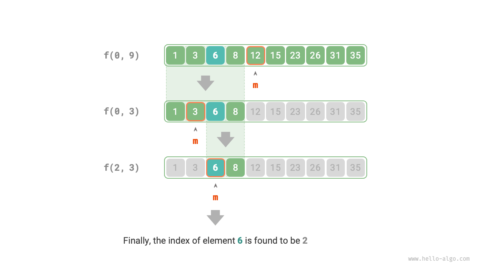

# Chiến lược tìm kiếm Chia để trị

Chúng ta đã biết rằng các thuật toán tìm kiếm được chia thành hai nhóm lớn.

- **Tìm kiếm vét cạn**: Triển khai bằng cách duyệt qua cấu trúc dữ liệu, với độ phức tạp thời gian là $O(n)$.
- **Tìm kiếm thích ứng**: Tận dụng cách tổ chức dữ liệu cụ thể hoặc thông tin có sẵn, với độ phức tạp thời gian đạt $O(\log n)$ hoặc thậm chí $O(1)$.

Trên thực tế, **các thuật toán tìm kiếm có độ phức tạp thời gian $O(\log n)$ thường được triển khai dựa trên chiến lược chia để trị**, chẳng hạn như tìm kiếm nhị phân và các loại cây.

- Mỗi bước của tìm kiếm nhị phân chia bài toán (tìm kiếm phần tử mục tiêu trong mảng) thành một bài toán nhỏ hơn (tìm kiếm phần tử mục tiêu trong một nửa mảng), tiếp tục cho đến khi mảng rỗng hoặc tìm thấy phần tử mục tiêu.
- Cây là đại diện tiêu biểu cho tư tưởng chia để trị. Trong các cấu trúc dữ liệu như cây tìm kiếm nhị phân, cây AVL và đống, độ phức tạp thời gian của các thao tác khác nhau là $O(\log n)$.

Chiến lược chia để trị của tìm kiếm nhị phân như sau.

- **Bài toán có thể phân rã**: Tìm kiếm nhị phân phân rã đệ quy bài toán ban đầu (tìm kiếm trong mảng) thành các bài toán con (tìm kiếm trong một nửa mảng), đạt được bằng cách so sánh phần tử ở giữa với phần tử mục tiêu.
- **Các bài toán con độc lập**: Trong tìm kiếm nhị phân, mỗi vòng chỉ xử lý một bài toán con, bài toán con này không bị ảnh hưởng bởi các bài toán con khác.
- **Lời giải của các bài toán con không cần hợp nhất**: Tìm kiếm nhị phân nhằm mục đích tìm kiếm một phần tử cụ thể, vì vậy không cần hợp nhất lời giải của các bài toán con. Khi một bài toán con được giải quyết, bài toán ban đầu cũng được giải quyết.

Chia để trị có thể cải thiện hiệu suất tìm kiếm vì tìm kiếm vét cạn chỉ có thể loại bỏ một lựa chọn mỗi vòng, **trong khi tìm kiếm chia để trị có thể loại bỏ một nửa số lựa chọn mỗi vòng**.

### Triển khai Tìm kiếm nhị phân dựa trên Chia để trị

Trong các phần trước, tìm kiếm nhị phân được triển khai dựa trên phép lặp (vòng lặp). Bây giờ chúng ta triển khai nó dựa trên chia để trị (đệ quy).

!!! question

    Cho một mảng đã sắp xếp `nums` có độ dài $n$, trong đó tất cả các phần tử là duy nhất, hãy tìm `target`.

Từ góc độ chia để trị, chúng ta ký hiệu bài toán con tương ứng với khoảng tìm kiếm $[i, j]$ là $f(i, j)$.

Bắt đầu từ bài toán ban đầu $f(0, n-1)$, thực hiện tìm kiếm nhị phân thông qua các bước sau.

1. Tính điểm trung tâm $m$ của khoảng tìm kiếm $[i, j]$, và sử dụng nó để loại bỏ một nửa khoảng tìm kiếm.
2. Giải đệ quy bài toán con đã giảm một nửa kích thước, có thể là $f(i, m-1)$ hoặc $f(m+1, j)$.
3. Lặp lại các bước `1.` và `2.` cho đến khi tìm thấy `target`, hoặc trả về kết quả khi khoảng tìm kiếm rỗng.

Hình bên dưới hiển thị quá trình chia để trị của tìm kiếm nhị phân cho phần tử $6$ trong một mảng.



Trong mã nguồn triển khai, chúng ta khai báo một hàm đệ quy `dfs()` để giải bài toán $f(i, j)$:

```src
[file]{binary_search_recur}-[class]{}-[func]{binary_search}
```
