# Bài toán Dựng cây nhị phân

!!! question

    Cho thứ tự duyệt tiền thứ (preorder traversal) `preorder` và thứ tự duyệt trung thứ (inorder traversal) `inorder` của một cây nhị phân, hãy dựng lại cây nhị phân đó và trả về nút gốc của cây. Giả định rằng không có giá trị nút nào bị trùng lặp trong cây nhị phân (như hiển thị trong hình bên dưới).

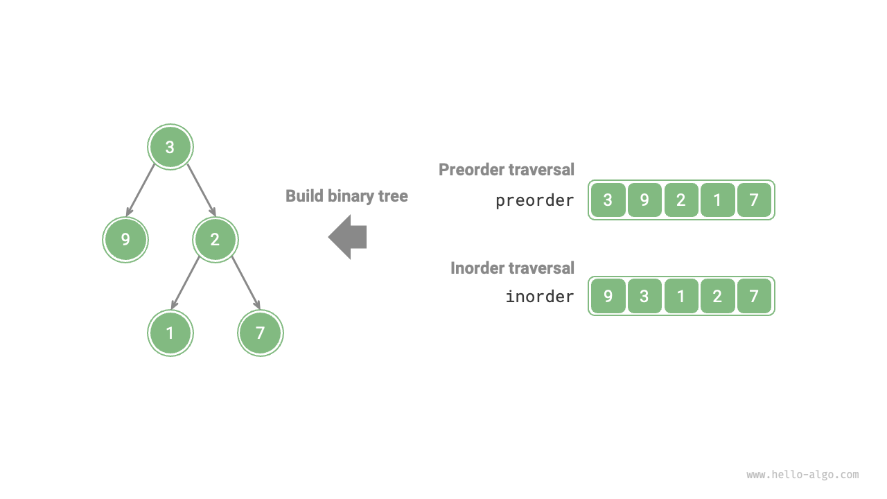

### Xác định xem đó có phải là Bài toán Chia để trị

Bài toán ban đầu được xác định là dựng một cây nhị phân từ `preorder` và `inorder`, đây là một bài toán chia để trị điển hình.

- **Bài toán có thể phân rã**: Từ góc độ chia để trị, chúng ta có thể chia bài toán ban đầu thành hai bài toán con: dựng cây con trái và dựng cây con phải, cộng thêm một thao tác: khởi tạo nút gốc. Đối với mỗi cây con (bài toán con), chúng ta vẫn có thể tái sử dụng phương pháp phân chia trên, chia nó thành các cây con nhỏ hơn (bài toán con) cho đến khi đạt được bài toán con nhỏ nhất (cây con rỗng).
- **Các bài toán con độc lập**: Cây con trái và cây con phải độc lập với nhau; không có sự chồng chéo giữa chúng. Khi dựng cây con trái, chúng ta chỉ cần tập trung vào các phần của thứ tự duyệt trung thứ và tiền thứ tương ứng với cây con trái. Điều tương tự cũng áp dụng cho cây con phải.
- **Lời giải của các bài toán con có thể hợp nhất**: Khi đã có cây con trái và cây con phải (lời giải của các bài toán con), chúng ta có thể liên kết chúng với nút gốc để thu được lời giải cho bài toán ban đầu.

### Cách phân chia các Cây con

Dựa trên phân tích trên, bài toán này có thể giải bằng chia để trị, **nhưng làm thế nào để phân chia các cây con trái và phải thông qua thứ tự duyệt tiền thứ `preorder` và trung thứ `inorder`**?

Theo định nghĩa, cả `preorder` và `inorder` đều có thể được chia thành ba phần.

- Thứ tự duyệt tiền thứ: `[ Nút gốc | Cây con trái | Cây con phải ]`, ví dụ, cây trong hình trên tương ứng với `[ 3 | 9 | 2 1 7 ]`.
- Thứ tự duyệt trung thứ: `[ Cây con trái | Nút gốc ｜ Cây con phải ]`, ví dụ, cây trong hình trên tương ứng với `[ 9 | 3 | 1 2 7 ]`.

Sử dụng dữ liệu từ hình trên làm ví dụ, chúng ta có thể thu được kết quả phân chia thông qua các bước được hiển thị trong hình bên dưới.

1. Phần tử đầu tiên 3 trong thứ tự duyệt tiền thứ là giá trị của nút gốc.
2. Tìm chỉ số của nút gốc 3 trong `inorder`, và sử dụng chỉ số này để chia `inorder` thành `[ 9 | 3 ｜ 1 2 7 ]`.
3. Dựa trên kết quả phân chia của `inorder`, dễ dàng xác định rằng cây con trái và phải lần lượt có 1 và 3 nút, cho phép chúng ta chia `preorder` thành `[ 3 | 9 | 2 1 7 ]`.

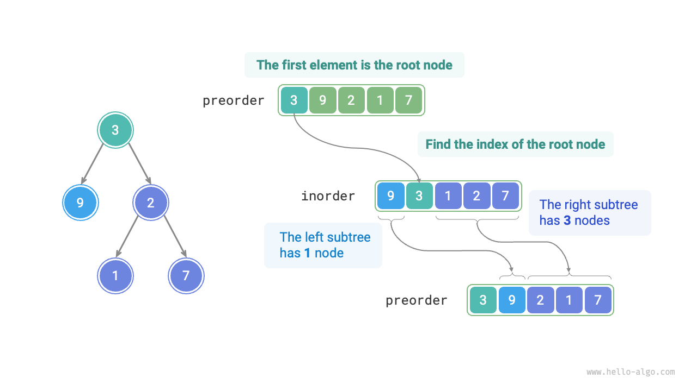

### Mô tả các khoảng Cây con dựa trên các Biến

Dựa trên phương pháp phân chia ở trên, **chúng ta đã thu được các khoảng chỉ số của nút gốc, cây con trái và cây con phải trong `preorder` và `inorder`**. Để mô tả các khoảng chỉ số này, chúng ta cần sử dụng một số biến chỉ số.

- Ký hiệu chỉ số của nút gốc của cây hiện tại trong `preorder` là $i$.
- Ký hiệu chỉ số của nút gốc của cây hiện tại trong `inorder` là $m$.
- Ký hiệu khoảng chỉ số của cây hiện tại trong `inorder` là $[l, r]$.

Như hiển thị trong bảng dưới đây, thông qua các biến này chúng ta có thể biểu diễn chỉ số của nút gốc trong `preorder` và các khoảng chỉ số của các cây con trong `inorder`.

<p align="center"> Bảng <id> &nbsp; Chỉ số của nút gốc và các cây con trong thứ tự duyệt tiền thứ và trung thứ </p>

| ------------ | Chỉ số nút gốc trong `preorder` | Khoảng chỉ số cây con trong `inorder` |
| ------------ | ------------------------------- | ------------------------------------- |
| Cây hiện tại | $i$                             | $[l, r]$                              |
| Cây con trái | $i + 1$                         | $[l, m-1]$                            |
| Cây con phải | $i + 1 + (m - l)$               | $[m+1, r]$                            |

Xin lưu ý rằng $(m-l)$ trong chỉ số nút gốc của cây con phải có nghĩa là "số lượng nút trong cây con trái". Bạn nên hiểu điều này kết hợp với hình bên dưới.

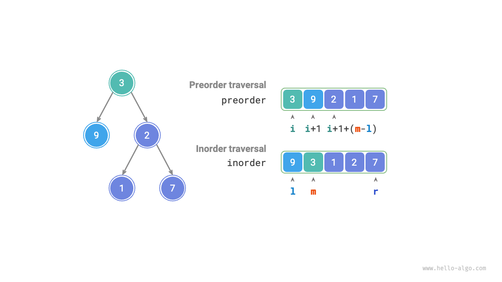

### Triển khai Mã nguồn

Để cải thiện hiệu suất truy vấn $m$, chúng ta sử dụng một bảng băm `hmap` để lưu trữ ánh xạ từ các phần tử trong mảng `inorder` đến chỉ số của chúng:

```src
[file]{build_tree}-[class]{}-[func]{build_tree}
```

Hình bên dưới hiển thị quá trình đệ quy để dựng cây nhị phân. Mỗi nút được thiết lập trong quá trình "đệ quy" đi xuống, trong khi mỗi cạnh (tham chiếu) được thiết lập trong quá trình "trả về" đi lên.

=== "<1>"
    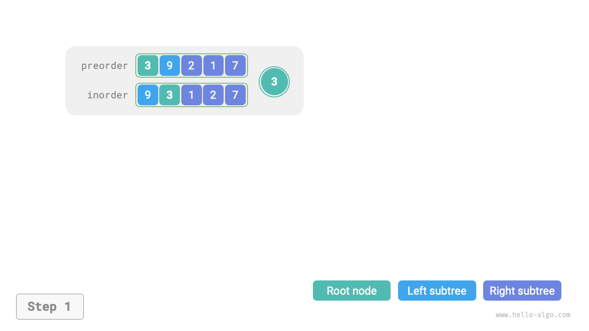

=== "<2>"
    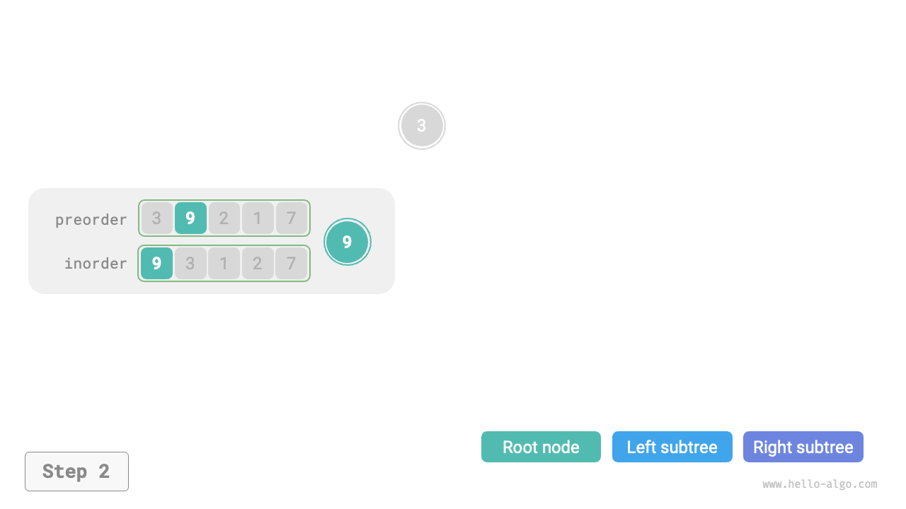

=== "<3>"
    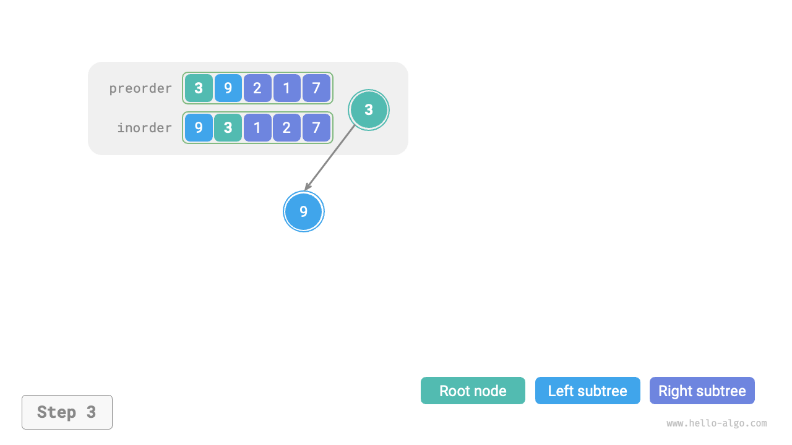

=== "<4>"
    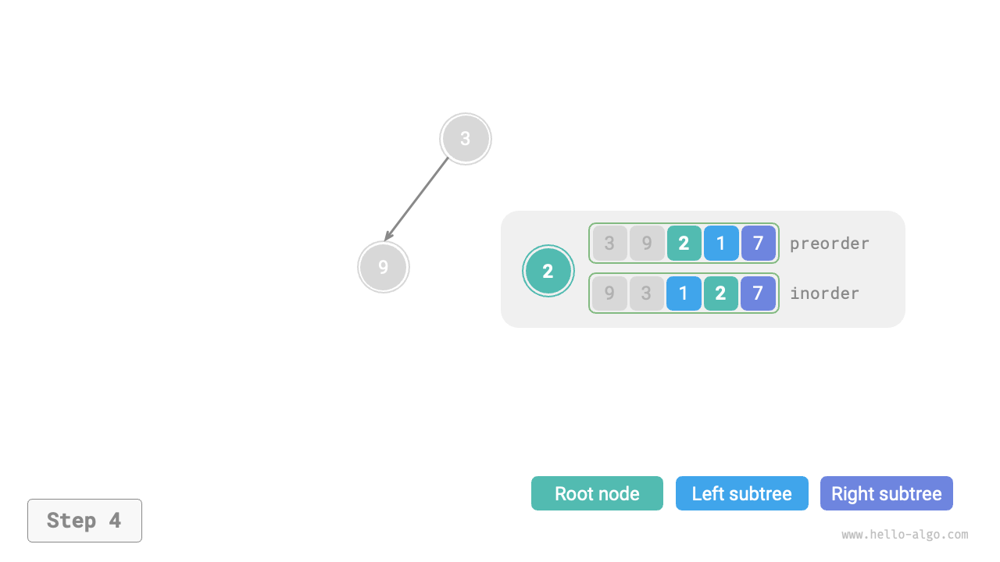

=== "<5>"
    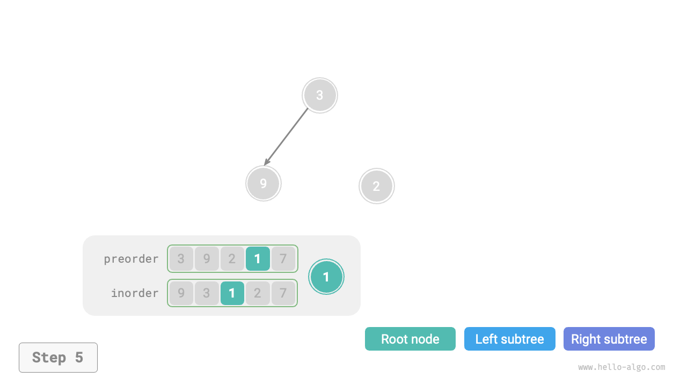

=== "<6>"
    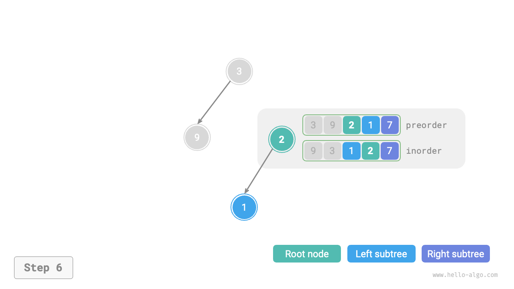

=== "<7>"
    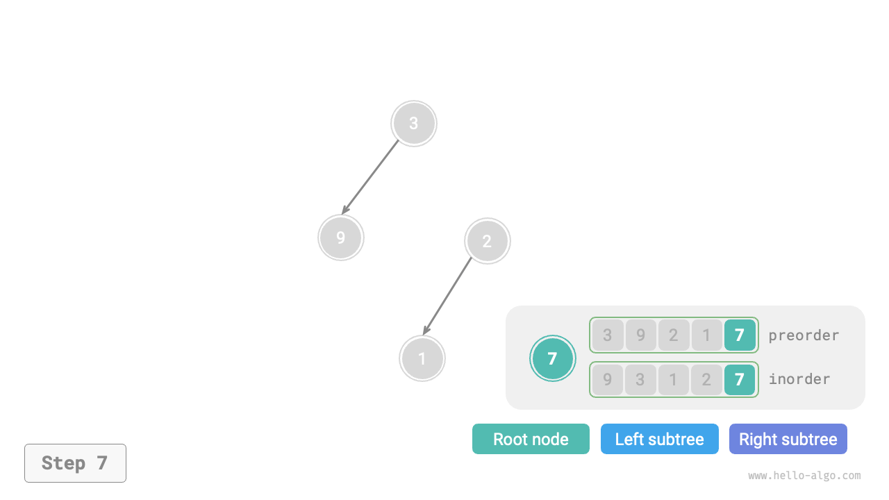

=== "<8>"
    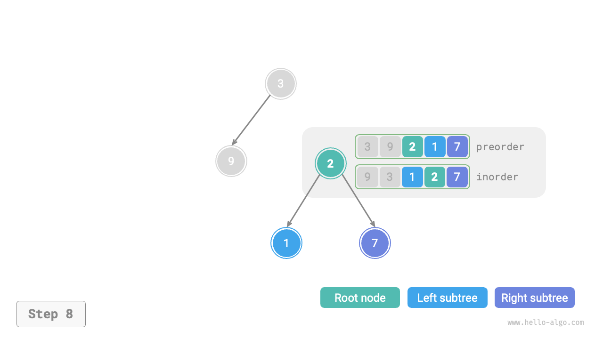

=== "<9>"
    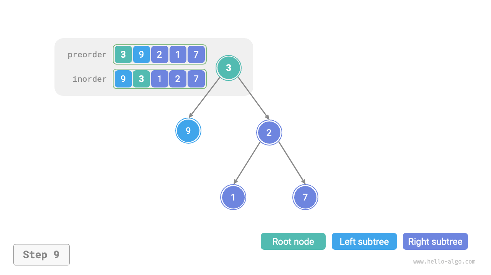

Kết quả phân chia của thứ tự duyệt tiền thứ `preorder` và trung thứ `inorder` bên trong mỗi hàm đệ quy được hiển thị trong hình bên dưới.

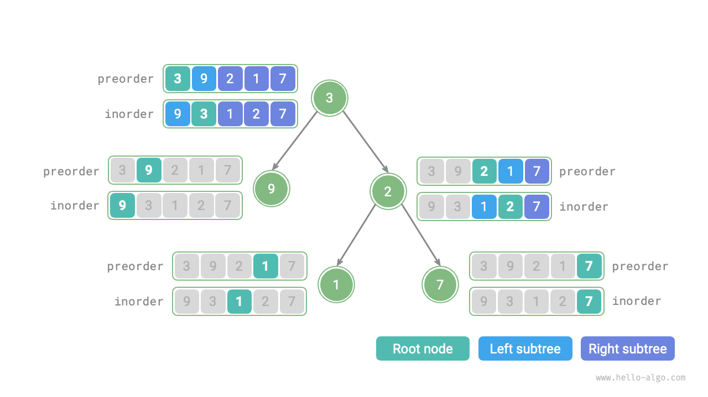

Giả sử số lượng nút trong cây là $n$. Việc khởi tạo mỗi nút (thực thi một hàm đệ quy `dfs()`) tốn thời gian $O(1)$. **Do đó, độ phức tạp thời gian tổng thể là $O(n)$**.

Bảng băm lưu trữ ánh xạ từ các phần tử `inorder` đến chỉ số của chúng, với độ phức tạp không gian là $O(n)$. Trong trường hợp xấu nhất, khi cây nhị phân suy biến thành một danh sách liên kết, độ sâu đệ quy đạt $n$, sử dụng không gian khung ngữ cảnh (stack frame) $O(n)$. **Do đó, độ phức tạp không gian tổng thể là $O(n)$**.
