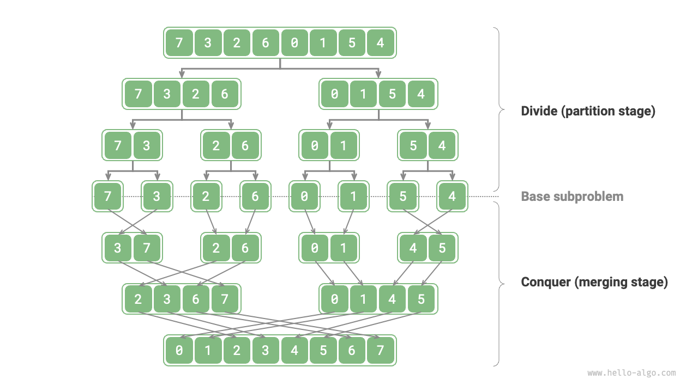
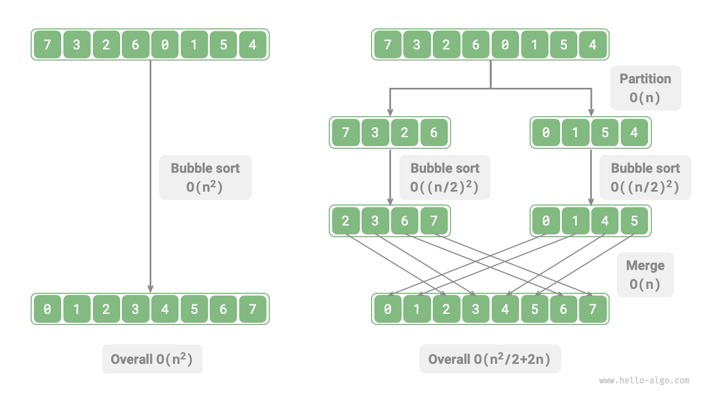
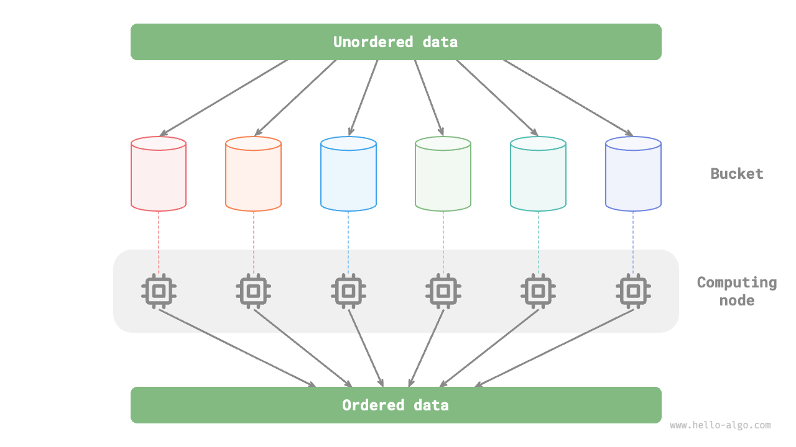

# Thuật toán Chia để trị

<u>Chia để trị</u> (Divide and conquer) là một chiến lược thuật toán rất quan trọng và phổ biến. Chia để trị thường được triển khai dựa trên đệ quy, bao gồm hai bước: "chia" (divide) và "trị" (conquer/merge).

1. **Chia (giai đoạn phân chia)**: Chia nhỏ bài toán ban đầu một cách đệ quy thành hai hoặc nhiều bài toán con tương tự cho đến khi đạt được bài toán con nhỏ nhất.
2. **Trị (giai đoạn hợp nhất)**: Bắt đầu từ các bài toán con nhỏ nhất đã biết lời giải, hợp nhất lời giải của các bài toán con từ dưới lên trên để xây dựng lời giải cho bài toán ban đầu.

Như được hiển thị trong hình bên dưới, "sắp xếp trộn" (merge sort) là một trong những ứng dụng điển hình của chiến lược chia để trị.

1. **Chia**: Chia nhỏ mảng ban đầu (bài toán ban đầu) một cách đệ quy thành hai mảng con (bài toán con) cho đến khi mảng con chỉ còn một phần tử (bài toán con nhỏ nhất).
2. **Trị**: Hợp nhất các mảng con đã sắp xếp (lời giải của các bài toán con) từ dưới lên trên để thu được mảng ban đầu đã sắp xếp (lời giải của bài toán ban đầu).

## Cách xác định bài toán Chia để trị

Liệu một bài toán có phù hợp để giải bằng chia để trị hay không thường có thể được xác định dựa trên các tiêu chí sau.

1. **Bài toán có thể phân rã**: Bài toán ban đầu có thể được chia thành các bài toán con nhỏ hơn, tương tự và có thể được chia đệ quy theo cùng một cách.
2. **Các bài toán con độc lập**: Không có sự chồng chéo giữa các bài toán con, chúng độc lập với nhau và có thể được giải quyết một cách độc lập.
3. **Lời giải của các bài toán con có thể hợp nhất**: Lời giải cho bài toán ban đầu thu được bằng cách hợp nhất lời giải của các bài toán con.

Rõ ràng, sắp xếp trộn thỏa mãn ba tiêu chí này.

1. **Bài toán có thể phân rã**: Chia đệ quy mảng (bài toán ban đầu) thành hai mảng con (bài toán con).
2. **Các bài toán con độc lập**: Mỗi mảng con có thể được sắp xếp độc lập (các bài toán con có thể được giải độc lập).
3. **Lời giải của các bài toán con có thể hợp nhất**: Hai mảng con đã sắp xếp (lời giải của các bài toán con) có thể được hợp nhất thành một mảng đã sắp xếp (lời giải của bài toán ban đầu).

## Cải thiện hiệu suất thông qua Chia để trị

**Chia để trị không chỉ giải quyết hiệu quả các bài toán thuật toán mà còn thường xuyên cải thiện hiệu suất thuật toán**. Trong các thuật toán sắp xếp, sắp xếp nhanh (quick sort), sắp xếp trộn (merge sort) và sắp xếp vun đống (heap sort) nhanh hơn sắp xếp chọn, nổi bọt và chèn vì chúng áp dụng chiến lược chia để trị.

Điều này đặt ra câu hỏi: **Tại sao chia để trị lại có thể cải thiện hiệu suất thuật toán, và logic đằng sau nó là gì**? Nói cách khác, tại sao việc chia một bài toán lớn thành nhiều bài toán con, giải các bài toán con và hợp nhất lời giải của chúng lại hiệu quả hơn là trực tiếp giải bài toán ban đầu? Câu hỏi này có thể được thảo luận từ hai khía cạnh: số lượng phép tính và tính toán song song.

### Tối ưu hóa số lượng phép tính

Lấy "sắp xếp nổi bọt" làm ví dụ, việc xử lý một mảng có độ dài $n$ cần thời gian $O(n^2)$. Giả sử chúng ta chia mảng tại điểm trung tâm thành hai mảng con, như hiển thị trong hình bên dưới. Phép chia cần thời gian $O(n)$, sắp xếp mỗi mảng con cần thời gian $O((n / 2)^2)$, và hợp nhất hai mảng con cần thời gian $O(n)$, dẫn đến độ phức tạp thời gian tổng thể là:

$$
O(n + (\frac{n}{2})^2 \times 2 + n) = O(\frac{n^2}{2} + 2n)
$$

Tiếp theo, chúng ta tính bất đẳng thức sau, trong đó vế trái và vế phải lần lượt đại diện cho tổng số phép tính trước và sau khi chia:

$$
\begin{aligned}
n^2 & > \frac{n^2}{2} + 2n \newline
n^2 - \frac{n^2}{2} - 2n & > 0 \newline
n(n - 4) & > 0
\end{aligned}
$$

**Điều này có nghĩa là khi $n > 4$, số lượng phép tính sau khi chia sẽ nhỏ hơn, và hiệu suất sắp xếp sẽ cao hơn**. Lưu ý rằng độ phức tạp thời gian sau khi chia vẫn là bậc hai $O(n^2)$, nhưng hệ số hằng số trong độ phức tạp đã trở nên nhỏ hơn.

Đi xa hơn nữa, **điều gì sẽ xảy ra nếu chúng ta liên tục chia các mảng con từ điểm trung tâm của chúng thành hai mảng con** cho đến khi các mảng con chỉ còn một phần tử? Cách tiếp cận này thực chất là "sắp xếp trộn", với độ phức tạp thời gian là $O(n \log n)$.

Mở rộng tư duy, **điều gì sẽ xảy ra nếu chúng ta thiết lập nhiều điểm chia** và chia đều mảng ban đầu thành $k$ mảng con? Tình huống này rất giống với "sắp xếp theo xô" (bucket sort), vốn rất phù hợp để sắp xếp lượng dữ liệu khổng lồ, với độ phức tạp thời gian lý thuyết là $O(n + k)$.

### Tối ưu hóa tính toán song song

Chúng ta biết rằng các bài toán con được tạo ra bởi chia để trị độc lập với nhau, **vì vậy chúng thường có thể được giải quyết song song**. Điều này có nghĩa là chia để trị không chỉ có thể giảm độ phức tạp thời gian của thuật toán, **mà còn thuận lợi cho việc tối ưu hóa song song bởi hệ điều hành**.

Tối ưu hóa song song đặc biệt hiệu quả trong môi trường đa nhân hoặc đa xử lý, vì hệ thống có thể xử lý đồng thời nhiều bài toán con, tận dụng tối đa tài nguyên tính toán và giảm đáng kể tổng thời gian thực thi.

Ví dụ, trong "sắp xếp theo xô" được hiển thị trong hình bên dưới, chúng ta phân phối đều dữ liệu khổng lồ vào các xô khác nhau, và các tác vụ sắp xếp cho tất cả các xô có thể được phân phối đến các đơn vị tính toán khác nhau. Sau khi hoàn thành, kết quả được hợp nhất lại.

## Các ứng dụng phổ biến của Chia để trị

Một mặt, chia để trị có thể được sử dụng để giải quyết nhiều bài toán thuật toán kinh điển.

- **Tìm cặp điểm gần nhất**: Thuật toán này trước tiên chia tập hợp điểm thành hai phần, sau đó tìm cặp điểm gần nhất trong mỗi phần riêng biệt, và cuối cùng tìm cặp điểm gần nhất trải dài qua cả hai phần.
- **Nhân số nguyên lớn**: Ví dụ: thuật toán Karatsuba, phân rã phép nhân số nguyên lớn thành một số phép nhân và phép cộng số nguyên nhỏ hơn.
- **Phép nhân ma trận**: Ví dụ: thuật toán Strassen, phân rã phép nhân ma trận lớn thành nhiều phép nhân và phép cộng ma trận nhỏ.
- **Bài toán tháp Hà Nội (Hanota)**: Bài toán tháp Hà Nội có thể được giải thông qua đệ quy, đây là một ứng dụng điển hình của chiến lược chia để trị.
- **Giải bài toán cặp nghịch thế**: Trong một dãy số, nếu một số đứng trước lớn hơn một số đứng sau, hai số này tạo thành một cặp nghịch thế. Việc giải bài toán cặp nghịch thế có thể tận dụng cách tiếp cận chia để trị với sự hỗ trợ của sắp xếp trộn.

Mặt khác, chia để trị được ứng dụng rộng rãi trong thiết kế thuật toán và cấu trúc dữ liệu.

- **Tìm kiếm nhị phân**: Tìm kiếm nhị phân chia mảng đã sắp xếp thành hai phần từ chỉ số trung tâm, sau đó quyết định loại bỏ nửa nào dựa trên kết quả so sánh giữa giá trị mục tiêu và giá trị phần tử ở giữa, rồi thực hiện bước tìm kiếm nhị phân tương tự trên khoảng còn lại.
- **Sắp xếp trộn**: Đã giới thiệu ở đầu phần này, không cần giải thích thêm.
- **Sắp xếp nhanh**: Sắp xếp nhanh chọn một giá trị chốt (pivot), sau đó chia mảng thành hai mảng con, một mảng chứa các phần tử nhỏ hơn chốt và mảng còn lại chứa các phần tử lớn hơn chốt, sau đó thực hiện thao tác chia tương tự trên hai phần này cho đến khi các mảng con chỉ còn một phần tử.
- **Sắp xếp theo xô**: Ý tưởng cơ bản của sắp xếp theo xô là phân tán dữ liệu vào nhiều xô, sau đó sắp xếp các phần tử trong từng xô, và cuối cùng trích xuất các phần tử từ mỗi xô theo thứ tự để thu được mảng đã sắp xếp.
- **Cây**: Ví dụ: cây tìm kiếm nhị phân, cây AVL, cây đỏ-đen, cây B, cây B+, v.v. Các thao tác tìm kiếm, chèn và xóa của chúng đều có thể xem là ứng dụng của chiến lược chia để trị.
- **Đống**: Đống là một cây nhị phân đầy đủ đặc biệt, và các thao tác khác nhau của nó như chèn, xóa và vun đống thực chất đều hàm chứa tư tưởng chia để trị.
- **Bảng băm**: Mặc dù bảng băm không trực tiếp áp dụng chia để trị, một số phương pháp xử lý va chạm băm gián tiếp áp dụng chiến lược chia để trị. Ví dụ, các danh sách liên kết dài trong phương pháp xích liên kết có thể được chuyển đổi thành cây đỏ-đen để cải thiện hiệu suất tìm kiếm.

Có thể thấy rằng **chia để trị là một tư tưởng thuật toán "âm thầm hiện diện khắp nơi"**, được lồng ghép vào nhiều thuật toán và cấu trúc dữ liệu khác nhau.
