# Bài toán Tháp Hà Nội (Hanota)

Trong sắp xếp trộn và dựng cây nhị phân, chúng ta phân rã bài toán ban đầu thành hai bài toán con, mỗi bài toán con có kích thước bằng một nửa bài toán ban đầu. Tuy nhiên, đối với bài toán tháp Hà Nội (Hanota), chúng ta áp dụng một chiến lược phân rã khác.

!!! question

    Cho ba cọc, ký hiệu là `A`, `B`, và `C`. Ban đầu, cọc `A` có $n$ đĩa được xếp chồng lên nhau, sắp xếp từ trên xuống dưới theo thứ tự kích thước tăng dần. Nhiệm vụ của chúng ta là chuyển $n$ đĩa này sang cọc `C` trong khi vẫn giữ nguyên thứ tự ban đầu của chúng (như hiển thị trong hình bên dưới). Các quy tắc sau phải được tuân thủ khi di chuyển các đĩa.

    1. Mỗi lần chỉ có thể lấy một đĩa từ trên cùng của một cọc và đặt lên trên cùng của một cọc khác.
    2. Chỉ được di chuyển một đĩa tại một thời điểm.
    3. Đĩa nhỏ hơn phải luôn nằm trên đĩa lớn hơn.

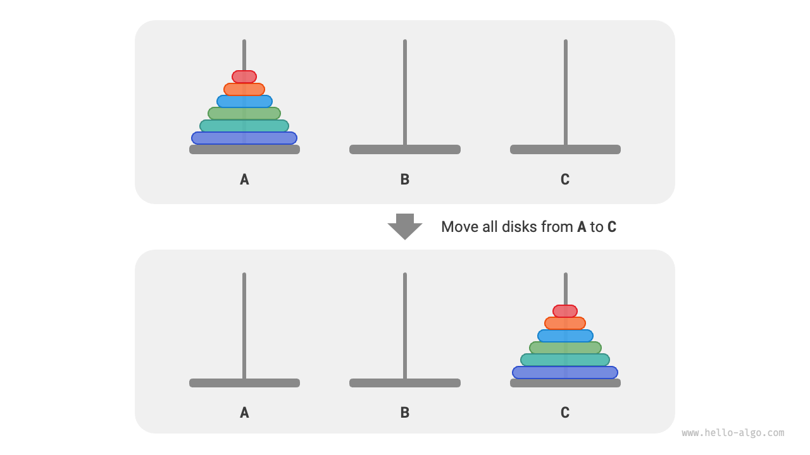

**Chúng ta ký hiệu bài toán tháp Hà Nội có kích thước $i$ là $f(i)$**. Ví dụ, $f(3)$ đại diện cho việc di chuyển $3$ đĩa từ `A` sang `C`.

### Xem xét các Trường hợp cơ sở

Như hiển thị trong hình bên dưới, đối với bài toán $f(1)$, khi chỉ có một đĩa, chúng ta có thể di chuyển trực tiếp từ `A` sang `C`.

=== "<1>"
    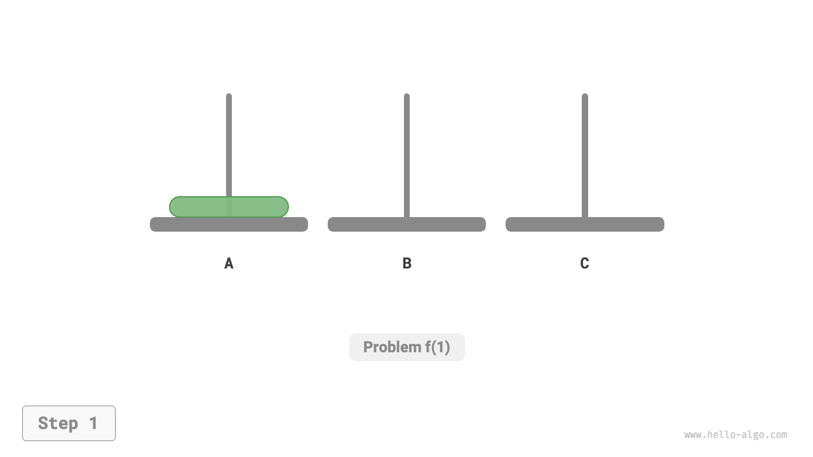

=== "<2>"
    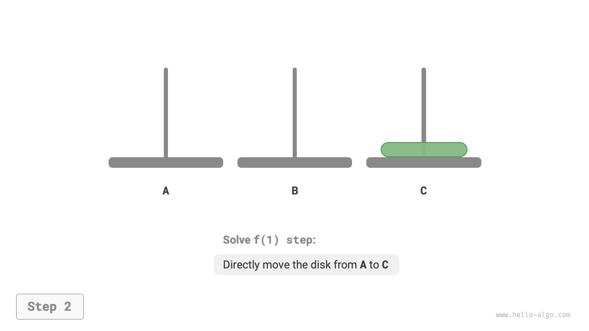

Như hiển thị trong hình bên dưới, đối với bài toán $f(2)$, khi có hai đĩa, **vì chúng ta phải luôn giữ đĩa nhỏ hơn ở trên đĩa lớn hơn, chúng ta cần sử dụng `B` để hỗ trợ việc di chuyển**.

1. Đầu tiên, di chuyển đĩa nhỏ hơn từ `A` sang `B`.
2. Sau đó di chuyển đĩa lớn hơn từ `A` sang `C`.
3. Cuối cùng, di chuyển đĩa nhỏ hơn từ `B` sang `C`.

=== "<1>"
    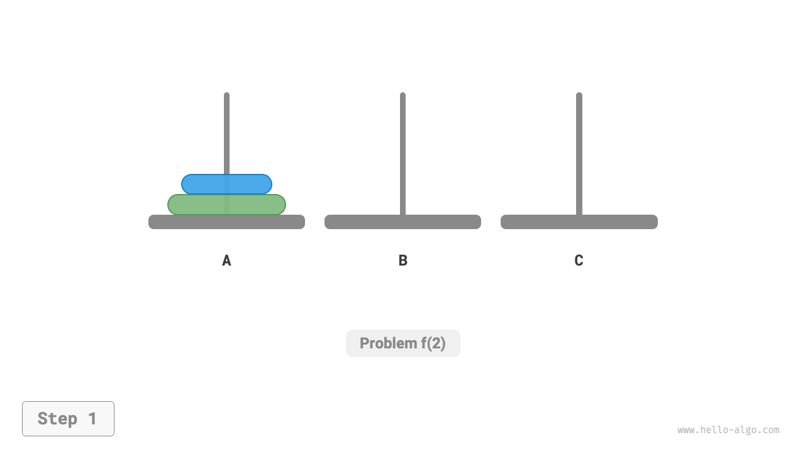

=== "<2>"
    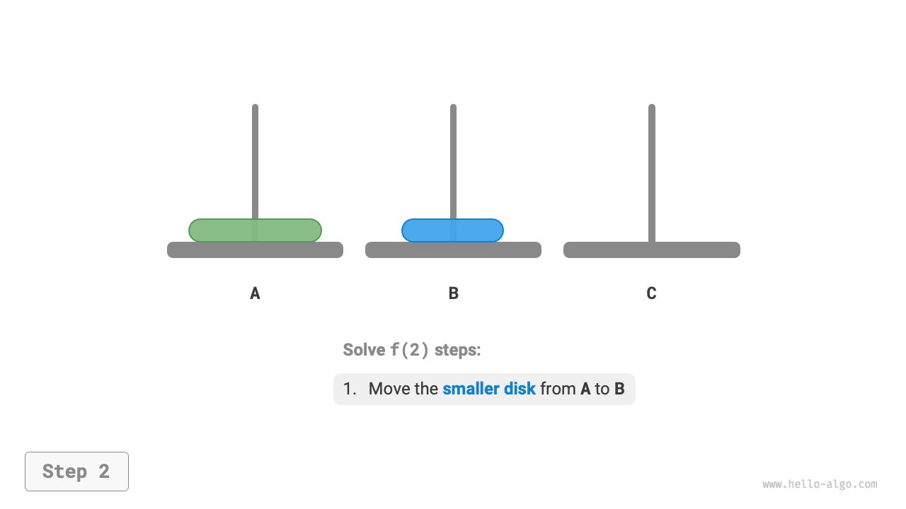

=== "<3>"
    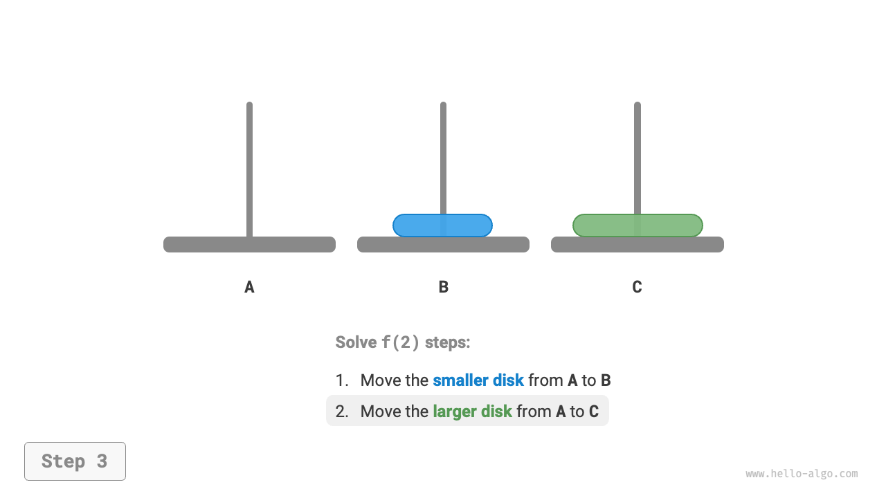

=== "<4>"
    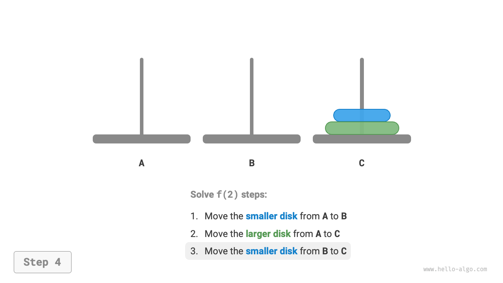

Quá trình giải bài toán $f(2)$ có thể tóm tắt là: **di chuyển hai đĩa từ `A` sang `C` với sự trợ giúp của `B`**. Ở đây, `C` được gọi là cọc mục tiêu, và `B` được gọi là cọc đệm (trung gian).

### Phân rã Bài toán con

Đối với bài toán $f(3)$, khi có ba đĩa, tình hình trở nên phức tạp hơn một chút.

Vì chúng ta đã biết lời giải cho $f(1)$ và $f(2)$, chúng ta có thể tư duy từ góc độ chia để trị, **coi hai đĩa trên cùng trên cọc `A` như một khối thống nhất**, và thực hiện các bước như hiển thị trong hình bên dưới. Thao tác này di chuyển thành công ba đĩa từ `A` sang `C`.

1. Chọn `B` làm cọc mục tiêu và `C` làm cọc đệm, di chuyển hai đĩa từ `A` sang `B`.
2. Di chuyển đĩa còn lại từ `A` trực tiếp sang `C`.
3. Chọn `C` làm cọc mục tiêu và `A` làm cọc đệm, di chuyển hai đĩa từ `B` sang `C`.

=== "<1>"
    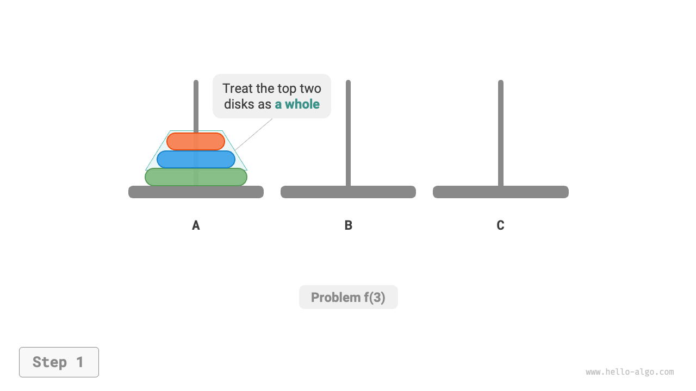

=== "<2>"
    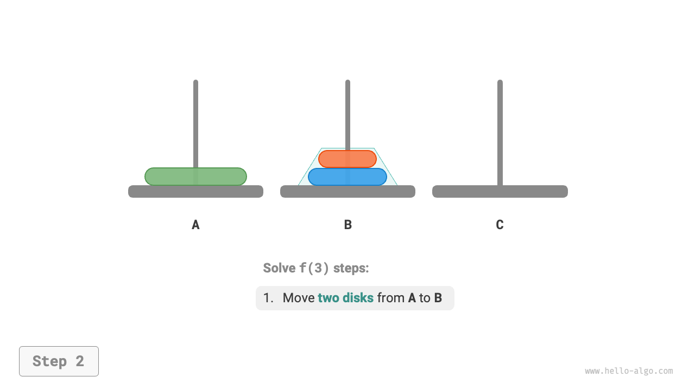

=== "<3>"
    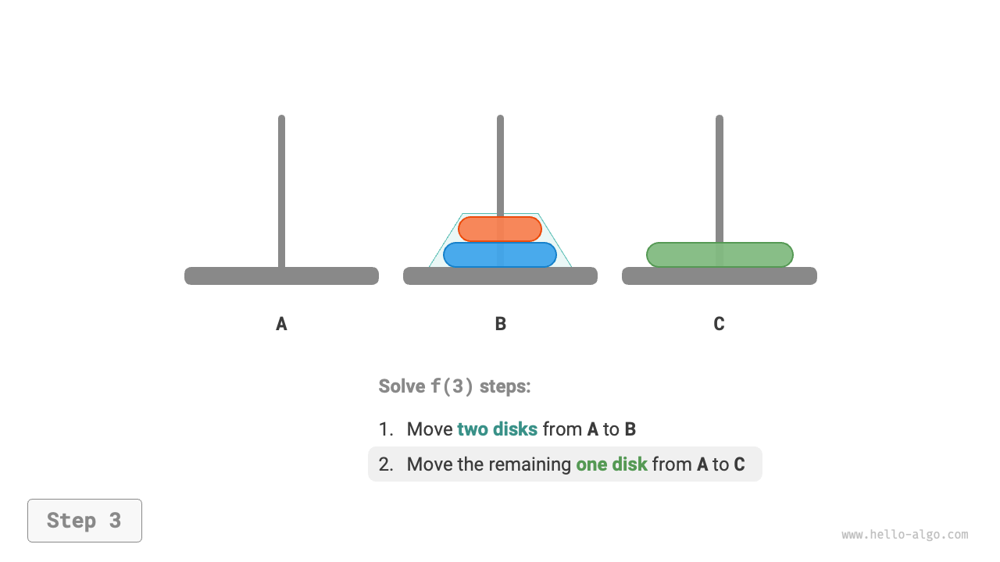

=== "<4>"
    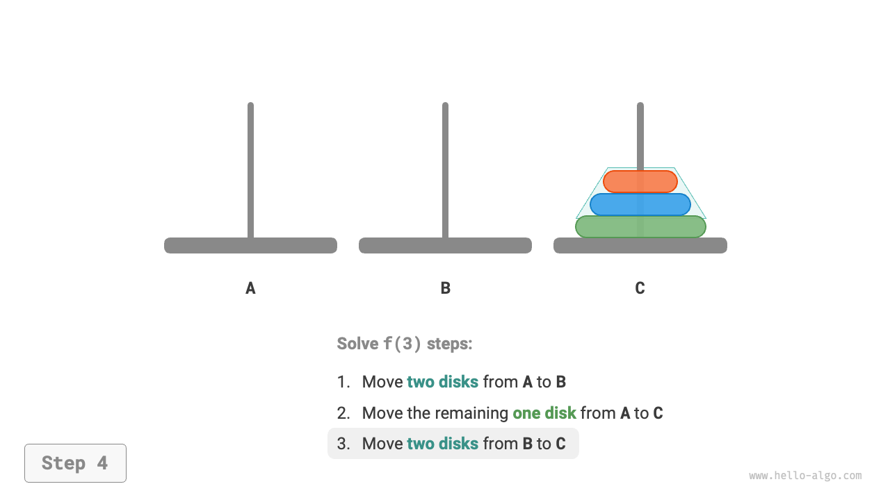

Về bản chất, **chúng ta chia bài toán $f(3)$ thành hai bài toán con $f(2)$ và một bài toán con $f(1)$**. Bằng cách giải ba bài toán con này theo thứ tự, bài toán ban đầu được giải quyết. Điều này cho thấy các bài toán con độc lập với nhau và lời giải của chúng có thể hợp nhất.

Từ đây, chúng ta có thể tóm tắt chiến lược chia để trị giải bài toán tháp Hà Nội hiển thị trong hình bên dưới: chia bài toán ban đầu $f(n)$ thành hai bài toán con $f(n-1)$ và một bài toán con $f(1)$, và giải ba bài toán con này theo thứ tự sau.

1. Di chuyển $n-1$ đĩa từ `A` sang `B` với sự hỗ trợ của `C`.
2. Di chuyển $1$ đĩa còn lại trực tiếp từ `A` sang `C`.
3. Di chuyển $n-1$ đĩa từ `B` sang `C` với sự hỗ trợ của `A`.

Đối với hai bài toán con $f(n-1)$ này, **chúng ta có thể chia đệ quy chúng theo cùng một cách** cho đến khi đạt được bài toán con nhỏ nhất $f(1)$. Lời giải cho $f(1)$ đã biết và chỉ cần một thao tác di chuyển.

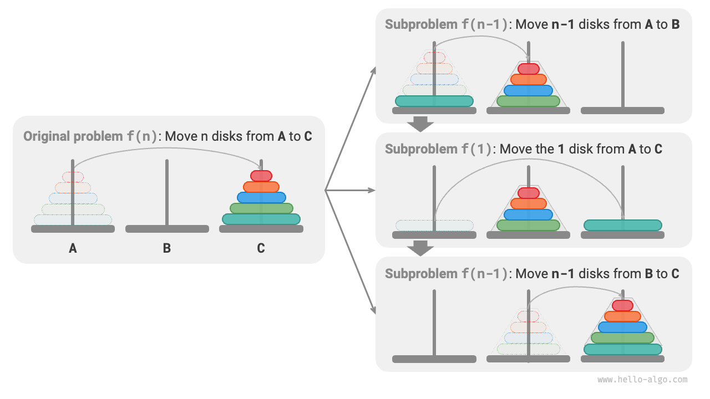

### Triển khai Mã nguồn

Trong mã nguồn, chúng ta khai báo một hàm đệ quy `dfs(i, src, buf, tar)`, có mục đích là di chuyển $i$ đĩa trên cùng từ cọc nguồn `src` sang cọc mục tiêu `tar` với sự hỗ trợ của cọc đệm `buf`:

```src
[file]{hanota}-[class]{}-[func]{solve_hanota}
```

Như hiển thị trong hình bên dưới, bài toán tháp Hà Nội tạo thành một cây đệ quy có chiều cao $n$, trong đó mỗi nút đại diện cho một bài toán con tương ứng với một lần gọi hàm `dfs()`, **do đó độ phức tạp thời gian là $O(2^n)$ và độ phức tạp không gian là $O(n)$**.

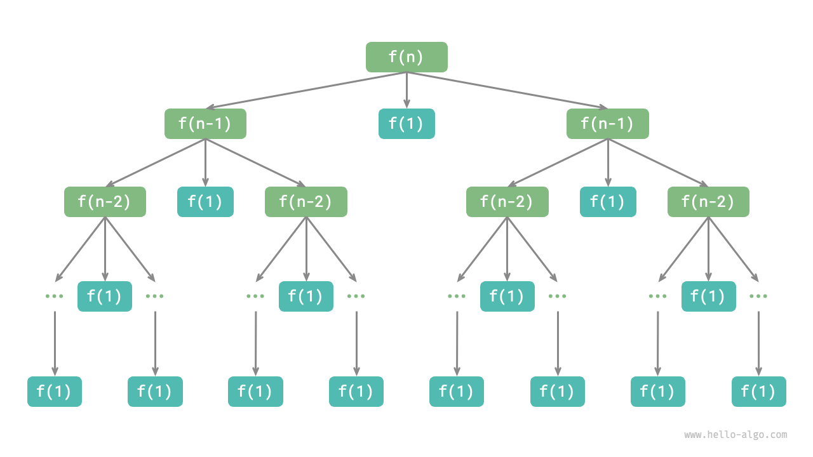

!!! quote

    Bài toán tháp Hà Nội có nguồn gốc từ một truyền thuyết cổ xưa. Trong một ngôi đền ở Ấn Độ cổ đại, các nhà sư có ba cọc kim cương cao và $64$ đĩa bằng vàng có kích thước khác nhau. Các nhà sư liên tục di chuyển các đĩa, tin rằng khi đĩa cuối cùng được đặt đúng vị trí, thế giới sẽ đi đến hồi kết.

    Tuy nhiên, ngay cả khi các nhà sư di chuyển một đĩa mỗi giây, sẽ mất khoảng $2^{64} \approx 1.84×10^{19}$ giây, tương đương với khoảng $585$ tỷ năm, vượt xa ước tính hiện tại về tuổi của vũ trụ. Do đó, nếu truyền thuyết này là có thật, chúng ta không cần phải lo lắng về ngày tận thế.
