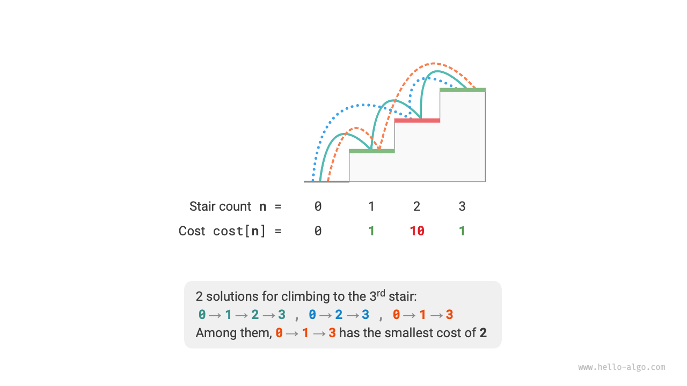
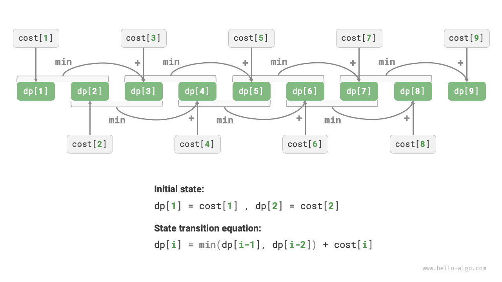
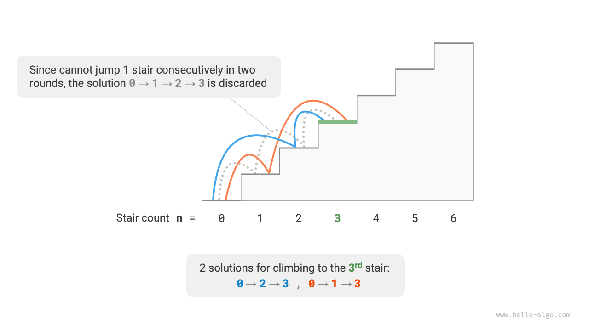
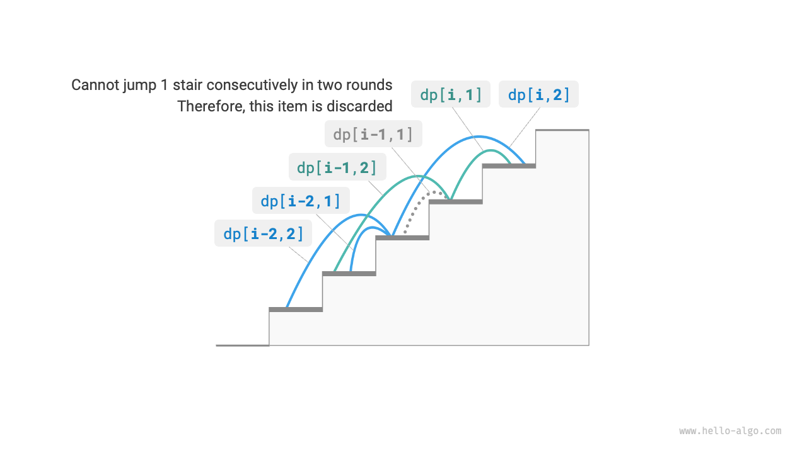

# Đặc điểm của các Bài toán Quy hoạch động

Trong phần trước, chúng ta đã học cách quy hoạch động giải quyết bài toán ban đầu bằng cách phân rã nó thành các bài toán con. Trên thực tế, phân rã bài toán con là một phương pháp thuật toán tổng quát, với các trọng tâm khác nhau trong chia để trị, quy hoạch động và quay lui.

- Các thuật toán chia để trị chia đệ quy bài toán ban đầu thành nhiều bài toán con độc lập cho đến khi đạt được các bài toán con nhỏ nhất, và hợp nhất lời giải cho các bài toán con trong quá trình quay lui để cuối cùng thu được lời giải cho bài toán ban đầu.
- Quy hoạch động cũng phân rã bài toán một cách đệ quy, nhưng điểm khác biệt chính so với các thuật toán chia để trị là các bài toán con trong quy hoạch động phụ thuộc lẫn nhau, và nhiều bài toán con chồng chéo xuất hiện trong quá trình phân rã.
- Các thuật toán quay lui liệt kê tất cả các lời giải có thể thông qua thử nghiệm và sai sót, và tránh các nhánh tìm kiếm không cần thiết thông qua cắt tỉa. Lời giải cho bài toán ban đầu bao gồm một chuỗi các bước quyết định, và chúng ta có thể coi dãy con trước mỗi bước quyết định như một bài toán con.

Trên thực tế, quy hoạch động thường được sử dụng để giải quyết các bài toán tối ưu hóa, các bài toán này không chỉ chứa các bài toán con chồng chéo mà còn có hai đặc điểm lớn khác: cấu trúc con tối ưu và không có tác dụng phụ (không có hệ quả kéo theo / no aftereffects).

## Cấu trúc con Tối ưu

Chúng ta thực hiện một sửa đổi nhỏ đối với bài toán leo cầu thang để làm cho nó phù hợp hơn trong việc minh họa khái niệm cấu trúc con tối ưu.

!!! question "Leo cầu thang với chi phí tối thiểu"

    Cho một cầu thang, bạn có thể leo $1$ hoặc $2$ bậc mỗi lần, và mỗi bậc được gắn một số nguyên không âm đại diện cho chi phí khi bước lên nó. Cho một mảng số nguyên không âm $cost$, trong đó $cost[i]$ đại diện cho chi phí của bậc thứ $i$ và $cost[0]$ là mặt đất (điểm xuất phát), chi phí tối thiểu cần thiết để leo lên đến đỉnh là bao nhiêu?

Như hiển thị trong hình bên dưới, nếu chi phí của các bậc thứ $1$, $2$, và $3$ lần lượt là $1$, $10$, và $1$, thì việc leo từ mặt đất lên bậc thứ $3$ đòi hỏi chi phí tối thiểu là $2$.



Ký hiệu $dp[i]$ là chi phí tích lũy khi leo lên bậc thứ $i$. Vì bậc thứ $i$ chỉ có thể đến từ bậc thứ $i-1$ hoặc $i-2$, nên $dp[i]$ chỉ có thể bằng $dp[i-1] + cost[i]$ hoặc $dp[i-2] + cost[i]$. Để tối thiểu hóa chi phí, chúng ta nên chọn giá trị nhỏ hơn trong hai giá trị đó:

$$
dp[i] = \min(dp[i-1], dp[i-2]) + cost[i]
$$

Điều này dẫn chúng ta đến ý nghĩa của cấu trúc con tối ưu: **lời giải tối ưu cho bài toán ban đầu được xây dựng từ lời giải tối ưu cho các bài toán con**.

Bài toán này rõ ràng có cấu trúc con tối ưu: chúng ta chọn lời giải tốt hơn từ các lời giải tối ưu cho hai bài toán con $dp[i-1]$ và $dp[i-2]$, và sử dụng nó để xây dựng lời giải tối ưu cho bài toán ban đầu $dp[i]$.

Vậy, bài toán leo cầu thang ở phần trước có cấu trúc con tối ưu không? Mục tiêu của nó là tìm số cách, đây có vẻ là một bài toán đếm, nhưng nếu chúng ta thay đổi câu hỏi thành: "Tìm số cách tối đa". Chúng ta ngạc nhiên phát hiện ra rằng **mặc dù bài toán trước và sau khi sửa đổi là tương đương nhau, nhưng cấu trúc con tối ưu đã xuất hiện**: số cách tối đa cho bậc thứ $n$ bằng tổng của số cách tối đa cho các bậc thứ $n-1$ và $n-2$. Do đó, việc giải thích cấu trúc con tối ưu khá linh hoạt và sẽ có ý nghĩa khác nhau trong các bài toán khác nhau.

Theo phương trình chuyển trạng thái và các trạng thái ban đầu $dp[1] = cost[1]$ và $dp[2] = cost[2]$, chúng ta có thể thu được mã nguồn quy hoạch động:

```src
[file]{min_cost_climbing_stairs_dp}-[class]{}-[func]{min_cost_climbing_stairs_dp}
```

Hình bên dưới hiển thị quá trình quy hoạch động cho mã nguồn trên.



Bài toán này cũng có thể được tối ưu hóa không gian, nén từ một chiều xuống không chiều, giảm độ phức tạp không gian từ $O(n)$ xuống $O(1)$:

```src
[file]{min_cost_climbing_stairs_dp}-[class]{}-[func]{min_cost_climbing_stairs_dp_comp}
```

## Không có Tác dụng phụ (Không có Hệ quả kéo theo)

Không có tác dụng phụ (no aftereffects) là một trong những đặc điểm quan trọng cho phép quy hoạch động giải quyết bài toán một cách hiệu quả. Định nghĩa của nó là: **khi cho một trạng thái nhất định, sự phát triển trong tương lai của nó chỉ liên quan đến trạng thái hiện tại và không liên quan gì đến tất cả các trạng thái trong quá khứ**.

Lấy bài toán leo cầu thang làm ví dụ, cho trạng thái $i$, nó sẽ phát triển thành các trạng thái $i+1$ và $i+2$, tương ứng với việc nhảy $1$ bậc và nhảy $2$ bậc. Khi đưa ra hai lựa chọn này, chúng ta không cần xem xét các trạng thái trước trạng thái $i$, vì chúng không có ảnh hưởng gì đến tương lai của trạng thái $i$.

Tuy nhiên, nếu chúng ta thêm một ràng buộc vào bài toán leo cầu thang, tình hình sẽ thay đổi.

!!! question "Leo cầu thang có ràng buộc"

    Cho một cầu thang có $n$ bậc, trong đó bạn có thể leo $1$ hoặc $2$ bậc mỗi lần, **nhưng bạn không được nhảy $1$ bậc trong hai vòng liên tiếp**. Có bao nhiêu cách để leo lên đến đỉnh?

Như hiển thị trong hình bên dưới, chỉ có $2$ cách khả thi để leo lên bậc thứ $3$. Đường đi có ba lần nhảy $1$ bậc liên tiếp không thỏa mãn ràng buộc và do đó bị loại bỏ.



Trong bài toán này, nếu vòng trước là nhảy $1$ bậc, thì vòng tiếp theo bắt buộc phải nhảy $2$ bậc. Điều này có nghĩa là **lựa chọn tiếp theo không thể được quyết định duy nhất bởi trạng thái hiện tại (số bậc cầu thang hiện tại), mà còn phụ thuộc vào trạng thái trước đó (số bậc cầu thang từ vòng trước)**.

Không khó để thấy rằng bài toán này không còn thỏa mãn tính chất không có tác dụng phụ nữa, và phương trình chuyển trạng thái $dp[i] = dp[i-1] + dp[i-2]$ cũng thất bại, vì $dp[i-1]$ đại diện cho việc nhảy $1$ bậc trong vòng này, nhưng nó chứa nhiều lời giải mà trong đó "vòng trước là nhảy $1$ bậc", những lời giải này không thể đếm trực tiếp vào $dp[i]$ để thỏa mãn ràng buộc.

Vì lý do này, chúng ta cần mở rộng định nghĩa trạng thái: **trạng thái $[i, j]$ đại diện cho việc đang ở bậc thứ $i$ với vòng trước đó đã nhảy $j$ bậc**, trong đó $j \in \{1, 2\}$. Định nghĩa trạng thái này phân biệt hiệu quả xem vòng trước là nhảy $1$ bậc hay $2$ bậc, cho phép chúng ta xác định trạng thái hiện tại đến từ đâu.

- Khi vòng trước nhảy $1$ bậc, vòng trước đó nữa chỉ có thể chọn nhảy $2$ bậc, tức là $dp[i, 1]$ chỉ có thể chuyển trạng thái từ $dp[i-1, 2]$.
- Khi vòng trước nhảy $2$ bậc, vòng trước đó nữa có thể chọn nhảy $1$ bậc hoặc $2$ bậc, tức là $dp[i, 2]$ có thể chuyển trạng thái từ $dp[i-2, 1]$ hoặc $dp[i-2, 2]$.

Như hiển thị trong hình bên dưới, theo định nghĩa này, $dp[i, j]$ đại diện cho số cách cho trạng thái $[i, j]$. Khi đó phương trình chuyển trạng thái là:

$$
\begin{cases}
dp[i, 1] = dp[i-1, 2] \\
dp[i, 2] = dp[i-2, 1] + dp[i-2, 2]
\end{cases}
$$



Cuối cùng, trả về $dp[n, 1] + dp[n, 2]$, trong đó tổng của hai giá trị đại diện cho tổng số cách leo lên bậc thứ $n$:

```src
[file]{climbing_stairs_constraint_dp}-[class]{}-[func]{climbing_stairs_constraint_dp}
```

Trong trường hợp trên, vì chúng ta chỉ cần xem xét thêm một trạng thái phía trước, chúng ta vẫn có thể làm cho bài toán thỏa mãn tính chất không có tác dụng phụ bằng cách mở rộng định nghĩa trạng thái. Tuy nhiên, một số bài toán có "tác dụng phụ" rất nghiêm trọng.

!!! question "Leo cầu thang có tạo chướng ngại vật"

    Cho một cầu thang có $n$ bậc, trong đó bạn có thể leo $1$ hoặc $2$ bậc mỗi lần. **Bất cứ khi nào bạn đạt đến bậc thứ $i$, hệ thống tự động đặt một chướng ngại vật ở bậc thứ $2i$, và không có vòng tiếp theo nào được phép nhảy đến bậc thứ $2i$**. Ví dụ, nếu hai vòng đầu tiên nhảy đến các bậc thứ $2$ và $3$, thì sau đó bạn không thể nhảy đến các bậc thứ $4$ và $6$. Có bao nhiêu cách để leo lên đến đỉnh?

Trong bài toán này, lần nhảy tiếp theo phụ thuộc vào tất cả các trạng thái trong quá khứ, vì mỗi lần nhảy đặt chướng ngại vật trên các bậc cao hơn, ảnh hưởng đến các lần nhảy trong tương lai. Đối với những bài toán như vậy, quy hoạch động thường rất khó giải quyết.

Trên thực tế, nhiều bài toán tối ưu hóa tổ hợp phức tạp (chẳng hạn như bài toán người du lịch) không thỏa mãn tính chất không có tác dụng phụ. Đối với những bài toán như vậy, chúng ta thường sử dụng các phương pháp khác, chẳng hạn như tìm kiếm kinh nghiệm, thuật toán di truyền, và học tăng cường, để thu được các lời giải tối ưu cục bộ có thể sử dụng được trong một khoảng thời gian hữu hạn.
