# Phương pháp Giải quyết Bài toán Quy hoạch động

Hai phần trước đã giới thiệu các đặc điểm chính của các bài toán quy hoạch động. Tiếp theo, hãy cùng nhau khám phá thêm hai vấn đề thực tế hơn.

1. Làm thế nào để xác định xem một bài toán có phải là bài toán quy hoạch động hay không?
2. Quy trình hoàn chỉnh để giải quyết một bài toán quy hoạch động là gì, và chúng ta nên bắt đầu từ đâu?

## Nhận diện Bài toán

Nói một cách tổng quát, nếu một bài toán chứa các bài toán con chồng chéo, có cấu trúc con tối ưu và thỏa mãn tính chất không có tác dụng phụ, thì nó thường phù hợp để giải bằng quy hoạch động. Tuy nhiên, rất khó để trích xuất trực tiếp các đặc điểm này từ mô tả bài toán. Do đó, chúng ta thường nới lỏng các điều kiện và **trước tiên quan sát xem bài toán có phù hợp để giải bằng quay lui (tìm kiếm vét cạn) hay không**.

**Các bài toán phù hợp để giải bằng quay lui thường thỏa mãn "mô hình cây quyết định"**, có nghĩa là bài toán có thể được mô tả bằng cấu trúc cây, trong đó mỗi nút đại diện cho một quyết định và mỗi đường đi đại diện cho một chuỗi các quyết định.

Nói cách khác, nếu một bài toán chứa một khái niệm quyết định rõ ràng, và lời giải được tạo ra thông qua một chuỗi các quyết định, thì nó thỏa mãn mô hình cây quyết định và thường có thể được giải bằng cách sử dụng quay lui.

Trên cơ sở này, các bài toán quy hoạch động cũng có một số dấu hiệu tích cực (positive indicators).

- Bài toán chứa các mô tả như lớn nhất (nhỏ nhất) hoặc nhiều nhất (ít nhất), chỉ ra tính tối ưu hóa.
- Trạng thái của bài toán có thể được biểu diễn bằng một danh sách, ma trận nhiều chiều, hoặc cây, và một trạng thái có hệ thức truy hồi với các trạng thái xung quanh nó.

Tương ứng, cũng có một số dấu hiệu tiêu cực (negative indicators).

- Mục tiêu của bài toán là tìm tất cả các lời giải có thể có, chứ không phải tìm lời giải tối ưu.
- Mô tả bài toán có đặc điểm hoán vị và tổ hợp rõ ràng, yêu cầu trả về nhiều lời giải cụ thể.

Nếu một bài toán thỏa mãn mô hình cây quyết định và có các dấu hiệu tích cực tương đối rõ ràng, chúng ta có thể giả định đó là một bài toán quy hoạch động và xác minh giả định đó trong quá trình giải quyết.

## Các bước Giải quyết Bài toán

Quy trình giải quyết bài toán cho quy hoạch động thay đổi tùy thuộc vào bản chất và độ khó của bài toán, nhưng nói chung tuân theo các bước sau: mô tả các quyết định, định nghĩa các trạng thái, thiết lập bảng $dp$, rút ra các phương trình chuyển trạng thái, xác định các điều kiện biên, v.v.

Để minh họa các bước giải quyết bài toán một cách sinh động hơn, chúng ta sử dụng một bài toán kinh điển "tổng đường đi nhỏ nhất" làm ví dụ.

!!! question

    Cho một lưới hai chiều $n \times m$ `grid` trong đó mỗi ô chứa một số nguyên không âm đại diện cho chi phí của nó, một con robot bắt đầu từ ô trên cùng bên trái và chỉ có thể di chuyển xuống dưới hoặc sang phải ở mỗi bước cho đến khi đạt đến ô dưới cùng bên phải. Trả về tổng đường đi nhỏ nhất từ ô trên cùng bên trái đến ô dưới cùng bên phải.

Hình bên dưới hiển thị một ví dụ trong đó tổng đường đi nhỏ nhất cho lưới đã cho là $13$.

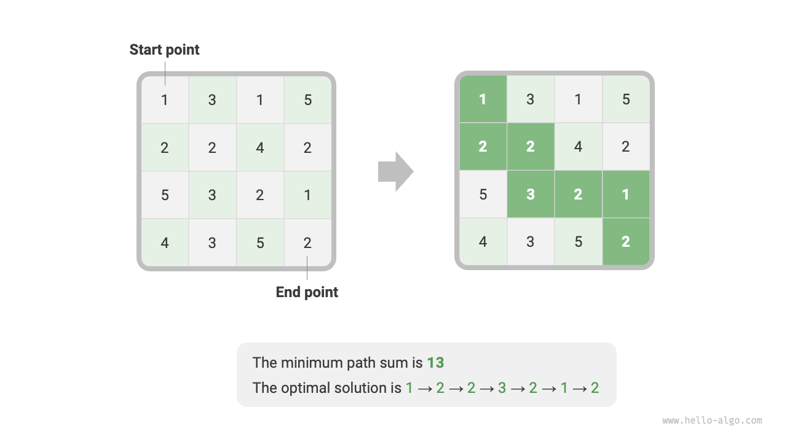

**Bước 1: Suy nghĩ về các quyết định trong mỗi vòng, định nghĩa trạng thái, và từ đó thu được bảng $dp$**

Quyết định trong mỗi vòng của bài toán này là di chuyển một bước xuống dưới hoặc sang phải từ ô hiện tại. Ký hiệu chỉ số hàng và cột của ô hiện tại là $[i, j]$. Sau khi di chuyển xuống dưới hoặc sang phải, các chỉ số trở thành $[i+1, j]$ hoặc $[i, j+1]$. Do đó, trạng thái nên bao gồm hai biến, chỉ số hàng và chỉ số cột, ký hiệu là $[i, j]$.

Trạng thái $[i, j]$ tương ứng với bài toán con: **tổng đường đi nhỏ nhất từ điểm xuất phát $[0, 0]$ đến $[i, j]$**, ký hiệu là $dp[i, j]$.

Từ đây, chúng ta thu được ma trận $dp$ hai chiều được hiển thị trong hình bên dưới, có kích thước giống như lưới đầu vào `grid`.

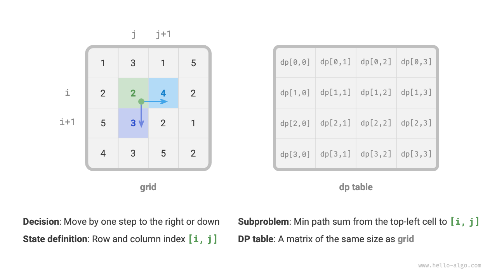

!!! note

    Quá trình quy hoạch động và quay lui có thể được mô tả như một chuỗi các quyết định, và trạng thái bao gồm tất cả các biến quyết định. Nó nên chứa tất cả các biến mô tả tiến trình giải quyết bài toán, và nên chứa đủ thông tin để rút ra trạng thái tiếp theo.

    Mỗi trạng thái tương ứng với một bài toán con, và chúng ta định nghĩa một bảng $dp$ để lưu trữ lời giải cho tất cả các bài toán con. Mỗi biến độc lập của trạng thái là một chiều của bảng $dp$. Về bản chất, bảng $dp$ là một ánh xạ giữa các trạng thái và lời giải cho các bài toán con.

**Bước 2: Xác định cấu trúc con tối ưu, và sau đó rút ra phương trình chuyển trạng thái**

Đối với trạng thái $[i, j]$, nó chỉ có thể chuyển trạng thái từ ô phía trên $[i-1, j]$ hoặc ô bên trái $[i, j-1]$. Do đó, cấu trúc con tối ưu là: tổng đường đi nhỏ nhất để đạt đến $[i, j]$ được quyết định bởi giá trị nhỏ hơn trong các tổng đường đi nhỏ nhất của $[i, j-1]$ và $[i-1, j]$.

Dựa trên phân tích trên, phương trình chuyển trạng thái được hiển thị trong hình bên dưới có thể được rút ra:

$$
dp[i, j] = \min(dp[i-1, j], dp[i, j-1]) + grid[i, j]
$$

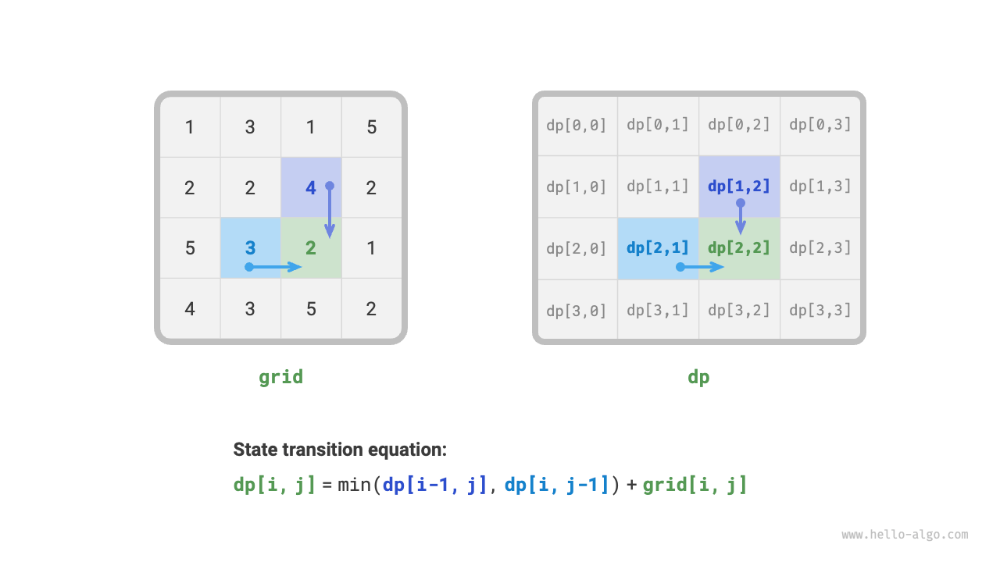

!!! note

    Dựa trên bảng $dp$ đã định nghĩa, hãy suy nghĩ về mối quan hệ giữa bài toán ban đầu và các bài toán con, và tìm phương pháp để xây dựng lời giải tối ưu cho bài toán ban đầu từ các lời giải tối ưu cho các bài toán con, đây chính là cấu trúc con tối ưu.

    Khi chúng ta xác định được cấu trúc con tối ưu, chúng ta có thể sử dụng nó để xây dựng phương trình chuyển trạng thái.

**Bước 3: Xác định các điều kiện biên và thứ tự chuyển trạng thái**

Trong bài toán này, các trạng thái ở hàng đầu tiên chỉ có thể đến từ trạng thái bên trái của chúng, và các trạng thái ở cột đầu tiên chỉ có thể đến từ trạng thái phía trên chúng. Do đó, hàng đầu tiên $i = 0$ và cột đầu tiên $j = 0$ là các điều kiện biên.

Như hiển thị trong hình bên dưới, vì mỗi ô chuyển trạng thái từ ô bên trái và ô phía trên nó, chúng ta sử dụng các vòng lặp để duyệt qua ma trận, với vòng lặp ngoài duyệt qua các hàng và vòng lặp trong duyệt qua các cột.

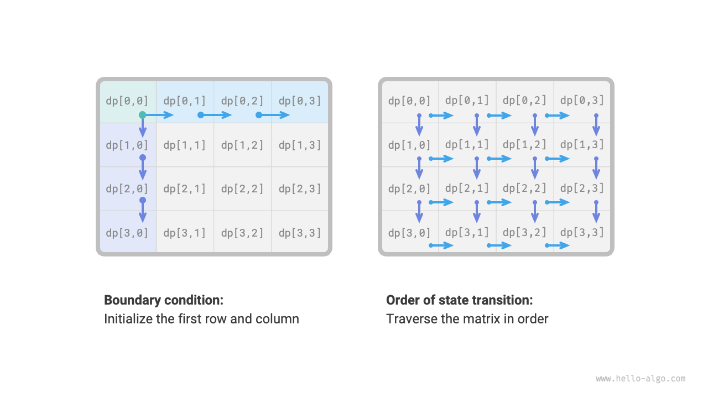

!!! note

    Các điều kiện biên trong quy hoạch động được sử dụng để khởi tạo bảng $dp$, trong khi trong tìm kiếm chúng được sử dụng để cắt tỉa.

    Cốt lõi của thứ tự chuyển trạng thái là đảm bảo rằng khi tính toán lời giải cho bài toán hiện tại, tất cả các bài toán con nhỏ hơn mà nó phụ thuộc vào đều đã được tính toán chính xác.

Dựa trên phân tích trên, chúng ta có thể viết trực tiếp mã nguồn quy hoạch động. Tuy nhiên, phân rã bài toán con là một cách tiếp cận từ trên xuống, vì vậy việc triển khai theo thứ tự "tìm kiếm vét cạn $\rightarrow$ ghi nhớ $\rightarrow$ quy hoạch động" sẽ phù hợp hơn với thói quen tư duy.

### Phương pháp 1: Tìm kiếm Vét cạn

Bắt đầu từ trạng thái $[i, j]$, chúng ta liên tục phân rã nó thành các trạng thái nhỏ hơn $[i-1, j]$ và $[i, j-1]$. Hàm đệ quy bao gồm các yếu tố sau.

- **Các tham số đệ quy**: trạng thái $[i, j]$.
- **Giá trị trả về**: tổng đường đi nhỏ nhất từ $[0, 0]$ đến $[i, j]$, chính là $dp[i, j]$.
- **Điều kiện dừng**: khi $i = 0$ và $j = 0$, trả về chi phí $grid[0, 0]$.
- **Cắt tỉa**: khi $i < 0$ hoặc $j < 0$, chỉ số vượt quá phạm vi, trả về chi phí $+\infty$, đại diện cho việc không thể thực hiện được.

Mã nguồn triển khai như sau:

```src
[file]{min_path_sum}-[class]{}-[func]{min_path_sum_dfs}
```

Hình bên dưới hiển thị cây đệ quy có gốc tại $dp[2, 1]$, cây này bao gồm một số bài toán con chồng chéo mà số lượng của chúng sẽ tăng lên nhanh chóng khi kích thước của lưới `grid` phát triển.

Về bản chất, lý do cho các bài toán con chồng chéo là: **có nhiều đường đi từ góc trên bên trái để đạt đến một ô nhất định**.

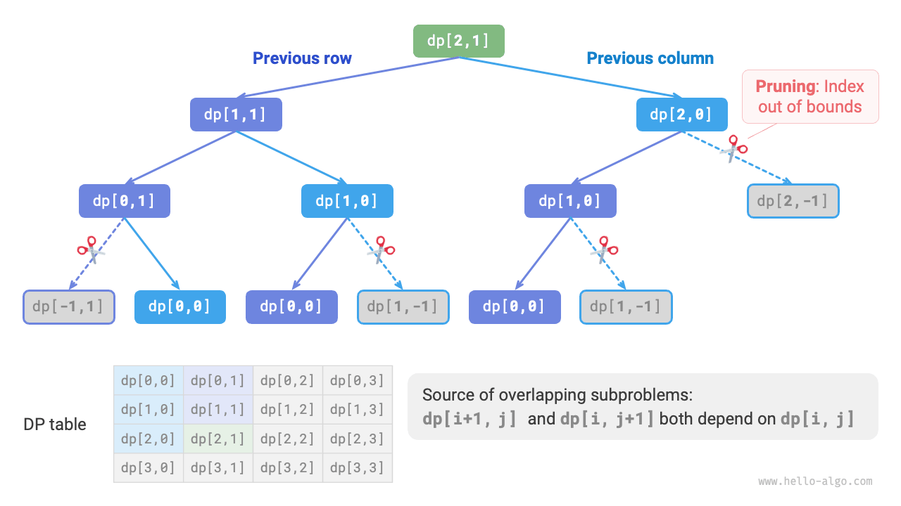

Mỗi trạng thái có hai lựa chọn, xuống dưới và sang phải, vì vậy tổng số bước từ góc trên bên trái đến góc dưới bên phải là $m + n - 2$, mang lại độ phức tạp thời gian trong trường hợp xấu nhất là $O(2^{m + n})$, trong đó $n$ và $m$ lần lượt là số hàng và số cột của lưới. Lưu ý rằng tính toán này không tính đến các tình huống gần biên lưới, nơi chỉ còn lại một lựa chọn khi đạt đến biên lưới, vì vậy số lượng đường đi thực tế sẽ ít hơn một chút.

### Phương pháp 2: Ghi nhớ (Memoization)

Chúng ta đưa vào một danh sách ghi nhớ `mem` có cùng kích thước với lưới `grid` để ghi lại lời giải cho các bài toán con và cắt tỉa các bài toán con chồng chéo:

```src
[file]{min_path_sum}-[class]{}-[func]{min_path_sum_dfs_mem}
```

Như hiển thị trong hình bên dưới, sau khi đưa vào ghi nhớ, tất cả các lời giải bài toán con chỉ cần tính toán một lần, vì vậy độ phức tạp thời gian phụ thuộc vào tổng số trạng thái, chính là kích thước lưới $O(nm)$.

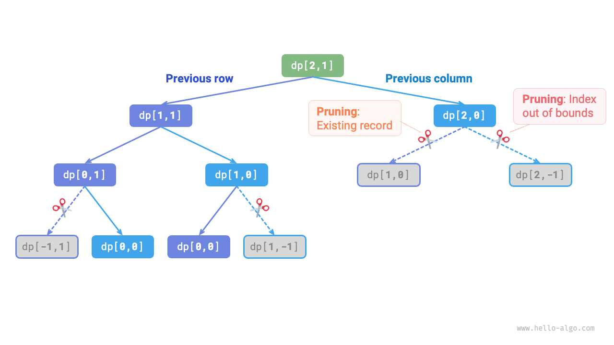

### Phương pháp 3: Quy hoạch động

Triển khai giải pháp quy hoạch động dựa trên phép lặp, như hiển thị trong mã nguồn bên dưới:

```src
[file]{min_path_sum}-[class]{}-[func]{min_path_sum_dp}
```

Hình bên dưới hiển thị quá trình chuyển trạng thái cho tổng đường đi nhỏ nhất, quá trình này duyệt qua toàn bộ lưới, **do đó độ phức tạp thời gian là $O(nm)$**.

Mảng `dp` có kích thước $n \times m$, **do đó độ phức tạp không gian là $O(nm)$**.

=== "<1>"
    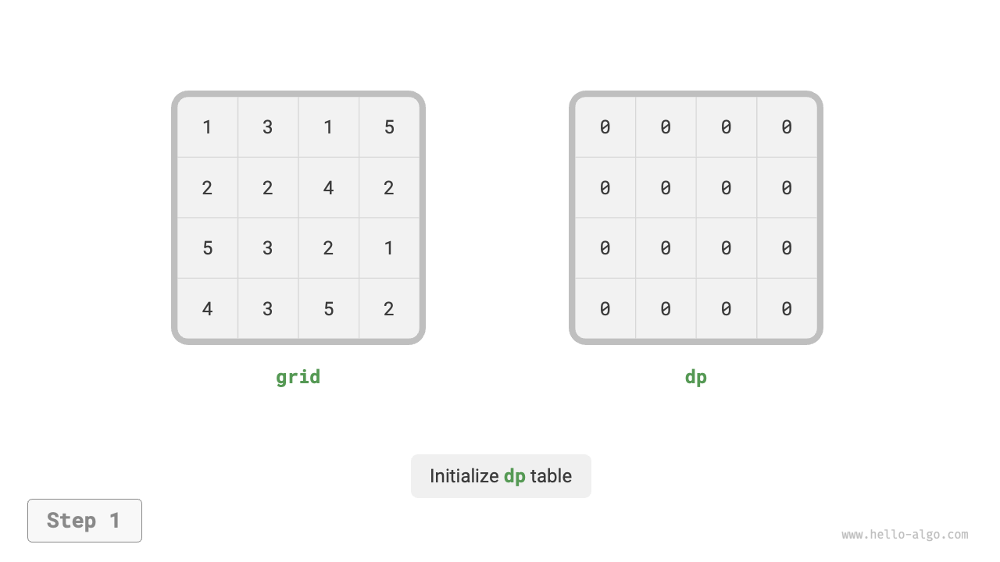

=== "<2>"
    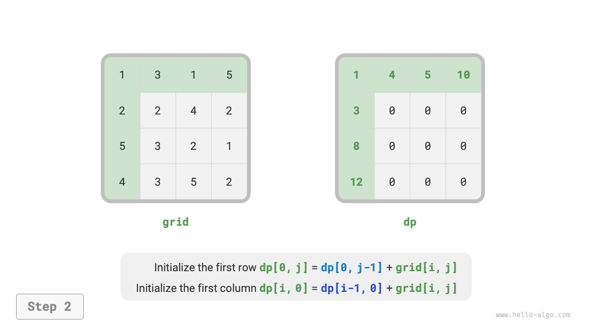

=== "<3>"
    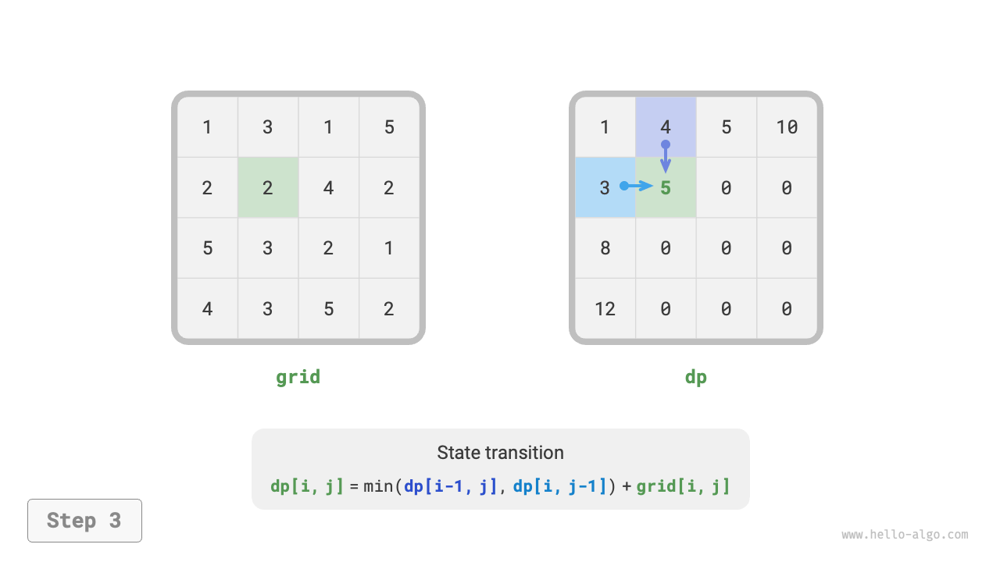

=== "<4>"
    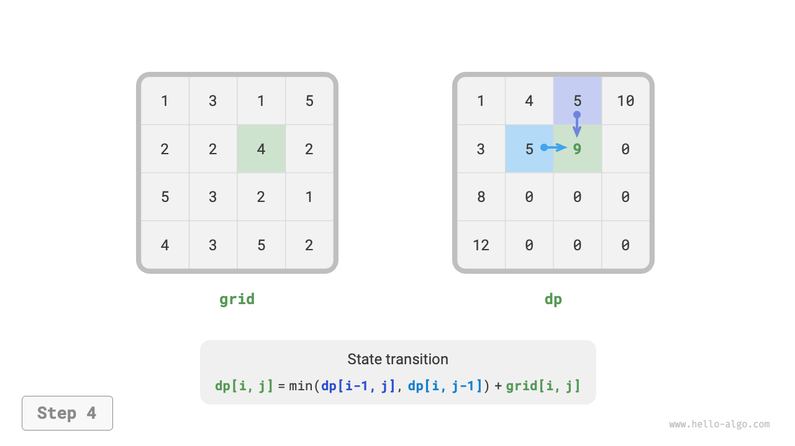

=== "<5>"
    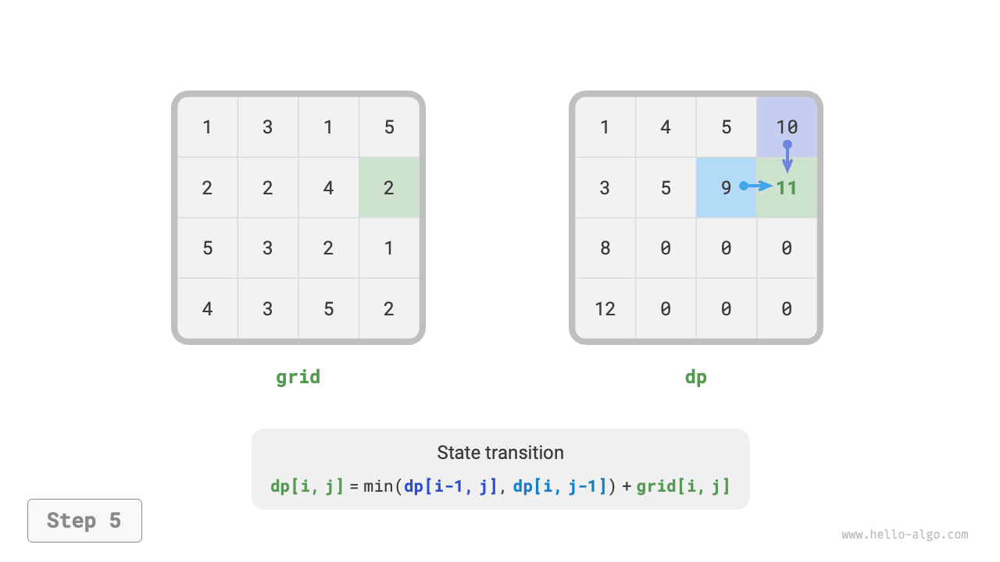

=== "<6>"
    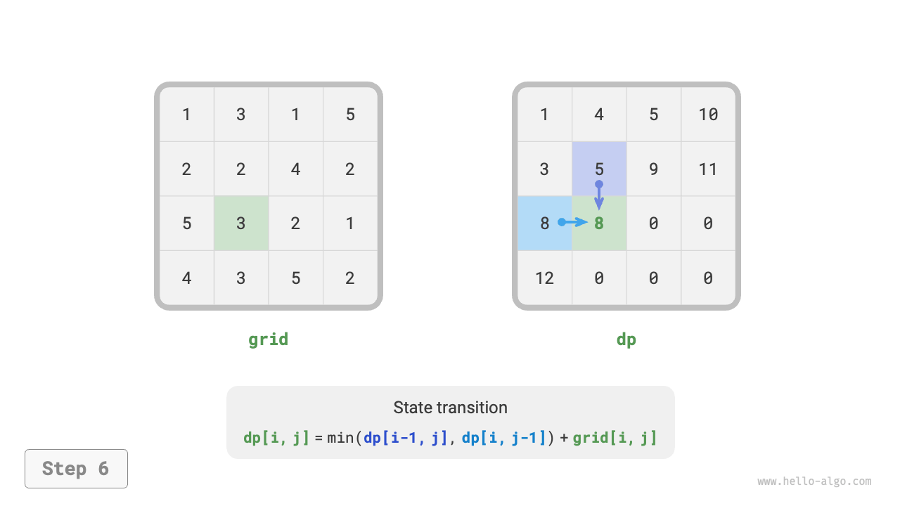

=== "<7>"
    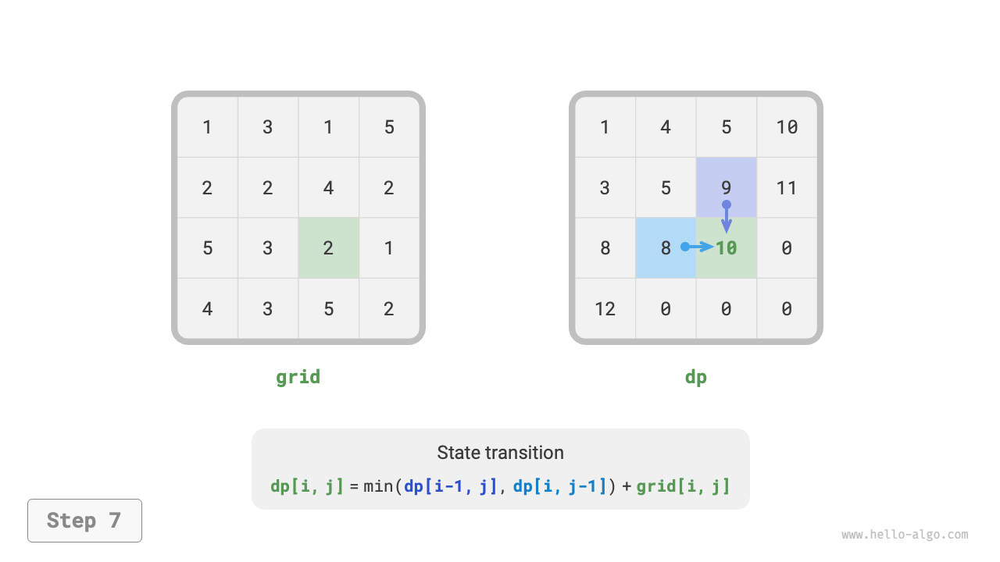

=== "<8>"
    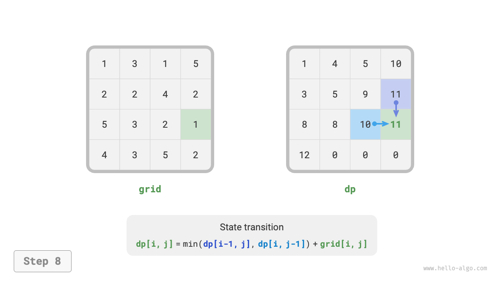

=== "<9>"
    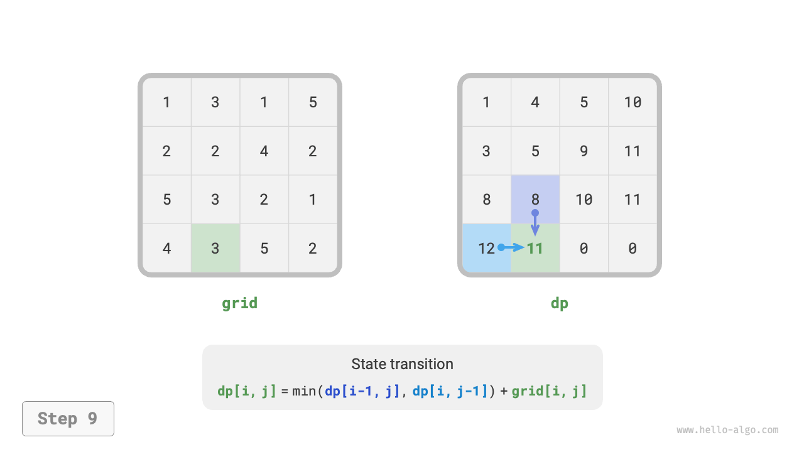

=== "<10>"
    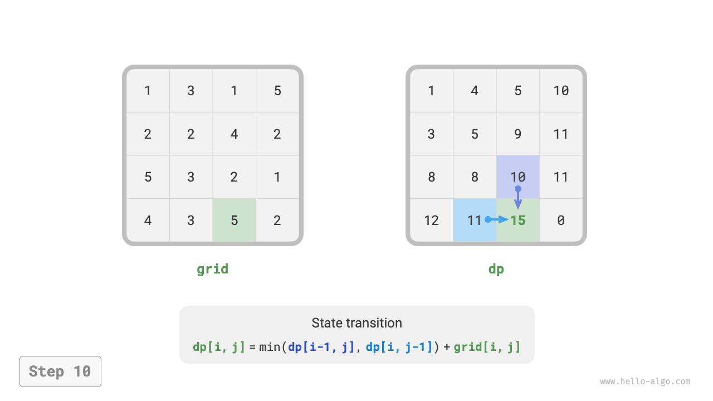

=== "<11>"
    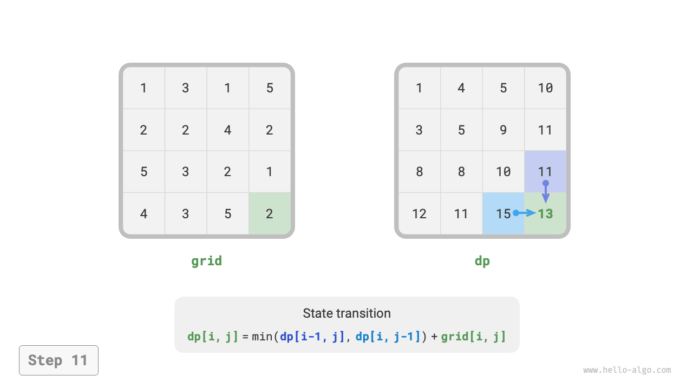

=== "<12>"
    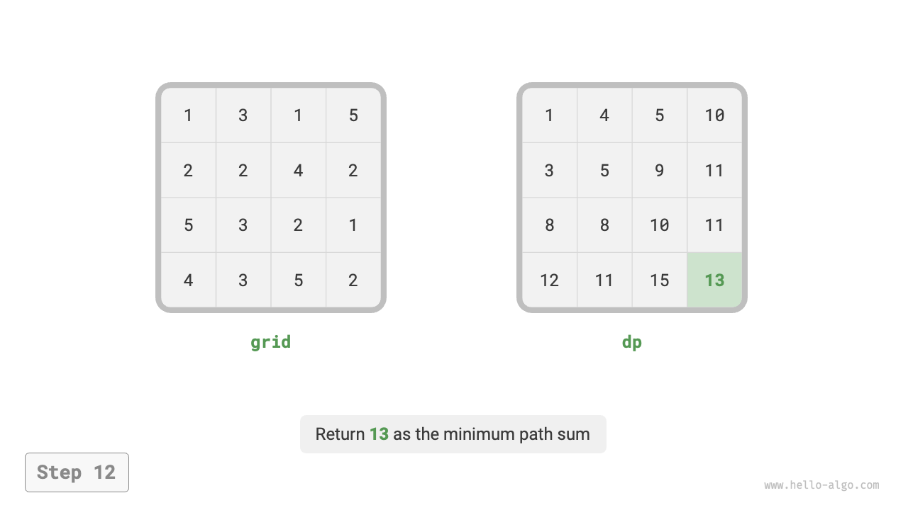

### Tối ưu hóa Không gian

Vì mỗi ô chỉ liên quan đến ô bên trái và ô phía trên nó, chúng ta có thể sử dụng một mảng một hàng để triển khai bảng $dp$.

Lưu ý rằng vì mảng `dp` chỉ có thể đại diện cho trạng thái của một hàng, chúng ta không thể khởi tạo trạng thái cột đầu tiên trước, mà thay vào đó cập nhật nó khi duyệt qua từng hàng:

```src
[file]{min_path_sum}-[class]{}-[func]{min_path_sum_dp_comp}
```
