# Bài toán Khoảng cách Chỉnh sửa (Edit Distance)

Khoảng cách chỉnh sửa, còn được gọi là khoảng cách Levenshtein, đề cập đến số lượng thao tác chỉnh sửa tối thiểu cần thiết để chuyển đổi một chuỗi này thành một chuỗi khác, thường được sử dụng trong truy xuất thông tin và xử lý ngôn ngữ tự nhiên để đo lường độ tương đồng giữa hai chuỗi.

!!! question

    Cho hai chuỗi $s$ và $t$, hãy trả về số lượng thao tác chỉnh sửa tối thiểu cần thiết để chuyển đổi $s$ thành $t$.

    Bạn có thể thực hiện ba loại thao tác chỉnh sửa trên một chuỗi: chèn một ký tự, xóa một ký tự, hoặc thay thế một ký tự bằng bất kỳ ký tự nào khác.

Như hiển thị trong hình bên dưới, việc chuyển đổi `kitten` thành `sitting` đòi hỏi 3 thao tác chỉnh sửa, bao gồm 2 lần thay thế và 1 lần chèn; việc chuyển đổi `hello` thành `algo` đòi hỏi 3 bước, bao gồm 2 lần thay thế và 1 lần xóa.

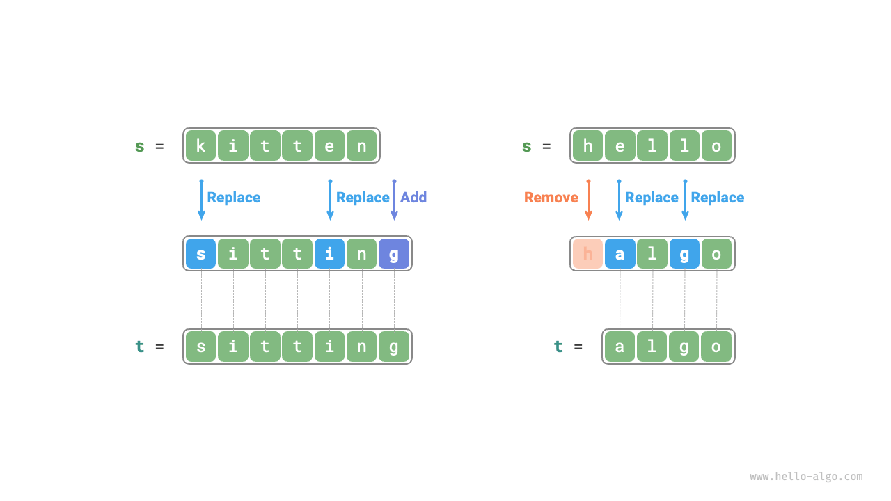

**Bài toán khoảng cách chỉnh sửa có thể được giải thích một cách tự nhiên bằng cách sử dụng mô hình cây quyết định**. Các chuỗi tương ứng với các nút trên cây, và mỗi thao tác chỉnh sửa tương ứng với một cạnh trên cây.

Như hiển thị trong hình bên dưới, nếu không giới hạn các thao tác, mỗi nút có thể phân nhánh thành nhiều cạnh, với mỗi cạnh tương ứng với một thao tác, nghĩa là có nhiều đường đi có thể để chuyển đổi `hello` thành `algo`.

Từ góc độ của cây quyết định, mục tiêu của bài toán này là tìm đường đi ngắn nhất giữa nút `hello` và nút `algo`.

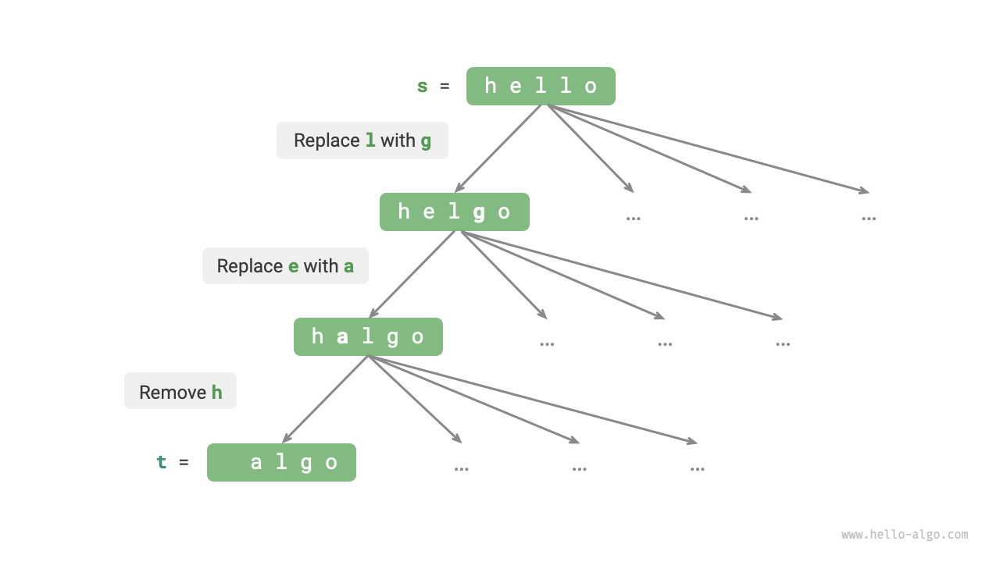

### Phương pháp Quy hoạch động

**Bước 1: Suy nghĩ về các quyết định trong mỗi vòng, định nghĩa trạng thái, và từ đó thu được bảng $dp$**

Mỗi vòng quyết định liên quan đến việc thực hiện một thao tác chỉnh sửa trên chuỗi $s$.

Chúng ta muốn kích thước bài toán giảm dần trong quá trình chỉnh sửa để có thể xây dựng các bài toán con. Ký hiệu độ dài của các chuỗi $s$ và $t$ lần lượt là $n$ và $m$. Trước tiên chúng ta xem xét các ký tự đuôi của hai chuỗi, $s[n-1]$ và $t[m-1]$.

- Nếu $s[n-1]$ và $t[m-1]$ giống nhau, chúng ta có thể bỏ qua chúng và trực tiếp xem xét $s[n-2]$ và $t[m-2]$.
- Nếu $s[n-1]$ và $t[m-1]$ khác nhau, chúng ta cần thực hiện một thao tác chỉnh sửa trên $s$ (chèn, xóa, hoặc thay thế) để làm cho các ký tự đuôi của hai chuỗi giống nhau, cho phép chúng ta bỏ qua chúng và xem xét một bài toán quy mô nhỏ hơn.

Nói cách khác, mỗi vòng quyết định (thao tác chỉnh sửa) chúng ta thực hiện trên chuỗi $s$ sẽ thay đổi các ký tự còn lại cần khớp trong $s$ và $t$. Do đó, trạng thái là các ký tự thứ $i$ và $j$ hiện đang được xem xét trong $s$ và $t$, ký hiệu là $[i, j]$.

Trạng thái $[i, j]$ tương ứng với bài toán con: **số lượng thao tác chỉnh sửa tối thiểu cần thiết để thay đổi $i$ ký tự đầu tiên của $s$ thành $j$ ký tự đầu tiên của $t$**.

Từ đây, chúng ta thu được một bảng $dp$ hai chiều kích thước $(i+1) \times (j+1)$.

**Bước 2: Xác định cấu trúc con tối ưu, và sau đó rút ra phương trình chuyển trạng thái**

Xét bài toán con $dp[i, j]$, trong đó các ký tự đuôi của hai chuỗi tương ứng là $s[i-1]$ và $t[j-1]$, có thể chia thành ba trường hợp được hiển thị trong hình bên dưới dựa trên các thao tác chỉnh sửa khác nhau.

1. Chèn $t[j-1]$ vào sau $s[i-1]$, khi đó bài toán con còn lại là $dp[i, j-1]$.
2. Xóa $s[i-1]$, khi đó bài toán con còn lại là $dp[i-1, j]$.
3. Thay thế $s[i-1]$ bằng $t[j-1]$, khi đó bài toán con còn lại là $dp[i-1, j-1]$.

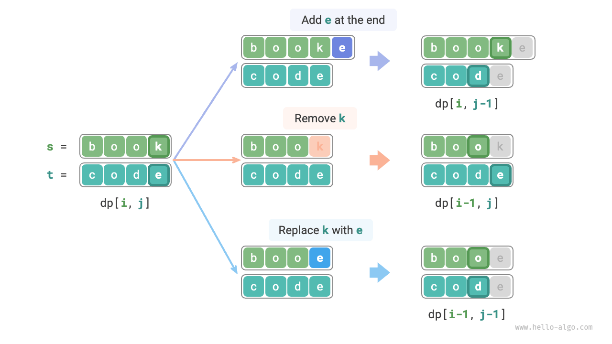

Dựa trên phân tích trên, chúng ta thu được cấu trúc con tối ưu: số lượng thao tác chỉnh sửa tối thiểu cho $dp[i, j]$ bằng giá trị nhỏ nhất của $dp[i, j-1]$, $dp[i-1, j]$, và $dp[i-1, j-1]$, cộng thêm chi phí chỉnh sửa hiện tại là $1$. Phương trình chuyển trạng thái tương ứng là:

$$
dp[i, j] = \min(dp[i, j-1], dp[i-1, j], dp[i-1, j-1]) + 1
$$

Xin lưu ý rằng **khi $s[i-1]$ và $t[j-1]$ giống nhau, không cần chỉnh sửa cho ký tự hiện tại**, trong trường hợp đó phương trình chuyển trạng thái là:

$$
dp[i, j] = dp[i-1, j-1]
$$

**Bước 3: Xác định các điều kiện biên và thứ tự chuyển trạng thái**

Khi cả hai chuỗi đều rỗng, số bước chỉnh sửa là $0$, tức là $dp[0, 0] = 0$. Khi $s$ rỗng nhưng $t$ không rỗng, số bước chỉnh sửa tối thiểu bằng độ dài của $t$, tức là hàng đầu tiên $dp[0, j] = j$. Khi $s$ không rỗng nhưng $t$ rỗng, số bước chỉnh sửa tối thiểu bằng độ dài của $s$, tức là cột đầu tiên $dp[i, 0] = i$.

Quan sát phương trình chuyển trạng thái, lời giải $dp[i, j]$ phụ thuộc vào các lời giải ở bên trái, phía trên và phía trên bên trái, vì vậy toàn bộ bảng $dp$ có thể được duyệt qua theo thứ tự thông qua hai vòng lặp lồng nhau.

### Triển khai Mã nguồn

```src
[file]{edit_distance}-[class]{}-[func]{edit_distance_dp}
```

Như hiển thị trong hình bên dưới, quá trình chuyển trạng thái cho bài toán khoảng cách chỉnh sửa rất giống với bài toán cái túi; cả hai đều có thể được xem như quá trình điền vào một lưới hai chiều.

=== "<1>"
    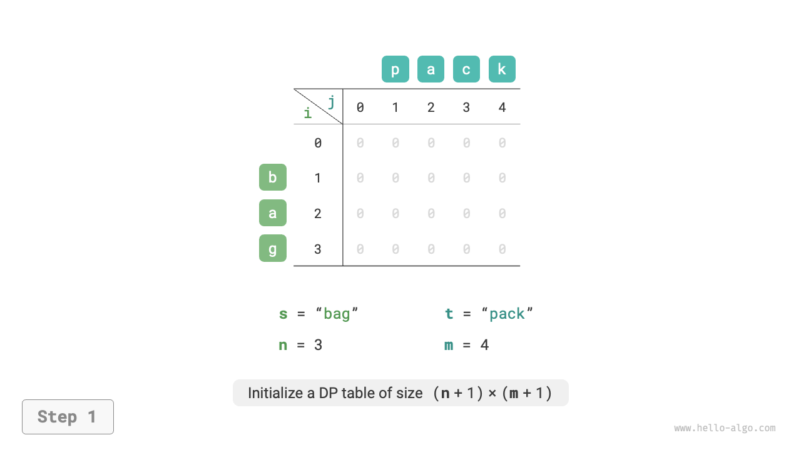

=== "<2>"
    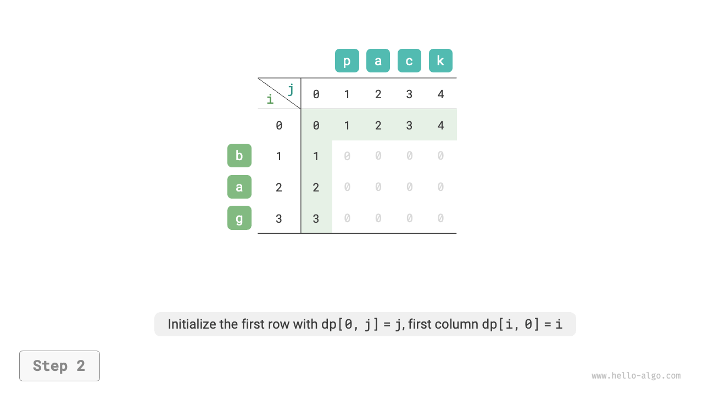

=== "<3>"
    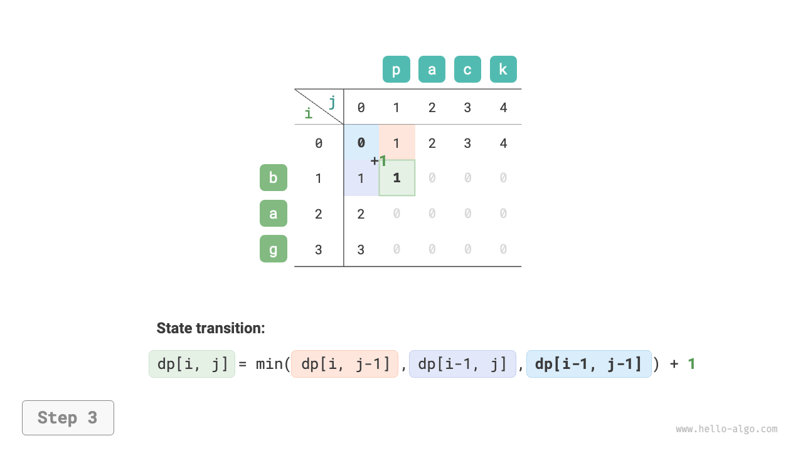

=== "<4>"
    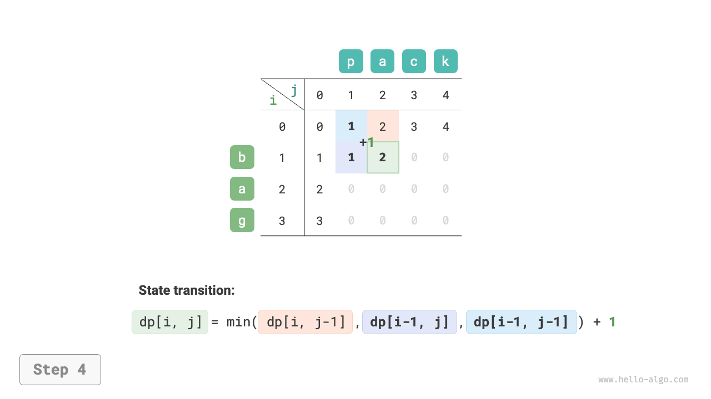

=== "<5>"
    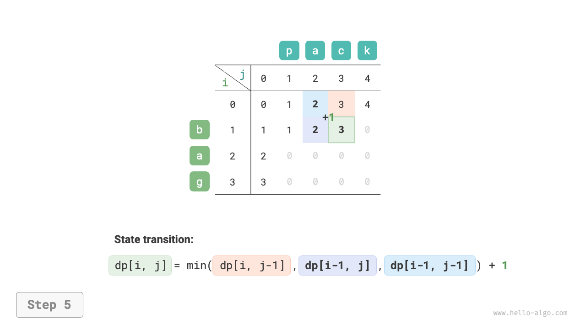

=== "<6>"
    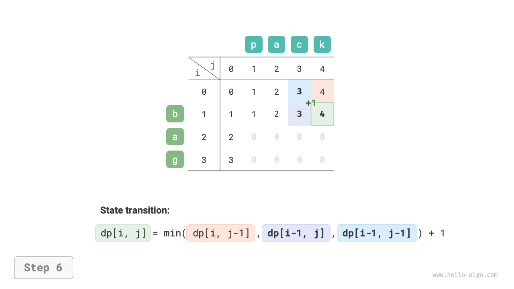

=== "<7>"
    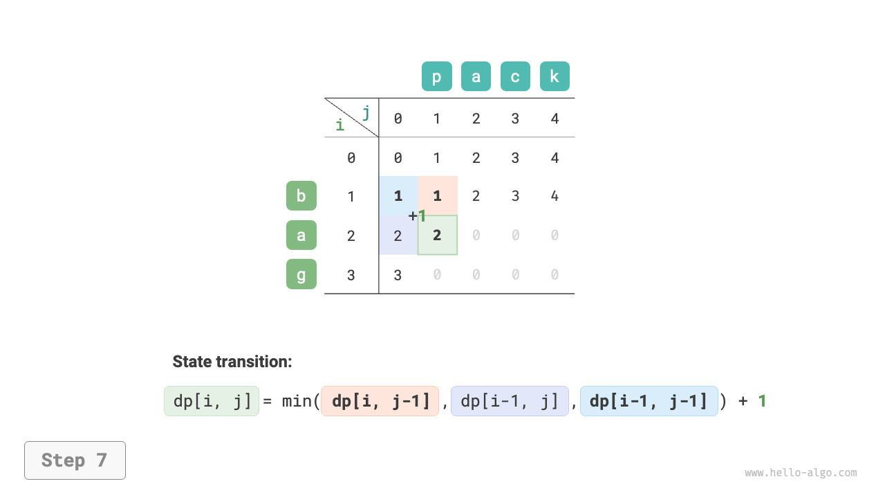

=== "<8>"
    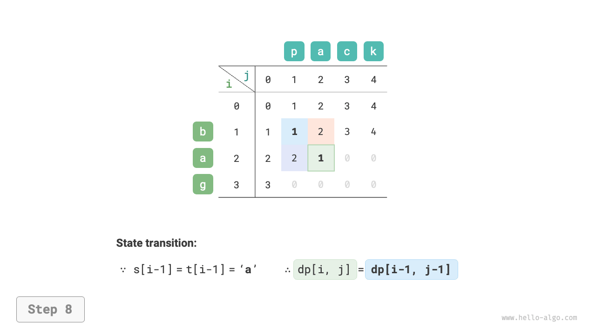

=== "<9>"
    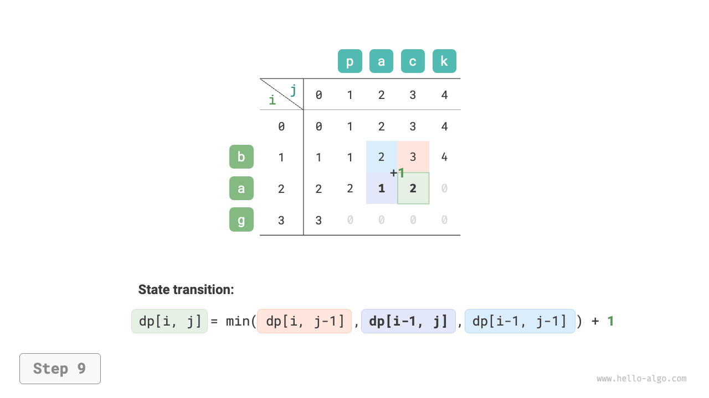

=== "<10>"
    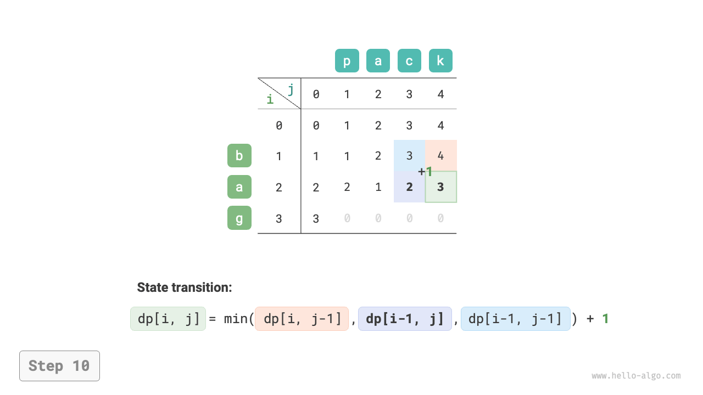

=== "<11>"
    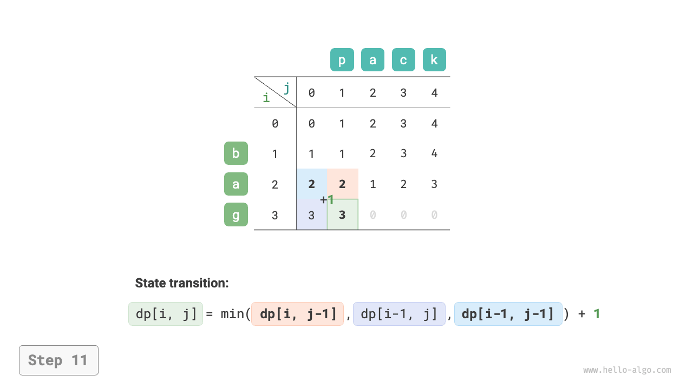

=== "<12>"
    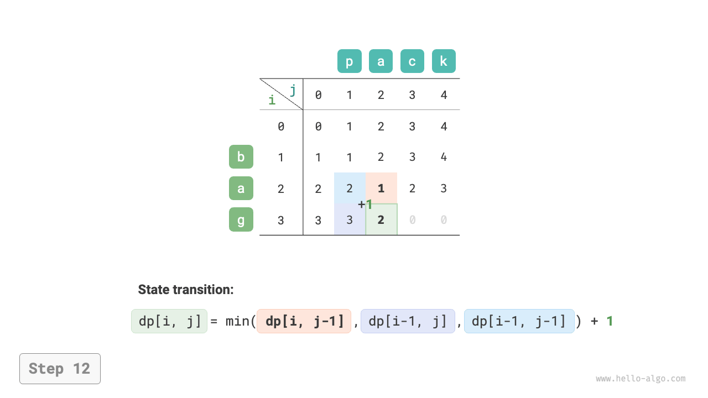

=== "<13>"
    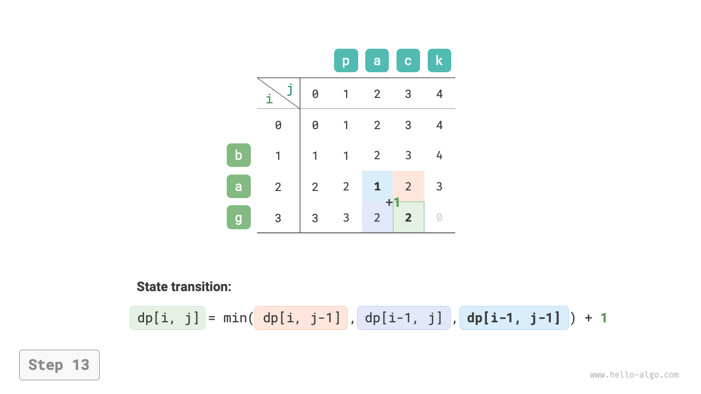

=== "<14>"
    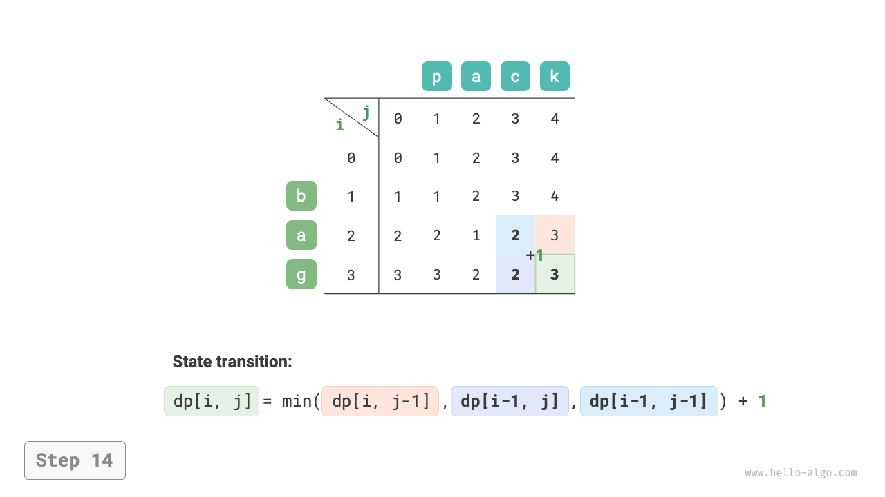

=== "<15>"
    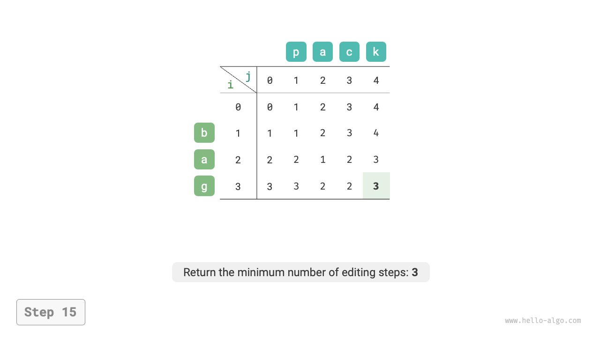

### Tối ưu hóa Không gian

Vì $dp[i, j]$ phụ thuộc vào các trạng thái phía trên $dp[i-1, j]$, bên trái $dp[i, j-1]$, và phía trên bên trái $dp[i-1, j-1]$, duyệt xuôi sẽ làm mất trạng thái phía trên bên trái $dp[i-1, j-1]$, trong khi duyệt ngược không thể xây dựng $dp[i, j-1]$ trước, vì vậy không có thứ tự duyệt nào phù hợp trực tiếp.

Vì lý do này, chúng ta có thể sử dụng một biến `leftup` để tạm thời lưu trữ lời giải phía trên bên trái $dp[i-1, j-1]$, do đó chúng ta chỉ cần xem xét các lời giải ở bên trái và phía trên. Tình huống này giống như trong bài toán cái túi hoàn toàn, vì vậy chúng ta có thể sử dụng duyệt xuôi. Mã nguồn như sau:

```src
[file]{edit_distance}-[class]{}-[func]{edit_distance_dp_comp}
```
