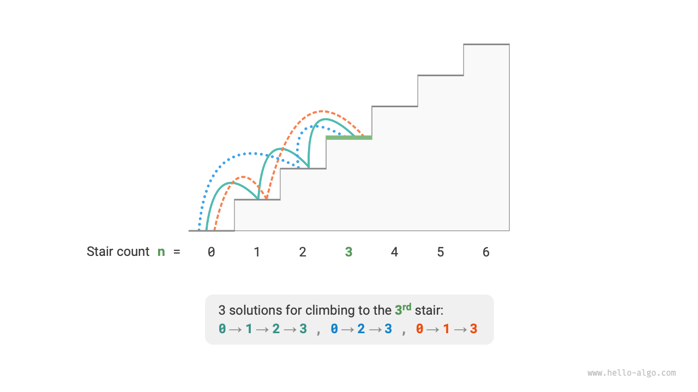
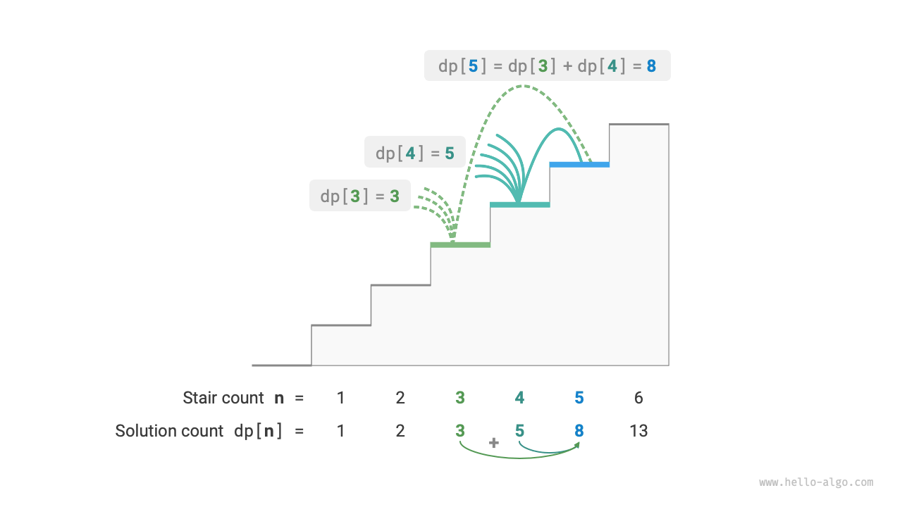
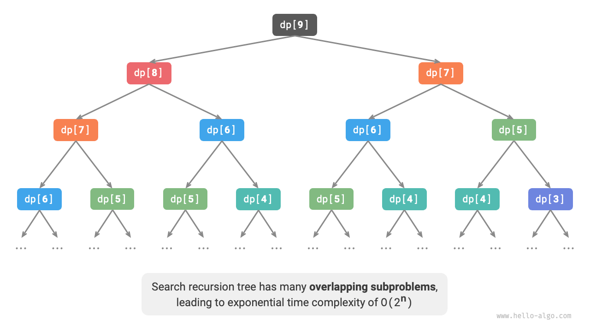
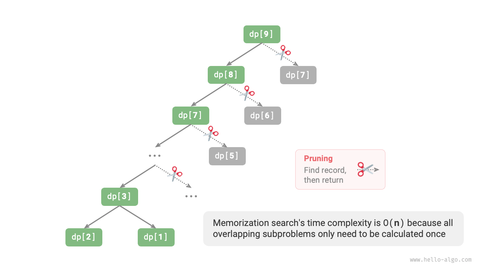
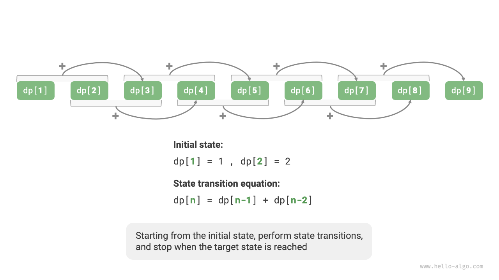

# Giới thiệu về Quy hoạch động

<u>Quy hoạch động</u> (Dynamic programming) là một mô hình thuật toán quan trọng giúp phân rã một bài toán thành một chuỗi các bài toán con nhỏ hơn và tránh việc tính toán dư thừa bằng cách lưu trữ lời giải cho các bài toán con, từ đó cải thiện đáng kể hiệu suất thời gian.

Trong phần này, chúng ta bắt đầu với một ví dụ kinh điển, trước tiên trình bày giải pháp quay lui vét cạn của nó, quan sát các bài toán con chồng chéo bên trong nó, và sau đó từng bước rút ra giải pháp quy hoạch động hiệu quả hơn.

!!! question "Leo cầu thang"

    Cho một cầu thang có $n$ bậc, trong đó bạn có thể leo $1$ hoặc $2$ bậc mỗi lần, có bao nhiêu cách khác nhau để leo lên đến đỉnh?

Như hiển thị trong hình bên dưới, đối với một cầu thang $3$ bậc, có $3$ cách khác nhau để leo lên đến đỉnh.



Mục tiêu của bài toán này là xác định số cách, vì vậy **chúng ta có thể cân nhắc sử dụng quay lui để liệt kê tất cả các khả năng**. Cụ thể, hãy tưởng tượng việc leo cầu thang như một quá trình lựa chọn nhiều vòng: bắt đầu từ mặt đất, chọn đi lên $1$ hoặc $2$ bậc trong mỗi vòng, tăng số lượng thêm $1$ bất cứ khi nào đạt đến đỉnh cầu thang, và cắt tỉa khi vượt quá đỉnh. Mã nguồn như sau:

```src
[file]{climbing_stairs_backtrack}-[class]{}-[func]{climbing_stairs_backtrack}
```

## Phương pháp 1: Tìm kiếm Vét cạn

Các thuật toán quay lui thường không phân rã bài toán một cách rõ ràng, mà coi việc giải quyết bài toán như một chuỗi các bước quyết định, tìm kiếm tất cả các lời giải có thể thông qua thử nghiệm và cắt tỉa.

Chúng ta có thể thử phân tích bài toán này từ góc độ phân rã bài toán. Giả sử số cách để leo lên bậc thứ $i$ là $dp[i]$, khi đó $dp[i]$ là bài toán ban đầu, và các bài toán con của nó bao gồm:

$$
dp[i-1], dp[i-2], \dots, dp[2], dp[1]
$$

Vì chúng ta chỉ có thể đi lên $1$ hoặc $2$ bậc trong mỗi vòng, nên khi chúng ta đứng ở bậc thứ $i$, chúng ta chỉ có thể đứng ở bậc thứ $i-1$ hoặc $i-2$ trong vòng trước đó. Nói cách khác, chúng ta chỉ có thể đạt đến bậc thứ $i$ từ bậc thứ $i-1$ hoặc $i-2$.

Điều này dẫn đến một kết luận quan trọng: **số cách leo lên bậc thứ $i-1$ cộng với số cách leo lên bậc thứ $i-2$ bằng số cách leo lên bậc thứ $i$**. Công thức như sau:

$$
dp[i] = dp[i-1] + dp[i-2]
$$

Điều này có nghĩa là trong bài toán leo cầu thang, tồn tại một hệ thức truy hồi giữa các bài toán con, và **lời giải cho bài toán ban đầu có thể được xây dựng từ lời giải của các bài toán con**. Hình bên dưới minh họa hệ thức truy hồi này.



Chúng ta có thể thu được một giải pháp tìm kiếm vét cạn dựa trên công thức truy hồi. Bắt đầu từ $dp[n]$, **phân rã đệ quy một bài toán lớn hơn thành tổng của hai bài toán nhỏ hơn**, cho đến khi đạt đến các bài toán con nhỏ nhất $dp[1]$ và $dp[2]$ và trả về kết quả. Trong đó, lời giải cho các bài toán con nhỏ nhất đã biết, cụ thể là $dp[1] = 1$ và $dp[2] = 2$, đại diện cho $1$ và $2$ cách để leo lên các bậc thứ $1$ và $2$ tương ứng.

Quan sát mã nguồn sau: giống như mã nguồn quay lui tiêu chuẩn, nó cũng sử dụng tìm kiếm theo chiều sâu nhưng ngắn gọn hơn:

```src
[file]{climbing_stairs_dfs}-[class]{}-[func]{climbing_stairs_dfs}
```

Hình bên dưới hiển thị cây đệ quy được tạo ra bởi tìm kiếm vét cạn. Đối với bài toán $dp[n]$, độ sâu cây đệ quy của nó là $n$, với độ phức tạp thời gian là $O(2^n)$. Tăng trưởng theo hàm mũ là bùng nổ; nếu chúng ta nhập một $n$ tương đối lớn, thời gian chờ đợi có thể rất dài.



Quan sát hình trên, **độ phức tạp thời gian theo hàm mũ là do "các bài toán con chồng chéo" gây ra**. Ví dụ, $dp[9]$ được phân rã thành $dp[8]$ và $dp[7]$, và $dp[8]$ được phân rã thành $dp[7]$ và $dp[6]$, cả hai đều chứa bài toán con $dp[7]$.

Và cứ thế, các bài toán con chứa các bài toán con chồng chéo nhỏ hơn, vô tận. Đại đa số tài nguyên tính toán bị lãng phí vào các bài toán con chồng chéo này.

## Phương pháp 2: Ghi nhớ (Memoization)

Để cải thiện hiệu suất thuật toán, **chúng ta muốn tất cả các bài toán con chồng chéo chỉ được tính toán đúng một lần**. Để làm điều này, chúng ta khai báo một mảng `mem` để ghi lại lời giải cho mỗi bài toán con và cắt tỉa các bài toán con chồng chéo trong quá trình tìm kiếm.

1. Khi tính toán $dp[i]$ lần đầu tiên, chúng ta ghi lại nó vào `mem[i]` để sử dụng sau này.
2. Khi chúng ta cần tính toán lại $dp[i]$, chúng ta có thể trực tiếp lấy kết quả từ `mem[i]`, từ đó tránh được việc tính toán dư thừa bài toán con đó.

Mã nguồn như sau:

```src
[file]{climbing_stairs_dfs_mem}-[class]{}-[func]{climbing_stairs_dfs_mem}
```

Quan sát hình bên dưới: **sau khi áp dụng ghi nhớ, tất cả các bài toán con chồng chéo chỉ cần tính toán một lần, giảm độ phức tạp thời gian xuống $O(n)$**, đây là một bước nhảy vọt to lớn.



## Phương pháp 3: Quy hoạch động

**Ghi nhớ là một phương pháp "từ trên xuống" (top-down)**: chúng ta bắt đầu từ bài toán ban đầu (nút gốc), phân rã đệ quy các bài toán con lớn hơn thành các bài toán nhỏ hơn, cho đến khi đạt đến các bài toán con nhỏ nhất đã biết (nút lá). Sau đó, bằng cách quay lui, chúng ta thu thập lời giải cho các bài toán con từng tầng một để xây dựng lời giải cho bài toán ban đầu.

Ngược lại, **quy hoạch động là một phương pháp "từ dưới lên" (bottom-up)**: bắt đầu từ lời giải cho các bài toán con nhỏ nhất, xây dựng lặp đi lặp lại lời giải cho các bài toán con lớn hơn cho đến khi thu được lời giải cho bài toán ban đầu.

Vì quy hoạch động không bao gồm quá trình quay lui, nó chỉ yêu cầu lặp lại vòng lặp để triển khai và không cần đệ quy. Trong mã nguồn sau, chúng ta khởi tạo một mảng `dp` để lưu trữ lời giải cho các bài toán con, đóng vai trò ghi nhận tương tự như mảng `mem` trong phương pháp ghi nhớ:

```src
[file]{climbing_stairs_dp}-[class]{}-[func]{climbing_stairs_dp}
```

Hình bên dưới mô phỏng quá trình thực thi của mã nguồn trên.



Giống như các thuật toán quay lui, quy hoạch động cũng sử dụng khái niệm "trạng thái" để đại diện cho các giai đoạn giải quyết bài toán cụ thể, với mỗi trạng thái tương ứng với một bài toán con và lời giải tối ưu cục bộ tương ứng của nó. Ví dụ, trạng thái trong bài toán leo cầu thang được định nghĩa là số bậc cầu thang hiện tại $i$.

Dựa trên nội dung trên, chúng ta có thể tóm tắt các thuật ngữ phổ biến được sử dụng trong quy hoạch động.

- Mảng `dp` được gọi là <u>bảng dp</u> (dp table), trong đó $dp[i]$ đại diện cho lời giải cho bài toán con tương ứng với trạng thái $i$.
- Các trạng thái tương ứng với các bài toán con nhỏ nhất (bậc thứ $1$ và $2$) được gọi là <u>trạng thái ban đầu</u> (initial states).
- Công thức truy hồi $dp[i] = dp[i-1] + dp[i-2]$ được gọi là <u>phương trình chuyển trạng thái</u> (state-transition equation).

## Tối ưu hóa Không gian

Những độc giả tinh ý có thể đã nhận ra rằng **vì $dp[i]$ chỉ liên quan đến $dp[i-1]$ và $dp[i-2]$, chúng ta không cần phải sử dụng một mảng `dp` để lưu trữ lời giải cho tất cả các bài toán con**, và thay vào đó có thể sử dụng hai biến cuốn chiếu lũy tiến. Mã nguồn như sau:

```src
[file]{climbing_stairs_dp}-[class]{}-[func]{climbing_stairs_dp_comp}
```

Như mã nguồn trên hiển thị, bằng cách loại bỏ không gian chiếm dụng bởi mảng `dp`, độ phức tạp không gian được giảm từ $O(n)$ xuống $O(1)$.

Trong các bài toán quy hoạch động, trạng thái hiện tại thường chỉ phụ thuộc vào một số lượng hữu hạn các trạng thái phía trước, cho phép chúng ta chỉ giữ lại các trạng thái cần thiết và tiết kiệm không gian bộ nhớ thông qua "giảm chiều". **Kỹ thuật tối ưu hóa không gian này được gọi là "biến cuốn chiếu" (rolling variable) hoặc "mảng cuốn chiếu" (rolling array)**.
