# Bài toán Cái túi Hoàn toàn (Unbounded Knapsack)

Trong phần này, trước tiên chúng ta giải quyết một bài toán cái túi phổ biến khác: cái túi hoàn toàn, và sau đó khám phá một trường hợp đặc biệt của nó: bài toán đổi tiền lẻ.

## Bài toán Cái túi Hoàn toàn

!!! question

    Cho $n$ đồ vật, trong đó trọng lượng của đồ vật thứ $i$ là $wgt[i-1]$ và giá trị của nó là $val[i-1]$, và một cái túi có sức chứa $cap$. **Mỗi đồ vật có thể được chọn nhiều lần**. Giá trị tối đa có thể cho vào cái túi trong giới hạn sức chứa là bao nhiêu? Một ví dụ được hiển thị trong hình bên dưới.

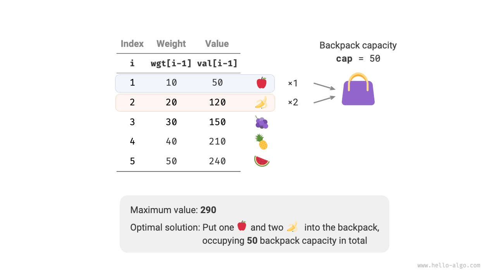

### Phương pháp Quy hoạch động

Bài toán cái túi hoàn toàn rất giống với bài toán cái túi 0-1, **chỉ khác ở chỗ không có giới hạn về số lần một đồ vật có thể được chọn**.

- Trong bài toán cái túi 0-1, chỉ có duy nhất một đồ vật cho mỗi loại, vì vậy sau khi cho đồ vật $i$ vào cái túi, chúng ta chỉ có thể chọn từ $i-1$ đồ vật đầu tiên.
- Trong bài toán cái túi hoàn toàn, số lượng của mỗi loại đồ vật là không giới hạn, vì vậy sau khi cho đồ vật $i$ vào cái túi, **chúng ta vẫn có thể chọn từ $i$ đồ vật đầu tiên**.

Theo quy tắc của bài toán cái túi hoàn toàn, sự thay đổi của trạng thái $[i, c]$ được chia thành hai trường hợp.

- **Không cho đồ vật $i$ vào**: Giống như bài toán cái túi 0-1, chuyển sang $[i-1, c]$.
- **Cho đồ vật $i$ vào**: Khác với bài toán cái túi 0-1, chuyển sang $[i, c-wgt[i-1]]$.

Do đó, phương trình chuyển trạng thái trở thành:

$$
dp[i, c] = \max(dp[i-1, c], dp[i, c - wgt[i-1]] + val[i-1])
$$

### Triển khai Mã nguồn

So sánh mã nguồn của hai bài toán, có một sự thay đổi trong việc chuyển trạng thái từ $i-1$ thành $i$, với mọi thứ khác đều giống hệt nhau:

```src
[file]{unbounded_knapsack}-[class]{}-[func]{unbounded_knapsack_dp}
```

### Tối ưu hóa Không gian

Vì trạng thái hiện tại được chuyển từ các trạng thái ở bên trái và phía trên, **sau khi tối ưu hóa không gian, mỗi hàng trong bảng $dp$ nên được duyệt theo thứ tự xuôi**.

Thứ tự duyệt này hoàn toàn ngược lại với cái túi 0-1. Xin vui lòng tham khảo hình bên dưới để hiểu sự khác biệt giữa hai bài toán.

=== "<1>"
    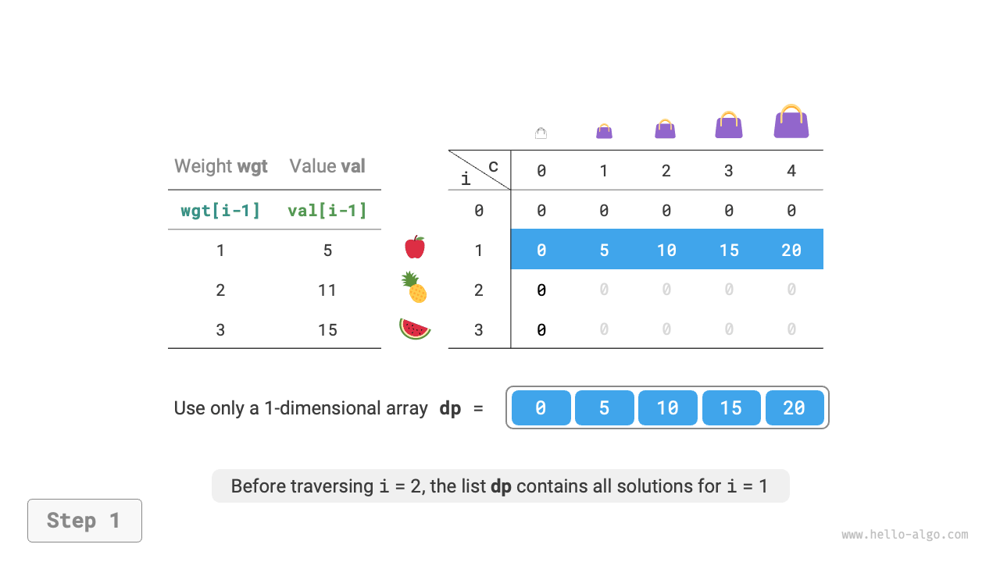

=== "<2>"
    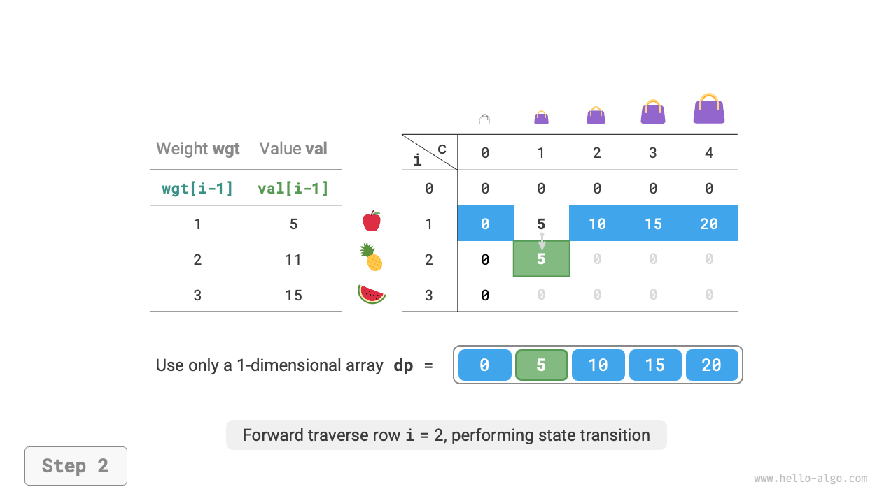

=== "<3>"
    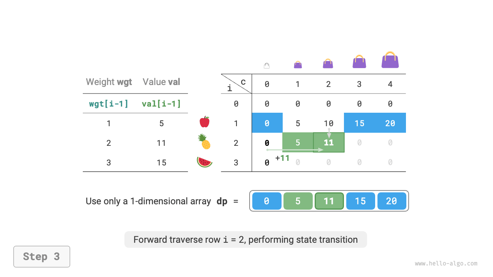

=== "<4>"
    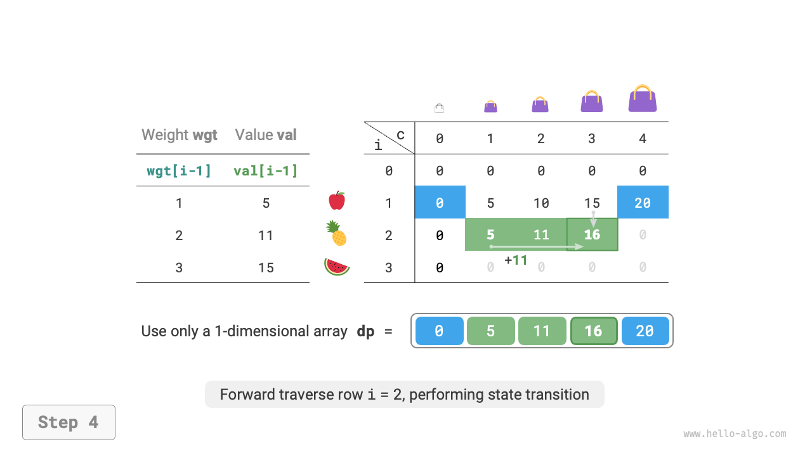

=== "<5>"
    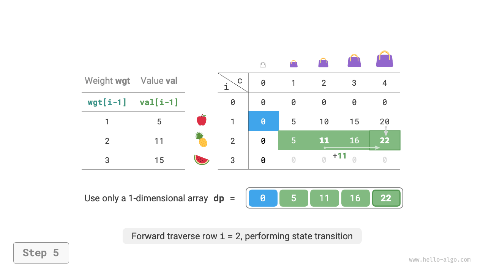

=== "<6>"
    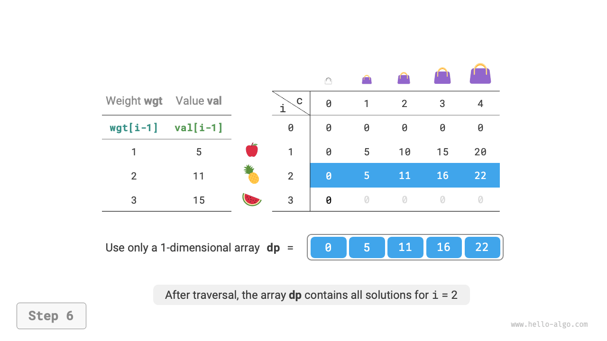

Mã nguồn triển khai tương đối đơn giản, chỉ cần xóa chiều đầu tiên của mảng `dp`:

```src
[file]{unbounded_knapsack}-[class]{}-[func]{unbounded_knapsack_dp_comp}
```

## Bài toán Đổi tiền lẻ (Coin Change)

Bài toán cái túi đại diện cho một lớp lớn các bài toán quy hoạch động và có nhiều biến thể, chẳng hạn như bài toán đổi tiền lẻ.

!!! question

    Cho $n$ loại tiền xu, trong đó mệnh giá của loại thứ $i$ là $coins[i - 1]$, và số tiền mục tiêu là $amt$. **Mỗi loại tiền xu có thể được chọn nhiều lần**. Số lượng tiền xu tối thiểu cần thiết để tạo thành số tiền mục tiêu là bao nhiêu? Nếu không thể tạo thành số tiền mục tiêu, hãy trả về $-1$. Một ví dụ được hiển thị trong hình bên dưới.

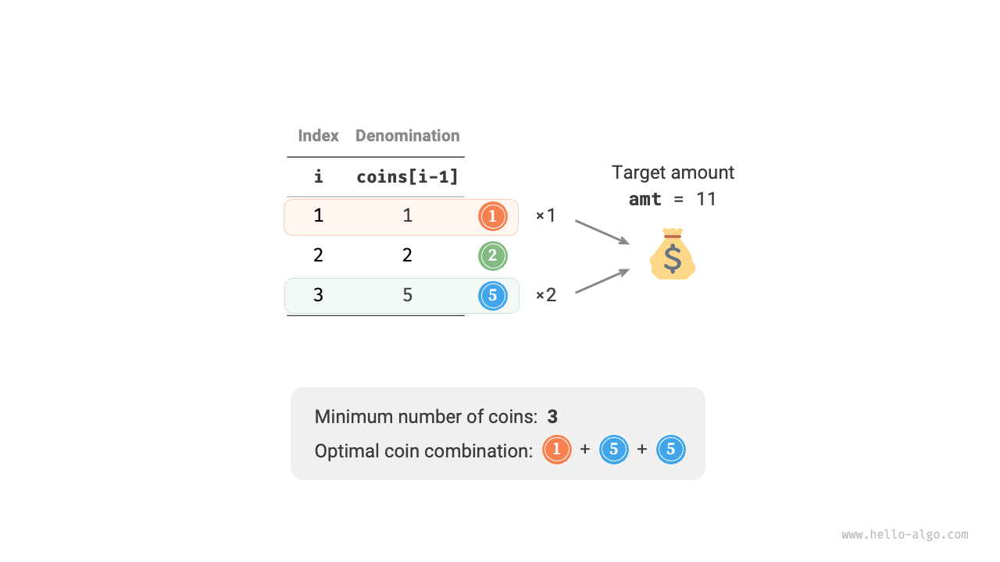

### Phương pháp Quy hoạch động

**Bài toán đổi tiền lẻ có thể được xem như một trường hợp đặc biệt của bài toán cái túi hoàn toàn**, với các mối liên hệ và khác biệt sau.

- Hai bài toán có thể chuyển đổi cho nhau: "đồ vật" tương ứng với "đồng xu", "trọng lượng đồ vật" tương ứng với "mệnh giá đồng xu", và "sức chứa cái túi" tương ứng với "số tiền mục tiêu".
- Các mục tiêu tối ưu hóa là ngược nhau: bài toán cái túi hoàn toàn nhằm mục đích tối đa hóa giá trị đồ vật, trong khi bài toán đổi tiền lẻ nhằm mục đích tối thiểu hóa số lượng đồng xu.
- Bài toán cái túi hoàn toàn tìm kiếm các lời giải "không vượt quá" sức chứa cái túi, trong khi bài toán đổi tiền lẻ tìm kiếm các lời giải "chính xác" tạo thành số tiền mục tiêu.

**Bước 1: Suy nghĩ về các quyết định trong mỗi vòng, định nghĩa trạng thái, và từ đó thu được bảng $dp$**

Trạng thái $[i, a]$ tương ứng với bài toán con: **số lượng đồng xu tối thiểu trong số $i$ loại tiền xu đầu tiên có thể tạo thành số tiền $a$**, ký hiệu là $dp[i, a]$.

Bảng $dp$ hai chiều có kích thước $(n+1) \times (amt+1)$.

**Bước 2: Xác định cấu trúc con tối ưu, và sau đó rút ra phương trình chuyển trạng thái**

Bài toán này khác với bài toán cái túi hoàn toàn ở hai khía cạnh sau về phương trình chuyển trạng thái.

- Bài toán này tìm kiếm giá trị nhỏ nhất, vì vậy toán tử $\max()$ cần được đổi thành $\min()$.
- Mục tiêu tối ưu hóa là số lượng đồng xu thay vì giá trị đồ vật, vì vậy khi một đồng xu được chọn, đơn giản là cộng thêm $1$.

$$
dp[i, a] = \min(dp[i-1, a], dp[i, a - coins[i-1]] + 1)
$$

**Bước 3: Xác định các điều kiện biên và thứ tự chuyển trạng thái**

Khi số tiền mục tiêu là $0$, số lượng đồng xu tối thiểu cần thiết để tạo thành nó là $0$, vì vậy tất cả $dp[i, 0]$ ở cột đầu tiên đều bằng $0$.

Khi không có đồng xu nào, **không thể tạo thành bất kỳ số tiền nào $> 0$**, đây là một lời giải không hợp lệ. Để cho phép hàm $\min()$ trong phương trình chuyển trạng thái nhận diện và lọc ra các lời giải không hợp lệ, chúng ta cân nhắc sử dụng $+ \infty$ để đại diện cho chúng, tức là đặt tất cả $dp[0, a]$ ở hàng đầu tiên thành $+ \infty$.

### Triển khai Mã nguồn

Hầu hết các ngôn ngữ lập trình không cung cấp biến $+ \infty$, và chỉ có thể sử dụng giá trị lớn nhất của kiểu số nguyên `int` để thay thế. Tuy nhiên, điều này có thể dẫn đến tràn số nguyên: thao tác $+ 1$ trong phương trình chuyển trạng thái có thể gây ra tràn số.

Vì lý do này, chúng ta sử dụng số $amt + 1$ để đại diện cho các lời giải không hợp lệ, vì số lượng đồng xu tối đa cần thiết để tạo thành $amt$ tối đa chỉ là $amt$. Trước khi trả về, hãy kiểm tra xem $dp[n, amt]$ có bằng $amt + 1$ hay không; nếu có, trả về $-1$, chỉ ra rằng không thể tạo thành số tiền mục tiêu. Mã nguồn như sau:

```src
[file]{coin_change}-[class]{}-[func]{coin_change_dp}
```

Hình bên dưới hiển thị quá trình quy hoạch động cho bài toán đổi tiền lẻ, rất giống với bài toán cái túi hoàn toàn.

=== "<1>"
    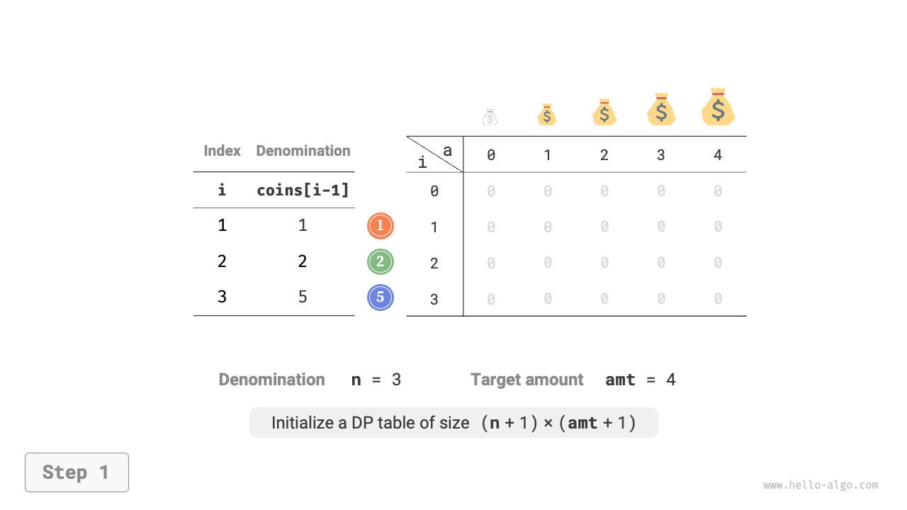

=== "<2>"
    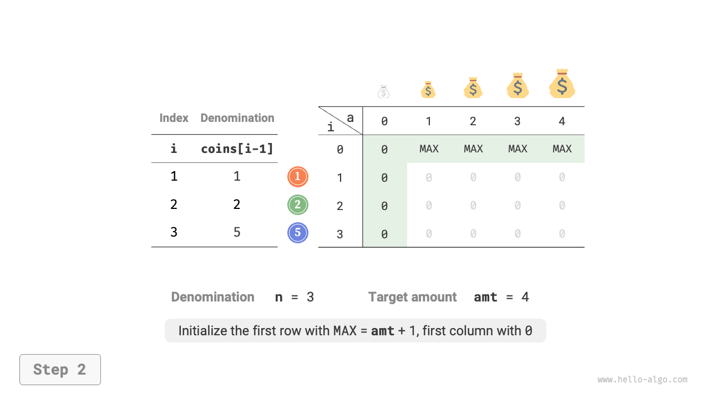

=== "<3>"
    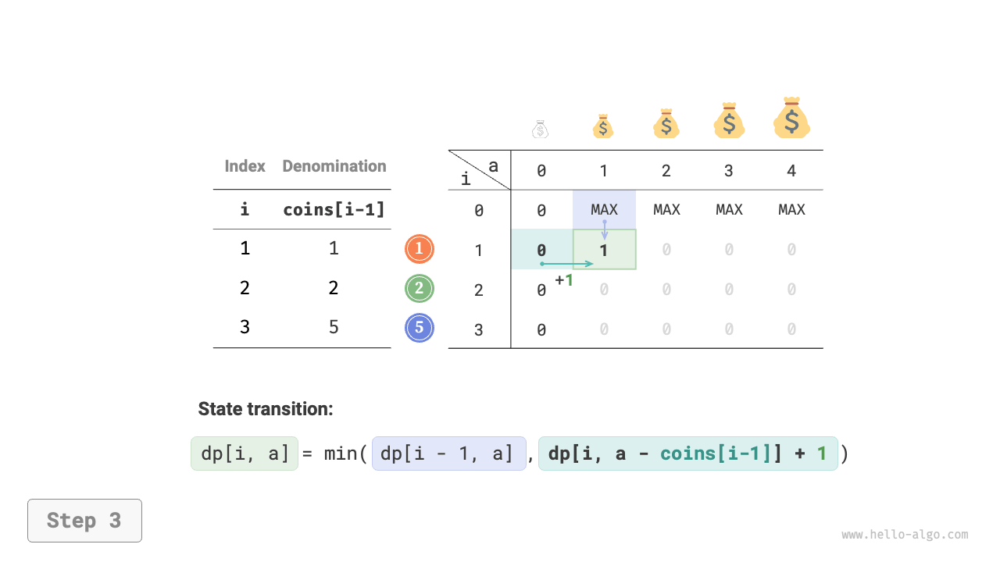

=== "<4>"
    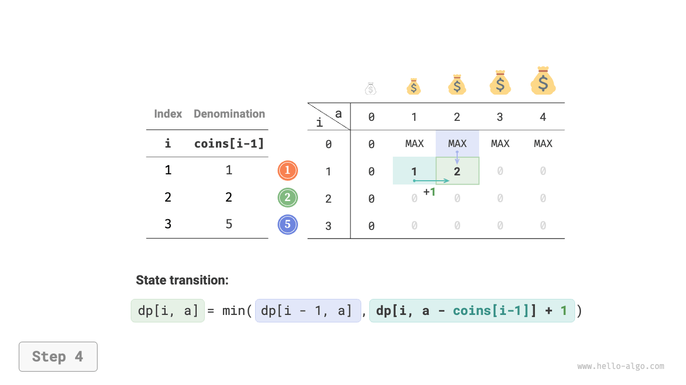

=== "<5>"
    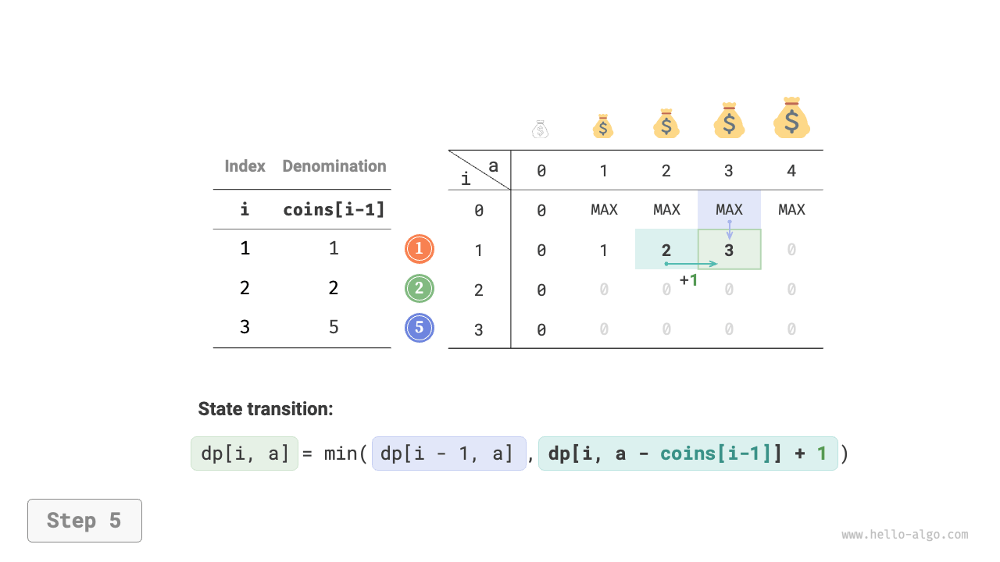

=== "<6>"
    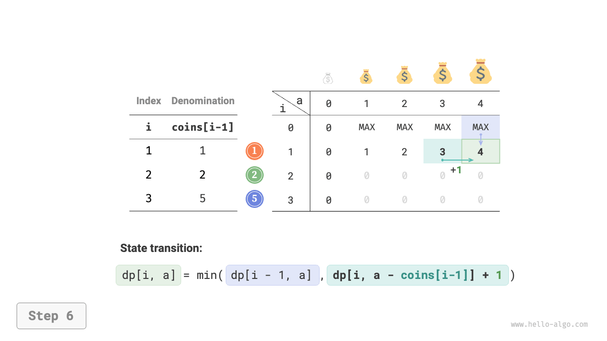

=== "<7>"
    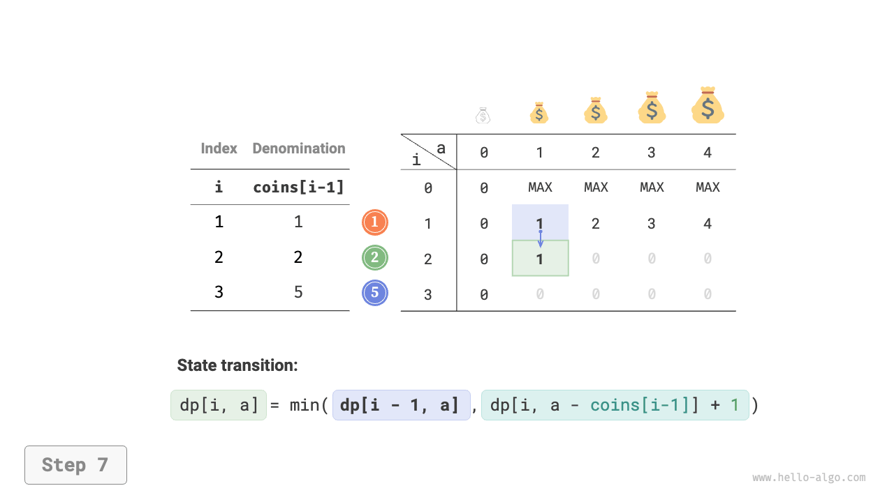

=== "<8>"
    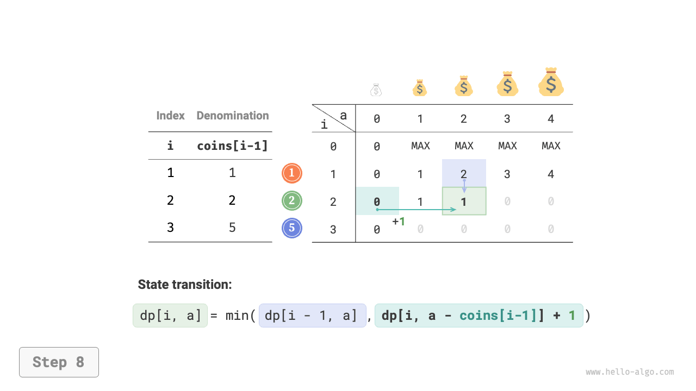

=== "<9>"
    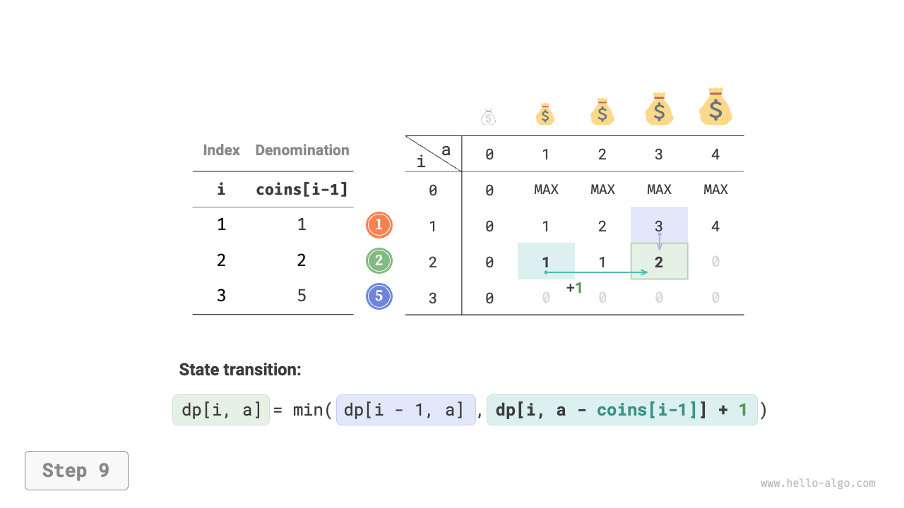

=== "<10>"
    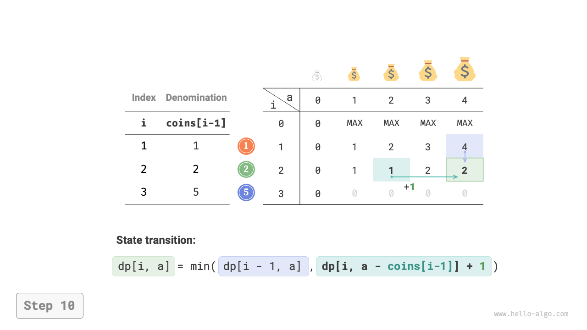

=== "<11>"
    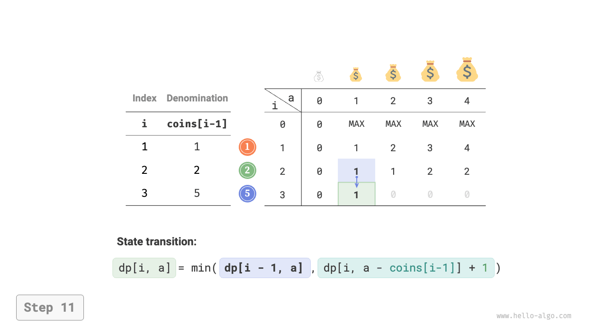

=== "<12>"
    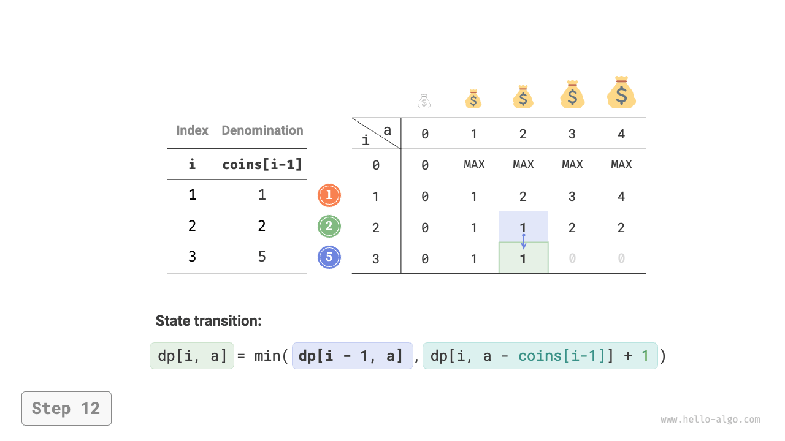

=== "<13>"
    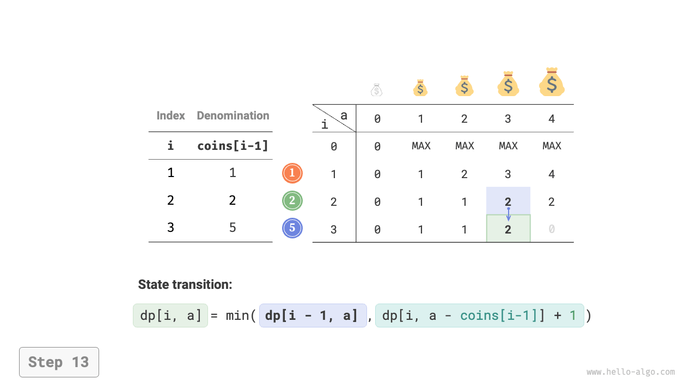

=== "<14>"
    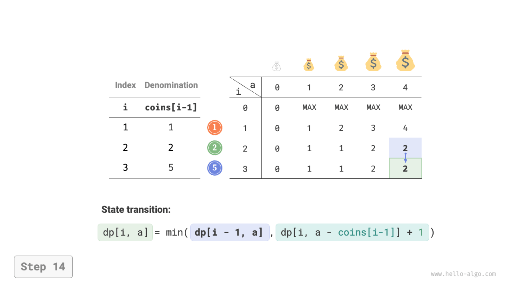

=== "<15>"
    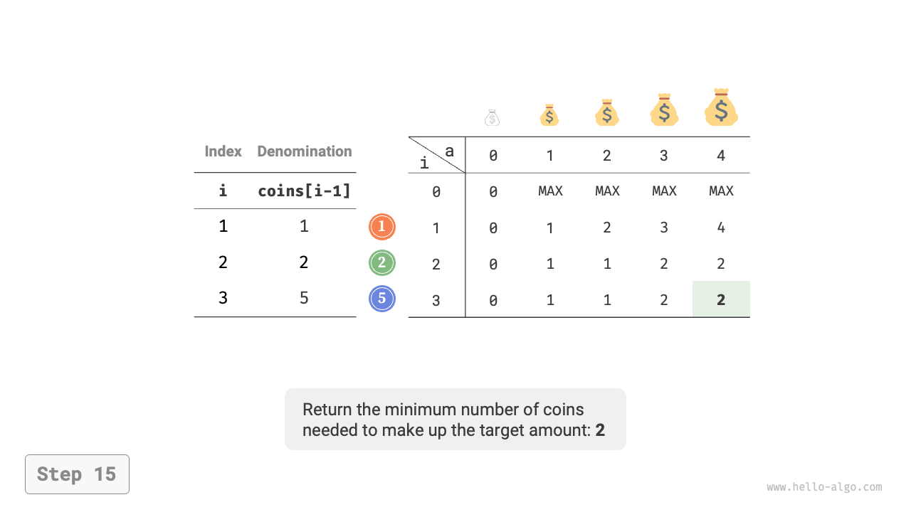

### Tối ưu hóa Không gian

Tối ưu hóa không gian cho bài toán đổi tiền lẻ được xử lý theo cùng một cách như bài toán cái túi hoàn toàn:

```src
[file]{coin_change}-[class]{}-[func]{coin_change_dp_comp}
```

## Bài toán Đổi tiền lẻ II (Coin Change II)

!!! question

    Cho $n$ loại tiền xu, trong đó mệnh giá của loại thứ $i$ là $coins[i - 1]$, và số tiền mục tiêu là $amt$. Mỗi loại tiền xu có thể được chọn nhiều lần. **Số lượng các tổ hợp tiền xu có thể tạo thành số tiền mục tiêu là bao nhiêu?** Một ví dụ được hiển thị trong hình bên dưới.

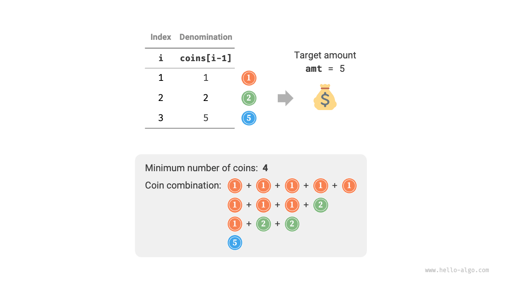

### Phương pháp Quy hoạch động

So với bài toán trước, mục tiêu của bài toán này là tìm số lượng tổ hợp, vì vậy bài toán con trở thành: **số lượng tổ hợp trong số $i$ loại tiền xu đầu tiên có thể tạo thành số tiền $a$**. Bảng $dp$ vẫn là một ma trận hai chiều kích thước $(n+1) \times (amt + 1)$.

Số lượng tổ hợp cho trạng thái hiện tại bằng tổng số lượng tổ hợp từ việc không chọn đồng xu hiện tại và chọn đồng xu hiện tại. Phương trình chuyển trạng thái là:

$$
dp[i, a] = dp[i-1, a] + dp[i, a - coins[i-1]]
$$

Khi số tiền mục tiêu là $0$, không cần chọn đồng xu nào để tạo thành số tiền mục tiêu, vì vậy tất cả $dp[i, 0]$ ở cột đầu tiên nên được khởi tạo thành $1$. Khi không có đồng xu nào, không thể tạo thành bất kỳ số tiền nào $>0$, vì vậy tất cả $dp[0, a]$ ở hàng đầu tiên đều bằng $0$.

### Triển khai Mã nguồn

```src
[file]{coin_change_ii}-[class]{}-[func]{coin_change_ii_dp}
```

### Tối ưu hóa Không gian

Tối ưu hóa không gian được xử lý theo cùng một cách, chỉ cần xóa chiều đồng xu:

```src
[file]{coin_change_ii}-[class]{}-[func]{coin_change_ii_dp_comp}
```
