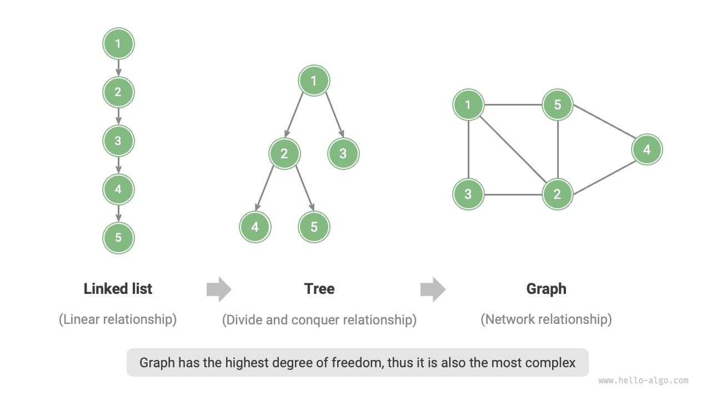
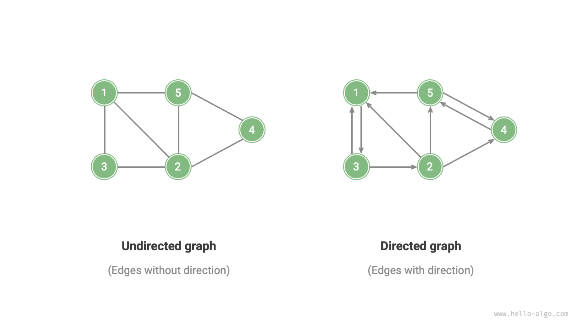
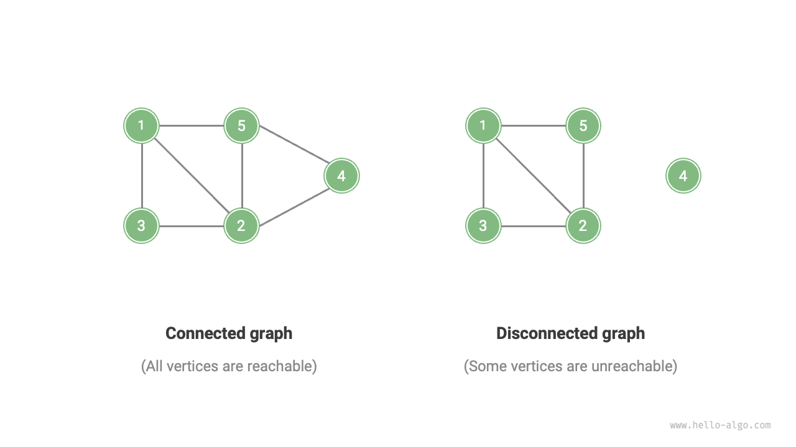
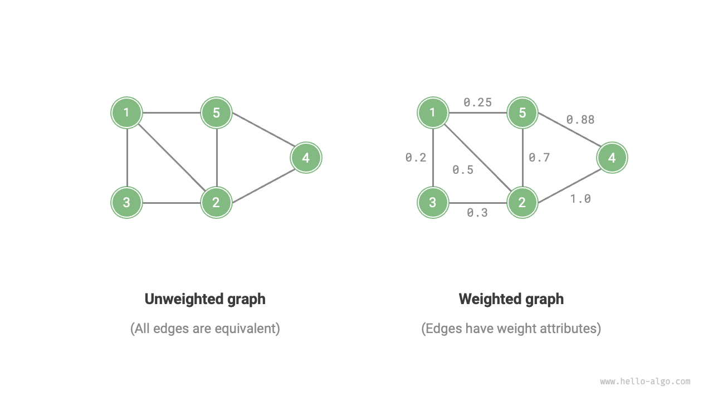
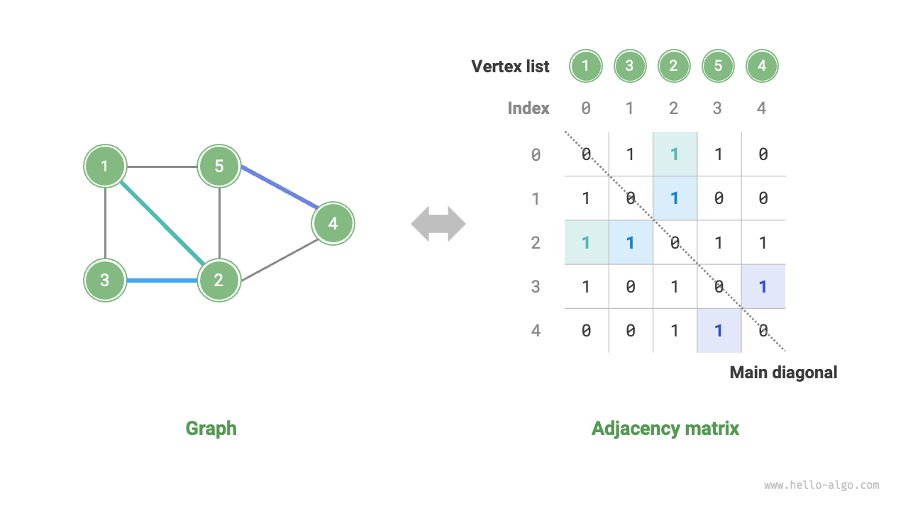
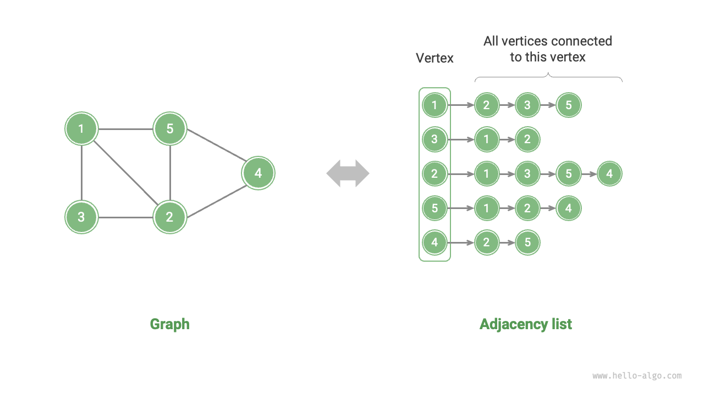

# 9.1 &nbsp; Graph

Một <u>graph</u> (đồ thị) là một loại cấu trúc dữ liệu phi tuyến tính, bao gồm các <u>vertices</u>
(đỉnh) và <u>edges</u> (cạnh). Một `graph` $G$ có thể được biểu diễn một cách trừu tượng
dưới dạng một tập hợp các `vertices` $V$ và một tập hợp các `edges` $E$. Ví dụ sau
đây minh họa một `graph` chứa 5 `vertices` và 7 `edges`.

$$
\begin{aligned}
V & = \{ 1, 2, 3, 4, 5 \} \newline
E & = \{ (1,2), (1,3), (1,5), (2,3), (2,4), (2,5), (4,5) \} \newline
G & = \{ V, E \} \newline
\end{aligned}
$$

Nếu các `vertices` được xem là `node` và các `edges` là các `tham chiếu` (`con trỏ`)
kết nối các `node`, thì các `graph` có thể được xem là một `cấu trúc dữ liệu` mở rộng
từ `linked list`. Như được minh họa trong Hình 9-1, **so với các quan hệ tuyến tính
(`linked list`) và các quan hệ phân cấp (`tree`), thì các quan hệ mạng (`graph`)
phức tạp hơn do mức độ tự do cao hơn của chúng**.

{ class="animation-figure" }

 Hình 9-1 &nbsp; Mối quan hệ giữa linked list, tree và graph 

## 9.1.1 &nbsp; Các loại và thuật ngữ phổ biến của graph

Graph có thể được chia thành <u>undirected graphs (graph vô hướng)</u> và
<u>directed graphs (graph có hướng)</u> tùy thuộc vào việc các cạnh có hướng
hay không, như được minh họa trong Hình 9-2.

- Trong undirected graphs, các cạnh đại diện cho một kết nối "hai chiều"
giữa hai đỉnh, ví dụ, "bạn bè" trên Facebook.
- Trong directed graphs, các cạnh có tính định hướng, nghĩa là các cạnh
$A \rightarrow B$ và $A \leftarrow B$ độc lập với nhau. Ví dụ, mối quan hệ
"follow" và "followed" trên Instagram hoặc TikTok.

{ class="animation-figure" }

 Hình 9-2 &nbsp; Directed graphs và undirected graphs 

Tùy thuộc vào việc tất cả các đỉnh có được kết nối hay không, graph có thể
được chia thành <u>connected graphs (graph liên thông)</u> và
<u>disconnected graphs (graph không liên thông)</u>, như được minh họa trong
Hình 9-3.

- Đối với connected graphs, có thể đi tới bất kỳ đỉnh nào khác bắt đầu từ
một đỉnh bất kỳ.
- Đối với disconnected graphs, có ít nhất một đỉnh mà không thể đi tới
được từ một đỉnh xuất phát bất kỳ.

{ class="animation-figure" }

 Hình 9-3 &nbsp; Connected graphs và disconnected graphs 

Chúng ta cũng có thể thêm một biến trọng số vào các cạnh, tạo ra
<u>weighted graphs (graph có trọng số)</u> như được minh họa trong Hình 9-4.
Ví dụ, trên Instagram, hệ thống sắp xếp danh sách người theo dõi và đang theo dõi
của bạn theo mức độ tương tác giữa bạn và những người dùng khác (likes, views,
comments, v.v.). Một mạng lưới tương tác như vậy có thể được biểu diễn bằng
một weighted graph.

{ class="animation-figure" }

 Hình 9-4 &nbsp; Weighted graphs và unweighted graphs 

Cấu trúc dữ liệu graph bao gồm các thuật ngữ thường dùng sau đây.

- <u>Kề nhau (Adjacency)</u>: Khi có một cạnh kết nối hai đỉnh, hai đỉnh này
được gọi là "kề nhau". Trong Hình 9-4, các đỉnh kề nhau của đỉnh 1 là
đỉnh 2, 3 và 5.
- <u>Đường đi (Path)</u>: Dãy các cạnh đi qua từ đỉnh A đến đỉnh B được gọi
là một đường đi từ A đến B. Trong Hình 9-4, dãy cạnh 1-5-2-4 là một
đường đi từ đỉnh 1 đến đỉnh 4.
- <u>Bậc (Degree)</u>: Số lượng cạnh mà một đỉnh có. Đối với directed graphs,
<u>bậc vào (in-degree)</u> chỉ số lượng cạnh đi vào đỉnh, và
<u>bậc ra (out-degree)</u> chỉ số lượng cạnh đi ra từ đỉnh.

## 9.1.2 &nbsp; Biểu diễn graph

Các cách biểu diễn graph phổ biến bao gồm "adjacency matrix" và "adjacency list".
Các ví dụ sau đây sử dụng undirected graph.

### 1. &nbsp; Adjacency matrix (Ma trận kề)

Giả sử số lượng đỉnh trong graph là $n$, `adjacency matrix` (ma trận kề)
sử dụng một ma trận $n \times n$ để biểu diễn graph, trong đó mỗi hàng (cột)
đại diện cho một đỉnh, và các phần tử của ma trận đại diện cho các cạnh,
với $1$ hoặc $0$ cho biết liệu có một cạnh giữa hai đỉnh hay không.

Như được thể hiện trong Hình 9-5, gọi adjacency matrix là $M$, và danh sách
các đỉnh là $V$, thì phần tử ma trận $M[i, j] = 1$ cho biết có một cạnh
giữa đỉnh $V[i]$ và đỉnh $V[j]$, ngược lại $M[i, j] = 0$ cho biết không
có cạnh giữa hai đỉnh đó.

{ class="animation-figure" }

 Hình 9-5 &nbsp; Biểu diễn một graph bằng adjacency matrix 

Adjacency matrix có các đặc điểm sau.

- Một đỉnh không thể tự kết nối với chính nó, do đó các phần tử trên đường chéo
chính của adjacency matrix là vô nghĩa.
- Đối với undirected graph, các cạnh theo cả hai hướng là tương đương, do đó
adjacency matrix là đối xứng qua đường chéo chính.
- Bằng cách thay thế các phần tử của adjacency matrix từ $1$ và $0$ bằng
trọng số, chúng ta có thể biểu diễn weighted graph.

Khi biểu diễn graph bằng adjacency matrix, chúng ta có thể truy cập trực
tiếp các phần tử ma trận để lấy các cạnh, dẫn đến các thao tác thêm, xóa,
tra cứu và sửa đổi hiệu quả, tất cả đều có time complexity là $O(1)$.
Tuy nhiên, space complexity của ma trận là $O(n^2)$, điều này tiêu tốn
nhiều bộ nhớ hơn.

### 2. &nbsp; Adjacency list (Danh sách kề)

`Adjacency list` (danh sách kề) sử dụng $n$ linked list để biểu diễn graph,
với mỗi node của linked list đại diện cho một đỉnh. Linked list thứ $i$
tương ứng với đỉnh $i$ và chứa tất cả các đỉnh kề (các đỉnh được kết nối
với đỉnh đó). Hình 9-6 cho thấy một ví dụ về một graph được lưu trữ bằng
cách sử dụng adjacency list.

{ class="animation-figure" }

 Hình 9-6 &nbsp; Biểu diễn một graph bằng adjacency list 

Adjacency list chỉ lưu trữ các cạnh thực tế, và tổng số cạnh thường ít hơn
nhiều so với $n^2$, giúp nó tiết kiệm space hơn. Tuy nhiên, việc tìm kiếm
các cạnh trong adjacency list yêu cầu duyệt qua linked list, do đó hiệu quả
về time của nó không tốt bằng của adjacency matrix.

Quan sát Hình 9-6, **cấu trúc của adjacency list rất giống với cơ chế**
**"chaining" trong hash table, do đó chúng ta có thể sử dụng các phương pháp**
**tương tự để tối ưu hóa hiệu suất**. Ví dụ, khi linked list dài, nó có thể
được chuyển đổi thành AVL tree hoặc red-black tree, do đó tối ưu hóa hiệu suất
thời gian từ $O(n)$ xuống $O(\log n)$; linked list cũng có thể được chuyển đổi
thành một hash table, do đó giảm time complexity xuống $O(1)$.

## 9.1.3 &nbsp; Ứng dụng phổ biến của graph

Như được thể hiện trong Bảng 9-1, nhiều hệ thống trong thế giới thực có thể được
mô hình hóa bằng graph, và các bài toán tương ứng có thể được quy về các bài
toán tính toán trên graph.

 Bảng 9-1 &nbsp; Các graph phổ biến trong đời sống thực 

| ------------------- | Đỉnh       | Cạnh                           | Bài toán tính toán trên graph |
| ------------------- | ---------- | ------------------------------ | ----------------------------- |
| Mạng xã hội         | Người dùng | Theo dõi / Được theo dõi       | Đề xuất theo dõi tiềm năng    |
| Tuyến tàu điện ngầm | Nhà ga     | Kết nối giữa các nhà ga        | Đề xuất tuyến đường ngắn nhất |
| Hệ mặt trời         | Thiên thể  | Lực hấp dẫn giữa các thiên thể | Tính toán quỹ đạo hành tinh   |

