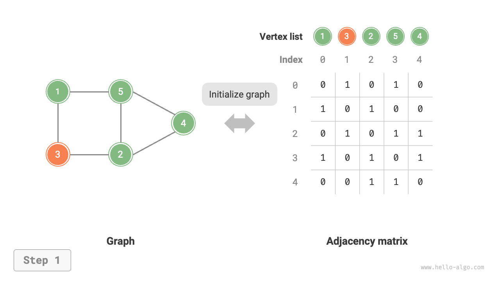
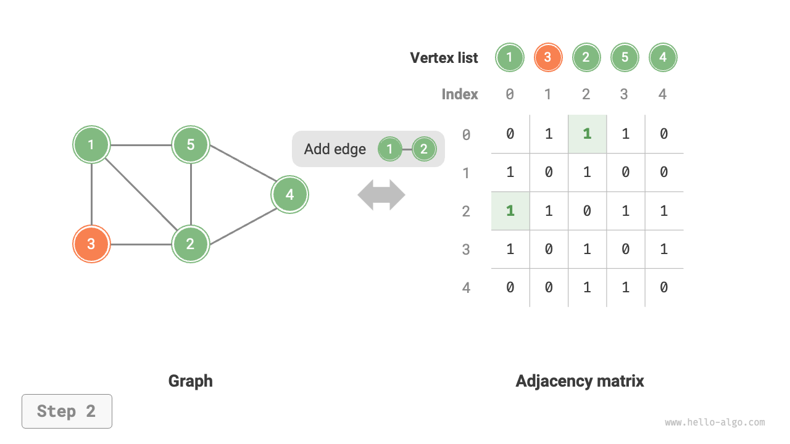
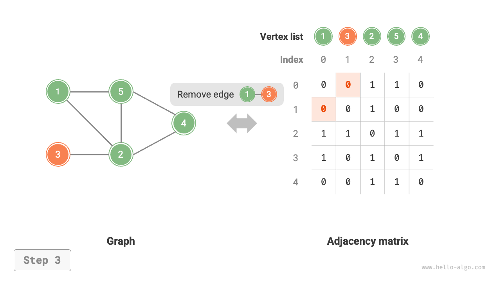
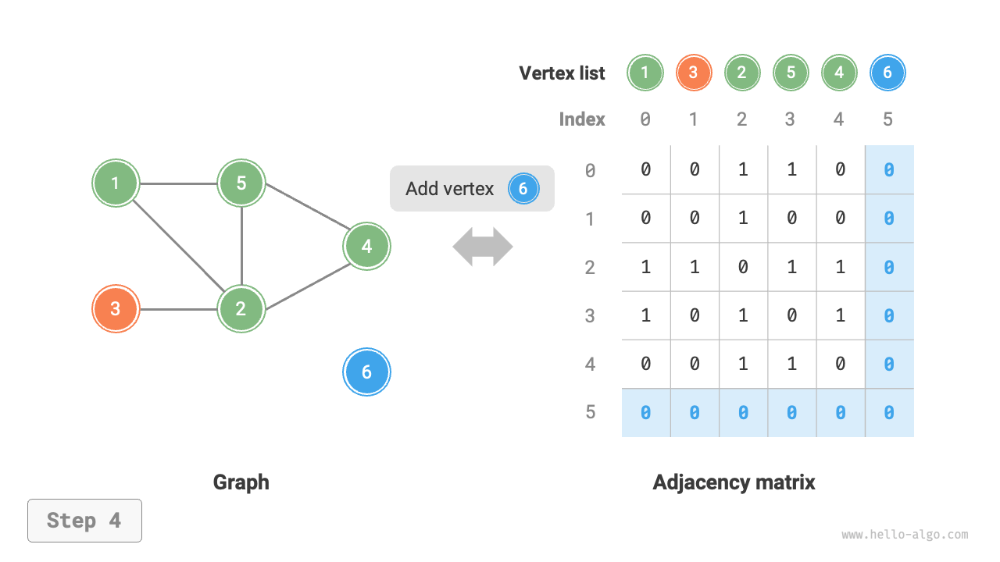
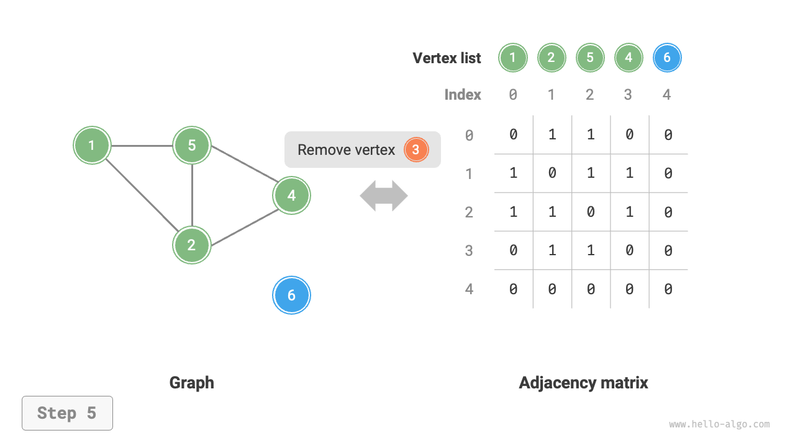
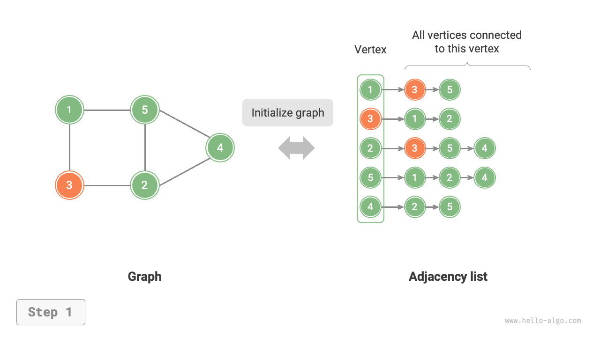
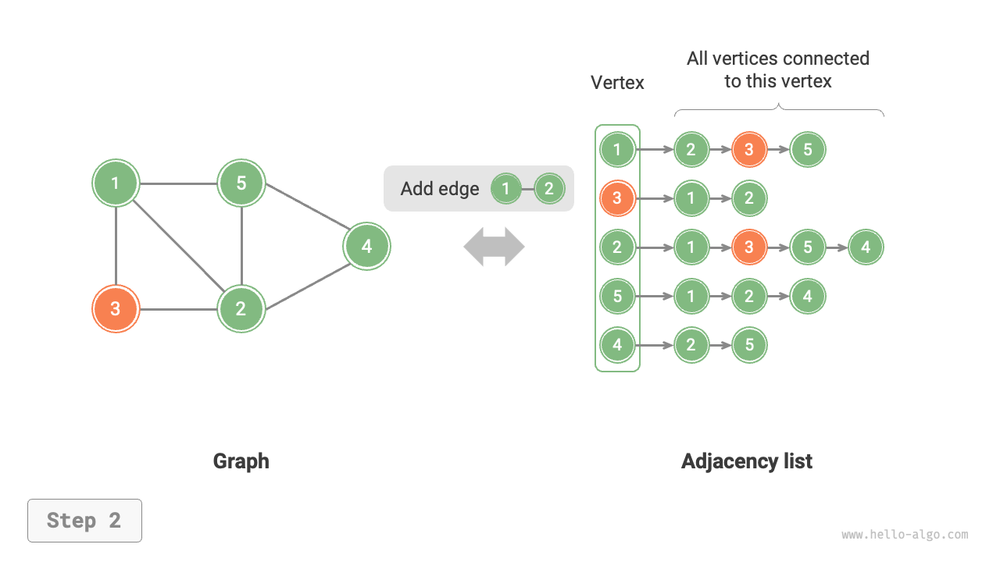
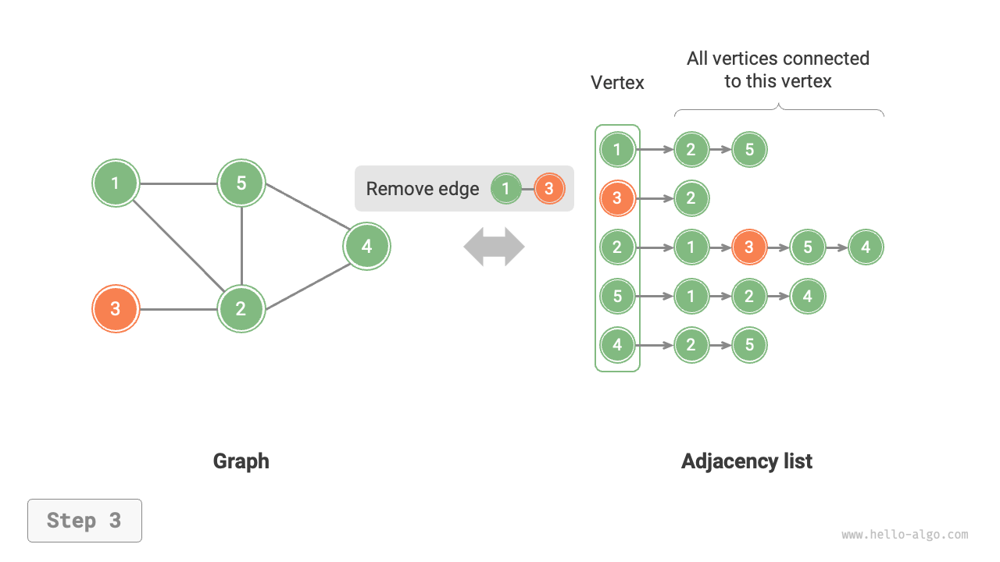
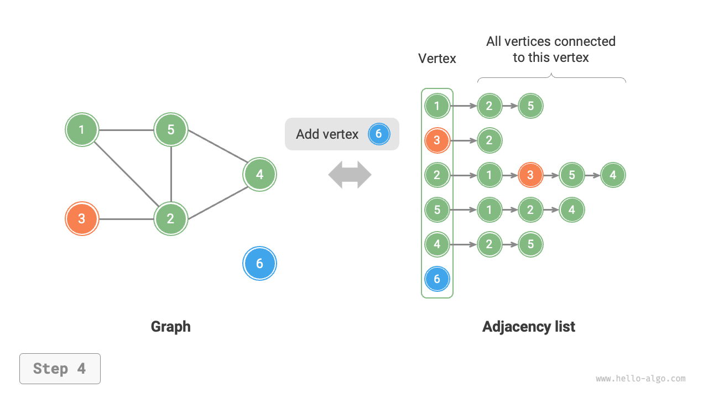
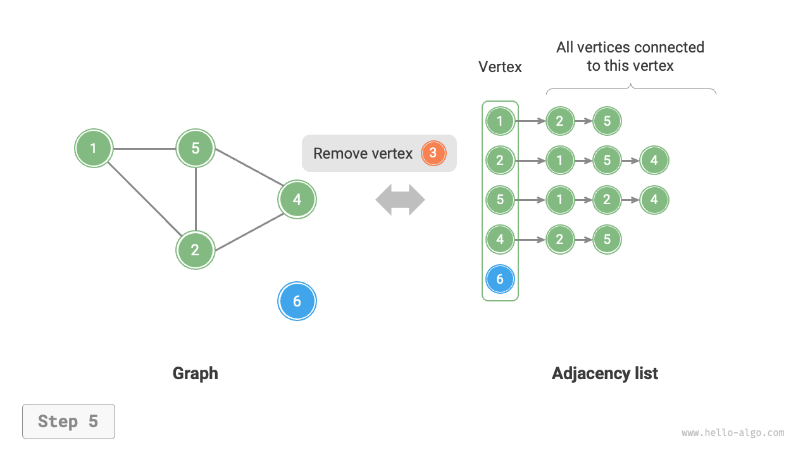

# 9.2 &nbsp; Hoạt động cơ bản trên graph

Các hoạt động cơ bản trên graph có thể được chia thành các hoạt động trên "cạnh"
và các hoạt động trên "đỉnh". Theo hai phương pháp biểu diễn là "ma trận kề"
và "danh sách kề", các triển khai là khác nhau.

## 9.2.1 &nbsp; Triển khai dựa trên adjacency matrix

Cho một graph (đồ thị) vô hướng với $n$ đỉnh (vertex), các thao tác khác nhau
được triển khai như minh họa trong Hình 9-7.

- **Thêm hoặc xóa cạnh**: Trực tiếp sửa đổi cạnh được chỉ định trong adjacency
matrix, sử dụng time complexity $O(1)$. Vì đây là một graph vô hướng,
cần phải cập nhật các cạnh theo cả hai hướng đồng thời.
- **Thêm đỉnh**: Thêm một hàng và một cột vào cuối adjacency matrix và điền
tất cả các phần tử với $0$, sử dụng time complexity $O(n)$.
- **Xóa đỉnh**: Xóa một hàng và một cột trong adjacency matrix. worst case
(trường hợp xấu nhất) là khi hàng và cột đầu tiên bị xóa, yêu cầu $(n-1)^2$
phần tử phải được "dịch lên và sang trái", do đó sử dụng time complexity
$O(n^2)$.
- **Khởi tạo**: Truyền vào $n$ đỉnh, khởi tạo một list đỉnh `vertices` có độ
dài $n$, sử dụng time complexity $O(n)$; khởi tạo một adjacency matrix
`adjMat` kích thước $n \times n$, sử dụng time complexity $O(n^2)$.

=== "Khởi tạo adjacency matrix"
    { class="animation-figure" }

=== "Thêm cạnh"
    { class="animation-figure" }

=== "Xóa cạnh"
    { class="animation-figure" }

=== "Thêm đỉnh"
    { class="animation-figure" }

=== "Xóa đỉnh"
    { class="animation-figure" }

<p align="center"> Hình 9-7 &nbsp; Khởi tạo, thêm và xóa cạnh, thêm và xóa đỉnh trong adjacency matrix </p>

Dưới đây là mã triển khai cho các graph được biểu diễn bằng adjacency matrix:

=== "Python"

    ```python title="graph_adjacency_matrix.py"
    class GraphAdjMat:
        """Lớp graph vô hướng dựa trên adjacency matrix"""

        def __init__(self, vertices: list[int], edges: list[list[int]]):
            """Hàm tạo"""
            # List đỉnh, các phần tử đại diện cho "giá trị đỉnh", chỉ số đại diện cho "chỉ số đỉnh"
            self.vertices: list[int] = []
            # Adjacency matrix, các chỉ số hàng và cột tương ứng với "chỉ số đỉnh"
            self.adj_mat: list[list[int]] = []
            # Thêm đỉnh
            for val in vertices:
                self.add_vertex(val)
            # Thêm cạnh
            # Các phần tử của edges đại diện cho chỉ số đỉnh
            for e in edges:
                self.add_edge(e[0], e[1])

        def size(self) -> int:
            """Lấy số lượng đỉnh"""
            return len(self.vertices)

        def add_vertex(self, val: int):
            """Thêm đỉnh"""
            n = self.size()
            # Thêm giá trị đỉnh mới vào danh sách các đỉnh
            self.vertices.append(val)
            # Thêm một hàng vào adjacency matrix
            new_row = [0] * n
            self.adj_mat.append(new_row)
            # Thêm một cột vào adjacency matrix
            for row in self.adj_mat:
                row.append(0)

        def remove_vertex(self, index: int):
            """Xóa đỉnh"""
            if index >= self.size():
                raise IndexError()
            # Xóa đỉnh tại `index` khỏi danh sách các đỉnh
            self.vertices.pop(index)
            # Xóa hàng tại `index` khỏi adjacency matrix
            self.adj_mat.pop(index)
            # Xóa cột tại `index` khỏi adjacency matrix
            for row in self.adj_mat:
                row.pop(index)

        def add_edge(self, i: int, j: int):
            """Thêm cạnh"""
            # Các tham số i, j tương ứng với các chỉ số phần tử đỉnh
            # Xử lý các chỉ số nằm ngoài giới hạn và trường hợp bằng nhau
            if i < 0 or j < 0 or i >= self.size() or j >= self.size() or i == j:
                raise IndexError()
            # Trong đồ thị vô hướng, adjacency matrix đối xứng qua đường chéo chính,
            # tức là thỏa mãn (i, j) == (j, i)
            self.adj_mat[i][j] = 1
            self.adj_mat[j][i] = 1

        def remove_edge(self, i: int, j: int):
            """Xóa cạnh"""
            # Các tham số i, j tương ứng với các chỉ số phần tử đỉnh
            # Xử lý các chỉ số nằm ngoài giới hạn và trường hợp bằng nhau
            if i < 0 or j < 0 or i >= self.size() or j >= self.size() or i == j:
                raise IndexError()
            self.adj_mat[i][j] = 0
            self.adj_mat[j][i] = 0

        def print(self):
            """In adjacency matrix"""
            print("Danh sách đỉnh =", self.vertices)
            print("Adjacency matrix =")
            print_matrix(self.adj_mat)
    ```

=== "C++"

    ```cpp title="graph_adjacency_matrix.cpp"
    /* Lớp đồ thị vô hướng dựa trên adjacency matrix */
    class GraphAdjMat {
        vector<int> vertices;       // Danh sách đỉnh, các phần tử biểu thị "giá trị đỉnh", chỉ số biểu thị "chỉ số đỉnh"
        vector<vector<int>> adjMat; // Adjacency matrix, các chỉ số hàng và cột tương ứng với "chỉ số đỉnh"

      public:
        /* Hàm khởi tạo */
        GraphAdjMat(const vector<int> &vertices, const vector<vector<int>> &edges) {
            // Thêm đỉnh
            for (int val : vertices) {
                addVertex(val);
            }
            // Thêm cạnh
            // Các phần tử của cạnh biểu thị các chỉ số đỉnh
            for (const vector<int> &edge : edges) {
                addEdge(edge[0], edge[1]);
            }
        }

        /* Lấy số lượng đỉnh */
        int size() const {
            return vertices.size();
        }

        /* Thêm đỉnh */
        void addVertex(int val) {
            int n = size();
            // Thêm giá trị đỉnh mới vào danh sách đỉnh
            vertices.push_back(val);
            // Thêm một hàng vào ma trận kề
            adjMat.emplace_back(vector<int>(n, 0));
            // Thêm một cột vào ma trận kề
            for (vector<int> &row : adjMat) {
                row.push_back(0);
            }
        }

        /* Xóa đỉnh */
        void removeVertex(int index) {
            if (index >= size()) {
                throw out_of_range("Đỉnh không tồn tại");
            }
            // Xóa đỉnh tại `index` khỏi danh sách đỉnh
            vertices.erase(vertices.begin() + index);
            // Xóa hàng tại `index` khỏi ma trận kề
            adjMat.erase(adjMat.begin() + index);
            // Xóa cột tại `index` khỏi ma trận kề
            for (vector<int> &row : adjMat) {
                row.erase(row.begin() + index);
            }
        }

        /* Thêm cạnh */
        // Các tham số i, j tương ứng với các chỉ số phần tử của đỉnh
        void addEdge(int i, int j) {
            // Xử lý chỉ số ngoài giới hạn và trường hợp bằng nhau
            if (i < 0 || j < 0 || i >= size() || j >= size() || i == j) {
                throw out_of_range("Đỉnh không tồn tại");
            }
            // Trong một graph vô hướng, ma trận kề đối xứng qua đường chéo chính,
            // tức là thỏa mãn (i, j) == (j, i)
            adjMat[i][j] = 1;
            adjMat[j][i] = 1;
        }

        /* Xóa cạnh */
        // Các tham số i, j tương ứng với các chỉ số phần tử của đỉnh
        void removeEdge(int i, int j) {
            // Xử lý chỉ số ngoài giới hạn và trường hợp bằng nhau
            if (i < 0 || j < 0 || i >= size() || j >= size() || i == j) {
                throw out_of_range("Đỉnh không tồn tại");
            }
            adjMat[i][j] = 0;
            adjMat[j][i] = 0;
        }

        /* In ma trận kề */
        void print() {
            cout << "Danh sách đỉnh = ";
            printVector(vertices);
            cout << "Ma trận kề =" << endl;
            printVectorMatrix(adjMat);
        }
    };
    ```

=== "Java"

    ```java title="graph_adjacency_matrix.java"
    /* Lớp graph vô hướng dựa trên ma trận kề */
    class GraphAdjMat {
        List<Integer> vertices; // Danh sách đỉnh, các phần tử đại diện cho "giá trị đỉnh",
                                // chỉ số đại diện cho "chỉ số đỉnh"
        List<List<Integer>> adjMat; // Ma trận kề, các chỉ số hàng và cột tương ứng với
                                    // "chỉ số đỉnh"
        /* Hàm khởi tạo */
        public GraphAdjMat(int[] vertices, int[][] edges) {
            this.vertices = new ArrayList<>();
            this.adjMat = new ArrayList<>();
            // Thêm đỉnh
            for (int val : vertices) {
                addVertex(val);
            }
            // Thêm cạnh
            // Các phần tử của edges đại diện cho các chỉ số đỉnh
            for (int[] e : edges) {
                addEdge(e[0], e[1]);
            }
        }

        /* Lấy số lượng đỉnh */
        public int size() {
            return vertices.size();
        }

        /* Thêm đỉnh */
        public void addVertex(int val) {
            int n = size();
            // Thêm giá trị đỉnh mới vào danh sách các đỉnh
            vertices.add(val);
            // Thêm một hàng vào adjacency matrix
            List<Integer> newRow = new ArrayList<>(n);
            for (int j = 0; j < n; j++) {
                newRow.add(0);
            }
            adjMat.add(newRow);
            // Thêm một cột vào adjacency matrix
            for (List<Integer> row : adjMat) {
                row.add(0);
            }
        }

        /* Xóa đỉnh */
        public void removeVertex(int index) {
            if (index >= size())
                throw new IndexOutOfBoundsException();
            // Xóa đỉnh tại `index` khỏi danh sách các đỉnh
            vertices.remove(index);
            // Xóa hàng tại `index` khỏi adjacency matrix
            adjMat.remove(index);
            // Xóa cột tại `index` khỏi adjacency matrix
            for (List<Integer> row : adjMat) {
                row.remove(index);
            }
        }

        /* Thêm cạnh */
        // Các tham số i, j tương ứng với các chỉ số phần tử đỉnh
        public void addEdge(int i, int j) {
            // Xử lý trường hợp chỉ số nằm ngoài giới hạn và trường hợp bằng nhau
            if (i < 0 || j < 0 || i >= size() || j >= size() || i == j)
                throw new IndexOutOfBoundsException();
            // Trong một đồ thị vô hướng, adjacency matrix đối xứng qua đường chéo chính,
            // tức là thỏa mãn (i, j) == (j, i)
            adjMat.get(i).set(j, 1);
            adjMat.get(j).set(i, 1);
        }

        /* Xóa cạnh */
        // Các tham số i, j tương ứng với các chỉ số phần tử đỉnh
        public void removeEdge(int i, int j) {
            // Xử lý trường hợp chỉ số nằm ngoài giới hạn và trường hợp bằng nhau
            if (i < 0 || j < 0 || i >= size() || j >= size() || i == j)
                throw new IndexOutOfBoundsException();
            adjMat.get(i).set(j, 0);
            adjMat.get(j).set(i, 0);
        }

        /* In adjacency matrix */
        public void print() {
            System.out.print("Danh sách đỉnh = ");
            System.out.println(vertices);
            System.out.println("Adjacency matrix =");
            PrintUtil.printMatrix(adjMat);
        }
    }
    ```

=== "C#"

    ```csharp title="graph_adjacency_matrix.cs"
    [class]{GraphAdjMat}-[func]{}
    ```

=== "Go"

    ```go title="graph_adjacency_matrix.go"
    [class]{graphAdjMat}-[func]{}
    ```

=== "Swift"

    ```swift title="graph_adjacency_matrix.swift"
    [class]{GraphAdjMat}-[func]{}
    ```

=== "JS"

    ```javascript title="graph_adjacency_matrix.js"
    [class]{GraphAdjMat}-[func]{}
    ```

=== "TS"

    ```typescript title="graph_adjacency_matrix.ts"
    [class]{GraphAdjMat}-[func]{}
    ```

=== "Dart"

    ```dart title="graph_adjacency_matrix.dart"
    [class]{GraphAdjMat}-[func]{}
    ```

=== "Rust"

    ```rust title="graph_adjacency_matrix.rs"
    [class]{GraphAdjMat}-[func]{}
    ```

=== "C"

    ```c title="graph_adjacency_matrix.c"
    [class]{GraphAdjMat}-[func]{}
    ```

=== "Kotlin"

    ```kotlin title="graph_adjacency_matrix.kt"
    [class]{GraphAdjMat}-[func]{}
    ```

=== "Ruby"

    ```ruby title="graph_adjacency_matrix.rb"
    [class]{GraphAdjMat}-[func]{}
    ```

=== "Zig"

    ```zig title="graph_adjacency_matrix.zig"
    [class]{GraphAdjMat}-[func]{}
    ```

## 9.2.2 &nbsp; Triển khai dựa trên adjacency list

Với một undirected graph có tổng cộng $n$ đỉnh và $m$ cạnh, các thao tác
khác nhau có thể được triển khai như minh họa trong Hình 9-8.

- **Thêm một cạnh**: Chỉ cần chèn cạnh vào cuối linked list của đỉnh
tương ứng, sử dụng thời gian $O(1)$. Vì đây là một undirected graph,
cần thêm các cạnh theo cả hai hướng đồng thời.
- **Xóa một cạnh**: Tìm và xóa cạnh được chỉ định trong linked list của
đỉnh tương ứng, sử dụng thời gian $O(m)$. Trong một undirected graph,
cần xóa các cạnh theo cả hai hướng đồng thời.
- **Thêm một đỉnh**: Thêm một linked list vào adjacency list và đặt đỉnh
mới làm node đầu của list, sử dụng thời gian $O(1)$.
- **Xóa một đỉnh**: Cần duyệt toàn bộ adjacency list, xóa tất cả các cạnh
bao gồm đỉnh được chỉ định, sử dụng thời gian $O(n + m)$.
- **Khởi tạo**: Tạo $n$ đỉnh và $2m$ cạnh trong adjacency list, sử dụng
thời gian $O(n + m)$.

=== "Khởi tạo adjacency list"
    { class="animation-figure" }

=== "Thêm một cạnh"
    { class="animation-figure" }

=== "Xóa một cạnh"
    { class="animation-figure" }

=== "Thêm một đỉnh"
    { class="animation-figure" }

=== "Xóa một đỉnh"
    { class="animation-figure" }

<p align="center"> Hình 9-8 &nbsp; Khởi tạo, thêm và xóa cạnh, thêm và xóa đỉnh trong adjacency list </p>

Dưới đây là triển khai code của adjacency list. So với Hình 9-8, code
thực tế có những khác biệt sau.

- Để thuận tiện hơn trong việc thêm và xóa đỉnh, và để đơn giản hóa code,
  chúng ta sử dụng lists (dynamic arrays) thay vì linked lists.
- Sử dụng một hash table để lưu trữ adjacency list, trong đó `key` là
  instance của đỉnh, `value` là list (linked list) các đỉnh kề của đỉnh đó.

Ngoài ra, chúng ta sử dụng class `Vertex` để biểu diễn các đỉnh trong
adjacency list. Lý do cho điều này là: nếu, giống như với adjacency matrix,
các chỉ số của list được dùng để phân biệt các đỉnh khác nhau, thì giả
sử bạn muốn xóa đỉnh tại chỉ số $i$, bạn sẽ cần duyệt toàn bộ adjacency list
và giảm tất cả các chỉ số lớn hơn $i$ đi $1$, điều này rất không hiệu quả.
Tuy nhiên, nếu mỗi đỉnh là một instance `Vertex` duy nhất, thì việc xóa một
đỉnh không yêu cầu bất kỳ thay đổi nào đối với các đỉnh khác.

=== "Python"

    ```python title="graph_adjacency_list.py"
    class GraphAdjList:
        """Lớp graph vô hướng dựa trên adjacency list"""

        def __init__(self, edges: list[list[Vertex]]):
            """Hàm khởi tạo"""
            # Adjacency list, key: đỉnh, value: tất cả các đỉnh kề của đỉnh đó
            self.adj_list = dict[Vertex, list[Vertex]]()
            # Thêm tất cả các đỉnh và cạnh
            for edge in edges:
                self.add_vertex(edge[0])
                self.add_vertex(edge[1])
                self.add_edge(edge[0], edge[1])

        def size(self) -> int:
            """Lấy số lượng đỉnh"""
            return len(self.adj_list)

        def add_edge(self, vet1: Vertex, vet2: Vertex):
            """Thêm cạnh"""
            if vet1 not in self.adj_list or vet2 not in self.adj_list or vet1 == vet2:
                raise ValueError()
            # Thêm cạnh vet1 - vet2
            self.adj_list[vet1].append(vet2)
            self.adj_list[vet2].append(vet1)

        def remove_edge(self, vet1: Vertex, vet2: Vertex):
            """Xóa cạnh"""
            if vet1 not in self.adj_list or vet2 not in self.adj_list or vet1 == vet2:
                raise ValueError()
            # Xóa cạnh vet1 - vet2
            self.adj_list[vet1].remove(vet2)
            self.adj_list[vet2].remove(vet1)

        def add_vertex(self, vet: Vertex):
            """Thêm đỉnh"""
            if vet in self.adj_list:
                return
            # Thêm một linked list mới vào adjacency list
            self.adj_list[vet] = []

        def remove_vertex(self, vet: Vertex):
            """Xóa đỉnh"""
            if vet not in self.adj_list:
                raise ValueError()
            # Xóa linked list tương ứng với đỉnh vet khỏi adjacency list
            self.adj_list.pop(vet)
            # Duyệt qua các linked list của các đỉnh khác, xóa tất cả các cạnh chứa vet
            for vertex in self.adj_list:
                if vet in self.adj_list[vertex]:
                    self.adj_list[vertex].remove(vet)

        def print(self):
            """In adjacency list"""
            print("Adjacency list =")
            for vertex in self.adj_list:
                tmp = [v.val for v in self.adj_list[vertex]]
                print(f"{vertex.val}: {tmp},")
    ```

=== "C++"

    ```cpp title="graph_adjacency_list.cpp"
    /* Lớp graph vô hướng dựa trên adjacency list */
    class GraphAdjList {
      public:
        // Adjacency list, key: đỉnh, value: tất cả các đỉnh kề của đỉnh đó
        unordered_map<Vertex *, vector<Vertex *>> adjList;

        /* Xóa một node được chỉ định khỏi vector */
        void remove(vector<Vertex *> &vec, Vertex *vet) {
            for (int i = 0; i < vec.size(); i++) {
                if (vec[i] == vet) {
                    vec.erase(vec.begin() + i);
                    break;
                }
            }
        }

        /* Hàm tạo */
        GraphAdjList(const vector<vector<Vertex *>> &edges) {
            // Thêm tất cả các đỉnh và cạnh
            for (const vector<Vertex *> &edge : edges) {
                addVertex(edge[0]);
                addVertex(edge[1]);
                addEdge(edge[0], edge[1]);
            }
        }

        /* Lấy số lượng đỉnh */
        int size() {
            return adjList.size();
        }

        /* Thêm cạnh */
        void addEdge(Vertex *vet1, Vertex *vet2) {
            if (!adjList.count(vet1) || !adjList.count(vet2) || vet1 == vet2)
                throw invalid_argument("Đỉnh không tồn tại");
            // Thêm cạnh vet1 - vet2
            adjList[vet1].push_back(vet2);
            adjList[vet2].push_back(vet1);
        }

        /* Xóa cạnh */
        void removeEdge(Vertex *vet1, Vertex *vet2) {
            if (!adjList.count(vet1) || !adjList.count(vet2) || vet1 == vet2)
                throw invalid_argument("Đỉnh không tồn tại");
            // Xóa cạnh vet1 - vet2
            remove(adjList[vet1], vet2);
            remove(adjList[vet2], vet1);
        }

        /* Thêm đỉnh */
        void addVertex(Vertex *vet) {
            if (adjList.count(vet))
                return;
            // Thêm một linked list mới vào adjacency list
            adjList[vet] = vector<Vertex *>();
        }

        /* Xóa đỉnh */
        void removeVertex(Vertex *vet) {
            if (!adjList.count(vet))
                throw invalid_argument("Đỉnh không tồn tại");
            // Xóa linked list tương ứng của đỉnh vet khỏi adjacency list
            adjList.erase(vet);
            // Duyệt qua các linked list của các đỉnh khác, xóa tất cả các cạnh chứa vet
            for (auto &adj : adjList) {
                remove(adj.second, vet);
            }
        }

        /* In adjacency list */
        void print() {
            cout << "Adjacency list =" << endl;
            for (auto &adj : adjList) {
                const auto &key = adj.first;
                const auto &vec = adj.second;
                cout << key->val << ": ";
                printVector(vetsToVals(vec));
            }
        }
    };
    ```

=== "Java"

    ```java title="graph_adjacency_list.java"
    /* Lớp graph vô hướng dựa trên adjacency list */
    class GraphAdjList {
        // adjacency list, key: đỉnh, value: tất cả các đỉnh kề của đỉnh đó
        Map<Vertex, List<Vertex>> adjList;

        /* Hàm tạo */
        public GraphAdjList(Vertex[][] edges) {
            this.adjList = new HashMap<>();
            // Thêm tất cả các đỉnh và cạnh
            for (Vertex[] edge : edges) {
                addVertex(edge[0]);
                addVertex(edge[1]);
                addEdge(edge[0], edge[1]);
            }
        }

        /* Lấy số lượng đỉnh */
        public int size() {
            return adjList.size();
        }

        /* Thêm cạnh */
        public void addEdge(Vertex vet1, Vertex vet2) {
            if (!adjList.containsKey(vet1) || !adjList.containsKey(vet2) || vet1 == vet2)
                throw new IllegalArgumentException();
            // Thêm cạnh vet1 - vet2
            adjList.get(vet1).add(vet2);
            adjList.get(vet2).add(vet1);
        }

        /* Xóa cạnh */
        public void removeEdge(Vertex vet1, Vertex vet2) {
            if (!adjList.containsKey(vet1) || !adjList.containsKey(vet2) || vet1 == vet2)
                throw new IllegalArgumentException();
            // Xóa cạnh vet1 - vet2
            adjList.get(vet1).remove(vet2);
            adjList.get(vet2).remove(vet1);
        }

        /* Thêm đỉnh */
        public void addVertex(Vertex vet) {
            if (adjList.containsKey(vet))
                return;
            // Thêm một linked list mới vào adjacency list
            adjList.put(vet, new ArrayList<>());
        }

        /* Xóa đỉnh */
        public void removeVertex(Vertex vet) {
            if (!adjList.containsKey(vet))
                throw new IllegalArgumentException();
            // Xóa linked list tương ứng của đỉnh vet khỏi adjacency list
            adjList.remove(vet);
            // Duyệt qua các linked list của các đỉnh khác, xóa tất cả các cạnh chứa vet
            for (List<Vertex> list : adjList.values()) {
                list.remove(vet);
            }
        }

        /* In adjacency list */
        public void print() {
            System.out.println("Adjacency list =");
            for (Map.Entry<Vertex, List<Vertex>> pair : adjList.entrySet()) {
                List<Integer> tmp = new ArrayList<>();
                for (Vertex vertex : pair.getValue())
                    tmp.add(vertex.val);
                System.out.println(pair.getKey().val + ": " + tmp + ",");
            }
        }
    }
    ```

=== "C#"

    ```csharp title="graph_adjacency_list.cs"
    [class]{GraphAdjList}-[func]{}
    ```

=== "Go"

    ```go title="graph_adjacency_list.go"
    [class]{graphAdjList}-[func]{}
    ```

=== "Swift"

    ```swift title="graph_adjacency_list.swift"
    [class]{GraphAdjList}-[func]{}
    ```

=== "JS"

    ```javascript title="graph_adjacency_list.js"
    [class]{GraphAdjList}-[func]{}
    ```

=== "TS"

    ```typescript title="graph_adjacency_list.ts"
    [class]{GraphAdjList}-[func]{}
    ```

=== "Dart"

    ```dart title="graph_adjacency_list.dart"
    [class]{GraphAdjList}-[func]{}
    ```

=== "Rust"

    ```rust title="graph_adjacency_list.rs"
    [class]{GraphAdjList}-[func]{}
    ```

=== "C"

    ```c title="graph_adjacency_list.c"
    [class]{AdjListNode}-[func]{}

    [class]{GraphAdjList}-[func]{}
    ```

=== "Kotlin"

    ```kotlin title="graph_adjacency_list.kt"
    [class]{GraphAdjList}-[func]{}
    ```

=== "Ruby"

    ```ruby title="graph_adjacency_list.rb"
    [class]{GraphAdjList}-[func]{}
    ```

=== "Zig"

    ```zig title="graph_adjacency_list.zig"
    [class]{GraphAdjList}-[func]{}
    ```

## 9.2.3 &nbsp; So sánh hiệu suất

Giả sử graph có $n$ đỉnh và $m$ cạnh, Bảng 9-2 so sánh hiệu suất thời gian
(time efficiency) và hiệu suất không gian (space efficiency) của adjacency
matrix và adjacency list.

<p align="center"> Bảng 9-2 &nbsp; So sánh adjacency matrix và adjacency list </p>

<div class="center-table" markdown>

|                            | Adjacency matrix | Adjacency list (Linked list) | Adjacency list (Hash table) |
| -------------------------- | ---------------- | ---------------------------- | --------------------------- |
| Xác định tính liền kề      | $O(1)$           | $O(m)$                       | $O(1)$                      |
| Thêm một cạnh              | $O(1)$           | $O(1)$                       | $O(1)$                      |
| Xóa một cạnh               | $O(1)$           | $O(m)$                       | $O(1)$                      |
| Thêm một đỉnh              | $O(n)$           | $O(1)$                       | $O(1)$                      |
| Xóa một đỉnh               | $O(n^2)$         | $O(n + m)$                   | $O(n)$                      |
| Sử dụng không gian bộ nhớ  | $O(n^2)$         | $O(n + m)$                   | $O(n + m)$                  |

</div>

Quan sát Bảng 9-2, có vẻ như adjacency list (sử dụng hash table) có
hiệu suất thời gian và hiệu suất không gian tốt nhất. Tuy nhiên, trong
thực tế, các thao tác trên các cạnh trong adjacency matrix lại hiệu quả hơn,
chỉ yêu cầu một thao tác truy cập hoặc gán trên array duy nhất. Nhìn chung,
adjacency matrix minh họa nguyên tắc "space for time", trong khi adjacency
list minh họa "time for space".
