# 9.3 &nbsp; Duyệt đồ thị

Các tree biểu diễn quan hệ "một-nhiều", trong khi các graph có mức độ tự do cao hơn
và có thể biểu diễn bất kỳ quan hệ "nhiều-nhiều" nào. Do đó, chúng ta có thể
xem xét tree như một trường hợp đặc biệt của graph. Rõ ràng, **các thao tác
duyệt tree cũng là một trường hợp đặc biệt của các thao tác duyệt graph**.

Cả graph và tree đều yêu cầu áp dụng các thuật toán tìm kiếm để triển khai
các thao tác duyệt. Duyệt graph có thể được chia thành hai loại:
<u>Breadth-First Search (BFS)</u> và <u>Depth-First Search (DFS)</u>.

## 9.3.1 &nbsp; Breadth-first search

**Breadth-first search là một phương pháp duyệt "từ gần đến xa", bắt đầu từ
một node nhất định, luôn ưu tiên thăm các đỉnh gần nhất và mở rộng ra
ngoài từng lớp một**. Như thể hiện trong Hình 9-9, bắt đầu từ đỉnh phía
trên bên trái, chúng ta duyệt tất cả các đỉnh kề của đỉnh đó, sau đó duyệt
tất cả các đỉnh kề của đỉnh tiếp theo, và cứ tiếp tục như vậy cho đến khi
tất cả các đỉnh đã được thăm.

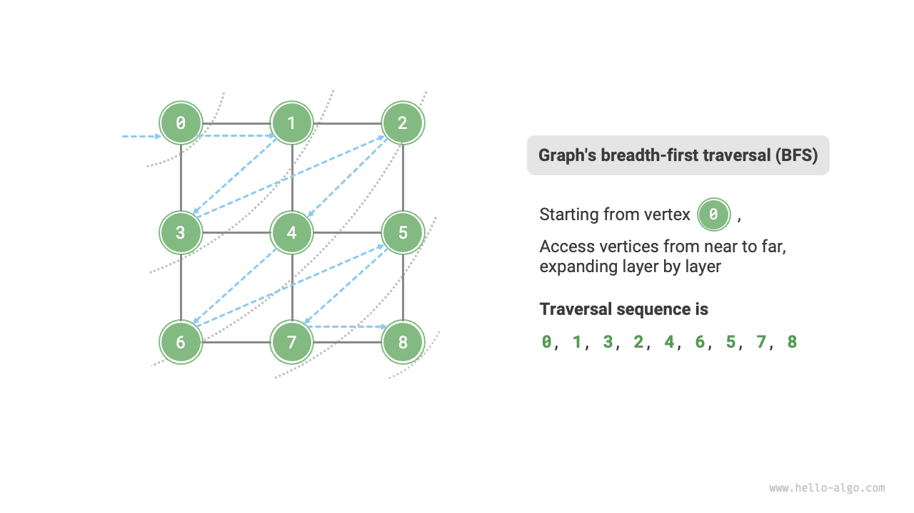{ class="animation-figure" }

<p align="center"> Hình 9-9 &nbsp; Duyệt theo chiều rộng của một graph </p>

### 1. &nbsp; Triển khai thuật toán

BFS thường được triển khai với sự trợ giúp của một queue, như được hiển thị
trong đoạn mã dưới đây. Queue là "vào trước, ra trước" (first in, first
out), điều này phù hợp với ý tưởng của BFS là duyệt "từ gần đến xa".

1. Thêm đỉnh bắt đầu `startVet` vào queue và bắt đầu vòng lặp.
2. Trong mỗi lần lặp của vòng lặp, lấy đỉnh ở đầu queue ra và đánh dấu đã
thăm, sau đó thêm tất cả các đỉnh kề của đỉnh đó vào cuối queue.
3. Lặp lại bước `2.` cho đến khi tất cả các đỉnh đã được thăm.

Để ngăn chặn việc thăm lại các đỉnh, chúng ta sử dụng một hash set `visited`
để ghi lại các node đã được thăm.

=== "Python"

    ```python title="graph_bfs.py"
    def graph_bfs(graph: GraphAdjList, start_vet: Vertex) -> list[Vertex]:
        """Duyệt theo chiều rộng"""
        # Sử dụng adjacency list để biểu diễn graph, nhằm lấy tất cả các đỉnh kề của một đỉnh cụ thể
        # Trình tự duyệt các đỉnh
        res = []
        # Hash set, dùng để ghi lại các đỉnh đã thăm
        visited = set[Vertex]([start_vet])
        # Queue dùng để triển khai BFS
        que = deque[Vertex]([start_vet])
        # Bắt đầu từ đỉnh vet, lặp cho đến khi tất cả các đỉnh được thăm
        while len(que) > 0:
            vet = que.popleft()  # Lấy đỉnh ở đầu queue ra
            res.append(vet)  # Ghi lại đỉnh đã thăm
            # Duyệt tất cả các đỉnh kề của đỉnh đó
            for adj_vet in graph.adj_list[vet]:
                if adj_vet in visited:
                    continue  # Bỏ qua các đỉnh đã thăm
                que.append(adj_vet)  # Chỉ thêm vào queue các đỉnh chưa thăm
                visited.add(adj_vet)  # Đánh dấu đỉnh là đã thăm
        # Trả về trình tự duyệt các đỉnh
        return res
    ```

=== "C++"

    ```cpp title="graph_bfs.cpp"
    /* Duyệt theo chiều rộng */
    // Sử dụng adjacency list để biểu diễn graph, nhằm lấy tất cả các đỉnh kề
    // của một đỉnh được chỉ định
    vector<Vertex *> graphBFS(GraphAdjList &graph, Vertex *startVet) {
        // Trình tự duyệt các đỉnh
        vector<Vertex *> res;
        // Hash set, dùng để ghi lại các đỉnh đã được duyệt
        unordered_set<Vertex *> visited = {startVet};
        // Queue dùng để triển khai BFS
        queue<Vertex *> que;
        que.push(startVet);
        // Bắt đầu từ đỉnh vet, lặp cho đến khi tất cả các đỉnh được duyệt
        while (!que.empty()) {
            Vertex *vet = que.front();
            que.pop();          // Loại bỏ đỉnh ở đầu queue
            res.push_back(vet); // Ghi lại đỉnh đã được duyệt
            // Duyệt tất cả các đỉnh kề của đỉnh đó
            for (auto adjVet : graph.adjList[vet]) {
                if (visited.count(adjVet))
                    continue;            // Bỏ qua các đỉnh đã được duyệt
                que.push(adjVet);        // Chỉ thêm các đỉnh chưa duyệt vào queue
                visited.emplace(adjVet); // Đánh dấu đỉnh là đã được duyệt
            }
        }
        // Trả về trình tự duyệt các đỉnh
        return res;
    }
    ```

=== "Java"

    ```java title="graph_bfs.java"
    /* Duyệt theo chiều rộng */
    // Sử dụng adjacency list để biểu diễn graph, nhằm lấy tất cả các đỉnh kề
    // của một đỉnh được chỉ định
    List<Vertex> graphBFS(GraphAdjList graph, Vertex startVet) {
        // Trình tự duyệt các đỉnh
        List<Vertex> res = new ArrayList<>();
        // Hash set, dùng để ghi lại các đỉnh đã được duyệt
        Set<Vertex> visited = new HashSet<>();
        visited.add(startVet);
        // Queue dùng để triển khai BFS
        Queue<Vertex> que = new LinkedList<>();
        que.offer(startVet);
        // Bắt đầu từ đỉnh vet, lặp cho đến khi tất cả các đỉnh được duyệt
        while (!que.isEmpty()) {
            Vertex vet = que.poll(); // Loại bỏ đỉnh ở đầu queue
            res.add(vet);            // Ghi lại đỉnh đã được duyệt
            // Duyệt tất cả các đỉnh kề của đỉnh đó
            for (Vertex adjVet : graph.adjList.get(vet)) {
                if (visited.contains(adjVet))
                    continue;        // Bỏ qua các đỉnh đã được duyệt
                que.offer(adjVet);   // Chỉ thêm các đỉnh chưa duyệt vào queue
                visited.add(adjVet); // Đánh dấu đỉnh là đã được duyệt
            }
        }
        // Trả về trình tự duyệt các đỉnh
        return res;
    }
    ```

=== "C#"

    ```csharp title="graph_bfs.cs"
    [class]{graph_bfs}-[func]{GraphBFS}
    ```

=== "Go"

    ```go title="graph_bfs.go"
    [class]{}-[func]{graphBFS}
    ```

=== "Swift"

    ```swift title="graph_bfs.swift"
    [class]{}-[func]{graphBFS}
    ```

=== "JS"

    ```javascript title="graph_bfs.js"
    [class]{}-[func]{graphBFS}
    ```

=== "TS"

    ```typescript title="graph_bfs.ts"
    [class]{}-[func]{graphBFS}
    ```

=== "Dart"

    ```dart title="graph_bfs.dart"
    [class]{}-[func]{graphBFS}
    ```

=== "Rust"

    ```rust title="graph_bfs.rs"
    [class]{}-[func]{graph_bfs}
    ```

=== "C"

    ```c title="graph_bfs.c"
    [class]{Queue}-[func]{}

    [class]{}-[func]{isVisited}

    [class]{}-[func]{graphBFS}
    ```

=== "Kotlin"

    ```kotlin title="graph_bfs.kt"
    [class]{}-[func]{graphBFS}
    ```

=== "Ruby"

    ```ruby title="graph_bfs.rb"
    [class]{}-[func]{graph_bfs}
    ```

=== "Zig"

    ```zig title="graph_bfs.zig"
    [class]{}-[func]{graphBFS}
    ```

Mã này khá trừu tượng, bạn có thể so sánh nó với Hình 9-10 để hiểu rõ hơn.

=== "<1>"
    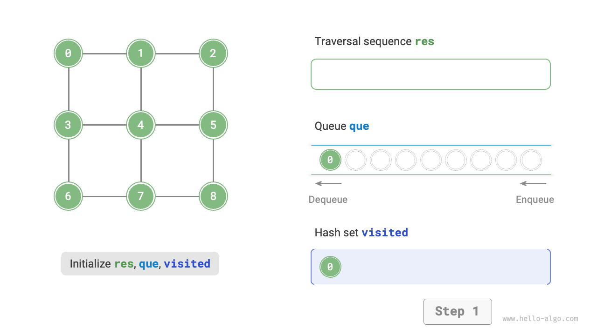{ class="animation-figure" }

=== "<2>"
    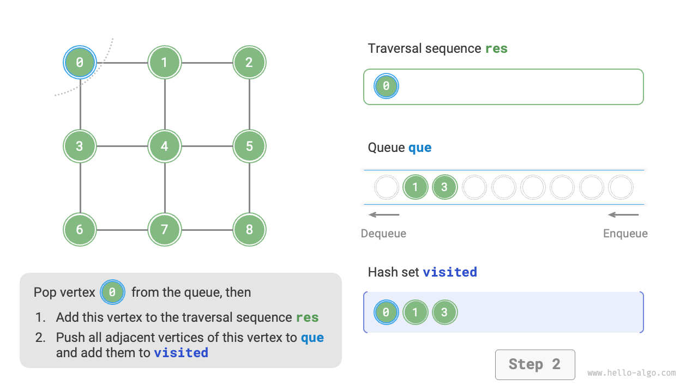{ class="animation-figure" }

=== "<3>"
    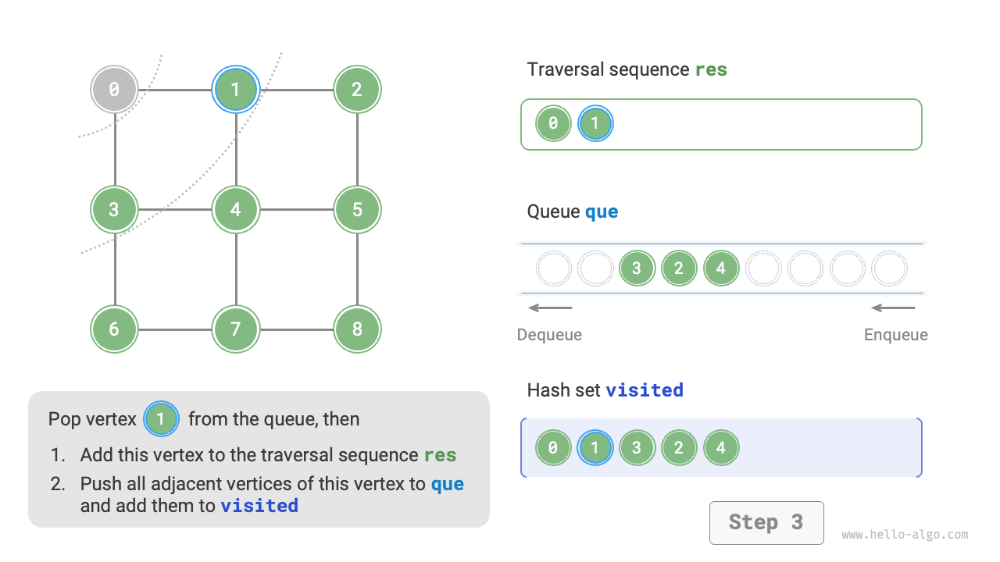{ class="animation-figure" }

=== "<4>"
    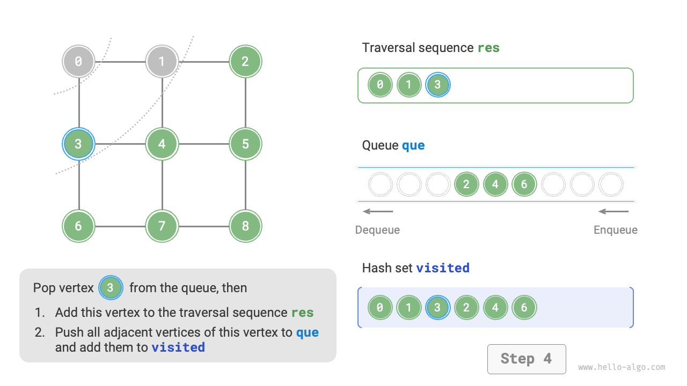{ class="animation-figure" }

=== "<5>"
    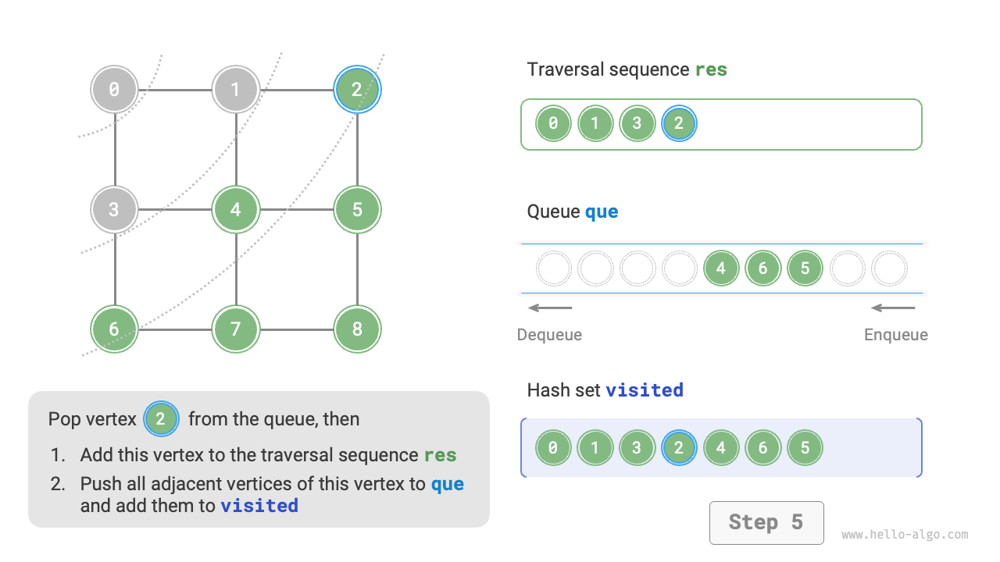{ class="animation-figure" }

=== "<6>"
    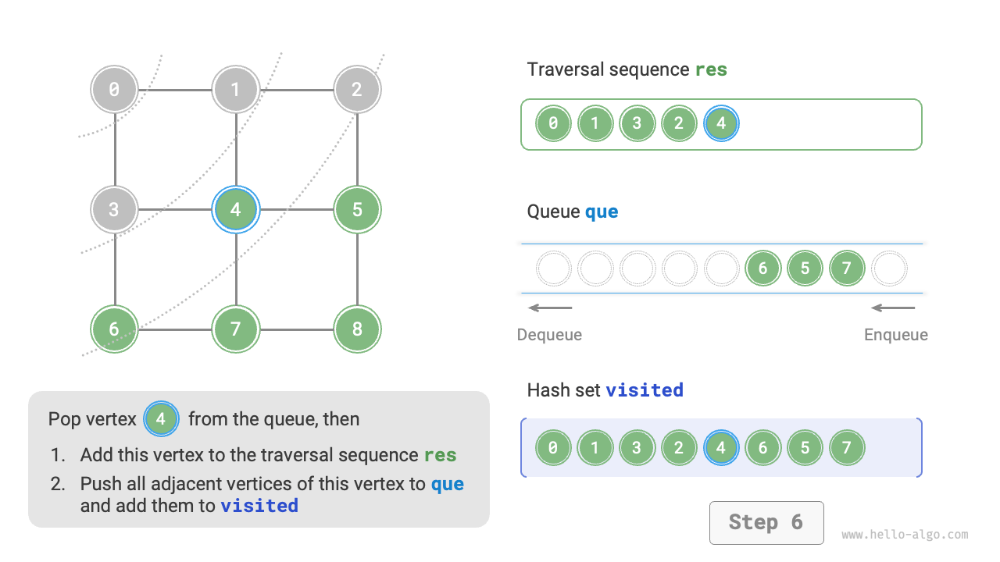{ class="animation-figure" }

=== "<7>"
    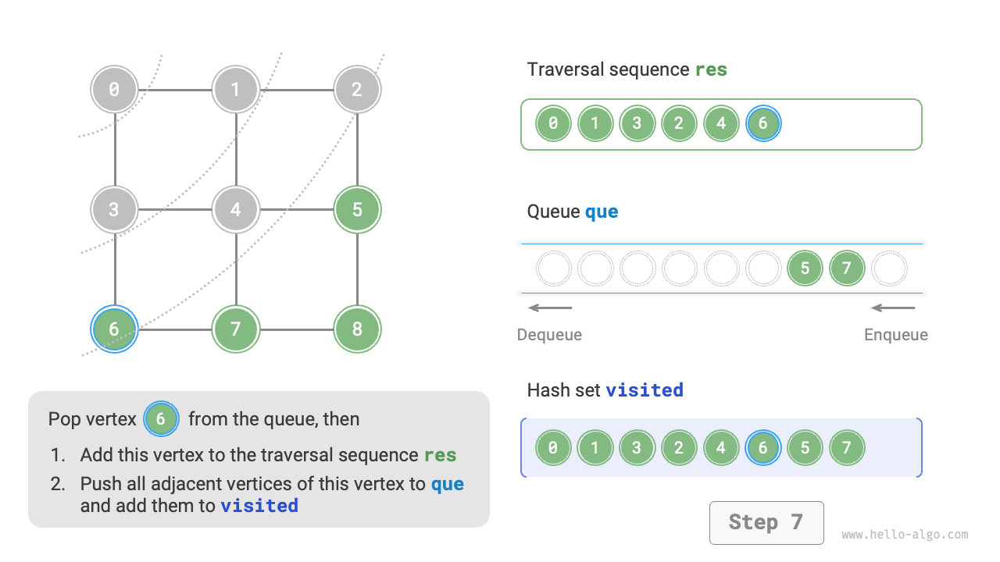{ class="animation-figure" }

=== "<8>"
    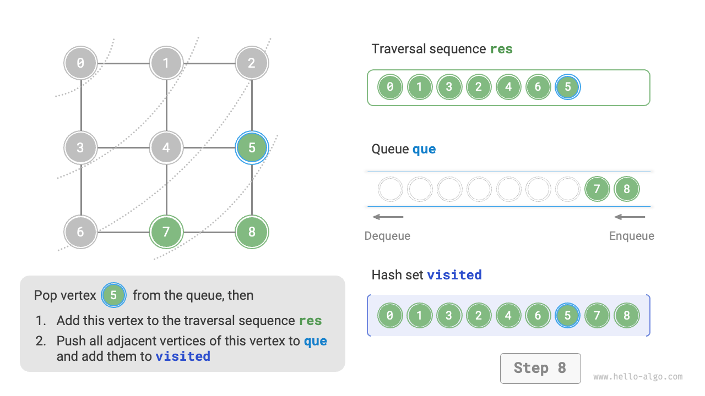{ class="animation-figure" }

=== "<9>"
    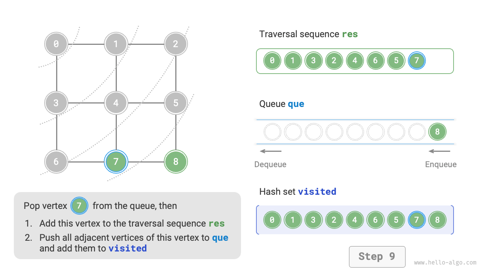{ class="animation-figure" }

=== "<10>"
    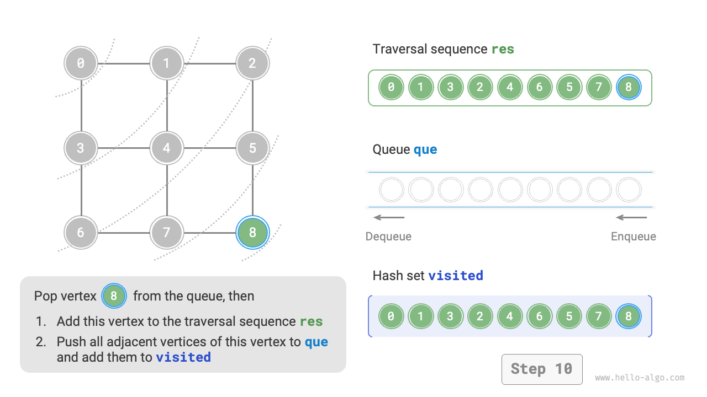{ class="animation-figure" }

=== "<11>"
    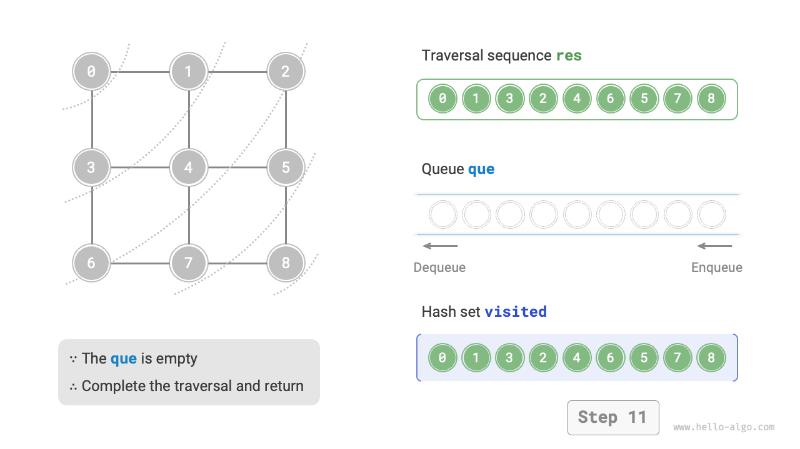{ class="animation-figure" }

<p align="center"> Hình 9-10 &nbsp; Các bước tìm kiếm theo chiều rộng của một graph </p>

!!! question "Trình tự duyệt theo chiều rộng có duy nhất không?"

    Không duy nhất. Duyệt theo chiều rộng chỉ yêu cầu duyệt theo thứ tự
    "gần đến xa", **và thứ tự duyệt các đỉnh có cùng khoảng cách có thể
    tùy ý**. Ví dụ, trong Hình 9-10, thứ tự thăm các đỉnh $1$ và $3$ có
    thể được hoán đổi, cũng như thứ tự của các đỉnh $2$, $4$, và $6$.

### 2. &nbsp; Phân tích độ phức tạp

**Time complexity**: Tất cả các đỉnh sẽ được đưa vào queue và lấy ra khỏi
queue một lần, sử dụng $O(|V|)$ time; trong quá trình duyệt các đỉnh kề,
vì đây là một đồ thị vô hướng, tất cả các cạnh sẽ được thăm $2$ lần, sử
dụng $O(2|E|)$ time; tổng cộng sử dụng $O(|V| + |E|)$ time.

**Space complexity**: Số lượng đỉnh tối đa trong list `res`, hash set
`visited`, và queue `que` là $|V|$, sử dụng $O(|V|)$ space.

## 9.3.2 &nbsp; Depth-first search

**Depth-first search là một phương pháp duyệt ưu tiên đi sâu nhất có thể
và sau đó quay lui khi không còn đường đi nào nữa**. Như được minh họa
trong Hình 9-11, bắt đầu từ đỉnh trên cùng bên trái, thăm một số
đỉnh kề của đỉnh hiện tại cho đến khi không còn đường đi nào, sau đó
quay lại và tiếp tục cho đến khi tất cả các đỉnh đều được duyệt.

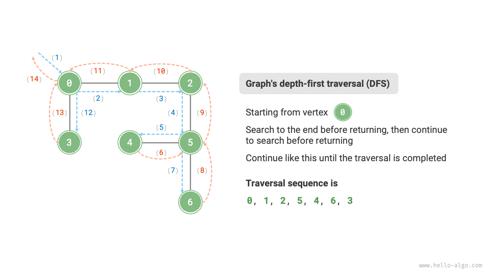{ class="animation-figure" }

<p align="center"> Hình 9-11 &nbsp; Duyệt theo chiều sâu của đồ thị </p>

### 1. &nbsp; Triển khai thuật toán

Mô hình thuật toán "đi sâu nhất có thể và sau đó quay lại" này thường
được triển khai dựa trên đệ quy. Tương tự như breadth-first search,
trong depth-first search, chúng ta cũng cần sự trợ giúp của một hash set
`visited` để ghi lại các đỉnh đã thăm nhằm tránh việc thăm lại.

=== "Python"

    ```python title="graph_dfs.py"
    def dfs(graph: GraphAdjList, visited: set[Vertex], res: list[Vertex], vet: Vertex):
        """Hàm trợ giúp duyệt theo chiều sâu"""
        res.append(vet)  # Ghi lại đỉnh đã thăm
        visited.add(vet)  # Đánh dấu đỉnh là đã thăm
        # Duyệt tất cả các đỉnh kề của đỉnh đó
        for adjVet in graph.adj_list[vet]:
            if adjVet in visited:
                continue  # Bỏ qua các đỉnh đã thăm
            # Đệ quy thăm các đỉnh kề
            dfs(graph, visited, res, adjVet)

    def graph_dfs(graph: GraphAdjList, start_vet: Vertex) -> list[Vertex]:
        """Duyệt theo chiều sâu"""
        # Sử dụng adjacency list để biểu diễn graph, để lấy tất cả
        # các đỉnh kề của một đỉnh đã chỉ định
        # Trình tự duyệt các đỉnh
        res = []
        # Hash set, dùng để ghi lại các đỉnh đã thăm
        visited = set[Vertex]()
        dfs(graph, visited, res, start_vet)
        return res
    ```

=== "C++"

    ```cpp title="graph_dfs.cpp"
    /* Hàm trợ giúp duyệt theo chiều sâu */
    void dfs(GraphAdjList &graph, unordered_set<Vertex *> &visited, vector<Vertex *> &res, Vertex *vet) {
        res.push_back(vet);   // Ghi lại đỉnh đã thăm
        visited.emplace(vet); // Đánh dấu đỉnh là đã thăm
        // Duyệt tất cả các đỉnh kề của đỉnh đó
        for (Vertex *adjVet : graph.adjList[vet]) {
            if (visited.count(adjVet))
                continue; // Bỏ qua các đỉnh đã thăm
            // Đệ quy thăm các đỉnh kề
            dfs(graph, visited, res, adjVet);
        }
    }

    /* Duyệt theo chiều sâu */
    // Sử dụng adjacency list để biểu diễn graph, để lấy tất cả
    // các đỉnh kề của một đỉnh đã chỉ định
    vector<Vertex *> graphDFS(GraphAdjList &graph, Vertex *startVet) {
        // Trình tự duyệt các đỉnh
        vector<Vertex *> res;
        // Hash set, dùng để ghi lại các đỉnh đã thăm
        unordered_set<Vertex *> visited;
        dfs(graph, visited, res, startVet);
        return res;
    }
    ```

=== "Java"

    ```java title="graph_dfs.java"
    /* Hàm hỗ trợ duyệt theo chiều sâu */
    void dfs(GraphAdjList graph, Set<Vertex> visited, List<Vertex> res, Vertex vet) {
        res.add(vet);     // Ghi lại đỉnh đã duyệt
        visited.add(vet); // Đánh dấu đỉnh đã duyệt
        // Duyệt tất cả các đỉnh kề của đỉnh đó
        for (Vertex adjVet : graph.adjList.get(vet)) {
            if (visited.contains(adjVet))
                continue; // Bỏ qua các đỉnh đã duyệt
            // Duyệt đệ quy các đỉnh kề
            dfs(graph, visited, res, adjVet);
        }
    }

    /* Duyệt theo chiều sâu */
    // Sử dụng adjacency list để biểu diễn graph, để lấy tất cả các đỉnh kề của
    // một đỉnh được chỉ định
    List<Vertex> graphDFS(GraphAdjList graph, Vertex startVet) {
        // Trình tự duyệt các đỉnh
        List<Vertex> res = new ArrayList<>();
        // Hash set, dùng để ghi lại các đỉnh đã duyệt
        Set<Vertex> visited = new HashSet<>();
        dfs(graph, visited, res, startVet);
        return res;
    }
    ```

=== "C#"

    ```csharp title="graph_dfs.cs"
    [class]{graph_dfs}-[func]{DFS}

    [class]{graph_dfs}-[func]{GraphDFS}
    ```

=== "Go"

    ```go title="graph_dfs.go"
    [class]{}-[func]{dfs}

    [class]{}-[func]{graphDFS}
    ```

=== "Swift"

    ```swift title="graph_dfs.swift"
    [class]{}-[func]{dfs}

    [class]{}-[func]{graphDFS}
    ```

=== "JS"

    ```javascript title="graph_dfs.js"
    [class]{}-[func]{dfs}

    [class]{}-[func]{graphDFS}
    ```

=== "TS"

    ```typescript title="graph_dfs.ts"
    [class]{}-[func]{dfs}

    [class]{}-[func]{graphDFS}
    ```

=== "Dart"

    ```dart title="graph_dfs.dart"
    [class]{}-[func]{dfs}

    [class]{}-[func]{graphDFS}
    ```

=== "Rust"

    ```rust title="graph_dfs.rs"
    [class]{}-[func]{dfs}

    [class]{}-[func]{graph_dfs}
    ```

=== "C"

    ```c title="graph_dfs.c"
    [class]{}-[func]{isVisited}

    [class]{}-[func]{dfs}

    [class]{}-[func]{graphDFS}
    ```

=== "Kotlin"

    ```kotlin title="graph_dfs.kt"
    [class]{}-[func]{dfs}

    [class]{}-[func]{graphDFS}
    ```

=== "Ruby"

    ```ruby title="graph_dfs.rb"
    [class]{}-[func]{dfs}

    [class]{}-[func]{graph_dfs}
    ```

=== "Zig"

    ```zig title="graph_dfs.zig"
    [class]{}-[func]{dfs}

    [class]{}-[func]{graphDFS}
    ```

Quá trình thuật toán của depth-first search được minh họa trong Hình 9-12.

- **Đường nét đứt thể hiện recursion đi xuống**, cho biết rằng một phương
  thức đệ quy mới đã được khởi tạo để thăm một đỉnh mới.
- **Đường nét đứt cong thể hiện backtracking đi lên**, cho biết rằng phương
  thức đệ quy này đã trả về vị trí nơi phương thức này được khởi tạo.

Để làm sâu sắc thêm sự hiểu biết, bạn nên kết hợp Hình 9-12 với đoạn code
để mô phỏng (hoặc vẽ) toàn bộ quá trình DFS trong tâm trí bạn, bao gồm
thời điểm mỗi phương thức đệ quy được khởi tạo và khi nó trả về.

=== "<1>"
    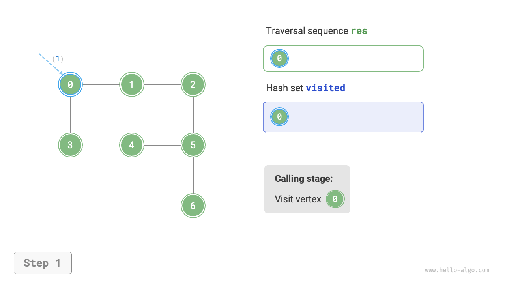{ class="animation-figure" }

=== "<2>"
    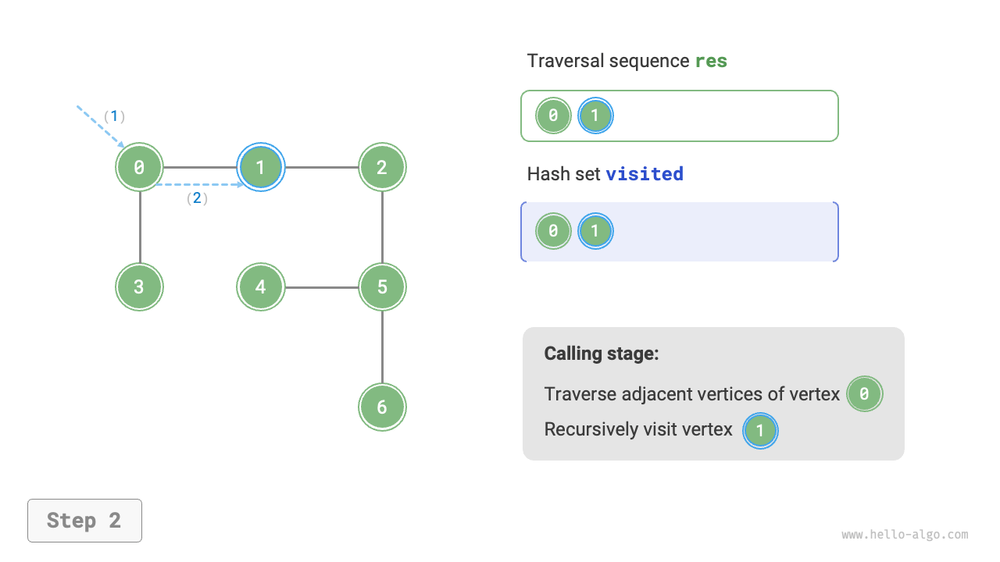{ class="animation-figure" }

=== "<3>"
    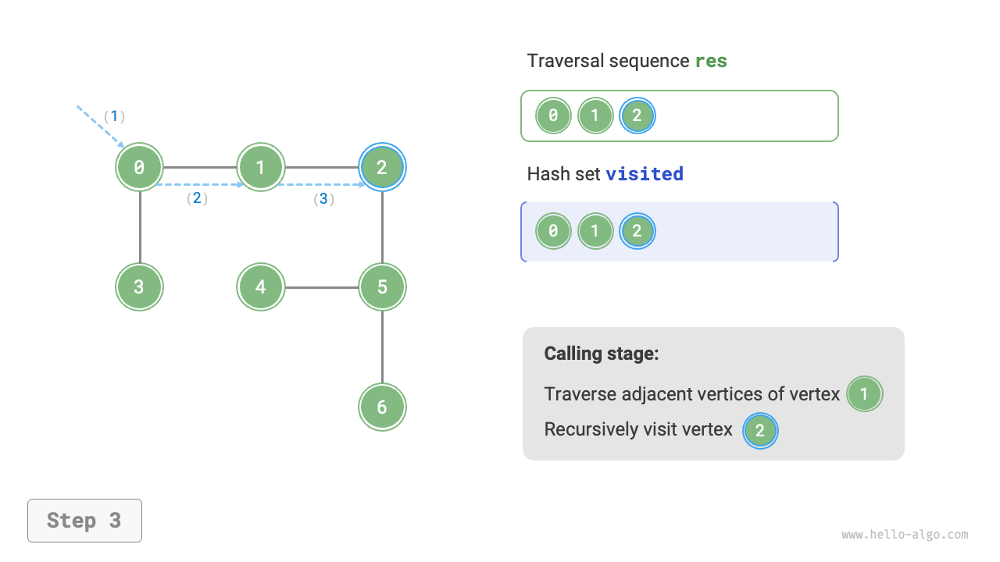{ class="animation-figure" }

=== "<4>"
    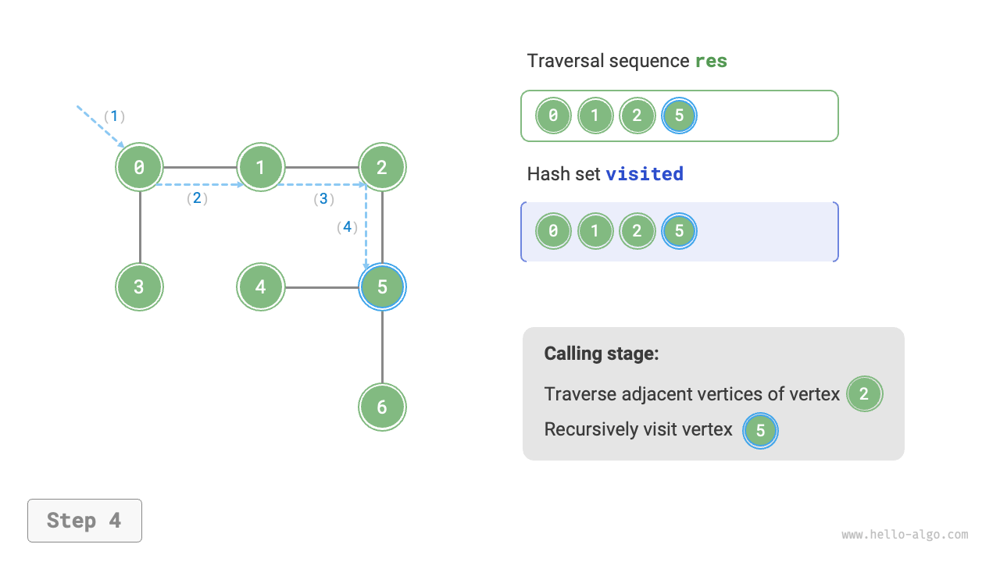{ class="animation-figure" }

=== "<5>"
    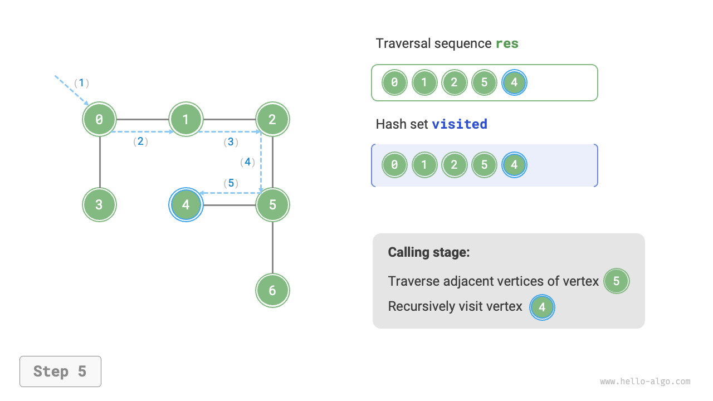{ class="animation-figure" }

=== "<6>"
    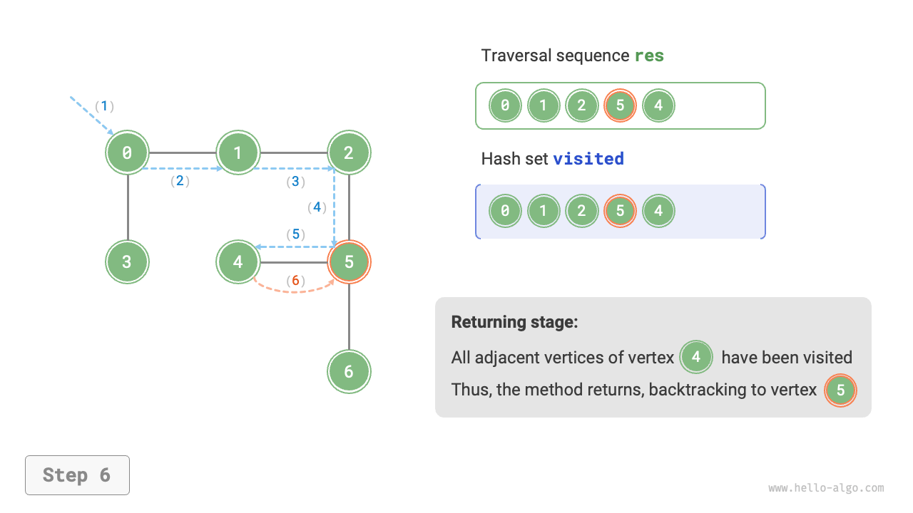{ class="animation-figure" }

=== "<7>"
    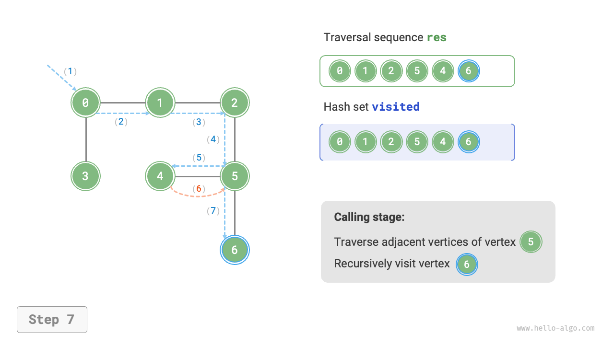{ class="animation-figure" }

=== "<8>"
    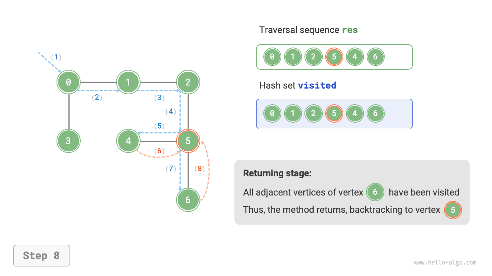{ class="animation-figure" }

=== "<9>"
    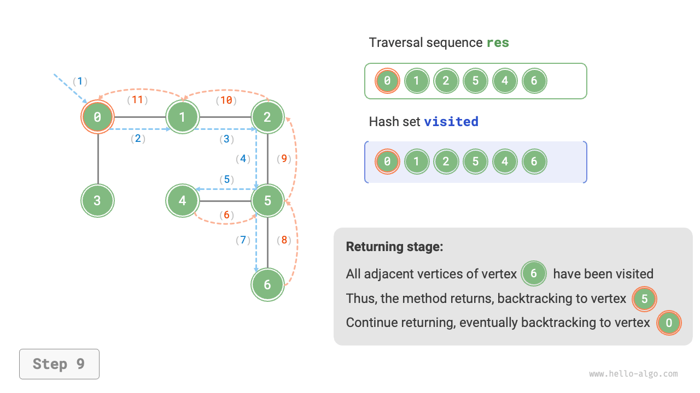{ class="animation-figure" }

=== "<10>"
    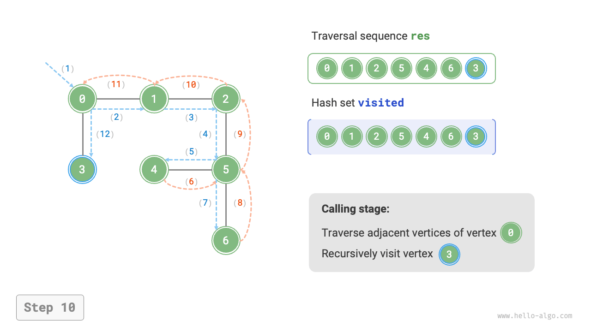{ class="animation-figure" }

=== "<11>"
    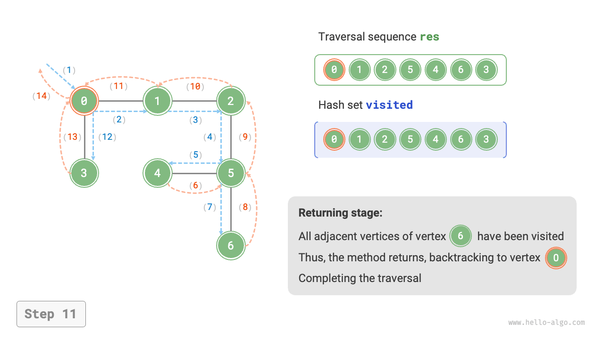{ class="animation-figure" }

<p align="center"> Hình 9-12 &nbsp; Các bước của depth-first search của một graph </p>

!!! question "Dãy của depth-first traversal có duy nhất không?"

    Tương tự như breadth-first traversal, thứ tự của dãy depth-first traversal
    cũng không duy nhất. Cho một đỉnh bất kỳ, việc khám phá theo bất kỳ hướng
    nào trước đều có thể thực hiện được, tức là thứ tự các đỉnh kề có thể
    được xáo trộn tùy ý, tất cả đều là một phần của depth-first traversal.

    Lấy ví dụ về tree traversal, "root $\rightarrow$ left $\rightarrow$ right",
    "left $\rightarrow$ root $\rightarrow$ right", "left $\rightarrow$ right
    $\rightarrow$ root" tương ứng với các phép duyệt pre-order, in-order và
    post-order. Chúng thể hiện ba loại ưu tiên duyệt khác nhau, tuy nhiên,
    cả ba đều được coi là depth-first traversal.

### 2. &nbsp; Phân tích độ phức tạp

**Time complexity**: Tất cả các đỉnh sẽ được duyệt một lần, sử dụng $O(|V|)$
time; tất cả các cạnh sẽ được duyệt hai lần, sử dụng $O(2|E|)$ time; tổng
thể sử dụng $O(|V| + |E|)$ time.

**Space complexity**: Số lượng đỉnh tối đa trong list `res`, hash set
`visited` là $|V|$, và độ sâu recursion tối đa là $|V|$, do đó sử dụng
$O(|V|)$ space.
