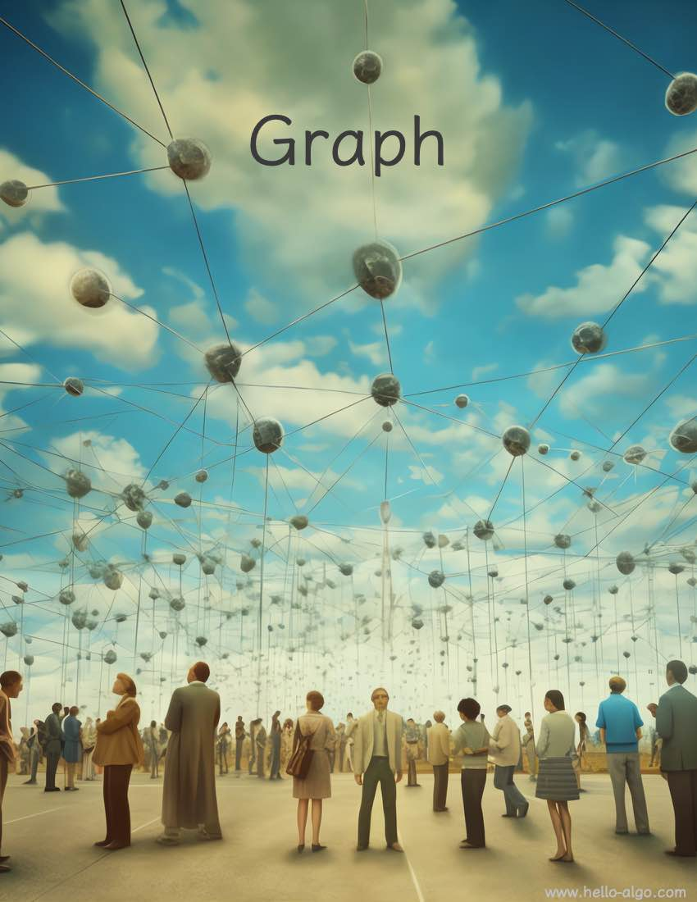

# Chương 9. &nbsp; Graph

{ class="cover-image" }

!!! abstract

    Trong hành trình cuộc đời, mỗi chúng ta là một node, được kết nối
    bởi vô số cạnh vô hình.

    Mỗi lần gặp gỡ và chia ly đều để lại một dấu ấn độc đáo trên
    graph rộng lớn của cuộc đời này.

## Nội dung chương

- [9.1 &nbsp; Graph](graph.md)
- [9.2 &nbsp; Các thao tác cơ bản trên graph](graph_operations.md)
- [9.3 &nbsp; Duyệt graph](graph_traversal.md)
- [9.4 &nbsp; Tóm tắt](summary.md)
