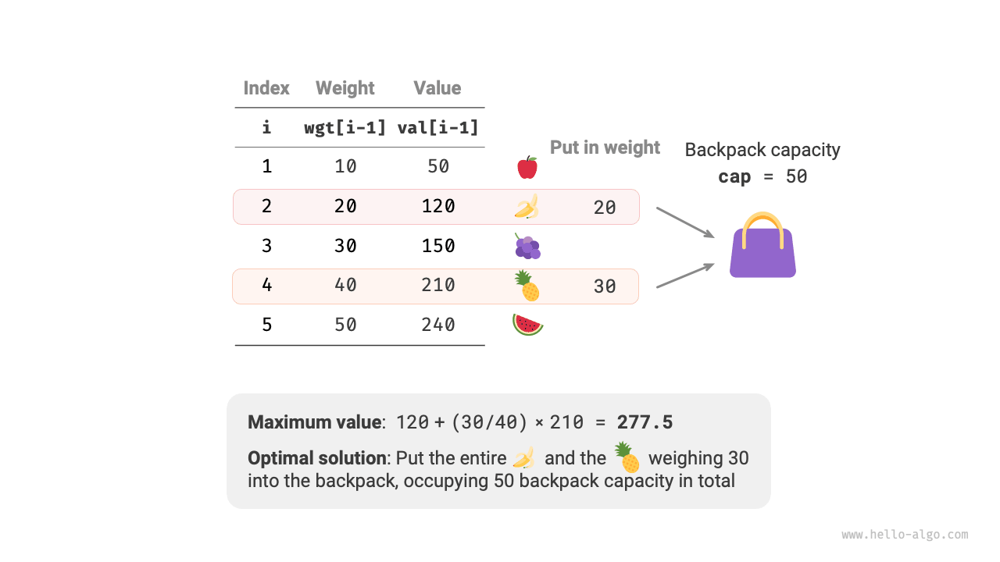
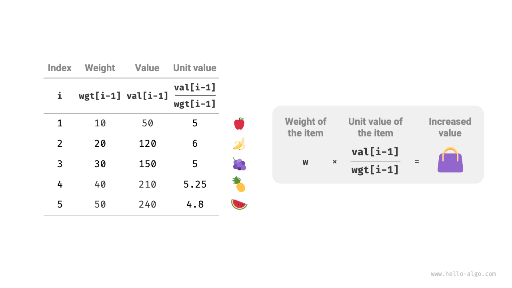
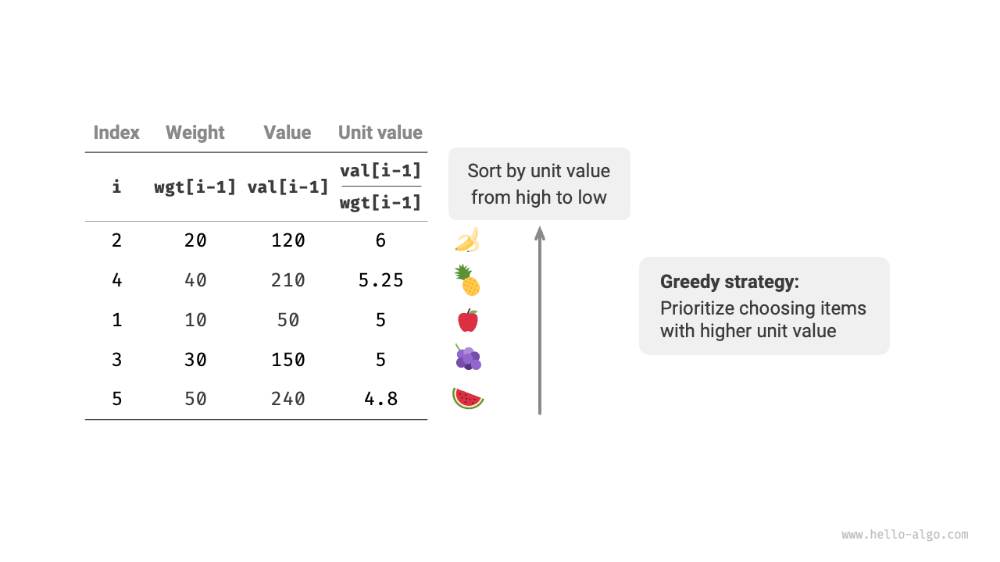
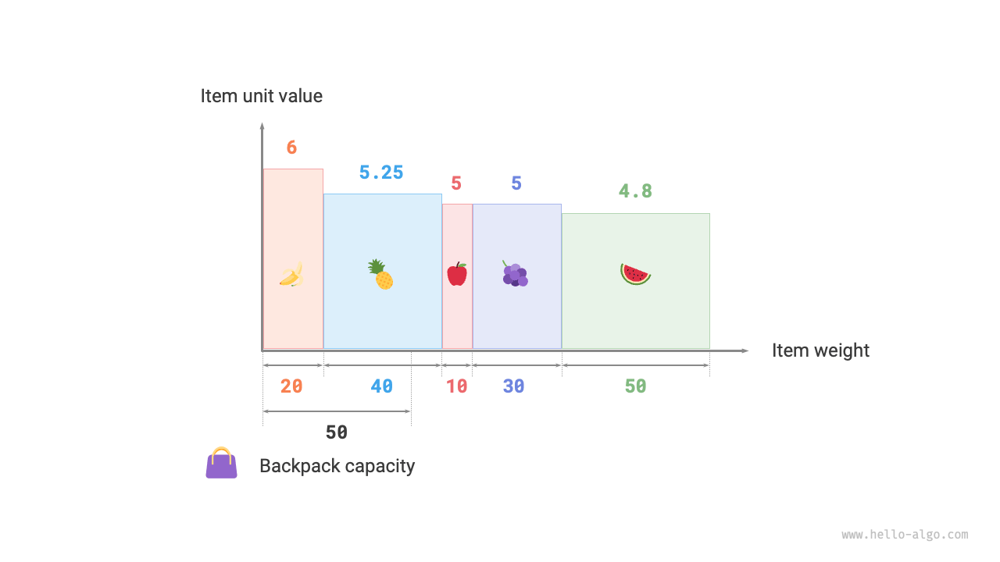

# Bài toán Cái túi Phân số (Fractional Knapsack)

!!! question

    Cho $n$ đồ vật, trong đó trọng lượng của đồ vật thứ $i$ là $wgt[i-1]$ và giá trị của nó là $val[i-1]$, và một cái túi có sức chứa $cap$. Mỗi đồ vật chỉ có thể được chọn một lần, **nhưng một phần của đồ vật có thể được chọn, với giá trị của nó tỷ lệ thuận với trọng lượng được chọn**. Tổng giá trị tối đa có thể cho vào cái túi dưới ràng buộc sức chứa là bao nhiêu? Một ví dụ được hiển thị trong hình bên dưới.



Bài toán cái túi phân số nhìn chung rất giống với bài toán cái túi 0-1, với các trạng thái bao gồm đồ vật hiện tại $i$ và sức chứa $c$, và mục tiêu là tối đa hóa giá trị dưới sức chứa cái túi có hạn.

Điểm khác biệt là bài toán này cho phép chỉ chọn một phần của đồ vật. Như hiển thị trong hình bên dưới, **chúng ta có thể chia nhỏ một đồ vật một cách tùy ý và tính giá trị của nó tỷ lệ thuận với trọng lượng được chọn**.

1. Đối với đồ vật $i$, giá trị trên mỗi đơn vị trọng lượng của nó là $val[i-1] / wgt[i-1]$, được gọi là giá trị đơn vị.
2. Giả sử chúng ta cho một phần của đồ vật $i$ với trọng lượng $w$ vào cái túi, thì giá trị được thêm vào cái túi là $w \times val[i-1] / wgt[i-1]$.



### Xác định Chiến lược Tham ăn

Việc tối đa hóa tổng giá trị trong cái túi **về bản chất có nghĩa là ưu tiên các đồ vật có giá trị trên mỗi đơn vị trọng lượng cao hơn**. Từ quan sát này, chúng ta có thể rút ra chiến lược tham ăn được hiển thị trong hình bên dưới.

1. Sắp xếp các đồ vật theo giá trị đơn vị từ cao xuống thấp.
2. Duyệt qua tất cả các đồ vật, **tham ăn chọn đồ vật có giá trị đơn vị cao nhất trong mỗi vòng**.
3. Nếu sức chứa còn lại của cái túi không đủ, hãy sử dụng một phần của đồ vật hiện tại để lấp đầy cái túi.



### Triển khai Mã nguồn

Chúng ta định nghĩa một lớp `Item` để các đồ vật có thể được sắp xếp theo giá trị đơn vị. Sau đó chúng ta duyệt qua các đồ vật đã sắp xếp một cách tham ăn, dừng lại khi cái túi đầy và trả về kết quả:

```src
[file]{fractional_knapsack}-[class]{}-[func]{fractional_knapsack}
```

Các thuật toán sắp xếp tích hợp sẵn thường tốn thời gian $O(n \log n)$, và độ phức tạp không gian của chúng thường là $O(\log n)$ hoặc $O(n)$, tùy thuộc vào cách triển khai cụ thể của ngôn ngữ lập trình.

Ngoài việc sắp xếp, trong trường hợp xấu nhất toàn bộ danh sách đồ vật cần phải được duyệt qua, **do đó độ phức tạp thời gian là $O(n)$**, trong đó $n$ là số lượng đồ vật.

Vì một danh sách đối tượng `Item` được khởi tạo, **độ phức tạp không gian là $O(n)$**.

### Chứng minh Tính đúng đắn

Chúng ta sử dụng phương pháp chứng minh phản chứng. Giả sử đồ vật $x$ có giá trị đơn vị cao nhất, và một thuật toán nào đó tạo ra một giá trị tối ưu `res`, nhưng lời giải thu được không bao gồm đồ vật $x$.

Bây giờ loại bỏ một đơn vị trọng lượng từ bất kỳ đồ vật nào trong cái túi và thay thế nó bằng một đơn vị trọng lượng từ đồ vật $x$. Vì đồ vật $x$ có giá trị đơn vị cao nhất, tổng giá trị sau khi thay thế chắc chắn phải lớn hơn `res`. **Điều này mâu thuẫn với giả định rằng `res` là tối ưu, chứng minh rằng bất kỳ lời giải tối ưu nào cũng phải bao gồm đồ vật $x$**.

Chúng ta cũng có thể dựng lên sự mâu thuẫn tương tự cho các đồ vật khác trong lời giải. Tóm lại, **các đồ vật có giá trị đơn vị cao hơn luôn là lựa chọn tốt hơn**, điều này chứng minh rằng chiến lược tham ăn là hiệu quả.

Như hiển thị trong hình bên dưới, nếu chúng ta coi trọng lượng đồ vật và giá trị đơn vị như trục hoành và trục tung của một biểu đồ hai chiều, thì bài toán cái túi phân số có thể được xem như việc "tìm diện tích tối đa được bao phủ trong một khoảng giới hạn trên trục hoành". Sự ví von này giúp giải thích hiệu quả của chiến lược tham ăn từ góc độ hình học.


