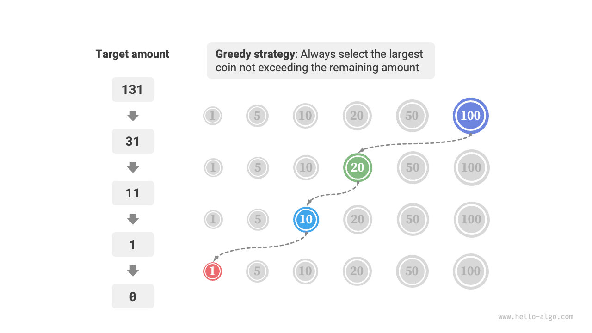
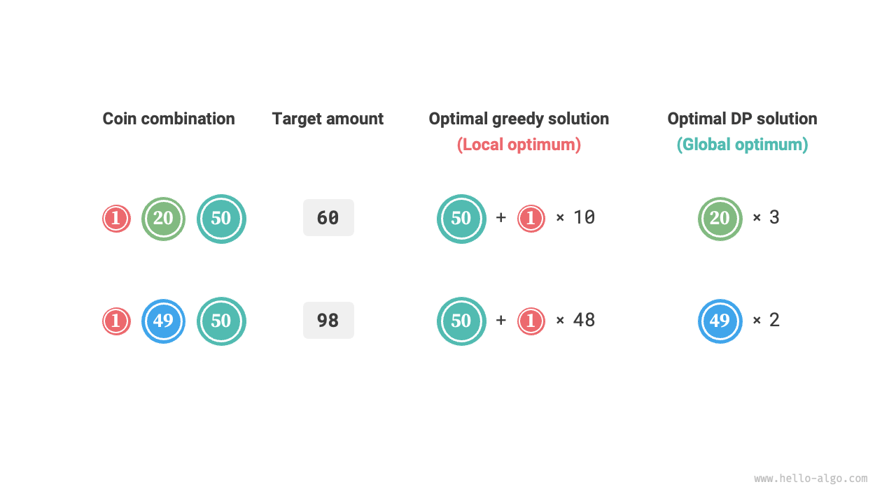

# Thuật toán Tham ăn

<u>Thuật toán tham ăn</u> (Greedy algorithm) là một cách tiếp cận phổ biến để giải quyết các bài toán tối ưu hóa. Ý tưởng cơ bản của nó là chọn tùy chọn có vẻ tốt nhất ở mỗi giai đoạn quyết định, tức là tham ăn đưa ra các quyết định tối ưu cục bộ với hy vọng thu được lời giải tối ưu toàn cục. Thuật toán tham ăn đơn giản và hiệu quả, được ứng dụng rộng rãi trong nhiều bài toán thực tế.

Thuật toán tham ăn và quy hoạch động đều thường được sử dụng để giải quyết các bài toán tối ưu hóa. Chúng chia sẻ một số điểm tương đồng, chẳng hạn như cả hai đều phụ thuộc vào tính chất cấu trúc con tối ưu (optimal substructure), nhưng chúng hoạt động khác nhau.

- Quy hoạch động xem xét tất cả các quyết định trước đó khi đưa ra quyết định hiện tại, và sử dụng lời giải cho các bài toán con trong quá khứ để xây dựng lời giải cho bài toán con hiện tại.
- Thuật toán tham ăn không xem xét các quyết định trong quá khứ, mà thay vào đó đưa ra các lựa chọn tham ăn tiến về phía trước, liên tục giảm kích thước bài toán cho đến khi bài toán được giải quyết.

Trước tiên, chúng ta sẽ hiểu cách hoạt động của thuật toán tham ăn thông qua bài toán ví dụ "đổi tiền lẻ". Bài toán này đã được giới thiệu trong chương "Bài toán Cái túi Hoàn toàn", vì vậy nó chắc chắn đã quen thuộc với bạn.

!!! question

    Cho $n$ loại tiền xu, trong đó mệnh giá của loại thứ $i$ là $coins[i - 1]$, một số tiền mục tiêu $amt$, và số lượng tiền xu không giới hạn cho mỗi loại, số lượng tiền xu tối thiểu cần thiết để tạo thành số tiền mục tiêu là bao nhiêu? Nếu không thể tạo thành số tiền mục tiêu, hãy trả về $-1$.

Chiến lược tham ăn cho bài toán này được hiển thị trong hình bên dưới. Cho một số tiền mục tiêu, **chúng ta tham ăn chọn đồng xu không vượt quá số tiền đó và gần với nó nhất**, lặp lại bước này cho đến khi tạo đủ số tiền mục tiêu.



Mã nguồn triển khai như sau:

```src
[file]{coin_change_greedy}-[class]{}-[func]{coin_change_greedy}
```

Bạn có thể sẽ phải thốt lên rằng: "Thật là ngắn gọn!" Thuật toán tham ăn giải quyết bài toán đổi tiền lẻ chỉ trong khoảng mười dòng mã nguồn.

## Ưu điểm và Hạn chế của Thuật toán Tham ăn

**Thuật toán tham ăn không chỉ trực tiếp áp dụng và dễ triển khai mà còn thường rất hiệu quả**. Trong mã nguồn trên, nếu mệnh giá đồng xu nhỏ nhất là $\min(coins)$, vòng lặp lựa chọn tham ăn chạy tối đa $amt / \min(coins)$ lần, mang lại độ phức tạp thời gian là $O(amt / \min(coins))$. Độ phức tạp này thấp hơn một cấp so với độ phức tạp thời gian của giải pháp quy hoạch động là $O(n \times amt)$.

Tuy nhiên, **đối với một số tập hợp mệnh giá đồng xu, thuật toán tham ăn không thể tìm ra lời giải tối ưu**. Hình bên dưới hiển thị hai ví dụ.

- **Ví dụ thuận $coins = [1, 5, 10, 20, 50, 100]$**: Với tập hợp đồng xu này, thuật toán tham ăn có thể tìm ra lời giải tối ưu cho bất kỳ $amt$ nào.
- **Phản ví dụ $coins = [1, 20, 50]$**: Giả sử $amt = 60$. Thuật toán tham ăn chỉ có thể tìm thấy tổ hợp $50 + 1 \times 10$, sử dụng tổng cộng $11$ đồng xu, trong khi quy hoạch động có thể tìm ra lời giải tối ưu $20 + 20 + 20$ chỉ sử dụng $3$ đồng xu.
- **Phản ví dụ $coins = [1, 49, 50]$**: Giả sử $amt = 98$. Thuật toán tham ăn chỉ có thể tìm thấy tổ hợp $50 + 1 \times 48$, sử dụng tổng cộng $49$ đồng xu, trong khi quy hoạch động có thể tìm ra lời giải tối ưu $49 + 49$ chỉ sử dụng $2$ đồng xu.



Nói cách khác, đối với bài toán đổi tiền lẻ, thuật toán tham ăn không thể đảm bảo một lời giải tối ưu toàn cục và thậm chí có thể tạo ra kết quả rất kém. Bài toán này được giải quyết tốt hơn bằng quy hoạch động.

Nói chung, thuật toán tham ăn có thể áp dụng trong hai tình huống sau.

1. **Lời giải tối ưu có thể được đảm bảo**: Trong trường hợp này, thuật toán tham ăn thường là lựa chọn tốt nhất vì chúng có xu hướng hiệu quả hơn quay lui và quy hoạch động.
2. **Một lời giải xấp xỉ tối ưu có thể được tìm thấy**: Thuật toán tham ăn cũng hữu ích trong trường hợp này. Đối với nhiều bài toán phức tạp, việc tìm ra lời giải tối ưu toàn cục là rất khó khăn, vì vậy việc tìm ra một lời giải dưới tối ưu một cách hiệu quả đã là một kết quả rất tốt.

## Đặc điểm của Thuật toán Tham ăn

Vậy câu hỏi đặt ra là: loại bài toán nào phù hợp để giải bằng thuật toán tham ăn? Hay nói cách khác, dưới những điều kiện nào thì thuật toán tham ăn có thể đảm bảo tìm ra lời giải tối ưu?

So với quy hoạch động, các điều kiện sử dụng thuật toán tham ăn nghiêm ngặt hơn, chủ yếu tập trung vào hai tính chất của bài toán.

- **Tính chất lựa chọn tham ăn (Greedy choice property)**: Chỉ khi các lựa chọn tối ưu cục bộ luôn có thể dẫn đến lời giải tối ưu toàn cục thì thuật toán tham ăn mới đảm bảo thu được lời giải tối ưu.
- **Cấu trúc con tối ưu (Optimal substructure)**: Lời giải tối ưu cho bài toán ban đầu chứa lời giải tối ưu cho các bài toán con.

Cấu trúc con tối ưu đã được giới thiệu trong chương "Quy hoạch động", vì vậy chúng ta sẽ không đi sâu vào ở đây. Đáng chú ý là cấu trúc con tối ưu của một số bài toán không rõ ràng, nhưng chúng vẫn có thể được giải bằng cách sử dụng thuật toán tham ăn.

Chúng ta chủ yếu khám phá các phương pháp để xác định tính chất lựa chọn tham ăn. Mặc dù mô tả của nó có vẻ tương đối đơn giản, **trên thực tế, đối với nhiều bài toán, việc chứng minh tính chất lựa chọn tham ăn là không hề dễ dàng**.

Ví dụ, trong bài toán đổi tiền lẻ, mặc dù chúng ta có thể dễ dàng đưa ra các phản ví dụ để bác bỏ tính chất lựa chọn tham ăn, nhưng việc chứng minh nó đúng thì khó hơn nhiều. Nếu được hỏi **dưới những điều kiện nào thì một tập hợp đồng xu có thể được giải bằng thuật toán tham ăn**? Chúng ta thường chỉ có thể dựa vào trực giác hoặc các ví dụ để đưa ra một câu trả lời mơ hồ, và rất khó để cung cấp một chứng minh toán học nghiêm ngặt.

!!! quote

    Có một bài báo trình bày một thuật toán $O(n^3)$ để xác định xem một tập hợp đồng xu có thể được giải tối ưu bằng thuật toán tham ăn cho bất kỳ số tiền nào hay không.

    Pearson, D. A polynomial-time algorithm for the change-making problem[J]. Operations Research Letters, 2005, 33(3): 231-234.

## Các bước Giải quyết Bài toán bằng Thuật toán Tham ăn

Quy trình chung để giải các bài toán tham ăn có thể chia thành ba bước sau.

1. **Phân tích bài toán**: Sắp xếp và hiểu rõ các đặc điểm của bài toán, bao gồm định nghĩa trạng thái, mục tiêu tối ưu hóa và các ràng buộc. Bước này cũng xuất hiện trong quay lui và quy hoạch động.
2. **Xác định chiến lược tham ăn**: Quyết định cách thực hiện lựa chọn tham ăn ở mỗi bước. Chiến lược này nên làm giảm từng bước kích thước bài toán và cuối cùng giải quyết toàn bộ bài toán.
3. **Chứng minh tính đúng đắn**: Thường cần phải chứng minh rằng bài toán có cả tính chất lựa chọn tham ăn và cấu trúc con tối ưu. Bước này có thể yêu cầu các công cụ toán học như quy nạp hoặc chứng minh phản chứng.

Xác định chiến lược tham ăn là bước cốt lõi trong việc giải quyết các bài toán như vậy, nhưng nó có thể không dễ dàng trong thực tế, chủ yếu vì những lý do sau.

- **Các chiến lược tham ăn rất khác nhau tùy thuộc vào từng bài toán**. Đối với nhiều bài toán, chiến lược tham ăn khá trực quan và có thể suy ra thông qua lập luận thô và thử nghiệm. Tuy nhiên, đối với một số bài toán phức tạp, chiến lược tham ăn có thể bị ẩn sâu, điều này thử thách mạnh mẽ kinh nghiệm giải quyết bài toán và khả năng thuật toán của một người.
- **Một số chiến lược tham ăn có tính lừa đảo cao**. Chúng ta có thể tự tin thiết kế một chiến lược tham ăn, viết mã nguồn giải pháp và gửi đi, chỉ để thấy rằng một số trường hợp kiểm thử bị thất bại. Điều này là do chiến lược tham ăn được thiết kế chỉ "đúng một phần", như được minh họa bởi bài toán đổi tiền lẻ đã thảo luận ở trên.

Để đảm bảo tính đúng đắn, chúng ta nên đưa ra một chứng minh toán học nghiêm ngặt cho chiến lược tham ăn, **thường sử dụng chứng minh phản chứng hoặc quy nạp toán học**.

Tuy nhiên, việc chứng minh tính đúng đắn cũng có thể khó khăn. Nếu chúng ta không có hướng đi rõ ràng, chúng ta thường tìm đến việc gỡ lỗi dựa trên các trường hợp kiểm thử, sửa đổi và xác minh chiến lược tham ăn từng bước một.

## Các bài toán điển hình Giải bằng Thuật toán Tham ăn

Thuật toán tham ăn thường được áp dụng cho các bài toán tối ưu hóa thỏa mãn tính chất lựa chọn tham ăn và cấu trúc con tối ưu. Dưới đây là một số bài toán thuật toán tham ăn điển hình.

- **Bài toán đổi tiền lẻ**: Với một số tổ hợp đồng xu nhất định, thuật toán tham ăn luôn có thể thu được lời giải tối ưu.
- **Bài toán lập lịch khoảng thời gian (Interval scheduling)**: Giả sử bạn có một số tác vụ, mỗi tác vụ diễn ra trong một khoảng thời gian, và mục tiêu của bạn là hoàn thành càng nhiều tác vụ càng tốt. Nếu bạn luôn chọn tác vụ kết thúc sớm nhất, thì thuật toán tham ăn có thể thu được lời giải tối ưu.
- **Bài toán Cái túi Phân số (Fractional knapsack)**: Cho một tập hợp các đồ vật và một sức chứa của cái túi, mục tiêu của bạn là chọn một tập hợp các đồ vật sao cho tổng trọng lượng không vượt quá sức chứa và tổng giá trị được tối đa hóa. Nếu bạn luôn chọn đồ vật có tỷ lệ giá trị trên trọng lượng (giá trị / trọng lượng) cao nhất, thì thuật toán tham ăn có thể thu được lời giải tối ưu trong một số trường hợp.
- **Bài toán giao dịch chứng khoán**: Cho một tập hợp giá cổ phiếu trong lịch sử, bạn có thể thực hiện nhiều giao dịch, nhưng nếu bạn đã nắm giữ cổ phiếu, bạn không thể mua lại trước khi bán, và mục tiêu là thu được lợi nhuận tối đa.
- **Mã hóa Huffman**: Mã hóa Huffman là một thuật toán tham ăn được sử dụng để nén dữ liệu không mất thông tin. Bằng cách xây dựng một cây Huffman và luôn hợp nhất hai nút có tần số thấp nhất, cây Huffman thu được sẽ có độ dài đường đi có trọng số tối thiểu (độ dài mã hóa).
- **Thuật toán Dijkstra**: Đây là một thuật toán tham ăn để giải bài toán đường đi ngắn nhất từ một đỉnh nguồn cho trước đến tất cả các đỉnh khác.
