# Bài toán Dung tích Tối đa (Max Capacity)

!!! question

    Cho một mảng $ht$, trong đó mỗi phần tử đại diện cho chiều cao của một tấm vách ngăn thẳng đứng. Hai tấm vách ngăn bất kỳ trong mảng, cùng với khoảng không gian giữa chúng, có thể tạo thành một thùng chứa.

    Dung tích của thùng chứa bằng tích của chiều cao và chiều rộng của nó (tức là diện tích của nó), trong đó chiều cao được quyết định bởi tấm vách ngăn ngắn hơn và chiều rộng là hiệu giữa các chỉ số mảng của hai tấm vách ngăn.

    Hãy chọn hai tấm vách ngăn trong mảng sao cho dung tích của thùng chứa thu được là lớn nhất, và trả về dung tích tối đa đó. Một ví dụ được hiển thị trong hình bên dưới.

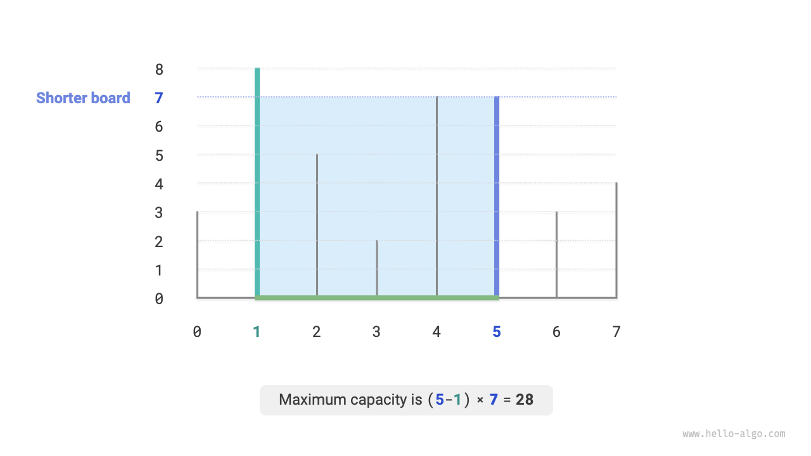

Thùng chứa được tạo thành bởi hai tấm vách ngăn bất kỳ, **vì vậy trạng thái của bài toán này là chỉ số của hai tấm vách ngăn, ký hiệu là $[i, j]$**.

Theo mô tả đề bài, dung tích bằng chiều cao nhân với chiều rộng, trong đó chiều cao được quyết định bởi tấm vách ngăn ngắn hơn và chiều rộng là hiệu giữa các chỉ số mảng của hai tấm vách ngăn. Giả sử dung tích là $cap[i, j]$; khi đó chúng ta thu được công thức sau:

$$
cap[i, j] = \min(ht[i], ht[j]) \times (j - i)
$$

Giả sử độ dài mảng là $n$. Khi đó số cách chọn hai tấm vách ngăn (tức là tổng số trạng thái) là $C_n^2 = \frac{n(n - 1)}{2}$. Cách tiếp cận trực tiếp nhất là **liệt kê vét cạn tất cả các trạng thái** để tìm dung tích tối đa, có độ phức tạp thời gian là $O(n^2)$.

### Xác định Chiến lược Tham ăn

Bài toán này có một giải pháp hiệu quả hơn. Như hiển thị trong hình bên dưới, xét một trạng thái $[i, j]$ trong đó $i < j$ và $ht[i] < ht[j]$. Trong trường hợp này, $i$ là tấm vách ngăn ngắn hơn và $j$ là tấm vách ngăn dài hơn.

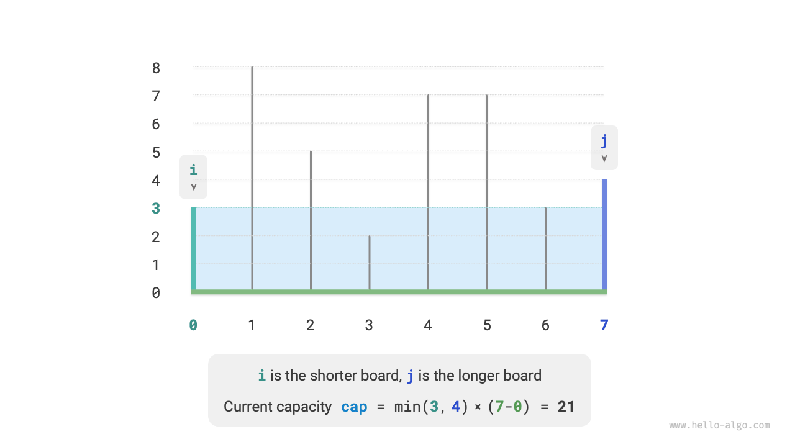

Như hiển thị trong hình bên dưới, **nếu bây giờ chúng ta dịch chuyển tấm vách ngăn dài hơn $j$ vào trong về phía tấm vách ngăn ngắn hơn $i$, dung tích chắc chắn sẽ giảm**.

Điều này là do sau khi dịch chuyển tấm vách ngăn dài hơn $j$, chiều rộng $j-i$ chắc chắn giảm. Vì chiều cao được quyết định bởi tấm vách ngăn ngắn hơn, chiều cao chỉ có thể giữ nguyên ($i$ vẫn là tấm vách ngăn ngắn hơn) hoặc giảm ($j$ trở thành tấm vách ngăn ngắn hơn sau khi bị dịch chuyển).

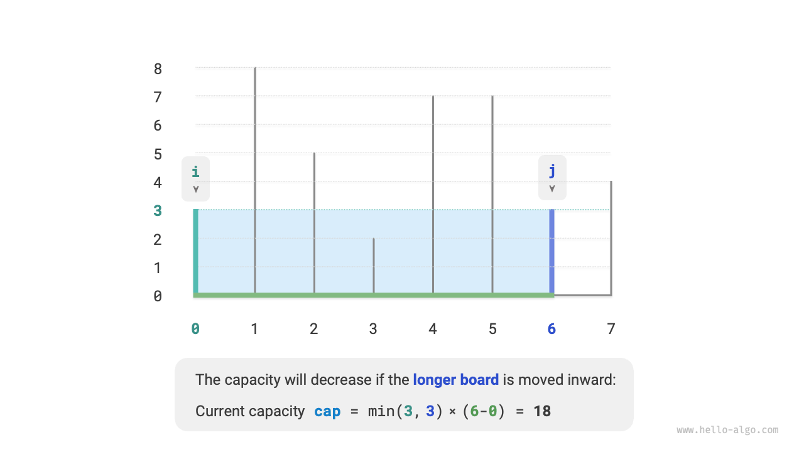

Ngược lại, **chỉ bằng cách dịch chuyển tấm vách ngăn ngắn hơn $i$ vào trong thì dung tích mới có thể tăng lên**. Mặc dù chiều rộng chắc chắn sẽ giảm, **chiều cao có thể tăng lên** (tấm vách ngăn được dịch chuyển tại $i$ có thể cao hơn). Ví dụ, trong hình bên dưới, diện tích tăng lên sau khi dịch chuyển tấm vách ngăn ngắn hơn.

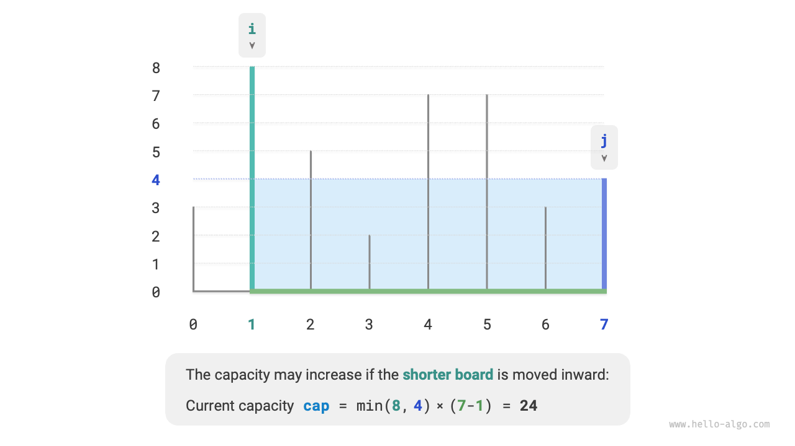

Từ đây, chúng ta có thể rút ra chiến lược tham ăn cho bài toán này: khởi tạo hai con trỏ ở hai đầu, và trong mỗi vòng dịch chuyển con trỏ tương ứng với tấm vách ngăn ngắn hơn vào trong cho đến khi hai con trỏ gặp nhau.

Hình bên dưới hiển thị quá trình thực thi của chiến lược tham ăn.

1. Ở trạng thái ban đầu, các con trỏ $i$ và $j$ nằm ở hai đầu của mảng.
2. Tính dung tích của trạng thái hiện tại $cap[i, j]$, và cập nhật dung tích tối đa.
3. So sánh chiều cao của các vách ngăn $i$ và $j$, và dịch chuyển con trỏ tương ứng với tấm vách ngăn ngắn hơn vào trong một vị trí.
4. Lặp lại các bước `2.` và `3.` cho đến khi $i$ và $j$ gặp nhau.

=== "<1>"
    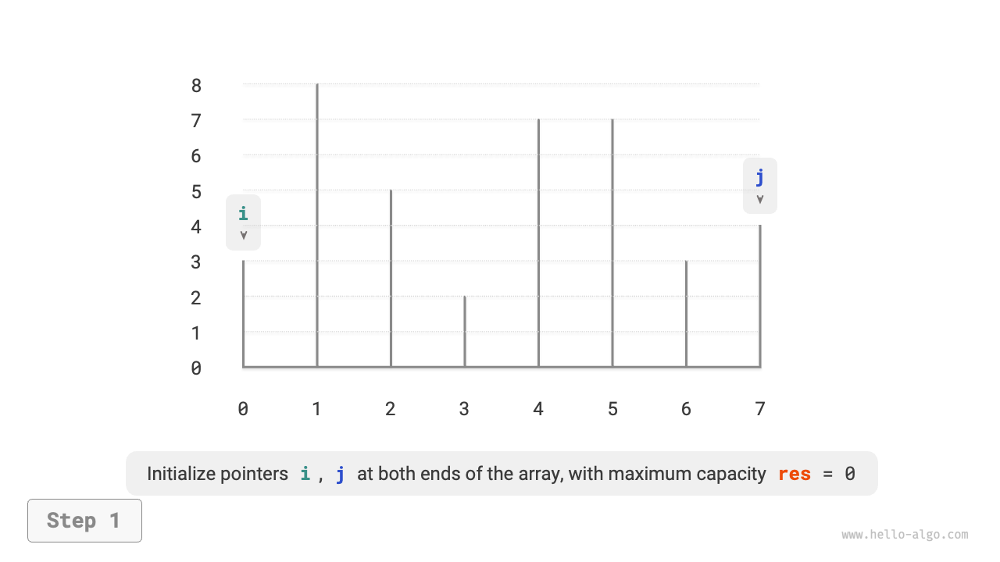

=== "<2>"
    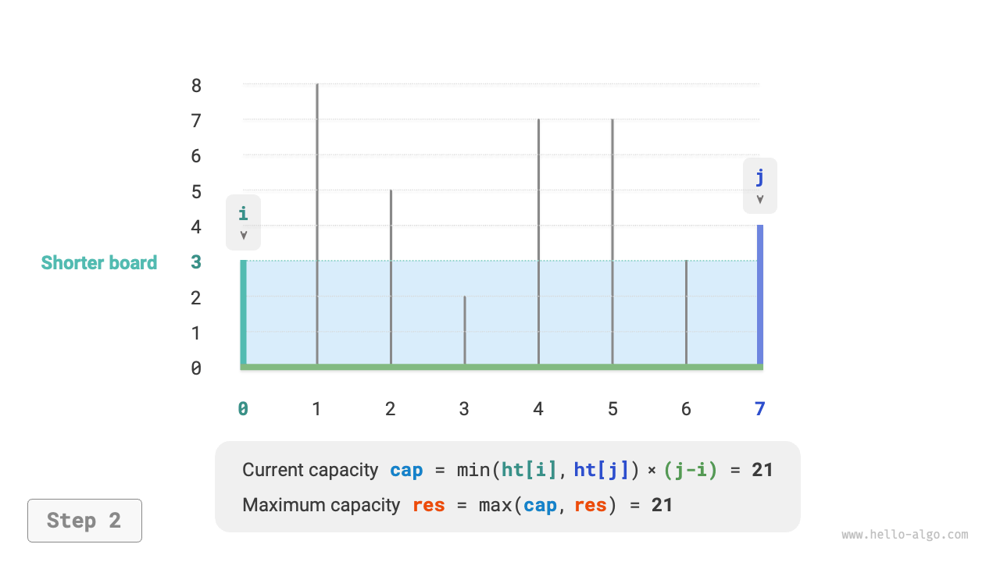

=== "<3>"
    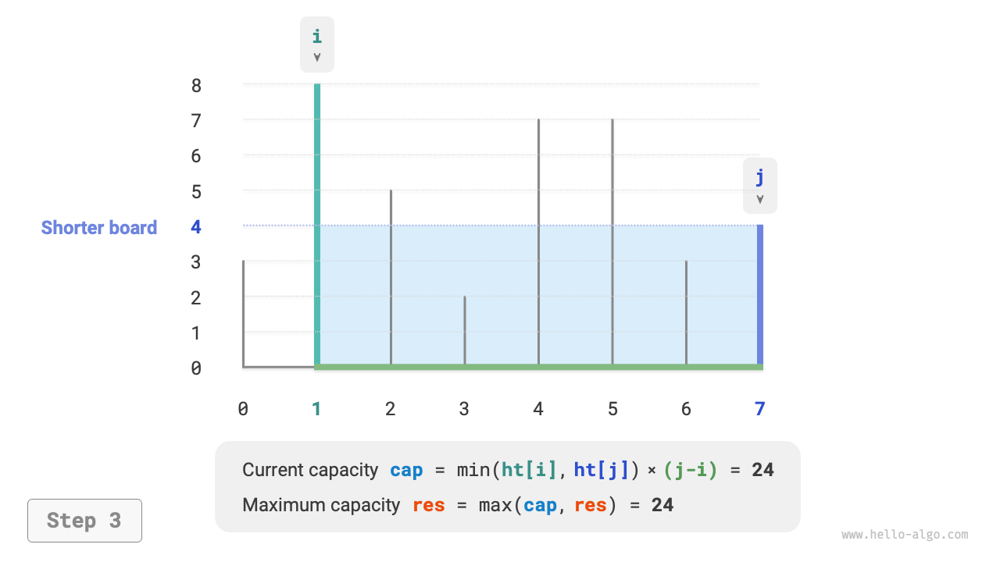

=== "<4>"
    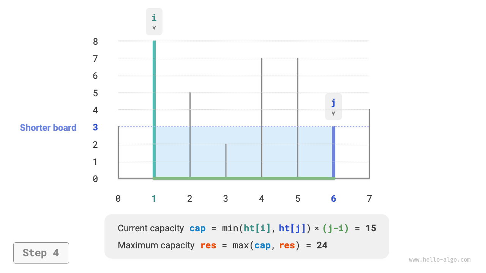

=== "<5>"
    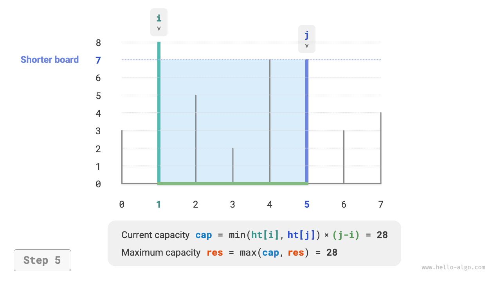

=== "<6>"
    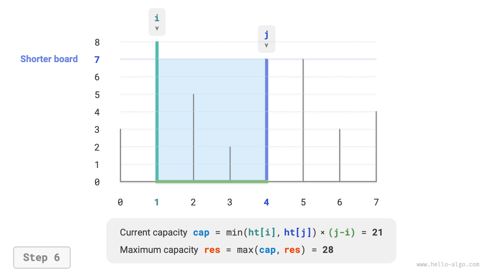

=== "<7>"
    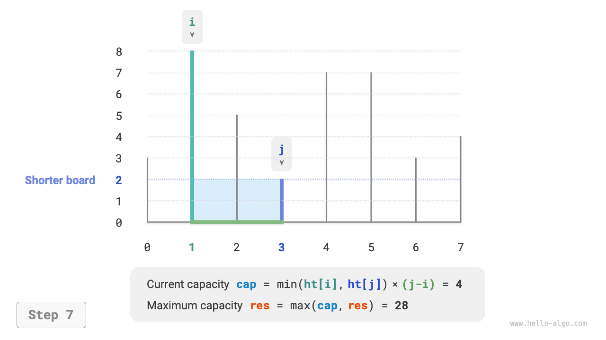

=== "<8>"
    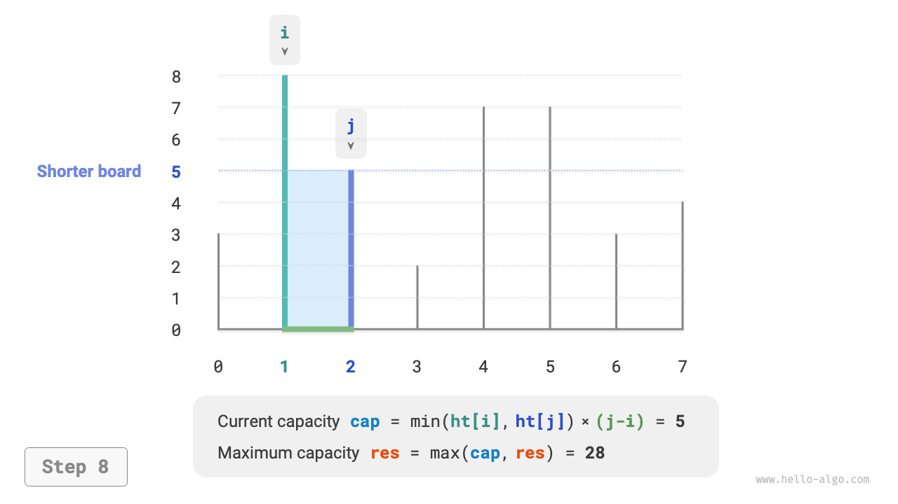

=== "<9>"
    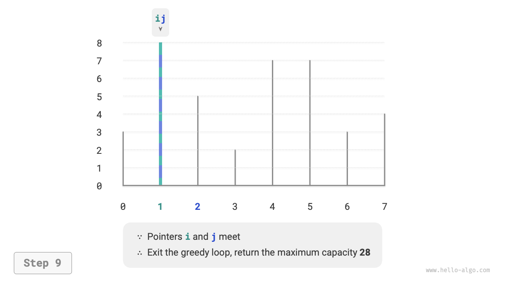

### Triển khai Mã nguồn

Mã nguồn chạy tối đa $n$ vòng, **vì vậy độ phức tạp thời gian là $O(n)$**.

Các biến $i$, $j$, và $res$ chỉ sử dụng một lượng không gian phụ trợ hằng số, **vì vậy độ phức tạp không gian là $O(1)$**.

```src
[file]{max_capacity}-[class]{}-[func]{max_capacity}
```

### Chứng minh Tính đúng đắn

Lý do tham ăn nhanh hơn liệt kê vét cạn là vì mỗi vòng lựa chọn tham ăn đã "bỏ qua" một số trạng thái.

Ví dụ, ở trạng thái $cap[i, j]$, giả sử $i$ là tấm vách ngăn ngắn hơn và $j$ là tấm vách ngăn dài hơn. Nếu chúng ta tham ăn dịch chuyển tấm vách ngăn ngắn hơn $i$ vào trong một vị trí, các trạng thái được hiển thị trong hình bên dưới sẽ bị "bỏ qua". **Điều này có nghĩa là dung tích của chúng không còn có thể được kiểm tra sau đó nữa**.

$$
cap[i, i+1], cap[i, i+2], \dots, cap[i, j-2], cap[i, j-1]
$$

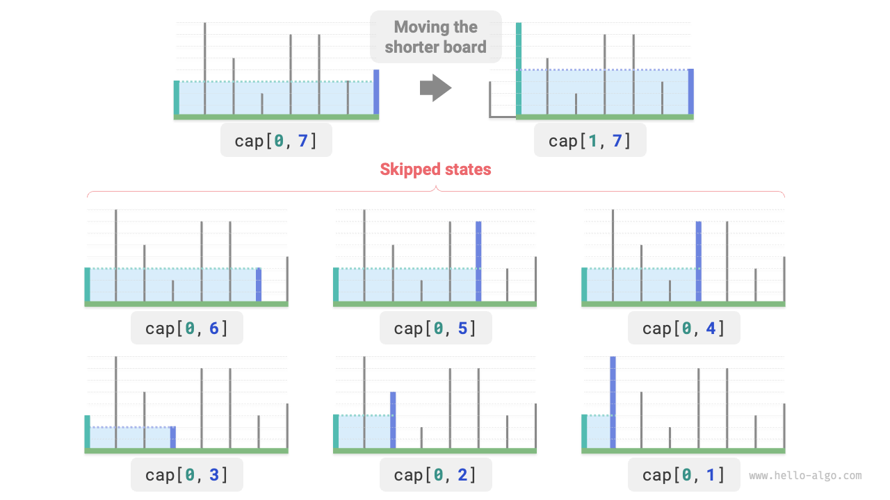

Nhìn kỹ hơn cho thấy **các trạng thái bị bỏ qua này chính là các trạng thái thu được bằng cách dịch chuyển tấm vách ngăn dài hơn $j$ vào trong**. Chúng ta đã chứng minh rằng việc dịch chuyển tấm vách ngăn dài hơn vào trong chắc chắn sẽ làm giảm dung tích. Do đó, không có trạng thái nào bị bỏ qua có thể là lời giải tối ưu, **vì vậy việc bỏ qua chúng không làm chúng ta bỏ lỡ điểm tối ưu**.

Phân tích trên cho thấy việc dịch chuyển tấm vách ngăn ngắn hơn là một thao tác "an toàn", và chiến lược tham ăn là hiệu quả.
