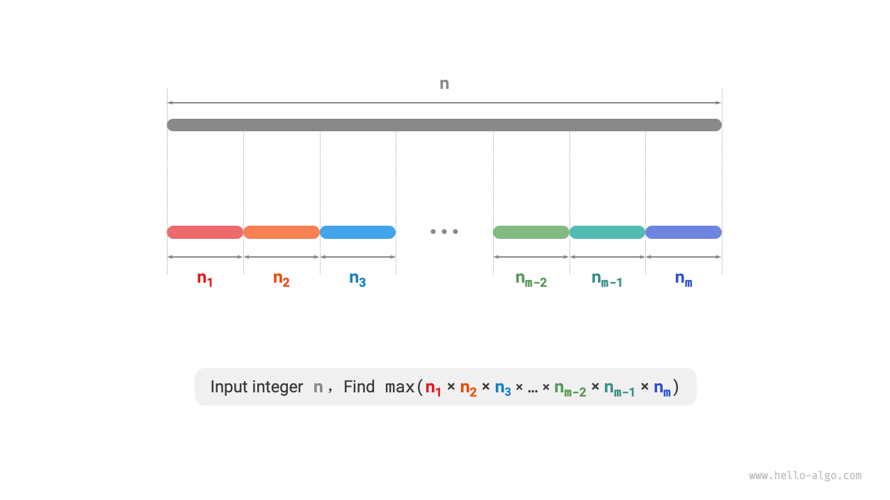
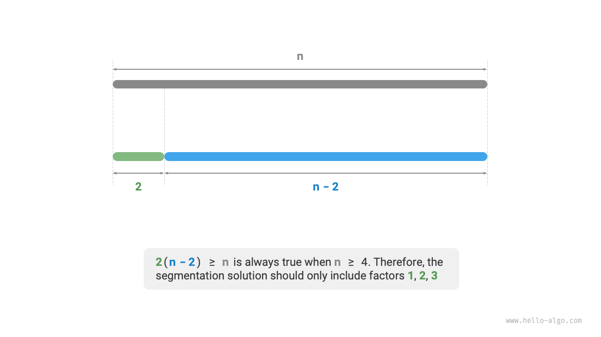
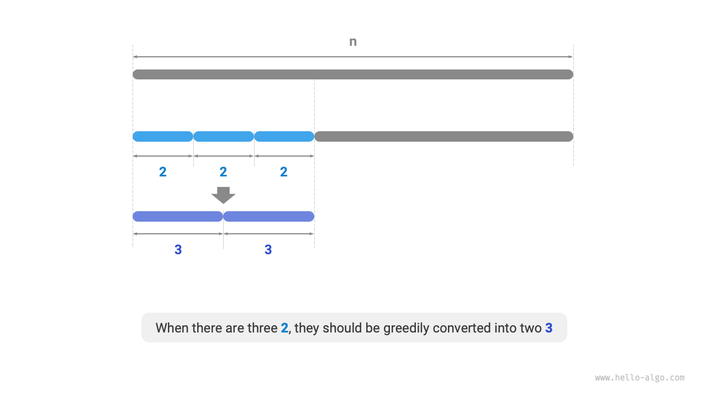
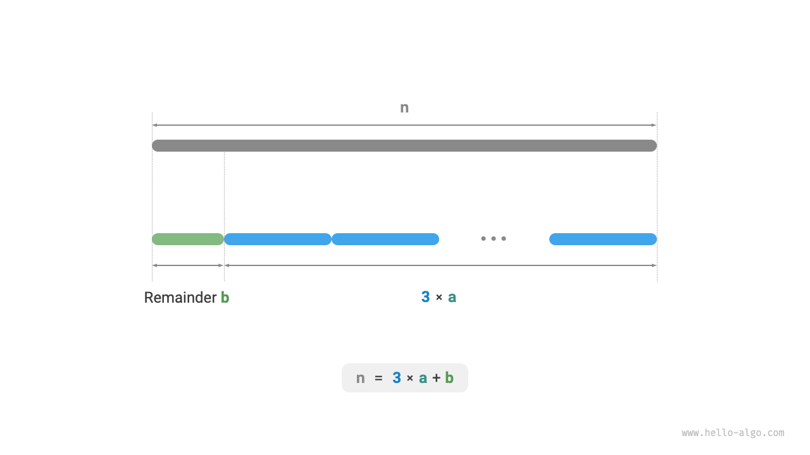

# Bài toán Tách số Cắt đoạn Tích lớn nhất (Max Product Cutting)

!!! question

    Cho một số nguyên dương $n$, hãy chia nó thành tổng của ít nhất hai số nguyên dương và tìm tích lớn nhất của các số nguyên thu được, như hiển thị trong hình bên dưới.



Giả sử chúng ta chia $n$ thành $m$ thừa số nguyên, trong đó thừa số thứ $i$ được ký hiệu là $n_i$, tức là

$$
n = \sum_{i=1}^{m}n_i
$$

Mục tiêu của bài toán này là tìm tích lớn nhất của tất cả các thừa số nguyên, cụ thể là

$$
\max(\prod_{i=1}^{m}n_i)
$$

Chúng ta cần xác định nên có bao nhiêu phần $m$ và mỗi $n_i$ nên là bao nhiêu.

### Xác định Chiến lược Tham ăn

Theo quy tắc kinh nghiệm, tích của hai số nguyên thường lớn hơn tổng của chúng. Giả sử chúng ta tách một thừa số $2$ ra khỏi $n$; tích thu được là $2(n-2)$. Chúng ta so sánh tích này với $n$:

$$
\begin{aligned}
2(n-2) & \geq n \newline
2n - n - 4 & \geq 0 \newline
n & \geq 4
\end{aligned}
$$

Như hiển thị trong hình bên dưới, khi $n \geq 4$, việc tách ra một số $2$ sẽ làm tăng tích, **điều này chỉ ra rằng các số nguyên lớn hơn hoặc bằng $4$ đều nên được tách tiếp**.

**Chiến lược tham ăn một**: Nếu phương án tách chứa một thừa số $\geq 4$, nó nên được tách tiếp. Phương án tách cuối cùng chỉ nên chứa các thừa số $1$, $2$, và $3$.



Tiếp theo, hãy xem xét thừa số nào là tối ưu. Trong số ba thừa số $1$, $2$, và $3$, rõ ràng $1$ là tồi nhất, vì $1 \times (n-1) < n$ luôn đúng, nghĩa là việc tách ra số $1$ sẽ thực sự làm giảm tích.

Như hiển thị trong hình bên dưới, khi $n = 6$, chúng ta có $3 \times 3 > 2 \times 2 \times 2$. **Điều này có nghĩa là việc tách ra số $3$ tốt hơn việc tách ra số $2$**.

**Chiến lược tham ăn hai**: Trong phương án tách, chỉ nên có tối đa hai số $2$, vì ba số $2$ luôn có thể thay thế bằng hai số $3$ để thu được tích lớn hơn.



Tóm lại, các chiến lược tham ăn sau có thể được rút ra.

1. Nhập số nguyên $n$, liên tục tách thừa số $3$ cho đến khi số dư là $0$, $1$, hoặc $2$.
2. Khi số dư là $0$, điều đó có nghĩa là $n$ là bội số của $3$, vì vậy không cần thực hiện thêm hành động nào.
3. Khi số dư là $2$, không tách tiếp; giữ nguyên như hiện tại.
4. Khi số dư là $1$, vì $2 \times 2 > 1 \times 3$, hãy thay thế số $3$ cuối cùng và số dư $1$ bằng hai số $2$.

### Triển khai Mã nguồn

Như hiển thị trong hình bên dưới, chúng ta không cần dùng vòng lặp để tách số nguyên. Thay vào đó, chúng ta sử dụng phép chia lấy phần nguyên để thu được số lượng số $3$, ký hiệu là $a$, và phép chia lấy phần dư để thu được số dư $b$, cho ra:

$$
n = 3 a + b
$$

Xin lưu ý rằng đối với trường hợp biên $n \leq 3$, một số $1$ phải được tách ra, với tích là $1 \times (n - 1)$.

```src
[file]{max_product_cutting}-[class]{}-[func]{max_product_cutting}
```



**Độ phức tạp thời gian phụ thuộc vào cách triển khai lũy thừa trong ngôn ngữ lập trình**. Lấy Python làm ví dụ, có ba cách phổ biến được sử dụng để tính lũy thừa.

- Cả toán tử `**` và hàm `pow()` đều có độ phức tạp thời gian $O(\log⁡ a)$.
- Hàm `math.pow()` gọi nội bộ hàm `pow()` của thư viện C, thực hiện tính lũy thừa số thực phẩy động, với độ phức tạp thời gian $O(1)$.

Các biến $a$ và $b$ sử dụng một lượng không gian phụ trợ hằng số, **do đó độ phức tạp không gian là $O(1)$**.

### Chứng minh Tính đúng đắn

Chúng ta sử dụng phương pháp chứng minh phản chứng và chỉ xét trường hợp $n \geq 4$.

1. **Tất cả các thừa số $\leq 3$**: Giả sử phương án tách tối ưu chứa một thừa số $x \geq 4$. Khi đó nó có thể được tách tiếp thành $2(x-2)$ để thu được tích lớn hơn (hoặc bằng). Điều này mâu thuẫn với giả định.
2. **Phương án tách không chứa $1$**: Giả sử phương án tách tối ưu chứa một thừa số là $1$. Khi đó nó có thể gộp vào một thừa số khác để thu được tích lớn hơn. Điều này mâu thuẫn với giả định.
3. **Phương án tách chứa tối đa hai số $2$**: Giả sử phương án tách tối ưu chứa ba số $2$. Khi đó chúng có thể được thay thế bằng hai số $3$, mang lại tích lớn hơn. Điều này mâu thuẫn với giả định.
