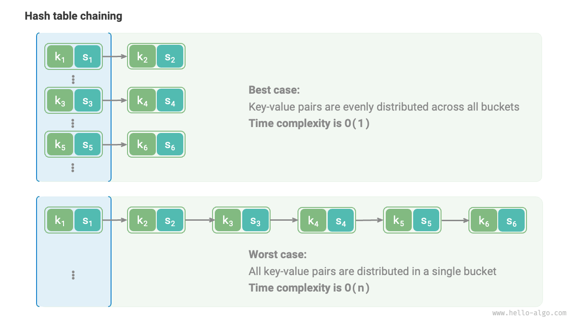

# 6.3 &nbsp; Thuật toán băm (Hash algorithms)

Hai phần trước đã giới thiệu nguyên lý hoạt động của bảng băm và các phương pháp xử lý va chạm băm. Tuy nhiên, cả phương pháp địa chỉ mở và phương pháp dây chuyền **chỉ đảm bảo bảng băm hoạt động bình thường khi xảy ra va chạm, chứ không thể giảm tần suất va chạm băm**.

Nếu va chạm băm xảy ra quá thường xuyên, hiệu năng của bảng băm sẽ giảm mạnh. Như hình dưới đây, với bảng băm kiểu dây chuyền, trong trường hợp lý tưởng, các cặp khóa-giá trị được phân bố đều vào các bucket, đạt hiệu quả truy vấn tối ưu; trong trường hợp xấu nhất, tất cả cặp khóa-giá trị nằm trong cùng một bucket, khiến độ phức tạp thời gian tăng lên $O(n)$.

{ class="animation-figure" }

<p align="center"> Figure 6-8 &nbsp; Trường hợp lý tưởng và xấu nhất của va chạm băm </p>

**Việc phân bố các cặp khóa-giá trị phụ thuộc vào hàm băm**. Nhớ lại các bước tính hàm băm, đầu tiên tính giá trị băm, sau đó lấy phần dư cho độ dài mảng:

```shell
index = hash(key) % capacity
```

Quan sát công thức trên, khi kích thước bảng băm `capacity` cố định, **thuật toán băm `hash()` quyết định giá trị đầu ra**, từ đó quyết định cách phân bố các cặp khóa-giá trị trong bảng băm.

Điều này có nghĩa là, để giảm xác suất va chạm băm, chúng ta nên tập trung vào việc thiết kế thuật toán băm `hash()`.

## 6.3.1 &nbsp; Mục tiêu của thuật toán băm

Để xây dựng cấu trúc dữ liệu bảng băm "nhanh và ổn định", thuật toán băm cần có các đặc điểm sau:

- **Tính xác định**: Với cùng một đầu vào, thuật toán băm phải luôn cho ra cùng một kết quả. Như vậy bảng băm mới đáng tin cậy.
- **Hiệu năng cao**: Quá trình tính giá trị băm phải đủ nhanh. Chi phí tính toán càng nhỏ, bảng băm càng thực tế.
- **Phân bố đều**: Thuật toán băm cần đảm bảo các cặp khóa-giá trị được phân bố đều trong bảng băm. Phân bố càng đều, xác suất va chạm càng thấp.

Thực tế, thuật toán băm không chỉ dùng để xây dựng bảng băm mà còn được ứng dụng rộng rãi ở nhiều lĩnh vực khác.

- **Lưu trữ mật khẩu**: Để bảo vệ mật khẩu người dùng, hệ thống thường không lưu mật khẩu gốc mà lưu giá trị băm của mật khẩu. Khi người dùng nhập mật khẩu, hệ thống tính giá trị băm của đầu vào và so sánh với giá trị đã lưu. Nếu trùng khớp, mật khẩu được xác nhận đúng.
- **Kiểm tra tính toàn vẹn dữ liệu**: Người gửi dữ liệu có thể tính giá trị băm của dữ liệu và gửi kèm; người nhận tính lại giá trị băm của dữ liệu nhận được và so sánh với giá trị đã nhận. Nếu trùng khớp, dữ liệu được coi là nguyên vẹn.

Đối với các ứng dụng mật mã, để ngăn chặn việc đảo ngược như suy ra mật khẩu gốc từ giá trị băm, thuật toán băm cần có các đặc tính bảo mật cao hơn.

- **Tính một chiều**: Không thể suy ra thông tin đầu vào từ giá trị băm.
- **Chống va chạm**: Rất khó để tìm hai đầu vào khác nhau cho ra cùng một giá trị băm.
- **Hiệu ứng thác lũ**: Thay đổi nhỏ ở đầu vào phải dẫn đến thay đổi lớn và khó đoán ở đầu ra.

Lưu ý rằng **"Phân bố đều" và "Chống va chạm" là hai khái niệm khác nhau**. Đạt được phân bố đều không đồng nghĩa với chống va chạm. Ví dụ, với đầu vào ngẫu nhiên `key`, hàm băm `key % 100` có thể cho kết quả phân bố đều. Tuy nhiên, thuật toán này quá đơn giản, tất cả các `key` có hai chữ số cuối giống nhau sẽ cho ra cùng một kết quả, dễ dàng suy ra `key` từ giá trị băm, dẫn đến nguy cơ bị phá mật khẩu.

## 6.3.2 &nbsp; Thiết kế thuật toán băm

Thiết kế thuật toán băm là vấn đề phức tạp, cần cân nhắc nhiều yếu tố. Tuy nhiên, với các trường hợp không yêu cầu cao, ta có thể thiết kế một số thuật toán băm đơn giản.

- **Băm cộng**: Cộng tất cả mã ASCII của từng ký tự trong đầu vào, dùng tổng đó làm giá trị băm.
- **Băm nhân**: Dựa vào tính không liên quan của phép nhân, mỗi vòng nhân với một hằng số, cộng dồn mã ASCII của từng ký tự vào giá trị băm.
- **Băm XOR**: Dùng phép XOR để cộng dồn giá trị băm của từng phần tử đầu vào.
- **Băm xoay**: Cộng dồn mã ASCII của từng ký tự vào giá trị băm, trước mỗi lần cộng thực hiện phép xoay trên giá trị băm.

=== "Python"

    ```python title="simple_hash.py"
    def add_hash(key: str) -> int:
        """Additive hash"""
        hash = 0
        modulus = 1000000007
        for c in key:
            hash += ord(c)
        return hash % modulus

    def mul_hash(key: str) -> int:
        """Multiplicative hash"""
        hash = 0
        modulus = 1000000007
        for c in key:
            hash = 31 * hash + ord(c)
        return hash % modulus

    def xor_hash(key: str) -> int:
        """XOR hash"""
        hash = 0
        modulus = 1000000007
        for c in key:
            hash ^= ord(c)
        return hash % modulus

    def rot_hash(key: str) -> int:
        """Rotational hash"""
        hash = 0
        modulus = 1000000007
        for c in key:
            hash = (hash << 4) ^ (hash >> 28) ^ ord(c)
        return hash % modulus
    ```

=== "C++"

    ```cpp title="simple_hash.cpp"
    /* Additive hash */
    int addHash(string key) {
        long long hash = 0;
        const int MODULUS = 1000000007;
        for (unsigned char c : key) {
            hash = (hash + (int)c) % MODULUS;
        }
        return (int)hash;
    }

    /* Multiplicative hash */
    int mulHash(string key) {
        long long hash = 0;
        const int MODULUS = 1000000007;
        for (unsigned char c : key) {
            hash = (31 * hash + (int)c) % MODULUS;
        }
        return (int)hash;
    }

    /* XOR hash */
    int xorHash(string key) {
        int hash = 0;
        const int MODULUS = 1000000007;
        for (unsigned char c : key) {
            hash ^= (int)c;
        }
        return hash & MODULUS;
    }

    /* Rotational hash */
    int rotHash(string key) {
        long long hash = 0;
        const int MODULUS = 1000000007;
        for (unsigned char c : key) {
            hash = ((hash << 4) ^ (hash >> 28) ^ (int)c) % MODULUS;
        }
        return (int)hash;
    }
    ```

=== "Java"

    ```java title="simple_hash.java"
    /* Additive hash */
    int addHash(String key) {
        long hash = 0;
        final int MODULUS = 1000000007;
        for (char c : key.toCharArray()) {
            hash = (hash + (int) c) % MODULUS;
        }
        return (int) hash;
    }

    /* Multiplicative hash */
    int mulHash(String key) {
        long hash = 0;
        final int MODULUS = 1000000007;
        for (char c : key.toCharArray()) {
            hash = (31 * hash + (int) c) % MODULUS;
        }
        return (int) hash;
    }

    /* XOR hash */
    int xorHash(String key) {
        int hash = 0;
        final int MODULUS = 1000000007;
        for (char c : key.toCharArray()) {
            hash ^= (int) c;
        }
        return hash & MODULUS;
    }

    /* Rotational hash */
    int rotHash(String key) {
        long hash = 0;
        final int MODULUS = 1000000007;
        for (char c : key.toCharArray()) {
            hash = ((hash << 4) ^ (hash >> 28) ^ (int) c) % MODULUS;
        }
        return (int) hash;
    }
    ```

=== "C#"

    ```csharp title="simple_hash.cs"
    [class]{simple_hash}-[func]{AddHash}

    [class]{simple_hash}-[func]{MulHash}

    [class]{simple_hash}-[func]{XorHash}

    [class]{simple_hash}-[func]{RotHash}
    ```

=== "Go"

    ```go title="simple_hash.go"
    [class]{}-[func]{addHash}

    [class]{}-[func]{mulHash}

    [class]{}-[func]{xorHash}

    [class]{}-[func]{rotHash}
    ```

=== "Swift"

    ```swift title="simple_hash.swift"
    [class]{}-[func]{addHash}

    [class]{}-[func]{mulHash}

    [class]{}-[func]{xorHash}

    [class]{}-[func]{rotHash}
    ```

=== "JS"

    ```javascript title="simple_hash.js"
    [class]{}-[func]{addHash}

    [class]{}-[func]{mulHash}

    [class]{}-[func]{xorHash}

    [class]{}-[func]{rotHash}
    ```

=== "TS"

    ```typescript title="simple_hash.ts"
    [class]{}-[func]{addHash}

    [class]{}-[func]{mulHash}

    [class]{}-[func]{xorHash}

    [class]{}-[func]{rotHash}
    ```

=== "Dart"

    ```dart title="simple_hash.dart"
    [class]{}-[func]{addHash}

    [class]{}-[func]{mulHash}

    [class]{}-[func]{xorHash}

    [class]{}-[func]{rotHash}
    ```

=== "Rust"

    ```rust title="simple_hash.rs"
    // Băm cộng: cộng giá trị (mã Unicode) của từng ký tự.
    // Đơn giản nhưng dễ va chạm nếu các chuỗi có cùng bộ ký tự nhưng khác thứ tự (ví dụ "abc" và "cba").
    fn add_hash(key: &str) -> i32 {
        let mut hash = 0_i64;
        const MODULUS: i64 = 1000000007;

        for c in key.chars() {
            hash = (hash + c as i64) % MODULUS;
        }

        hash as i32
    }

    // Băm nhân: một phương pháp phổ biến và hiệu quả hơn.
    // Nhân giá trị băm hiện tại với một hằng số (thường là số nguyên tố như 31) trước khi cộng ký tự tiếp theo.
    // Điều này làm cho giá trị băm phụ thuộc vào thứ tự của các ký tự.
    fn mul_hash(key: &str) -> i32 {
        let mut hash = 0_i64;
        const MODULUS: i64 = 1000000007;

        for c in key.chars() {
            hash = (31 * hash + c as i64) % MODULUS;
        }

        hash as i32
    }

    // Băm XOR: sử dụng phép toán XOR trên bit.
    // Giống như băm cộng, nó không phân biệt được thứ tự ký tự.
    fn xor_hash(key: &str) -> i32 {
        let mut hash = 0_i64;
        const MODULUS: i64 = 1000000007;

        for c in key.chars() {
            hash ^= c as i64;
        }

        (hash & MODULUS) as i32
    }

    // Băm xoay: một biến thể của băm nhân, kết hợp thêm các thao tác dịch chuyển bit.
    // Việc "xoay" các bit giúp tạo ra sự phân bố giá trị băm tốt hơn.
    fn rot_hash(key: &str) -> i32 {
        let mut hash = 0_i64;
        const MODULUS: i64 = 1000000007;

        for c in key.chars() {
            hash = ((hash << 4) ^ (hash >> 28) ^ c as i64) % MODULUS;
        }

        hash as i32
    }
    ```

=== "C"

    ```c title="simple_hash.c"
    [class]{}-[func]{addHash}

    [class]{}-[func]{mulHash}

    [class]{}-[func]{xorHash}

    [class]{}-[func]{rotHash}
    ```

=== "Kotlin"

    ```kotlin title="simple_hash.kt"
    [class]{}-[func]{addHash}

    [class]{}-[func]{mulHash}

    [class]{}-[func]{xorHash}

    [class]{}-[func]{rotHash}
    ```

=== "Ruby"

    ```ruby title="simple_hash.rb"
    [class]{}-[func]{add_hash}

    [class]{}-[func]{mul_hash}

    [class]{}-[func]{xor_hash}

    [class]{}-[func]{rot_hash}
    ```

=== "Zig"

    ```zig title="simple_hash.zig"
    [class]{}-[func]{addHash}

    [class]{}-[func]{mulHash}

    [class]{}-[func]{xorHash}

    [class]{}-[func]{rotHash}
    ```

Ta thấy bước cuối của mỗi thuật toán băm là lấy phần dư cho số nguyên tố lớn $1000000007$ để đảm bảo giá trị băm nằm trong phạm vi hợp lý. Đáng để suy nghĩ tại sao lại nhấn mạnh lấy phần dư cho số nguyên tố, hoặc nhược điểm của việc lấy phần dư cho số hợp thành là gì? Đây là một câu hỏi thú vị.

Kết luận: **Dùng số nguyên tố lớn làm số chia dư giúp tối đa hóa sự phân bố đều của giá trị băm**. Vì số nguyên tố không có ước chung với các số khác, nó giúp giảm các mẫu tuần hoàn do phép chia dư gây ra, từ đó tránh va chạm băm.

Ví dụ, nếu chọn số hợp thành $9$ làm số chia dư, vì chia hết cho $3$, tất cả các `key` chia hết cho $3$ sẽ cho ra giá trị băm $0$, $3$, $6$.

$$
\begin{aligned}
\text{modulus} & = 9 \newline
\text{key} & = \{ 0, 3, 6, 9, 12, 15, 18, 21, 24, 27, 30, 33, \dots \} \newline
\text{hash} & = \{ 0, 3, 6, 0, 3, 6, 0, 3, 6, 0, 3, 6,\dots \}
\end{aligned}
$$

Nếu đầu vào `key` có phân bố kiểu cấp số cộng như vậy, giá trị băm sẽ bị dồn lại, làm tăng va chạm. Nếu thay `modulus` bằng số nguyên tố $13$, vì không có ước chung giữa `key` và `modulus`, độ đều của giá trị băm sẽ được cải thiện rõ rệt.

$$
\begin{aligned}
\text{modulus} & = 13 \newline
\text{key} & = \{ 0, 3, 6, 9, 12, 15, 18, 21, 24, 27, 30, 33, \dots \} \newline
\text{hash} & = \{ 0, 3, 6, 9, 12, 2, 5, 8, 11, 1, 4, 7, \dots \}
\end{aligned}
$$

Lưu ý, nếu `key` đảm bảo phân bố ngẫu nhiên và đều, thì chọn số nguyên tố hay số hợp thành làm số chia dư đều cho ra giá trị băm phân bố đều. Tuy nhiên, khi phân bố của `key` có tính tuần hoàn, chia dư cho số hợp thành dễ gây dồn giá trị băm.

Tóm lại, ta thường chọn số nguyên tố làm số chia dư, và số này nên đủ lớn để loại bỏ các mẫu tuần hoàn, tăng độ ổn định của thuật toán băm.

## 6.3.3 &nbsp; Các thuật toán băm phổ biến

Dễ thấy các thuật toán băm đơn giản ở trên khá "yếu" và chưa đạt được mục tiêu thiết kế của thuật toán băm. Ví dụ, phép cộng và XOR tuân theo tính giao hoán, nên băm cộng và băm XOR không phân biệt được các chuỗi có cùng nội dung nhưng thứ tự khác nhau, dễ gây va chạm và mất an toàn.

Trong thực tế, ta thường dùng các thuật toán băm chuẩn như MD5, SHA-1, SHA-2, SHA-3. Chúng có thể ánh xạ dữ liệu đầu vào với độ dài bất kỳ thành giá trị băm có độ dài cố định.

Trong thế kỷ qua, các thuật toán băm liên tục được nâng cấp và tối ưu. Một số nhà nghiên cứu cố gắng cải thiện hiệu năng, trong khi những người khác (bao gồm cả hacker) lại tìm cách phát hiện lỗ hổng bảo mật. Bảng dưới đây liệt kê các thuật toán băm thường dùng trong thực tế.

- MD5 và SHA-1 đã bị tấn công thành công nhiều lần, nên bị loại bỏ khỏi các ứng dụng bảo mật.
- Dòng SHA-2, đặc biệt là SHA-256, là một trong những thuật toán băm an toàn nhất hiện nay, chưa bị tấn công thành công, nên được dùng phổ biến trong các ứng dụng và giao thức bảo mật.
- SHA-3 có chi phí triển khai thấp hơn và hiệu năng tính toán cao hơn SHA-2, nhưng hiện chưa được sử dụng rộng rãi như dòng SHA-2.

<p align="center"> Bảng <id> &nbsp; Các thuật toán băm phổ biến </p>

<div class="center-table" markdown>

|                 | MD5                                             | SHA-1                               | SHA-2                                                             | SHA-3                        |
| --------------- | ----------------------------------------------- | ----------------------------------- | ----------------------------------------------------------------- | ---------------------------- |
| Năm phát hành   | 1992                                            | 1995                                | 2002                                                              | 2008                         |
| Độ dài đầu ra   | 128 bit                                         | 160 bit                             | 256/512 bit                                                       | 224/256/384/512 bit          |
| Va chạm băm     | Thường xuyên                                    | Thường xuyên                        | Hiếm                                                              | Hiếm                         |
| Mức độ bảo mật  | Thấp, đã bị tấn công thành công                 | Thấp, đã bị tấn công thành công     | Cao                                                               | Cao                          |
| Ứng dụng        | Đã loại bỏ, vẫn dùng kiểm tra tính toàn vẹn dữ liệu | Đã loại bỏ                       | Xác minh giao dịch tiền mã hóa, chữ ký số, v.v.                   | Có thể thay thế SHA-2        |

</div>

# Giá trị băm trong cấu trúc dữ liệu

Ta biết rằng khóa trong bảng băm có thể thuộc nhiều kiểu dữ liệu như số nguyên, số thực, hoặc chuỗi. Các ngôn ngữ lập trình thường cung cấp sẵn thuật toán băm cho các kiểu dữ liệu này để tính chỉ số bucket trong bảng băm. Ví dụ với Python, ta có thể dùng hàm `hash()` để tính giá trị băm cho nhiều kiểu dữ liệu.

- Giá trị băm của số nguyên và kiểu boolean chính là giá trị của nó.
- Việc tính giá trị băm cho số thực và chuỗi phức tạp hơn, bạn có thể tự tìm hiểu thêm.
- Giá trị băm của tuple là sự kết hợp giá trị băm của từng phần tử, cho ra một giá trị băm duy nhất.
- Giá trị băm của đối tượng được tạo dựa trên địa chỉ bộ nhớ. Nếu ghi đè phương thức băm của đối tượng, giá trị băm có thể dựa trên nội dung.

!!! tip

    Lưu ý rằng cách định nghĩa và phương pháp tính giá trị băm của hàm có sẵn ở các ngôn ngữ lập trình khác nhau là khác nhau.

=== "Python"

    ```python title="built_in_hash.py"
    num = 3
    hash_num = hash(num)
    # Giá trị băm của số nguyên 3 là 3

    bol = True
    hash_bol = hash(bol)
    # Giá trị băm của kiểu boolean True là 1

    dec = 3.14159
    hash_dec = hash(dec)
    # Giá trị băm của số thực 3.14159 là 326484311674566659

    str = "Hello 算法"
    hash_str = hash(str)
    # Giá trị băm của chuỗi "Hello 算法" là 4617003410720528961

    tup = (12836, "小哈")
    hash_tup = hash(tup)
    # Giá trị băm của tuple (12836, '小哈') là 1029005403108185979

    obj = ListNode(0)
    hash_obj = hash(obj)
    # Giá trị băm của đối tượng ListNode tại 0x1058fd810 là 274267521
    ```

=== "C++"

    ```cpp title="built_in_hash.cpp"
    int num = 3;
    size_t hashNum = hash<int>()(num);
    // Giá trị băm của số nguyên 3 là 3

    bool bol = true;
    size_t hashBol = hash<bool>()(bol);
    // Giá trị băm của kiểu boolean 1 là 1

    double dec = 3.14159;
    size_t hashDec = hash<double>()(dec);
    // Giá trị băm của số thực 3.14159 là 4614256650576692846

    string str = "Hello 算法";
    size_t hashStr = hash<string>()(str);
    // Giá trị băm của chuỗi "Hello 算法" là 15466937326284535026

    // Trong C++, std::hash() chỉ cung cấp giá trị băm cho kiểu dữ liệu cơ bản
    // Giá trị băm cho mảng và đối tượng cần tự cài đặt
    ```

=== "Java"

    ```java title="built_in_hash.java"
    int num = 3;
    int hashNum = Integer.hashCode(num);
    // Giá trị băm của số nguyên 3 là 3

    boolean bol = true;
    int hashBol = Boolean.hashCode(bol);
    // Giá trị băm của kiểu boolean true là 1231

    double dec = 3.14159;
    int hashDec = Double.hashCode(dec);
    // Giá trị băm của số thực 3.14159 là -1340954729

    String str = "Hello 算法";
    int hashStr = str.hashCode();
    // Giá trị băm của chuỗi "Hello 算法" là -727081396

    Object[] arr = { 12836, "小哈" };
    int hashTup = Arrays.hashCode(arr);
    // Giá trị băm của mảng [12836, 小哈] là 1151158

    ListNode obj = new ListNode(0);
    int hashObj = obj.hashCode();
    // Giá trị băm của đối tượng ListNode utils.ListNode@7dc5e7b4 là 2110121908
    ```

=== "C#"

    ```csharp title="built_in_hash.cs"
    int num = 3;
    int hashNum = num.GetHashCode();
    // Giá trị băm của số nguyên 3 là 3;

    bool bol = true;
    int hashBol = bol.GetHashCode();
    // Giá trị băm của kiểu boolean true là 1;

    double dec = 3.14159;
    int hashDec = dec.GetHashCode();
    // Giá trị băm của số thực 3.14159 là -1340954729;

    string str = "Hello 算法";
    int hashStr = str.GetHashCode();
    // Giá trị băm của chuỗi "Hello 算法" là -586107568;

    object[] arr = [12836, "小哈"];
    int hashTup = arr.GetHashCode();
    // Giá trị băm của mảng [12836, 小哈] là 42931033;

    ListNode obj = new(0);
    int hashObj = obj.GetHashCode();
    // Giá trị băm của đối tượng ListNode 0 là 39053774;
    ```

=== "Go"

    ```go title="built_in_hash.go"
    // Go không cung cấp hàm tính giá trị băm sẵn
    ```

=== "Swift"

    ```swift title="built_in_hash.swift"
    let num = 3
    let hashNum = num.hashValue
    // Giá trị băm của số nguyên 3 là 9047044699613009734

    let bol = true
    let hashBol = bol.hashValue
    // Giá trị băm của kiểu boolean true là -4431640247352757451

    let dec = 3.14159
    let hashDec = dec.hashValue
    // Giá trị băm của số thực 3.14159 là -2465384235396674631

    let str = "Hello 算法"
    let hashStr = str.hashValue
    // Giá trị băm của chuỗi "Hello 算法" là -7850626797806988787

    let arr = [AnyHashable(12836), AnyHashable("小哈")]
    let hashTup = arr.hashValue
    // Giá trị băm của mảng [AnyHashable(12836), AnyHashable("小哈")] là -2308633508154532996

    let obj = ListNode(x: 0)
    let hashObj = obj.hashValue
    // Giá trị băm của đối tượng ListNode utils.ListNode là -2434780518035996159
    ```

=== "JS"

    ```javascript title="built_in_hash.js"
    // JavaScript không cung cấp hàm tính giá trị băm sẵn
    ```

=== "TS"

    ```typescript title="built_in_hash.ts"
    // TypeScript không cung cấp hàm tính giá trị băm sẵn
    ```

=== "Dart"

    ```dart title="built_in_hash.dart"
    int num = 3;
    int hashNum = num.hashCode;
    // Giá trị băm của số nguyên 3 là 34803

    bool bol = true;
    int hashBol = bol.hashCode;
    // Giá trị băm của kiểu boolean true là 1231

    double dec = 3.14159;
    int hashDec = dec.hashCode;
    // Giá trị băm của số thực 3.14159 là 2570631074981783

    String str = "Hello 算法";
    int hashStr = str.hashCode;
    // Giá trị băm của chuỗi "Hello 算法" là 468167534

    List arr = [12836, "小哈"];
    int hashArr = arr.hashCode;
    // Giá trị băm của mảng [12836, 小哈] là 976512528

    ListNode obj = new ListNode(0);
    int hashObj = obj.hashCode;
    // Giá trị băm của đối tượng ListNode Instance of 'ListNode' là 1033450432
    ```

=== "Rust"

    ```rust title="built_in_hash.rs"
    use std::collections::hash_map::DefaultHasher;
    use std::hash::{Hash, Hasher};

    let num = 3;
    let mut num_hasher = DefaultHasher::new();
    num.hash(&mut num_hasher);
    let hash_num = num_hasher.finish();
    // Giá trị băm của số nguyên 3 là 568126464209439262

    let bol = true;
    let mut bol_hasher = DefaultHasher::new();
    bol.hash(&mut bol_hasher);
    let hash_bol = bol_hasher.finish();
    // Giá trị băm của kiểu boolean true là 4952851536318644461

    let dec: f32 = 3.14159;
    let mut dec_hasher = DefaultHasher::new();
    dec.to_bits().hash(&mut dec_hasher);
    let hash_dec = dec_hasher.finish();
    // Giá trị băm của số thực 3.14159 là 2566941990314602357

    let str = "Hello 算法";
    let mut str_hasher = DefaultHasher::new();
    str.hash(&mut str_hasher);
    let hash_str = str_hasher.finish();
    // Giá trị băm của chuỗi "Hello 算法" là 16092673739211250988

    let arr = (&12836, &"小哈");
    let mut tup_hasher = DefaultHasher::new();
    arr.hash(&mut tup_hasher);
    let hash_tup = tup_hasher.finish();
    // Giá trị băm của tuple (12836, "小哈") là 1885128010422702749

    let node = ListNode::new(42);
    let mut hasher = DefaultHasher::new();
    node.borrow().val.hash(&mut hasher);
    let hash = hasher.finish();
    // Giá trị băm của đối tượng ListNode RefCell { value: ListNode { val: 42, next: None } } là 15387811073369036852
    ```

=== "C"

    ```c title="built_in_hash.c"
    // C không cung cấp hàm tính giá trị băm sẵn
    ```

=== "Kotlin"

    ```kotlin title="built_in_hash.kt"

    ```

=== "Zig"

    ```zig title="built_in_hash.zig"

    ```

??? pythontutor "Code Visualization"

    <div style="height: 549px; width: 100%;"><iframe class="pythontutor-iframe" src="https://pythontutor.com/iframe-embed.html#code=class%20ListNode%3A%0A%20%20%20%20%22%22%22%E9%93%BE%E8%A1%A8%E8%8A%82%E7%82%B9%E7%B1%BB%22%22%22%0A%20%20%20%20def%20__init__%28self,%20val%3A%20int%29%3A%0A%20%20%20%20%20%20%20%20self.val%3A%20int%20%3D%20val%20%20%23%20%E8%8A%82%E7%82%B9%E5%80%BC%0A%20%20%20%20%20%20%20%20self.next%3A%20ListNode%20%7C%20None%20%3D%20None%20%20%23%20%E5%90%8E%E7%BB%A7%E8%8A%82%E7%82%B9%E5%BC%95%E7%94%A8%0A%0A%22%22%22Driver%20Code%22%22%22%0Aif%20__name__%20%3D%3D%20%22__main__%22%3A%0A%20%20%20%20num%20%3D%203%0A%20%20%20%20hash_num%20%3D%20hash%28num%29%0A%20%20%20%20%23%20%E6%95%B4%E6%95%B0%203%20%E7%9A%84%E5%93%88%E5%B8%8C%E5%80%BC%E4%B8%BA%203%0A%0A%20%20%20%20bol%20%3D%20True%0A%20%20%20%20hash_bol%20%3D%20hash%28bol%29%0A%20%20%20%20%23%20%E5%B8%83%E5%B0%94%E9%87%8F%20True%20%E7%9A%84%E5%93%88%E5%B8%8C%E5%80%BC%E4%B8%BA%201%0A%0A%20%20%20%20dec%20%3D%203.14159%0A%20%20%20%20hash_dec%20%3D%20hash%28dec%29%0A%20%20%20%20%23%20%E5%B0%8F%E6%95%B0%203.14159%20%E7%9A%84%E5%93%88%E5%B8%8C%E5%80%BC%E4%B8%BA%20326484311674566659%0A%0A%20%20%20%20str%20%3D%20%22Hello%20%E7%AE%97%E6%B3%95%22%0A%20%20%20%20hash_str%20%3D%20hash%28str%29%0A%20%20%20%20%23%20%E5%AD%97%E7%AC%A6%E4%B8%B2%E2%80%9CHello%20%E7%AE%97%E6%B3%95%E2%80%9D%E7%9A%84%E5%93%88%E5%B8%8C%E5%80%BC%E4%B8%BA%204617003410720528961%0A%0A%20%20%20%20tup%20%3D%20%2812836,%20%22%E5%B0%8F%E5%93%88%22%29%0A%20%20%20%20hash_tup%20%3D%20hash%28tup%29%0A%20%20%20%20%23%20%E5%85%83%E7%BB%84%20%2812836,%20'%E5%B0%8F%E5%93%88'%29%20%E7%9A%84%E5%93%88%E5%B8%8C%E5%80%BC%E4%B8%BA%201029005403108185979%0A%0A%20%20%20%20obj%20%3D%20ListNode%280%29%0A%20%20%20%20hash_obj%20%3D%20hash%28obj%29%0A%20%20%20%20%23%20%E8%8A%82%E7%82%B9%E5%AF%B9%E8%B1%A1%20%3CListNode%20object%20at%200x1058fd810%3E%20%E7%9A%84%E5%93%88%E5%B8%8C%E5%80%BC%E4%B8%BA%20274267521&codeDivHeight=472&codeDivWidth=350&cumulative=false&curInstr=19&heapPrimitives=nevernest&origin=opt-frontend.js&py=311&rawInputLstJSON=%5B%5D&textReferences=false"> </iframe></div>
    <div style="margin-top: 5px;"><a href="https://pythontutor.com/iframe-embed.html#code=class%20ListNode%3A%0A%20%20%20%20%22%22%22%E9%93%BE%E8%A1%A8%E8%8A%82%E7%82%B9%E7%B1%BB%22%22%22%0A%20%20%20%20def%20__init__%28self,%20val%3A%20int%29%3A%0A%20%20%20%20%20%20%20%20self.val%3A%20int%20%3D%20val%20%20%23%20%E8%8A%82%E7%82%B9%E5%80%BC%0A%20%20%20%20%20%20%20%20self.next%3A%20ListNode%20%7C%20None%20%3D%20None%20%20%23%20%E5%90%8E%E7%BB%A7%E8%8A%82%E7%82%B9%E5%BC%95%E7%94%A8%0A%0A%22%22%22Driver%20Code%22%22%22%0Aif%20__name__%20%3D%3D%20%22__main__%22%3A%0A%20%20%20%20num%20%3D%203%0A%20%20%20%20hash_num%20%3D%20hash%28num%29%0A%20%20%20%20%23%20%E6%95%B4%E6%95%B0%203%20%E7%9A%84%E5%93%88%E5%B8%8C%E5%80%BC%E4%B8%BA%203%0A%0A%20%20%20%20bol%20%3D%20True%0A%20%20%20%20hash_bol%20%3D%20hash%28bol%29%0A%20%20%20%20%23%20%E5%B8%83%E5%B0%94%E9%87%8F%20True%20%E7%9A%84%E5%93%88%E5%B8%8C%E5%80%BC%E4%B8%BA%201%0A%0A%20%20%20%20dec%20%3D%203.14159%0A%20%20%20%20hash_dec%20%3D%20hash%28dec%29%0A%20%20%20%20%23%20%E5%B0%8F%E6%95%B0%203.14159%20%E7%9A%84%E5%93%88%E5%B8%8C%E5%80%BC%E4%B8%BA%20326484311674566659%0A%0A%20%20%20%20str%20%3D%20%22Hello%20%E7%AE%97%E6%B3%95%22%0A%20%20%20%20hash_str%20%3D%20hash%28str%29%0A%20%20%20%20%23%20%E5%AD%97%E7%AC%A6%E4%B8%B2%E2%80%9CHello%20%E7%AE%97%E6%B3%95%E2%80%9D%E7%9A%84%E5%93%88%E5%B8%8C%E5%80%BC%E4%B8%BA%204617003410720528961%0A%0A%20%20%20%20tup%20%3D%20%2812836,%20%22%E5%B0%8F%E5%93%88%22%29%0A%20%20%20%20hash_tup%20%3D%20hash%28tup%29%0A%20%20%20%20%23%20%E5%85%83%E7%BB%84%20%2812836,%20'%E5%B0%8F%E5%93%88'%29%20%E7%9A%84%E5%93%88%E5%B8%8C%E5%80%BC%E4%B8%BA%201029005403108185979%0A%0A%20%20%20%20obj%20%3D%20ListNode%280%29%0A%20%20%20%20hash_obj%20%3D%20hash%28obj%29%0A%20%20%20%20%23%20%E8%8A%82%E7%82%B9%E5%AF%B9%E8%B1%A1%20%3CListNode%20object%20at%200x1058fd810%3E%20%E7%9A%84%E5%93%88%E5%B8%8C%E5%80%BC%E4%B8%BA%20274267521&codeDivHeight=800&codeDivWidth=600&cumulative=false&curInstr=19&heapPrimitives=nevernest&origin=opt-frontend.js&py=311&rawInputLstJSON=%5B%5D&textReferences=false" target="_blank" rel="noopener noreferrer">Full Screen ></a></div>

Ở nhiều ngôn ngữ lập trình, **chỉ các đối tượng bất biến mới có thể làm `key` trong bảng băm**. Nếu dùng danh sách (mảng động) làm `key`, khi nội dung danh sách thay đổi, giá trị băm cũng thay đổi, và ta sẽ không tìm được giá trị gốc trong bảng băm.

Dù các biến thành viên của đối tượng tự định nghĩa (như nút danh sách liên kết) là có thể thay đổi, nó vẫn có thể băm được. **Vì giá trị băm của đối tượng thường dựa trên địa chỉ bộ nhớ**, nên dù nội dung thay đổi, địa chỉ bộ nhớ vẫn giữ nguyên, giá trị băm không đổi.

Bạn có thể nhận thấy giá trị băm xuất ra ở các console khác nhau là khác nhau. **Đó là vì trình thông dịch Python thêm một chuỗi ngẫu nhiên (salt) vào hàm băm chuỗi mỗi lần khởi động**. Cách này giúp ngăn chặn tấn công HashDoS và tăng bảo mật cho thuật toán băm.
