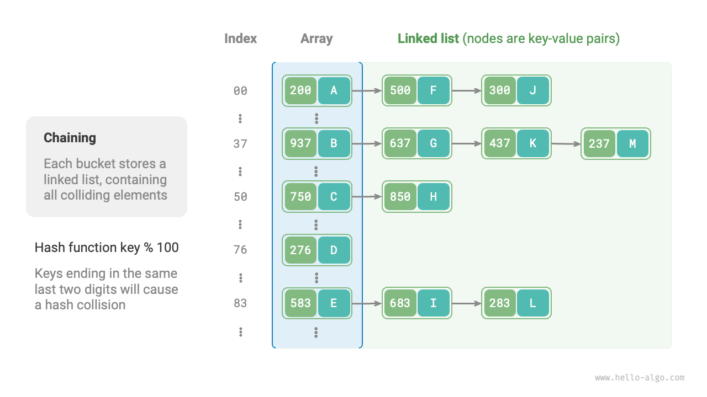
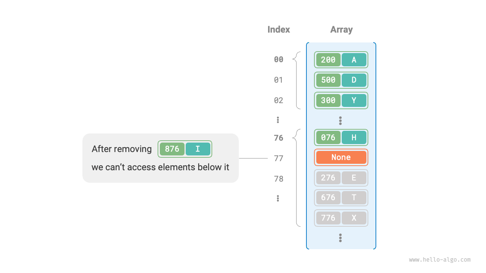

# Va chạm băm (Hash collision)

Phần trước đã đề cập rằng, **trong hầu hết các trường hợp, không gian đầu vào của hàm băm lớn hơn rất nhiều so với không gian đầu ra**, nên về lý thuyết, va chạm băm là điều không thể tránh khỏi. Ví dụ, nếu không gian đầu vào là tất cả các số nguyên và không gian đầu ra là kích thước của mảng, thì nhiều số nguyên chắc chắn sẽ được ánh xạ vào cùng một vị trí trong mảng.

Va chạm băm có thể dẫn đến kết quả truy vấn sai, ảnh hưởng nghiêm trọng đến khả năng sử dụng của bảng băm. Để giải quyết vấn đề này, mỗi khi xảy ra va chạm băm, chúng ta thực hiện mở rộng bảng băm cho đến khi va chạm biến mất. Cách này khá đơn giản, dễ hiểu và hoạt động tốt. Tuy nhiên, nó lại kém hiệu quả vì việc mở rộng bảng đòi hỏi phải di chuyển nhiều dữ liệu và tính toán lại mã băm, rất tốn tài nguyên. Để cải thiện hiệu suất, ta có thể áp dụng các chiến lược sau:

1. Cải tiến cấu trúc bảng băm để **vẫn có thể xác định đúng phần tử cần tìm khi xảy ra va chạm băm**.
2. Chỉ mở rộng bảng khi thực sự cần thiết, tức là khi xuất hiện va chạm nghiêm trọng.

Có hai phương pháp chính để cải thiện cấu trúc bảng băm: "Tách chuỗi" và "Địa chỉ mở".

## Tách chuỗi

Trong bảng băm gốc, mỗi vị trí chỉ lưu được một cặp khóa-giá trị. <u>Tách chuỗi</u> chuyển mỗi phần tử thành một danh sách liên kết, coi các cặp khóa-giá trị là các nút trong danh sách, lưu tất cả các cặp bị va chạm vào cùng một danh sách liên kết. Hình dưới minh họa bảng băm sử dụng tách chuỗi.



Các thao tác trên bảng băm tách chuỗi thay đổi như sau:

- **Truy vấn phần tử**: Nhập `key`, lấy vị trí trong mảng bằng hàm băm, sau đó truy cập nút đầu của danh sách liên kết. Duyệt danh sách và so sánh khóa để tìm cặp khóa-giá trị cần thiết.
- **Thêm phần tử**: Truy cập nút đầu của danh sách liên kết qua hàm băm, sau đó thêm nút (cặp khóa-giá trị) vào danh sách.
- **Xóa phần tử**: Truy cập nút đầu của danh sách liên kết dựa trên kết quả hàm băm, duyệt danh sách để tìm nút cần xóa và xóa nó.

Tách chuỗi có một số hạn chế:

- **Tăng sử dụng bộ nhớ**: Danh sách liên kết chứa các con trỏ nút, tốn nhiều bộ nhớ hơn mảng.
- **Giảm hiệu suất truy vấn**: Vì phải duyệt tuyến tính danh sách liên kết để tìm phần tử.

Đoạn mã dưới đây là ví dụ đơn giản về bảng băm tách chuỗi, lưu ý hai điểm sau:

- Sử dụng danh sách (mảng động) thay cho danh sách liên kết để đơn giản hóa. Trong cách này, bảng băm (mảng) gồm nhiều vị trí, mỗi vị trí là một danh sách.
- Có phương thức mở rộng bảng băm. Khi hệ số tải vượt quá $\frac{2}{3}$, bảng băm sẽ được mở rộng gấp đôi.

```src
[file]{hash_map_chaining}-[class]{hash_map_chaining}-[func]{}
```

Lưu ý rằng khi danh sách liên kết quá dài, hiệu suất truy vấn $O(n)$ sẽ kém. **Khi đó, có thể chuyển danh sách sang "cây AVL" hoặc "cây Đỏ-Đen"** để tối ưu hóa độ phức tạp truy vấn xuống $O(\log n)$.

## Địa chỉ mở

<u>Địa chỉ mở</u> không sử dụng thêm cấu trúc dữ liệu mà xử lý va chạm băm bằng "tìm kiếm nhiều lần". Các phương pháp tìm kiếm gồm tìm kiếm tuyến tính, tìm kiếm bậc hai và băm kép.

Ta sẽ lấy tìm kiếm tuyến tính làm ví dụ để giới thiệu cơ chế của bảng băm địa chỉ mở.

### Tìm kiếm tuyến tính

Tìm kiếm tuyến tính sử dụng cách dò tìm theo bước cố định, khác với bảng băm thông thường.

- **Thêm phần tử**: Tính vị trí bằng hàm băm. Nếu vị trí đã có phần tử, duyệt tuyến tính từ vị trí bị va chạm (thường bước là $1$) cho đến khi gặp vị trí trống, rồi thêm phần tử vào đó.
- **Tìm kiếm phần tử**: Nếu gặp va chạm, dùng cùng bước để duyệt tuyến tính cho đến khi tìm thấy phần tử cần thiết và trả về `value`; nếu gặp vị trí trống, nghĩa là phần tử không có trong bảng băm, trả về `None`.

Hình dưới minh họa cách phân bố cặp khóa-giá trị trong bảng băm địa chỉ mở (tìm kiếm tuyến tính). Theo hàm băm này, các khóa có cùng hai chữ số cuối sẽ được ánh xạ vào cùng một vị trí. Nhờ tìm kiếm tuyến tính, chúng được lưu liên tiếp ở vị trí đó và các vị trí tiếp theo.


Tuy nhiên, **tìm kiếm tuyến tính dễ gây ra "hiện tượng kết cụm"**. Cụ thể, càng nhiều vị trí liên tiếp bị chiếm thì khả năng va chạm ở các vị trí đó càng lớn, làm cho kết cụm ngày càng tăng, gây hiệu suất kém cho các thao tác thêm, xóa, truy vấn, cập nhật.

Lưu ý rằng **không thể xóa trực tiếp phần tử trong bảng băm địa chỉ mở**. Xóa phần tử sẽ tạo ra vị trí trống `None` trong mảng. Khi tìm kiếm, nếu gặp vị trí trống này, quá trình dò tìm sẽ dừng lại, khiến các phần tử phía sau không thể truy cập được. Chương trình có thể hiểu sai là các phần tử đó không tồn tại, như hình dưới.



Để giải quyết, ta dùng cơ chế <u>xóa tạm thời</u>: thay vì xóa trực tiếp, **dùng hằng số `TOMBSTONE` để đánh dấu vị trí**. Khi dò tìm, nếu gặp `TOMBSTONE` thì tiếp tục duyệt vì có thể còn phần tử phía sau.

Tuy nhiên, **xóa tạm thời có thể làm hiệu suất bảng băm giảm nhanh**. Mỗi lần xóa tạo ra một dấu xóa, càng nhiều `TOMBSTONE` thì thời gian tìm kiếm càng tăng vì phải bỏ qua nhiều vị trí.

Để khắc phục, có thể ghi lại vị trí đầu tiên gặp `TOMBSTONE` khi dò tìm và hoán đổi phần tử tìm thấy với vị trí đó. Nhờ vậy, mỗi lần truy vấn hoặc thêm, phần tử sẽ được đưa về gần vị trí lý tưởng hơn, giúp tối ưu hiệu suất truy vấn.

Đoạn mã dưới đây là bảng băm địa chỉ mở (tìm kiếm tuyến tính) với xóa tạm thời. Để tận dụng không gian, bảng băm được coi là "mảng vòng", khi vượt quá cuối mảng sẽ quay lại đầu và tiếp tục duyệt.

```src
[file]{hash_map_open_addressing}-[class]{hash_map_open_addressing}-[func]{}
```

### Tìm kiếm bậc hai

Tìm kiếm bậc hai giống với tìm kiếm tuyến tính và là một trong các chiến lược địa chỉ mở phổ biến. Khi va chạm, tìm kiếm bậc hai không chỉ nhảy một số bước cố định mà nhảy số bước bằng "bình phương số lần dò", tức là $1, 4, 9, \dots$ bước.

Ưu điểm của tìm kiếm bậc hai:

- Giảm hiện tượng kết cụm của tìm kiếm tuyến tính bằng cách nhảy xa hơn.
- Nhảy xa hơn giúp phân bố dữ liệu đều hơn.

Nhược điểm:

- Kết cụm vẫn tồn tại, một số vị trí vẫn dễ bị chiếm hơn.
- Do bước nhảy tăng nhanh, tìm kiếm bậc hai có thể không duyệt hết bảng băm, tức là dù còn vị trí trống nhưng không thể truy cập tới.

### Băm kép

Đúng như tên gọi, phương pháp băm kép dùng nhiều hàm băm $f_1(x)$, $f_2(x)$, $f_3(x)$, $\dots$ để dò tìm.

- **Thêm phần tử**: Nếu hàm băm $f_1(x)$ bị va chạm, thử $f_2(x)$, rồi tiếp tục cho đến khi tìm được vị trí trống để thêm phần tử.
- **Tìm kiếm phần tử**: Tìm theo thứ tự các hàm băm cho đến khi tìm thấy phần tử cần thiết; nếu gặp vị trí trống hoặc thử hết các hàm băm mà không thấy, trả về `None`.

So với tìm kiếm tuyến tính, băm kép ít bị kết cụm hơn, nhưng dùng nhiều hàm băm sẽ tốn thêm thời gian tính toán.

!!! tip

    Lưu ý: bảng băm địa chỉ mở (tìm kiếm tuyến tính, bậc hai, băm kép) đều gặp vấn đề "không thể xóa trực tiếp phần tử".

## Lựa chọn ngôn ngữ lập trình

Các ngôn ngữ lập trình khác nhau sử dụng chiến lược bảng băm khác nhau. Ví dụ:

- Python dùng địa chỉ mở. Từ điển `dict` sử dụng số giả ngẫu nhiên để dò tìm.
- Java dùng tách chuỗi. Từ JDK 1.8, khi độ dài mảng trong `HashMap` đạt 64 và danh sách liên kết dài 8, danh sách sẽ chuyển thành cây đỏ-đen để tăng hiệu suất tìm kiếm.
- Go dùng tách chuỗi. Go quy định mỗi vị trí lưu tối đa 8 cặp khóa-giá trị, nếu vượt quá sẽ liên kết thêm vị trí phụ; khi có quá nhiều vị trí phụ, sẽ thực hiện mở rộng đặc biệt để đảm bảo hiệu suất.
