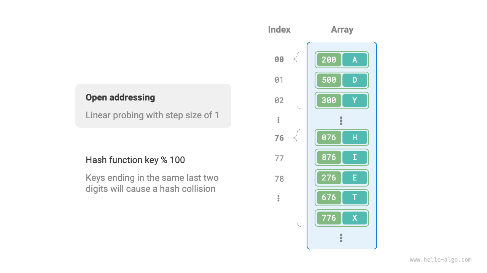

# 6.2 &nbsp; Va chạm băm (Hash collision)

Phần trước đã đề cập rằng, **trong hầu hết các trường hợp, không gian đầu vào của hàm băm lớn hơn rất nhiều so với không gian đầu ra**, nên về lý thuyết, va chạm băm là điều không thể tránh khỏi. Ví dụ, nếu không gian đầu vào là tất cả các số nguyên và không gian đầu ra là kích thước của mảng, thì nhiều số nguyên chắc chắn sẽ được ánh xạ vào cùng một vị trí trong mảng.

Va chạm băm có thể dẫn đến kết quả truy vấn sai, ảnh hưởng nghiêm trọng đến khả năng sử dụng của bảng băm. Để giải quyết vấn đề này, mỗi khi xảy ra va chạm băm, chúng ta thực hiện mở rộng bảng băm cho đến khi va chạm biến mất. Cách này khá đơn giản, dễ hiểu và hoạt động tốt. Tuy nhiên, nó lại kém hiệu quả vì việc mở rộng bảng đòi hỏi phải di chuyển nhiều dữ liệu và tính toán lại mã băm, rất tốn tài nguyên. Để cải thiện hiệu suất, ta có thể áp dụng các chiến lược sau:

1. Cải tiến cấu trúc bảng băm để **vẫn có thể xác định đúng phần tử cần tìm khi xảy ra va chạm băm**.
2. Chỉ mở rộng bảng khi thực sự cần thiết, tức là khi xuất hiện va chạm nghiêm trọng.

Có hai phương pháp chính để cải thiện cấu trúc bảng băm: "Tách chuỗi" và "Địa chỉ mở".

## 6.2.1 &nbsp; Tách chuỗi

Trong bảng băm gốc, mỗi vị trí chỉ lưu được một cặp khóa-giá trị. <u>Tách chuỗi</u> chuyển mỗi phần tử thành một danh sách liên kết, coi các cặp khóa-giá trị là các nút trong danh sách, lưu tất cả các cặp bị va chạm vào cùng một danh sách liên kết. Hình dưới minh họa bảng băm sử dụng tách chuỗi.

{ class="animation-figure" }

<p align="center"> Figure 6-5 &nbsp; Bảng băm tách chuỗi </p>

Các thao tác trên bảng băm tách chuỗi thay đổi như sau:

- **Truy vấn phần tử**: Nhập `key`, lấy vị trí trong mảng bằng hàm băm, sau đó truy cập nút đầu của danh sách liên kết. Duyệt danh sách và so sánh khóa để tìm cặp khóa-giá trị cần thiết.
- **Thêm phần tử**: Truy cập nút đầu của danh sách liên kết qua hàm băm, sau đó thêm nút (cặp khóa-giá trị) vào danh sách.
- **Xóa phần tử**: Truy cập nút đầu của danh sách liên kết dựa trên kết quả hàm băm, duyệt danh sách để tìm nút cần xóa và xóa nó.

Tách chuỗi có một số hạn chế:

- **Tăng sử dụng bộ nhớ**: Danh sách liên kết chứa các con trỏ nút, tốn nhiều bộ nhớ hơn mảng.
- **Giảm hiệu suất truy vấn**: Vì phải duyệt tuyến tính danh sách liên kết để tìm phần tử.

Đoạn mã dưới đây là ví dụ đơn giản về bảng băm tách chuỗi, lưu ý hai điểm sau:

- Sử dụng danh sách (mảng động) thay cho danh sách liên kết để đơn giản hóa. Trong cách này, bảng băm (mảng) gồm nhiều vị trí, mỗi vị trí là một danh sách.
- Có phương thức mở rộng bảng băm. Khi hệ số tải vượt quá $\frac{2}{3}$, bảng băm sẽ được mở rộng gấp đôi.

=== "Python"

    ```python title="hash_map_chaining.py"
    class HashMapChaining:
        """Chained address hash table"""

        def __init__(self):
            """Constructor"""
            self.size = 0  # Number of key-value pairs
            self.capacity = 4  # Hash table capacity
            self.load_thres = 2.0 / 3.0  # Load factor threshold for triggering expansion
            self.extend_ratio = 2  # Expansion multiplier
            self.buckets = [[] for _ in range(self.capacity)]  # Bucket array

        def hash_func(self, key: int) -> int:
            """Hash function"""
            return key % self.capacity

        def load_factor(self) -> float:
            """Load factor"""
            return self.size / self.capacity

        def get(self, key: int) -> str | None:
            """Query operation"""
            index = self.hash_func(key)
            bucket = self.buckets[index]
            # Traverse the bucket, if the key is found, return the corresponding val
            for pair in bucket:
                if pair.key == key:
                    return pair.val
            # If the key is not found, return None
            return None

        def put(self, key: int, val: str):
            """Add operation"""
            # When the load factor exceeds the threshold, perform expansion
            if self.load_factor() > self.load_thres:
                self.extend()
            index = self.hash_func(key)
            bucket = self.buckets[index]
            # Traverse the bucket, if the specified key is encountered, update the corresponding val and return
            for pair in bucket:
                if pair.key == key:
                    pair.val = val
                    return
            # If the key is not found, add the key-value pair to the end
            pair = Pair(key, val)
            bucket.append(pair)
            self.size += 1

        def remove(self, key: int):
            """Remove operation"""
            index = self.hash_func(key)
            bucket = self.buckets[index]
            # Traverse the bucket, remove the key-value pair from it
            for pair in bucket:
                if pair.key == key:
                    bucket.remove(pair)
                    self.size -= 1
                    break

        def extend(self):
            """Extend hash table"""
            # Temporarily store the original hash table
            buckets = self.buckets
            # Initialize the extended new hash table
            self.capacity *= self.extend_ratio
            self.buckets = [[] for _ in range(self.capacity)]
            self.size = 0
            # Move key-value pairs from the original hash table to the new hash table
            for bucket in buckets:
                for pair in bucket:
                    self.put(pair.key, pair.val)

        def print(self):
            """Print hash table"""
            for bucket in self.buckets:
                res = []
                for pair in bucket:
                    res.append(str(pair.key) + " -> " + pair.val)
                print(res)
    ```

=== "C++"

    ```cpp title="hash_map_chaining.cpp"
    /* Chained address hash table */
    class HashMapChaining {
      private:
        int size;                       // Number of key-value pairs
        int capacity;                   // Hash table capacity
        double loadThres;               // Load factor threshold for triggering expansion
        int extendRatio;                // Expansion multiplier
        vector<vector<Pair *>> buckets; // Bucket array

      public:
        /* Constructor */
        HashMapChaining() : size(0), capacity(4), loadThres(2.0 / 3.0), extendRatio(2) {
            buckets.resize(capacity);
        }

        /* Destructor */
        ~HashMapChaining() {
            for (auto &bucket : buckets) {
                for (Pair *pair : bucket) {
                    // Free memory
                    delete pair;
                }
            }
        }

        /* Hash function */
        int hashFunc(int key) {
            return key % capacity;
        }

        /* Load factor */
        double loadFactor() {
            return (double)size / (double)capacity;
        }

        /* Query operation */
        string get(int key) {
            int index = hashFunc(key);
            // Traverse the bucket, if the key is found, return the corresponding val
            for (Pair *pair : buckets[index]) {
                if (pair->key == key) {
                    return pair->val;
                }
            }
            // If key not found, return an empty string
            return "";
        }

        /* Add operation */
        void put(int key, string val) {
            // When the load factor exceeds the threshold, perform expansion
            if (loadFactor() > loadThres) {
                extend();
            }
            int index = hashFunc(key);
            // Traverse the bucket, if the specified key is encountered, update the corresponding val and return
            for (Pair *pair : buckets[index]) {
                if (pair->key == key) {
                    pair->val = val;
                    return;
                }
            }
            // If the key is not found, add the key-value pair to the end
            buckets[index].push_back(new Pair(key, val));
            size++;
        }

        /* Remove operation */
        void remove(int key) {
            int index = hashFunc(key);
            auto &bucket = buckets[index];
            // Traverse the bucket, remove the key-value pair from it
            for (int i = 0; i < bucket.size(); i++) {
                if (bucket[i]->key == key) {
                    Pair *tmp = bucket[i];
                    bucket.erase(bucket.begin() + i); // Remove key-value pair
                    delete tmp;                       // Free memory
                    size--;
                    return;
                }
            }
        }

        /* Extend hash table */
        void extend() {
            // Temporarily store the original hash table
            vector<vector<Pair *>> bucketsTmp = buckets;
            // Initialize the extended new hash table
            capacity *= extendRatio;
            buckets.clear();
            buckets.resize(capacity);
            size = 0;
            // Move key-value pairs from the original hash table to the new hash table
            for (auto &bucket : bucketsTmp) {
                for (Pair *pair : bucket) {
                    put(pair->key, pair->val);
                    // Free memory
                    delete pair;
                }
            }
        }

        /* Print hash table */
        void print() {
            for (auto &bucket : buckets) {
                cout << "[";
                for (Pair *pair : bucket) {
                    cout << pair->key << " -> " << pair->val << ", ";
                }
                cout << "]\n";
            }
        }
    };
    ```

=== "Java"

    ```java title="hash_map_chaining.java"
    /* Chained address hash table */
    class HashMapChaining {
        int size; // Number of key-value pairs
        int capacity; // Hash table capacity
        double loadThres; // Load factor threshold for triggering expansion
        int extendRatio; // Expansion multiplier
        List<List<Pair>> buckets; // Bucket array

        /* Constructor */
        public HashMapChaining() {
            size = 0;
            capacity = 4;
            loadThres = 2.0 / 3.0;
            extendRatio = 2;
            buckets = new ArrayList<>(capacity);
            for (int i = 0; i < capacity; i++) {
                buckets.add(new ArrayList<>());
            }
        }

        /* Hash function */
        int hashFunc(int key) {
            return key % capacity;
        }

        /* Load factor */
        double loadFactor() {
            return (double) size / capacity;
        }

        /* Query operation */
        String get(int key) {
            int index = hashFunc(key);
            List<Pair> bucket = buckets.get(index);
            // Traverse the bucket, if the key is found, return the corresponding val
            for (Pair pair : bucket) {
                if (pair.key == key) {
                    return pair.val;
                }
            }
            // If key is not found, return null
            return null;
        }

        /* Add operation */
        void put(int key, String val) {
            // When the load factor exceeds the threshold, perform expansion
            if (loadFactor() > loadThres) {
                extend();
            }
            int index = hashFunc(key);
            List<Pair> bucket = buckets.get(index);
            // Traverse the bucket, if the specified key is encountered, update the corresponding val and return
            for (Pair pair : bucket) {
                if (pair.key == key) {
                    pair.val = val;
                    return;
                }
            }
            // If the key is not found, add the key-value pair to the end
            Pair pair = new Pair(key, val);
            bucket.add(pair);
            size++;
        }

        /* Remove operation */
        void remove(int key) {
            int index = hashFunc(key);
            List<Pair> bucket = buckets.get(index);
            // Traverse the bucket, remove the key-value pair from it
            for (Pair pair : bucket) {
                if (pair.key == key) {
                    bucket.remove(pair);
                    size--;
                    break;
                }
            }
        }

        /* Extend hash table */
        void extend() {
            // Temporarily store the original hash table
            List<List<Pair>> bucketsTmp = buckets;
            // Initialize the extended new hash table
            capacity *= extendRatio;
            buckets = new ArrayList<>(capacity);
            for (int i = 0; i < capacity; i++) {
                buckets.add(new ArrayList<>());
            }
            size = 0;
            // Move key-value pairs from the original hash table to the new hash table
            for (List<Pair> bucket : bucketsTmp) {
                for (Pair pair : bucket) {
                    put(pair.key, pair.val);
                }
            }
        }

        /* Print hash table */
        void print() {
            for (List<Pair> bucket : buckets) {
                List<String> res = new ArrayList<>();
                for (Pair pair : bucket) {
                    res.add(pair.key + " -> " + pair.val);
                }
                System.out.println(res);
            }
        }
    }
    ```

=== "C#"

    ```csharp title="hash_map_chaining.cs"
    [class]{HashMapChaining}-[func]{}
    ```

=== "Go"

    ```go title="hash_map_chaining.go"
    [class]{hashMapChaining}-[func]{}
    ```

=== "Swift"

    ```swift title="hash_map_chaining.swift"
    [class]{HashMapChaining}-[func]{}
    ```

=== "JS"

    ```javascript title="hash_map_chaining.js"
    [class]{HashMapChaining}-[func]{}
    ```

=== "TS"

    ```typescript title="hash_map_chaining.ts"
    [class]{HashMapChaining}-[func]{}
    ```

=== "Dart"

    ```dart title="hash_map_chaining.dart"
    [class]{HashMapChaining}-[func]{}
    ```

=== "Rust"

    ```rust title="hash_map_chaining.rs"
    #[derive(Clone)]
    // Cấu trúc để lưu một cặp khóa-giá trị. Đây là viên gạch xây dựng nên bảng băm.
    struct Pair {
        key: i32,
        val: String,
    }

    // Bảng băm sử dụng phương pháp tách chuỗi (chaining).
    struct HashMapChaining {
        size: usize, // Số lượng cặp key-value hiện có
        capacity: usize, // Dung lượng của mảng buckets (số lượng "xô")
        load_thres: f32, // Ngưỡng hệ số tải để kích hoạt việc mở rộng bảng
        extend_ratio: usize, // Tỷ lệ mở rộng dung lượng
        buckets: Vec<Vec<Pair>>, // Mảng các "xô", mỗi "xô" là một vector chứa các cặp Pair
    }

    impl HashMapChaining {
        // Hàm khởi tạo: tạo một bảng băm rỗng.
        fn new() -> Self {
            Self {
                size: 0,
                capacity: 4, // Bắt đầu với 4 "xô"
                load_thres: 2.0 / 3.0, // Mở rộng khi bảng đầy 2/3
                extend_ratio: 2, // Gấp đôi dung lượng khi mở rộng
                buckets: vec![vec![]; 4], // Khởi tạo 4 "xô" rỗng
            }
        }

        // Hàm băm: chuyển đổi key thành chỉ số của mảng buckets.
        fn hash_func(&self, key: i32) -> usize {
            key as usize % self.capacity
        }

        // Tính toán hệ số tải của bảng băm.
        fn load_factor(&self) -> f32 {
            self.size as f32 / self.capacity as f32
        }

        // Thao tác xóa: xóa một cặp key-value dựa trên key.
        fn remove(&mut self, key: i32) -> Option<String> {
            let index = self.hash_func(key);

            // Duyệt qua "xô" để tìm và xóa cặp key-value.
            for (i, p) in self.buckets[index].iter_mut().enumerate() {
                if p.key == key {
                    let pair = self.buckets[index].remove(i);
                    self.size -= 1;
                    return Some(pair.val); // Trả về giá trị đã xóa
                }
            }

            // Nếu không tìm thấy key, trả về None.
            None
        }

        // Mở rộng bảng băm khi cần thiết.
        fn extend(&mut self) {
            // Tạm thời lưu lại các "xô" cũ.
            let buckets_tmp = std::mem::take(&mut self.buckets);

            // Khởi tạo bảng băm mới với dung lượng lớn hơn.
            self.capacity *= self.extend_ratio;
            self.buckets = vec![Vec::new(); self.capacity as usize];
            self.size = 0;

            // Di chuyển tất cả các cặp key-value từ bảng cũ sang bảng mới.
            // Vì capacity đã thay đổi, các cặp key-value sẽ được băm lại vào các "xô" mới.
            for bucket in buckets_tmp {
                for pair in bucket {
                    self.put(pair.key, pair.val);
                }
            }
        }

        // In nội dung của bảng băm để kiểm tra.
        fn print(&self) {
            for bucket in &self.buckets {
                let mut res = Vec::new();
                for pair in bucket {
                    res.push(format!("{} -> {}", pair.key, pair.val));
                }
                println!("{:?}", res);
            }
        }

        // Thao tác thêm/cập nhật: thêm một cặp key-value mới hoặc cập nhật giá trị nếu key đã tồn tại.
        fn put(&mut self, key: i32, val: String) {
            // Nếu hệ số tải vượt ngưỡng, tiến hành mở rộng bảng.
            if self.load_factor() > self.load_thres {
                self.extend();
            }

            let index = self.hash_func(key);

            // Duyệt "xô" để tìm key. Nếu tìm thấy, cập nhật giá trị và thoát.
            for pair in self.buckets[index].iter_mut() {
                if pair.key == key {
                    pair.val = val;
                    return;
                }
            }

            // Nếu không tìm thấy key, thêm cặp key-value mới vào cuối "xô".
            let pair = Pair { key, val };
            self.buckets[index].push(pair);
            self.size += 1;
        }

        // Thao tác truy vấn: lấy giá trị (value) tương ứng với key.
        fn get(&self, key: i32) -> Option<&str> {
            let index = self.hash_func(key);

            // Duyệt "xô" để tìm key và trả về giá trị tương ứng.
            for pair in self.buckets[index].iter() {
                if pair.key == key {
                    return Some(&pair.val);
                }
            }

            // Nếu không tìm thấy key, trả về None.
            None
        }
    }
    ```

=== "C"

    ```c title="hash_map_chaining.c"
    [class]{Node}-[func]{}

    [class]{HashMapChaining}-[func]{}
    ```

=== "Kotlin"

    ```kotlin title="hash_map_chaining.kt"
    [class]{HashMapChaining}-[func]{}
    ```

=== "Ruby"

    ```ruby title="hash_map_chaining.rb"
    [class]{HashMapChaining}-[func]{}
    ```

=== "Zig"

    ```zig title="hash_map_chaining.zig"
    [class]{HashMapChaining}-[func]{}
    ```

Lưu ý rằng khi danh sách liên kết quá dài, hiệu suất truy vấn $O(n)$ sẽ kém. **Khi đó, có thể chuyển danh sách sang "cây AVL" hoặc "cây Đỏ-Đen"** để tối ưu hóa độ phức tạp truy vấn xuống $O(\log n)$.

## 6.2.2 &nbsp; Địa chỉ mở

<u>Địa chỉ mở</u> không sử dụng thêm cấu trúc dữ liệu mà xử lý va chạm băm bằng "tìm kiếm nhiều lần". Các phương pháp tìm kiếm gồm tìm kiếm tuyến tính, tìm kiếm bậc hai và băm kép.

Ta sẽ lấy tìm kiếm tuyến tính làm ví dụ để giới thiệu cơ chế của bảng băm địa chỉ mở.

### 1. &nbsp; Tìm kiếm tuyến tính

Tìm kiếm tuyến tính sử dụng cách dò tìm theo bước cố định, khác với bảng băm thông thường.

- **Thêm phần tử**: Tính vị trí bằng hàm băm. Nếu vị trí đã có phần tử, duyệt tuyến tính từ vị trí bị va chạm (thường bước là $1$) cho đến khi gặp vị trí trống, rồi thêm phần tử vào đó.
- **Tìm kiếm phần tử**: Nếu gặp va chạm, dùng cùng bước để duyệt tuyến tính cho đến khi tìm thấy phần tử cần thiết và trả về `value`; nếu gặp vị trí trống, nghĩa là phần tử không có trong bảng băm, trả về `None`.

Hình dưới minh họa cách phân bố cặp khóa-giá trị trong bảng băm địa chỉ mở (tìm kiếm tuyến tính). Theo hàm băm này, các khóa có cùng hai chữ số cuối sẽ được ánh xạ vào cùng một vị trí. Nhờ tìm kiếm tuyến tính, chúng được lưu liên tiếp ở vị trí đó và các vị trí tiếp theo.

{ class="animation-figure" }

<p align="center"> Figure 6-6 &nbsp; Phân bố cặp khóa-giá trị trong bảng băm địa chỉ mở (tìm kiếm tuyến tính) </p>

Tuy nhiên, **tìm kiếm tuyến tính dễ gây ra "hiện tượng kết cụm"**. Cụ thể, càng nhiều vị trí liên tiếp bị chiếm thì khả năng va chạm ở các vị trí đó càng lớn, làm cho kết cụm ngày càng tăng, gây hiệu suất kém cho các thao tác thêm, xóa, truy vấn, cập nhật.

Lưu ý rằng **không thể xóa trực tiếp phần tử trong bảng băm địa chỉ mở**. Xóa phần tử sẽ tạo ra vị trí trống `None` trong mảng. Khi tìm kiếm, nếu gặp vị trí trống này, quá trình dò tìm sẽ dừng lại, khiến các phần tử phía sau không thể truy cập được. Chương trình có thể hiểu sai là các phần tử đó không tồn tại, như hình dưới.

{ class="animation-figure" }

<p align="center"> Figure 6-7 &nbsp; Vấn đề truy vấn do xóa trong địa chỉ mở </p>

Để giải quyết, ta dùng cơ chế <u>xóa tạm thời</u>: thay vì xóa trực tiếp, **dùng hằng số `TOMBSTONE` để đánh dấu vị trí**. Khi dò tìm, nếu gặp `TOMBSTONE` thì tiếp tục duyệt vì có thể còn phần tử phía sau.

Tuy nhiên, **xóa tạm thời có thể làm hiệu suất bảng băm giảm nhanh**. Mỗi lần xóa tạo ra một dấu xóa, càng nhiều `TOMBSTONE` thì thời gian tìm kiếm càng tăng vì phải bỏ qua nhiều vị trí.

Để khắc phục, có thể ghi lại vị trí đầu tiên gặp `TOMBSTONE` khi dò tìm và hoán đổi phần tử tìm thấy với vị trí đó. Nhờ vậy, mỗi lần truy vấn hoặc thêm, phần tử sẽ được đưa về gần vị trí lý tưởng hơn, giúp tối ưu hiệu suất truy vấn.

Đoạn mã dưới đây là bảng băm địa chỉ mở (tìm kiếm tuyến tính) với xóa tạm thời. Để tận dụng không gian, bảng băm được coi là "mảng vòng", khi vượt quá cuối mảng sẽ quay lại đầu và tiếp tục duyệt.

=== "Python"

    ```python title="hash_map_open_addressing.py"
    class HashMapOpenAddressing:
        """Open addressing hash table"""

        def __init__(self):
            """Constructor"""
            self.size = 0  # Number of key-value pairs
            self.capacity = 4  # Hash table capacity
            self.load_thres = 2.0 / 3.0  # Load factor threshold for triggering expansion
            self.extend_ratio = 2  # Expansion multiplier
            self.buckets: list[Pair | None] = [None] * self.capacity  # Bucket array
            self.TOMBSTONE = Pair(-1, "-1")  # Removal mark

        def hash_func(self, key: int) -> int:
            """Hash function"""
            return key % self.capacity

        def load_factor(self) -> float:
            """Load factor"""
            return self.size / self.capacity

        def find_bucket(self, key: int) -> int:
            """Search for the bucket index corresponding to key"""
            index = self.hash_func(key)
            first_tombstone = -1
            # Linear probing, break when encountering an empty bucket
            while self.buckets[index] is not None:
                # If the key is encountered, return the corresponding bucket index
                if self.buckets[index].key == key:
                    # If a removal mark was encountered earlier, move the key-value pair to that index
                    if first_tombstone != -1:
                        self.buckets[first_tombstone] = self.buckets[index]
                        self.buckets[index] = self.TOMBSTONE
                        return first_tombstone  # Return the moved bucket index
                    return index  # Return bucket index
                # Record the first encountered removal mark
                if first_tombstone == -1 and self.buckets[index] is self.TOMBSTONE:
                    first_tombstone = index
                # Calculate the bucket index, return to the head if exceeding the tail
                index = (index + 1) % self.capacity
            # If the key does not exist, return the index of the insertion point
            return index if first_tombstone == -1 else first_tombstone

        def get(self, key: int) -> str:
            """Query operation"""
            # Search for the bucket index corresponding to key
            index = self.find_bucket(key)
            # If the key-value pair is found, return the corresponding val
            if self.buckets[index] not in [None, self.TOMBSTONE]:
                return self.buckets[index].val
            # If the key-value pair does not exist, return None
            return None

        def put(self, key: int, val: str):
            """Add operation"""
            # When the load factor exceeds the threshold, perform expansion
            if self.load_factor() > self.load_thres:
                self.extend()
            # Search for the bucket index corresponding to key
            index = self.find_bucket(key)
            # If the key-value pair is found, overwrite val and return
            if self.buckets[index] not in [None, self.TOMBSTONE]:
                self.buckets[index].val = val
                return
            # If the key-value pair does not exist, add the key-value pair
            self.buckets[index] = Pair(key, val)
            self.size += 1

        def remove(self, key: int):
            """Remove operation"""
            # Search for the bucket index corresponding to key
            index = self.find_bucket(key)
            # If the key-value pair is found, cover it with a removal mark
            if self.buckets[index] not in [None, self.TOMBSTONE]:
                self.buckets[index] = self.TOMBSTONE
                self.size -= 1

        def extend(self):
            """Extend hash table"""
            # Temporarily store the original hash table
            buckets_tmp = self.buckets
            # Initialize the extended new hash table
            self.capacity *= self.extend_ratio
            self.buckets = [None] * self.capacity
            self.size = 0
            # Move key-value pairs from the original hash table to the new hash table
            for pair in buckets_tmp:
                if pair not in [None, self.TOMBSTONE]:
                    self.put(pair.key, pair.val)

        def print(self):
            """Print hash table"""
            for pair in self.buckets:
                if pair is None:
                    print("None")
                elif pair is self.TOMBSTONE:
                    print("TOMBSTONE")
                else:
                    print(pair.key, "->", pair.val)
    ```

=== "C++"

    ```cpp title="hash_map_open_addressing.cpp"
    /* Open addressing hash table */
    class HashMapOpenAddressing {
      private:
        int size;                             // Number of key-value pairs
        int capacity = 4;                     // Hash table capacity
        const double loadThres = 2.0 / 3.0;     // Load factor threshold for triggering expansion
        const int extendRatio = 2;            // Expansion multiplier
        vector<Pair *> buckets;               // Bucket array
        Pair *TOMBSTONE = new Pair(-1, "-1"); // Removal mark

      public:
        /* Constructor */
        HashMapOpenAddressing() : size(0), buckets(capacity, nullptr) {
        }

        /* Destructor */
        ~HashMapOpenAddressing() {
            for (Pair *pair : buckets) {
                if (pair != nullptr && pair != TOMBSTONE) {
                    delete pair;
                }
            }
            delete TOMBSTONE;
        }

        /* Hash function */
        int hashFunc(int key) {
            return key % capacity;
        }

        /* Load factor */
        double loadFactor() {
            return (double)size / capacity;
        }

        /* Search for the bucket index corresponding to key */
        int findBucket(int key) {
            int index = hashFunc(key);
            int firstTombstone = -1;
            // Linear probing, break when encountering an empty bucket
            while (buckets[index] != nullptr) {
                // If the key is encountered, return the corresponding bucket index
                if (buckets[index]->key == key) {
                    // If a removal mark was encountered earlier, move the key-value pair to that index
                    if (firstTombstone != -1) {
                        buckets[firstTombstone] = buckets[index];
                        buckets[index] = TOMBSTONE;
                        return firstTombstone; // Return the moved bucket index
                    }
                    return index; // Return bucket index
                }
                // Record the first encountered removal mark
                if (firstTombstone == -1 && buckets[index] == TOMBSTONE) {
                    firstTombstone = index;
                }
                // Calculate the bucket index, return to the head if exceeding the tail
                index = (index + 1) % capacity;
            }
            // If the key does not exist, return the index of the insertion point
            return firstTombstone == -1 ? index : firstTombstone;
        }

        /* Query operation */
        string get(int key) {
            // Search for the bucket index corresponding to key
            int index = findBucket(key);
            // If the key-value pair is found, return the corresponding val
            if (buckets[index] != nullptr && buckets[index] != TOMBSTONE) {
                return buckets[index]->val;
            }
            // If key-value pair does not exist, return an empty string
            return "";
        }

        /* Add operation */
        void put(int key, string val) {
            // When the load factor exceeds the threshold, perform expansion
            if (loadFactor() > loadThres) {
                extend();
            }
            // Search for the bucket index corresponding to key
            int index = findBucket(key);
            // If the key-value pair is found, overwrite val and return
            if (buckets[index] != nullptr && buckets[index] != TOMBSTONE) {
                buckets[index]->val = val;
                return;
            }
            // If the key-value pair does not exist, add the key-value pair
            buckets[index] = new Pair(key, val);
            size++;
        }

        /* Remove operation */
        void remove(int key) {
            // Search for the bucket index corresponding to key
            int index = findBucket(key);
            // If the key-value pair is found, cover it with a removal mark
            if (buckets[index] != nullptr && buckets[index] != TOMBSTONE) {
                delete buckets[index];
                buckets[index] = TOMBSTONE;
                size--;
            }
        }

        /* Extend hash table */
        void extend() {
            // Temporarily store the original hash table
            vector<Pair *> bucketsTmp = buckets;
            // Initialize the extended new hash table
            capacity *= extendRatio;
            buckets = vector<Pair *>(capacity, nullptr);
            size = 0;
            // Move key-value pairs from the original hash table to the new hash table
            for (Pair *pair : bucketsTmp) {
                if (pair != nullptr && pair != TOMBSTONE) {
                    put(pair->key, pair->val);
                    delete pair;
                }
            }
        }

        /* Print hash table */
        void print() {
            for (Pair *pair : buckets) {
                if (pair == nullptr) {
                    cout << "nullptr" << endl;
                } else if (pair == TOMBSTONE) {
                    cout << "TOMBSTONE" << endl;
                } else {
                    cout << pair->key << " -> " << pair->val << endl;
                }
            }
        }
    };
    ```

=== "Java"

    ```java title="hash_map_open_addressing.java"
    /* Open addressing hash table */
    class HashMapOpenAddressing {
        private int size; // Number of key-value pairs
        private int capacity = 4; // Hash table capacity
        private final double loadThres = 2.0 / 3.0; // Load factor threshold for triggering expansion
        private final int extendRatio = 2; // Expansion multiplier
        private Pair[] buckets; // Bucket array
        private final Pair TOMBSTONE = new Pair(-1, "-1"); // Removal mark

        /* Constructor */
        public HashMapOpenAddressing() {
            size = 0;
            buckets = new Pair[capacity];
        }

        /* Hash function */
        private int hashFunc(int key) {
            return key % capacity;
        }

        /* Load factor */
        private double loadFactor() {
            return (double) size / capacity;
        }

        /* Search for the bucket index corresponding to key */
        private int findBucket(int key) {
            int index = hashFunc(key);
            int firstTombstone = -1;
            // Linear probing, break when encountering an empty bucket
            while (buckets[index] != null) {
                // If the key is encountered, return the corresponding bucket index
                if (buckets[index].key == key) {
                    // If a removal mark was encountered earlier, move the key-value pair to that index
                    if (firstTombstone != -1) {
                        buckets[firstTombstone] = buckets[index];
                        buckets[index] = TOMBSTONE;
                        return firstTombstone; // Return the moved bucket index
                    }
                    return index; // Return bucket index
                }
                // Record the first encountered removal mark
                if (firstTombstone == -1 && buckets[index] == TOMBSTONE) {
                    firstTombstone = index;
                }
                // Calculate the bucket index, return to the head if exceeding the tail
                index = (index + 1) % capacity;
            }
            // If the key does not exist, return the index of the insertion point
            return firstTombstone == -1 ? index : firstTombstone;
        }

        /* Query operation */
        public String get(int key) {
            // Search for the bucket index corresponding to key
            int index = findBucket(key);
            // If the key-value pair is found, return the corresponding val
            if (buckets[index] != null && buckets[index] != TOMBSTONE) {
                return buckets[index].val;
            }
            // If the key-value pair does not exist, return null
            return null;
        }

        /* Add operation */
        public void put(int key, String val) {
            // When the load factor exceeds the threshold, perform expansion
            if (loadFactor() > loadThres) {
                extend();
            }
            // Search for the bucket index corresponding to key
            int index = findBucket(key);
            // If the key-value pair is found, overwrite val and return
            if (buckets[index] != null && buckets[index] != TOMBSTONE) {
                buckets[index].val = val;
                return;
            }
            // If the key-value pair does not exist, add the key-value pair
            buckets[index] = new Pair(key, val);
            size++;
        }

        /* Remove operation */
        public void remove(int key) {
            // Search for the bucket index corresponding to key
            int index = findBucket(key);
            // If the key-value pair is found, cover it with a removal mark
            if (buckets[index] != null && buckets[index] != TOMBSTONE) {
                buckets[index] = TOMBSTONE;
                size--;
            }
        }

        /* Extend hash table */
        private void extend() {
            // Temporarily store the original hash table
            Pair[] bucketsTmp = buckets;
            // Initialize the extended new hash table
            capacity *= extendRatio;
            buckets = new Pair[capacity];
            size = 0;
            // Move key-value pairs from the original hash table to the new hash table
            for (Pair pair : bucketsTmp) {
                if (pair != null && pair != TOMBSTONE) {
                    put(pair.key, pair.val);
                }
            }
        }

        /* Print hash table */
        public void print() {
            for (Pair pair : buckets) {
                if (pair == null) {
                    System.out.println("null");
                } else if (pair == TOMBSTONE) {
                    System.out.println("TOMBSTONE");
                } else {
                    System.out.println(pair.key + " -> " + pair.val);
                }
            }
        }
    }
    ```

=== "C#"

    ```csharp title="hash_map_open_addressing.cs"
    [class]{HashMapOpenAddressing}-[func]{}
    ```

=== "Go"

    ```go title="hash_map_open_addressing.go"
    [class]{hashMapOpenAddressing}-[func]{}
    ```

=== "Swift"

    ```swift title="hash_map_open_addressing.swift"
    [class]{HashMapOpenAddressing}-[func]{}
    ```

=== "JS"

    ```javascript title="hash_map_open_addressing.js"
    [class]{HashMapOpenAddressing}-[func]{}
    ```

=== "TS"

    ```typescript title="hash_map_open_addressing.ts"
    [class]{HashMapOpenAddressing}-[func]{}
    ```

=== "Dart"

    ```dart title="hash_map_open_addressing.dart"
    [class]{HashMapOpenAddressing}-[func]{}
    ```

=== "Rust"

    ```rust title="hash_map_open_addressing.rs"
    // Bảng băm sử dụng phương pháp địa chỉ mở (Open Addressing).
    struct HashMapOpenAddressing {
        size: usize,                // Số lượng cặp key-value hiện có
        capacity: usize,            // Dung lượng của bảng băm (số lượng bucket)
        load_thres: f64,            // Ngưỡng hệ số tải để kích hoạt việc mở rộng bảng
        extend_ratio: usize,        // Tỷ lệ mở rộng dung lượng
        buckets: Vec<Option<Pair>>, // Mảng các "bucket" (ngăn chứa)
        TOMBSTONE: Option<Pair>,    // Dấu "bia mộ" (TOMBSTONE) để đánh dấu một bucket đã bị xóa
    }

    impl HashMapOpenAddressing {
        // Hàm khởi tạo.
        fn new() -> Self {
            Self {
                size: 0,
                capacity: 4,
                load_thres: 2.0 / 3.0,
                extend_ratio: 2,
                buckets: vec![None; 4],
                // TOMBSTONE là một giá trị đặc biệt, không thể là một cặp key-value hợp lệ
                TOMBSTONE: Some(Pair {
                    key: -1,
                    val: "-1".to_string(),
                }),
            }
        }

        // Hàm băm.
        fn hash_func(&self, key: i32) -> usize {
            (key % self.capacity as i32) as usize
        }

        // Tính toán hệ số tải.
        fn load_factor(&self) -> f64 {
            self.size as f64 / self.capacity as f64
        }

        // Tìm kiếm bucket tương ứng với key.
        fn find_bucket(&mut self, key: i32) -> usize {
            let mut index = self.hash_func(key);
            let mut first_tombstone = -1;
            // Dò tìm tuyến tính, dừng lại khi gặp bucket trống (None).
            while self.buckets[index].is_some() {
                // Nếu tìm thấy key, trả về chỉ số của bucket.
                if self.buckets[index].as_ref().unwrap().key == key {
                    // Nếu trước đó đã gặp TOMBSTONE, di chuyển cặp key-value đến vị trí đó để tối ưu.
                    if first_tombstone != -1 {
                        self.buckets[first_tombstone as usize] = self.buckets[index].take();
                        self.buckets[index] = self.TOMBSTONE.clone();
                        return first_tombstone as usize; // Trả về chỉ số của bucket sau khi di chuyển
                    }
                    return index; // Trả về chỉ số của bucket
                }
                // Ghi lại chỉ số của TOMBSTONE đầu tiên gặp phải.
                if first_tombstone == -1 && self.buckets[index] == self.TOMBSTONE {
                    first_tombstone = index as i32;
                }
                // Di chuyển đến bucket tiếp theo, nếu đến cuối thì quay về đầu (mảng vòng).
                index = (index + 1) % self.capacity;
            }
            // Nếu không tìm thấy key, trả về chỉ số của bucket trống hoặc TOMBSTONE đầu tiên.
            if first_tombstone == -1 {
                index
            } else {
                first_tombstone as usize
            }
        }

        // Thao tác truy vấn.
        fn get(&mut self, key: i32) -> Option<&str> {
            // Tìm bucket tương ứng với key.
            let index = self.find_bucket(key);
            // Nếu tìm thấy cặp key-value, trả về value.
            if self.buckets[index].is_some() && self.buckets[index] != self.TOMBSTONE {
                return self.buckets[index].as_ref().map(|pair| &pair.val as &str);
            }
            // Nếu không tìm thấy, trả về None.
            None
        }

        // Thao tác thêm/cập nhật.
        fn put(&mut self, key: i32, val: String) {
            // Nếu hệ số tải vượt ngưỡng, tiến hành mở rộng bảng.
            if self.load_factor() > self.load_thres {
                self.extend();
            }
            // Tìm bucket tương ứng với key.
            let index = self.find_bucket(key);
            // Nếu tìm thấy, cập nhật giá trị và thoát.
            if self.buckets[index].is_some() && self.buckets[index] != self.TOMBSTONE {
                self.buckets[index].as_mut().unwrap().val = val;
                return;
            }
            // Nếu không tìm thấy, thêm cặp key-value mới.
            self.buckets[index] = Some(Pair { key, val });
            self.size += 1;
        }

        // Thao tác xóa.
        fn remove(&mut self, key: i32) {
            // Tìm bucket tương ứng với key.
            let index = self.find_bucket(key);
            // Nếu tìm thấy, đánh dấu bucket bằng TOMBSTONE.
            if self.buckets[index].is_some() && self.buckets[index] != self.TOMBSTONE {
                self.buckets[index] = self.TOMBSTONE.clone();
                self.size -= 1;
            }
        }

        // Mở rộng bảng băm.
        fn extend(&mut self) {
            // Tạm thời lưu lại các bucket cũ.
            let buckets_tmp = self.buckets.clone();
            // Khởi tạo bảng băm mới với dung lượng lớn hơn.
            self.capacity *= self.extend_ratio;
            self.buckets = vec![None; self.capacity];
            self.size = 0;

            // Di chuyển các cặp key-value từ bảng cũ sang bảng mới (bỏ qua None và TOMBSTONE).
            for pair in buckets_tmp {
                if pair.is_none() || pair == self.TOMBSTONE {
                    continue;
                }
                let pair = pair.unwrap();

                self.put(pair.key, pair.val);
            }
        }

        // In nội dung của bảng băm để kiểm tra.
        fn print(&self) {
            for pair in &self.buckets {
                if pair.is_none() {
                    println!("null");
                } else if pair == &self.TOMBSTONE {
                    println!("TOMBSTONE");
                } else {
                    let pair = pair.as_ref().unwrap();
                    println!("{} -> {}", pair.key, pair.val);
                }
            }
        }
    }
    ```

=== "C"

    ```c title="hash_map_open_addressing.c"
    [class]{HashMapOpenAddressing}-[func]{}
    ```

=== "Kotlin"

    ```kotlin title="hash_map_open_addressing.kt"
    [class]{HashMapOpenAddressing}-[func]{}
    ```

=== "Ruby"

    ```ruby title="hash_map_open_addressing.rb"
    [class]{HashMapOpenAddressing}-[func]{}
    ```

=== "Zig"

    ```zig title="hash_map_open_addressing.zig"
    [class]{HashMapOpenAddressing}-[func]{}
    ```

### 2. &nbsp; Tìm kiếm bậc hai

Tìm kiếm bậc hai giống với tìm kiếm tuyến tính và là một trong các chiến lược địa chỉ mở phổ biến. Khi va chạm, tìm kiếm bậc hai không chỉ nhảy một số bước cố định mà nhảy số bước bằng "bình phương số lần dò", tức là $1, 4, 9, \dots$ bước.

Ưu điểm của tìm kiếm bậc hai:

- Giảm hiện tượng kết cụm của tìm kiếm tuyến tính bằng cách nhảy xa hơn.
- Nhảy xa hơn giúp phân bố dữ liệu đều hơn.

Nhược điểm:

- Kết cụm vẫn tồn tại, một số vị trí vẫn dễ bị chiếm hơn.
- Do bước nhảy tăng nhanh, tìm kiếm bậc hai có thể không duyệt hết bảng băm, tức là dù còn vị trí trống nhưng không thể truy cập tới.

### 3. &nbsp; Băm kép

Đúng như tên gọi, phương pháp băm kép dùng nhiều hàm băm $f_1(x)$, $f_2(x)$, $f_3(x)$, $\dots$ để dò tìm.

- **Thêm phần tử**: Nếu hàm băm $f_1(x)$ bị va chạm, thử $f_2(x)$, rồi tiếp tục cho đến khi tìm được vị trí trống để thêm phần tử.
- **Tìm kiếm phần tử**: Tìm theo thứ tự các hàm băm cho đến khi tìm thấy phần tử cần thiết; nếu gặp vị trí trống hoặc thử hết các hàm băm mà không thấy, trả về `None`.

So với tìm kiếm tuyến tính, băm kép ít bị kết cụm hơn, nhưng dùng nhiều hàm băm sẽ tốn thêm thời gian tính toán.

!!! tip

    Lưu ý: bảng băm địa chỉ mở (tìm kiếm tuyến tính, bậc hai, băm kép) đều gặp vấn đề "không thể xóa trực tiếp phần tử".

## 6.2.3 &nbsp; Lựa chọn ngôn ngữ lập trình

Các ngôn ngữ lập trình khác nhau sử dụng chiến lược bảng băm khác nhau. Ví dụ:

- Python dùng địa chỉ mở. Từ điển `dict` sử dụng số giả ngẫu nhiên để dò tìm.
- Java dùng tách chuỗi. Từ JDK 1.8, khi độ dài mảng trong `HashMap` đạt 64 và danh sách liên kết dài 8, danh sách sẽ chuyển thành cây đỏ-đen để tăng hiệu suất tìm kiếm.
- Go dùng tách chuỗi. Go quy định mỗi vị trí lưu tối đa 8 cặp khóa-giá trị, nếu vượt quá sẽ liên kết thêm vị trí phụ; khi có quá nhiều vị trí phụ, sẽ thực hiện mở rộng đặc biệt để đảm bảo hiệu suất.
