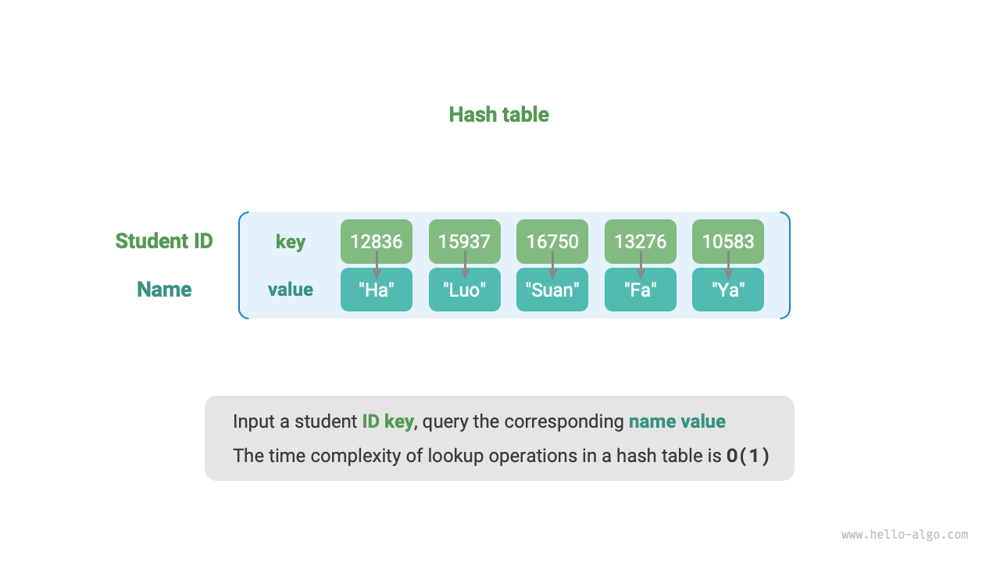
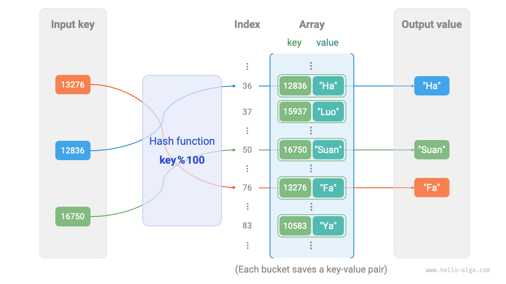
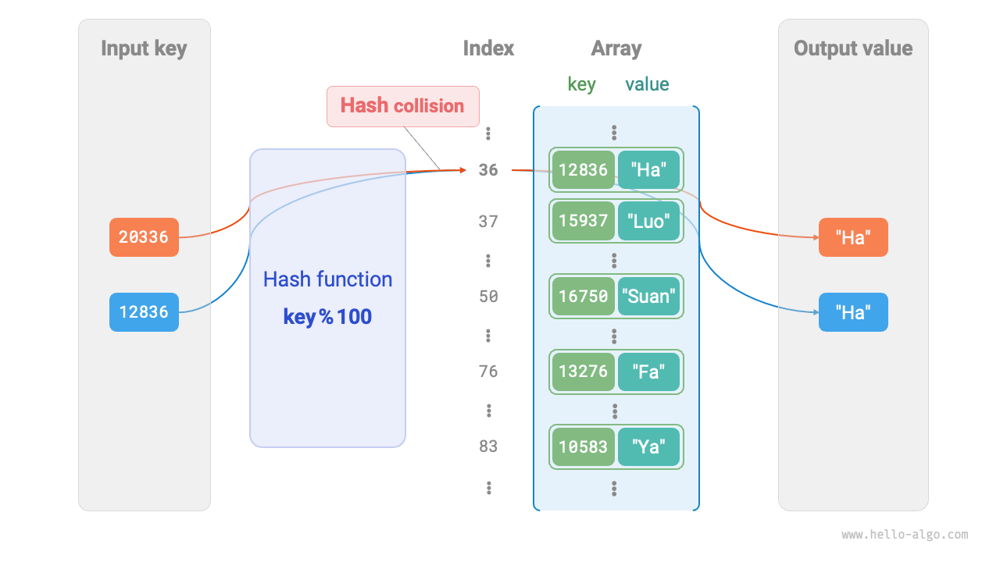
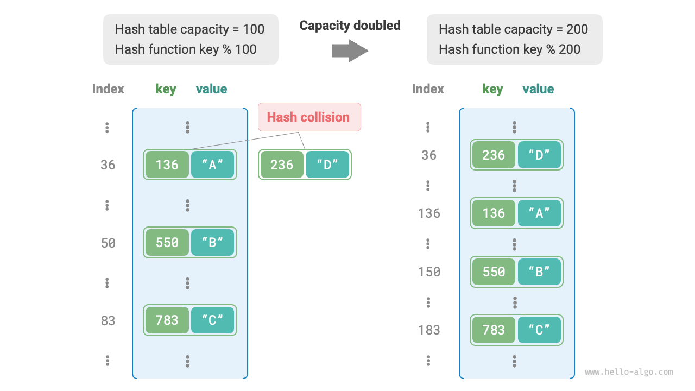

# Bảng băm (Hash table)

Một <u>bảng băm</u>, còn được gọi là <u>bảng ánh xạ băm</u> (hash map), là một cấu trúc dữ liệu thiết lập mối quan hệ ánh xạ giữa các khóa (key) và giá trị (value), cho phép truy xuất phần tử hiệu quả. Cụ thể, khi chúng ta nhập một `key` vào bảng băm, chúng ta có thể truy xuất `value` tương ứng trong thời gian phức tạp $O(1)$.

Như hình dưới đây, cho $n$ học sinh, mỗi học sinh có hai trường dữ liệu: "Tên" và "Mã số học sinh". Nếu chúng ta muốn triển khai một hàm truy vấn nhận mã số học sinh làm đầu vào và trả về tên tương ứng, chúng ta có thể sử dụng bảng băm như trong hình dưới đây.



Ngoài bảng băm, mảng và danh sách liên kết cũng có thể được sử dụng để triển khai chức năng truy vấn, nhưng độ phức tạp thời gian là khác nhau. Hiệu quả của chúng được so sánh trong bảng dưới đây:

- **Chèn một phần tử**: Chỉ cần thêm phần tử vào cuối mảng (hoặc danh sách liên kết). Độ phức tạp thời gian của thao tác này là $O(1)$.
- **Tìm kiếm một phần tử**: Vì mảng (hoặc danh sách liên kết) không được sắp xếp, việc tìm kiếm một phần tử yêu cầu duyệt qua tất cả các phần tử. Độ phức tạp thời gian của thao tác này là $O(n)$.
- **Xóa một phần tử**: Để xóa một phần tử, trước tiên chúng ta cần định vị nó. Sau đó, chúng ta xóa nó khỏi mảng (hoặc danh sách liên kết). Độ phức tạp thời gian của thao tác này là $O(n)$.

<p align="center"> Bảng <id> &nbsp; So sánh hiệu quả thời gian cho các thao tác phổ biến </p>

|                | Mảng   | Danh sách liên kết | Bảng băm |
| -------------- | ------ | ----------- | ---------- |
| Tìm kiếm phần tử  | $O(n)$ | $O(n)$      | $O(1)$     |
| Chèn phần tử   | $O(1)$ | $O(1)$      | $O(1)$     |
| Xóa phần tử  | $O(n)$ | $O(n)$      | $O(1)$     |

Như đã quan sát, **độ phức tạp thời gian cho các thao tác (chèn, xóa, tìm kiếm và sửa đổi) trong bảng băm là $O(1)$**, rất hiệu quả.

## Các thao tác phổ biến của bảng băm

Các thao tác phổ biến của bảng băm bao gồm: khởi tạo, truy vấn, thêm cặp key-value và xóa cặp key-value. Dưới đây là một ví dụ code:

=== "Python"

    ```python title="hash_map.py"
    # Khởi tạo bảng băm
    hmap: dict = {}

    # Thao tác thêm
    # Thêm cặp key-value (key, value) vào bảng băm
    hmap[12836] = "Xiao Ha"
    hmap[15937] = "Xiao Luo"
    hmap[16750] = "Xiao Suan"
    hmap[13276] = "Xiao Fa"
    hmap[10583] = "Xiao Ya"

    # Thao tác truy vấn
    # Nhập key vào bảng băm, lấy value
    name: str = hmap[15937]

    # Thao tác xóa
    # Xóa cặp key-value (key, value) khỏi bảng băm
    hmap.pop(10583)
    ```

=== "C++"

    ```cpp title="hash_map.cpp"
    /* Khởi tạo bảng băm */
    unordered_map<int, string> map;

    /* Thao tác thêm */
    // Thêm cặp key-value (key, value) vào bảng băm
    map[12836] = "Xiao Ha";
    map[15937] = "Xiao Luo";
    map[16750] = "Xiao Suan";
    map[13276] = "Xiao Fa";
    map[10583] = "Xiao Ya";

    /* Thao tác truy vấn */
    // Nhập key vào bảng băm, lấy value
    string name = map[15937];

    /* Thao tác xóa */
    // Xóa cặp key-value (key, value) khỏi bảng băm
    map.erase(10583);
    ```

=== "Java"

    ```java title="hash_map.java"
    /* Khởi tạo bảng băm */
    Map<Integer, String> map = new HashMap<>();

    /* Thao tác thêm */
    // Thêm cặp key-value (key, value) vào bảng băm
    map.put(12836, "Xiao Ha");   
    map.put(15937, "Xiao Luo");   
    map.put(16750, "Xiao Suan");   
    map.put(13276, "Xiao Fa");
    map.put(10583, "Xiao Ya");

    /* Thao tác truy vấn */
    // Nhập key vào bảng băm, lấy value
    String name = map.get(15937);

    /* Thao tác xóa */
    // Xóa cặp key-value (key, value) khỏi bảng băm
    map.remove(10583);
    ```

=== "C#"

    ```csharp title="hash_map.cs"
    /* Khởi tạo bảng băm */
    Dictionary<int, string> map = new() {
        /* Thao tác thêm */
        // Thêm cặp key-value (key, value) vào bảng băm
        { 12836, "Xiao Ha" },
        { 15937, "Xiao Luo" },
        { 16750, "Xiao Suan" },
        { 13276, "Xiao Fa" },
        { 10583, "Xiao Ya" }
    };

    /* Thao tác truy vấn */
    // Nhập key vào bảng băm, lấy value
    string name = map[15937];

    /* Thao tác xóa */
    // Xóa cặp key-value (key, value) khỏi bảng băm
    map.Remove(10583);
    ```

=== "Go"

    ```go title="hash_map_test.go"
    /* Khởi tạo bảng băm */
    hmap := make(map[int]string)

    /* Thao tác thêm */
    // Thêm cặp key-value (key, value) vào bảng băm
    hmap[12836] = "Xiao Ha"
    hmap[15937] = "Xiao Luo"
    hmap[16750] = "Xiao Suan"
    hmap[13276] = "Xiao Fa"
    hmap[10583] = "Xiao Ya"

    /* Thao tác truy vấn */
    // Nhập key vào bảng băm, lấy value
    name := hmap[15937]

    /* Thao tác xóa */
    // Xóa cặp key-value (key, value) khỏi bảng băm
    delete(hmap, 10583)
    ```

=== "Swift"

    ```swift title="hash_map.swift"
    /* Khởi tạo bảng băm */
    var map: [Int: String] = [:]

    /* Thao tác thêm */
    // Thêm cặp key-value (key, value) vào bảng băm
    map[12836] = "Xiao Ha"
    map[15937] = "Xiao Luo"
    map[16750] = "Xiao Suan"
    map[13276] = "Xiao Fa"
    map[10583] = "Xiao Ya"

    /* Thao tác truy vấn */
    // Nhập key vào bảng băm, lấy value
    let name = map[15937]!

    /* Thao tác xóa */
    // Xóa cặp key-value (key, value) khỏi bảng băm
    map.removeValue(forKey: 10583)
    ```

=== "JS"

    ```javascript title="hash_map.js"
    /* Khởi tạo bảng băm */
    const map = new Map();
    /* Thao tác thêm */
    // Thêm cặp key-value (key, value) vào bảng băm
    map.set(12836, 'Xiao Ha');
    map.set(15937, 'Xiao Luo');
    map.set(16750, 'Xiao Suan');
    map.set(13276, 'Xiao Fa');
    map.set(10583, 'Xiao Ya');

    /* Thao tác truy vấn */
    // Nhập key vào bảng băm, lấy value
    let name = map.get(15937);

    /* Thao tác xóa */
    // Xóa cặp key-value (key, value) khỏi bảng băm
    map.delete(10583);
    ```

=== "TS"

    ```typescript title="hash_map.ts"
    /* Khởi tạo bảng băm */
    const map = new Map<number, string>();
    /* Thao tác thêm */
    // Thêm cặp key-value (key, value) vào bảng băm
    map.set(12836, 'Xiao Ha');
    map.set(15937, 'Xiao Luo');
    map.set(16750, 'Xiao Suan');
    map.set(13276, 'Xiao Fa');
    map.set(10583, 'Xiao Ya');
    console.info('\nSau khi thêm, bảng băm là\nKey -> Value');
    console.info(map);

    /* Thao tác truy vấn */
    // Nhập key vào bảng băm, lấy value
    let name = map.get(15937);
    console.info('\nNhập số học sinh 15937, truy vấn tên ' + name);

    /* Thao tác xóa */
    // Xóa cặp key-value (key, value) khỏi bảng băm
    map.delete(10583);
    console.info('\nSau khi xóa 10583, bảng băm là\nKey -> Value');
    console.info(map);
    ```

=== "Dart"

    ```dart title="hash_map.dart"
    /* Khởi tạo bảng băm */
    Map<int, String> map = {};

    /* Thao tác thêm */
    // Thêm cặp key-value (key, value) vào bảng băm
    map[12836] = "Xiao Ha";
    map[15937] = "Xiao Luo";
    map[16750] = "Xiao Suan";
    map[13276] = "Xiao Fa";
    map[10583] = "Xiao Ya";

    /* Thao tác truy vấn */
    // Nhập key vào bảng băm, lấy value
    String name = map[15937];

    /* Thao tác xóa */
    // Xóa cặp key-value (key, value) khỏi bảng băm
    map.remove(10583);
    ```

=== "Rust"

    ```rust title="hash_map.rs"
    use std::collections::HashMap;

    /* Khởi tạo bảng băm */
    let mut map: HashMap<i32, String> = HashMap::new();

    /* Thao tác thêm */
    // Thêm cặp key-value (key, value) vào bảng băm
    map.insert(12836, "Xiao Ha".to_string());
    map.insert(15937, "Xiao Luo".to_string());
    map.insert(16750, "Xiao Suan".to_string());
    map.insert(13279, "Xiao Fa".to_string());
    map.insert(10583, "Xiao Ya".to_string());

    /* Thao tác truy vấn */
    // Nhập key vào bảng băm, lấy value
    let _name: Option<&String> = map.get(&15937);

    /* Thao tác xóa */
    // Xóa cặp key-value (key, value) khỏi bảng băm
    let _removed_value: Option<String> = map.remove(&10583);
    ```

=== "C"

    ```c title="hash_map.c"
    // C không cung cấp bảng băm tích hợp sẵn
    ```

=== "Kotlin"

    ```kotlin title="hash_map.kt"

    ```

=== "Zig"

    ```zig title="hash_map.zig"

    ```

??? pythontutor "Code Visualization"

    https://pythontutor.com/render.html#code=%22%22%22Driver%20Code%22%22%22%0Aif%20__name__%20%3D%3D%20%22__main__%22%3A%0A%20%20%20%20%23%20%E5%88%9D%E5%A7%8B%E5%8C%96%E5%93%88%E5%B8%8C%E8%A1%A8%0A%20%20%20%20hmap%20%3D%20%7B%7D%0A%20%20%20%20%0A%20%20%20%20%23%20%E6%B7%BB%E5%8A%A0%E6%93%8D%E4%BD%9C%0A%20%20%20%20%23%20%E5%9C%A8%E5%93%88%E5%B8%8C%E8%A1%A8%E4%B8%AD%E6%B7%BB%E5%8A%A0%E9%94%AE%E5%80%BC%E5%AF%B9%20%28key,%20value%29%0A%20%20%20%20hmap%5B12836%5D%20%3D%20%22%E5%B0%8F%E5%93%88%22%0A%20%20%20%20hmap%5B15937%5D%20%3D%20%22%E5%B0%8F%E5%95%B0%22%0A%20%20%20%20hmap%5B16750%5D%20%3D%20%22%E5%B0%8F%E7%AE%97%22%0A%20%20%20%20hmap%5B13276%5D%20%3D%20%22%E5%B0%8F%E6%B3%95%22%0A%20%20%20%20hmap%5B10583%5D%20%3D%20%22%E5%B0%8F%E9%B8%AD%22%0A%20%20%20%20%0A%20%20%20%20%23%20%E6%9F%A5%E8%AF%A2%E6%93%8D%E4%BD%9C%0A%20%20%20%20%23%20%E5%90%91%E5%93%88%E5%B8%8C%E8%A1%A8%E4%B8%AD%E8%BE%93%E5%85%A5%E9%94%AE%20key%20%EF%BC%8C%E5%BE%97%E5%88%B0%E5%80%BC%20value%0A%20%20%20%20name%20%3D%20hmap%5B15937%5D%0A%20%20%20%20%0A%20%20%20%20%23%20%E5%88%A0%E9%99%A4%E6%93%8D%E4%BD%9C%0A%20%20%20%20%23%20%E5%9C%A8%E5%93%88%E5%B8%8C%E8%A1%A8%E4%B8%AD%E5%88%A0%E9%99%A4%E9%94%AE%E5%80%BC%E5%AF%B9%20%28key,%20value%29%0A%20%20%20%20hmap.pop%2810583%29&cumulative=false&curInstr=2&heapPrimitives=nevernest&mode=display&origin=opt-frontend.js&py=311&rawInputLstJSON=%5B%5D&textReferences=false

Có ba cách phổ biến để duyệt một bảng băm: duyệt các cặp key-value, duyệt các key và duyệt các value. Dưới đây là một ví dụ code:

=== "Python"

    ```python title="hash_map.py"
    # Duyệt bảng băm
    # Duyệt các cặp key-value key->value
    for key, value in hmap.items():
        print(key, "->", value)
    # Chỉ duyệt các key
    for key in hmap.keys():
        print(key)
    # Chỉ duyệt các value
    for value in hmap.values():
        print(value)
    ```

=== "C++"

    ```cpp title="hash_map.cpp"
    /* Duyệt bảng băm */
    // Duyệt các cặp key-value key->value
    for (auto kv: map) {
        cout << kv.first << " -> " << kv.second << endl;
    }
    // Duyệt bằng iterator key->value
    for (auto iter = map.begin(); iter != map.end(); iter++) {
        cout << iter->first << "->" << iter->second << endl;
    }
    ```

=== "Java"

    ```java title="hash_map.java"
    /* Duyệt bảng băm */
    // Duyệt các cặp key-value key->value
    for (Map.Entry<Integer, String> kv: map.entrySet()) {
        System.out.println(kv.getKey() + " -> " + kv.getValue());
    }
    // Chỉ duyệt các key
    for (int key: map.keySet()) {
        System.out.println(key);
    }
    // Chỉ duyệt các value
    for (String val: map.values()) {
        System.out.println(val);
    }
    ```

=== "C#"

    ```csharp title="hash_map.cs"
    /* Duyệt bảng băm */
    // Duyệt các cặp key-value Key->Value
    foreach (var kv in map) {
        Console.WriteLine(kv.Key + " -> " + kv.Value);
    }
    // Chỉ duyệt các key
    foreach (int key in map.Keys) {
        Console.WriteLine(key);
    }
    // Chỉ duyệt các value
    foreach (string val in map.Values) {
        Console.WriteLine(val);
    }
    ```

=== "Go"

    ```go title="hash_map_test.go"
    /* Duyệt bảng băm */
    // Duyệt các cặp key-value key->value
    for key, value := range hmap {
        fmt.Println(key, "->", value)
    }
    // Chỉ duyệt các key
    for key := range hmap {
        fmt.Println(key)
    }
    // Chỉ duyệt các value
    for _, value := range hmap {
        fmt.Println(value)
    }
    ```

=== "Swift"

    ```swift title="hash_map.swift"
    /* Duyệt bảng băm */
    // Duyệt các cặp key-value Key->Value
    for (key, value) in map {
        print("\(key) -> \(value)")
    }
    // Chỉ duyệt các key
    for key in map.keys {
        print(key)
    }
    // Chỉ duyệt các value
    for value in map.values {
        print(value)
    }
    ```

=== "JS"

    ```javascript title="hash_map.js"
    /* Duyệt bảng băm */
    console.info('\nDuyệt các cặp key-value Key->Value');
    for (const [k, v] of map.entries()) {
        console.info(k + ' -> ' + v);
    }
    console.info('\nChỉ duyệt các key Key');
    for (const k of map.keys()) {
        console.info(k);
    }
    console.info('\nChỉ duyệt các value Value');
    for (const v of map.values()) {
        console.info(v);
    }
    ```

=== "TS"

    ```typescript title="hash_map.ts"
    /* Duyệt bảng băm */
    console.info('\nDuyệt các cặp key-value Key->Value');
    for (const [k, v] of map.entries()) {
        console.info(k + ' -> ' + v);
    }
    console.info('\nChỉ duyệt các key Key');
    for (const k of map.keys()) {
        console.info(k);
    }
    console.info('\nChỉ duyệt các value Value');
    for (const v of map.values()) {
        console.info(v);
    }
    ```

=== "Dart"

    ```dart title="hash_map.dart"
    /* Duyệt bảng băm */
    // Duyệt các cặp key-value Key->Value
    map.forEach((key, value) {
    print('$key -> $value');
    });

    // Chỉ duyệt các key Key
    map.keys.forEach((key) {
    print(key);
    });

    // Chỉ duyệt các value Value
    map.values.forEach((value) {
    print(value);
    });
    ```

=== "Rust"

    ```rust title="hash_map.rs"
    /* Duyệt bảng băm */
    // Duyệt các cặp key-value Key->Value
    for (key, value) in &map {
        println!("{key} -> {value}");
    }

    // Chỉ duyệt các key Key
    for key in map.keys() {
        println!("{key}"); 
    }

    // Chỉ duyệt các value Value
    for value in map.values() {
        println!("{value}");
    }
    ```

=== "C"

    ```c title="hash_map.c"
    // C không cung cấp bảng băm tích hợp sẵn
    ```

=== "Kotlin"

    ```kotlin title="hash_map.kt"

    ```

=== "Zig"

    ```zig title="hash_map.zig"
    // Zig example is not provided
    ```

??? pythontutor "Code Visualization"

    https://pythontutor.com/render.html#code=%22%22%22Driver%20Code%22%22%22%0Aif%20__name__%20%3D%3D%20%22__main__%22%3A%0A%20%20%20%20%23%20%E5%88%9D%E5%A7%8B%E5%8C%96%E5%93%88%E5%B8%8C%E8%A1%A8%0A%20%20%20%20hmap%20%3D%20%7B%7D%0A%20%20%20%20%0A%20%20%20%20%23%20%E6%B7%BB%E5%8A%A0%E6%93%8D%E4%BD%9C%0A%20%20%20%20%23%20%E5%9C%A8%E5%93%88%E5%B8%8C%E8%A1%A8%E4%B8%AD%E6%B7%BB%E5%8A%A0%E9%94%AE%E5%80%BC%E5%AF%B9%20%28key,%20value%29%0A%20%20%20%20hmap%5B12836%5D%20%3D%20%22%E5%B0%8F%E5%93%88%22%0A%20%20%20%20hmap%5B15937%5D%20%3D%20%22%E5%B0%8F%E5%95%B0%22%0A%20%20%20%20hmap%5B16750%5D%20%3D%20%22%E5%B0%8F%E7%AE%97%22%0A%20%20%20%20hmap%5B13276%5D%20%3D%20%22%E5%B0%8F%E6%B3%95%22%0A%20%20%20%20hmap%5B10583%5D%20%3D%20%22%E5%B0%8F%E9%B8%AD%22%0A%20%20%20%20%0A%20%20%20%20%23%20%E9%81%8D%E5%8E%86%E5%93%88%E5%B8%8C%E8%A1%A8%0A%20%20%20%20%23%20%E9%81%8D%E5%8E%86%E9%94%AE%E5%80%BC%E5%AF%B9%20key-%3Evalue%0A%20%20%20%20for%20key,%20value%20in%20hmap.items%28%29%3A%0A%20%20%20%20%20%20%20%20print%28key,%20%22-%3E%22,%20value%29%0A%20%20%20%20%23%20%E5%8D%95%E7%8B%AC%E9%81%8D%E5%8E%86%E9%94%AE%20key%0A%20%20%20%20for%20key%20in%20hmap.keys%28%29%3A%0A%20%20%20%20%20%20%20%20print%28key%29%0A%20%20%20%20%23%20%E5%8D%95%E7%8B%AC%E9%81%8D%E5%8E%86%E5%80%BC%20value%0A%20%20%20%20for%20value%20in%20hmap.values%28%29%3A%0A%20%20%20%20%20%20%20%20print%28value%29&cumulative=false&curInstr=8&heapPrimitives=nevernest&mode=display&origin=opt-frontend.js&py=311&rawInputLstJSON=%5B%5D&textReferences=false

## Triển khai đơn giản của bảng băm

Đầu tiên, hãy xem xét trường hợp đơn giản nhất: **triển khai bảng băm chỉ bằng một mảng**. Trong bảng băm, mỗi vị trí trống trong mảng được gọi là một <u>bucket</u> (ô), và mỗi bucket có thể lưu trữ một cặp key-value. Do đó, thao tác truy vấn bao gồm việc tìm bucket tương ứng với `key` và truy xuất `value` từ đó.

Vậy, làm thế nào để chúng ta định vị bucket tương ứng dựa trên `key`? Điều này đạt được thông qua một <u>hàm băm</u> (hash function). Vai trò của hàm băm là ánh xạ một không gian đầu vào lớn hơn sang một không gian đầu ra nhỏ hơn. Trong một bảng băm, không gian đầu vào bao gồm tất cả các key, và không gian đầu ra bao gồm tất cả các bucket (chỉ số mảng). Nói cách khác, với một `key` cho trước, **chúng ta có thể sử dụng hàm băm để xác định vị trí lưu trữ của cặp key-value tương ứng trong mảng**.

Với một `key` cho trước, việc tính toán hàm băm bao gồm hai bước:

1. Tính giá trị băm bằng cách sử dụng một thuật toán băm nhất định `hash()`.
2. Lấy phần dư của giá trị băm với số lượng bucket (độ dài mảng) `capacity` để thu được `index` mảng tương ứng với key.

```shell
index = hash(key) % capacity
```

Sau đó, chúng ta có thể sử dụng `index` để truy cập bucket tương ứng trong bảng băm và do đó truy xuất `value`.

Giả sử độ dài mảng là `capacity = 100` và thuật toán băm được định nghĩa là `hash(key) = key`. Do đó, hàm băm có thể được biểu diễn là `key % 100`. Hình sau minh họa nguyên tắc hoạt động của hàm băm bằng cách sử dụng `key` làm mã số học sinh và `value` làm tên.



Đoạn code sau triển khai một bảng băm đơn giản. Ở đây, chúng ta đóng gói `key` và `value` vào một class `Pair` để biểu diễn cặp key-value.

```src
[file]{array_hash_map}-[class]{array_hash_map}-[func]{}
```

## Xung đột băm và thay đổi kích thước

Về bản chất, vai trò của hàm băm là ánh xạ toàn bộ không gian đầu vào của tất cả các key vào không gian đầu ra của tất cả các chỉ số mảng. Tuy nhiên, không gian đầu vào thường lớn hơn nhiều so với không gian đầu ra. Do đó, **về mặt lý thuyết, sẽ luôn có trường hợp "nhiều đầu vào tương ứng với cùng một đầu ra"**.

Trong ví dụ trên, với hàm băm đã cho, khi hai chữ số cuối của `key` đầu vào giống nhau, hàm băm sẽ tạo ra cùng một đầu ra. Ví dụ: khi truy vấn hai học sinh có mã số học sinh là 12836 và 20336, chúng ta thấy:

```shell
12836 % 100 = 36
20336 % 100 = 36
```

Như trong hình bên dưới, cả hai mã số học sinh đều trỏ đến cùng một tên, điều này rõ ràng là không chính xác. Tình huống mà nhiều đầu vào tương ứng với cùng một đầu ra này được gọi là <u>xung đột băm</u> (hash collision).



Dễ hiểu rằng khi dung lượng $n$ của bảng băm tăng lên, xác suất nhiều key được gán cho cùng một bucket giảm xuống, dẫn đến ít xung đột hơn. Do đó, **chúng ta có thể giảm xung đột băm bằng cách thay đổi kích thước bảng băm**.

Như trong hình bên dưới, trước khi thay đổi kích thước, các cặp key-value `(136, A)` và `(236, D)` xung đột. Tuy nhiên, sau khi thay đổi kích thước, xung đột được giải quyết.



Tương tự như mở rộng mảng, việc thay đổi kích thước bảng băm yêu cầu di chuyển tất cả các cặp key-value từ bảng băm ban đầu sang bảng băm mới, điều này tốn thời gian. Hơn nữa, vì `capacity` của bảng băm thay đổi, chúng ta cần tính toán lại vị trí lưu trữ của tất cả các cặp key-value bằng hàm băm, làm tăng thêm chi phí tính toán của quá trình thay đổi kích thước. Do đó, các ngôn ngữ lập trình thường phân bổ một dung lượng đủ lớn cho bảng băm để ngăn chặn việc thay đổi kích thước thường xuyên.

<u>Hệ số tải</u> (load factor) là một khái niệm quan trọng trong bảng băm. Nó được định nghĩa là tỷ lệ giữa số lượng phần tử trong bảng băm và số lượng bucket. Nó được sử dụng để đo mức độ nghiêm trọng của xung đột băm và **thường đóng vai trò là yếu tố kích hoạt cho việc thay đổi kích thước bảng băm**. Ví dụ: trong Java, khi hệ số tải vượt quá $0.75$, hệ thống sẽ tăng kích thước bảng băm lên gấp đôi.
