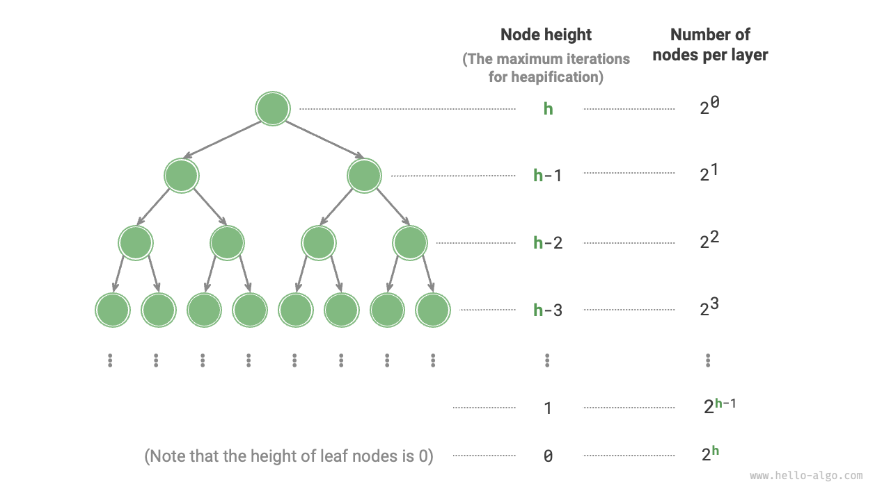

# 8.2 &nbsp; Thao tác xây dựng heap

Trong một số trường hợp, chúng ta muốn xây dựng một heap sử dụng tất cả các phần tử
của một list, và quá trình này được gọi là "thao tác xây dựng heap".

## 8.2.1 &nbsp; Triển khai bằng thao tác chèn vào heap

Đầu tiên, chúng ta tạo một heap rỗng và sau đó duyệt qua list,
thực hiện "thao tác chèn vào heap" cho từng phần tử một. Điều này có
nghĩa là thêm phần tử vào cuối heap và sau đó "heapify" nó từ dưới
lên trên.

Mỗi khi một phần tử được thêm vào heap, độ dài của heap tăng lên một.
Vì các node được thêm vào binary tree từ trên xuống dưới, heap được
xây dựng "từ trên xuống dưới."

Giả sử số lượng phần tử là $n$, và thao tác chèn mỗi phần tử mất
thời gian $O(\log{n})$, do đó time complexity của phương pháp xây
dựng heap này là $O(n \log n)$.

## 8.2.2 &nbsp; Triển khai bằng cách heapify thông qua duyệt

Trên thực tế, chúng ta có thể triển khai một phương pháp xây dựng heap
hiệu quả hơn theo hai bước.

1. Thêm tất cả các phần tử của list như chúng vốn có vào heap, tại thời điểm này
    các thuộc tính của heap chưa được thỏa mãn.
2. Duyệt heap theo thứ tự ngược (ngược lại với duyệt theo thứ tự cấp độ), và
    thực hiện "heapify từ trên xuống dưới" trên mỗi node không phải node lá.

**Sau khi heapify một node, subtree với node đó làm root trở thành một sub-heap
hợp lệ**. Vì việc duyệt là theo thứ tự ngược, heap được xây dựng "từ dưới lên trên".

Lý do chọn duyệt ngược là vì nó đảm bảo rằng subtree bên dưới node hiện tại
đã là một sub-heap hợp lệ, khiến việc heapify node hiện tại trở nên hiệu quả.

Điều đáng nói là **vì các leaf node không có node con, chúng tự nhiên tạo thành
các sub-heap hợp lệ và không cần phải heapify**. Như được hiển thị trong đoạn code sau,
node không phải node lá cuối cùng là parent của node cuối cùng; chúng ta bắt đầu
từ nó và duyệt theo thứ tự ngược để thực hiện việc heapify:

=== "Python"

    ```python title="my_heap.py"
    def __init__(self, nums: list[int]):
        """Hàm khởi tạo, xây dựng heap dựa trên list đầu vào"""
        # Thêm tất cả các phần tử của list vào heap
        self.max_heap = nums
        # Heapify tất cả các node ngoại trừ node lá
        for i in range(self.parent(self.size() - 1), -1, -1):
            self.sift_down(i)
    ```

=== "C++"

    ```cpp title="my_heap.cpp"
    /* Hàm khởi tạo, xây dựng heap dựa trên list đầu vào */
    MaxHeap(vector<int> nums) {
        // Thêm tất cả các phần tử của list vào heap
        maxHeap = nums;
        // Heapify tất cả các node ngoại trừ node lá
        for (int i = parent(size() - 1); i >= 0; i--) {
            siftDown(i);
        }
    }
    ```

=== "Java"

    ```java title="my_heap.java"
    /* Hàm khởi tạo, xây dựng heap dựa trên list đầu vào */
    MaxHeap(List<Integer> nums) {
        // Thêm tất cả các phần tử của list vào heap
        maxHeap = new ArrayList<>(nums);
        // Heapify tất cả các node ngoại trừ node lá
        for (int i = parent(size() - 1); i >= 0; i--) {
            siftDown(i);
        }
    }
    ```

=== "C#"

    ```csharp title="my_heap.cs"
    [class]{MaxHeap}-[func]{MaxHeap}
    ```

=== "Go"

    ```go title="my_heap.go"
    [class]{maxHeap}-[func]{newMaxHeap}
    ```

=== "Swift"

    ```swift title="my_heap.swift"
    [class]{MaxHeap}-[func]{init}
    ```

=== "JS"

    ```javascript title="my_heap.js"
    [class]{MaxHeap}-[func]{constructor}
    ```

=== "TS"

    ```typescript title="my_heap.ts"
    [class]{MaxHeap}-[func]{constructor}
    ```

=== "Dart"

    ```dart title="my_heap.dart"
    [class]{MaxHeap}-[func]{MaxHeap}
    ```

=== "Rust"

    ```rust title="my_heap.rs"
    [class]{MaxHeap}-[func]{new}
    ```

=== "C"

    ```c title="my_heap.c"
    [class]{MaxHeap}-[func]{newMaxHeap}
    ```

=== "Kotlin"

    ```kotlin title="my_heap.kt"
    [class]{MaxHeap}-[func]{}
    ```

=== "Ruby"

    ```ruby title="my_heap.rb"
    [class]{MaxHeap}-[func]{initialize}
    ```

=== "Zig"

    ```zig title="my_heap.zig"
    [class]{MaxHeap}-[func]{init}
    ```

## 8.2.3 &nbsp; Phân tích độ phức tạp

Tiếp theo, chúng ta hãy thử tính time complexity (độ phức tạp thời gian) của phương
pháp xây dựng heap thứ hai này.

- Giả sử số lượng node trong complete binary tree là $n$, thì số lượng node lá
    là $(n + 1) / 2$, trong đó $/$ là phép chia số nguyên. Do đó, số lượng node
    cần được heapify là $(n - 1) / 2$.
- Trong quá trình "heapify từ trên xuống", mỗi node được heapify tối đa đến
    các node lá, vì vậy số lần lặp tối đa là chiều cao của binary tree $\log n$.

Nhân hai giá trị này, chúng ta có time complexity của quá trình xây dựng heap
là $O(n \log n)$. **Tuy nhiên, ước tính này không chính xác, vì nó không tính
đến đặc điểm của binary tree là có nhiều node ở các cấp thấp hơn so với các
cấp trên.**

Chúng ta hãy thực hiện một phép tính chính xác hơn. Để đơn giản hóa phép tính,
giả sử có một "perfect binary tree" với $n$ node và chiều cao $h$; giả định này
không ảnh hưởng đến tính đúng đắn của kết quả.

{ class="animation-figure" }

<p align="center"> Hình 8-5 &nbsp; Số lượng node ở mỗi cấp của perfect binary tree </p>

Như thể hiện trong Hình 8-5, số lần lặp tối đa để một node "được heapify từ trên
xuống" bằng với khoảng cách từ node đó đến các node lá, đây chính xác là "chiều
cao node". Do đó, chúng ta có thể cộng tổng "số lượng node $\times$ chiều cao
node" ở mỗi cấp, **để có được tổng số lần lặp heapify cho tất cả các node**.

$$
T(h) = 2^0h + 2^1(h-1) + 2^2(h-2) + \dots + 2^{(h-1)}\times1
$$

Để đơn giản hóa phương trình trên, chúng ta cần sử dụng kiến thức về dãy số từ
cấp ba, trước tiên nhân $T(h)$ với $2$, để được:

$$
\begin{aligned}
T(h) & = 2^0h + 2^1(h-1) + 2^2(h-2) + \dots + 2^{h-1}\times1 \newline
2T(h) & = 2^1h + 2^2(h-1) + 2^3(h-2) + \dots + 2^h\times1 \newline
\end{aligned}
$$

Bằng cách trừ $T(h)$ từ $2T(h)$ sử dụng phương pháp dịch chuyển, chúng ta có:

$$
2T(h) - T(h) = T(h) = -2^0h + 2^1 + 2^2 + \dots + 2^{h-1} + 2^h
$$

Quan sát phương trình, $T(h)$ là một cấp số nhân (geometric series), có thể được
tính trực tiếp bằng công thức tổng, cho ra một time complexity là:

$$
\begin{aligned}
T(h) & = 2 \frac{1 - 2^h}{1 - 2} - h \newline
& = 2^{h+1} - h - 2 \newline
& = O(2^h)
\end{aligned}
$$

Hơn nữa, một perfect binary tree với chiều cao $h$ có $n = 2^{h+1} - 1$ node,
do đó độ phức tạp là $O(2^h) = O(n)$. Phép tính này cho thấy rằng **time
complexity của việc nhập một list và xây dựng một heap là $O(n)$, điều này
rất hiệu quả**.
