# 8.1 &nbsp; Heap

Một <u>heap</u> là một complete binary tree thỏa mãn các điều kiện cụ thể và có
thể được phân loại chính thành hai loại, như được minh họa trong Hình 8-1.

- <u>min heap</u>: Giá trị của bất kỳ node nào $\leq$ các giá trị của các node
  con của nó.
- <u>max heap</u>: Giá trị của bất kỳ node nào $\geq$ các giá trị của các node
  con của nó.

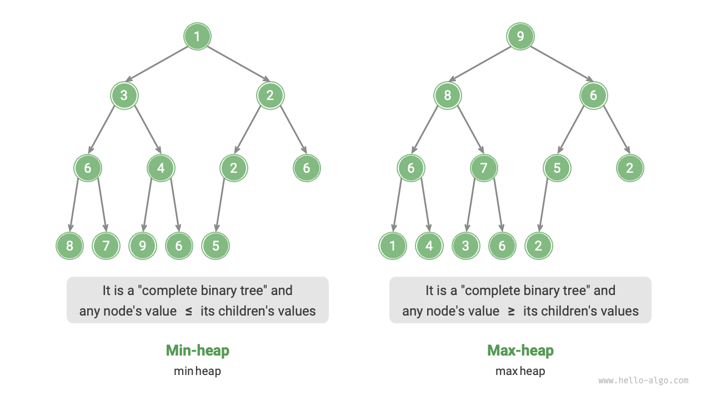{ class="animation-figure" }

<p align="center"> Hình 8-1 &nbsp; Min heap và max heap </p>

Là một trường hợp đặc biệt của complete binary tree, một heap có các đặc điểm
sau:

- Các node ở tầng đáy được điền từ trái sang phải, và các node ở các tầng khác
  được điền đầy đủ.
- node gốc của binary tree được gọi là "đỉnh" của heap, và node ngoài cùng bên
  phải ở tầng đáy được gọi là "đáy" của heap.
- Đối với max heaps (min heaps), giá trị của phần tử trên cùng (gốc) là lớn
  nhất (nhỏ nhất) trong số tất cả các phần tử.

## 8.1.1 &nbsp; Các thao tác heap phổ biến

Cần lưu ý rằng nhiều ngôn ngữ lập trình cung cấp một <u>priority queue</u>,
là một cấu trúc dữ liệu trừu tượng được định nghĩa là một queue với sắp
xếp ưu tiên.

Trong thực tế, **heap thường được sử dụng để triển khai priority queue.
Một max heap tương ứng với một priority queue trong đó các phần tử được
lấy ra theo thứ tự giảm dần**. Từ góc độ sử dụng, chúng ta có thể coi
"priority queue" và "heap" là các cấu trúc dữ liệu tương đương. Do đó,
cuốn sách này không phân biệt đặc biệt giữa hai khái niệm này, mà thống
nhất gọi chúng là "heap."

Các thao tác phổ biến trên heap được thể hiện trong Bảng 8-1, và tên
phương thức có thể khác nhau tùy thuộc vào ngôn ngữ lập trình.

<p align="center"> Bảng 8-1 &nbsp; Hiệu suất của các thao tác trên Heap </p>

<div class="center-table" markdown>

| Tên phương thức | Mô tả                                                           | Time complexity |
| --------------- | --------------------------------------------------------------- | --------------- |
| `push()`        | Thêm một phần tử vào heap                                       | $O(\log n)$     |
| `pop()`         | Xóa phần tử đầu (top) khỏi heap                                 | $O(\log n)$     |
| `peek()`        | Truy cập phần tử đầu (đối với max/min heap, là giá trị max/min) | $O(1)$          |
| `size()`        | Lấy số lượng phần tử trong heap                                 | $O(1)$          |
| `isEmpty()`     | Kiểm tra xem heap có trống không                                | $O(1)$          |

</div>

Trong thực tế, chúng ta có thể trực tiếp sử dụng lớp heap (hoặc lớp
priority queue) được cung cấp bởi các ngôn ngữ lập trình.

Tương tự như các thuật toán sắp xếp nơi chúng ta có "thứ tự tăng dần" và
"thứ tự giảm dần", chúng ta có thể chuyển đổi giữa "min heap" và "max
heap" bằng cách đặt một `flag` hoặc sửa đổi `Comparator`. Đoạn mã như
sau:

=== "Python"

    ```python title="heap.py"
    # Khởi tạo một min heap
    min_heap, flag = [], 1
    # Khởi tạo một max heap
    max_heap, flag = [], -1

    # Module heapq của Python triển khai min heap theo mặc định
    # Bằng cách phủ định các phần tử trước khi đẩy chúng vào heap, chúng ta đảo ngược thứ tự và do đó triển khai một max heap
    # Trong ví dụ này, flag = 1 tương ứng với min heap, trong khi flag = -1 tương ứng với max heap

    # Đẩy các phần tử vào heap
    heapq.heappush(max_heap, flag * 1)
    heapq.heappush(max_heap, flag * 3)
    heapq.heappush(max_heap, flag * 2)
    heapq.heappush(max_heap, flag * 5)
    heapq.heappush(max_heap, flag * 4)

    # Truy xuất phần tử đầu (top) của heap
    peek: int = flag * max_heap[0] # 5

    # Lấy phần tử đầu (top) của heap
    # Các phần tử được lấy ra sẽ tạo thành một dãy theo thứ tự giảm dần
    val = flag * heapq.heappop(max_heap) # 5
    val = flag * heapq.heappop(max_heap) # 4
    val = flag * heapq.heappop(max_heap) # 3
    val = flag * heapq.heappop(max_heap) # 2
    val = flag * heapq.heappop(max_heap) # 1

    # Lấy kích thước của heap
    size: int = len(max_heap)

    # Kiểm tra xem heap có rỗng không
    is_empty: bool = not max_heap

    # Tạo một heap từ một list
    min_heap: list[int] = [1, 3, 2, 5, 4]
    heapq.heapify(min_heap)
    ```

=== "C++"

    ```cpp title="heap.cpp"
    /* Khởi tạo một heap */
    // Khởi tạo một min heap
    priority_queue<int, vector<int>, greater<int>> minHeap;
    // Khởi tạo một max heap
    priority_queue<int, vector<int>, less<int>> maxHeap;

    /* Thêm phần tử vào heap */
    maxHeap.push(1);
    maxHeap.push(3);
    maxHeap.push(2);
    maxHeap.push(5);
    maxHeap.push(4);

    /* Lấy phần tử trên cùng của heap */
    int peek = maxHeap.top(); // 5

    /* Xóa phần tử trên cùng của heap */
    // Các phần tử bị xóa sẽ tạo thành một chuỗi theo thứ tự giảm dần
    maxHeap.pop(); // 5
    maxHeap.pop(); // 4
    maxHeap.pop(); // 3
    maxHeap.pop(); // 2
    maxHeap.pop(); // 1

    /* Lấy kích thước của heap */
    int size = maxHeap.size();

    /* Kiểm tra xem heap có rỗng không */
    bool isEmpty = maxHeap.empty();

    /* Tạo một heap từ một list */
    vector<int> input{1, 3, 2, 5, 4};
    priority_queue<int, vector<int>, greater<int>> minHeap(input.begin(), input.end());
    ```

=== "Java"

    ```java title="heap.java"
    /* Khởi tạo một heap */
    // Khởi tạo một min heap
    Queue<Integer> minHeap = new PriorityQueue<>();
    // Khởi tạo một max heap (Chỉ cần sửa đổi Comparator bằng biểu thức lambda)
    Queue<Integer> maxHeap = new PriorityQueue<>((a, b) -> b - a);

    /* Thêm phần tử vào heap */
    maxHeap.offer(1);
    maxHeap.offer(3);
    maxHeap.offer(2);
    maxHeap.offer(5);
    maxHeap.offer(4);

    /* Lấy phần tử trên cùng của heap */
    int peek = maxHeap.peek(); // 5

    /* Xóa phần tử trên cùng của heap */
    // Các phần tử bị xóa sẽ tạo thành một chuỗi theo thứ tự giảm dần
    peek = maxHeap.poll(); // 5
    peek = maxHeap.poll(); // 4
    peek = maxHeap.poll(); // 3
    peek = maxHeap.poll(); // 2
    peek = maxHeap.poll(); // 1

    /* Lấy kích thước của heap */
    int size = maxHeap.size();

    /* Kiểm tra xem heap có rỗng không */
    boolean isEmpty = maxHeap.isEmpty();

    /* Tạo một heap từ một list */
    minHeap = new PriorityQueue<>(Arrays.asList(1, 3, 2, 5, 4));
    ```

=== "C#"

    ```csharp title="heap.cs"
    /* Khởi tạo một heap */
    // Khởi tạo một min heap
    PriorityQueue<int, int> minHeap = new();
    // Khởi tạo một max heap (Chỉ cần sửa đổi Comparator bằng biểu thức lambda)
    PriorityQueue<int, int> maxHeap = new(Comparer<int>.Create((x, y) => y - x));

    /* Thêm phần tử vào heap */
    maxHeap.Enqueue(1, 1);
    maxHeap.Enqueue(3, 3);
    maxHeap.Enqueue(2, 2);
    maxHeap.Enqueue(5, 5);
    maxHeap.Enqueue(4, 4);

    /* Lấy phần tử trên cùng của heap */
    int peek = maxHeap.Peek();//5

    /* Xóa phần tử đầu (lớn nhất) khỏi heap */
    // Các phần tử đã xóa sẽ tạo thành một chuỗi theo thứ tự giảm dần
    peek = maxHeap.Dequeue();  // 5
    peek = maxHeap.Dequeue();  // 4
    peek = maxHeap.Dequeue();  // 3
    peek = maxHeap.Dequeue();  // 2
    peek = maxHeap.Dequeue();  // 1

    /* Lấy kích thước của heap */
    int size = maxHeap.Count;

    /* Kiểm tra xem heap có trống không */
    bool isEmpty = maxHeap.Count == 0;

    /* Tạo một heap từ một list */
    minHeap = new PriorityQueue<int, int>([(1, 1), (3, 3), (2, 2), (5, 5), (4, 4)]);
    ```

=== "Go"

    ```go title="heap.go"
    // Trong Go, chúng ta có thể xây dựng một max heap của các số nguyên
    // bằng cách triển khai heap.Interface
    // Lưu ý rằng việc triển khai heap.Interface cũng yêu cầu
    // triển khai sort.Interface
    type intHeap []any

    // Phương thức Push của heap.Interface, dùng để đẩy một phần tử vào heap
    func (h *intHeap) Push(x any) {
        // Cả Push và Pop đều sử dụng một pointer receiver
        // vì chúng không chỉ điều chỉnh các phần tử của slice mà còn
        // thay đổi độ dài của nó
        *h = append(*h, x.(int))
    }

    // Phương thức Pop của heap.Interface, dùng để xóa phần tử đầu của heap
    func (h *intHeap) Pop() any {
        // Phần tử cần xóa khỏi heap được lưu trữ ở cuối
        last := (*h)[len(*h)-1]
        *h = (*h)[:len(*h)-1]
        return last
    }

    // Phương thức Len của sort.Interface
    func (h *intHeap) Len() int {
        return len(*h)
    }

    // Phương thức Less của sort.Interface
    func (h *intHeap) Less(i, j int) bool {
        // Nếu bạn muốn triển khai một min heap, bạn sẽ thay đổi điều này
        // thành một phép so sánh nhỏ hơn
        return (*h)[i].(int) > (*h)[j].(int)
    }

    // Phương thức Swap của sort.Interface
    func (h *intHeap) Swap(i, j int) {
        (*h)[i], (*h)[j] = (*h)[j], (*h)[i]
    }

    // Top Lấy phần tử đầu của heap
    func (h *intHeap) Top() any {
        return (*h)[0]
    }

    /* Mã điều khiển */
    func TestHeap(t *testing.T) {
        /* Khởi tạo một heap */
        // Khởi tạo một max heap
        maxHeap := &intHeap{}
        heap.Init(maxHeap)
        /* Đẩy các phần tử vào heap */
        // Gọi các phương thức của heap.Interface để thêm các phần tử
        heap.Push(maxHeap, 1)
        heap.Push(maxHeap, 3)
        heap.Push(maxHeap, 2)
        heap.Push(maxHeap, 4)
        heap.Push(maxHeap, 5)

        /* Lấy phần tử đầu của heap */
        top := maxHeap.Top()
        fmt.Printf("Phần tử đầu của heap là %d\n", top)

        /* Xóa phần tử đầu của heap */
        // Gọi các phương thức của heap.Interface để xóa các phần tử
        heap.Pop(maxHeap) // 5
        heap.Pop(maxHeap) // 4
        heap.Pop(maxHeap) // 3
        heap.Pop(maxHeap) // 2
        heap.Pop(maxHeap) // 1

        /* Lấy kích thước của heap */
        size := len(*maxHeap)
        fmt.Printf("Số lượng phần tử trong heap là %d\n", size)
    }

    /* Kiểm tra xem heap có trống không */
        isEmpty := len(*maxHeap) == 0
        fmt.Printf("Heap có trống không? %t\n", isEmpty)
    }
    ```

=== "Swift"

    ```swift title="heap.swift"
    /* Khởi tạo một heap */
    // Kiểu Heap của Swift hỗ trợ cả max heaps và min heaps, và cần thư viện swift-collections
    var heap = Heap<Int>()

    /* Đẩy các phần tử vào heap */
    heap.insert(1)
    heap.insert(3)
    heap.insert(2)
    heap.insert(5)
    heap.insert(4)

    /* Lấy phần tử trên cùng của heap */
    var peek = heap.max()!

    /* Xóa phần tử trên cùng của heap */
    peek = heap.removeMax() // 5
    peek = heap.removeMax() // 4
    peek = heap.removeMax() // 3
    peek = heap.removeMax() // 2
    peek = heap.removeMax() // 1

    /* Lấy kích thước của heap */
    let size = heap.count

    /* Kiểm tra xem heap có trống không */
    let isEmpty = heap.isEmpty

    /* Tạo một heap từ một danh sách */
    let heap2 = Heap([1, 3, 2, 5, 4])
    ```

=== "JS"

    ```javascript title="heap.js"
    // JavaScript không cung cấp lớp Heap có sẵn
    ```

=== "TS"

    ```typescript title="heap.ts"
    // TypeScript không cung cấp lớp Heap có sẵn
    ```

=== "Dart"

    ```dart title="heap.dart"
    // Dart không cung cấp lớp Heap có sẵn
    ```

=== "Rust"

    ```rust title="heap.rs"
    use std::collections::BinaryHeap;
    use std::cmp::Reverse;

    /* Khởi tạo một heap */
    // Khởi tạo một min heap
    let mut min_heap = BinaryHeap::<Reverse<i32>>::new();
    // Khởi tạo một max heap
    let mut max_heap = BinaryHeap::new();

    /* Đẩy các phần tử vào heap */
    max_heap.push(1);
    max_heap.push(3);
    max_heap.push(2);
    max_heap.push(5);
    max_heap.push(4);

    /* Lấy phần tử trên cùng của heap */
    let peek = max_heap.peek().unwrap();  // 5

    /* Xóa phần tử trên cùng của heap */
    // Các phần tử được xóa sẽ tạo thành một dãy theo thứ tự giảm dần
    let peek = max_heap.pop().unwrap();   // 5
    let peek = max_heap.pop().unwrap();   // 4
    let peek = max_heap.pop().unwrap();   // 3
    let peek = max_heap.pop().unwrap();   // 2
    let peek = max_heap.pop().unwrap();   // 1

    /* Lấy kích thước của heap */
    let size = max_heap.len();

    /* Kiểm tra xem heap có trống không */
    let is_empty = max_heap.is_empty();

    /* Tạo một heap từ một danh sách */
    let min_heap = BinaryHeap::from(vec![Reverse(1), Reverse(3), Reverse(2), Reverse(5), Reverse(4)]);
    ```

=== "C"

    ```c title="heap.c"
    // C không cung cấp lớp Heap có sẵn
    ```

=== "Kotlin"

    ```kotlin title="heap.kt"
    /* Khởi tạo một heap */
    // Khởi tạo một min heap
    var minHeap = PriorityQueue<Int>()
    // Khởi tạo một max heap (Chỉ cần sửa đổi Comparator bằng biểu biểu thức lambda）
    val maxHeap = PriorityQueue { a: Int, b: Int -> b - a }

    /* Đẩy các phần tử vào heap */
    maxHeap.offer(1)
    maxHeap.offer(3)
    maxHeap.offer(2)
    maxHeap.offer(5)
    maxHeap.offer(4)

    /* Lấy phần tử trên cùng của heap */
    var peek = maxHeap.peek() // 5

    /* Xóa phần tử trên cùng của heap */
    // Các phần tử bị xóa sẽ tạo thành một dãy theo thứ tự giảm dần
    peek = maxHeap.poll() // 5
    peek = maxHeap.poll() // 4
    peek = maxHeap.poll() // 3
    peek = maxHeap.poll() // 2
    peek = maxHeap.poll() // 1

    /* Lấy kích thước của heap */
    val size = maxHeap.size

    /* Kiểm tra xem heap có trống không */
    val isEmpty = maxHeap.isEmpty()

    /* Tạo một heap từ một list */
    minHeap = PriorityQueue(mutableListOf(1, 3, 2, 5, 4))
    ```

=== "Ruby"

    ```ruby title="heap.rb"

    ```

=== "Zig"

    ```zig title="heap.zig"

    ```

??? pythontutor "Code visualization"

    https://pythontutor.com/render.html#code=import%20heapq%0A%0A%22%22%22Driver%20Code%22%22%22%0Aif%20__name__%20%3D%3D%20%22__main__%22%3A%0A%20%20%20%20%23%20%E5%88%9D%E5%A7%8B%E5%8C%96%E5%B0%8F%E9%A1%B6%E5%A0%86%0A%20%20%20%20min_heap,%20flag%20%3D%20%5B%5D,%201%0A%20%20%20%20%23%20%E5%88%9D%E5%A7%8B%E5%8C%96%E5%A4%A7%E9%A1%B6%E5%A0%86%0A%20%20%20%20max_heap,%20flag%20%3D%20%5B%5D,%20-1%0A%20%20%20%20%0A%20%20%20%20%23%20Python%20%E7%9A%84%20heapq%20%E6%A8%A1%E5%9D%97%E9%BB%98%E8%AE%A4%E5%AE%9E%E7%8E%B0%E5%B0%8F%E9%A1%B6%E5%A0%86%0A%20%20%20%20%23%20%E8%80%83%E8%99%91%E5%B0%86%E2%80%9C%E5%85%83%E7%B4%A0%E5%8F%96%E8%B4%9F%E2%80%9D%E5%90%8E%E5%86%8D%E5%85%A5%E5%A0%86%EF%BC%8C%E8%BF%99%E6%A0%B7%E5%B0%B1%E5%8F%AF%E4%BB%A5%E5%B0%86%E5%A4%A7%E5%B0%8F%E5%85%B3%E7%B3%BB%E9%A2%A0%E5%80%92%EF%BC%8C%E4%BB%8E%E8%80%8C%E5%AE%9E%E7%8E%B0%E5%A4%A7%E9%A1%B6%E5%A0%86%0A%20%20%20%20%23%20%E5%9C%A8%E6%9C%AC%E7%A4%BA%E4%BE%8B%E4%B8%AD%EF%BC%8Cflag%20%3D%201%20%E6%97%B6%E5%AF%B9%E5%BA%94%E5%B0%8F%E9%A1%B6%E5%A0%86%EF%BC%8Cflag%20%3D%20-1%20%E6%97%B6%E5%AF%B9%E5%BA%94%E5%A4%A7%E9%A1%B6%E5%A0%86%0A%20%20%20%20%0A%20%20%20%20%23%20%E5%85%83%E7%B4%A0%E5%85%A5%E5%A0%86%0A%20%20%20%20heapq.heappush%28max_heap,%20flag%20*%201%29%0A%20%20%20%20heapq.heappush%28max_heap,%20flag%20*%203%29%0A%20%20%20%20heapq.heappush%28max_heap,%20flag%20*%202%29%0A%20%20%20%20heapq.heappush%28max_heap,%20flag%20*%205%29%0A%20%20%20%20heapq.heappush%28max_heap,%20flag%20*%204%29%0A%20%20%20%20%0A%20%20%20%20%23%20%E8%8E%B7%E5%8F%96%E5%A0%86%E9%A1%B6%E5%85%83%E7%B4%A0%0A%20%20%20%20peek%20%3D%20flag%20*%20max_heap%5B0%5D%20%23%205%0A%20%20%20%20%0A%20%20%20%20%23%20%E5%A0%86%E9%A1%B6%E5%85%83%E7%B4%A0%E5%87%BA%E5%A0%86%0A%20%20%20%20%23%20%E5%87%BA%E5%A0%86%E5%85%83%E7%B4%A0%E4%BC%9A%E5%BD%A2%E6%88%90%E4%B8%80%E4%B8%AA%E4%BB%8E%E5%A4%A7%E5%88%B0%E5%B0%8F%E7%9A%84%E5%BA%8F%E5%88%97%0A%20%20%20%20val%20%3D%20flag%20*%20heapq.heappop%28max_heap%29%20%23%205%0A%20%20%20%20val%20%3D%20flag%20*%20heapq.heappop%28max_heap%29%20%23%204%0A%20%20%20%20val%20%3D%20flag%20*%20heapq.heappop%28max_heap%29%20%23%203%0A%20%20%20%20val%20%3D%20flag%20*%20heapq.heappop%28max_heap%29%20%23%202%0A%20%20%20%20val%20%3D%20flag%20*%20heapq.heappop%28max_heap%29%20%23%201%0A%20%20%20%20%0A%20%20%20%20%23%20%E8%8E%B7%E5%8F%96%E5%A0%86%E5%A4%A7%E5%B0%8F%0A%20%20%20%20size%20%3D%20len%28max_heap%29%0A%20%20%20%20%0A%20%20%20%20%23%20%E5%88%A4%E6%96%AD%E5%A0%86%E6%98%AF%E5%90%A6%E4%B8%BA%E7%A9%BA%0A%20%20%20%20is_empty%20%3D%20not%20max_heap%0A%20%20%20%20%0A%20%20%20%20%23%20%E8%BE%93%E5%85%A5%E5%88%97%E8%A1%A8%E5%B9%B6%E5%BB%BA%E5%A0%86%0A%20%20%20%20min_heap%20%3D%20%5B1,%203,%202,%205,%204%5D%0A%20%20%20%20heapq.heapify%28min_heap%29&cumulative=false&curInstr=3&heapPrimitives=nevernest&mode=display&origin=opt-frontend.js&py=311&rawInputLstJSON=%5B%5D&textReferences=false

## 8.1.2 &nbsp; Triển khai heap

Phần triển khai dưới đây là của một max heap. Để chuyển đổi nó thành một min heap,
bạn chỉ cần đảo ngược tất cả các phép so sánh logic kích thước (ví dụ, thay thế
$\geq$ bằng $\leq$). Chúng tôi khuyến khích bạn đọc tự mình triển khai nó.

### 1. &nbsp; Lưu trữ và biểu diễn heap

Như đã đề cập trong phần "Binary Trees", complete binary tree (cây nhị phân đầy đủ)
rất phù hợp để biểu diễn bằng array. Vì heap là một loại complete binary tree,
**chúng ta sẽ sử dụng array để lưu trữ heap**.

Khi sử dụng một array để biểu diễn một binary tree, các phần tử đại diện
cho node values (giá trị node), và indexes (chỉ số) đại diện cho node positions
(vị trí node) trong binary tree. **Node pointers (con trỏ node) được triển khai
thông qua một index mapping formula (công thức ánh xạ chỉ số)**.

Như được minh họa trong Hình 8-2, với một index $i$, index của left child
(node con trái) của nó là $2i + 1$, index của right child (node con phải)
của nó là $2i + 2$, và index của parent (node cha) của nó là $(i - 1) / 2$
(phép chia lấy phần nguyên). Khi index nằm ngoài giới hạn, điều đó có nghĩa
là null node (node rỗng) hoặc node đó không tồn tại.

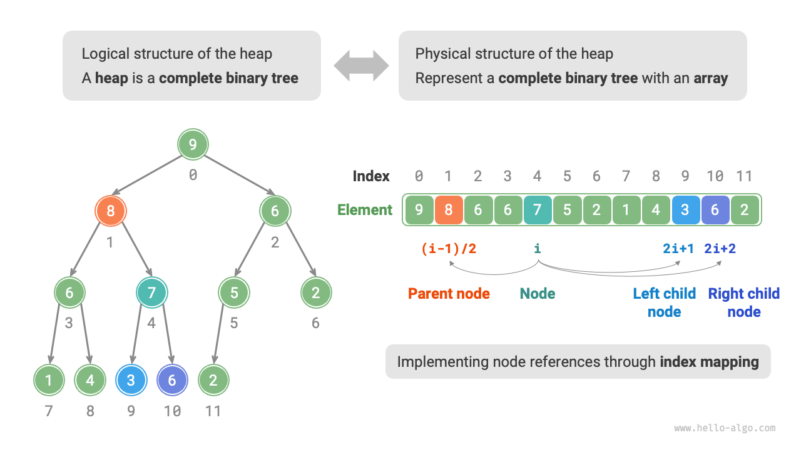{ class="animation-figure" }

<p align="center"> Hình 8-2 &nbsp; Biểu diễn và lưu trữ heap </p>

Chúng ta có thể đóng gói index mapping formula vào các hàm để thuận tiện
cho việc sử dụng sau này:

=== "Python"

    ```python title="my_heap.py"
    def left(self, i: int) -> int:
        """Lấy index của node con trái"""
        return 2 * i + 1

    def right(self, i: int) -> int:
        """Lấy index của node con phải"""
        return 2 * i + 2

    def parent(self, i: int) -> int:
        """Lấy index của node cha"""
        return (i - 1) // 2  # Chia lấy phần nguyên
    ```

=== "C++"

    ```cpp title="my_heap.cpp"
    /* Lấy index của node con trái */
    int left(int i) {
        return 2 * i + 1;
    }

    /* Lấy index của node con phải */
    int right(int i) {
        return 2 * i + 2;
    }

    /* Lấy index của node cha */
    int parent(int i) {
        return (i - 1) / 2; // Chia lấy phần nguyên
    }
    ```

=== "Java"

    ```java title="my_heap.java"
    /* Lấy index của node con trái */
    int left(int i) {
        return 2 * i + 1;
    }

    /* Lấy index của node con phải */
    int right(int i) {
        return 2 * i + 2;
    }

    /* Lấy index của node cha */
    int parent(int i) {
        return (i - 1) / 2; // Chia lấy phần nguyên
    }
    ```

=== "C#"

    ```csharp title="my_heap.cs"
    [class]{MaxHeap}-[func]{Left}

    [class]{MaxHeap}-[func]{Right}

    [class]{MaxHeap}-[func]{Parent}
    ```

=== "Go"

    ```go title="my_heap.go"
    [class]{maxHeap}-[func]{left}

    [class]{maxHeap}-[func]{right}

    [class]{maxHeap}-[func]{parent}
    ```

=== "Swift"

    ```swift title="my_heap.swift"
    [class]{MaxHeap}-[func]{left}

    [class]{MaxHeap}-[func]{right}

    [class]{MaxHeap}-[func]{parent}
    ```

=== "JS"

    ```javascript title="my_heap.js"
    [class]{MaxHeap}-[func]{left}

    [class]{MaxHeap}-[func]{right}

    [class]{MaxHeap}-[func]{parent}
    ```

=== "TS"

    ```typescript title="my_heap.ts"
    [class]{MaxHeap}-[func]{left}

    [class]{MaxHeap}-[func]{right}

    [class]{MaxHeap}-[func]{parent}
    ```

=== "Dart"

    ```dart title="my_heap.dart"
    [class]{MaxHeap}-[func]{_left}

    [class]{MaxHeap}-[func]{_right}

    [class]{MaxHeap}-[func]{_parent}
    ```

=== "Rust"

    ```rust title="my_heap.rs"
    /* Lấy index của node con trái */
    fn left(i: usize) -> usize {
        2 * i + 1
    }

    /* Lấy index của node con phải */
    fn right(i: usize) -> usize {
        2 * i + 2
    }

    /* Lấy index của node cha */
    fn parent(i: usize) -> usize {
        (i - 1) / 2 // Chia lấy phần nguyên
    }
    ```

=== "C"

    ```c title="my_heap.c"
    [class]{MaxHeap}-[func]{left}

    [class]{MaxHeap}-[func]{right}

    [class]{MaxHeap}-[func]{parent}
    ```

=== "Kotlin"

    ```kotlin title="my_heap.kt"
    [class]{MaxHeap}-[func]{left}

    [class]{MaxHeap}-[func]{right}

    [class]{MaxHeap}-[func]{parent}
    ```

=== "Ruby"

    ```ruby title="my_heap.rb"
    [class]{MaxHeap}-[func]{left}

    [class]{MaxHeap}-[func]{right}

    [class]{MaxHeap}-[func]{parent}
    ```

=== "Zig"

    ```zig title="my_heap.zig"
    [class]{MaxHeap}-[func]{left}

    [class]{MaxHeap}-[func]{right}

    [class]{MaxHeap}-[func]{parent}
    ```

### 2. &nbsp; Truy cập phần tử trên cùng của heap

Phần tử trên cùng của heap là node gốc của binary tree, đồng thời cũng là phần tử
đầu tiên của list:

=== "Python"

    ```python title="my_heap.py"
    def peek(self) -> int:
        """Truy cập phần tử trên cùng của heap"""
        return self.max_heap[0]
    ```

=== "C++"

    ```cpp title="my_heap.cpp"
    /* Truy cập phần tử trên cùng của heap */
    int peek() {
        return maxHeap[0];
    }
    ```

=== "Java"

    ```java title="my_heap.java"
    /* Truy cập phần tử trên cùng của heap */
    int peek() {
        return maxHeap.get(0);
    }
    ```

=== "C#"

    ```csharp title="my_heap.cs"
    [class]{MaxHeap}-[func]{Peek}
    ```

=== "Go"

    ```go title="my_heap.go"
    [class]{maxHeap}-[func]{peek}
    ```

=== "Swift"

    ```swift title="my_heap.swift"
    [class]{MaxHeap}-[func]{peek}
    ```

=== "JS"

    ```javascript title="my_heap.js"
    [class]{MaxHeap}-[func]{peek}
    ```

=== "TS"

    ```typescript title="my_heap.ts"
    [class]{MaxHeap}-[func]{peek}
    ```

=== "Dart"

    ```dart title="my_heap.dart"
    [class]{MaxHeap}-[func]{peek}
    ```

=== "Rust"

    ```rust title="my_heap.rs"
    [class]{MaxHeap}-[func]{peek}
    ```

=== "C"

    ```c title="my_heap.c"
    [class]{MaxHeap}-[func]{peek}
    ```

=== "Kotlin"

    ```kotlin title="my_heap.kt"
    [class]{MaxHeap}-[func]{peek}
    ```

=== "Ruby"

    ```ruby title="my_heap.rb"
    [class]{MaxHeap}-[func]{peek}
    ```

=== "Zig"

    ```zig title="my_heap.zig"
    [class]{MaxHeap}-[func]{peek}
    ```

### 3. &nbsp; Chèn một phần tử vào heap
---

---
Với một phần tử `val`, chúng ta chèn nó vào đáy của heap. Sau khi chèn,
vì `val` có thể lớn hơn các phần tử khác trong heap, tính toàn vẹn của heap
có thể bị ảnh hưởng, **do đó, cần phải sửa chữa đường dẫn từ node được chèn
đến node gốc**. Thao tác này được gọi là <u>heapify</u>.

Xem xét việc bắt đầu từ node được chèn, **thực hiện heapify từ dưới lên trên**.
Như được minh họa trong Hình 8-3, chúng ta so sánh giá trị của node được chèn
với node cha của nó, và nếu node được chèn lớn hơn, chúng ta hoán đổi chúng.
Sau đó, tiếp tục thao tác này, sửa chữa từng node trong heap từ dưới lên trên
cho đến khi đạt đến node gốc hoặc một node không cần hoán đổi.

=== "<1>"
    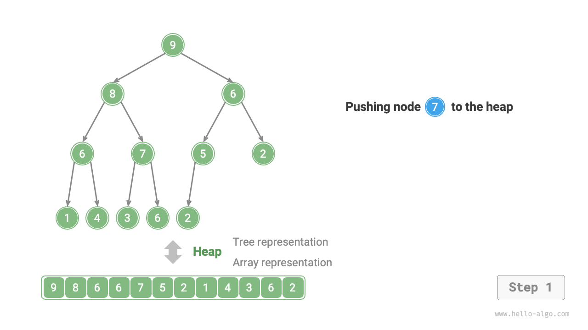{ class="animation-figure" }

=== "<2>"
    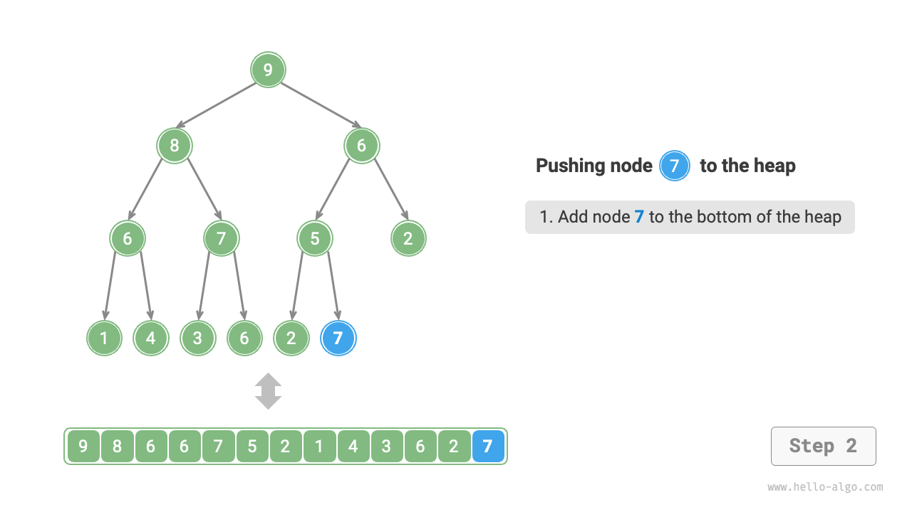{ class="animation-figure" }

=== "<3>"
    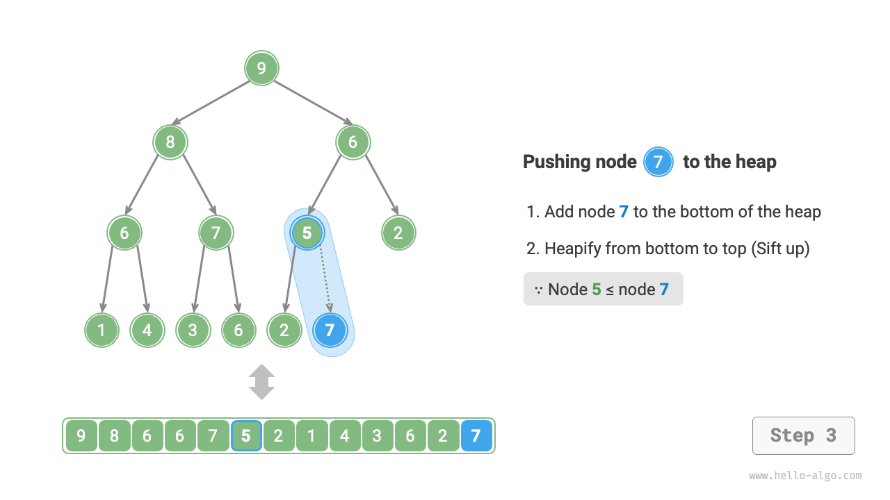{ class="animation-figure" }

=== "<4>"
    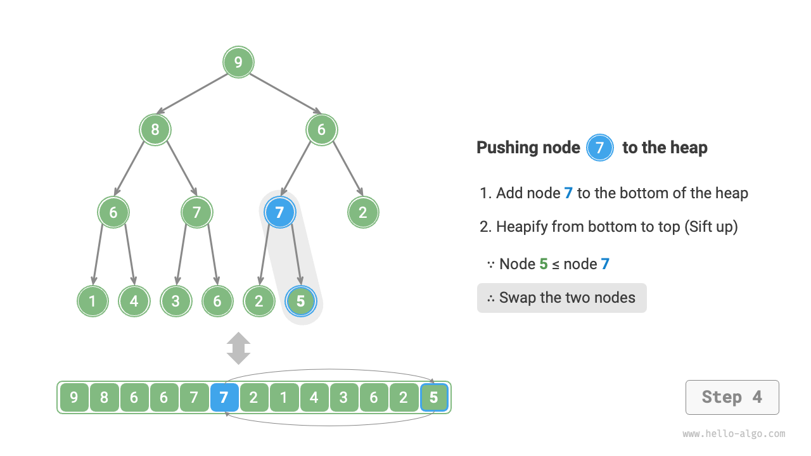{ class="animation-figure" }

=== "<5>"
    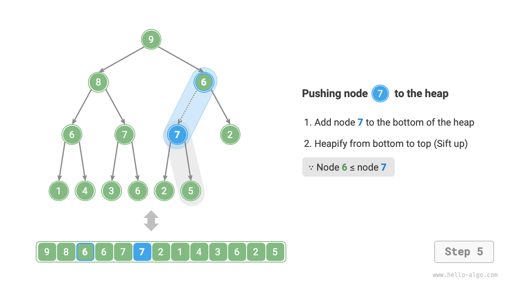{ class="animation-figure" }

=== "<6>"
    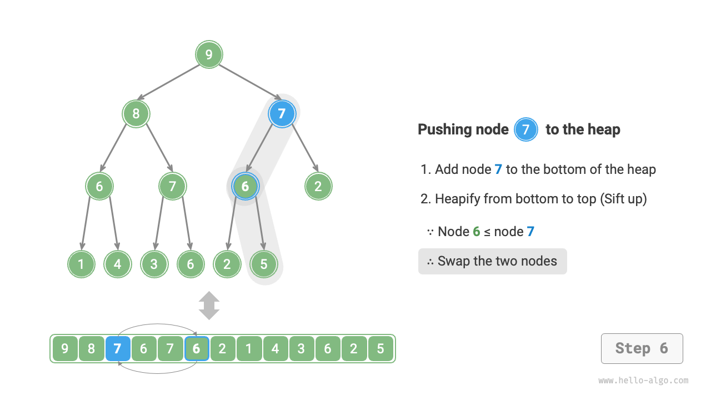{ class="animation-figure" }

=== "<7>"
    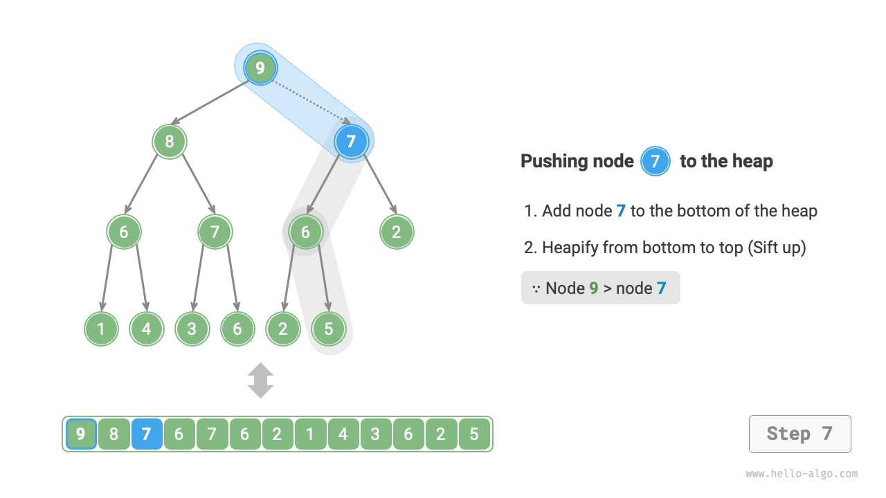{ class="animation-figure" }

=== "<8>"
    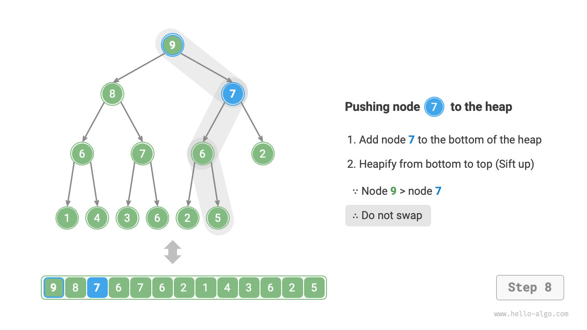{ class="animation-figure" }

=== "<9>"
    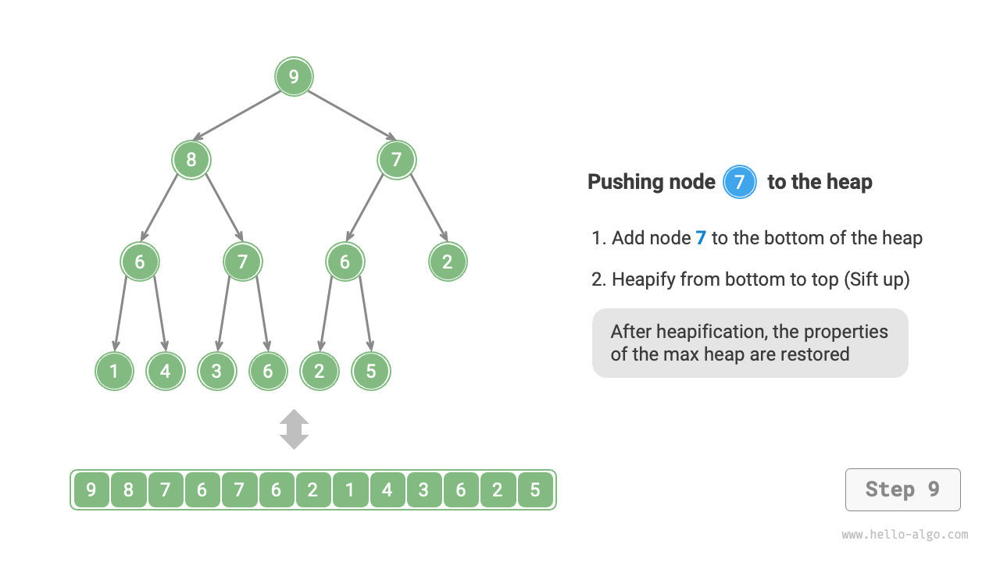{ class="animation-figure" }

<p align="center"> Hình 8-3 &nbsp; Các bước chèn phần tử vào heap </p>

Với tổng số $n$ node, chiều cao của tree là $O(\log n)$. Do đó,
số lần lặp vòng lặp cho thao tác heapify tối đa là $O(\log n)$,
**khiến time complexity của thao tác chèn phần tử là $O(\log n)$**.
Đoạn code như sau:

=== "Python"

    ```python title="my_heap.py"
    def push(self, val: int):
        """Chèn phần tử vào heap"""
        # Thêm node
        self.max_heap.append(val)
        # Heapify từ dưới lên trên
        self.sift_up(self.size() - 1)

    def sift_up(self, i: int):
        """Bắt đầu heapify node i, từ dưới lên trên"""
        while True:
            # Lấy node cha của node i
            p = self.parent(i)
            # Khi "vượt qua node gốc" hoặc "node không cần sửa chữa", kết thúc heapify
            if p < 0 or self.max_heap[i] <= self.max_heap[p]:
                break
            # Hoán đổi hai node
            self.swap(i, p)
            # Lặp lại quá trình heapify lên trên
            i = p
    ```

=== "C++"

    ```cpp title="my_heap.cpp"
    /* Chèn phần tử vào heap */
    void push(int val) {
        // Thêm node
        maxHeap.push_back(val);
        // Heapify từ dưới lên trên
        siftUp(size() - 1);
    }

    /* Bắt đầu heapify node i, từ dưới lên trên */
    void siftUp(int i) {
        while (true) {
            // Lấy node cha của node i
            int p = parent(i);
            // Khi "vượt qua node gốc" hoặc "node không cần sửa chữa", kết thúc quá trình heapify
            if (p < 0 || maxHeap[i] <= maxHeap[p])
                break;
            // Hoán đổi hai node
            swap(maxHeap[i], maxHeap[p]);
            // Lặp lại quá trình heapify lên trên
            i = p;
        }
    }
    ```

=== "Java"

    ```java title="my_heap.java"
    /* Đẩy phần tử vào heap */
    void push(int val) {
        // Thêm node
        maxHeap.add(val);
        // Heapify từ dưới lên trên
        siftUp(size() - 1);
    }

    /* Bắt đầu heapify node i, từ dưới lên trên */
    void siftUp(int i) {
        while (true) {
            // Lấy node cha của node i
            int p = parent(i);
            // Khi "vượt qua node gốc" hoặc "node không cần sửa chữa", kết thúc quá trình heapify
            if (p < 0 || maxHeap.get(i) <= maxHeap.get(p))
                break;
            // Hoán đổi hai node
            swap(i, p);
            // Lặp lại quá trình heapify lên trên
            i = p;
        }
    }
    ```

=== "C#"

    ```csharp title="my_heap.cs"
    [class]{MaxHeap}-[func]{Push}

    [class]{MaxHeap}-[func]{SiftUp}
    ```

=== "Go"

    ```go title="my_heap.go"
    [class]{maxHeap}-[func]{push}

    [class]{maxHeap}-[func]{siftUp}
    ```

=== "Swift"

    ```swift title="my_heap.swift"
    [class]{MaxHeap}-[func]{push}

    [class]{MaxHeap}-[func]{siftUp}
    ```

=== "JS"

    ```javascript title="my_heap.js"
    [class]{MaxHeap}-[func]{push}

    [class]{MaxHeap}-[func]{siftUp}
    ```

=== "TS"

    ```typescript title="my_heap.ts"
    [class]{MaxHeap}-[func]{push}

    [class]{MaxHeap}-[func]{siftUp}
    ```

=== "Dart"

    ```dart title="my_heap.dart"
    [class]{MaxHeap}-[func]{push}

    [class]{MaxHeap}-[func]{siftUp}
    ```

=== "Rust"

    ```rust title="my_heap.rs"
    [class]{MaxHeap}-[func]{push}

    [class]{MaxHeap}-[func]{sift_up}
    ```

=== "C"

    ```c title="my_heap.c"
    [class]{MaxHeap}-[func]{push}

    [class]{MaxHeap}-[func]{siftUp}
    ```

=== "Kotlin"

    ```kotlin title="my_heap.kt"
    [class]{MaxHeap}-[func]{push}

    [class]{MaxHeap}-[func]{siftUp}
    ```

=== "Ruby"

    ```ruby title="my_heap.rb"
    [class]{MaxHeap}-[func]{push}

    [class]{MaxHeap}-[func]{sift_up}
    ```

=== "Zig"

    ```zig title="my_heap.zig"
    [class]{MaxHeap}-[func]{push}

    [class]{MaxHeap}-[func]{siftUp}
    ```

### 4. &nbsp; Xóa phần tử đầu tiên khỏi heap

Phần tử đầu tiên của heap là node gốc của binary tree, tức là phần tử
đầu tiên của list. Nếu chúng ta xóa trực tiếp phần tử đầu tiên khỏi list,
tất cả các chỉ số node trong binary tree sẽ thay đổi, gây khó khăn cho
việc sử dụng heapify để sửa chữa sau này. Để giảm thiểu thay đổi trong
chỉ số phần tử, chúng ta sử dụng các bước sau.

1. Hoán đổi phần tử trên cùng với phần tử dưới cùng của heap (hoán đổi
   node gốc với node lá ngoài cùng bên phải).
2. Sau khi hoán đổi, xóa phần tử dưới cùng của heap khỏi danh sách (lưu ý
   rằng vì nó đã được hoán đổi, phần tử trên cùng ban đầu thực sự đang
   được xóa).
3. Bắt đầu từ node gốc, **thực hiện heapify từ trên xuống dưới**.

Như minh họa trong Hình 8-4, **hướng của "heapify từ trên xuống dưới" ngược
lại với "heapify từ dưới lên trên"**. Chúng ta so sánh giá trị của node gốc
với hai node con của nó và hoán đổi nó với node con lớn nhất. Sau đó, lặp
lại thao tác này cho đến khi đạt đến node lá hoặc gặp một node không cần
hoán đổi.

=== "<1>"
    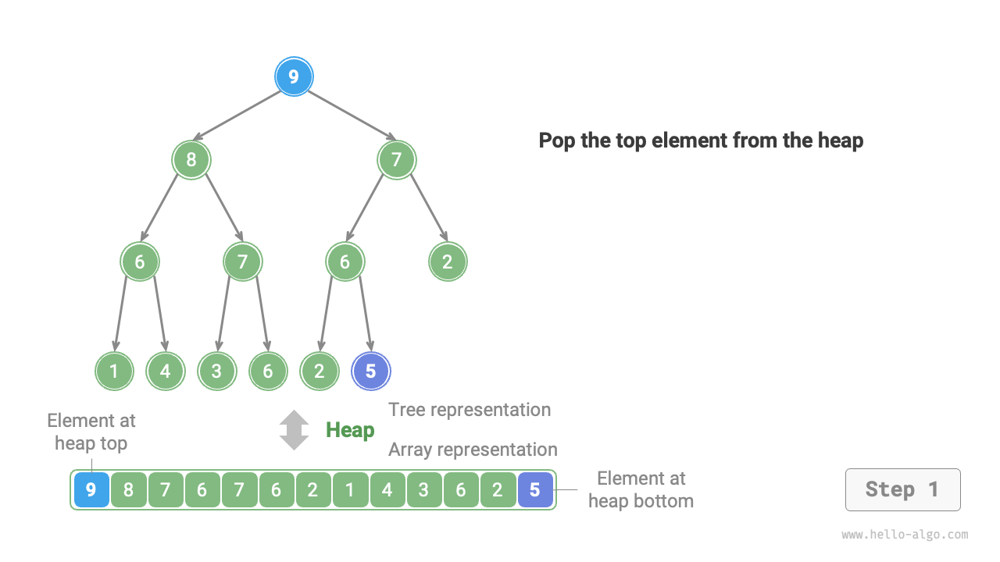{ class="animation-figure" }

=== "<2>"
    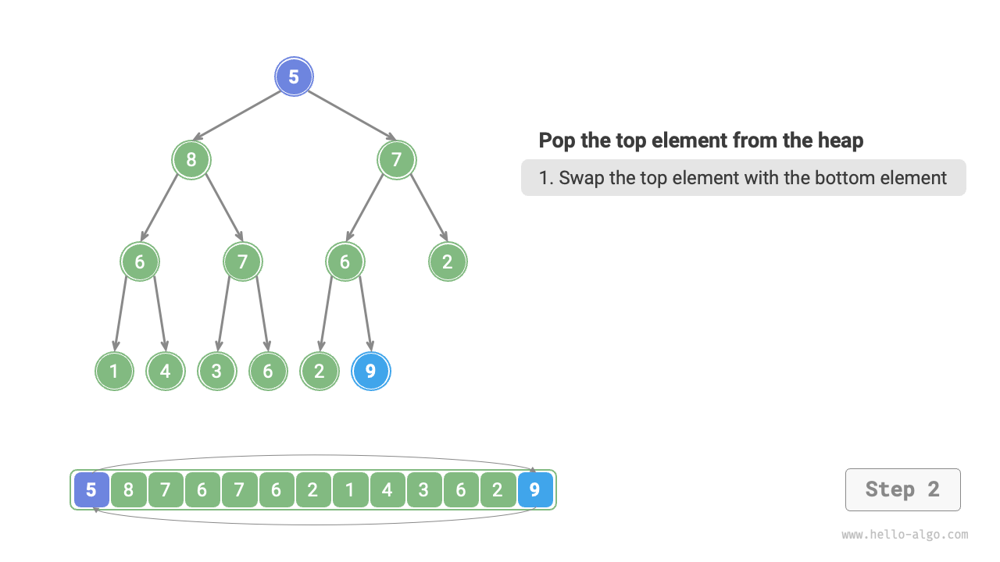{ class="animation-figure" }

=== "<3>"
    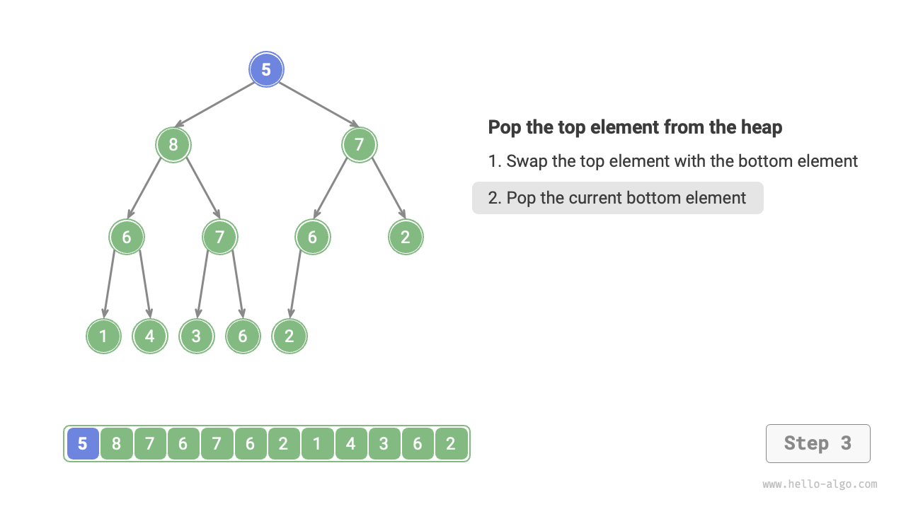{ class="animation-figure" }

=== "<4>"
    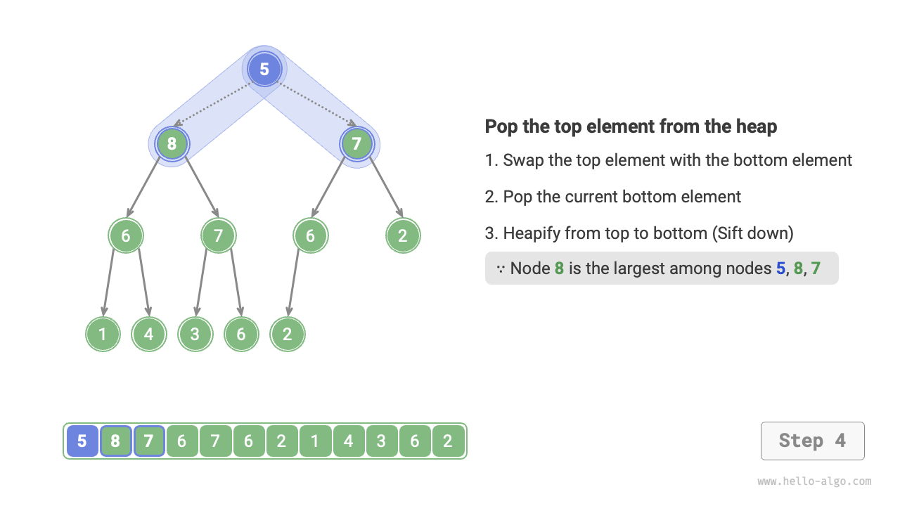{ class="animation-figure" }

=== "<5>"
    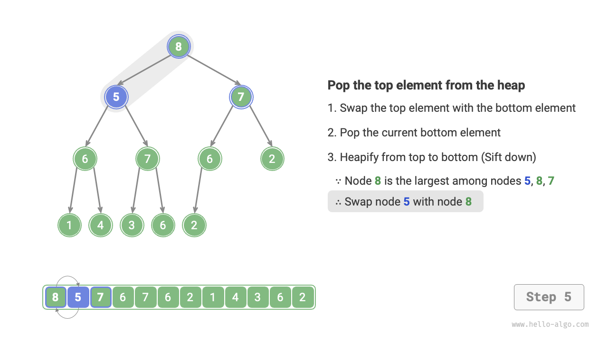{ class="animation-figure" }

=== "<6>"
    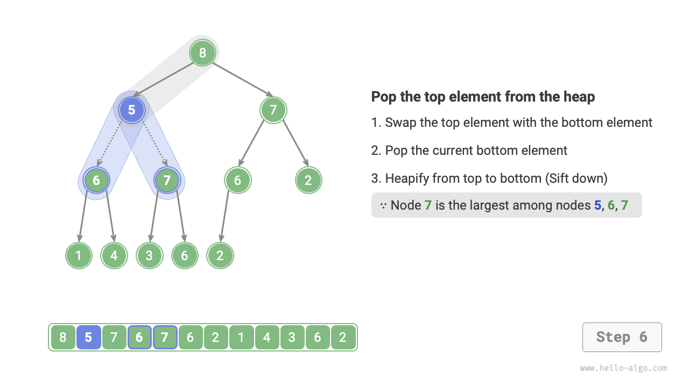{ class="animation-figure" }

=== "<7>"
    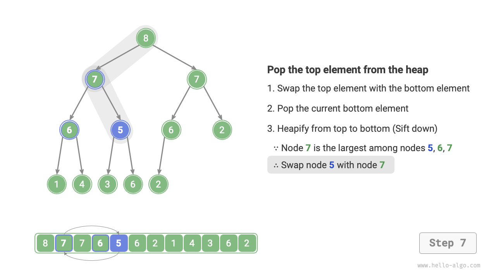{ class="animation-figure" }

=== "<8>"
    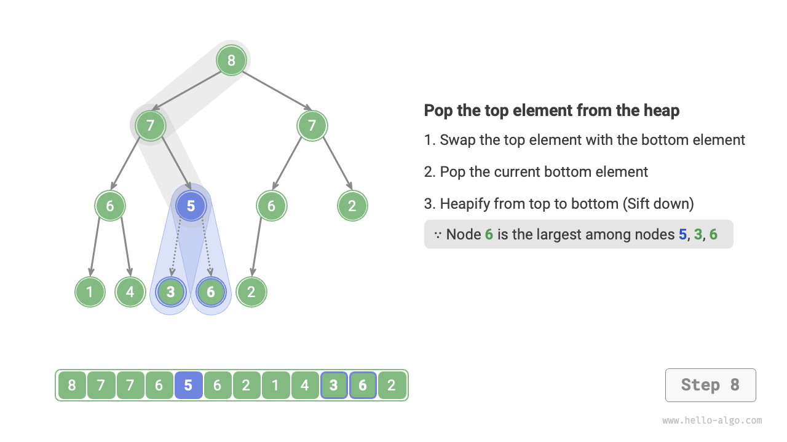{ class="animation-figure" }

=== "<9>"
    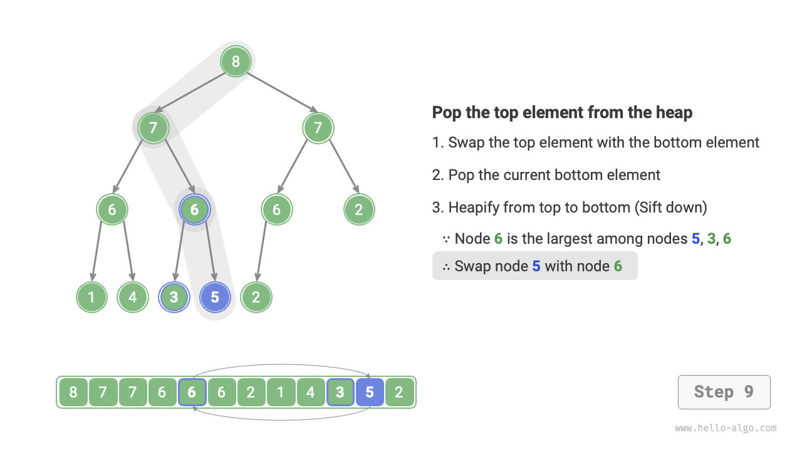{ class="animation-figure" }

=== "<10>"
    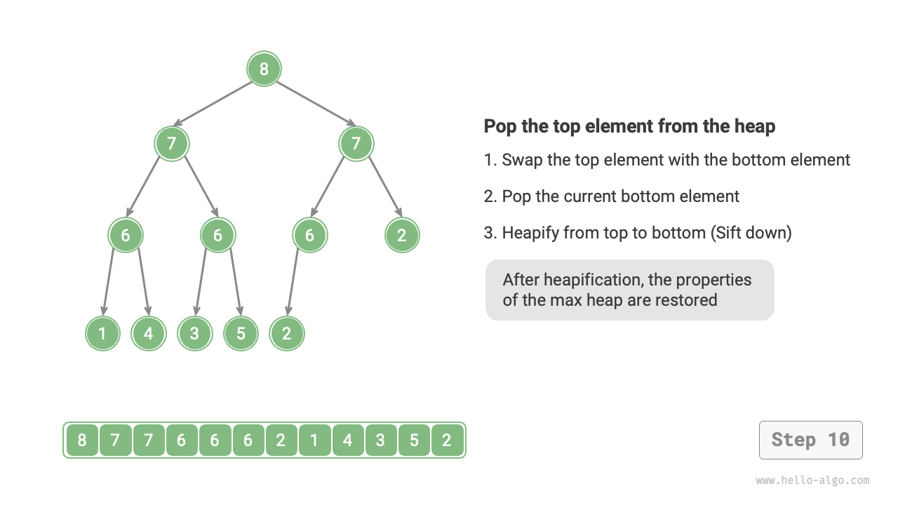{ class="animation-figure" }

<p align="center"> Hình 8-4 &nbsp; Các bước xóa phần tử trên cùng khỏi heap </p>

Tương tự như thao tác chèn phần tử, time complexity của thao tác xóa phần
tử trên cùng cũng là $O(\log n)$. Code như sau:

=== "Python"

    ```python title="my_heap.py"
    def pop(self) -> int:
        """Phần tử rời khỏi heap"""
        # Xử lý trường hợp rỗng
        if self.is_empty():
            raise IndexError("Heap rỗng")
        # Hoán đổi node gốc với node lá ngoài cùng bên phải (hoán đổi phần tử đầu tiên với phần tử cuối cùng)
        self.swap(0, self.size() - 1)
        # Xóa node
        val = self.max_heap.pop()
        # Heapify từ trên xuống dưới
        self.sift_down(0)
        # Trả về phần tử trên cùng của heap
        return val

    def sift_down(self, i: int):
        """Bắt đầu heapify node i, từ trên xuống dưới"""
        while True:
            # Xác định node lớn nhất trong số i, l, r, được ghi nhận là ma
            l, r, ma = self.left(i), self.right(i), i
            if l < self.size() and self.max_heap[l] > self.max_heap[ma]:
                ma = l
            if r < self.size() and self.max_heap[r] > self.max_heap[ma]:
                ma = r
            # Nếu node i là lớn nhất hoặc các chỉ số l, r nằm ngoài giới hạn,
            # không cần heapify thêm, thoát khỏi vòng lặp
            if ma == i:
                break
            # Hoán đổi hai node
            self.swap(i, ma)
            # Lặp lại quá trình heapify xuống dưới
            i = ma
    ```

=== "C++"

    ```cpp title="my_heap.cpp"
    /* Phần tử rời khỏi heap */
    void pop() {
        // Xử lý trường hợp rỗng
        if (isEmpty()) {
            throw out_of_range("Heap trống");
        }
        // Hoán đổi node gốc với node lá ngoài cùng bên phải
        // (hoán đổi phần tử đầu tiên với phần tử cuối cùng)
        swap(maxHeap[0], maxHeap[size() - 1]);
        // Xóa node
        maxHeap.pop_back();
        // Heapify từ trên xuống dưới
        siftDown(0);
    }

    /* Bắt đầu heapify node i, từ trên xuống dưới */
    void siftDown(int i) {
        while (true) {
            // Xác định node lớn nhất trong số i, l, r, được ghi nhận là ma
            int l = left(i), r = right(i), ma = i;
            if (l < size() && maxHeap[l] > maxHeap[ma])
                ma = l;
            if (r < size() && maxHeap[r] > maxHeap[ma])
                ma = r;
            // Nếu node i là lớn nhất hoặc các chỉ số l, r nằm ngoài giới hạn,
            // không cần heapify thêm, thoát khỏi vòng lặp
            if (ma == i)
                break;
            swap(maxHeap[i], maxHeap[ma]);
            // Lặp lại quá trình heapify xuống dưới
            i = ma;
        }
    }
    ```

=== "Java"

    ```java title="my_heap.java"
    /* Phần tử rời khỏi heap */
    int pop() {
        // Xử lý trường hợp rỗng
        if (isEmpty())
            throw new IndexOutOfBoundsException();
        // Hoán đổi node gốc với node lá ngoài cùng bên phải
        // (hoán đổi phần tử đầu tiên với phần tử cuối cùng)
        swap(0, size() - 1);
        // Xóa node
        int val = maxHeap.remove(size() - 1);
        // Heapify từ trên xuống dưới
        siftDown(0);
        // Trả về phần tử đầu heap
        return val;
    }

    /* Bắt đầu heapify node i, từ trên xuống dưới */
    void siftDown(int i) {
        while (true) {
            // Xác định node lớn nhất trong số i, l, r, được ký hiệu là ma
            int l = left(i), r = right(i), ma = i;
            if (l < size() && maxHeap.get(l) > maxHeap.get(ma))
                ma = l;
            if (r < size() && maxHeap.get(r) > maxHeap.get(ma))
                ma = r;
            // Nếu node i là lớn nhất hoặc các chỉ số l, r nằm ngoài giới hạn, không cần heapify thêm, thoát khỏi vòng lặp
            if (ma == i)
                break;
            // Hoán đổi hai node
            swap(i, ma);
            // Lặp lại quá trình heapify xuống dưới
            i = ma;
        }
    }
    ```

=== "C#"

    ```csharp title="my_heap.cs"
    [class]{MaxHeap}-[func]{Pop}

    [class]{MaxHeap}-[func]{SiftDown}
    ```

=== "Go"

    ```go title="my_heap.go"
    [class]{maxHeap}-[func]{pop}

    [class]{maxHeap}-[func]{siftDown}
    ```

=== "Swift"

    ```swift title="my_heap.swift"
    [class]{MaxHeap}-[func]{pop}

    [class]{MaxHeap}-[func]{siftDown}
    ```

=== "JS"

    ```javascript title="my_heap.js"
    [class]{MaxHeap}-[func]{pop}

    [class]{MaxHeap}-[func]{siftDown}
    ```

=== "TS"

    ```typescript title="my_heap.ts"
    [class]{MaxHeap}-[func]{pop}

    [class]{MaxHeap}-[func]{siftDown}
    ```

=== "Dart"

    ```dart title="my_heap.dart"
    [class]{MaxHeap}-[func]{pop}

    [class]{MaxHeap}-[func]{siftDown}
    ```

=== "Rust"

    ```rust title="my_heap.rs"
    [class]{MaxHeap}-[func]{pop}

    [class]{MaxHeap}-[func]{sift_down}
    ```

=== "C"

    ```c title="my_heap.c"
    [class]{MaxHeap}-[func]{pop}

    [class]{MaxHeap}-[func]{siftDown}
    ```

=== "Kotlin"

    ```kotlin title="my_heap.kt"
    [class]{MaxHeap}-[func]{pop}

    [class]{MaxHeap}-[func]{siftDown}
    ```

=== "Ruby"

    ```ruby title="my_heap.rb"
    [class]{MaxHeap}-[func]{pop}

    [class]{MaxHeap}-[func]{sift_down}
    ```

=== "Zig"

    ```zig title="my_heap.zig"
    [class]{MaxHeap}-[func]{pop}

    [class]{MaxHeap}-[func]{siftDown}
    ```

## 8.1.3 &nbsp; Các ứng dụng phổ biến của heaps

- **Priority Queue**: Heaps thường là cấu trúc dữ liệu được ưu tiên
  để triển khai priority queue, với cả thao tác enqueue và dequeue
  đều có time complexity là $O(\log n)$, và xây dựng một queue
  có time complexity là $O(n)$, tất cả đều rất hiệu quả.
- **Heap Sort**: Với một tập hợp data, chúng ta có thể tạo một heap
  từ chúng và sau đó liên tục thực hiện các thao tác xóa phần tử
  để có được data đã sắp xếp. Tuy nhiên, có một cách triển khai
  heap sort thanh lịch hơn, như đã giải thích trong chương
  "Heap Sort".
- **Tìm $k$ phần tử lớn nhất**: Đây là một bài toán thuật toán cổ điển
  và cũng là một trường hợp sử dụng phổ biến, chẳng hạn như chọn 10 tin
  tức hot nhất cho tìm kiếm hot của Weibo, chọn 10 sản phẩm bán chạy
  nhất, v.v.
