# 8.3 &nbsp; Bài toán Top-k

!!! question

    Cho một array `nums` chưa sắp xếp có độ dài $n$, trả về $k$ phần tử lớn nhất
    trong array.

Đối với bài toán này, chúng ta sẽ giới thiệu trước tiên hai giải pháp đơn giản,
sau đó giải thích một phương pháp hiệu quả hơn dựa trên heap.

## 8.3.1 &nbsp; Phương pháp 1: Chọn lặp

Chúng ta có thể thực hiện $k$ vòng lặp như được minh họa trong Hình 8-6,
trích xuất các phần tử lớn nhất thứ $1$, thứ $2$, $\dots$, thứ $k$ trong mỗi vòng,
với time complexity là $O(nk)$.

Phương pháp này chỉ phù hợp khi $k \ll n$, vì time complexity tiến gần đến $O(n^2)$
khi $k$ gần bằng $n$, điều này rất tốn thời gian.

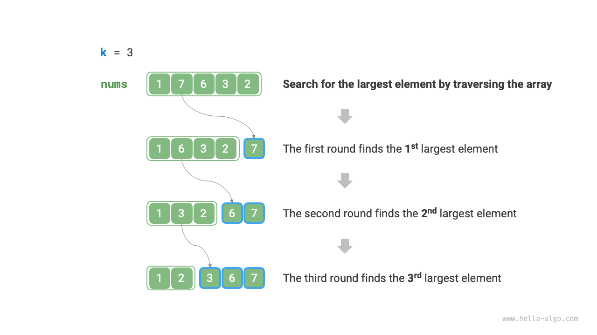{ class="animation-figure" }

<p align="center"> Hình 8-6 &nbsp; Tìm $k$ phần tử lớn nhất một cách lặp lại </p>

!!! tip

    Khi $k = n$, chúng ta có thể thu được một dãy hoàn chỉnh đã sắp xếp,
    tương đương với thuật toán "selection sort".

## 8.3.2 &nbsp; Phương pháp 2: Sắp xếp

Như thể hiện trong Hình 8-7, chúng ta có thể đầu tiên sắp xếp array `nums`
và sau đó trả về $k$ phần tử cuối cùng, với time complexity là $O(n \log n)$.

Rõ ràng, phương pháp này "vượt quá" yêu cầu của nhiệm vụ, vì chúng ta chỉ
cần tìm $k$ phần tử lớn nhất, mà không cần phải sắp xếp các phần tử khác.

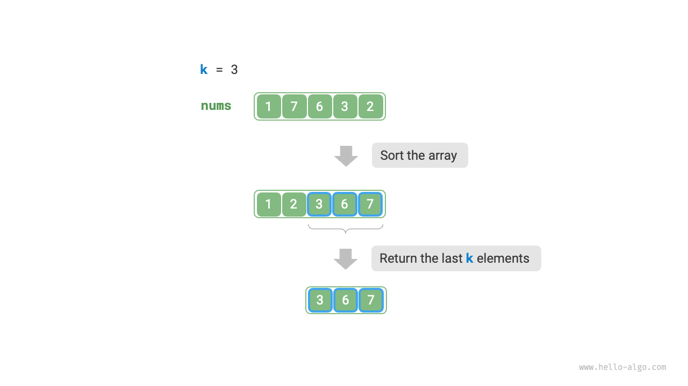{ class="animation-figure" }

<p align="center"> Hình 8-7 &nbsp; Sắp xếp để tìm $k$ phần tử lớn nhất </p>

---
## 8.3.3 &nbsp; Phương pháp 3: Heap

Chúng ta có thể giải quyết bài toán Top-k một cách hiệu quả hơn dựa trên heap,
như được thể hiện trong quy trình sau đây.

1. Khởi tạo một min heap, trong đó phần tử trên cùng là nhỏ nhất.
2. Đầu tiên, chèn $k$ phần tử đầu tiên của array vào heap.
3. Bắt đầu từ phần tử thứ $k + 1$, nếu phần tử hiện tại lớn hơn phần tử trên cùng
của heap, hãy xóa phần tử trên cùng của heap và chèn phần tử hiện tại vào heap.
4. Sau khi hoàn tất quá trình duyệt, heap chứa $k$ phần tử lớn nhất.

=== "<1>"
    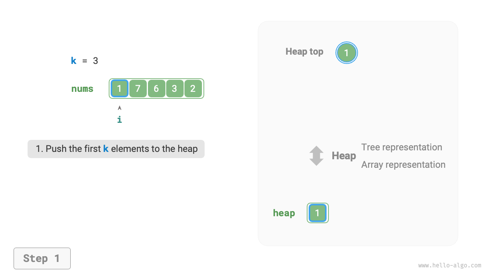{ class="animation-figure" }

=== "<2>"
    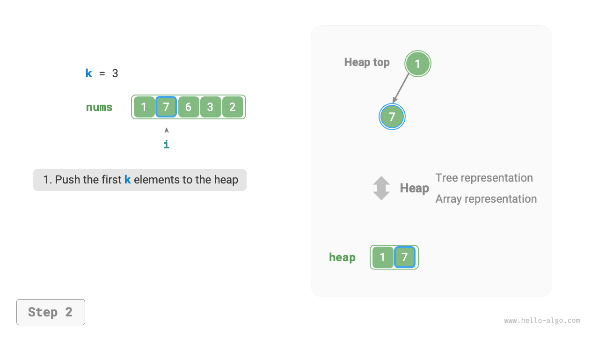{ class="animation-figure" }

=== "<3>"
    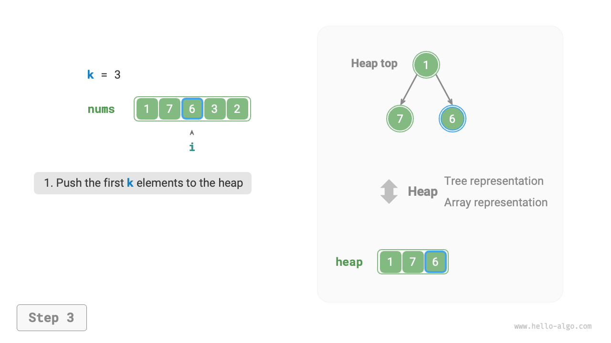{ class="animation-figure" }

=== "<4>"
    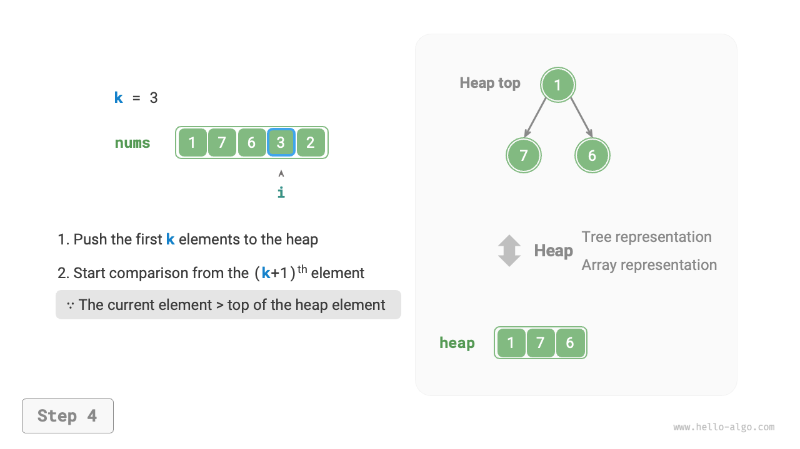{ class="animation-figure" }

=== "<5>"
    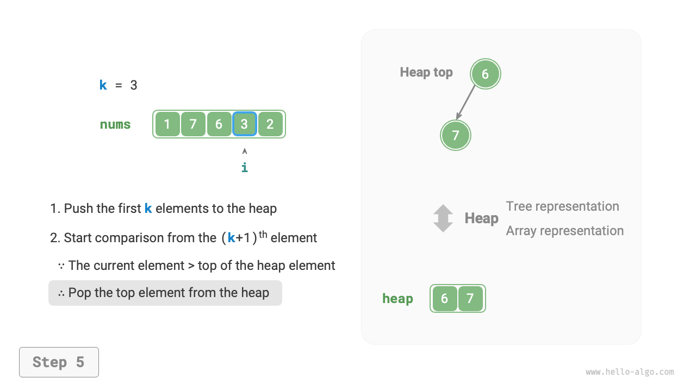{ class="animation-figure" }

=== "<6>"
    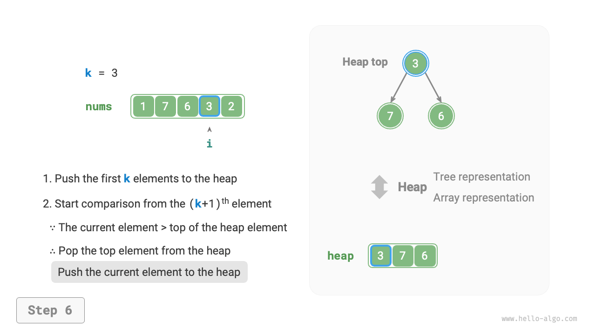{ class="animation-figure" }

=== "<7>"
    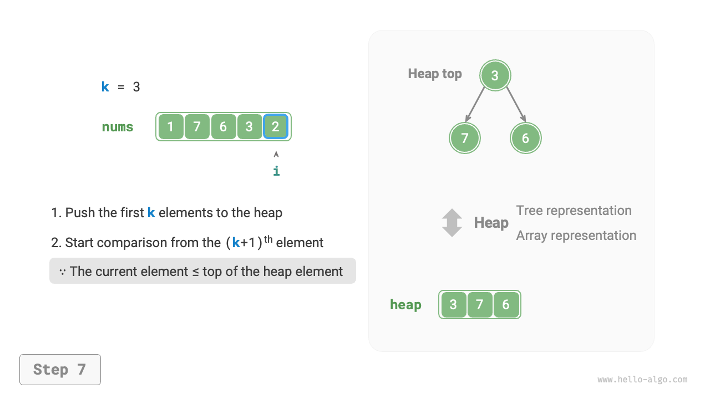{ class="animation-figure" }

=== "<8>"
    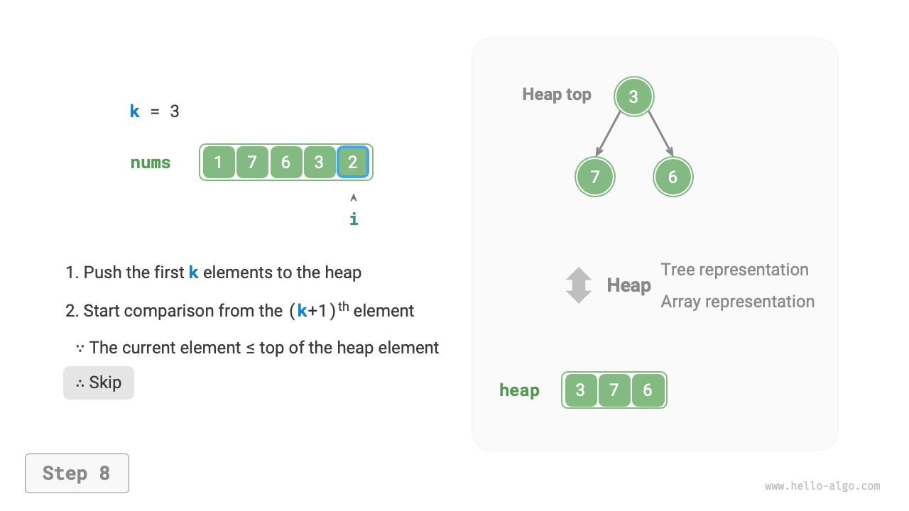{ class="animation-figure" }

=== "<9>"
    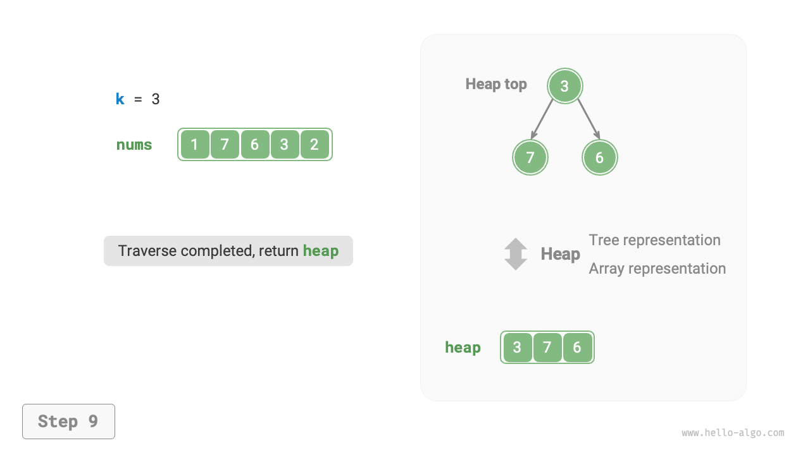{ class="animation-figure" }

<p align="center"> Hình 8-8 &nbsp; Tìm k phần tử lớn nhất dựa trên heap </p>

Mã ví dụ như sau:

=== "Python"

    ```python title="top_k.py"
    def top_k_heap(nums: list[int], k: int) -> list[int]:
        """Sử dụng heap để tìm k phần tử lớn nhất trong một array"""
        # Khởi tạo min heap
        heap = []
        # Chèn k phần tử đầu tiên của array vào heap
        for i in range(k):
            heapq.heappush(heap, nums[i])
        # Từ phần tử thứ k+1, duy trì độ dài của heap là k
        for i in range(k, len(nums)):
            # Nếu phần tử hiện tại lớn hơn phần tử trên cùng của heap,
            # hãy xóa phần tử trên cùng của heap và chèn phần tử hiện tại vào heap
            if nums[i] > heap[0]:
                heapq.heappop(heap)
                heapq.heappush(heap, nums[i])
        return heap
    ```

=== "C++"

    ```cpp title="top_k.cpp"
    /* Sử dụng heap để tìm k phần tử lớn nhất trong một array */
    priority_queue<int, vector<int>, greater<int>> topKHeap(vector<int> &nums, int k) {
        // Khởi tạo min-heap
        priority_queue<int, vector<int>, greater<int>> heap;
        // Chèn k phần tử đầu tiên của array vào heap
        for (int i = 0; i < k; i++) {
            heap.push(nums[i]);
        }
        // Từ phần tử thứ k+1, duy trì kích thước heap là k
        for (int i = k; i < nums.size(); i++) {
            // Nếu phần tử hiện tại lớn hơn phần tử đầu heap, xóa phần tử đầu heap và chèn phần tử hiện tại vào heap
            if (nums[i] > heap.top()) {
                heap.pop();
                heap.push(nums[i]);
            }
        }
        return heap;
    }
    ```

=== "Java"

    ```java title="top_k.java"
    /* Sử dụng heap để tìm k phần tử lớn nhất trong một array */
    Queue<Integer> topKHeap(int[] nums, int k) {
        // Khởi tạo min-heap
        Queue<Integer> heap = new PriorityQueue<Integer>();
        // Chèn k phần tử đầu tiên của array vào heap
        for (int i = 0; i < k; i++) {
            heap.offer(nums[i]);
        }
        // Từ phần tử thứ k+1, duy trì kích thước heap là k
        for (int i = k; i < nums.length; i++) {
            // Nếu phần tử hiện tại lớn hơn phần tử đầu heap, xóa phần tử đầu heap và chèn phần tử hiện tại vào heap
            if (nums[i] > heap.peek()) {
                heap.poll();
                heap.offer(nums[i]);
            }
        }
        return heap;
    }
    ```

=== "C#"

    ```csharp title="top_k.cs"
    [class]{top_k}-[func]{TopKHeap}
    ```

=== "Go"

    ```go title="top_k.go"
    [class]{}-[func]{topKHeap}
    ```

=== "Swift"

    ```swift title="top_k.swift"
    [class]{}-[func]{topKHeap}
    ```

=== "JS"

    ```javascript title="top_k.js"
    [class]{}-[func]{pushMinHeap}

    [class]{}-[func]{popMinHeap}

    [class]{}-[func]{peekMinHeap}

    [class]{}-[func]{getMinHeap}

    [class]{}-[func]{topKHeap}
    ```

=== "TS"

    ```typescript title="top_k.ts"
    [class]{}-[func]{pushMinHeap}

    [class]{}-[func]{popMinHeap}

    [class]{}-[func]{peekMinHeap}

    [class]{}-[func]{getMinHeap}

    [class]{}-[func]{topKHeap}
    ```

=== "Dart"

    ```dart title="top_k.dart"
    [class]{}-[func]{topKHeap}
    ```

=== "Rust"

    ```rust title="top_k.rs"
    [class]{}-[func]{top_k_heap}
    ```

=== "C"

    ```c title="top_k.c"
    [class]{}-[func]{pushMinHeap}

    [class]{}-[func]{popMinHeap}

    [class]{}-[func]{peekMinHeap}

    [class]{}-[func]{getMinHeap}

    [class]{}-[func]{topKHeap}
    ```

=== "Kotlin"

    ```kotlin title="top_k.kt"
    [class]{}-[func]{topKHeap}
    ```

=== "Ruby"

    ```ruby title="top_k.rb"
    [class]{}-[func]{top_k_heap}
    ```

=== "Zig"

    ```zig title="top_k.zig"
    [class]{}-[func]{topKHeap}
    ```

Tổng cộng có $n$ vòng thao tác chèn và xóa trên heap được thực hiện,
với kích thước heap tối đa là $k$, do đó time complexity là $O(n \log k)$.
Phương pháp này rất hiệu quả; khi $k$ nhỏ, time complexity tiệm cận
$O(n)$; khi $k$ lớn, time complexity sẽ không vượt quá $O(n \log n)$.

Ngoài ra, phương pháp này phù hợp với các kịch bản có luồng dữ liệu động.
Bằng cách liên tục thêm dữ liệu, chúng ta có thể duy trì các phần tử
bên trong heap, từ đó đạt được việc cập nhật động $k$ phần tử lớn nhất.
