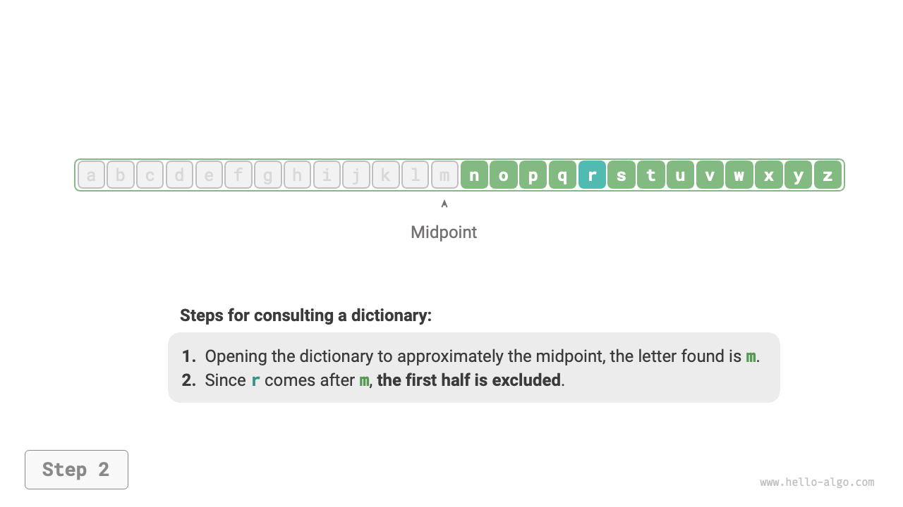
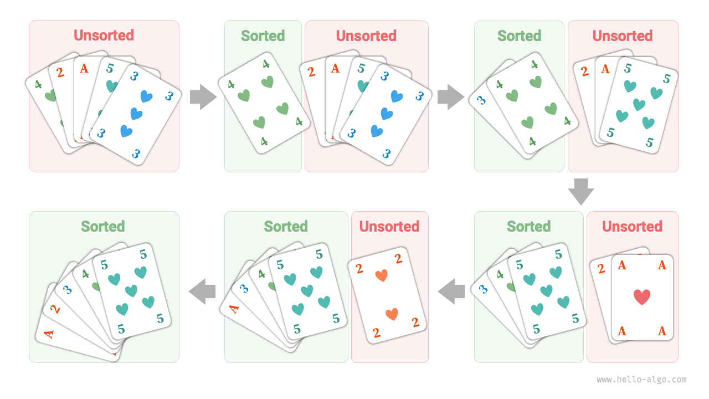

# Thuật toán ở khắp mọi nơi

Khi nghe đến thuật ngữ "thuật toán", chúng ta thường nghĩ ngay đến toán học. Tuy nhiên, nhiều thuật toán không liên quan đến toán học phức tạp mà dựa nhiều hơn vào logic cơ bản, điều này có thể thấy ở khắp nơi trong cuộc sống hàng ngày của chúng ta.

Trước khi bắt đầu thảo luận chính thức về thuật toán, có một sự thật thú vị đáng chia sẻ: **bạn đã vô thức học được nhiều thuật toán và quen với việc áp dụng chúng trong cuộc sống hàng ngày**. Ở đây, tôi sẽ đưa ra một vài ví dụ cụ thể để chứng minh điều này.

**Ví dụ 1: Tra từ điển**. Trong một cuốn từ điển tiếng Anh, các từ được sắp xếp theo thứ tự bảng chữ cái. Giả sử chúng ta đang tìm một từ bắt đầu bằng chữ $r$, thông thường sẽ làm như sau:

1. Mở từ điển ở khoảng giữa và kiểm tra từ đầu tiên của trang, giả sử từ đó bắt đầu bằng chữ $m$.
2. Vì $r$ đứng sau $m$ trong bảng chữ cái, nên có thể bỏ qua nửa đầu và thu hẹp phạm vi tìm kiếm xuống nửa sau.
3. Lặp lại bước `1.` và `2.` cho đến khi tìm được trang có từ bắt đầu bằng $r$.

=== "<1>"
    

=== "<2>"
    

=== "<3>"
    

=== "<4>"
    

=== "<5>"
    

Việc tra từ điển, một kỹ năng thiết yếu cho học sinh tiểu học, thực chất chính là thuật toán nổi tiếng "Tìm kiếm nhị phân". Xét về cấu trúc dữ liệu, chúng ta có thể coi từ điển như một "mảng" đã được sắp xếp; xét về thuật toán, chuỗi hành động để tìm một từ trong từ điển chính là thuật toán "Tìm kiếm nhị phân".

**Ví dụ 2: Sắp xếp bộ bài**. Khi chơi bài, chúng ta cần sắp xếp các lá bài trên tay theo thứ tự tăng dần, quá trình này như sau:

1. Chia bộ bài thành hai phần "đã sắp xếp" và "chưa sắp xếp", giả sử ban đầu lá bài ngoài cùng bên trái đã được sắp xếp.
2. Lấy một lá bài từ phần chưa sắp xếp và chèn vào vị trí thích hợp trong phần đã sắp xếp; sau đó, hai lá ngoài cùng bên trái đã được sắp xếp.
3. Lặp lại bước `2` cho đến khi tất cả các lá bài đều được sắp xếp.

Cách sắp xếp bài ở trên thực chất là thuật toán "Sắp xếp chèn" (Insertion Sort), rất hiệu quả với các bộ dữ liệu nhỏ. Nhiều hàm sắp xếp trong các ngôn ngữ lập trình cũng sử dụng thuật toán sắp xếp chèn.

**Ví dụ 3: Trả tiền thừa**. Giả sử bạn mua hàng hết $69$ tại siêu thị. Nếu bạn đưa cho thu ngân $100$, họ sẽ phải trả lại bạn $31$. Quá trình này có thể hiểu rõ qua hình minh họa dưới đây.

1. Các lựa chọn là các mệnh giá nhỏ hơn $31$, gồm $1$, $5$, $10$, và $20$.
2. Lấy tờ $20$ lớn nhất trong các lựa chọn, còn lại $31 - 20 = 11$.
3. Lấy tờ $10$ lớn nhất trong các lựa chọn còn lại, còn lại $11 - 10 = 1$.
4. Lấy tờ $1$ lớn nhất trong các lựa chọn còn lại, còn lại $1 - 1 = 0$.
5. Hoàn thành việc trả tiền thừa, kết quả là $20 + 10 + 1 = 31$.

Trong các bước trên, chúng ta luôn chọn phương án tốt nhất ở mỗi bước bằng cách lấy mệnh giá lớn nhất còn lại, giúp việc trả tiền thừa hiệu quả. Xét về cấu trúc dữ liệu và thuật toán, cách làm này được gọi là thuật toán "Tham lam" (Greedy).

Từ nấu ăn cho đến du hành vũ trụ, hầu như mọi vấn đề cần giải quyết đều liên quan đến thuật toán. Sự ra đời của máy tính cho phép chúng ta lưu trữ cấu trúc dữ liệu trong bộ nhớ và viết mã để gọi CPU, GPU thực thi các thuật toán. Nhờ vậy, chúng ta có thể chuyển các vấn đề thực tế vào máy tính và giải quyết nhiều vấn đề phức tạp một cách hiệu quả hơn.

!!! tip

    Nếu bạn vẫn còn bối rối về các khái niệm như cấu trúc dữ liệu, thuật toán, mảng, hay tìm kiếm nhị phân, hãy tiếp tục đọc. Cuốn sách này sẽ nhẹ nhàng dẫn dắt bạn vào thế giới của cấu trúc dữ liệu và thuật toán.

