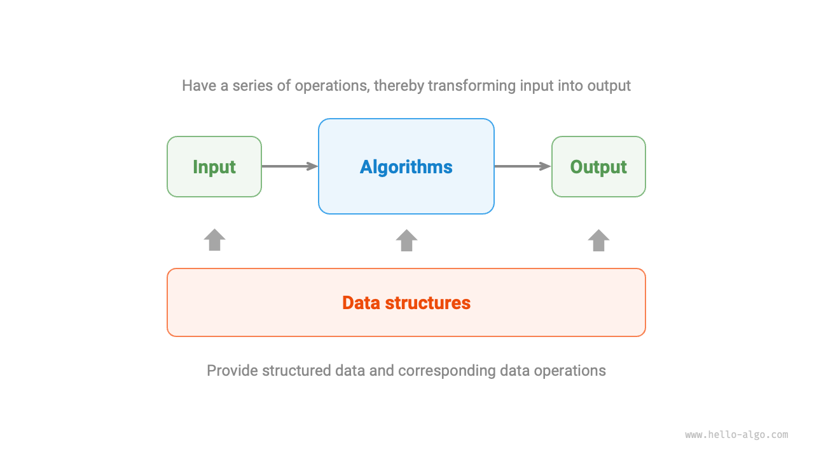

# Thuật toán là gì

## Định nghĩa về thuật toán

<u>Thuật toán</u> là một tập hợp các hướng dẫn hoặc bước để giải quyết một vấn đề cụ thể trong một khoảng thời gian hữu hạn. Thuật toán có các đặc điểm sau:

- Vấn đề được xác định rõ ràng, bao gồm định nghĩa rõ ràng về đầu vào và đầu ra.
- Thuật toán khả thi, nghĩa là có thể hoàn thành trong một số bước, thời gian và bộ nhớ hữu hạn.
- Mỗi bước đều có ý nghĩa rõ ràng. Kết quả đầu ra luôn giống nhau nếu đầu vào và điều kiện giống nhau.

## Định nghĩa về cấu trúc dữ liệu

<u>Cấu trúc dữ liệu</u> là cách tổ chức và lưu trữ dữ liệu trong máy tính, với các mục tiêu thiết kế sau:

- Giảm thiểu dung lượng bộ nhớ để tiết kiệm tài nguyên máy tính.
- Làm cho các thao tác với dữ liệu nhanh nhất có thể, bao gồm truy cập, thêm, xóa, cập nhật dữ liệu, v.v.
- Cung cấp cách biểu diễn dữ liệu ngắn gọn và thông tin logic để thuật toán hoạt động hiệu quả.

**Thiết kế cấu trúc dữ liệu là một quá trình cân bằng, thường phải đánh đổi**. Nếu muốn cải thiện một mặt nào đó, thường phải chấp nhận hy sinh mặt khác. Ví dụ:

- So với mảng, danh sách liên kết thuận tiện hơn khi thêm hoặc xóa dữ liệu nhưng lại chậm hơn khi truy cập dữ liệu.
- So với danh sách liên kết, đồ thị cung cấp thông tin logic phong phú hơn nhưng lại tốn nhiều bộ nhớ hơn.

## Mối quan hệ giữa cấu trúc dữ liệu và thuật toán

Như hình dưới đây, cấu trúc dữ liệu và thuật toán có mối liên hệ chặt chẽ, cụ thể ở ba điểm sau:

- Cấu trúc dữ liệu là nền tảng của thuật toán. Chúng cung cấp cách lưu trữ dữ liệu có tổ chức và các phương thức thao tác dữ liệu cho thuật toán.
- Thuật toán mang lại sức sống cho cấu trúc dữ liệu. Nếu chỉ có cấu trúc dữ liệu thì chỉ lưu trữ thông tin, nhờ có thuật toán mới giải quyết được các vấn đề cụ thể.
- Một thuật toán có thể được cài đặt dựa trên nhiều cấu trúc dữ liệu khác nhau, nhưng hiệu suất thực thi có thể khác biệt rất lớn. Việc chọn đúng cấu trúc dữ liệu là chìa khóa.

Cấu trúc dữ liệu và thuật toán có thể được ví như một bộ xếp hình, như hình minh họa dưới đây. Một bộ xếp hình gồm nhiều mảnh ghép, kèm theo hướng dẫn lắp ráp chi tiết. Làm theo từng bước hướng dẫn, chúng ta có thể lắp thành một mô hình phức tạp.

Bảng dưới đây cho thấy sự tương ứng chi tiết giữa hai khái niệm này.

 Bảng <id> &nbsp; So sánh cấu trúc dữ liệu và thuật toán với bộ xếp hình 

| Cấu trúc dữ liệu và thuật toán | Bộ xếp hình                                                      |
| ------------------------------ | ----------------------------------------------------------------- |
| Dữ liệu đầu vào                | Các mảnh ghép chưa lắp ráp                                        |
| Cấu trúc dữ liệu               | Cách tổ chức các mảnh ghép, gồm hình dạng, kích thước, kết nối... |
| Thuật toán                     | Chuỗi các bước lắp ráp các mảnh thành hình mong muốn              |
| Dữ liệu đầu ra                 | Mô hình xếp hình hoàn chỉnh                                       |

Lưu ý rằng cấu trúc dữ liệu và thuật toán không phụ thuộc vào ngôn ngữ lập trình. Vì vậy, cuốn sách này có thể cung cấp các ví dụ cài đặt bằng nhiều ngôn ngữ lập trình khác nhau.

!!! tip "Viết tắt thông dụng"

    Trong thực tế, chúng ta thường gọi "Cấu trúc dữ liệu và Thuật toán" đơn giản là "Thuật toán". Ví dụ, các bài toán thuật toán nổi tiếng trên LeetCode thực chất kiểm tra cả kiến thức về cấu trúc dữ liệu lẫn thuật toán.

