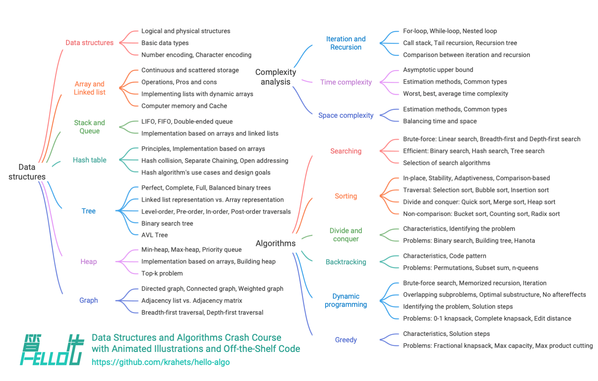

# Về cuốn sách này

Dự án mã nguồn mở này nhằm tạo ra một khóa học cấp tốc miễn phí, thân thiện với người mới bắt đầu về cấu trúc dữ liệu và thuật toán.

- Minh họa động, nội dung dễ hiểu và lộ trình học mượt mà giúp người mới khám phá "bản đồ tri thức" về cấu trúc dữ liệu và thuật toán.
- Chạy mã chỉ với một cú nhấp chuột, giúp người đọc nâng cao kỹ năng lập trình và hiểu nguyên lý hoạt động của thuật toán cũng như cách triển khai cấu trúc dữ liệu bên dưới.
- Khuyến khích học tập qua việc giảng dạy, hãy thoải mái đặt câu hỏi và chia sẻ ý kiến. Cùng nhau phát triển thông qua thảo luận.

## Đối tượng độc giả

Nếu bạn là người mới làm quen với thuật toán, hoặc đã có chút kinh nghiệm nhưng chỉ hiểu mơ hồ về cấu trúc dữ liệu và thuật toán, thường xuyên dao động giữa "hiểu rồi" và "chưa rõ lắm", thì cuốn sách này dành cho bạn!

Nếu bạn đã có kinh nghiệm giải bài tập, quen thuộc với hầu hết các dạng bài, cuốn sách này sẽ giúp bạn ôn tập và hệ thống lại kiến thức thuật toán. Mã nguồn trong kho lưu trữ có thể dùng như "bộ công cụ giải bài" hoặc "bảng gian lận thuật toán".

Nếu bạn là chuyên gia thuật toán, chúng tôi rất mong nhận được góp ý quý báu từ bạn, hoặc [tham gia cùng chúng tôi](https://www.hello-algo.com/chapter_appendix/contribution/).

!!! success "Yêu cầu nền tảng"

    Bạn nên biết cách đọc và viết mã đơn giản bằng ít nhất một ngôn ngữ lập trình.

## Cấu trúc nội dung

Nội dung chính của sách được thể hiện trong hình dưới đây.

- **Phân tích độ phức tạp**: tìm hiểu các khía cạnh và phương pháp đánh giá cấu trúc dữ liệu và thuật toán. Bao gồm cách xác định độ phức tạp thời gian và không gian, các loại phổ biến và ví dụ minh họa.
- **Cấu trúc dữ liệu**: tập trung vào các kiểu dữ liệu cơ bản, phương pháp phân loại, định nghĩa, ưu nhược điểm, thao tác thường gặp, các loại, ứng dụng và cách triển khai các cấu trúc như mảng, danh sách liên kết, ngăn xếp, hàng đợi, bảng băm, cây, heap, đồ thị, v.v.
- **Thuật toán**: định nghĩa thuật toán, bàn về ưu nhược điểm, hiệu quả, tình huống áp dụng, các bước giải quyết vấn đề, kèm ví dụ về các thuật toán như tìm kiếm, sắp xếp, chia để trị, quay lui, lập trình động, tham lam và nhiều hơn nữa.

## Lời cảm ơn

Cuốn sách này không ngừng được hoàn thiện nhờ sự đóng góp chung của nhiều thành viên cộng đồng mã nguồn mở. Xin cảm ơn từng tác giả đã dành thời gian và tâm huyết, được liệt kê theo thứ tự trên GitHub: krahets, coderonion, Gonglja, nuomi1, Reanon, justin-tse, hpstory, danielsss, curtishd, night-cruise, S-N-O-R-L-A-X, msk397, gvenusleo, khoaxuantu, RiverTwilight, rongyi, gyt95, zhuoqinyue, K3v123, Zuoxun, mingXta, hello-ikun, FangYuan33, GN-Yu, yuelinxin, longsizhuo, Cathay-Chen, guowei-gong, xBLACKICEx, IsChristina, JoseHung, qualifier1024, QiLOL, pengchzn, Guanngxu, L-Super, WSL0809, Slone123c, lhxsm, yuan0221, what-is-me, theNefelibatas, longranger2, cy-by-side, xiongsp, JeffersonHuang, Transmigration-zhou, magentaqin, Wonderdch, malone6, xiaomiusa87, gaofer, bluebean-cloud, a16su, Shyam-Chen, nanlei, hongyun-robot, Phoenix0415, MolDuM, Nigh, he-weilai, junminhong, mgisr, iron-irax, yd-j, XiaChuerwu, XC-Zero, seven1240, SamJin98, wodray, reeswell, NI-SW, Horbin-Magician, Enlightenus, xjr7670, YangXuanyi, DullSword, boloboloda, iStig, qq909244296, jiaxianhua, wenjianmin, keshida, kilikilikid, lclc6, lwbaptx, liuxjerry, lucaswangdev, lyl625760, hts0000, gledfish, fbigm, echo1937, szu17dmy, dshlstarr, Yucao-cy, coderlef, czruby, bongbongbakudan, beintentional, ZongYangL, ZhongYuuu, luluxia, xb534, bitsmi, ElaBosak233, baagod, zhouLion, yishangzhang, yi427, yabo083, weibk, wangwang105, th1nk3r-ing, tao363, 4yDX3906, syd168, steventimes, sslmj2020, smilelsb, siqyka, selear, sdshaoda, Xi-Row, popozhu, nuquist19, noobcodemaker, XiaoK29, chadyi, ZhongGuanbin, shanghai-Jerry, JackYang-hellobobo, Javesun99, lipusheng, BlindTerran, ShiMaRing, FreddieLi, FloranceYeh, iFleey, fanchenggang, gltianwen, goerll, Dr-XYZ, nedchu, curly210102, CuB3y0nd, KraHsu, CarrotDLaw, youshaoXG, bubble9um, fanenr, eagleanurag, LifeGoesOnionOnionOnion, 52coder, foursevenlove, KorsChen, hezhizhen, linzeyan, ZJKung, GaochaoZhu, hopkings2008, yang-le, Evilrabbit520, Turing-1024-Lee, thomasq0, Suremotoo, Allen-Scai, Risuntsy, Richard-Zhang1019, qingpeng9802, primexiao, nidhoggfgg, 1ch0, MwumLi, martinx, ZnYang2018, hugtyftg, logan-qiu, psychelzh, Keynman, KeiichiKasai và 0130w.

Công việc kiểm tra mã nguồn cho cuốn sách này được thực hiện bởi coderonion, Gonglja, gvenusleo, hpstory, justin‐tse, khoaxuantu, krahets, night-cruise, nuomi1, Reanon và rongyi (liệt kê theo thứ tự bảng chữ cái). Xin cảm ơn họ đã dành thời gian và công sức, đảm bảo mã nguồn các ngôn ngữ được chuẩn hóa và đồng nhất.

Phiên bản tiếng Trung Phồn thể được kiểm duyệt bởi Shyam-Chen và Dr-XYZ, còn bản tiếng Anh do yuelinxin, K3v123, QiLOL, Phoenix0415, SamJin98, yanedie, RafaelCaso, pengchzn, thomasq0 và magentaqin thực hiện. Nhờ sự đóng góp liên tục của họ, cuốn sách này mới có thể tiếp cận và phục vụ nhiều độc giả hơn.

Trong quá trình biên soạn, rất nhiều cá nhân đã hỗ trợ vô giá, bao gồm nhưng không giới hạn:

- Cảm ơn người thầy tại công ty, Tiến sĩ Xi Li, đã động viên tôi trong một cuộc trò chuyện rằng "hãy bắt đầu thật nhanh", giúp tôi quyết tâm viết cuốn sách này;
- Cảm ơn bạn gái Bubble, độc giả đầu tiên của sách, đã góp ý nhiều từ góc nhìn người mới học thuật toán, giúp sách phù hợp hơn với người mới;
- Cảm ơn Tengbao, Qibao và Feibao đã nghĩ ra tên sách sáng tạo, gợi nhớ kỷ niệm viết dòng code đầu tiên "Hello World!";
- Cảm ơn Xiaoquan đã hỗ trợ chuyên môn về sở hữu trí tuệ, đóng vai trò quan trọng trong phát triển sách mã nguồn mở này;
- Cảm ơn Sutong đã thiết kế bìa và logo đẹp mắt, kiên nhẫn chỉnh sửa nhiều lần theo yêu cầu của tôi;
- Cảm ơn @squidfunk đã góp ý về cách viết, trình bày và phát triển chủ đề tài liệu mã nguồn mở [Material-for-MkDocs](https://github.com/squidfunk/mkdocs-material/tree/master).

Trong quá trình viết, tôi đã tham khảo nhiều sách giáo trình và bài viết về cấu trúc dữ liệu và thuật toán. Những tài liệu này là tấm gương mẫu mực, giúp đảm bảo độ chính xác và chất lượng nội dung sách. Xin cảm ơn tất cả những người đi trước vì đóng góp quý báu!

Cuốn sách này khuyến khích kết hợp học thực hành và tư duy, lấy cảm hứng từ ["Dive into Deep Learning"](https://github.com/d2l-ai/d2l-en). Tôi rất khuyến khích các bạn đọc cuốn sách tuyệt vời này.

**Xin gửi lời cảm ơn sâu sắc tới cha mẹ tôi, những người luôn ủng hộ và động viên để tôi có thể làm công việc thú vị này**.
