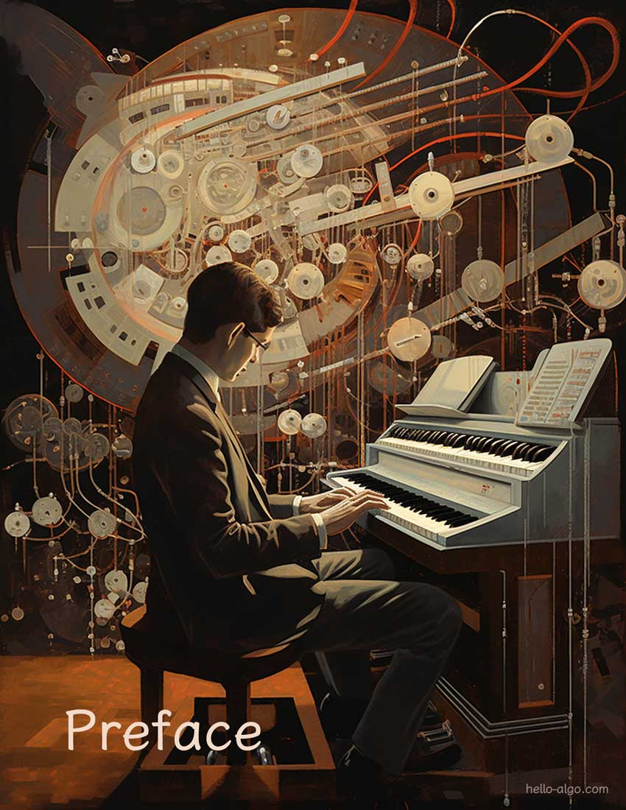

# Lời Mở Đầu

!!! abstract

    Thuật toán giống như một bản giao hưởng đẹp đẽ, với mỗi dòng mã chảy như một nhịp điệu.
   
    Mong rằng cuốn sách này sẽ vang vọng nhẹ nhàng trong tâm trí bạn, để lại một giai điệu độc đáo và sâu sắc.

