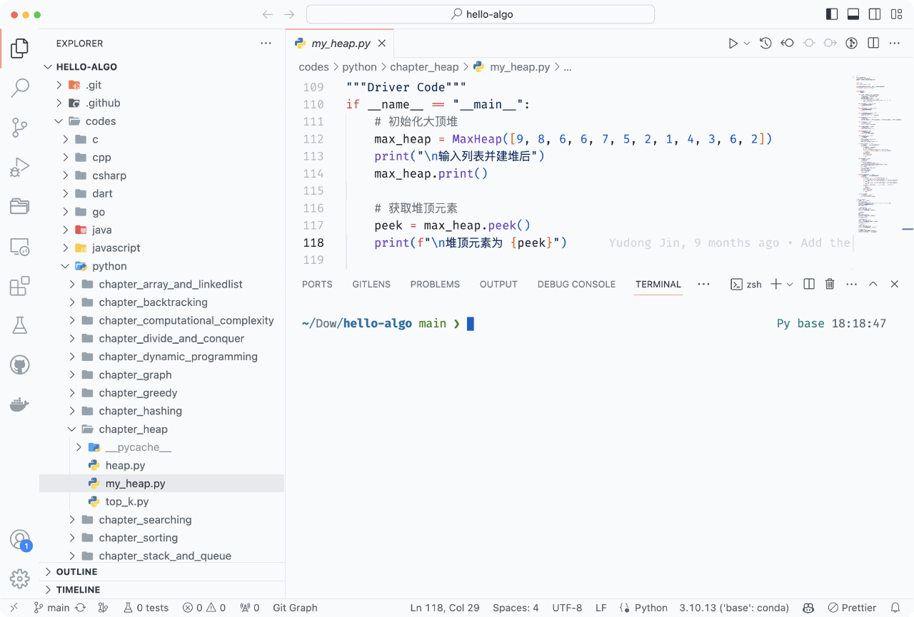
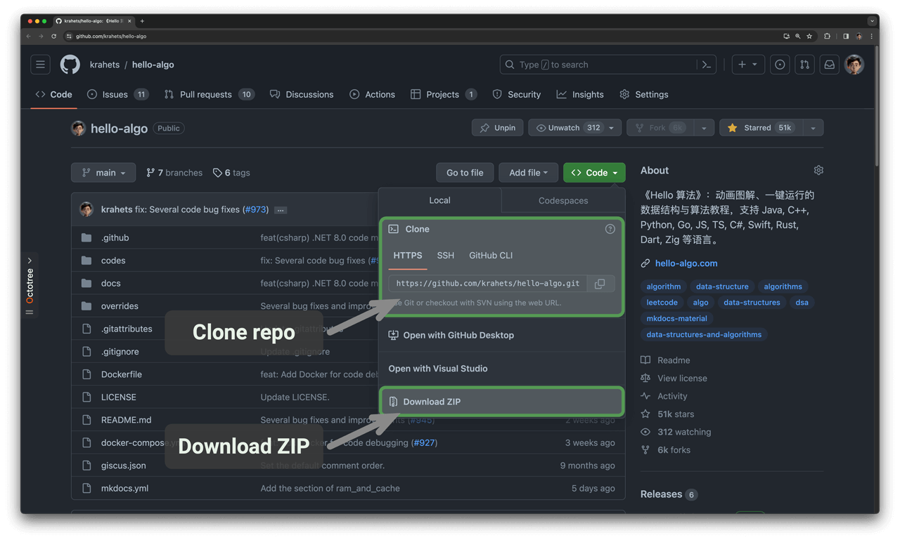

# Cách đọc sách

!!! tip

    Để có trải nghiệm đọc tốt nhất, bạn nên đọc kỹ phần này.

## Quy ước viết

- Các chương có dấu '*' sau tiêu đề là tùy chọn và chứa nội dung tương đối khó. Nếu bạn không có nhiều thời gian, nên bỏ qua các chương này.
- Các thuật ngữ kỹ thuật sẽ được in đậm (trong bản in và PDF) hoặc gạch chân (trên bản web), ví dụ: <u>mảng</u>. Bạn nên làm quen với các thuật ngữ này để hiểu tốt hơn các văn bản kỹ thuật.
- **Chữ in đậm** chỉ ra nội dung chính hoặc các câu tóm tắt, cần chú ý đặc biệt.
- Các từ và cụm từ có ý nghĩa đặc biệt sẽ được đặt trong “dấu ngoặc kép” để tránh nhầm lẫn.
- Đối với các thuật ngữ không nhất quán giữa các ngôn ngữ lập trình, sách này sẽ theo Python, ví dụ dùng `None` để chỉ `null`.
- Sách này phần nào bỏ qua quy ước chú thích của các ngôn ngữ lập trình để trình bày nội dung gọn gàng hơn. Các chú thích chủ yếu gồm ba loại: chú thích tiêu đề, chú thích nội dung và chú thích nhiều dòng.

=== "Python"

    ```python title=""
    """Chú thích tiêu đề để ghi chú hàm, lớp, ví dụ kiểm thử, v.v."""
   
    # Chú thích giải thích chi tiết
   
    """
    Chú thích
    nhiều dòng
    """
    ```

=== "C++"

    ```cpp title=""
    /* Chú thích tiêu đề để ghi chú hàm, lớp, ví dụ kiểm thử, v.v. */
   
    // Chú thích giải thích chi tiết.
   
    /**
     * Chú thích
     * nhiều dòng
     */
    ```

=== "Java"

    ```java title=""
    /* Chú thích tiêu đề để ghi chú hàm, lớp, ví dụ kiểm thử, v.v. */
   
    // Chú thích giải thích chi tiết.
   
    /**
     * Chú thích
     * nhiều dòng
     */
    ```

=== "C#"

    ```csharp title=""
    /* Chú thích tiêu đề để ghi chú hàm, lớp, ví dụ kiểm thử, v.v. */
   
    // Chú thích giải thích chi tiết.
   
    /**
     * Chú thích
     * nhiều dòng
     */
    ```

=== "Go"

    ```go title=""
    /* Chú thích tiêu đề để ghi chú hàm, lớp, ví dụ kiểm thử, v.v. */
   
    // Chú thích giải thích chi tiết.
   
    /**
     * Chú thích
     * nhiều dòng
     */
    ```

=== "Swift"

    ```swift title=""
    /* Chú thích tiêu đề để ghi chú hàm, lớp, ví dụ kiểm thử, v.v. */
   
    // Chú thích giải thích chi tiết.
   
    /**
     * Chú thích
     * nhiều dòng
     */
    ```

=== "JS"

    ```javascript title=""
    /* Chú thích tiêu đề để ghi chú hàm, lớp, ví dụ kiểm thử, v.v. */
   
    // Chú thích giải thích chi tiết.
   
    /**
     * Chú thích
     * nhiều dòng
     */
    ```

=== "TS"

    ```typescript title=""
    /* Chú thích tiêu đề để ghi chú hàm, lớp, ví dụ kiểm thử, v.v. */
   
    // Chú thích giải thích chi tiết.
   
    /**
     * Chú thích
     * nhiều dòng
     */
    ```

=== "Dart"

    ```dart title=""
    /* Chú thích tiêu đề để ghi chú hàm, lớp, ví dụ kiểm thử, v.v. */
   
    // Chú thích giải thích chi tiết.
   
    /**
     * Chú thích
     * nhiều dòng
     */
    ```

=== "Rust"

    ```rust title=""
    /* Chú thích tiêu đề để ghi chú hàm, lớp, ví dụ kiểm thử, v.v. */

    // Chú thích giải thích chi tiết.
   
    /**
     * Chú thích
     * nhiều dòng
     */
    ```

=== "C"

    ```c title=""
    /* Chú thích tiêu đề để ghi chú hàm, lớp, ví dụ kiểm thử, v.v. */
   
    // Chú thích giải thích chi tiết.
   
    /**
     * Chú thích
     * nhiều dòng
     */
    ```

=== "Kotlin"

    ```kotlin title=""
    /* Chú thích tiêu đề để ghi chú hàm, lớp, ví dụ kiểm thử, v.v. */
   
    // Chú thích giải thích chi tiết.
   
    /**
     * Chú thích
     * nhiều dòng
     */
    ```

=== "Zig"

    ```zig title=""
    // Chú thích tiêu đề để ghi chú hàm, lớp, ví dụ kiểm thử, v.v.
   
    // Chú thích giải thích chi tiết.
   
    // Chú thích
    // nhiều dòng
    ```

## Học hiệu quả qua hình minh họa động

So với văn bản, video và hình ảnh có mật độ thông tin cao hơn và cấu trúc rõ ràng hơn, giúp dễ hiểu hơn. Trong sách này, **các khái niệm quan trọng và khó chủ yếu được trình bày qua hoạt hình và hình minh họa**, còn văn bản chỉ để giải thích và bổ sung.

Khi gặp nội dung có hoạt hình hoặc hình minh họa như hình dưới, **hãy ưu tiên hiểu hình, văn bản chỉ để bổ sung**, kết hợp cả hai để hiểu toàn diện.


## Hiểu sâu hơn qua thực hành lập trình

Mã nguồn của sách được lưu trữ tại [GitHub Repository](https://github.com/krahets/hello-algo). Như hình dưới, **mã nguồn có sẵn ví dụ kiểm thử và có thể chạy chỉ với một cú nhấp chuột**.

Nếu có thời gian, **bạn nên tự gõ lại mã nguồn**. Nếu không có nhiều thời gian, ít nhất hãy đọc và chạy tất cả các đoạn mã.

So với chỉ đọc mã, việc tự viết mã sẽ giúp bạn học được nhiều hơn. **Học bằng cách làm là cách học thực sự.**



Thiết lập để chạy mã nguồn gồm ba bước chính.

**Bước 1: Cài đặt môi trường lập trình trên máy**. Làm theo [hướng dẫn](https://www.hello-algo.com/chapter_appendix/installation/) ở phần phụ lục để cài đặt, hoặc bỏ qua nếu đã cài rồi.

**Bước 2: Tải về hoặc sao chép kho mã nguồn**. Truy cập [GitHub Repository](https://github.com/krahets/hello-algo).

Nếu đã cài [Git](https://git-scm.com/downloads), dùng lệnh sau để sao chép kho mã:

```shell
git clone https://github.com/krahets/hello-algo.git
```

Hoặc bạn cũng có thể nhấn nút "Download ZIP" như hình dưới để tải mã nguồn về dưới dạng file ZIP nén. Sau đó chỉ cần giải nén ra máy tính.



**Bước 3: Chạy mã nguồn**. Như hình dưới, với khối mã có tên file ở đầu, bạn có thể tìm file mã nguồn tương ứng trong thư mục `codes` của kho mã. Các file này có thể chạy chỉ với một cú nhấp chuột, giúp bạn tiết kiệm thời gian sửa lỗi và tập trung vào việc học.


## Học cùng nhau qua thảo luận

Khi đọc sách, đừng bỏ qua những điểm bạn chưa hiểu. **Hãy thoải mái đặt câu hỏi ở phần bình luận**. Chúng tôi rất sẵn lòng trả lời và thường phản hồi trong vòng hai ngày.

Như hình dưới, mỗi chương đều có phần bình luận ở cuối. Hãy chú ý đến các bình luận này. Chúng không chỉ giúp bạn biết thêm các vấn đề mà người khác gặp phải, giúp phát hiện lỗ hổng kiến thức và suy nghĩ sâu hơn, mà còn là nơi bạn có thể đóng góp bằng cách trả lời câu hỏi, chia sẻ kinh nghiệm và cùng nhau tiến bộ.


## Lộ trình học thuật toán

Nhìn chung, quá trình làm chủ cấu trúc dữ liệu và thuật toán có thể chia thành ba giai đoạn:

1. **Giai đoạn 1: Nhập môn thuật toán**. Bạn cần làm quen với đặc điểm và cách dùng các cấu trúc dữ liệu, tìm hiểu nguyên lý, quy trình, ứng dụng và hiệu quả của các thuật toán khác nhau.
2. **Giai đoạn 2: Luyện tập giải bài thuật toán**. Nên bắt đầu từ các bài phổ biến như [Sword for Offer](https://leetcode.cn/studyplan/coding-interviews/) và [LeetCode Hot 100](https://leetcode.cn/studyplan/top-100- liked/), tích lũy ít nhất 100 bài để quen với các dạng bài thuật toán chính. Khi mới luyện tập, bạn có thể hay quên, nhưng đó là điều bình thường. Hãy ôn lại theo "Đường cong quên lãng Ebbinghaus", thường sau 3~5 lần lặp lại sẽ nhớ được.
3. **Giai đoạn 3: Xây dựng hệ thống kiến thức**. Về học lý thuyết, bạn có thể đọc các bài viết chuyên đề, khung giải pháp, sách giáo trình để làm giàu hệ thống kiến thức. Về luyện tập, bạn có thể thử các chiến lược nâng cao như phân loại theo chủ đề, nhiều cách giải cho một bài, hoặc một cách giải cho nhiều bài, v.v. Có thể tìm hiểu thêm các chiến lược này trong các cộng đồng.

Như hình dưới, sách này chủ yếu bao quát “Giai đoạn 1”, giúp bạn bắt đầu hiệu quả hơn cho Giai đoạn 2 và 3.


