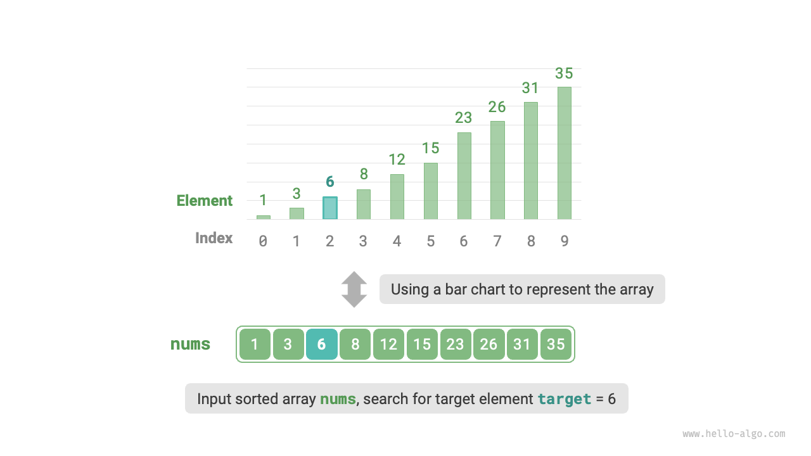
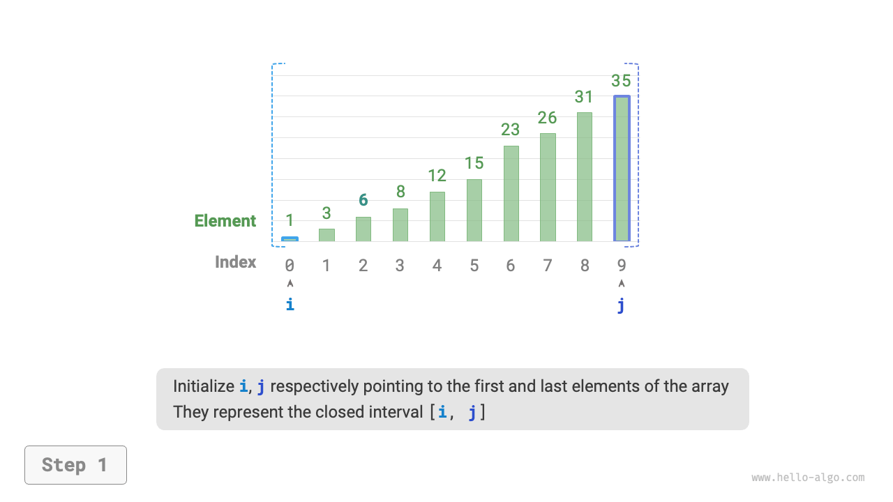
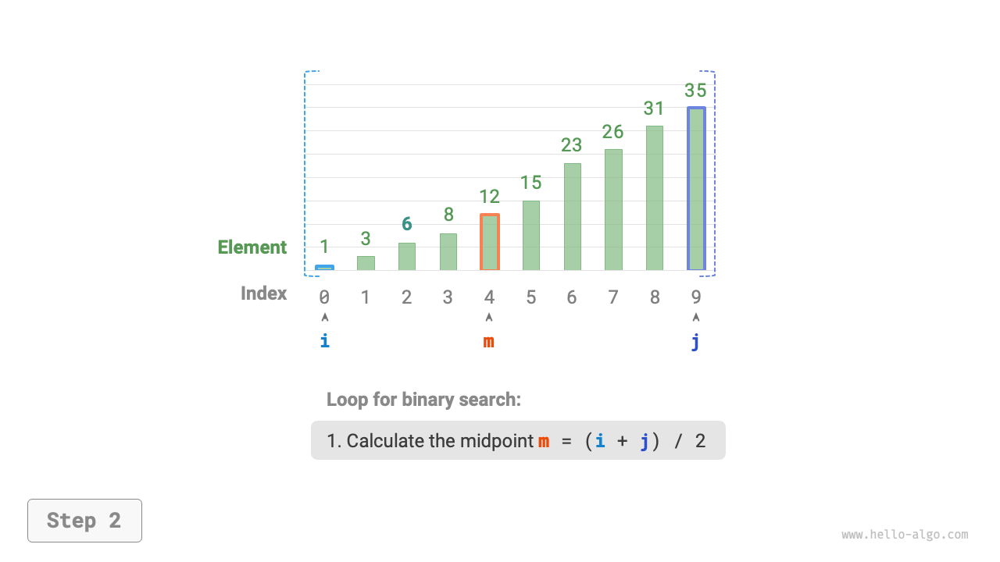
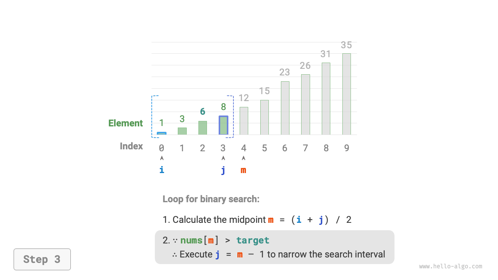
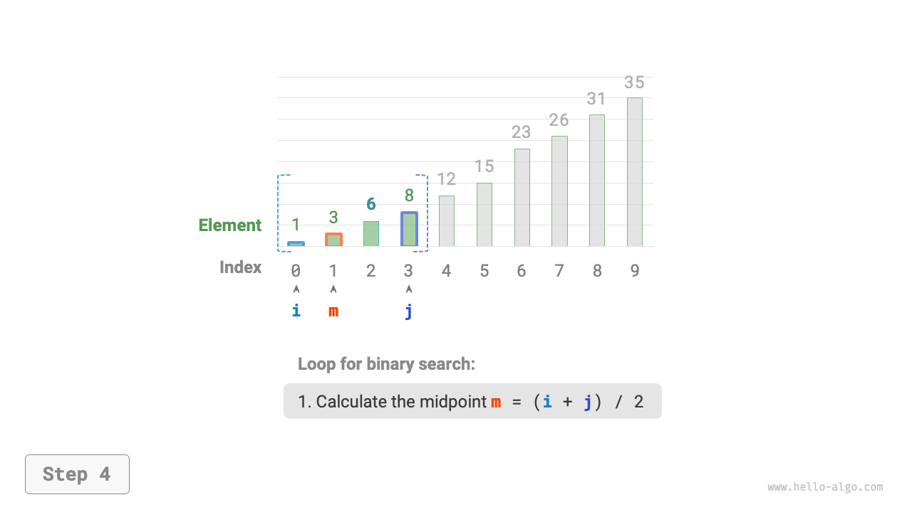
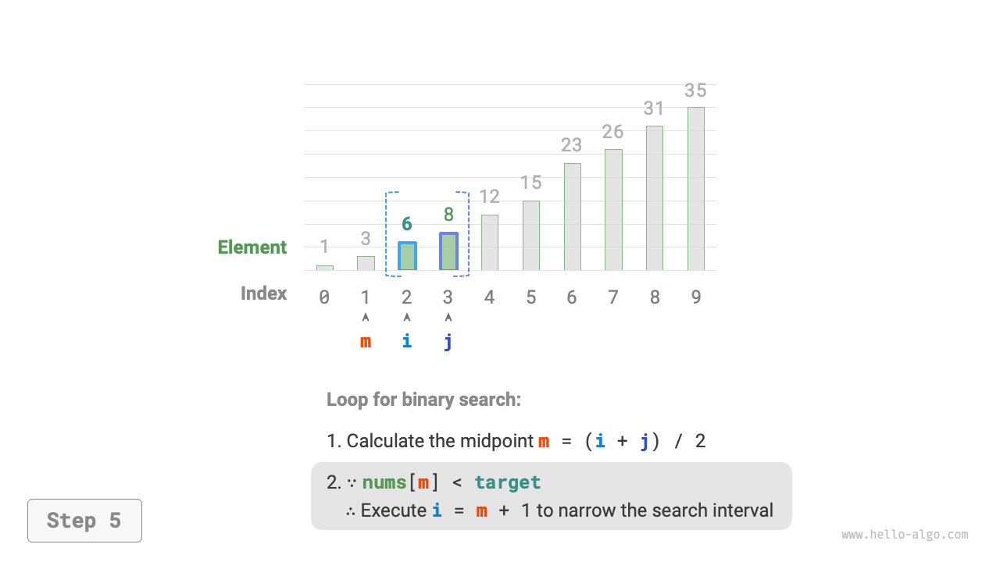
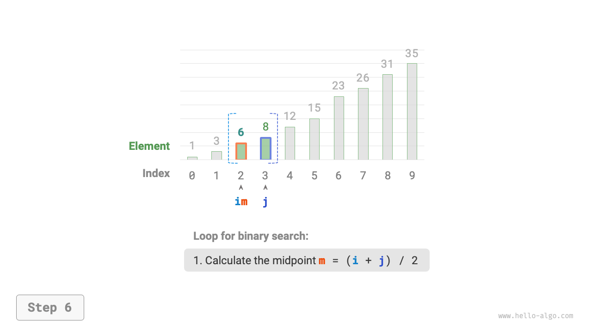
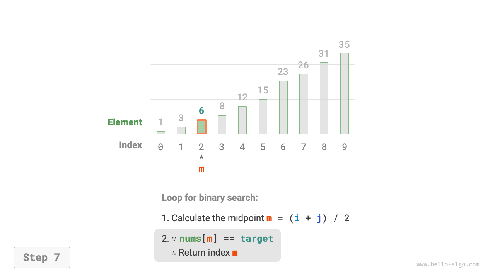
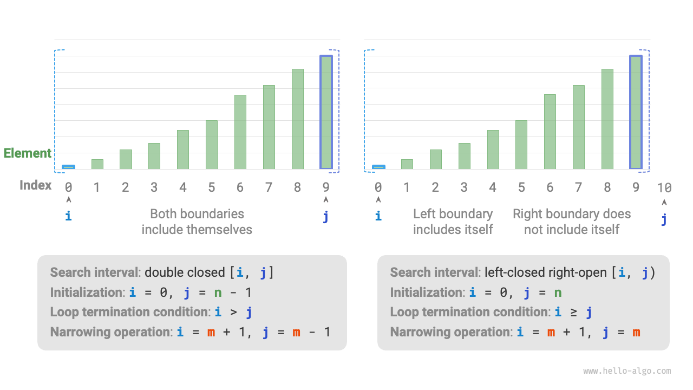

# 10.1 &nbsp; Binary search

<u>Binary search</u> là một thuật toán tìm kiếm hiệu quả sử dụng chiến lược
chia để trị. Nó tận dụng thứ tự đã sắp xếp của các phần tử trong một array
(mảng) bằng cách giảm một nửa khoảng tìm kiếm trong mỗi iteration (vòng lặp),
tiếp tục cho đến khi tìm thấy phần tử mục tiêu hoặc khoảng tìm kiếm trở nên rỗng.

!!! question

    Cho một array `nums` có độ dài $n$, trong đó các phần tử được sắp xếp theo
    thứ tự tăng dần mà không có các phần tử trùng lặp. Hãy tìm và trả về chỉ số
    của phần tử `target` trong array này. Nếu array không chứa phần tử, hãy
    trả về $-1$. Một ví dụ được thể hiện trong Hình 10-1.

{ class="animation-figure" }

<p align="center"> Hình 10-1 &nbsp; Dữ liệu ví dụ về Binary search </p>

Như được thể hiện trong Hình 10-2, đầu tiên chúng ta khởi tạo các con trỏ
(pointer) với $i = 0$ và $j = n - 1$, lần lượt trỏ đến phần tử đầu tiên và
cuối cùng của array. Chúng cũng đại diện cho toàn bộ khoảng tìm kiếm $[0, n - 1]$.
Bạn hãy lưu ý rằng dấu ngoặc vuông biểu thị một khoảng đóng, bao gồm cả các
giá trị biên.

Sau đó, hai bước sau đây có thể được thực hiện trong một loop (vòng lặp).

1. Tính chỉ số (index) điểm giữa $m = \lfloor {(i + j) / 2} \rfloor$, trong
    đó $\lfloor \: \rfloor$ biểu thị phép toán làm tròn xuống.
2. Dựa trên sự so sánh giữa giá trị của `nums[m]` và `target`, một trong ba
    trường hợp sau đây sẽ được chọn để thực thi.
    1. Nếu `nums[m] < target`, điều này cho thấy `target` nằm trong khoảng
        $[m + 1, j]$, do đó đặt $i = m + 1$.
    2. Nếu `nums[m] > target`, điều này cho thấy `target` nằm trong khoảng
        $[i, m - 1]$, do đó đặt $j = m - 1$.
    3. Nếu `nums[m] = target`, điều này cho thấy `target` đã được tìm thấy,
        do đó trả về chỉ số $m$.

Nếu array không chứa phần tử mục tiêu, khoảng tìm kiếm cuối cùng sẽ trở nên
rỗng, kết thúc bằng việc trả về $-1$.

=== "<1>"
    { class="animation-figure" }

=== "<2>"
    { class="animation-figure" }

=== "<3>"
    { class="animation-figure" }

=== "<4>"
    { class="animation-figure" }

=== "<5>"
    { class="animation-figure" }

=== "<6>"
    { class="animation-figure" }

=== "<7>"
    { class="animation-figure" }

<p align="center"> Hình 10-2 &nbsp; Quá trình Binary search </p>

Điều đáng chú ý là vì $i$ và $j$ đều có kiểu `int`, **$i + j$ có thể vượt
quá phạm vi của kiểu `int`**. Để tránh tràn số lớn, chúng ta thường sử dụng
công thức $m = \lfloor {i + (j - i) / 2} \rfloor$ để tính điểm giữa.

Mã code như sau:

=== "Python"

    ```python title="binary_search.py"
    def binary_search(nums: list[int], target: int) -> int:
        """Binary search (khoảng đóng hai đầu)"""
        # Khởi tạo khoảng đóng hai đầu [0, n-1], tức là i, j trỏ đến phần tử
        # đầu tiên và phần tử cuối cùng của array tương ứng
        i, j = 0, len(nums) - 1
        # Lặp cho đến khi khoảng tìm kiếm rỗng (khi i > j thì rỗng)
        while i <= j:
            # Về lý thuyết, các số trong Python có thể lớn vô hạn (tùy thuộc vào kích thước
            # bộ nhớ), nên không cần xem xét tràn số lớn
            m = i + (j - i) // 2  # Tính chỉ số điểm giữa m
            if nums[m] < target:
                i = m + 1  # Tình huống này cho thấy target nằm trong khoảng [m+1, j]
            elif nums[m] > target:
                j = m - 1  # Tình huống này cho thấy target nằm trong khoảng [i, m-1]
            else:
                return m  # Tìm thấy phần tử target, trả về chỉ số của nó
        return -1  # Không tìm thấy phần tử target, trả về -1
    ```

=== "C++"

    ```cpp title="binary_search.cpp"
    /* Binary search (khoảng đóng hai đầu) */
    int binarySearch(vector<int> &nums, int target) {
        // Khởi tạo khoảng đóng hai đầu [0, n-1], tức là i, j trỏ đến phần tử
        // đầu tiên và phần tử cuối cùng của array tương ứng
        int i = 0, j = nums.size() - 1;
        // Lặp cho đến khi khoảng tìm kiếm rỗng (khi i > j thì rỗng)
        while (i <= j) {
            int m = i + (j - i) / 2; // Tính chỉ số điểm giữa m
            if (nums[m] < target)    // Tình huống này cho thấy target nằm trong khoảng [m+1, j]
                i = m + 1;
            else if (nums[m] > target) // Tình huống này cho thấy target nằm trong khoảng [i, m-1]
                j = m - 1;
            else // Tìm thấy phần tử target, trả về chỉ số của nó
                return m;
        }
        // Không tìm thấy phần tử target, trả về -1
        return -1;
    }
    ```

=== "Java"

    ```java title="binary_search.java"
    /* binary search (khoảng đóng hai phía) */
    int binarySearch(int[] nums, int target) {
        // Khởi tạo khoảng đóng hai phía [0, n-1], tức là i, j lần lượt trỏ đến phần tử
        // đầu tiên và phần tử cuối cùng của array.
        int i = 0, j = nums.length - 1;
        // Lặp cho đến khi khoảng tìm kiếm rỗng (khi i > j, nó rỗng)
        while (i <= j) {
            int m = i + (j - i) / 2; // Tính chỉ số điểm giữa m
            if (nums[m] < target) // Tình huống này cho thấy target nằm trong khoảng [m+1, j]
                i = m + 1;
            else if (nums[m] > target) // Tình huống này cho thấy target nằm trong khoảng [i, m-1]
                j = m - 1;
            else // Đã tìm thấy phần tử target, trả về chỉ số của nó
                return m;
        }
        // Không tìm thấy phần tử target, trả về -1
        return -1;
    }
    ```

=== "C#"

    ```csharp title="binary_search.cs"
    [class]{binary_search}-[func]{BinarySearch}
    ```

=== "Go"

    ```go title="binary_search.go"
    [class]{}-[func]{binarySearch}
    ```

=== "Swift"

    ```swift title="binary_search.swift"
    [class]{}-[func]{binarySearch}
    ```

=== "JS"

    ```javascript title="binary_search.js"
    [class]{}-[func]{binarySearch}
    ```

=== "TS"

    ```typescript title="binary_search.ts"
    [class]{}-[func]{binarySearch}
    ```

=== "Dart"

    ```dart title="binary_search.dart"
    [class]{}-[func]{binarySearch}
    ```

=== "Rust"

    ```rust title="binary_search.rs"
    [class]{}-[func]{binary_search}
    ```

=== "C"

    ```c title="binary_search.c"
    [class]{}-[func]{binarySearch}
    ```

=== "Kotlin"

    ```kotlin title="binary_search.kt"
    [class]{}-[func]{binarySearch}
    ```

=== "Ruby"

    ```ruby title="binary_search.rb"
    [class]{}-[func]{binary_search}
    ```

=== "Zig"

    ```zig title="binary_search.zig"
    [class]{}-[func]{binarySearch}
    ```

**time complexity là $O(\log n)$** : Trong vòng lặp binary search, khoảng tìm kiếm
giảm đi một nửa sau mỗi vòng, do đó số lần lặp là $\log_2 n$.

**space complexity là $O(1)$** : Các con trỏ $i$ và $j$ chiếm một lượng không gian
hằng số.

## 10.1.1 &nbsp; Các phương pháp biểu diễn khoảng

Bên cạnh khoảng đóng ở trên, một cách biểu diễn khoảng phổ biến khác là
khoảng "trái đóng phải mở", được định nghĩa là $[0, n)$, trong đó biên
trái bao gồm chính nó, và biên phải không bao gồm chính nó. Trong cách
biểu diễn này, khoảng $[i, j)$ là rỗng khi $i = j$.

Chúng ta có thể triển khai một thuật toán binary search với chức năng
tương tự dựa trên cách biểu diễn này:

=== "Python"

    ```python title="binary_search.py"
    def binary_search_lcro(nums: list[int], target: int) -> int:
        """Binary search (khoảng trái đóng phải mở)"""
        # Khởi tạo khoảng trái đóng phải mở [0, n), tức là i, j lần lượt trỏ
        # tới phần tử đầu tiên và phần tử cuối cùng +1 của array
        i, j = 0, len(nums)
        # Lặp cho đến khi khoảng tìm kiếm rỗng (khi i = j thì nó rỗng)
        while i < j:
            m = i + (j - i) // 2  # Tính chỉ số điểm giữa m
            if nums[m] < target:
                i = m + 1  # Tình huống này cho thấy target nằm trong khoảng [m+1, j)
            elif nums[m] > target:
                j = m  # Tình huống này cho thấy target nằm trong khoảng [i, m)
            else:
                return m  # Tìm thấy phần tử target, trả về chỉ số của nó
        return -1  # Không tìm thấy phần tử target, trả về -1
    ```

=== "C++"

    ```cpp title="binary_search.cpp"
    /* Binary search (khoảng trái đóng phải mở) */
    int binarySearchLCRO(vector<int> &nums, int target) {
        // Khởi tạo khoảng trái đóng phải mở [0, n), tức là i, j lần lượt trỏ
        // tới phần tử đầu tiên và phần tử cuối cùng +1 của array
        int i = 0, j = nums.size();
        // Lặp cho đến khi khoảng tìm kiếm rỗng (khi i = j thì nó rỗng)
        while (i < j) {
            int m = i + (j - i) / 2; // Tính chỉ số điểm giữa m
            if (nums[m] < target)    // Tình huống này cho thấy target nằm trong khoảng [m+1, j)
                i = m + 1;
            else if (nums[m] > target) // Tình huống này cho thấy target nằm trong khoảng [i, m)
                j = m;
            else // Tìm thấy phần tử target, trả về chỉ số của nó
                return m;
        }
        // Không tìm thấy phần tử target, trả về -1
        return -1;
    }
    ```

=== "Java"

    ```java title="binary_search.java"
    /* Binary search (khoảng đóng bên trái, mở bên phải) */
    int binarySearchLCRO(int[] nums, int target) {
        // Khởi tạo khoảng đóng bên trái, mở bên phải [0, n), tức là i, j lần lượt trỏ đến
        // phần tử đầu tiên và phần tử cuối cùng +1 của array
        int i = 0, j = nums.length;
        // Lặp cho đến khi khoảng tìm kiếm trống (khi i = j thì khoảng trống)
        while (i < j) {
            int m = i + (j - i) / 2; // Tính chỉ số giữa m
            if (nums[m] < target) // Tình huống này cho biết target nằm trong khoảng [m+1, j)
                i = m + 1;
            else if (nums[m] > target) // Tình huống này cho biết target nằm trong khoảng [i, m)
                j = m;
            else // Đã tìm thấy phần tử mục tiêu, trả về chỉ số của nó
                return m;
        }
        // Không tìm thấy phần tử mục tiêu, trả về -1
        return -1;
    }
    ```

=== "C#"

    ```csharp title="binary_search.cs"
    [class]{binary_search}-[func]{BinarySearchLCRO}
    ```

=== "Go"

    ```go title="binary_search.go"
    [class]{}-[func]{binarySearchLCRO}
    ```

=== "Swift"

    ```swift title="binary_search.swift"
    [class]{}-[func]{binarySearchLCRO}
    ```

=== "JS"

    ```javascript title="binary_search.js"
    [class]{}-[func]{binarySearchLCRO}
    ```

=== "TS"

    ```typescript title="binary_search.ts"
    [class]{}-[func]{binarySearchLCRO}
    ```

=== "Dart"

    ```dart title="binary_search.dart"
    [class]{}-[func]{binarySearchLCRO}
    ```

=== "Rust"

    ```rust title="binary_search.rs"
    [class]{}-[func]{binary_search_lcro}
    ```

=== "C"

    ```c title="binary_search.c"
    [class]{}-[func]{binarySearchLCRO}
    ```

=== "Kotlin"

    ```kotlin title="binary_search.kt"
    [class]{}-[func]{binarySearchLCRO}
    ```

=== "Ruby"

    ```ruby title="binary_search.rb"
    [class]{}-[func]{binary_search_lcro}
    ```

=== "Zig"

    ```zig title="binary_search.zig"
    [class]{}-[func]{binarySearchLCRO}
    ```

Như được minh họa trong Hình 10-3, với hai loại biểu diễn khoảng, các thao tác
khởi tạo, điều kiện vòng lặp và thu hẹp khoảng của thuật toán binary search
khác nhau.

Vì cả hai biên trong biểu diễn "khoảng đóng" đều bao gồm các phần tử biên, các
thao tác thu hẹp khoảng thông qua các con trỏ $i$ và $j$ cũng đối xứng. Điều
này làm cho nó ít dễ gây lỗi hơn, **do đó, chúng ta thường khuyến nghị sử dụng
cách tiếp cận "khoảng đóng"**.

{ class="animation-figure" }

<p align="center"> Hình 10-3 &nbsp; Hai loại định nghĩa khoảng </p>

## 10.1.2 &nbsp; Ưu điểm và hạn chế

Binary search hoạt động tốt về cả khía cạnh thời gian và không gian.

- Binary search tiết kiệm thời gian. Với tập dữ liệu lớn, độ phức tạp
  thời gian logarit mang lại lợi thế lớn. Ví dụ, với một tập dữ liệu
  có kích thước $n = 2^{20}$, linear search yêu cầu $2^{20} = 1048576$
  lần lặp, trong khi binary search chỉ cần $\log_2 2^{20} = 20$ vòng lặp.
- Binary search không cần thêm không gian phụ. So với các thuật toán
  tìm kiếm dựa vào không gian phụ trợ (như hash search), binary search
  hiệu quả hơn về không gian.

Tuy nhiên, binary search có thể không phù hợp với tất cả các kịch bản
do những lo ngại sau đây.

- Binary search chỉ có thể áp dụng cho dữ liệu đã sắp xếp. Dữ liệu chưa
  sắp xếp phải được sắp xếp trước khi áp dụng binary search, điều này
  có thể không đáng giá vì sorting algorithm thường có time complexity
  là $O(n \log n)$. Chi phí này thậm chí còn cao hơn linear search,
  chưa kể đến bản thân binary search. Đối với các kịch bản có chèn
  thường xuyên, chi phí để giữ cho array được sắp xếp là khá cao vì
  time complexity của việc chèn các phần tử mới vào các vị trí cụ thể
  là $O(n)$.
- Binary search có thể chỉ sử dụng array. Binary search yêu cầu truy cập
  phần tử không liên tục (nhảy vọt), điều này không hiệu quả trong
  linked list. Do đó, linked list hoặc các cấu trúc dữ liệu dựa trên
  linked list có thể không phù hợp với thuật toán này.
- Linear search hoạt động tốt hơn trên tập dữ liệu nhỏ. Trong linear
  search, chỉ cần 1 thao tác quyết định cho mỗi lần lặp; trong khi
  trong binary search, nó bao gồm 1 phép cộng, 1 phép chia, 1 đến 3
  thao tác quyết định, 1 phép cộng (trừ), tổng cộng từ 4 đến 6 thao tác.
  Do đó, nếu kích thước dữ liệu $n$ nhỏ, linear search nhanh hơn
  binary search.
