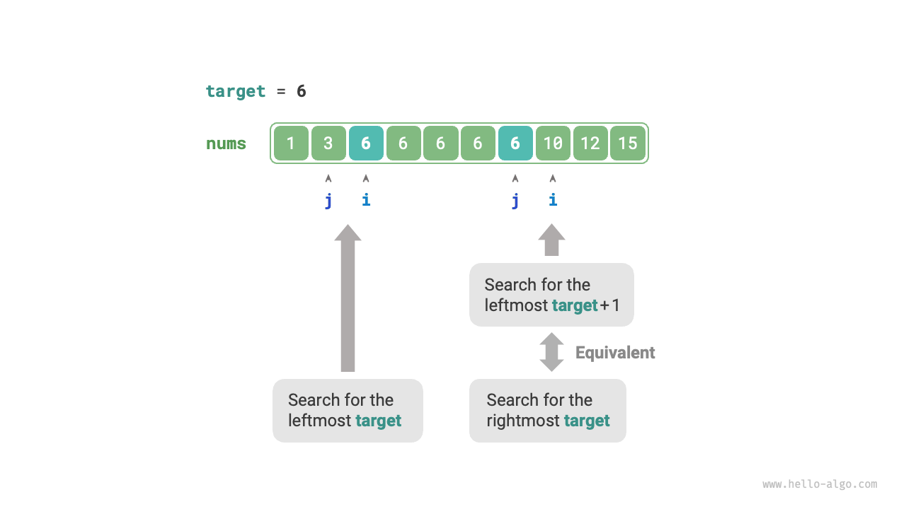
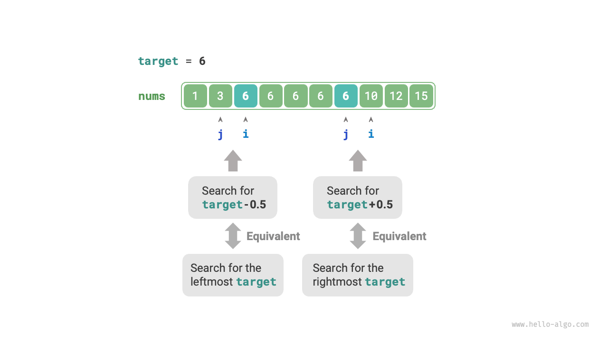

# 10.3 &nbsp; Binary search ranh giới

## 10.3.1 &nbsp; Tìm biên trái

!!! question

    Cho một array `nums` đã sắp xếp có độ dài $n$, có thể chứa các
    phần tử trùng lặp, trả về chỉ số của phần tử `target` nằm ngoài
    cùng bên trái. Nếu phần tử không có trong array, trả về $-1$.

Nhắc lại phương pháp binary search để tìm điểm chèn, sau khi quá
trình tìm kiếm hoàn tất, chỉ số $i$ sẽ trỏ đến vị trí xuất hiện
ngoài cùng bên trái của `target`. Do đó, **tìm kiếm điểm chèn về
cơ bản là tương tự với việc tìm chỉ số của `target` ngoài cùng
bên trái**.

Chúng ta có thể sử dụng hàm tìm điểm chèn để tìm biên trái của
`target`. Lưu ý rằng array có thể không chứa `target`, điều này
có thể dẫn đến hai kết quả sau:

- Chỉ số $i$ của điểm chèn nằm ngoài giới hạn.
- Phần tử `nums[i]` không bằng `target`.

Trong những trường hợp này, chỉ cần trả về $-1$. Code như sau:

=== "Python"

    ```python title="binary_search_edge.py"
    def binary_search_left_edge(nums: list[int], target: int) -> int:
        """Binary search để tìm target ngoài cùng bên trái"""
        # Tương đương với việc tìm điểm chèn của target
        i = binary_search_insertion(nums, target)
        # Không tìm thấy target, do đó trả về -1
        if i == len(nums) or nums[i] != target:
            return -1
        # Tìm thấy target, trả về chỉ số i
        return i
    ```

=== "C++"

    ```cpp title="binary_search_edge.cpp"
    /* Binary search để tìm target ngoài cùng bên trái */
    int binarySearchLeftEdge(vector<int> &nums, int target) {
        // Tương đương với việc tìm điểm chèn của target
        int i = binarySearchInsertion(nums, target);
        // Không tìm thấy target, do đó trả về -1
        if (i == nums.size() || nums[i] != target) {
            return -1;
        }
        // Tìm thấy target, trả về chỉ số i
        return i;
    }
    ```

=== "Java"

    ```java title="binary_search_edge.java"
    /* Binary search để tìm target ngoài cùng bên trái */
    int binarySearchLeftEdge(int[] nums, int target) {
        // Tương đương với việc tìm điểm chèn của target
        int i = binary_search_insertion.binarySearchInsertion(nums, target);
        // Không tìm thấy target, do đó trả về -1
        if (i == nums.length || nums[i] != target) {
            return -1;
        }
        // Tìm thấy target, trả về chỉ số i
        return i;
    }
    ```

=== "C#"

    ```csharp title="binary_search_edge.cs"
    [class]{binary_search_edge}-[func]{BinarySearchLeftEdge}
    ```

=== "Go"

    ```go title="binary_search_edge.go"
    [class]{}-[func]{binarySearchLeftEdge}
    ```

=== "Swift"

    ```swift title="binary_search_edge.swift"
    [class]{}-[func]{binarySearchLeftEdge}
    ```

=== "JS"

    ```javascript title="binary_search_edge.js"
    [class]{}-[func]{binarySearchLeftEdge}
    ```

=== "TS"

    ```typescript title="binary_search_edge.ts"
    [class]{}-[func]{binarySearchLeftEdge}
    ```

=== "Dart"

    ```dart title="binary_search_edge.dart"
    [class]{}-[func]{binarySearchLeftEdge}
    ```

=== "Rust"

    ```rust title="binary_search_edge.rs"
    [class]{}-[func]{binary_search_left_edge}
    ```

=== "C"

    ```c title="binary_search_edge.c"
    [class]{}-[func]{binarySearchLeftEdge}
    ```

=== "Kotlin"

    ```kotlin title="binary_search_edge.kt"
    [class]{}-[func]{binarySearchLeftEdge}
    ```

=== "Ruby"

    ```ruby title="binary_search_edge.rb"
    [class]{}-[func]{binary_search_left_edge}
    ```

=== "Zig"

    ```zig title="binary_search_edge.zig"
    [class]{}-[func]{binarySearchLeftEdge}
    ```

## 10.3.2 &nbsp; Tìm biên phải

Làm thế nào để chúng ta tìm thấy lần xuất hiện `target` ở tận cùng bên phải?
Cách đơn giản nhất là sửa đổi logic binary search truyền thống bằng cách thay
đổi cách chúng ta điều chỉnh các biên tìm kiếm trong trường hợp
`nums[m] == target`. Đoạn mã được bỏ qua ở đây. Nếu bạn quan tâm, hãy thử tự
mình cài đặt đoạn mã đó.

Dưới đây chúng ta sẽ giới thiệu hai phương pháp khéo léo hơn.

### 1. &nbsp; Tái sử dụng tìm kiếm biên trái

Để tìm lần xuất hiện `target` ở tận cùng bên phải, chúng ta có thể tái sử dụng
hàm được dùng để định vị `target` ở tận cùng bên trái. Cụ thể, chúng ta biến đổi
việc tìm kiếm `target` ở tận cùng bên phải thành việc tìm kiếm `target + 1` ở
tận cùng bên trái.

Như được minh họa trong Hình 10-7, sau khi tìm kiếm hoàn tất, con trỏ $i$ sẽ trỏ
đến `target + 1` ở tận cùng bên trái (nếu tồn tại), trong khi con trỏ $j$ sẽ trỏ
đến lần xuất hiện `target` ở tận cùng bên phải. Do đó, việc trả về $j$ sẽ cho
chúng ta biên phải.

{ class="animation-figure" }

<p align="center"> Hình 10-7 &nbsp; Biến đổi tìm kiếm biên phải thành tìm kiếm biên trái </p>

Lưu ý rằng điểm chèn được trả về là $i$, do đó, nó cần được trừ đi $1$ để có
được $j$:

=== "Python"

    ```python title="binary_search_edge.py"
    def binary_search_right_edge(nums: list[int], target: int) -> int:
        """Binary search tìm target ở tận cùng bên phải"""
        # Chuyển đổi thành tìm target + 1 ở tận cùng bên trái
        i = binary_search_insertion(nums, target + 1)
        # j trỏ đến target ở tận cùng bên phải, i trỏ đến phần tử đầu tiên lớn hơn target
        j = i - 1
        # Không tìm thấy target, trả về -1
        if j == -1 or nums[j] != target:
            return -1
        # Tìm thấy target, trả về chỉ số j
        return j
    ```

=== "C++"

    ```cpp title="binary_search_edge.cpp"
    /* Binary search tìm target ở tận cùng bên phải */
    int binarySearchRightEdge(vector<int> &nums, int target) {
        // Chuyển đổi thành tìm target + 1 ở tận cùng bên trái
        int i = binarySearchInsertion(nums, target + 1);
        // j trỏ đến target ở tận cùng bên phải, i trỏ đến phần tử đầu tiên lớn hơn target
        int j = i - 1;
        // Không tìm thấy target, trả về -1
        if (j == -1 || nums[j] != target) {
            return -1;
        }
        // Tìm thấy target, trả về chỉ số j
        return j;
    }
    ```

=== "Java"

    ```java title="binary_search_edge.java"
    /* Tìm kiếm nhị phân cho target ngoài cùng bên phải */
    int binarySearchRightEdge(int[] nums, int target) {
        // Chuyển đổi thành việc tìm kiếm target ngoài cùng bên trái + 1
        int i = binary_search_insertion.binarySearchInsertion(nums, target + 1);
        // j trỏ đến target ngoài cùng bên phải, i trỏ đến phần tử đầu tiên lớn hơn target
        int j = i - 1;
        // Không tìm thấy target, do đó trả về -1
        if (j == -1 || nums[j] != target) {
            return -1;
        }
        // Tìm thấy target, trả về chỉ số j
        return j;
    }
    ```

=== "C#"

    ```csharp title="binary_search_edge.cs"
    [class]{binary_search_edge}-[func]{BinarySearchRightEdge}
    ```

=== "Go"

    ```go title="binary_search_edge.go"
    [class]{}-[func]{binarySearchRightEdge}
    ```

=== "Swift"

    ```swift title="binary_search_edge.swift"
    [class]{}-[func]{binarySearchRightEdge}
    ```

=== "JS"

    ```javascript title="binary_search_edge.js"
    [class]{}-[func]{binarySearchRightEdge}
    ```

=== "TS"

    ```typescript title="binary_search_edge.ts"
    [class]{}-[func]{binarySearchRightEdge}
    ```

=== "Dart"

    ```dart title="binary_search_edge.dart"
    [class]{}-[func]{binarySearchRightEdge}
    ```

=== "Rust"

    ```rust title="binary_search_edge.rs"
    [class]{}-[func]{binary_search_right_edge}
    ```

=== "C"

    ```c title="binary_search_edge.c"
    [class]{}-[func]{binarySearchRightEdge}
    ```

=== "Kotlin"

    ```kotlin title="binary_search_edge.kt"
    [class]{}-[func]{binarySearchRightEdge}
    ```

=== "Ruby"

    ```ruby title="binary_search_edge.rb"
    [class]{}-[func]{binary_search_right_edge}
    ```

=== "Zig"

    ```zig title="binary_search_edge.zig"
    [class]{}-[func]{binarySearchRightEdge}
    ```

### 2. &nbsp; Chuyển đổi thành tìm kiếm phần tử

Khi array không chứa `target`, $i$ và $j$ cuối cùng sẽ trỏ đến phần tử
đầu tiên lớn hơn và nhỏ hơn `target` tương ứng.

Do đó, như minh họa trong Hình 10-8, chúng ta có thể xây dựng một phần
tử không tồn tại trong array, để tìm kiếm các ranh giới trái và phải.

- Để tìm `target` ngoài cùng bên trái: có thể chuyển đổi thành việc tìm
    kiếm `target - 0.5`, và trả về con trỏ $i$.
- Để tìm `target` ngoài cùng bên phải: có thể chuyển đổi thành việc tìm
    kiếm `target + 0.5`, và trả về con trỏ $j$.

{ class="animation-figure" }

<p align="center"> Hình 10-8 &nbsp; Chuyển đổi tìm kiếm ranh giới thành tìm kiếm phần tử </p>

Đoạn code được bỏ qua ở đây, nhưng có hai điểm quan trọng cần lưu ý về
cách tiếp cận này.

- array `nums` đã cho không chứa số thập phân, vì vậy việc xử lý các
    trường hợp bằng nhau không phải là một vấn đề đáng lo ngại.
- Tuy nhiên, việc đưa số thập phân vào cách tiếp cận này yêu cầu sửa
đổi biến `target` thành kiểu số thực (không cần thay đổi trong Python).
