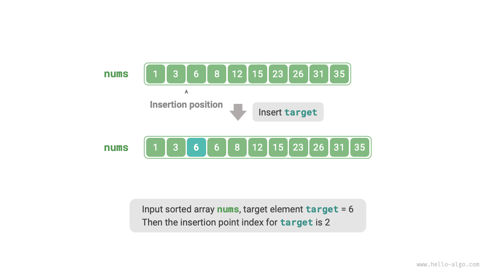
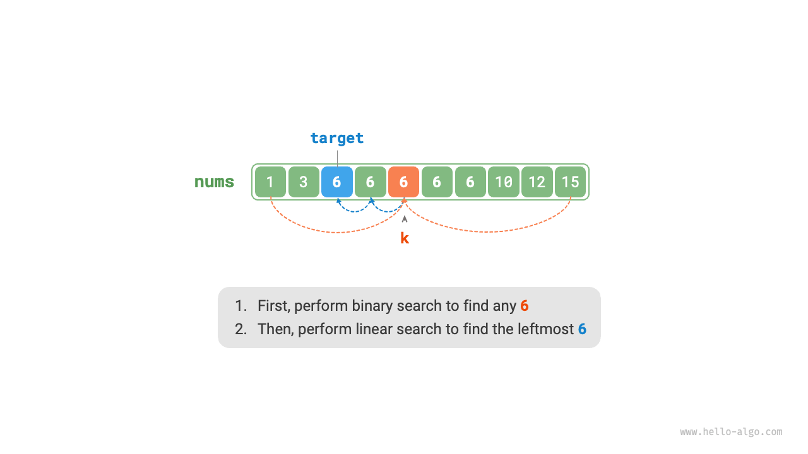
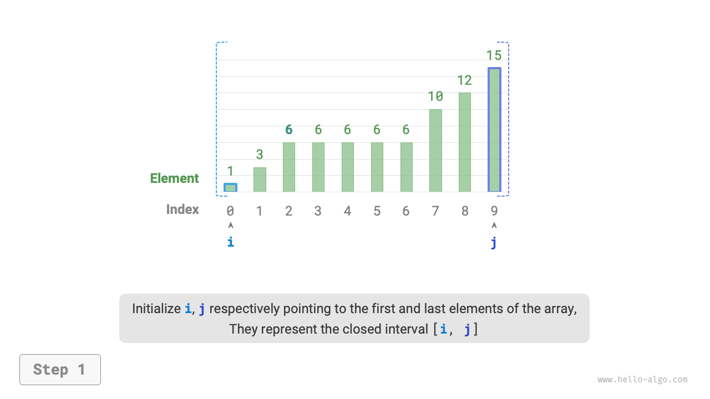
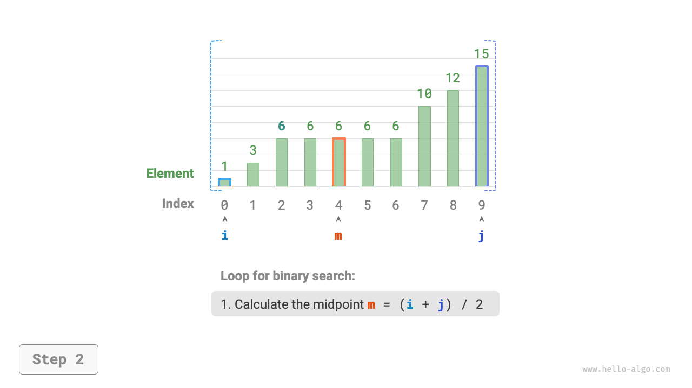
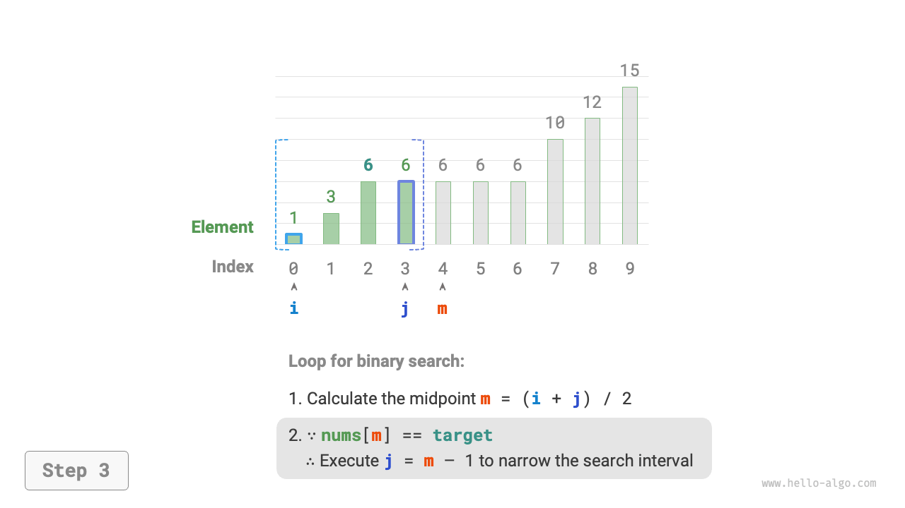
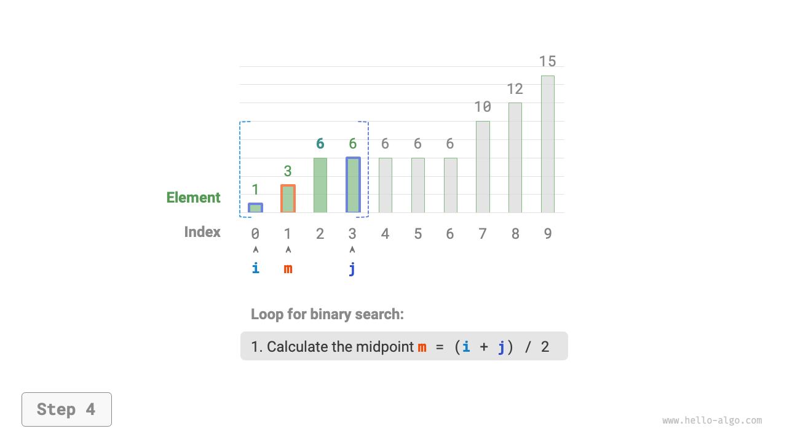
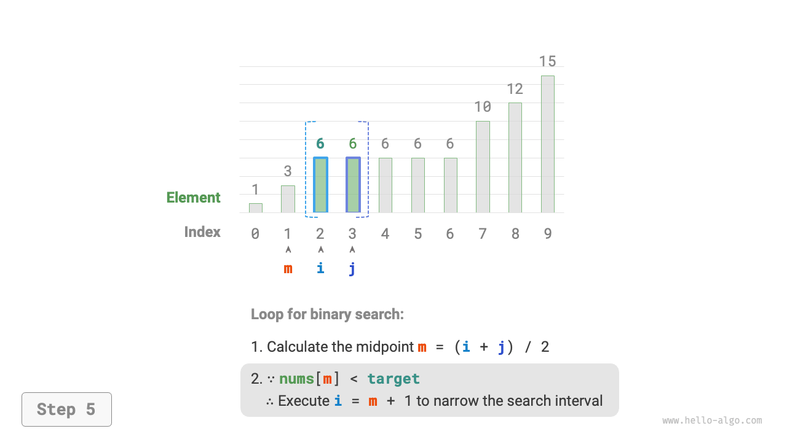
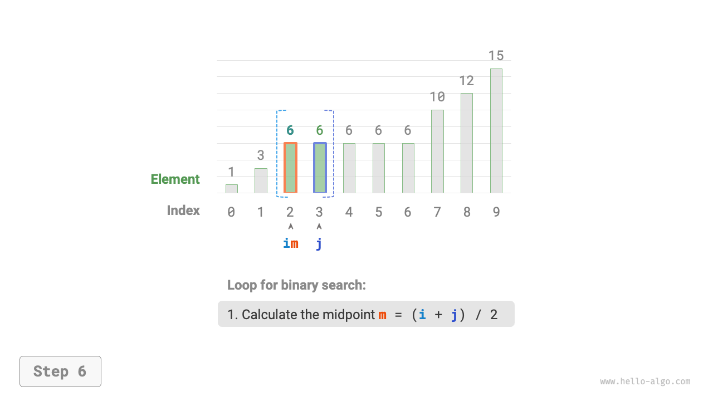
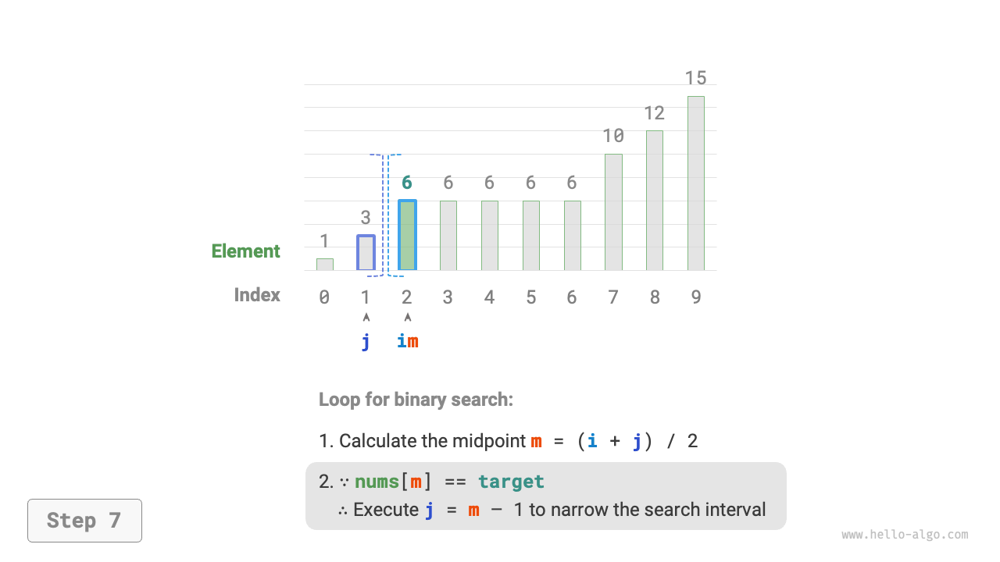
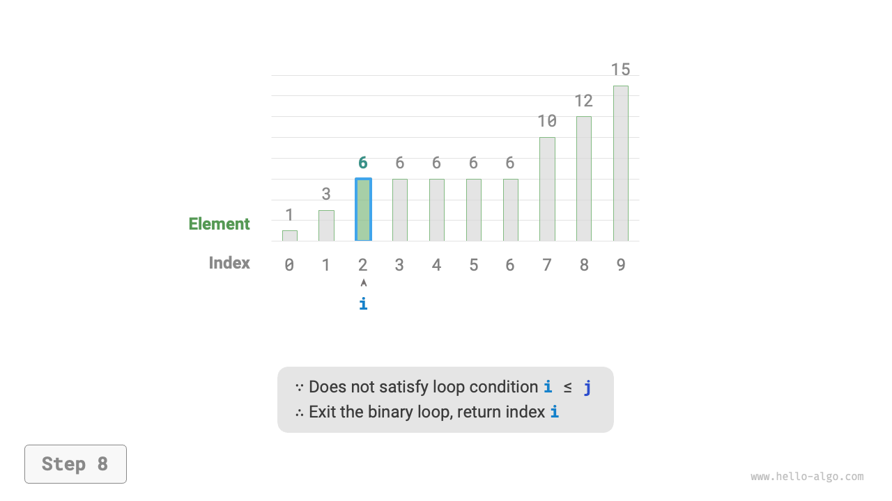

# 10.2 &nbsp; Binary search: Tìm vị trí chèn

Binary search không chỉ được sử dụng để tìm kiếm các phần tử mục tiêu mà còn để
giải quyết nhiều bài toán biến thể, ví dụ như tìm kiếm vị trí chèn của các
phần tử mục tiêu.

## 10.2.1 &nbsp; Trường hợp không có phần tử trùng lặp

!!! question

    Cho một array `nums` đã sắp xếp có độ dài $n$ với các phần tử duy nhất và một
    phần tử `target`, hãy chèn `target` vào `nums` trong khi vẫn duy trì thứ tự
    đã sắp xếp của nó. Nếu `target` đã tồn tại trong array, hãy chèn nó vào
    bên trái của phần tử hiện có. Trả về chỉ số của `target` trong array
    sau khi chèn. Xem ví dụ minh họa trong Hình 10-4.

{ class="animation-figure" }

<p align="center"> Hình 10-4 &nbsp; Dữ liệu ví dụ cho điểm chèn binary search </p>

Nếu bạn muốn tái sử dụng mã binary search từ phần trước, bạn cần trả lời hai
câu hỏi sau.

**Câu hỏi thứ nhất**: Nếu array đã chứa `target`, thì điểm chèn có phải là
chỉ số của phần tử hiện có không?

Yêu cầu chèn `target` vào bên trái của các phần tử bằng nhau có nghĩa là
`target` mới được chèn sẽ thay thế vị trí `target` ban đầu. Nói cách khác,
**khi array chứa `target`, điểm chèn chính là chỉ số của `target` đó**.

**Câu hỏi thứ hai**: Khi array không chứa `target`, nó sẽ được chèn vào
chỉ số nào?

Chúng ta hãy xem xét sâu hơn quá trình binary search: khi `nums[m] < target`,
con trỏ $i$ di chuyển, có nghĩa là con trỏ $i$ đang tiến gần đến một phần tử
lớn hơn hoặc bằng `target`. Tương tự, con trỏ $j$ luôn tiến gần đến một phần tử
nhỏ hơn hoặc bằng `target`.

Do đó, khi kết thúc quá trình binary search, chắc chắn rằng: $i$ trỏ đến phần tử
đầu tiên lớn hơn `target`, và $j$ trỏ đến phần tử đầu tiên nhỏ hơn `target`.
**Dễ dàng thấy rằng khi array không chứa `target`, điểm chèn là $i$**.
Mã như sau:

=== "Python"

    ```python title="binary_search_insertion.py"
    def binary_search_insertion_simple(nums: list[int], target: int) -> int:
        """Binary search để tìm điểm chèn (không có phần tử trùng lặp)"""
        i, j = 0, len(nums) - 1  # Khởi tạo khoảng đóng kép [0, n-1]
        while i <= j:
            m = i + (j - i) // 2  # Tính toán chỉ số giữa m
            if nums[m] < target:
                i = m + 1  # Target nằm trong khoảng [m+1, j]
            elif nums[m] > target:
                j = m - 1  # Target nằm trong khoảng [i, m-1]
            else:
                return m  # Tìm thấy target, trả về điểm chèn m
        # Không tìm thấy target, trả về điểm chèn i
        return i
    ```

=== "C++"

    ```cpp title="binary_search_insertion.cpp"
    /* Binary search để tìm điểm chèn (không có phần tử trùng lặp) */
    int binarySearchInsertionSimple(vector<int> &nums, int target) {
        int i = 0, j = nums.size() - 1; // Khởi tạo khoảng đóng kép [0, n-1]
        while (i <= j) {
            int m = i + (j - i) / 2; // Tính chỉ số điểm giữa m
            if (nums[m] < target) {
                i = m + 1; // target nằm trong khoảng [m+1, j]
            } else if (nums[m] > target) {
                j = m - 1; // target nằm trong khoảng [i, m-1]
            } else {
                return m; // Tìm thấy target, trả về điểm chèn m
            }
        }
        // Không tìm thấy target, trả về điểm chèn i
        return i;
    }
    ```

=== "Java"

    ```java title="binary_search_insertion.java"
    /* binary search để tìm điểm chèn (không có phần tử trùng lặp) */
    int binarySearchInsertionSimple(int[] nums, int target) {
        int i = 0, j = nums.length - 1; // Khởi tạo khoảng đóng kép [0, n-1]
        while (i <= j) {
            int m = i + (j - i) / 2; // Tính chỉ số điểm giữa m
            if (nums[m] < target) {
                i = m + 1; // target nằm trong khoảng [m+1, j]
            } else if (nums[m] > target) {
                j = m - 1; // target nằm trong khoảng [i, m-1]
            } else {
                return m; // Tìm thấy target, trả về điểm chèn m
            }
        }
        // Không tìm thấy target, trả về điểm chèn i
        return i;
    }
    ```

=== "C#"

    ```csharp title="binary_search_insertion.cs"
    [class]{binary_search_insertion}-[func]{BinarySearchInsertionSimple}
    ```

=== "Go"

    ```go title="binary_search_insertion.go"
    [class]{}-[func]{binarySearchInsertionSimple}
    ```

=== "Swift"

    ```swift title="binary_search_insertion.swift"
    [class]{}-[func]{binarySearchInsertionSimple}
    ```

=== "JS"

    ```javascript title="binary_search_insertion.js"
    [class]{}-[func]{binarySearchInsertionSimple}
    ```

=== "TS"

    ```typescript title="binary_search_insertion.ts"
    [class]{}-[func]{binarySearchInsertionSimple}
    ```

=== "Dart"

    ```dart title="binary_search_insertion.dart"
    [class]{}-[func]{binarySearchInsertionSimple}
    ```

=== "Rust"

    ```rust title="binary_search_insertion.rs"
    [class]{}-[func]{binary_search_insertion_simple}
    ```

=== "C"

    ```c title="binary_search_insertion.c"
    [class]{}-[func]{binarySearchInsertionSimple}
    ```

=== "Kotlin"

    ```kotlin title="binary_search_insertion.kt"
    [class]{}-[func]{binarySearchInsertionSimple}
    ```

=== "Ruby"

    ```ruby title="binary_search_insertion.rb"
    [class]{}-[func]{binary_search_insertion_simple}
    ```

=== "Zig"

    ```zig title="binary_search_insertion.zig"
    [class]{}-[func]{binarySearchInsertionSimple}
    ```

## 10.2.2 &nbsp; Trường hợp có các phần tử trùng lặp

!!! question

    Dựa trên câu hỏi trước đó, giả sử array có thể chứa các phần tử trùng lặp,
    mọi thứ khác vẫn giữ nguyên.

Khi có nhiều lần xuất hiện của `target` trong array, một binary search thông
thường chỉ có thể trả về chỉ số của một lần xuất hiện của `target`,
**và nó không thể xác định có bao nhiêu lần xuất hiện của `target` ở bên trái và
bên phải vị trí đó**.

Bài toán yêu cầu chèn phần tử `target` vào vị trí tận cùng bên trái,
**vì vậy chúng ta cần tìm chỉ số của `target` tận cùng bên trái trong array**.
Ban đầu, hãy xem xét việc triển khai điều này thông qua các bước được hiển thị
trong Hình 10-5.

1. Thực hiện một binary search để tìm bất kỳ chỉ số nào của `target`,
    giả sử là $k$.
2. Bắt đầu từ chỉ số $k$, tiến hành một linear search sang trái cho đến khi
    tìm thấy lần xuất hiện tận cùng bên trái của `target`, sau đó trả về
    chỉ số này.

{ class="animation-figure" }

<p align="center"> Hình 10-5 &nbsp; Linear search để tìm điểm chèn của các phần tử trùng lặp </p>

Mặc dù phương pháp này khả thi, nhưng nó bao gồm linear search, vì vậy
time complexity của nó là $O(n)$. Phương pháp này không hiệu quả khi array chứa
nhiều `target` trùng lặp.

Bây giờ, chúng ta hãy xem xét việc mở rộng mã binary search. Như được hiển thị
trong Hình 10-6, quá trình tổng thể vẫn giữ nguyên. Trong mỗi vòng, chúng ta
đầu tiên tính toán chỉ số giữa $m$, sau đó so sánh giá trị của `target`
với `nums[m]`, dẫn đến các trường hợp sau.

- Khi `nums[m] < target` hoặc `nums[m] > target`, điều đó có nghĩa là
    `target` chưa được tìm thấy, do đó sử dụng binary search thông thường để
    thu hẹp phạm vi tìm kiếm, **đưa các con trỏ $i$ và $j$ gần hơn đến `target`**.
- Khi `nums[m] == target`, điều đó chỉ ra rằng các phần tử nhỏ hơn `target`
    nằm trong phạm vi $[i, m - 1]$, do đó sử dụng $j = m - 1$ để thu hẹp
    phạm vi, **do đó đưa con trỏ $j$ gần hơn đến các phần tử nhỏ hơn `target`**.

Sau vòng lặp, $i$ trỏ đến `target` tận cùng bên trái, và $j$ trỏ đến phần tử
đầu tiên nhỏ hơn `target`, **vì vậy chỉ số $i$ là điểm chèn**.

=== "<1>"
    { class="animation-figure" }

=== "<2>"
    { class="animation-figure" }

=== "<3>"
    { class="animation-figure" }

=== "<4>"
    { class="animation-figure" }

=== "<5>"
    { class="animation-figure" }

=== "<6>"
    { class="animation-figure" }

=== "<7>"
    { class="animation-figure" }

=== "<8>"
    { class="animation-figure" }

<p align="center"> Hình 10-6 &nbsp; Các bước tìm điểm chèn bằng binary search cho các phần tử trùng lặp </p>

Quan sát đoạn code sau. Các thao tác trong các nhánh `nums[m] > target` và
`nums[m] == target` là như nhau, vì vậy hai nhánh này có thể được gộp lại.

Mặc dù vậy, chúng ta vẫn có thể giữ các điều kiện được mở rộng, vì điều này
làm cho logic rõ ràng hơn và cải thiện khả năng đọc.

=== "Python"

    ```python title="binary_search_insertion.py"
    def binary_search_insertion(nums: list[int], target: int) -> int:
        """binary search tìm điểm chèn (với các phần tử trùng lặp)"""
        i, j = 0, len(nums) - 1  # Khởi tạo khoảng đóng kép [0, n-1]
        while i <= j:
            m = i + (j - i) // 2  # Tính chỉ số điểm giữa m
            if nums[m] < target:
                i = m + 1  # target nằm trong khoảng [m+1, j]
            elif nums[m] > target:
                j = m - 1  # Phần tử đầu tiên nhỏ hơn target nằm trong khoảng [i, m-1]
            else:
                j = m - 1  # Phần tử đầu tiên nhỏ hơn target nằm trong khoảng [i, m-1]
        # Trả về điểm chèn i
        return i
    ```

=== "C++"

    ```cpp title="binary_search_insertion.cpp"
    /* binary search tìm điểm chèn (với các phần tử trùng lặp) */
    int binarySearchInsertion(vector<int> &nums, int target) {
        int i = 0, j = nums.size() - 1; // Khởi tạo khoảng đóng kép [0, n-1]
        while (i <= j) {
            int m = i + (j - i) / 2; // Tính chỉ số điểm giữa m
            if (nums[m] < target) {
                i = m + 1; // target nằm trong khoảng [m+1, j]
            } else if (nums[m] > target) {
                j = m - 1; // Phần tử đầu tiên nhỏ hơn target nằm trong khoảng [i, m-1]
            } else {
                j = m - 1; // Phần tử đầu tiên nhỏ hơn target nằm trong khoảng [i, m-1]
            }
        }
        // Trả về điểm chèn i
        return i;
    }
    ```

=== "Java"

    ```java title="binary_search_insertion.java"
    /* binary search để tìm điểm chèn (với các phần tử trùng lặp) */
    int binarySearchInsertion(int[] nums, int target) {
        int i = 0, j = nums.length - 1; // Khởi tạo khoảng đóng kép [0, n-1]
        while (i <= j) {
            int m = i + (j - i) / 2; // Tính chỉ số điểm giữa m
            if (nums[m] < target) {
                i = m + 1; // target nằm trong khoảng [m+1, j]
            } else if (nums[m] > target) {
                j = m - 1; // target nằm trong khoảng [i, m-1]
            } else {
                j = m - 1; // Phần tử đầu tiên nhỏ hơn target nằm trong khoảng [i, m-1]
            }
        }
        // Trả về điểm chèn i
        return i;
    }
    ```

=== "C#"

    ```csharp title="binary_search_insertion.cs"
    [class]{binary_search_insertion}-[func]{BinarySearchInsertion}
    ```

=== "Go"

    ```go title="binary_search_insertion.go"
    [class]{}-[func]{binarySearchInsertion}
    ```

=== "Swift"

    ```swift title="binary_search_insertion.swift"
    [class]{}-[func]{binarySearchInsertion}
    ```

=== "JS"

    ```javascript title="binary_search_insertion.js"
    [class]{}-[func]{binarySearchInsertion}
    ```

=== "TS"

    ```typescript title="binary_search_insertion.ts"
    [class]{}-[func]{binarySearchInsertion}
    ```

=== "Dart"

    ```dart title="binary_search_insertion.dart"
    [class]{}-[func]{binarySearchInsertion}
    ```

=== "Rust"

    ```rust title="binary_search_insertion.rs"
    [class]{}-[func]{binary_search_insertion}
    ```

=== "C"

    ```c title="binary_search_insertion.c"
    [class]{}-[func]{binarySearchInsertion}
    ```

=== "Kotlin"

    ```kotlin title="binary_search_insertion.kt"
    [class]{}-[func]{binarySearchInsertion}
    ```

=== "Ruby"

    ```ruby title="binary_search_insertion.rb"
    [class]{}-[func]{binary_search_insertion}
    ```

=== "Zig"

    ```zig title="binary_search_insertion.zig"
    [class]{}-[func]{binarySearchInsertion}
    ```

!!! tip

    Mã trong phần này sử dụng "khoảng đóng". Nếu bạn quan tâm đến "khoảng đóng bên
    trái, mở bên phải", hãy thử tự mình triển khai mã.

Tóm lại, binary search về cơ bản là việc đặt các mục tiêu tìm kiếm cho các con
trỏ $i$ và $j$. Các mục tiêu này có thể là một phần tử cụ thể (như `target`)
hoặc một phạm vi các phần tử (chẳng hạn như những phần tử nhỏ hơn `target`).

Trong vòng lặp liên tục của binary search, các con trỏ $i$ và $j$ dần dần tiếp
cận mục tiêu đã xác định trước. Cuối cùng, chúng hoặc tìm thấy câu trả lời hoặc
dừng lại sau khi vượt qua ranh giới.
