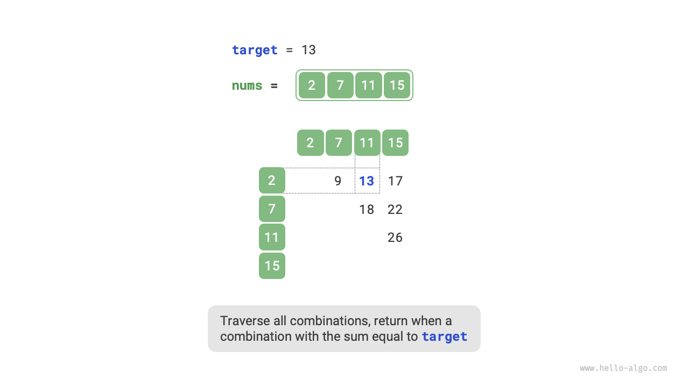
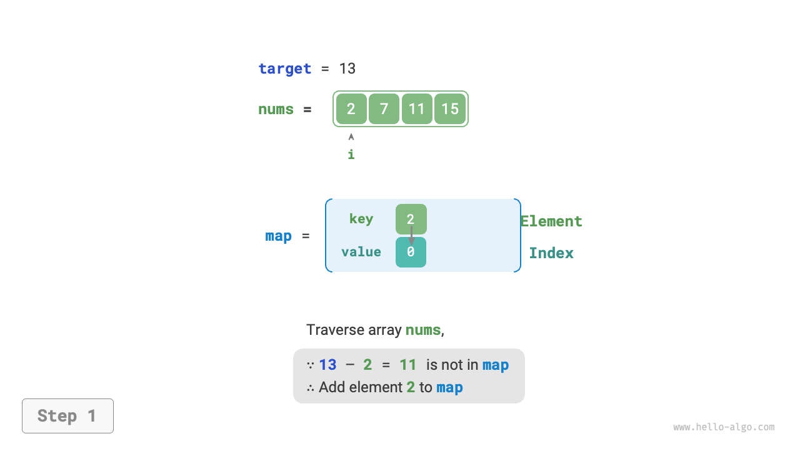
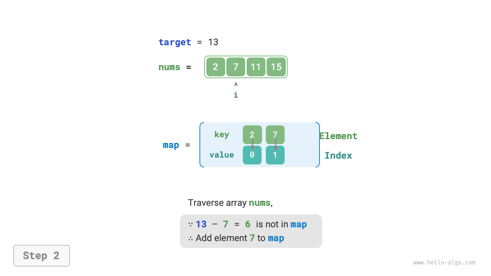
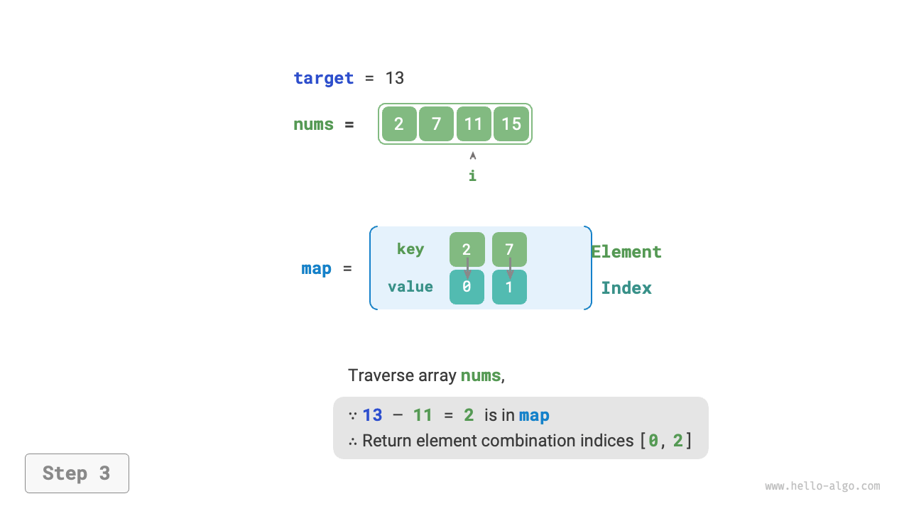

# 10.4 &nbsp; Chiến lược tối ưu hóa Hash

Trong các bài toán thuật toán, **chúng ta thường giảm time complexity của một thuật toán**
**bằng cách thay thế một linear search bằng một tìm kiếm dựa trên hash**. Hãy sử dụng một
bài toán thuật toán để hiểu sâu hơn.

!!! question

    Cho một array số nguyên `nums` và một phần tử target `target`, hãy tìm hai
    phần tử trong array mà "tổng" của chúng bằng `target`, và trả về các chỉ số
    của chúng trong array. Bất kỳ giải pháp nào cũng được chấp nhận.

## 10.4.1 &nbsp; Linear search: Đánh đổi thời gian lấy không gian

Hãy xem xét việc duyệt qua tất cả các tổ hợp có thể một cách trực tiếp.
Như được minh họa trong Hình 10-9, chúng ta khởi tạo một vòng lặp lồng nhau,
và trong mỗi lần lặp, chúng ta xác định xem tổng của hai số nguyên
có bằng `target` hay không. Nếu có, chúng ta trả về các `chỉ số` của chúng.

{ class="animation-figure" }

<p align="center"> Hình 10-9 &nbsp; Giải pháp Linear search cho bài toán two-sum </p>

Mã code được hiển thị dưới đây:

=== "Python"

    ```python title="two_sum.py"
    def two_sum_brute_force(nums: list[int], target: int) -> list[int]:
        """Phương pháp một: Liệt kê vét cạn"""
        # Vòng lặp hai lớp, time complexity là O(n^2)
        for i in range(len(nums) - 1):
            for j in range(i + 1, len(nums)):
                if nums[i] + nums[j] == target:
                    return [i, j]
        return []
    ```

=== "C++"

    ```cpp title="two_sum.cpp"
    /* Phương pháp một: Liệt kê vét cạn */
    vector<int> twoSumBruteForce(vector<int> &nums, int target) {
        int size = nums.size();
        // Vòng lặp hai lớp, time complexity là O(n^2)
        for (int i = 0; i < size - 1; i++) {
            for (int j = i + 1; j < size; j++) {
                if (nums[i] + nums[j] == target)
                    return {i, j};
            }
        }
        return {};
    }
    ```

=== "Java"

    ```java title="two_sum.java"
    /* Phương pháp một: Liệt kê vét cạn */
    int[] twoSumBruteForce(int[] nums, int target) {
        int size = nums.length;
        // Vòng lặp hai lớp, time complexity là O(n^2)
        for (int i = 0; i < size - 1; i++) {
            for (int j = i + 1; j < size; j++) {
                if (nums[i] + nums[j] == target)
                    return new int[] { i, j };
            }
        }
        return new int[0];
    }
    ```

=== "C#"

    ```csharp title="two_sum.cs"
    [class]{two_sum}-[func]{TwoSumBruteForce}
    ```

=== "Go"

    ```go title="two_sum.go"
    [class]{}-[func]{twoSumBruteForce}
    ```

=== "Swift"

    ```swift title="two_sum.swift"
    [class]{}-[func]{twoSumBruteForce}
    ```

=== "JS"

    ```javascript title="two_sum.js"
    [class]{}-[func]{twoSumBruteForce}
    ```

=== "TS"

    ```typescript title="two_sum.ts"
    [class]{}-[func]{twoSumBruteForce}
    ```

=== "Dart"

    ```dart title="two_sum.dart"
    [class]{}-[func]{twoSumBruteForce}
    ```

=== "Rust"

    ```rust title="two_sum.rs"
    [class]{}-[func]{two_sum_brute_force}
    ```

=== "C"

    ```c title="two_sum.c"
    [class]{}-[func]{twoSumBruteForce}
    ```

=== "Kotlin"

    ```kotlin title="two_sum.kt"
    [class]{}-[func]{twoSumBruteForce}
    ```

=== "Ruby"

    ```ruby title="two_sum.rb"
    [class]{}-[func]{two_sum_brute_force}
    ```

=== "Zig"

    ```zig title="two_sum.zig"
    [class]{}-[func]{twoSumBruteForce}
    ```

Phương pháp này có time complexity là $O(n^2)$ và space complexity là $O(1)$, điều này có thể rất tốn thời gian với khối lượng dữ liệu lớn.

## 10.4.2 &nbsp; Tìm kiếm hash: đánh đổi không gian lấy thời gian

Chúng ta hãy xem xét việc sử dụng một hash table, trong đó các cặp khóa-giá trị
tương ứng là các phần tử mảng và các chỉ số của chúng. Bạn duyệt qua array,
thực hiện các bước được hiển thị trong Hình 10-10 trong mỗi lần lặp.

1. Kiểm tra xem số `target - nums[i]` có trong hash table không. Nếu có,
    trực tiếp trả về các chỉ số của hai phần tử này.
2. Thêm cặp khóa-giá trị `nums[i]` và chỉ số `i` vào hash table.

=== "<1>"
    { class="animation-figure" }

=== "<2>"
    { class="animation-figure" }

=== "<3>"
    { class="animation-figure" }

<p align="center"> Hình 10-10 &nbsp; Hash table giúp giải bài toán two-sum </p>

Mã triển khai được hiển thị bên dưới, chỉ yêu cầu một vòng lặp duy nhất:

=== "Python"

    ```python title="two_sum.py"
    def two_sum_hash_table(nums: list[int], target: int) -> list[int]:
        """Phương pháp hai: Hash table phụ trợ"""
        # Hash table phụ trợ, space complexity là O(n)
        dic = {}
        # Vòng lặp đơn, time complexity là O(n)
        for i in range(len(nums)):
            if target - nums[i] in dic:
                return [dic[target - nums[i]], i]
            dic[nums[i]] = i
        return []
    ```

=== "C++"

    ```cpp title="two_sum.cpp"
    /* Phương pháp hai: Hash table phụ trợ */
    vector<int> twoSumHashTable(vector<int> &nums, int target) {
        int size = nums.size();
        // Hash table phụ trợ, space complexity là O(n)
        unordered_map<int, int> dic;
        // Vòng lặp đơn, time complexity là O(n)
        for (int i = 0; i < size; i++) {
            if (dic.find(target - nums[i]) != dic.end()) {
                return {dic[target - nums[i]], i};
            }
            dic.emplace(nums[i], i);
        }
        return {};
    }
    ```

=== "Java"

    ```java title="two_sum.java"
    /* Phương pháp hai: Hash table phụ trợ */
    int[] twoSumHashTable(int[] nums, int target) {
        int size = nums.length;
        // Hash table phụ trợ, space complexity là O(n)
        Map<Integer, Integer> dic = new HashMap<>();
        // Vòng lặp đơn, time complexity là O(n)
        for (int i = 0; i < size; i++) {
            if (dic.containsKey(target - nums[i])) {
                return new int[] { dic.get(target - nums[i]), i };
            }
            dic.put(nums[i], i);
        }
        return new int[0];
    }
    ```

=== "C#"

    ```csharp title="two_sum.cs"
    [class]{two_sum}-[func]{TwoSumHashTable}
    ```

=== "Go"

    ```go title="two_sum.go"
    [class]{}-[func]{twoSumHashTable}
    ```

=== "Swift"

    ```swift title="two_sum.swift"
    [class]{}-[func]{twoSumHashTable}
    ```

=== "JS"

    ```javascript title="two_sum.js"
    [class]{}-[func]{twoSumHashTable}
    ```

=== "TS"

    ```typescript title="two_sum.ts"
    [class]{}-[func]{twoSumHashTable}
    ```

=== "Dart"

    ```dart title="two_sum.dart"
    [class]{}-[func]{twoSumHashTable}
    ```

=== "Rust"

    ```rust title="two_sum.rs"
    [class]{}-[func]{two_sum_hash_table}
    ```

=== "C"

    ```c title="two_sum.c"
    [class]{HashTable}-[func]{}

    [class]{}-[func]{twoSumHashTable}
    ```

=== "Kotlin"

    ```kotlin title="two_sum.kt"
    [class]{}-[func]{twoSumHashTable}
    ```

=== "Ruby"

    ```ruby title="two_sum.rb"
    [class]{}-[func]{two_sum_hash_table}
    ```

=== "Zig"

    ```zig title="two_sum.zig"
    [class]{}-[func]{twoSumHashTable}
    ```

Phương pháp này giảm time complexity từ $O(n^2)$ xuống $O(n)$ bằng cách sử dụng
tìm kiếm hash, cải thiện đáng kể hiệu suất thời gian chạy.

Vì nó yêu cầu duy trì một hash table bổ sung, nên space complexity là $O(n)$.
**Tuy nhiên, phương pháp này có hiệu quả thời gian-không gian cân bằng hơn về
tổng thể, khiến nó trở thành giải pháp tối ưu cho bài toán này**.
