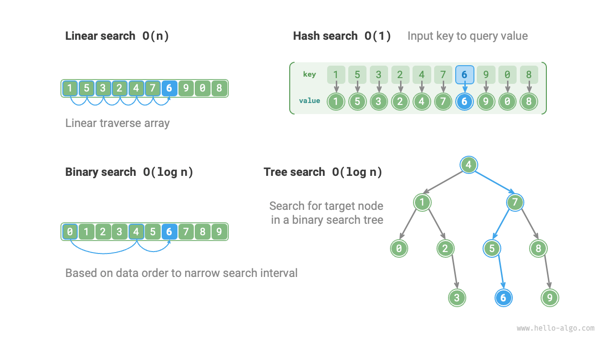

# 10.5 &nbsp; Thuật toán tìm kiếm được xem xét lại

<u>Thuật toán tìm kiếm (search algorithms)</u> được sử dụng để truy xuất
một hoặc nhiều phần tử đáp ứng các tiêu chí cụ thể trong các cấu trúc
dữ liệu như array, linked list, tree hoặc graph.

Các thuật toán tìm kiếm có thể được chia thành hai loại sau dựa trên
phương pháp tiếp cận của chúng.

- **Định vị phần tử mục tiêu bằng cách duyệt qua cấu trúc dữ liệu**,
  chẳng hạn như duyệt array, linked list, tree và graph, v.v.
- **Sử dụng cấu trúc tổ chức của dữ liệu hoặc dữ liệu hiện có để đạt được
  tìm kiếm phần tử hiệu quả**, chẳng hạn như binary search, hash search,
  binary search tree search, v.v.

Những chủ đề này đã được giới thiệu trong các chương trước, vì vậy chúng
không xa lạ với chúng ta. Trong phần này, chúng ta sẽ xem xét lại các thuật
toán tìm kiếm từ một góc độ hệ thống hơn.

## 10.5.1 &nbsp; Brute-force search

Một Brute-force search xác định phần tử mục tiêu bằng cách duyệt qua mọi phần tử
của data structure.

- "Linear search" phù hợp với các linear data structure như array và linked list.
  Nó bắt đầu từ một đầu của data structure và truy cập từng phần tử một cho đến
  khi phần tử mục tiêu được tìm thấy hoặc đến đầu kia mà không tìm thấy phần tử
  mục tiêu.
- "Breadth-first search" và "Depth-first search" là hai chiến lược duyệt cho
  graph và tree. Breadth-first search bắt đầu từ node ban đầu và tìm kiếm từng
  lớp (từ trái sang phải), truy cập các node từ gần đến xa. Depth-first search
  bắt đầu từ node ban đầu, đi theo một đường dẫn cho đến cuối (từ trên xuống
  dưới), sau đó quay lui và thử các đường dẫn khác cho đến khi toàn bộ data
  structure được duyệt qua.

Lợi thế của Brute-force search là sự đơn giản và linh hoạt của nó,
**không cần tiền xử lý dữ liệu hoặc sự trợ giúp của các data structure bổ sung**.

Tuy nhiên, **time complexity của loại thuật toán này là $O(n)$**, trong đó $n$
là số lượng phần tử, vì vậy hiệu suất kém với các tập dữ liệu lớn.

## 10.5.2 &nbsp; Tìm kiếm thích ứng

Một tìm kiếm thích ứng sử dụng các thuộc tính độc đáo của dữ liệu (chẳng hạn
như thứ tự) để tối ưu hóa quá trình tìm kiếm, qua đó xác định vị trí
phần tử mục tiêu một cách hiệu quả hơn.

- "Binary search" sử dụng tính có thứ tự của dữ liệu để đạt được tìm kiếm
    hiệu quả, chỉ phù hợp với array.
- "Hash search" sử dụng một hash table để thiết lập ánh xạ khóa-giá trị
    giữa dữ liệu tìm kiếm và dữ liệu mục tiêu, qua đó thực hiện thao tác
    truy vấn.
- "Tree search" trong một cấu trúc tree cụ thể (chẳng hạn như binary search
    tree), nhanh chóng loại bỏ các node dựa trên so sánh giá trị node, qua đó
    xác định vị trí phần tử mục tiêu.

Ưu điểm của các thuật toán này là hiệu quả cao, **với time complexity
đạt $O(\log n)$ hoặc thậm chí $O(1)$**.

Tuy nhiên, **việc sử dụng các thuật toán này thường yêu cầu tiền xử lý dữ liệu**.
Ví dụ, binary search yêu cầu sắp xếp array trước, và hash search cùng tree
search đều yêu cầu sự trợ giúp của các cấu trúc dữ liệu bổ sung. Việc duy trì
các cấu trúc này cũng đòi hỏi nhiều overhead hơn về time và space.

!!! tip

    Các thuật toán tìm kiếm thích ứng thường được gọi là thuật toán tìm kiếm,
    **chủ yếu được sử dụng để nhanh chóng truy xuất các phần tử mục tiêu
    trong các cấu trúc dữ liệu cụ thể**.

## 10.5.3 &nbsp; Lựa chọn phương pháp tìm kiếm

Với một tập hợp dữ liệu có kích thước $n$, chúng ta có thể sử dụng linear search,
binary search, tree search, hash search, hoặc các phương pháp khác để truy xuất
phần tử mục tiêu. Nguyên lý hoạt động của các phương pháp này được thể hiện
trong Hình 10-11.

{ class="animation-figure" }

 Hình 10-11 &nbsp; Các chiến lược tìm kiếm khác nhau 

Các đặc điểm và hiệu suất hoạt động của các phương pháp đã đề cập được thể hiện
trong bảng sau.

 Bảng 10-1 &nbsp; So sánh hiệu quả của các thuật toán tìm kiếm 

| ------------------------ | Linear search | Binary search         | Tree search                 | Hash search                |
| ------------------------ | ------------- | --------------------- | --------------------------- | -------------------------- |
| Tìm kiếm phần tử         | $O(n)$        | $O(\log n)$           | $O(\log n)$                 | $O(1)$                     |
| Chèn phần tử             | $O(1)$        | $O(n)$                | $O(\log n)$                 | $O(1)$                     |
| Xóa phần tử              | $O(n)$        | $O(n)$                | $O(\log n)$                 | $O(1)$                     |
| Bộ nhớ bổ sung           | $O(1)$        | $O(1)$                | $O(n)$                      | $O(n)$                     |
| Tiền xử lý dữ liệu       | /             | Sắp xếp $O(n \log n)$ | Xây dựng tree $O(n \log n)$ | Xây dựng hash table $O(n)$ |
| Tính sắp xếp của dữ liệu | Không sắp xếp | Đã sắp xếp            | Đã sắp xếp                  | Không sắp xếp              |

Việc lựa chọn thuật toán tìm kiếm cũng phụ thuộc vào khối lượng dữ liệu, yêu
cầu hiệu suất tìm kiếm, tần suất truy vấn và cập nhật dữ liệu, v.v.

**Linear search**

- Tính linh hoạt tốt, không cần bất kỳ thao tác tiền xử lý dữ liệu nào. Nếu
  chúng ta chỉ cần truy vấn dữ liệu một lần, thì thời gian tiền xử lý dữ liệu
  của ba phương pháp còn lại sẽ dài hơn thời gian của một linear search.
- Phù hợp với khối lượng dữ liệu nhỏ, nơi time complexity có ít tác động hơn
  đến hiệu suất.
- Phù hợp cho các tình huống cập nhật dữ liệu rất thường xuyên, vì phương pháp
  này không yêu cầu bất kỳ bảo trì dữ liệu bổ sung nào.

**Binary search**

- Thích hợp cho khối lượng dữ liệu lớn hơn, với hiệu suất ổn định và worst-case
  time complexity là $O(\log n)$.
- Tuy nhiên, khối lượng dữ liệu không thể quá lớn, vì việc lưu trữ các array
  yêu cầu không gian bộ nhớ liền kề.
- Không phù hợp cho các tình huống thêm và xóa thường xuyên, vì việc duy trì
  một array đã sắp xếp gây ra nhiều overhead.

**Hash search**

- Thích hợp cho các trường hợp hiệu suất truy vấn nhanh là cần thiết,
  với time complexity trung bình là $O(1)$.
- Không thích hợp cho các trường hợp cần dữ liệu có thứ tự hoặc tìm kiếm
  trong một khoảng, vì hash tables không thể duy trì thứ tự dữ liệu.
- Phụ thuộc nhiều vào các hash function và chiến lược xử lý va chạm hash,
  với rủi ro hiệu suất suy giảm đáng kể.
- Không thích hợp cho các tập dữ liệu quá lớn, vì hash tables cần không gian
  bổ sung để giảm thiểu va chạm và cung cấp hiệu suất truy vấn tốt.

**Tìm kiếm trên tree**

- Thích hợp cho dữ liệu lớn, vì các node của tree được lưu trữ rải rác
  trong bộ nhớ.
- Thích hợp để duy trì dữ liệu có thứ tự hoặc tìm kiếm trong một khoảng.
- Với việc thêm và xóa node liên tục, binary search tree có thể bị lệch
  (skewed), làm giảm time complexity xuống $O(n)$.
- Nếu sử dụng AVL trees hoặc red-black trees, các thao tác có thể chạy
  ổn định với hiệu suất $O(\log n)$, nhưng thao tác duy trì sự cân bằng
  của tree làm tăng thêm overhead.
