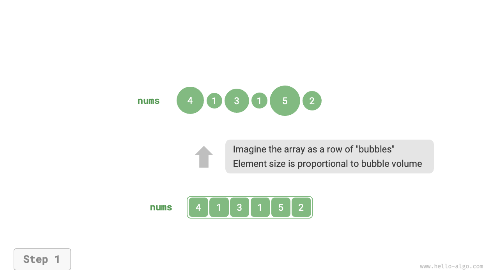
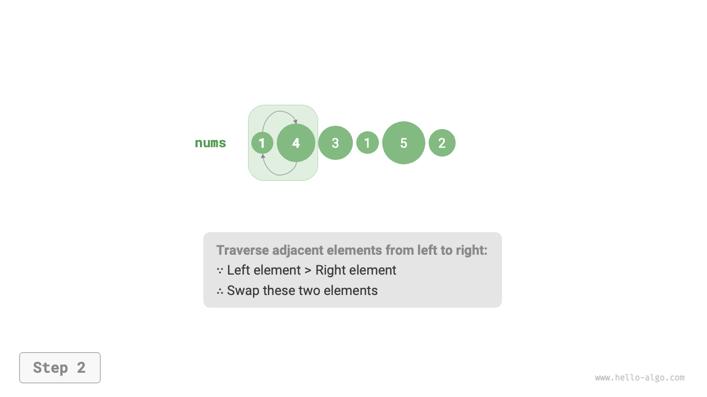
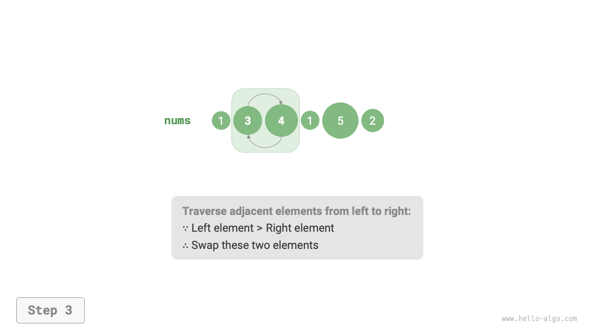
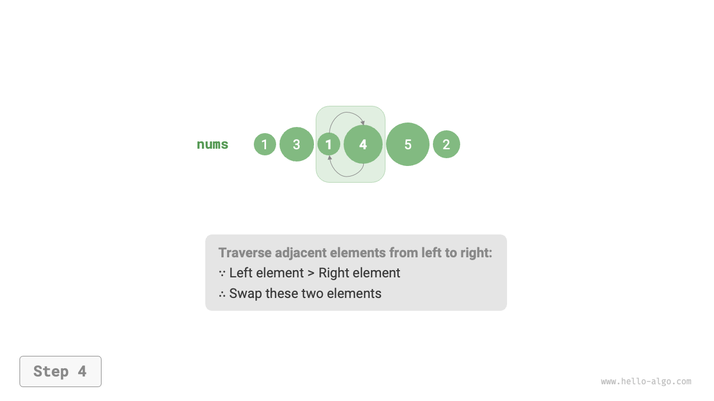
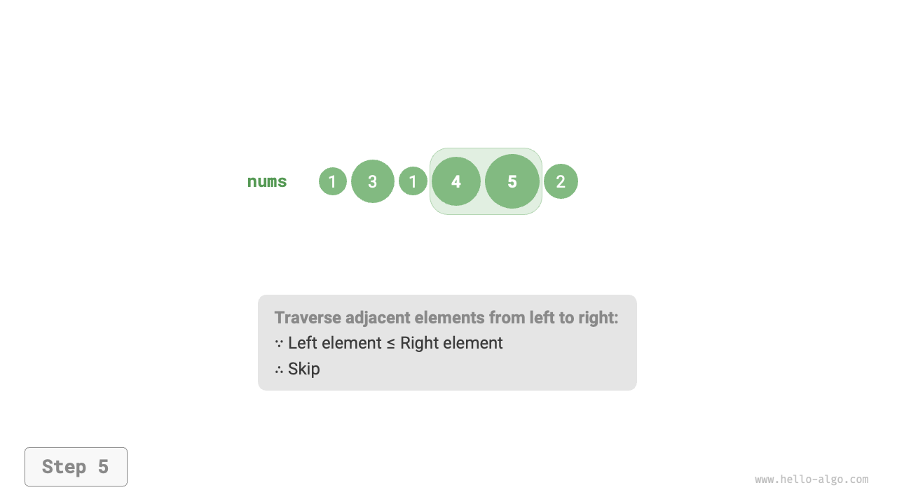
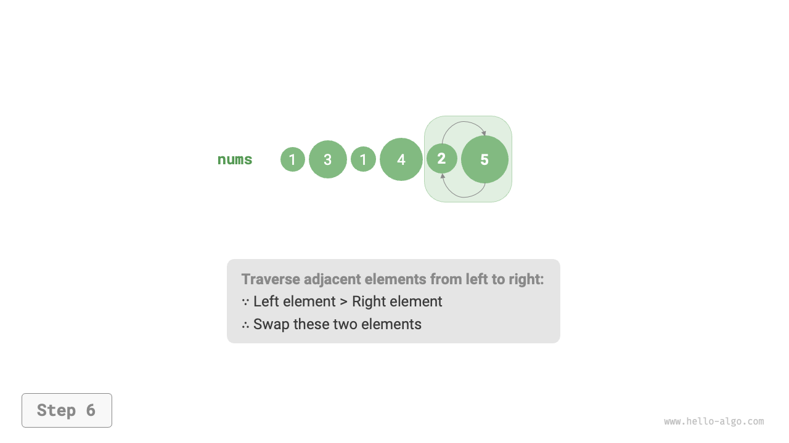
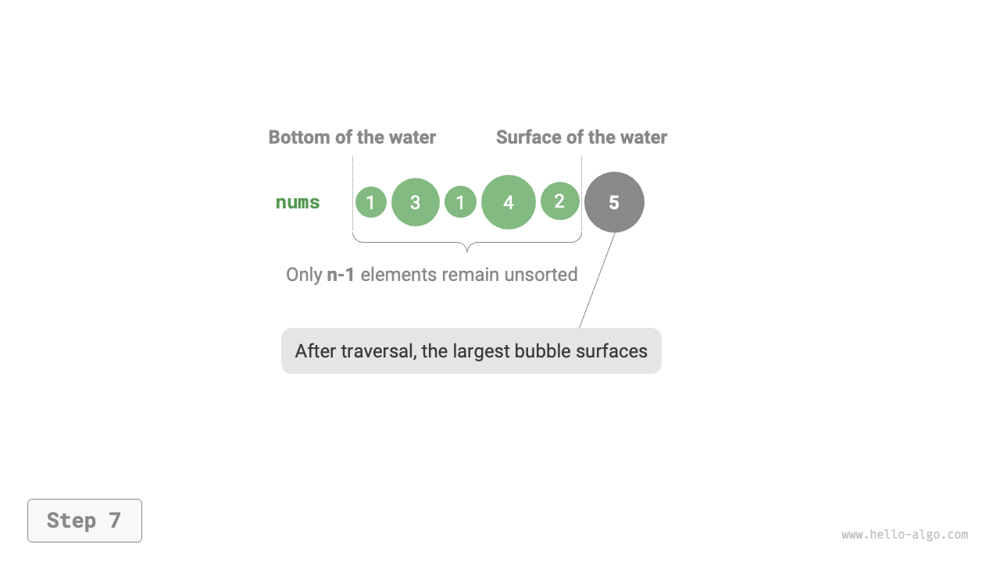
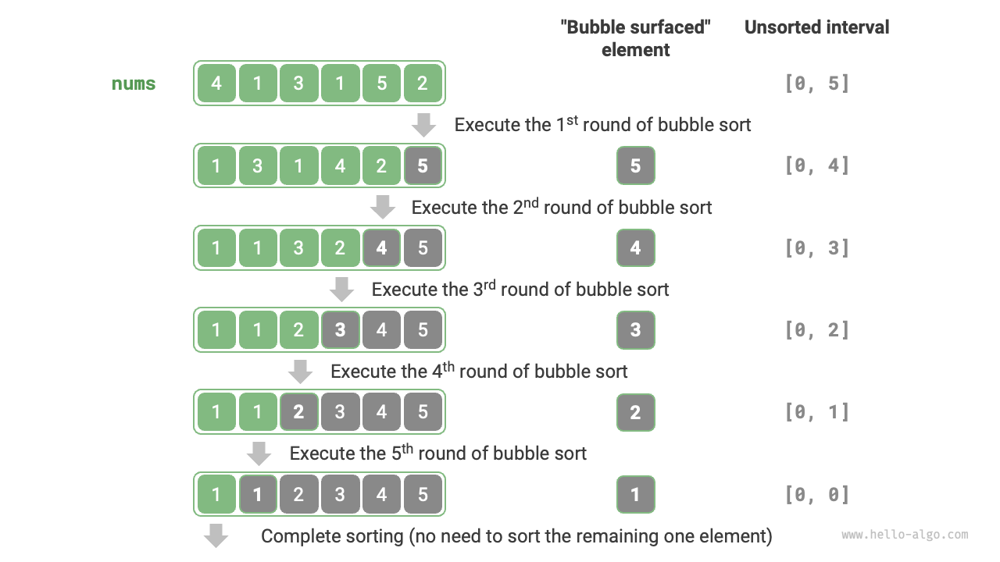

# 11.3 &nbsp; Bubble sort

<u>Bubble sort</u> hoạt động bằng cách liên tục so sánh và hoán đổi các
phần tử liền kề. Quá trình này giống như các bong bóng nổi lên từ dưới
lên trên, do đó có tên là "bubble sort".

Như được minh họa trong Hình 11-4, quá trình nổi bong bóng có thể được
mô phỏng bằng cách sử dụng các lần hoán đổi phần tử: chúng ta bắt đầu
từ đầu ngoài cùng bên trái của array và di chuyển sang phải, so sánh
từng cặp phần tử liền kề. Nếu phần tử bên trái lớn hơn phần tử bên phải,
chúng ta hoán đổi chúng. Sau khi duyệt, phần tử lớn nhất sẽ nổi lên đến
đầu ngoài cùng bên phải của array.

=== "<1>"
    { class="animation-figure" }

=== "<2>"
    { class="animation-figure" }

=== "<3>"
    { class="animation-figure" }

=== "<4>"
    { class="animation-figure" }

=== "<5>"
    { class="animation-figure" }

=== "<6>"
    { class="animation-figure" }

=== "<7>"
    { class="animation-figure" }

<p align="center"> Hình 11-4 &nbsp; Mô phỏng quá trình nổi bong bóng bằng cách hoán đổi phần tử </p>

## 11.3.1 &nbsp; Quy trình thuật toán

Giả sử array có độ dài $n$. Các bước của bubble sort được thể hiện trong Hình 11-5:

1. Đầu tiên, thực hiện một lượt "bubble" trên $n$ phần tử, **hoán đổi phần tử lớn nhất về đúng vị trí của nó**.
2. Tiếp theo, thực hiện một lượt "bubble" trên $n - 1$ phần tử còn lại, **hoán đổi phần tử lớn thứ hai về đúng vị trí của nó**.
3. Tiếp tục theo cách này; sau $n - 1$ lượt như vậy, **$n - 1$ phần tử lớn nhất sẽ được di chuyển về đúng vị trí của chúng**.
4. Phần tử duy nhất còn lại **chắc chắn** là phần tử nhỏ nhất, do đó **không** cần sắp xếp thêm. Tại thời điểm này, array đã được sắp xếp.

{ class="animation-figure" }

<p align="center"> Hình 11-5 &nbsp; Quy trình bubble sort </p>

Ví dụ về code như sau:

=== "Python"

    ```python title="bubble_sort.py"
    def bubble_sort(nums: list[int]):
        """Bubble sort"""
        n = len(nums)
        # Vòng lặp ngoài: khoảng chưa sắp xếp là [0, i]
        for i in range(n - 1, 0, -1):
            # Vòng lặp trong: hoán đổi phần tử lớn nhất trong khoảng chưa sắp xếp [0, i]
            # về cuối bên phải của khoảng
            for j in range(i):
                if nums[j] > nums[j + 1]:
                    # Hoán đổi nums[j] và nums[j + 1]
                    nums[j], nums[j + 1] = nums[j + 1], nums[j]
    ```

=== "C++"

    ```cpp title="bubble_sort.cpp"
    /* Bubble sort */
    void bubbleSort(vector<int> &nums) {
        // Vòng lặp ngoài: khoảng chưa sắp xếp là [0, i]
        for (int i = nums.size() - 1; i > 0; i--) {
            // Vòng lặp trong: hoán đổi phần tử lớn nhất trong khoảng chưa sắp xếp [0, i]
            // về cuối bên phải của khoảng
            for (int j = 0; j < i; j++) {
                if (nums[j] > nums[j + 1]) {
                    // Hoán đổi nums[j] và nums[j + 1]
                    // Ở đây, std
                    swap(nums[j], nums[j + 1]);
                }
            }
        }
    }
    ```

=== "Java"

    ```java title="bubble_sort.java"
    /* Bubble sort */
    void bubbleSort(int[] nums) {
        // Vòng lặp ngoài: khoảng chưa sắp xếp là [0, i]
        for (int i = nums.length - 1; i > 0; i--) {
            // Vòng lặp trong: hoán đổi phần tử lớn nhất trong khoảng chưa sắp xếp [0, i]
            # về cuối bên phải của khoảng
            for (int j = 0; j < i; j++) {
                if (nums[j] > nums[j + 1]) {
                    // Hoán đổi nums[j] và nums[j + 1]
                    int tmp = nums[j];
                    nums[j] = nums[j + 1];
                    nums[j + 1] = tmp;
                }
            }
        }
    }
    ```

=== "C#"

    ```csharp title="bubble_sort.cs"
    [class]{bubble_sort}-[func]{BubbleSort}
    ```

=== "Go"

    ```go title="bubble_sort.go"
    [class]{}-[func]{bubbleSort}
    ```

=== "Swift"

    ```swift title="bubble_sort.swift"
    [class]{}-[func]{bubbleSort}
    ```

=== "JS"

    ```javascript title="bubble_sort.js"
    [class]{}-[func]{bubbleSort}
    ```

=== "TS"

    ```typescript title="bubble_sort.ts"
    [class]{}-[func]{bubbleSort}
    ```

=== "Dart"

    ```dart title="bubble_sort.dart"
    [class]{}-[func]{bubbleSort}
    ```

=== "Rust"

    ```rust title="bubble_sort.rs"
    [class]{}-[func]{bubble_sort}
    ```

=== "C"

    ```c title="bubble_sort.c"
    [class]{}-[func]{bubbleSort}
    ```

=== "Kotlin"

    ```kotlin title="bubble_sort.kt"
    [class]{}-[func]{bubbleSort}
    ```

=== "Ruby"

    ```ruby title="bubble_sort.rb"
    [class]{}-[func]{bubble_sort}
    ```

=== "Zig"

    ```zig title="bubble_sort.zig"
    [class]{}-[func]{bubbleSort}
    ```

## 11.3.2 &nbsp; Tối ưu hóa hiệu suất

Nếu không có thao tác hoán đổi nào xảy ra trong một lượt "nổi bọt",
thì array đã được sắp xếp, vì vậy chúng ta có thể trả về ngay lập tức.
Để phát hiện điều này, chúng ta có thể thêm một biến `flag`; bất cứ
khi nào không có hoán đổi nào được thực hiện trong một lượt, chúng ta
sẽ đặt `flag` và trả về sớm.

Ngay cả với sự tối ưu hóa này, time complexity worst case và time
complexity average case của bubble sort vẫn là $O(n^2)$. Tuy nhiên,
nếu array đầu vào đã được sắp xếp, best case time complexity có thể
thấp tới $O(n)$.

=== "Python"

    ```python title="bubble_sort.py"
    def bubble_sort_with_flag(nums: list[int]):
        """Bubble sort (tối ưu hóa bằng flag)"""
        n = len(nums)
        # Vòng lặp ngoài: phạm vi chưa sắp xếp là [0, i]
        for i in range(n - 1, 0, -1):
            flag = False  # Khởi tạo flag
            # Vòng lặp trong: hoán đổi phần tử lớn nhất trong phạm vi chưa sắp xếp [0, i] về phía cuối bên phải của phạm vi
            for j in range(i):
                if nums[j] > nums[j + 1]:
                    # Hoán đổi nums[j] và nums[j + 1]
                    nums[j], nums[j + 1] = nums[j + 1], nums[j]
                    flag = True  # Ghi nhận các phần tử đã hoán đổi
            if not flag:
                break  # Nếu không có phần tử nào được hoán đổi trong lượt "nổi bọt" này, thì thoát
    ```

=== "C++"

    ```cpp title="bubble_sort.cpp"
    /* Bubble sort (tối ưu hóa bằng flag)*/
    void bubbleSortWithFlag(vector<int> &nums) {
        // Vòng lặp ngoài: phạm vi chưa sắp xếp là [0, i]
        for (int i = nums.size() - 1; i > 0; i--) {
            bool flag = false; // Khởi tạo flag
            // Vòng lặp trong: hoán đổi phần tử lớn nhất trong phạm vi chưa sắp xếp [0, i] về phía cuối bên phải của phạm vi
            for (int j = 0; j < i; j++) {
                if (nums[j] > nums[j + 1]) {
                    // Hoán đổi nums[j] và nums[j + 1]
                    // Ở đây, std
                    swap(nums[j], nums[j + 1]);
                    flag = true; // Ghi nhận các phần tử đã hoán đổi
                }
            }
            if (!flag)
                break; // Nếu không có phần tử nào được hoán đổi trong lượt "nổi bọt" này, thì thoát
        }
    }
    ```

=== "Java"

    ```java title="bubble_sort.java"
    /* Bubble sort (tối ưu hóa bằng flag) */
    void bubbleSortWithFlag(int[] nums) {
        // Vòng lặp ngoài: phạm vi chưa sắp xếp là [0, i]
        for (int i = nums.length - 1; i > 0; i--) {
            boolean flag = false; // Khởi tạo flag
            // Vòng lặp trong: hoán đổi phần tử lớn nhất trong phạm vi chưa sắp xếp [0, i] về phía cuối bên phải của phạm vi
            for (int j = 0; j < i; j++) {
                if (nums[j] > nums[j + 1]) {
                    // Hoán đổi nums[j] và nums[j + 1]
                    int tmp = nums[j];
                    nums[j] = nums[j + 1];
                    nums[j + 1] = tmp;
                    flag = true; // Ghi nhận các phần tử đã hoán đổi
                }
            }
            if (!flag)
                break; // Nếu không có phần tử nào được hoán đổi trong lượt "nổi bọt" này, thì thoát
        }
    }
    ```

=== "C#"

    ```csharp title="bubble_sort.cs"
    [class]{bubble_sort}-[func]{BubbleSortWithFlag}
    ```

=== "Go"

    ```go title="bubble_sort.go"
    [class]{}-[func]{bubbleSortWithFlag}
    ```

=== "Swift"

    ```swift title="bubble_sort.swift"
    [class]{}-[func]{bubbleSortWithFlag}
    ```

=== "JS"

    ```javascript title="bubble_sort.js"
    [class]{}-[func]{bubbleSortWithFlag}
    ```

=== "TS"

    ```typescript title="bubble_sort.ts"
    [class]{}-[func]{bubbleSortWithFlag}
    ```

=== "Dart"

    ```dart title="bubble_sort.dart"
    [class]{}-[func]{bubbleSortWithFlag}
    ```

=== "Rust"

    ```rust title="bubble_sort.rs"
    [class]{}-[func]{bubble_sort_with_flag}
    ```

=== "C"

    ```c title="bubble_sort.c"
    [class]{}-[func]{bubbleSortWithFlag}
    ```

=== "Kotlin"

    ```kotlin title="bubble_sort.kt"
    [class]{}-[func]{bubbleSortWithFlag}
    ```

=== "Ruby"

    ```ruby title="bubble_sort.rb"
    [class]{}-[func]{bubble_sort_with_flag}
    ```

=== "Zig"

    ```zig title="bubble_sort.zig"
    [class]{}-[func]{bubbleSortWithFlag}
    ```

## 11.3.3 &nbsp; Đặc tính của thuật toán

- **Time complexity $O(n^2)$, sắp xếp thích nghi.** Mỗi vòng "sủi bọt" duyệt qua các
  phân đoạn của array với độ dài $n - 1$, $n - 2$, $\dots$, $2$, $1$, tổng cộng là
  $(n - 1) n / 2$. Với một tối ưu hóa bằng `flag`, best-case time complexity
  có thể đạt $O(n)$ khi array đã được sắp xếp.
- **Space complexity $O(1)$, sắp xếp tại chỗ.** Chỉ một lượng không gian bổ sung
  hằng số được sử dụng bởi các con trỏ $i$ và $j$.
- **Sắp xếp ổn định.** Bởi vì các phần tử bằng nhau không được hoán đổi trong
  quá trình "sủi bọt", thứ tự ban đầu của chúng được bảo toàn, điều này làm
  cho nó trở thành một sắp xếp ổn định.
