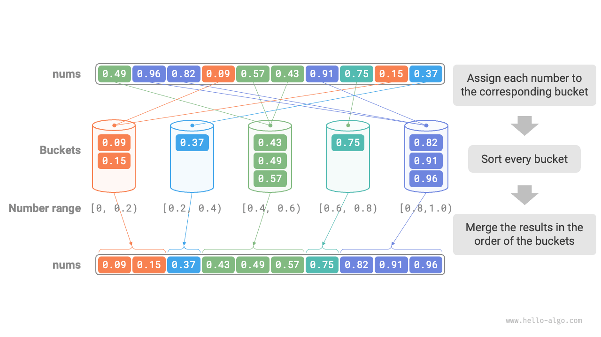
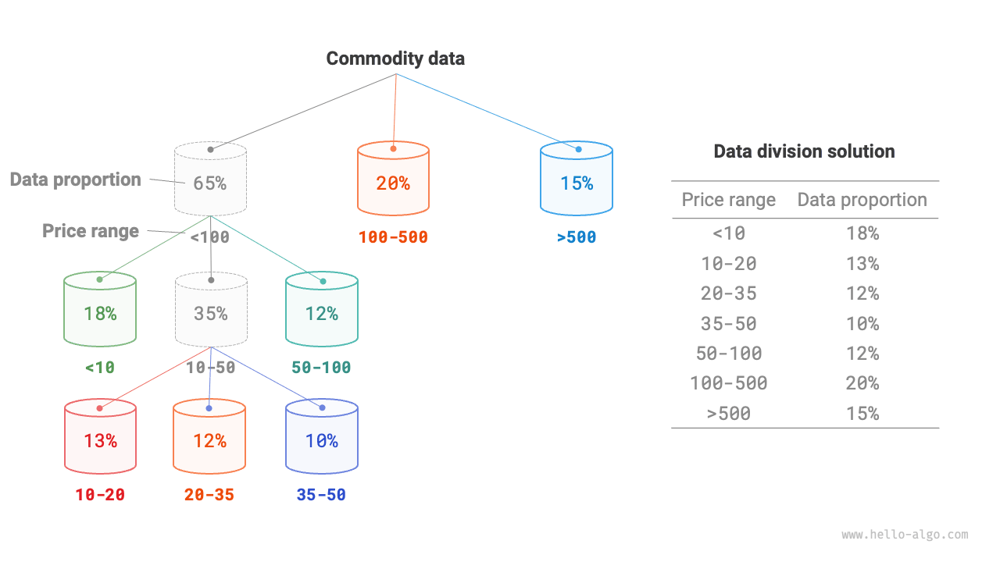
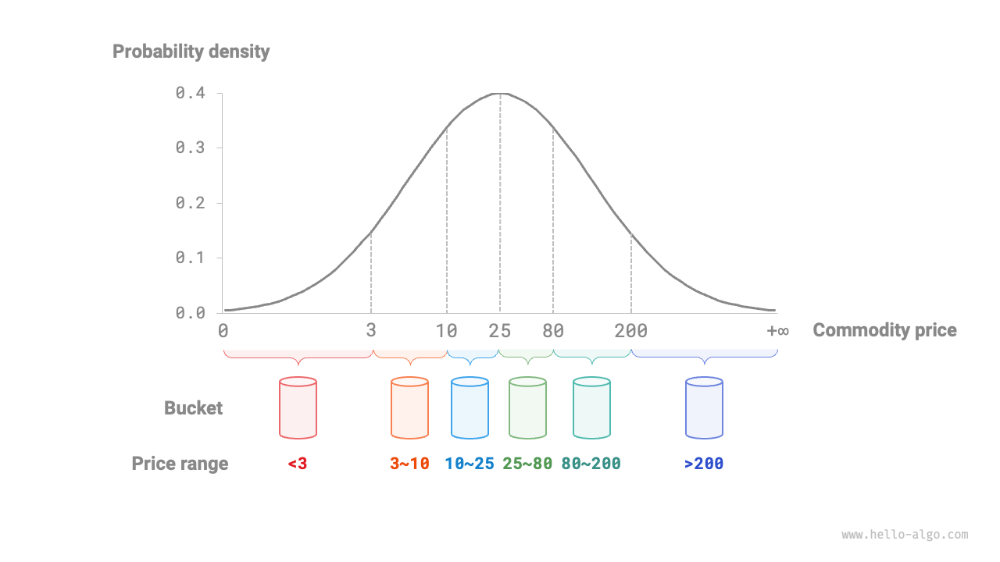

# 11.8 &nbsp; Bucket sort

Các thuật toán sắp xếp đã được đề cập trước đây đều là các "thuật toán sắp xếp
dựa trên so sánh", sắp xếp các phần tử bằng cách so sánh giá trị của chúng.
Các thuật toán sắp xếp như vậy không thể có time complexity tốt hơn
$O(n \log n)$. Tiếp theo, chúng ta sẽ thảo luận về một số "thuật toán sắp
xếp không dựa trên so sánh" có thể đạt được time complexity tuyến tính.

<u>Bucket sort (sắp xếp theo thùng)</u> là một ứng dụng điển hình của chiến
lược chia để trị. Nó hoạt động bằng cách thiết lập một loạt các thùng có
thứ tự, mỗi thùng chứa một phạm vi dữ liệu, và phân phối dữ liệu đầu vào
đều khắp các thùng này. Sau đó, dữ liệu trong mỗi thùng được sắp xếp riêng
lẻ. Cuối cùng, dữ liệu đã sắp xếp từ tất cả các thùng được trộn theo trình
tự để tạo ra kết quả cuối cùng.

## 11.8.1 &nbsp; Quy trình thuật toán

Xét một array có độ dài $n$, với các số float trong phạm vi $[0, 1)$.
Quy trình bucket sort được minh họa trong Hình 11-13.

1. Khởi tạo $k$ bucket và phân phối $n$ phần tử vào $k$ bucket này.
2. Sắp xếp từng bucket riêng lẻ (sử dụng hàm sắp xếp tích hợp sẵn của
ngôn ngữ lập trình).
3. Trộn các kết quả theo thứ tự từ bucket nhỏ nhất đến lớn nhất.

{ class="animation-figure" }

<p align="center"> Hình 11-13 &nbsp; Quy trình thuật toán bucket sort </p>

Code được hiển thị như sau:

=== "Python"

    ```python title="bucket_sort.py"
    def bucket_sort(nums: list[float]):
        """Bucket sort"""
        # Khởi tạo k = n/2 bucket, dự kiến phân bổ 2 phần tử mỗi bucket
        k = len(nums) // 2
        buckets = [[] for _ in range(k)]
        # 1. Phân phối các phần tử array vào các bucket khác nhau
        for num in nums:
            # Phạm vi dữ liệu đầu vào là [0, 1), sử dụng num * k để ánh xạ tới phạm vi index [0, k-1]
            i = int(num * k)
            # Thêm num vào bucket i
            buckets[i].append(num)
        # 2. Sắp xếp từng bucket
        for bucket in buckets:
            # Sử dụng hàm sắp xếp tích hợp sẵn, cũng có thể thay thế bằng các thuật toán sắp xếp khác
            bucket.sort()
        # 3. Duyệt các bucket để trộn kết quả
        i = 0
        for bucket in buckets:
            for num in bucket:
                nums[i] = num
                i += 1
    ```

=== "C++"

    ```cpp title="bucket_sort.cpp"
    /* Bucket sort */
    void bucketSort(vector<float> &nums) {
        // Khởi tạo k = n/2 bucket, dự kiến phân bổ 2 phần tử mỗi bucket
        int k = nums.size() / 2;
        vector<vector<float>> buckets(k);
        // 1. Phân phối các phần tử array vào các bucket khác nhau
        for (float num : nums) {
            // Phạm vi dữ liệu đầu vào là [0, 1), sử dụng num * k để ánh xạ tới phạm vi index [0, k-1]
            int i = num * k;
            // Thêm số vào bucket_idx
            buckets[i].push_back(num);
        }
        // 2. Sắp xếp từng bucket
        for (vector<float> &bucket : buckets) {
            // Sử dụng hàm sắp xếp tích hợp sẵn, cũng có thể thay thế bằng các thuật toán sắp xếp khác
            sort(bucket.begin(), bucket.end());
        }
        // 3. Duyệt các bucket để trộn kết quả
        int i = 0;
        for (vector<float> &bucket : buckets) {
            for (float num : bucket) {
                nums[i++] = num;
            }
        }
    }
    ```

=== "Java"

    ```java title="bucket_sort.java"
    /* Bucket sort */
    void bucketSort(float[] nums) {
        // Khởi tạo k = n/2 bucket, dự kiến phân bổ 2 phần tử mỗi bucket
        int k = nums.length / 2;
        List<List<Float>> buckets = new ArrayList<>();
        for (int i = 0; i < k; i++) {
            buckets.add(new ArrayList<>());
        }
        // 1. Phân phối các phần tử array vào các bucket khác nhau
        for (float num : nums) {
            // Phạm vi dữ liệu đầu vào là [0, 1), sử dụng num * k để ánh xạ
            // tới phạm vi chỉ số [0, k-1]
            int i = (int) (num * k);
            // Thêm num vào bucket i
            buckets.get(i).add(num);
        }
        // 2. Sắp xếp từng bucket
        for (List<Float> bucket : buckets) {
            // Sử dụng hàm sắp xếp có sẵn, cũng có thể thay thế bằng các
            // thuật toán sắp xếp khác
            Collections.sort(bucket);
        }
        // 3. Duyệt các bucket để trộn kết quả
        int i = 0;
        for (List<Float> bucket : buckets) {
            for (float num : bucket) {
                nums[i++] = num;
            }
        }
    }
    ```

=== "C#"

    ```csharp title="bucket_sort.cs"
    [class]{bucket_sort}-[func]{BucketSort}
    ```

=== "Go"

    ```go title="bucket_sort.go"
    [class]{}-[func]{bucketSort}
    ```

=== "Swift"

    ```swift title="bucket_sort.swift"
    [class]{}-[func]{bucketSort}
    ```

=== "JS"

    ```javascript title="bucket_sort.js"
    [class]{}-[func]{bucketSort}
    ```

=== "TS"

    ```typescript title="bucket_sort.ts"
    [class]{}-[func]{bucketSort}
    ```

=== "Dart"

    ```dart title="bucket_sort.dart"
    [class]{}-[func]{bucketSort}
    ```

=== "Rust"

    ```rust title="bucket_sort.rs"
    [class]{}-[func]{bucket_sort}
    ```

=== "C"

    ```c title="bucket_sort.c"
    [class]{}-[func]{bucketSort}
    ```

=== "Kotlin"

    ```kotlin title="bucket_sort.kt"
    [class]{}-[func]{bucketSort}
    ```

=== "Ruby"

    ```ruby title="bucket_sort.rb"
    [class]{}-[func]{bucket_sort}
    ```

=== "Zig"

    ```zig title="bucket_sort.zig"
    [class]{}-[func]{bucketSort}
    ```

## 11.8.2 &nbsp; Đặc điểm thuật toán

Bucket sort phù hợp để xử lý các tập dữ liệu rất lớn. Ví dụ, nếu dữ liệu
đầu vào bao gồm 1 triệu phần tử và các hạn chế về bộ nhớ hệ thống ngăn
không cho tải tất cả dữ liệu cùng một lúc, bạn có thể chia dữ liệu thành
1.000 bucket và sắp xếp từng bucket riêng biệt trước khi trộn các kết quả.

- **Time complexity là $O(n + k)$**: Giả sử các phần tử được phân bố
    đều qua các bucket, số lượng phần tử trong mỗi bucket là $n/k$. Giả
    sử việc sắp xếp một bucket mất $O(n/k \log(n/k))$ time, thì việc sắp
    xếp tất cả các bucket mất $O(n \log(n/k))$ time. **Khi số lượng
    bucket $k$ tương đối lớn, time complexity tiến gần đến $O(n)$**.
    Việc trộn các kết quả yêu cầu duyệt qua tất cả các bucket và phần tử,
    mất $O(n + k)$ time. Trong worst case, tất cả dữ liệu được phân phối
    vào một bucket duy nhất, và việc sắp xếp bucket đó mất $O(n^2)$ time.
- **Space complexity là $O(n + k)$, sắp xếp không tại chỗ**: Nó yêu
    cầu không gian bổ sung cho $k$ bucket và tổng cộng $n$ phần tử.
- Việc bucket sort có ổn định hay không phụ thuộc vào việc thuật toán
    sắp xếp được sử dụng trong mỗi bucket có ổn định hay không.

## 11.8.3 &nbsp; Làm thế nào để đạt được phân phối đều

Độ phức tạp thời gian theo lý thuyết của thuật toán bucket sort có thể đạt tới $O(n)$.
**Chìa khóa là phân phối các phần tử đều khắp các bucket** vì dữ liệu thực tế
thường không được phân phối đều. Ví dụ, chúng ta có thể muốn phân phối đều
tất cả các sản phẩm trên eBay theo khoảng giá vào 10 bucket. Tuy nhiên,
sự phân phối giá sản phẩm có thể không đều, với nhiều sản phẩm dưới $100
và ít sản phẩm trên $500. Nếu khoảng giá được chia đều thành 10, sự khác biệt
về số lượng sản phẩm trong mỗi bucket sẽ rất đáng kể.

Để đạt được phân phối đều, chúng ta có thể ban đầu đặt một ranh giới gần đúng
để chia dữ liệu thành khoảng 3 bucket. **Sau khi quá trình phân phối hoàn tất,
các bucket có nhiều mục hơn có thể được chia nhỏ thêm thành 3 bucket, cho đến
khi số lượng phần tử trong tất cả các bucket gần bằng nhau**.

Như được minh họa trong Hình 11-14, phương pháp này về cơ bản xây dựng một
recursive tree, nhằm mục đích đảm bảo số lượng phần tử trong leaf node là đều
nhất có thể. Tất nhiên, bạn không nhất thiết phải chia dữ liệu thành 3 bucket
mỗi vòng lặp - chiến lược phân hoạch có thể được điều chỉnh linh hoạt theo
các đặc điểm riêng của dữ liệu.

{ class="animation-figure" }

<p align="center"> Hình 11-14 &nbsp; Phân chia bucket đệ quy </p>

Nếu chúng ta biết trước probability distribution của giá sản phẩm,
**chúng ta có thể đặt các ranh giới giá cho mỗi bucket dựa trên probability
distribution của dữ liệu**. Cần lưu ý rằng không nhất thiết phải tính toán
cụ thể sự phân phối dữ liệu; thay vào đó, nó có thể được ước tính dựa trên
các đặc điểm dữ liệu bằng cách sử dụng một mô hình xác suất.

Như được minh họa trong Hình 11-15, giả sử rằng giá sản phẩm tuân theo một
normal distribution, chúng ta có thể định nghĩa các khoảng giá hợp lý để
cân bằng sự phân phối các mục trên các bucket.

{ class="animation-figure" }

<p align="center"> Hình 11-15 &nbsp; Chia bucket dựa trên probability distribution </p>
