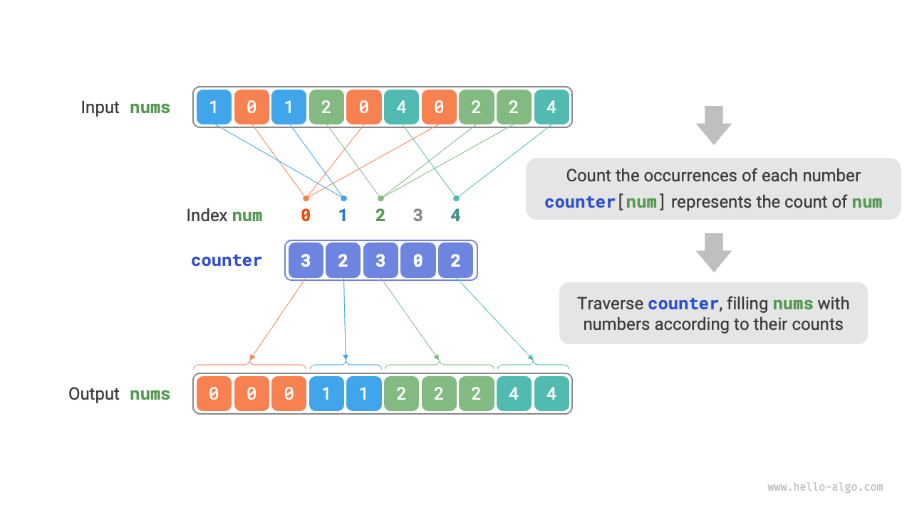
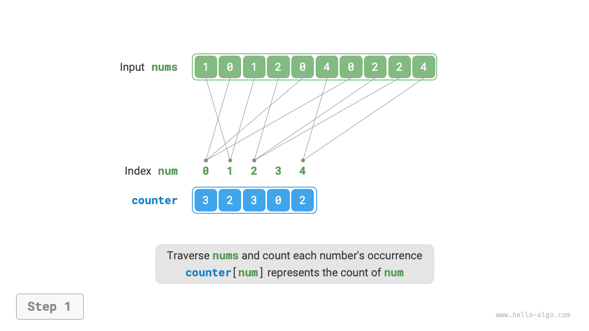
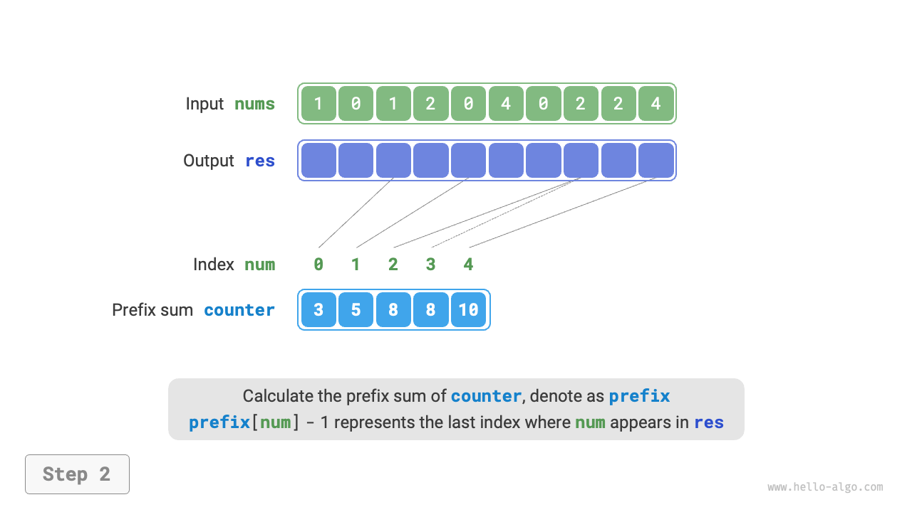
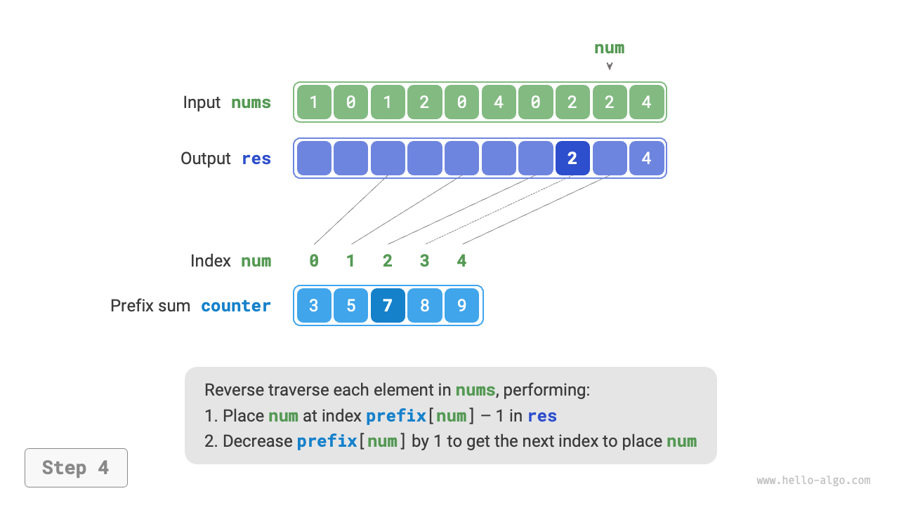
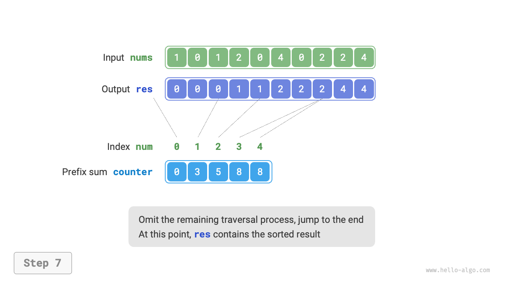
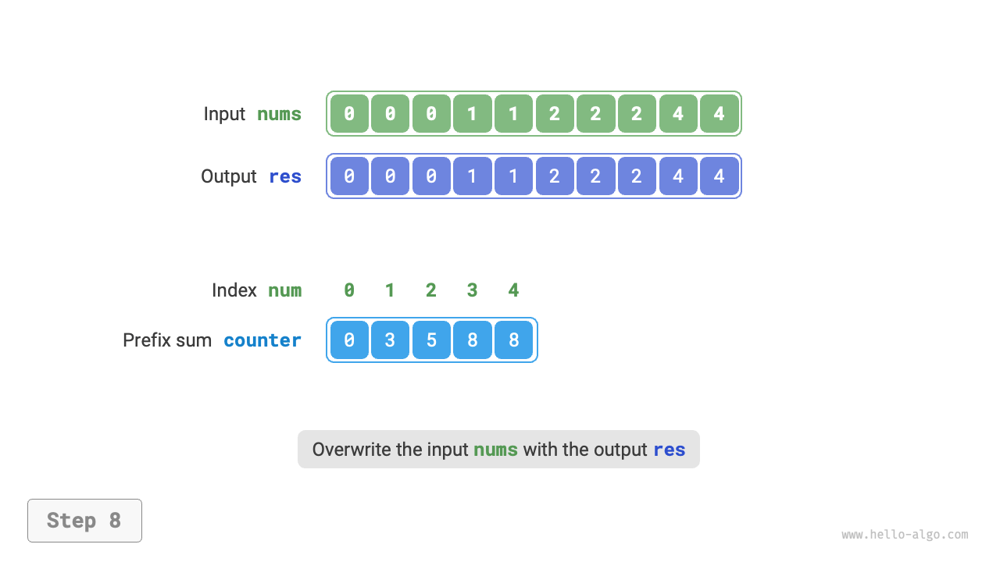

# 11.9 &nbsp; Counting sort

<u>Counting sort</u> thực hiện sắp xếp bằng cách đếm số lượng phần tử, thường được áp dụng cho các array số nguyên.

## 11.9.1 &nbsp; Cách triển khai đơn giản

Chúng ta hãy bắt đầu với một ví dụ đơn giản. Cho một array `nums` có độ dài $n$,
trong đó tất cả các phần tử là "số nguyên không âm", quá trình tổng thể của
counting sort được thể hiện trong Hình 11-16.

1. Duyệt qua array để tìm số lớn nhất, ký hiệu là $m$, sau đó tạo một
auxiliary array `counter` có độ dài $m + 1$.
2. **Sử dụng `counter` để đếm số lần xuất hiện của mỗi số trong `nums`**,
trong đó `counter[num]` tương ứng với số lần xuất hiện của số `num`.
Phương pháp đếm đơn giản, chỉ cần duyệt qua `nums` (giả sử số hiện tại
là `num`), và tăng `counter[num]` lên $1$ mỗi vòng.
3. **Vì các chỉ số của `counter` được sắp xếp một cách tự nhiên, tất cả
các số về cơ bản đã được sắp xếp sẵn**. Tiếp theo, chúng ta duyệt qua
`counter`, và điền các phần tử vào `nums` theo thứ tự tăng dần của
số lần xuất hiện.

{ class="animation-figure" }

<p align="center"> Hình 11-16 &nbsp; Quá trình counting sort </p>

Code được thể hiện dưới đây:

=== "Python"

    ```python title="counting_sort.py"
    def counting_sort_naive(nums: list[int]):
        """Counting sort"""
        # Cách triển khai đơn giản, không thể dùng để sắp xếp các đối tượng
        # 1. Đếm phần tử lớn nhất m trong array
        m = 0
        for num in nums:
            m = max(m, num)
        # 2. Đếm số lần xuất hiện của mỗi chữ số
        # counter[num] biểu thị số lần xuất hiện của num
        counter = [0] * (m + 1)
        for num in nums:
            counter[num] += 1
        # 3. Duyệt qua counter, điền từng phần tử trở lại vào array nums ban đầu
        i = 0
        for num in range(m + 1):
            for _ in range(counter[num]):
                nums[i] = num
                i += 1
    ```

=== "C++"

    ```cpp title="counting_sort.cpp"
    /* Counting sort */
    // Cách triển khai đơn giản, không thể dùng để sắp xếp các đối tượng
    void countingSortNaive(vector<int> &nums) {
        // 1. Đếm phần tử lớn nhất m trong array
        int m = 0;
        for (int num : nums) {
            m = max(m, num);
        }
        // 2. Đếm số lần xuất hiện của mỗi chữ số
        // counter[num] biểu thị số lần xuất hiện của num
        vector<int> counter(m + 1, 0);
        for (int num : nums) {
            counter[num]++;
        }
        // 3. Duyệt qua counter, điền từng phần tử trở lại vào array nums ban đầu
        int i = 0;
        for (int num = 0; num < m + 1; num++) {
            for (int j = 0; j < counter[num]; j++, i++) {
                nums[i] = num;
            }
        }
    }
    ```

=== "Java"

    ```java title="counting_sort.java"
    /* counting sort */
    // Triển khai đơn giản, không thể dùng để sắp xếp các object
    void countingSortNaive(int[] nums) {
        // 1. Đếm phần tử lớn nhất m trong array
        int m = 0;
        for (int num : nums) {
            m = Math.max(m, num);
        }
        // 2. Đếm số lần xuất hiện của mỗi chữ số
        // counter[num] biểu thị số lần xuất hiện của num
        int[] counter = new int[m + 1];
        for (int num : nums) {
            counter[num]++;
        }
        // 3. Duyệt qua counter, điền từng phần tử trở lại array gốc nums
        int i = 0;
        for (int num = 0; num < m + 1; num++) {
            for (int j = 0; j < counter[num]; j++, i++) {
                nums[i] = num;
            }
        }
    }
    ```

=== "C#"

    ```csharp title="counting_sort.cs"
    [class]{counting_sort}-[func]{CountingSortNaive}
    ```

=== "Go"

    ```go title="counting_sort.go"
    [class]{}-[func]{countingSortNaive}
    ```

=== "Swift"

    ```swift title="counting_sort.swift"
    [class]{}-[func]{countingSortNaive}
    ```

=== "JS"

    ```javascript title="counting_sort.js"
    [class]{}-[func]{countingSortNaive}
    ```

=== "TS"

    ```typescript title="counting_sort.ts"
    [class]{}-[func]{countingSortNaive}
    ```

=== "Dart"

    ```dart title="counting_sort.dart"
    [class]{}-[func]{countingSortNaive}
    ```

=== "Rust"

    ```rust title="counting_sort.rs"
    [class]{}-[func]{counting_sort_naive}
    ```

=== "C"

    ```c title="counting_sort.c"
    [class]{}-[func]{countingSortNaive}
    ```

=== "Kotlin"

    ```kotlin title="counting_sort.kt"
    [class]{}-[func]{countingSortNaive}
    ```

=== "Ruby"

    ```ruby title="counting_sort.rb"
    [class]{}-[func]{counting_sort_naive}
    ```

=== "Zig"

    ```zig title="counting_sort.zig"
    [class]{}-[func]{countingSortNaive}
    ```

!!! note "Mối liên hệ giữa counting sort và bucket sort"

    Từ góc nhìn của bucket sort, chúng ta có thể xem mỗi chỉ số của mảng đếm
    `counter` trong counting sort là một bucket, và quá trình đếm là việc
    phân phối các phần tử vào các bucket tương ứng. Về bản chất, counting sort
    là một trường hợp đặc biệt của bucket sort dành cho dữ liệu số nguyên.

## 11.9.2 &nbsp; Triển khai hoàn chỉnh

Những độc giả tinh ý có thể nhận thấy, **nếu dữ liệu đầu vào là một object,
bước `3.` ở trên là không hợp lệ**. Giả sử dữ liệu đầu vào là một object
sản phẩm, chúng ta muốn sắp xếp các sản phẩm theo giá (một biến thành viên
của lớp), nhưng thuật toán trên chỉ có thể đưa ra kết quả là giá đã được
sắp xếp.

Vậy làm thế nào chúng ta có thể nhận được kết quả sắp xếp cho dữ liệu gốc?
Đầu tiên, chúng ta tính toán "prefix sum" (tổng tiền tố) của `counter`.
Đúng như tên gọi, prefix sum tại chỉ số `i`, `prefix[i]`, bằng tổng của `i`
phần tử đầu tiên của array:

$$
\text{prefix}[i] = \sum_{j=0}^i \text{counter[j]}
$$

**Prefix sum có một ý nghĩa rõ ràng: `prefix[num] - 1` biểu thị chỉ số
của lần xuất hiện cuối cùng của phần tử `num` trong array kết quả `res`**.
Thông tin này rất quan trọng, vì nó cho chúng ta biết mỗi phần tử nên xuất
hiện ở đâu trong array kết quả. Tiếp theo, chúng ta duyệt từng phần tử `num`
của array gốc `nums` theo thứ tự ngược lại, thực hiện hai bước sau trong mỗi
lần lặp.

1. Điền `num` vào array `res` tại chỉ số `prefix[num] - 1`.
2. Giảm prefix sum `prefix[num]` đi $1$ để có được chỉ số tiếp theo để đặt `num`.

Sau khi duyệt, array `res` chứa kết quả đã sắp xếp, và cuối cùng, `res`
thay thế array gốc `nums`. Quá trình counting sort hoàn chỉnh được thể
hiện trong Hình 11-17.

=== "<1>"
    { class="animation-figure" }

=== "<2>"
    { class="animation-figure" }

=== "<3>"
    { class="animation-figure" }

=== "<4>"
    { class="animation-figure" }

=== "<5>"
    { class="animation-figure" }

=== "<6>"
    { class="animation-figure" }

=== "<7>"
    { class="animation-figure" }

=== "<8>"
    { class="animation-figure" }

<p align="center"> Hình 11-17 &nbsp; Quá trình counting sort </p>

Mã triển khai của counting sort được thể hiện dưới đây:

=== "Python"

    ```python title="counting_sort.py"
    def counting_sort(nums: list[int]):
        """Counting sort"""
        # Triển khai hoàn chỉnh, có thể sắp xếp đối tượng và là một stable sort
        # 1. Đếm phần tử lớn nhất m trong array
        m = max(nums)
        # 2. Đếm số lần xuất hiện của mỗi chữ số
        # counter[num] biểu thị số lần xuất hiện của num
        counter = [0] * (m + 1)
        for num in nums:
            counter[num] += 1
        # 3. Tính tổng tiền tố của counter, chuyển đổi "số lần xuất hiện"
        # thành "chỉ số cuối"
        # counter[num]-1 là chỉ số cuối cùng nơi num xuất hiện trong res
        for i in range(m):
            counter[i + 1] += counter[i]
        # 4. Duyệt nums theo thứ tự ngược lại, đặt mỗi phần tử vào
        # array kết quả res
        # Khởi tạo array res để ghi lại kết quả
        n = len(nums)
        res = [0] * n
        for i in range(n - 1, -1, -1):
            num = nums[i]
            res[counter[num] - 1] = num  # Đặt num vào chỉ số tương ứng
            counter[num] -= 1  # Giảm tổng tiền tố đi 1, lấy chỉ số tiếp theo
                               # để đặt num
        # Sử dụng array kết quả res để ghi đè lên array nums gốc
        for i in range(n):
            nums[i] = res[i]
    ```

=== "C++"

    ```cpp title="counting_sort.cpp"
    /* Counting sort */
    // Triển khai hoàn chỉnh, có thể sắp xếp đối tượng và là một stable sort
    void countingSort(vector<int> &nums) {
        // 1. Đếm phần tử lớn nhất m trong array
        int m = 0;
        for (int num : nums) {
            m = max(m, num);
        }
        // 2. Đếm số lần xuất hiện của mỗi chữ số
        // counter[num] biểu thị số lần xuất hiện của num
        vector<int> counter(m + 1, 0);
        for (int num : nums) {
            counter[num]++;
        }
        // 3. Tính tổng tiền tố của counter, chuyển đổi "số lần xuất hiện"
        // thành "chỉ số cuối"
        // counter[num]-1 là chỉ số cuối cùng nơi num xuất hiện trong res
        for (int i = 0; i < m; i++) {
            counter[i + 1] += counter[i];
        }
        // 4. Duyệt nums theo thứ tự ngược lại, đặt mỗi phần tử vào
        // array kết quả res
        // Khởi tạo array res để ghi lại kết quả
        int n = nums.size();
        vector<int> res(n);
        for (int i = n - 1; i >= 0; i--) {
            int num = nums[i];
            res[counter[num] - 1] = num; // Đặt num vào chỉ số tương ứng
            counter[num]--;              // Giảm tổng tiền tố đi 1, lấy chỉ số tiếp theo
                                         // để đặt num
        }
        // Sử dụng array kết quả res để ghi đè lên array nums gốc
        nums = res;
    }
    ```

=== "Java"

    ```java title="counting_sort.java"
    /* Counting sort */
    // Cách triển khai đầy đủ, có thể sắp xếp các đối tượng và là một sắp xếp ổn định
    void countingSort(int[] nums) {
        // 1. Đếm phần tử tối đa m trong array
        int m = 0;
        for (int num : nums) {
            m = Math.max(m, num);
        }
        // 2. Đếm số lần xuất hiện của mỗi chữ số
        // counter[num] biểu thị số lần xuất hiện của num
        int[] counter = new int[m + 1];
        for (int num : nums) {
            counter[num]++;
        }
        // 3. Tính tổng tiền tố của counter, chuyển đổi "số lượng xuất hiện" thành
        // "chỉ số cuối cùng"
        // counter[num]-1 là chỉ số cuối cùng mà num xuất hiện trong res
        for (int i = 0; i < m; i++) {
            counter[i + 1] += counter[i];
        }
        // 4. Duyệt nums theo thứ tự ngược lại, đặt mỗi phần tử vào array kết quả res
        // Khởi tạo array res để ghi lại kết quả
        int n = nums.length;
        int[] res = new int[n];
        for (int i = n - 1; i >= 0; i--) {
            int num = nums[i];
            res[counter[num] - 1] = num; // Đặt num vào chỉ số tương ứng
            counter[num]--; // Giảm tổng tiền tố đi 1, để có được chỉ số tiếp theo để đặt num
        }
        // Sử dụng array kết quả res để ghi đè lên array gốc nums
        for (int i = 0; i < n; i++) {
            nums[i] = res[i];
        }
    }
    ```

=== "C#"

    ```csharp title="counting_sort.cs"
    [class]{counting_sort}-[func]{CountingSort}
    ```

=== "Go"

    ```go title="counting_sort.go"
    [class]{}-[func]{countingSort}
    ```

=== "Swift"

    ```swift title="counting_sort.swift"
    [class]{}-[func]{countingSort}
    ```

=== "JS"

    ```javascript title="counting_sort.js"
    [class]{}-[func]{countingSort}
    ```

=== "TS"

    ```typescript title="counting_sort.ts"
    [class]{}-[func]{countingSort}
    ```

=== "Dart"

    ```dart title="counting_sort.dart"
    [class]{}-[func]{countingSort}
    ```

=== "Rust"

    ```rust title="counting_sort.rs"
    [class]{}-[func]{counting_sort}
    ```

=== "C"

    ```c title="counting_sort.c"
    [class]{}-[func]{countingSort}
    ```

=== "Kotlin"

    ```kotlin title="counting_sort.kt"
    [class]{}-[func]{countingSort}
    ```

=== "Ruby"

    ```ruby title="counting_sort.rb"
    [class]{}-[func]{counting_sort}
    ```

=== "Zig"

    ```zig title="counting_sort.zig"
    [class]{}-[func]{countingSort}
    ```

## 11.9.3 &nbsp; Đặc điểm của thuật toán

- **Time complexity là $O(n + m)$, thuật toán sắp xếp không thích nghi**: Nó bao gồm
  việc duyệt qua `nums` và `counter`, cả hai đều sử dụng thời gian tuyến tính.
  Thông thường, $n \gg m$, và time complexity có xu hướng về $O(n)$.
- **Space complexity là $O(n + m)$, thuật toán sắp xếp không tại chỗ**: Nó sử dụng
  array `res` có độ dài $n$ và array `counter` có độ dài $m$ tương ứng.
- **Thuật toán sắp xếp ổn định**: Vì các element được điền vào `res` theo thứ tự
  "từ phải sang trái", việc đảo ngược quá trình duyệt `nums` có thể ngăn chặn
  việc thay đổi vị trí tương đối giữa các element bằng nhau, qua đó đạt được một
  thuật toán sắp xếp ổn định. Trên thực tế, duyệt `nums` theo thứ tự cũng có thể
  tạo ra kết quả sắp xếp đúng, nhưng kết quả này không ổn định.

## 11.9.4 &nbsp; Hạn chế

Đến đây, bạn có thể thấy counting sort rất thông minh, vì nó có thể đạt được
sắp xếp hiệu quả chỉ bằng cách đếm số lượng. Tuy nhiên, các điều kiện tiên
quyết để sử dụng counting sort tương đối nghiêm ngặt.

**Counting sort chỉ phù hợp với số nguyên không âm**. Nếu bạn muốn áp dụng nó
cho các kiểu dữ liệu khác, bạn cần đảm bảo rằng các dữ liệu này có thể được
chuyển đổi thành số nguyên không âm mà không làm thay đổi thứ tự ban đầu
của các phần tử. Ví dụ, đối với một array chứa các số nguyên âm, bạn có thể
thêm một hằng số vào tất cả các số, chuyển đổi tất cả chúng thành số dương,
và sau đó chuyển đổi chúng trở lại sau khi quá trình sắp xếp hoàn tất.

**Counting sort phù hợp với tập dữ liệu lớn với phạm vi giá trị nhỏ**. Ví dụ,
trong ví dụ trên, $m$ không nên quá lớn, nếu không, nó sẽ chiếm quá nhiều
không gian. Và khi $n \ll m$, counting sort sử dụng thời gian $O(m)$, điều này
có thể chậm hơn các thuật toán sắp xếp $O(n \log n)$.
